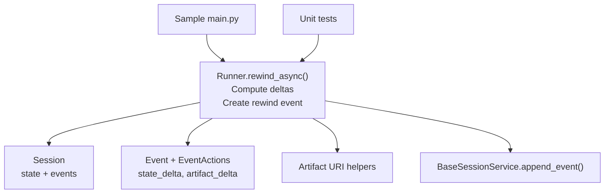
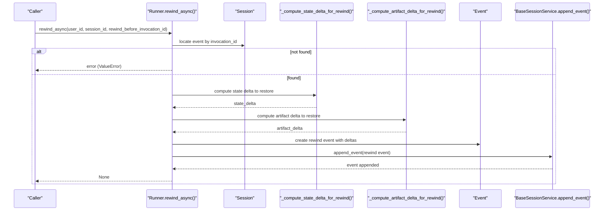
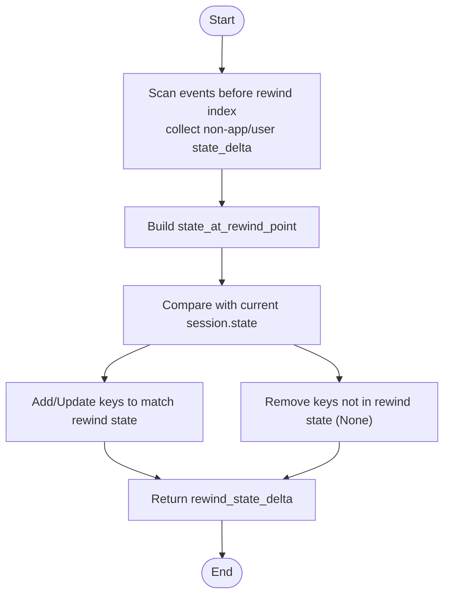
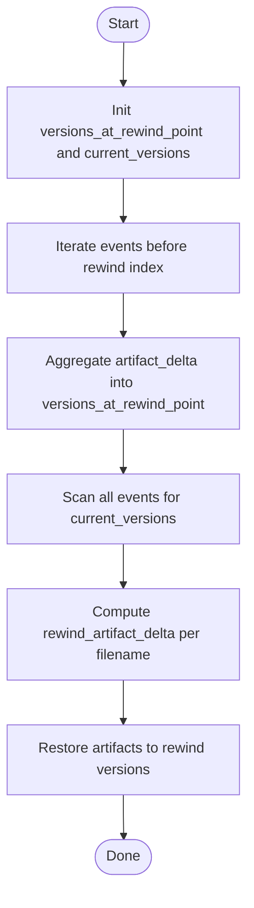
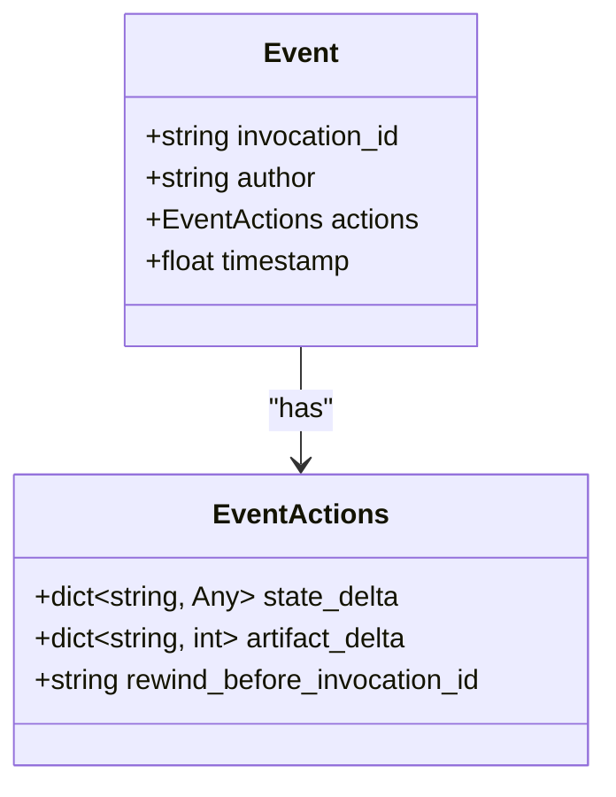
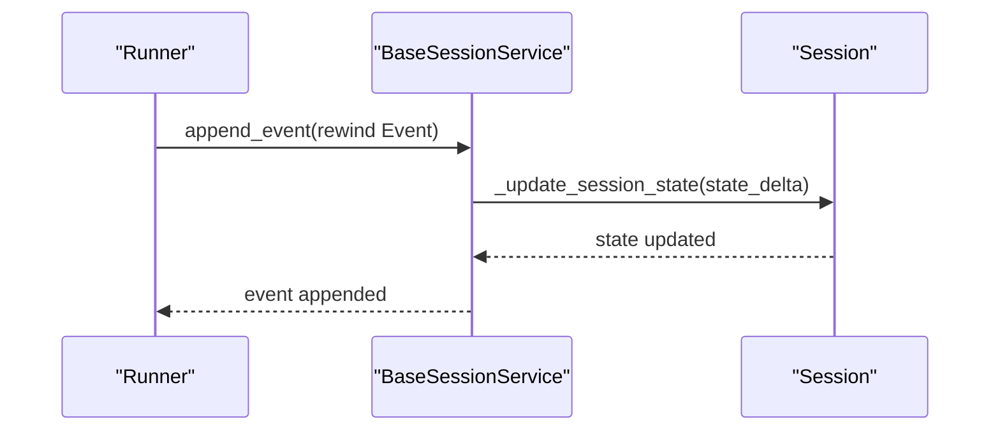
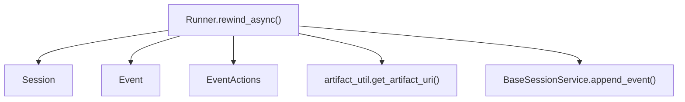

# Rewind Functionality

<cite>
**Referenced Files in This Document**
- [runners.py](file://src/google/adk/runners.py)
- [test_runner_rewind.py](file://tests/unittests/runners/test_runner_rewind.py)
- [main.py](file://contributing/samples/rewind_session/main.py)
- [agent.py](file://contributing/samples/rewind_session/agent.py)
- [event.py](file://src/google/adk/events/event.py)
- [event_actions.py](file://src/google/adk/events/event_actions.py)
- [session.py](file://src/google/adk/sessions/session.py)
- [state.py](file://src/google/adk/sessions/state.py)
- [artifact_util.py](file://src/google/adk/artifacts/artifact_util.py)
- [base_session_service.py](file://src/google/adk/sessions/base_session_service.py)
</cite>

## Table of Contents
1. [Introduction](#introduction)
2. [Project Structure](#project-structure)
3. [Core Components](#core-components)
4. [Architecture Overview](#architecture-overview)
5. [Detailed Component Analysis](#detailed-component-analysis)
6. [Dependency Analysis](#dependency-analysis)
7. [Performance Considerations](#performance-considerations)
8. [Troubleshooting Guide](#troubleshooting-guide)
9. [Conclusion](#conclusion)
10. [Appendices](#appendices)

## Introduction
This document explains the rewind functionality centered on the rewind_async() method. It covers how session rollback and state restoration work, including state delta computation, artifact delta calculation, and rewind event creation. It also documents the rewind_before_invocation_id parameter, the restoration process, limitations and constraints, and practical examples and best practices.

## Project Structure
The rewind feature spans several modules:
- Runner: orchestrates rewind, computes deltas, and appends the rewind event.
- Sessions: stores session state and events; state updates are driven by event actions.
- Events: define the structure of actions (including state_delta and artifact_delta).
- Artifacts: manage artifact URIs and restoration via artifact_service.
- Sample and tests: demonstrate usage and validate behavior.

**Diagram sources**
- [runners.py](file://src/google/adk/runners.py#L623-L758)
- [session.py](file://src/google/adk/sessions/session.py#L27-L51)
- [event.py](file://src/google/adk/events/event.py#L31-L130)
- [event_actions.py](file://src/google/adk/events/event_actions.py#L50-L111)
- [artifact_util.py](file://src/google/adk/artifacts/artifact_util.py#L78-L100)
- [base_session_service.py](file://src/google/adk/sessions/base_session_service.py#L105-L154)
- [main.py](file://contributing/samples/rewind_session/main.py#L90-L167)
- [test_runner_rewind.py](file://tests/unittests/runners/test_runner_rewind.py#L44-L249)

**Section sources**
- [runners.py](file://src/google/adk/runners.py#L623-L758)
- [session.py](file://src/google/adk/sessions/session.py#L27-L51)
- [event.py](file://src/google/adk/events/event.py#L31-L130)
- [event_actions.py](file://src/google/adk/events/event_actions.py#L50-L111)
- [artifact_util.py](file://src/google/adk/artifacts/artifact_util.py#L78-L100)
- [base_session_service.py](file://src/google/adk/sessions/base_session_service.py#L105-L154)
- [main.py](file://contributing/samples/rewind_session/main.py#L90-L167)
- [test_runner_rewind.py](file://tests/unittests/runners/test_runner_rewind.py#L44-L249)

## Core Components
- rewind_async(): Validates the target invocation, computes state and artifact deltas, creates a rewind event, and appends it to the session.
- State delta computation: Builds the effective state at the rewind point and compares against current state to produce a delta that restores it.
- Artifact delta computation: Computes which artifacts changed after the rewind point, restores them to their versions at the rewind point, and marks new artifacts as inaccessible.
- Rewind event: Carries rewind_before_invocation_id, state_delta, and artifact_delta for session replay.

**Section sources**
- [runners.py](file://src/google/adk/runners.py#L623-L758)
- [state.py](file://src/google/adk/sessions/state.py#L20-L82)
- [event_actions.py](file://src/google/adk/events/event_actions.py#L66-L71)

## Architecture Overview
The rewind process is initiated by a caller specifying rewind_before_invocation_id. The Runner locates the target event, computes deltas, and appends a rewind event that instructs downstream systems to restore state and artifacts.

**Diagram sources**
- [runners.py](file://src/google/adk/runners.py#L623-L758)
- [base_session_service.py](file://src/google/adk/sessions/base_session_service.py#L105-L154)
- [event.py](file://src/google/adk/events/event.py#L31-L130)
- [event_actions.py](file://src/google/adk/events/event_actions.py#L50-L111)

## Detailed Component Analysis

### rewind_async() Method
- Purpose: Roll back a session to the state and artifacts that existed strictly before a specified invocation.
- Inputs:
  - user_id: identifies the user’s data.
  - session_id: identifies the session.
  - rewind_before_invocation_id: the invocation ID marking the rewind boundary (rollback occurs before this event).
- Behavior:
  - Locates the target event by invocation_id.
  - Computes state_delta and artifact_delta.
  - Creates a rewind Event with rewind_before_invocation_id, state_delta, and artifact_delta.
  - Appends the rewind event to the session.

Key implementation paths:
- rewind_async(): [runners.py](file://src/google/adk/runners.py#L623-L668)
- _compute_state_delta_for_rewind(): [runners.py](file://src/google/adk/runners.py#L670-L702)
- _compute_artifact_delta_for_rewind(): [runners.py](file://src/google/adk/runners.py#L704-L758)

**Section sources**
- [runners.py](file://src/google/adk/runners.py#L623-L758)

### State Delta Computation
- Goal: Determine the minimal state changes to revert to the state at rewind point.
- Process:
  - Build state_at_rewind_point by iterating events before rewind_event_index and collecting non-app/user-scoped keys.
  - Compare state_at_rewind_point with current session.state to compute rewind_state_delta:
    - Add/update keys present at rewind point.
    - Remove keys not present at rewind point (mark with None).
- Notes:
  - Keys starting with app: or user: are excluded from state deltas.
  - The resulting delta is applied to the session state.

**Diagram sources**
- [runners.py](file://src/google/adk/runners.py#L670-L702)
- [state.py](file://src/google/adk/sessions/state.py#L23-L25)

**Section sources**
- [runners.py](file://src/google/adk/runners.py#L670-L702)
- [state.py](file://src/google/adk/sessions/state.py#L23-L25)

### Artifact Delta Calculation and Restoration
- Goal: Restore artifacts to their versions at the rewind point and mark newly introduced artifacts as inaccessible.
- Process:
  - Build versions_at_rewind_point by aggregating artifact_delta from events before rewind_event_index.
  - Track current_versions from all events’ artifact_delta.
  - For each artifact filename:
    - Skip filenames starting with user:.
    - If version changed after rewind point, restore to version at rewind point.
    - If artifact did not exist at rewind point, mark as inaccessible (empty blob).
  - Restore artifacts via artifact_service.save_artifact() using artifact_util.get_artifact_uri().
- Notes:
  - Artifact URIs follow a canonical pattern with app_name, user_id, optional session_id, filename, and version.

**Diagram sources**
- [runners.py](file://src/google/adk/runners.py#L704-L758)
- [artifact_util.py](file://src/google/adk/artifacts/artifact_util.py#L78-L100)

**Section sources**
- [runners.py](file://src/google/adk/runners.py#L704-L758)
- [artifact_util.py](file://src/google/adk/artifacts/artifact_util.py#L78-L100)

### Rewind Event Creation and Persistence
- Rewind event fields:
  - author: user
  - actions.rewind_before_invocation_id: the target invocation ID
  - actions.state_delta: computed state delta
  - actions.artifact_delta: computed artifact delta
- Persistence: appended via BaseSessionService.append_event(), which applies state and trims temp-scoped keys.

**Diagram sources**
- [event.py](file://src/google/adk/events/event.py#L31-L130)
- [event_actions.py](file://src/google/adk/events/event_actions.py#L50-L111)

**Section sources**
- [event.py](file://src/google/adk/events/event.py#L31-L130)
- [event_actions.py](file://src/google/adk/events/event_actions.py#L50-L111)
- [base_session_service.py](file://src/google/adk/sessions/base_session_service.py#L105-L154)

### Rewind Target Determination: rewind_before_invocation_id
- rewind_before_invocation_id specifies the boundary event.
- Rewind rolls back to the state and artifacts that existed strictly before this event.
- If the invocation ID is not found, rewind_async() raises a ValueError.

Validation and error handling:
- [runners.py](file://src/google/adk/runners.py#L634-L643)

**Section sources**
- [runners.py](file://src/google/adk/runners.py#L634-L643)

### State Restoration Process
- The session state is a dictionary maintained by the Session.
- State deltas are applied by BaseSessionService.append_event(), which updates session.state based on event.actions.state_delta.
- During rewind, the computed state_delta is appended as a rewind event; downstream logic should apply this delta to reach the desired state.

**Diagram sources**
- [base_session_service.py](file://src/google/adk/sessions/base_session_service.py#L148-L154)
- [session.py](file://src/google/adk/sessions/session.py#L44-L45)

**Section sources**
- [base_session_service.py](file://src/google/adk/sessions/base_session_service.py#L148-L154)
- [session.py](file://src/google/adk/sessions/session.py#L44-L45)

### Artifact Restoration Process
- For each artifact filename, the system restores the version recorded at the rewind point.
- Artifacts scoped with user: are intentionally not restored on rewind.
- Newly created artifacts after the rewind point are marked as inaccessible by restoring an empty blob.

**Section sources**
- [runners.py](file://src/google/adk/runners.py#L704-L758)

### Examples of Rewind Scenarios
- Basic rewind to a prior invocation:
  - Demonstrated in the sample script: [main.py](file://contributing/samples/rewind_session/main.py#L90-L167)
- Unit tests validating state and artifact restoration:
  - Rewind before invocation2: [test_runner_rewind.py](file://tests/unittests/runners/test_runner_rewind.py#L126-L156)
  - Rewind before invocation3: [test_runner_rewind.py](file://tests/unittests/runners/test_runner_rewind.py#L222-L248)

**Section sources**
- [main.py](file://contributing/samples/rewind_session/main.py#L90-L167)
- [test_runner_rewind.py](file://tests/unittests/runners/test_runner_rewind.py#L126-L156)
- [test_runner_rewind.py](file://tests/unittests/runners/test_runner_rewind.py#L222-L248)

### Error Conditions
- Invocation ID not found:
  - rewind_async() raises a ValueError when rewind_before_invocation_id does not match any event.
  - Reference: [runners.py](file://src/google/adk/runners.py#L640-L643)

**Section sources**
- [runners.py](file://src/google/adk/runners.py#L640-L643)

### Best Practices for Rewind-capable Applications
- Ensure deterministic state and artifact updates: rely on explicit state_delta and artifact_delta in events.
- Scope keys appropriately: avoid app: and user: prefixes in state deltas intended for rewind; use temp: for ephemeral values.
- Use stable invocation IDs: these act as rewind anchors.
- Keep artifact URIs canonical: use get_artifact_uri() to construct artifact references consistently.
- Validate artifact_service availability: artifact restoration depends on artifact_service being configured.

**Section sources**
- [state.py](file://src/google/adk/sessions/state.py#L23-L25)
- [artifact_util.py](file://src/google/adk/artifacts/artifact_util.py#L78-L100)
- [runners.py](file://src/google/adk/runners.py#L704-L758)

## Dependency Analysis
The rewind feature integrates tightly with sessions, events, and artifacts:
- Runner depends on Session, Event, EventActions, and artifact utilities.
- State updates depend on BaseSessionService for applying deltas.
- Artifact restoration depends on artifact_service and artifact_util.

**Diagram sources**
- [runners.py](file://src/google/adk/runners.py#L623-L758)
- [session.py](file://src/google/adk/sessions/session.py#L27-L51)
- [event.py](file://src/google/adk/events/event.py#L31-L130)
- [event_actions.py](file://src/google/adk/events/event_actions.py#L50-L111)
- [artifact_util.py](file://src/google/adk/artifacts/artifact_util.py#L78-L100)
- [base_session_service.py](file://src/google/adk/sessions/base_session_service.py#L105-L154)

**Section sources**
- [runners.py](file://src/google/adk/runners.py#L623-L758)
- [session.py](file://src/google/adk/sessions/session.py#L27-L51)
- [event.py](file://src/google/adk/events/event.py#L31-L130)
- [event_actions.py](file://src/google/adk/events/event_actions.py#L50-L111)
- [artifact_util.py](file://src/google/adk/artifacts/artifact_util.py#L78-L100)
- [base_session_service.py](file://src/google/adk/sessions/base_session_service.py#L105-L154)

## Performance Considerations
- Rewind scans events up to rewind_event_index to compute deltas; keep invocation IDs stable and event counts reasonable.
- Artifact restoration may involve loading previous versions; ensure artifact_service performance aligns with expected usage.
- Avoid excessive app:user-scoped keys in state deltas to minimize unnecessary processing.

## Troubleshooting Guide
- Invocation ID not found:
  - Symptom: ValueError raised by rewind_async().
  - Action: Verify the invocation ID exists in session.events and matches rewind_before_invocation_id.
  - Reference: [runners.py](file://src/google/adk/runners.py#L640-L643)
- State not restored as expected:
  - Verify that state keys are not prefixed with app: or user: and that state_delta is populated in events.
  - Reference: [state.py](file://src/google/adk/sessions/state.py#L23-L25)
- Artifacts not restored:
  - Confirm artifact_service is configured and artifact URIs are canonical.
  - Check that filenames do not start with user: and that versions_at_rewind_point differ from current_versions.
  - References: [runners.py](file://src/google/adk/runners.py#L704-L758), [artifact_util.py](file://src/google/adk/artifacts/artifact_util.py#L78-L100)

**Section sources**
- [runners.py](file://src/google/adk/runners.py#L640-L643)
- [state.py](file://src/google/adk/sessions/state.py#L23-L25)
- [runners.py](file://src/google/adk/runners.py#L704-L758)
- [artifact_util.py](file://src/google/adk/artifacts/artifact_util.py#L78-L100)

## Conclusion
The rewind functionality provides a robust mechanism to roll back sessions to a specific invocation boundary. By computing precise state and artifact deltas and persisting a rewind event, applications can reliably restore earlier states. Proper scoping of state keys, stable invocation IDs, and canonical artifact URIs are essential for predictable behavior.

## Appendices

### Limitations and Constraints
- State keys with app: and user: prefixes are excluded from state deltas during rewind.
- Artifacts with filenames starting with user: are not restored on rewind.
- Rewind relies on artifact_service for restoration; absence of artifact_service yields no artifact delta.
- Rewind operates on recorded state_delta and artifact_delta; dynamic changes outside these mechanisms are not reverted.

**Section sources**
- [runners.py](file://src/google/adk/runners.py#L678-L679)
- [runners.py](file://src/google/adk/runners.py#L724-L726)
- [runners.py](file://src/google/adk/runners.py#L708-L709)