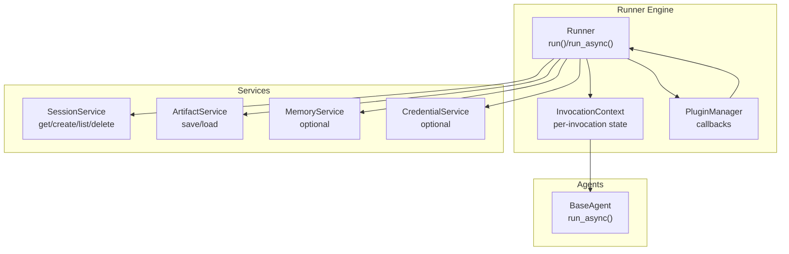
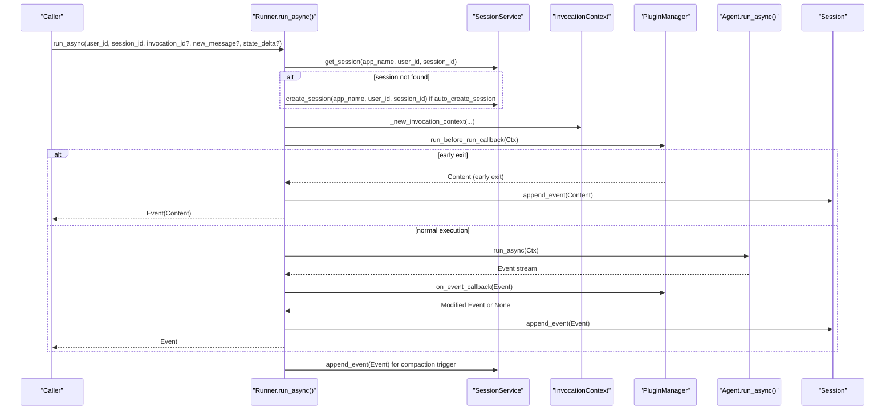
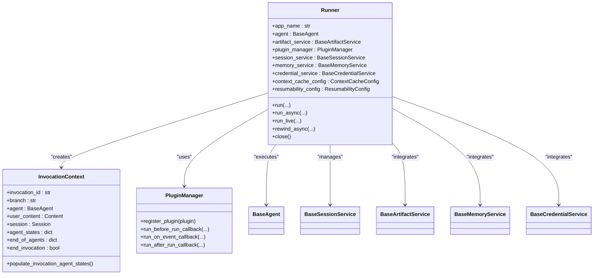

# Runner Engine

<cite>
**Referenced Files in This Document**
- [runners.py](file://src/google/adk/runners.py)
- [invocation_context.py](file://src/google/adk/agents/invocation_context.py)
- [plugin_manager.py](file://src/google/adk/plugins/plugin_manager.py)
- [sqlite_session_service.py](file://src/google/adk/sessions/sqlite_session_service.py)
- [in_memory_session_service.py](file://src/google/adk/sessions/in_memory_session_service.py)
- [test_runners.py](file://tests/unittests/test_runners.py)
- [test_runner_rewind.py](file://tests/unittests/runners/test_runner_rewind.py)
- [main.py](file://contributing/samples/rewind_session/main.py)
</cite>

## Table of Contents
1. [Introduction](#introduction)
2. [Project Structure](#project-structure)
3. [Core Components](#core-components)
4. [Architecture Overview](#architecture-overview)
5. [Detailed Component Analysis](#detailed-component-analysis)
6. [Dependency Analysis](#dependency-analysis)
7. [Performance Considerations](#performance-considerations)
8. [Troubleshooting Guide](#troubleshooting-guide)
9. [Conclusion](#conclusion)
10. [Appendices](#appendices)

## Introduction
The Runner engine is the central execution coordinator for agents in the ADK framework. It orchestrates agent execution within a session, manages message processing, event generation, and integrates with services such as artifact storage, session management, memory, and plugins. The Runner exposes synchronous and asynchronous entry points, supports resumable invocations, live/bidi execution, and provides robust session lifecycle management including creation, retrieval, and state persistence. It also implements a rewind mechanism for session rollback and state restoration.

## Project Structure
The Runner engine resides in the core module alongside related components:
- Runner class and auxiliary methods for session management, invocation context setup, plugin integration, and rewind functionality
- InvocationContext encapsulating per-invocation state and agent execution context
- PluginManager coordinating plugin callbacks around agent execution
- Session services providing session creation, retrieval, and persistence
- Tests validating Runner behavior, including session lifecycle and rewind

**Diagram sources**
- [runners.py](file://src/google/adk/runners.py#L111-L1618)
- [invocation_context.py](file://src/google/adk/agents/invocation_context.py#L100-L418)
- [plugin_manager.py](file://src/google/adk/plugins/plugin_manager.py#L113-L301)

**Section sources**
- [runners.py](file://src/google/adk/runners.py#L111-L1618)

## Core Components
- Runner: Central execution coordinator managing session lifecycle, invocation context, plugin callbacks, and event emission. Provides run() and run_async() entry points, plus rewind_async() for session rollback.
- InvocationContext: Encapsulates per-invocation state, agent selection, resumability, and runtime controls such as end-of-invocation flags and streaming tool state.
- PluginManager: Coordinates plugin callbacks around agent execution, including on_user_message, before_run, on_event, after_run, and agent/tool/model hooks.
- SessionService: Manages session creation, retrieval, listing, and deletion with pluggable persistence backends (e.g., SQLite, in-memory).
- Artifact/Memory/Credential Services: Optional integrations for artifact storage, memory banks, and credentials.

**Section sources**
- [runners.py](file://src/google/adk/runners.py#L111-L1618)
- [invocation_context.py](file://src/google/adk/agents/invocation_context.py#L100-L418)
- [plugin_manager.py](file://src/google/adk/plugins/plugin_manager.py#L113-L301)

## Architecture Overview
The Runner coordinates execution across multiple layers:
- Parameter handling and validation for run/run_async
- Session retrieval/creation and resumability checks
- Invocation context construction and agent selection
- Plugin integration via before_run/on_event/after_run callbacks
- Agent execution and event emission
- Session persistence and compaction

**Diagram sources**
- [runners.py](file://src/google/adk/runners.py#L493-L621)
- [plugin_manager.py](file://src/google/adk/plugins/plugin_manager.py#L130-L144)

## Detailed Component Analysis

### Runner Class
The Runner class is the primary orchestration component. It validates constructor parameters, manages session lifecycle, constructs invocation contexts, integrates plugins, executes agents, and persists events.

Key responsibilities:
- Constructor validation and parameter extraction from App or explicit arguments
- Session retrieval/creation with auto-create support
- Invocation context setup for new/resumed invocations
- Plugin integration around agent execution
- Event emission and session persistence
- Rewind functionality for session rollback

Initialization and configuration options:
- app or (app_name, agent) must be provided; plugins argument is deprecated
- Optional services: artifact_service, session_service, memory_service, credential_service
- plugin_close_timeout controls plugin shutdown grace period
- auto_create_session toggles automatic session creation on missing sessions

Common usage patterns:
- Standard async execution with run_async()
- Sync wrapper via run() for local testing
- Live/bidi execution via run_live()
- Debug helper via run_debug()

**Section sources**
- [runners.py](file://src/google/adk/runners.py#L150-L218)
- [runners.py](file://src/google/adk/runners.py#L428-L491)
- [runners.py](file://src/google/adk/runners.py#L493-L621)
- [runners.py](file://src/google/adk/runners.py#L981-L1088)
- [runners.py](file://src/google/adk/runners.py#L1166-L1266)

### run() and run_async() Methods
- run(): Synchronous wrapper that spawns an asyncio thread, bridges to run_async(), and yields events back to the caller thread. Intended for local testing.
- run_async(): Asynchronous entry point performing:
  - Validates new_message role and ensures invocation_id/new_message presence
  - Retrieves/creates session and resolves resumability
  - Sets up invocation context (new or resumed)
  - Executes agent via plugin-wrapped pipeline
  - Applies event compaction post-execution

Parameter handling:
- user_id, session_id: session identifiers
- invocation_id: optional, resumes a prior invocation
- new_message: optional, appends user content to session
- state_delta: optional, applies state changes to session
- run_config: optional, merges custom metadata into events

Session management:
- _get_or_create_session() retrieves existing or creates new session based on auto_create_session
- _format_session_not_found_message() augments error messages with app name alignment hints

Event generation:
- Events are emitted as they occur and persisted to session unless filtered by _should_append_event()
- Custom metadata from run_config is merged into events

**Section sources**
- [runners.py](file://src/google/adk/runners.py#L428-L491)
- [runners.py](file://src/google/adk/runners.py#L493-L621)
- [runners.py](file://src/google/adk/runners.py#L759-L776)
- [runners.py](file://src/google/adk/runners.py#L911-L980)

### Invocation Context System
InvocationContext encapsulates per-invocation execution state and controls:
- invocation_id, branch, agent, user_content, session
- agent_states and end_of_agents for resumability
- end_invocation flag to terminate invocation early
- live_request_queue, streaming tools, transcription caches for live/bidi
- run_config, resumability_config, events_compaction_config
- canonical_tools_cache and invocation cost tracking

Construction and population:
- _new_invocation_context() builds context with services and configs
- _new_invocation_context_for_live() configures live modalities and transcriptions
- _setup_context_for_new_invocation() creates context and appends user message
- _setup_context_for_resumed_invocation() restores context from session events
- populate_invocation_agent_states() reconstructs agent states for resumable apps

Agent selection:
- _find_agent_to_run() selects the appropriate agent to continue execution based on recent events and transfer capabilities

**Section sources**
- [runners.py](file://src/google/adk/runners.py#L1268-L1367)
- [runners.py](file://src/google/adk/runners.py#L1388-L1465)
- [runners.py](file://src/google/adk/runners.py#L1090-L1142)
- [invocation_context.py](file://src/google/adk/agents/invocation_context.py#L100-L418)

### Plugin Integration via exec_with_plugin
The Runner wraps agent execution with a plugin pipeline:
- run_before_run_callback(): Optional early exit via returning Content
- Event stream processing:
  - Apply run_config custom metadata to each event
  - Live/bidi ordering: buffer function call/response events until transcription completes
  - Append events to session unless filtered by _should_append_event()
  - run_on_event_callback(): Allows plugins to modify events
- run_after_run_callback(): Final cleanup and metrics aggregation

Buffering logic:
- Live mode buffers function call/response events while transcription is partial
- On transcription completion, buffered events are flushed and yielded

**Section sources**
- [runners.py](file://src/google/adk/runners.py#L778-L909)
- [plugin_manager.py](file://src/google/adk/plugins/plugin_manager.py#L113-L301)

### Session Lifecycle Management
Session lifecycle includes:
- Creation: create_session() with app_name, user_id, session_id, optional state
- Retrieval: get_session() with app_name, user_id, session_id
- Listing and deletion: list_sessions(), delete_session()
- Auto-create: _get_or_create_session() with auto_create_session flag

Persistence backends:
- SQLiteSessionService: persistent storage with state merging and timestamps
- InMemorySessionService: ephemeral storage for testing

Auto-create behavior:
- When auto_create_session=True, missing sessions are created automatically
- Error messages include app name alignment hints to aid debugging

**Section sources**
- [sqlite_session_service.py](file://src/google/adk/sessions/sqlite_session_service.py#L198-L246)
- [in_memory_session_service.py](file://src/google/adk/sessions/in_memory_session_service.py#L35-L80)
- [runners.py](file://src/google/adk/runners.py#L395-L426)
- [runners.py](file://src/google/adk/runners.py#L220-L279)

### Rewind Functionality
Rewind enables rolling back a session to a point before a specified invocation:
- rewind_async() locates the target invocation index and computes deltas
- _compute_state_delta_for_rewind() rebuilds state to match rewind point
- _compute_artifact_delta_for_rewind() restores artifacts to versions at rewind point
- Appends a rewind event with actions containing rewind_before_invocation_id, state_delta, and artifact_delta

Behavior:
- State keys prefixed with app: or user: are preserved
- Artifacts with user: prefix are not restored
- Artifact restoration uses artifact_service.save_artifact() with computed versions

**Section sources**
- [runners.py](file://src/google/adk/runners.py#L623-L758)
- [runners.py](file://src/google/adk/runners.py#L670-L702)
- [runners.py](file://src/google/adk/runners.py#L704-L758)

### Practical Examples
- Initialization and configuration:
  - Using App instance: Runner(app=app, session_service=svc, artifact_service=svc, memory_service=svc)
  - Explicit app_name/agent: Runner(app_name="MyApp", agent=root_agent, session_service=svc)
  - Auto-create sessions: Runner(..., auto_create_session=True)
- Common usage patterns:
  - Standard run_async(): await runner.run_async(user_id, session_id, new_message=content)
  - Resume invocation: await runner.run_async(user_id, session_id, invocation_id=inv_id)
  - Live execution: await runner.run_live(user_id, session_id, live_request_queue=queue)
  - Rewind: await runner.rewind_async(user_id, session_id, rewind_before_invocation_id=inv_id)

**Section sources**
- [runners.py](file://src/google/adk/runners.py#L150-L218)
- [runners.py](file://src/google/adk/runners.py#L493-L621)
- [runners.py](file://src/google/adk/runners.py#L981-L1088)
- [runners.py](file://src/google/adk/runners.py#L623-L668)
- [test_runners.py](file://tests/unittests/test_runners.py#L680-L772)
- [test_runner_rewind.py](file://tests/unittests/runners/test_runner_rewind.py#L221-L248)
- [main.py](file://contributing/samples/rewind_session/main.py#L119-L154)

## Dependency Analysis
Runner depends on:
- Agents: BaseAgent, InvocationContext, RunConfig
- Services: SessionService, ArtifactService, MemoryService, CredentialService
- Plugins: PluginManager
- Utilities: tracing, event compaction, context utilities

**Diagram sources**
- [runners.py](file://src/google/adk/runners.py#L111-L1618)
- [invocation_context.py](file://src/google/adk/agents/invocation_context.py#L100-L418)
- [plugin_manager.py](file://src/google/adk/plugins/plugin_manager.py#L113-L301)

**Section sources**
- [runners.py](file://src/google/adk/runners.py#L111-L1618)
- [invocation_context.py](file://src/google/adk/agents/invocation_context.py#L100-L418)
- [plugin_manager.py](file://src/google/adk/plugins/plugin_manager.py#L113-L301)

## Performance Considerations
- Threading model:
  - run() uses a background thread to bridge to asyncio; avoid heavy CPU work in that thread
  - run_async() is fully async and suitable for concurrent invocations
- Concurrency:
  - Multiple run_async() calls can proceed concurrently for the same session
  - Event compaction runs after invocation completion to minimize overhead
- Streaming and buffering:
  - Live/bidi mode buffers function call/response events until transcription completes to preserve ordering
- Resource cleanup:
  - Runner.close() and async context manager ensure plugin and toolset cleanup with timeouts
- Artifact handling:
  - Large inline blobs are not stored in session; saved as artifacts and referenced via file_data to reduce session size

[No sources needed since this section provides general guidance]

## Troubleshooting Guide
Common issues and resolutions:
- Session not found:
  - Enable auto_create_session to create missing sessions automatically
  - Review app name alignment hints in error messages
- Resuming invocations:
  - Ensure resumability_config.is_resumable is set for the app
  - Provide invocation_id or a matching function response to infer invocation_id
- Rewind failures:
  - Verify rewind_before_invocation_id exists in session.events
  - Confirm artifact_service is configured for artifact restoration
- Plugin errors:
  - PluginManager wraps callback exceptions in RuntimeError with chained causes
  - Check plugin registration and callback implementations

**Section sources**
- [runners.py](file://src/google/adk/runners.py#L384-L393)
- [runners.py](file://src/google/adk/runners.py#L547-L555)
- [runners.py](file://src/google/adk/runners.py#L634-L643)
- [plugin_manager.py](file://src/google/adk/plugins/plugin_manager.py#L284-L301)

## Conclusion
The Runner engine provides a robust, extensible foundation for agent execution in the ADK framework. It offers flexible session lifecycle management, resumability, live/bidi support, comprehensive plugin integration, and a powerful rewind mechanism. By leveraging InvocationContext and PluginManager, it ensures predictable execution semantics while enabling advanced customization and observability.

## Appendices

### API Summary
- Runner(app|app_name, agent, plugins, artifact_service, session_service, memory_service, credential_service, plugin_close_timeout, auto_create_session)
- run(user_id, session_id, new_message, run_config?) -> Generator[Event]
- run_async(user_id, session_id, invocation_id?, new_message?, state_delta?, run_config?) -> AsyncGenerator[Event]
- run_live(user_id?, session_id?, live_request_queue, run_config?, session?) -> AsyncGenerator[Event]
- rewind_async(user_id, session_id, rewind_before_invocation_id) -> None
- close() and async context manager support

**Section sources**
- [runners.py](file://src/google/adk/runners.py#L150-L218)
- [runners.py](file://src/google/adk/runners.py#L428-L491)
- [runners.py](file://src/google/adk/runners.py#L493-L621)
- [runners.py](file://src/google/adk/runners.py#L981-L1088)
- [runners.py](file://src/google/adk/runners.py#L623-L668)