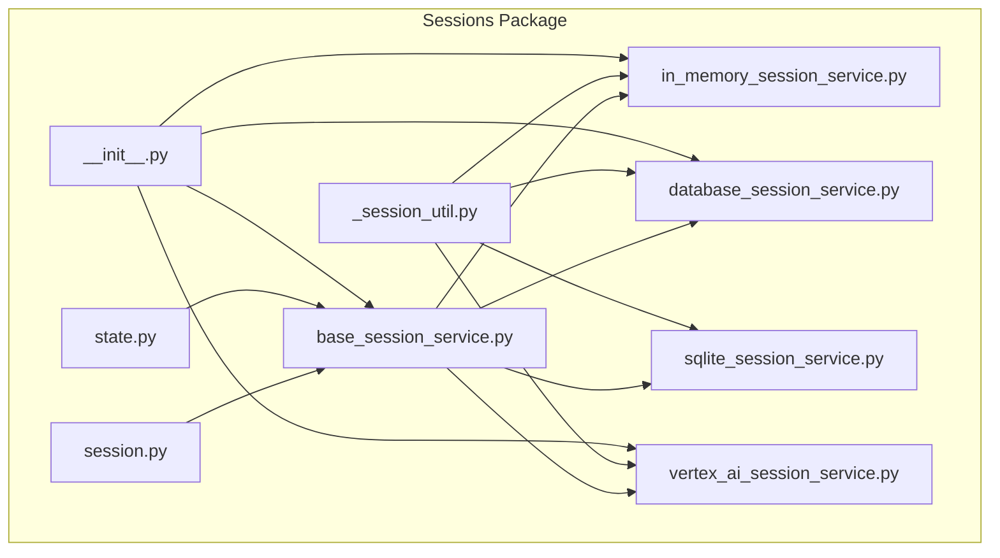
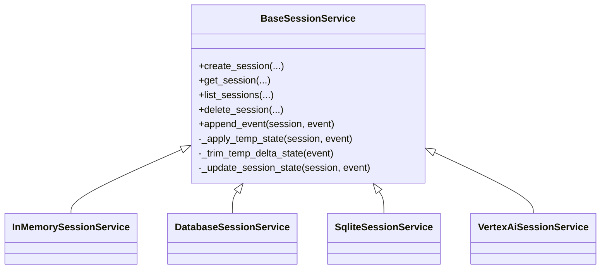
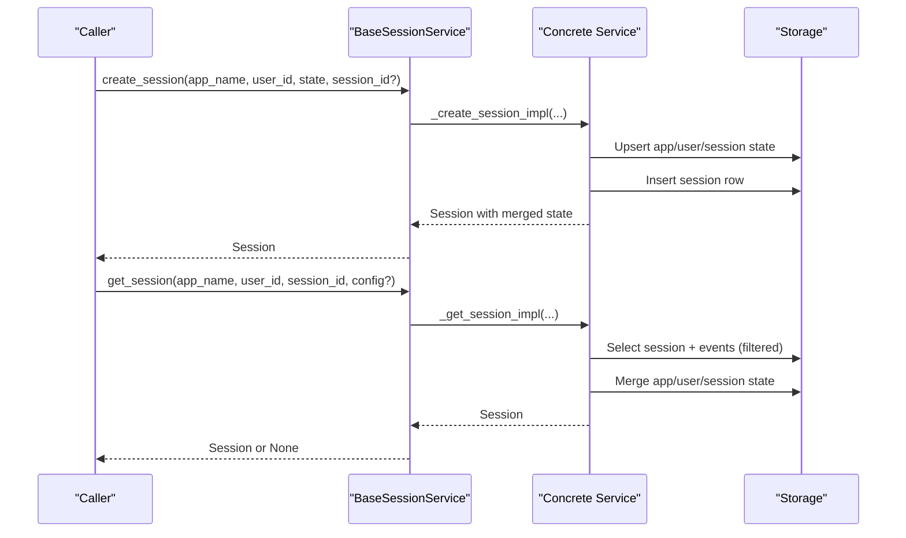
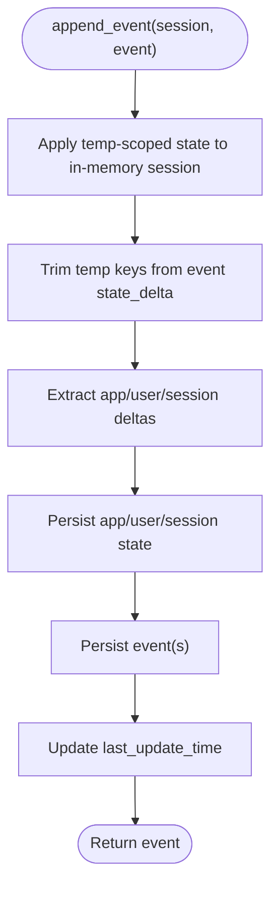
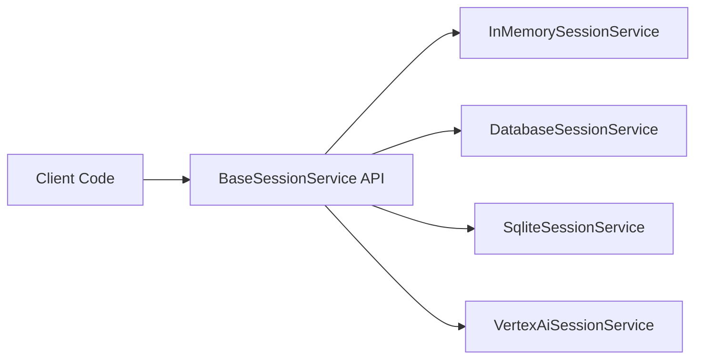
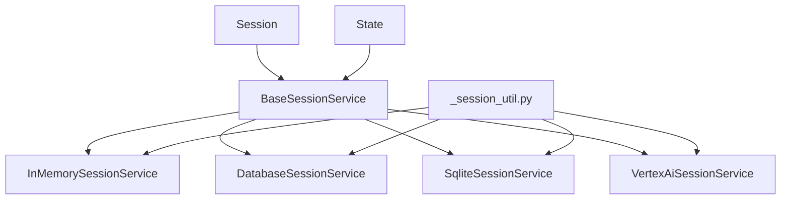

# Session Management

<cite>
**Referenced Files in This Document**
- [__init__.py](file://src/google/adk/sessions/__init__.py)
- [base_session_service.py](file://src/google/adk/sessions/base_session_service.py)
- [in_memory_session_service.py](file://src/google/adk/sessions/in_memory_session_service.py)
- [database_session_service.py](file://src/google/adk/sessions/database_session_service.py)
- [sqlite_session_service.py](file://src/google/adk/sessions/sqlite_session_service.py)
- [_session_util.py](file://src/google/adk/sessions/_session_util.py)
- [session.py](file://src/google/adk/sessions/session.py)
- [state.py](file://src/google/adk/sessions/state.py)
- [vertex_ai_session_service.py](file://src/google/adk/sessions/vertex_ai_session_service.py)
- [session_not_found_error.py](file://src/google/adk/errors/session_not_found_error.py)
- [test_session_service.py](file://tests/unittests/sessions/test_session_service.py)
- [agent.py](file://contributing/samples/session_state_agent/agent.py)
- [agent.py](file://contributing/samples/postgres_session_service/agent.py)
</cite>

## Table of Contents
1. [Introduction](#introduction)
2. [Project Structure](#project-structure)
3. [Core Components](#core-components)
4. [Architecture Overview](#architecture-overview)
5. [Detailed Component Analysis](#detailed-component-analysis)
6. [Dependency Analysis](#dependency-analysis)
7. [Performance Considerations](#performance-considerations)
8. [Troubleshooting Guide](#troubleshooting-guide)
9. [Conclusion](#conclusion)
10. [Appendices](#appendices)

## Introduction
This document describes the session management subsystem, focusing on the session lifecycle, state management, and persistence across different session services. It explains how sessions are created, retrieved, and updated, how state deltas are applied and persisted, and how the system handles session-not-found conditions. It also documents the abstraction layer that enables pluggable session backends (in-memory, database, SQLite, Vertex AI), and provides practical examples and best practices for production deployments.

## Project Structure
The session management subsystem resides under src/google/adk/sessions and includes:
- A base interface for session services
- Concrete implementations for in-memory, database-backed, SQLite, and Vertex AI
- Supporting models for sessions, state, and utilities
- Tests validating behavior across services
- Sample agents demonstrating usage patterns

**Diagram sources**
- [base_session_service.py](file://src/google/adk/sessions/base_session_service.py#L45-L154)
- [in_memory_session_service.py](file://src/google/adk/sessions/in_memory_session_service.py#L37-L339)
- [database_session_service.py](file://src/google/adk/sessions/database_session_service.py#L135-L661)
- [sqlite_session_service.py](file://src/google/adk/sessions/sqlite_session_service.py#L132-L596)
- [vertex_ai_session_service.py](file://src/google/adk/sessions/vertex_ai_session_service.py#L46-L438)
- [_session_util.py](file://src/google/adk/sessions/_session_util.py#L1-L51)
- [session.py](file://src/google/adk/sessions/session.py#L27-L51)
- [state.py](file://src/google/adk/sessions/state.py#L20-L82)
- [__init__.py](file://src/google/adk/sessions/__init__.py#L14-L42)

**Section sources**
- [__init__.py](file://src/google/adk/sessions/__init__.py#L14-L42)
- [base_session_service.py](file://src/google/adk/sessions/base_session_service.py#L45-L154)

## Core Components
- BaseSessionService: Defines the contract for session operations (create, get, list, delete, append_event) and common state/event handling logic.
- Session: Pydantic model representing a conversation session with identifiers, state, events, and timestamps.
- State: Encapsulates state dictionaries with delta tracking for pending commits.
- Utilities: Helpers for decoding models and extracting app/user/session state deltas.
- Concrete Services: InMemorySessionService, DatabaseSessionService, SqliteSessionService, VertexAiSessionService.

Key responsibilities:
- Creation: Generate or reuse session IDs, initialize state, merge app/user/session scopes.
- Retrieval: Load sessions with optional event filters and merged state.
- Persistence: Apply state deltas, trim temp-scoped state, and persist events and state.
- Concurrency: Serialize event appends and handle stale sessions gracefully.

**Section sources**
- [session.py](file://src/google/adk/sessions/session.py#L27-L51)
- [state.py](file://src/google/adk/sessions/state.py#L20-L82)
- [base_session_service.py](file://src/google/adk/sessions/base_session_service.py#L45-L154)
- [_session_util.py](file://src/google/adk/sessions/_session_util.py#L28-L51)

## Architecture Overview
The subsystem abstracts session storage behind a common interface. Each backend implements the same operations, ensuring consistent behavior across in-memory, relational databases, embedded SQLite, and cloud-hosted Vertex AI Agent Engine.

**Diagram sources**
- [base_session_service.py](file://src/google/adk/sessions/base_session_service.py#L45-L154)
- [in_memory_session_service.py](file://src/google/adk/sessions/in_memory_session_service.py#L37-L339)
- [database_session_service.py](file://src/google/adk/sessions/database_session_service.py#L135-L661)
- [sqlite_session_service.py](file://src/google/adk/sessions/sqlite_session_service.py#L132-L596)
- [vertex_ai_session_service.py](file://src/google/adk/sessions/vertex_ai_session_service.py#L46-L438)

## Detailed Component Analysis

### Session Lifecycle and State Management
- Creation:
  - Accepts app_name, user_id, optional client-provided session_id, and initial state.
  - Splits state into app:user:session scoped deltas and applies them to backend state tables/app containers.
  - Returns a Session with merged state (app:user: prefixed keys plus session-scoped keys).
- Retrieval:
  - Loads session and optionally filters events by recency or timestamp.
  - Merges app/user/session state into the returned Session.
- Persistence:
  - append_event applies temp-scoped state to the in-memory session before trimming temp keys from the event delta.
  - Updates backend state and events atomically or transactionally depending on backend.
  - Updates last_update_time to the event timestamp.

**Diagram sources**
- [base_session_service.py](file://src/google/adk/sessions/base_session_service.py#L51-L154)
- [in_memory_session_service.py](file://src/google/adk/sessions/in_memory_session_service.py#L85-L129)
- [database_session_service.py](file://src/google/adk/sessions/database_session_service.py#L313-L390)
- [sqlite_session_service.py](file://src/google/adk/sessions/sqlite_session_service.py#L157-L228)

**Section sources**
- [base_session_service.py](file://src/google/adk/sessions/base_session_service.py#L51-L154)
- [in_memory_session_service.py](file://src/google/adk/sessions/in_memory_session_service.py#L85-L129)
- [database_session_service.py](file://src/google/adk/sessions/database_session_service.py#L313-L390)
- [sqlite_session_service.py](file://src/google/adk/sessions/sqlite_session_service.py#L157-L228)

### State Delta Application and Persistence
- Prefixes:
  - Keys prefixed with app:, user:, or temp: are recognized and handled differently during merges and persistence.
- Delta extraction:
  - extract_state_delta splits incoming state into app, user, and session buckets.
- Temp state:
  - Temp-scoped keys are applied to in-memory session state during append_event and trimmed from event deltas before persistence.
- Backend-specific persistence:
  - InMemory: merges app/user state into session state upon retrieval; persists deltas into in-memory maps.
  - Database: uses row-level locking and atomic updates; merges app/user/session state for responses.
  - SQLite: uses json_patch to atomically merge state deltas; stores events as JSON.
  - Vertex AI: sends state_delta via event actions to Vertex AI Agent Engine.

**Diagram sources**
- [base_session_service.py](file://src/google/adk/sessions/base_session_service.py#L105-L154)
- [_session_util.py](file://src/google/adk/sessions/_session_util.py#L37-L51)
- [in_memory_session_service.py](file://src/google/adk/sessions/in_memory_session_service.py#L290-L339)
- [database_session_service.py](file://src/google/adk/sessions/database_session_service.py#L521-L648)
- [sqlite_session_service.py](file://src/google/adk/sessions/sqlite_session_service.py#L360-L456)
- [vertex_ai_session_service.py](file://src/google/adk/sessions/vertex_ai_session_service.py#L248-L321)

**Section sources**
- [state.py](file://src/google/adk/sessions/state.py#L20-L82)
- [_session_util.py](file://src/google/adk/sessions/_session_util.py#L37-L51)
- [base_session_service.py](file://src/google/adk/sessions/base_session_service.py#L105-L154)

### Session Not Found Handling
- Database and SQLite backends raise a ValueError when a session is not found during append_event.
- Vertex AI backend returns None when the session resource is not found (HTTP 404) and raises if the session belongs to another user.
- Tests demonstrate expected behaviors for missing rows and cross-user session isolation.

Resolution strategies:
- Re-create the session with a new ID if appropriate.
- Verify user ownership and correct app_name/session_id.
- For Vertex AI, ensure the reasoning engine ID or resource name is valid.

**Section sources**
- [database_session_service.py](file://src/google/adk/sessions/database_session_service.py#L564-L566)
- [sqlite_session_service.py](file://src/google/adk/sessions/sqlite_session_service.py#L379-L387)
- [vertex_ai_session_service.py](file://src/google/adk/sessions/vertex_ai_session_service.py#L168-L180)
- [test_session_service.py](file://tests/unittests/sessions/test_session_service.py#L686-L738)

### Session Service Integration Patterns
- Import and instantiate the desired service:
  - InMemorySessionService for testing and single-process development.
  - DatabaseSessionService for relational databases (SQLAlchemy).
  - SqliteSessionService for embedded SQLite with JSON event storage.
  - VertexAiSessionService for Vertex AI Agent Engine.
- Use the BaseSessionService interface uniformly for create/get/list/delete/append_event.
- Configure backends via constructor parameters (e.g., db_url, db_path, credentials).

**Diagram sources**
- [base_session_service.py](file://src/google/adk/sessions/base_session_service.py#L45-L154)
- [in_memory_session_service.py](file://src/google/adk/sessions/in_memory_session_service.py#L37-L339)
- [database_session_service.py](file://src/google/adk/sessions/database_session_service.py#L135-L661)
- [sqlite_session_service.py](file://src/google/adk/sessions/sqlite_session_service.py#L132-L596)
- [vertex_ai_session_service.py](file://src/google/adk/sessions/vertex_ai_session_service.py#L46-L438)

**Section sources**
- [__init__.py](file://src/google/adk/sessions/__init__.py#L14-L42)
- [base_session_service.py](file://src/google/adk/sessions/base_session_service.py#L45-L154)

### Examples and Best Practices
- Example: Demonstrating session state caching and persistence across agent callbacks.
  - See [agent.py](file://contributing/samples/session_state_agent/agent.py#L33-L164) for assertions and state transitions across callbacks.
- Example: PostgreSQL-backed session persistence sample agent.
  - See [agent.py](file://contributing/samples/postgres_session_service/agent.py#L32-L43) for a minimal setup.
- Best practices:
  - Always filter events by timestamp or recency when retrieving sessions to reduce payload size.
  - Prefer managed backends (Database/SQLite/Vertex AI) for multi-instance or persistent deployments.
  - Use temp-scoped keys for ephemeral values within a single invocation; rely on persisted state for inter-invocation continuity.
  - Handle session-not-found scenarios by recreating sessions or correcting identifiers.

**Section sources**
- [agent.py](file://contributing/samples/session_state_agent/agent.py#L33-L164)
- [agent.py](file://contributing/samples/postgres_session_service/agent.py#L32-L43)

## Dependency Analysis
- Cohesion:
  - Each service encapsulates its own persistence logic while adhering to the BaseSessionService contract.
- Coupling:
  - All services depend on Session, State, and _session_util helpers.
  - Database and SQLite services depend on SQLAlchemy/aiosqlite and schema classes.
  - Vertex AI service depends on the Vertex AI SDK and related types.
- External integrations:
  - Database engines and clients are configured via URLs and credentials.
  - Vertex AI service integrates with Agent Engine APIs.

**Diagram sources**
- [base_session_service.py](file://src/google/adk/sessions/base_session_service.py#L45-L154)
- [_session_util.py](file://src/google/adk/sessions/_session_util.py#L28-L51)
- [session.py](file://src/google/adk/sessions/session.py#L27-L51)
- [state.py](file://src/google/adk/sessions/state.py#L20-L82)

**Section sources**
- [base_session_service.py](file://src/google/adk/sessions/base_session_service.py#L45-L154)
- [_session_util.py](file://src/google/adk/sessions/_session_util.py#L28-L51)

## Performance Considerations
- Concurrency:
  - DatabaseSessionService serializes event appends per session within a process using per-session locks to prevent race conditions.
  - Uses row-level locking for supported dialects to ensure consistency.
- Event filtering:
  - Retrieve only recent events or events after a timestamp to minimize payload sizes.
- State merging:
  - Merging app/user/session state occurs on reads; keep state compact to reduce overhead.
- Backends:
  - InMemorySessionService is fastest but not suitable for multi-process or persistent deployments.
  - Database and SQLite backends scale better for production workloads.
  - Vertex AI offloads persistence and scaling to the cloud service.

[No sources needed since this section provides general guidance]

## Troubleshooting Guide
Common issues and resolutions:
- Session not found:
  - Database/SQLite: ValueError raised when session is missing; verify app_name, user_id, and session_id.
  - Vertex AI: Returns None on 404; ensure correct resource name and permissions.
- Stale session detected:
  - Database backend compares last_update_time and reloads from storage if newer; refresh your session object before appending.
- Missing app/user state rows:
  - Database backend raises if app or user state rows are missing; ensure create_session initializes state rows first.
- Cross-user session confusion:
  - Ensure user_id matches the session owner; get_session respects user_id scoping.

**Section sources**
- [database_session_service.py](file://src/google/adk/sessions/database_session_service.py#L564-L566)
- [sqlite_session_service.py](file://src/google/adk/sessions/sqlite_session_service.py#L379-L387)
- [vertex_ai_session_service.py](file://src/google/adk/sessions/vertex_ai_session_service.py#L168-L180)
- [test_session_service.py](file://tests/unittests/sessions/test_session_service.py#L623-L683)
- [test_session_service.py](file://tests/unittests/sessions/test_session_service.py#L686-L738)

## Conclusion
The session management subsystem provides a robust, extensible abstraction for session lifecycle and state persistence across multiple backends. By leveraging state prefixes, delta extraction, and careful event handling, it ensures consistent behavior regardless of storage backend. Production deployments should choose durable backends, apply event filtering, and handle session-not-found scenarios gracefully.

[No sources needed since this section summarizes without analyzing specific files]

## Appendices

### API Surface Summary
- BaseSessionService:
  - create_session(app_name, user_id, state?, session_id?)
  - get_session(app_name, user_id, session_id, config?)
  - list_sessions(app_name, user_id?)
  - delete_session(app_name, user_id, session_id)
  - append_event(session, event)
- GetSessionConfig: num_recent_events?, after_timestamp?
- ListSessionsResponse: sessions list

**Section sources**
- [base_session_service.py](file://src/google/adk/sessions/base_session_service.py#L29-L43)
- [base_session_service.py](file://src/google/adk/sessions/base_session_service.py#L51-L103)