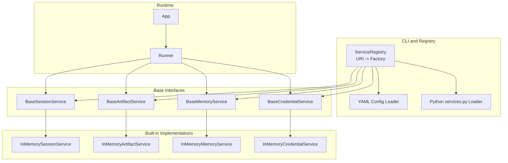
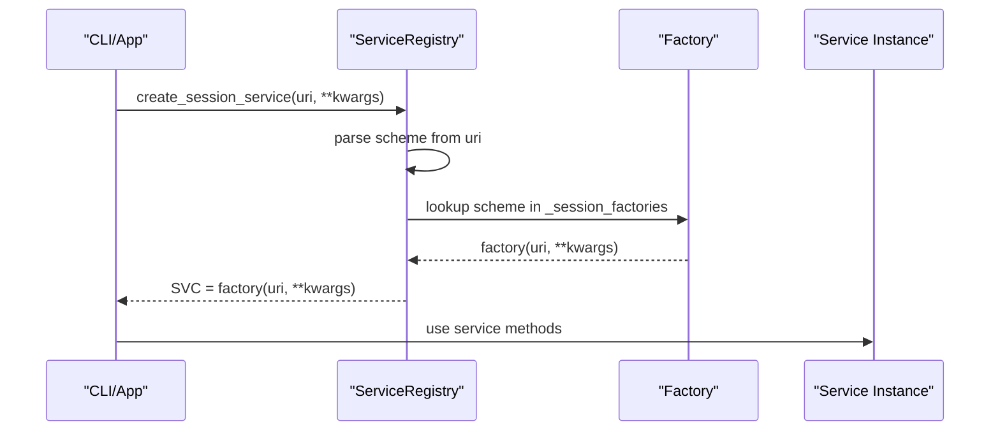
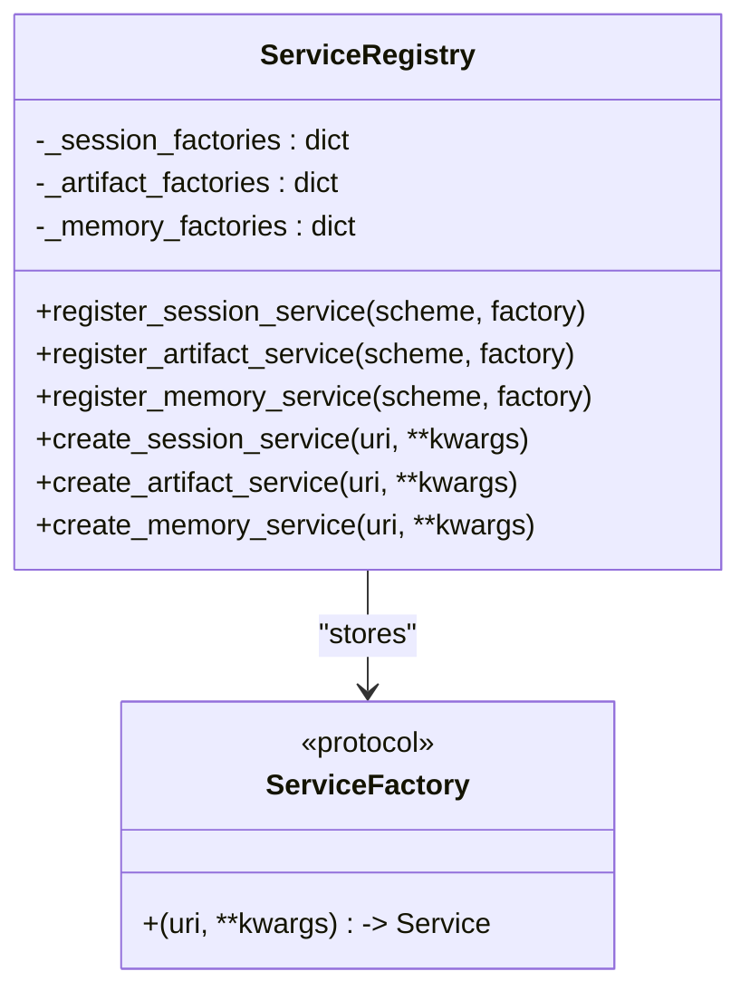
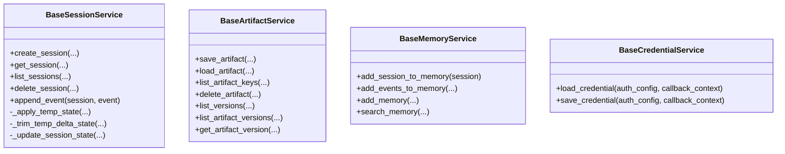
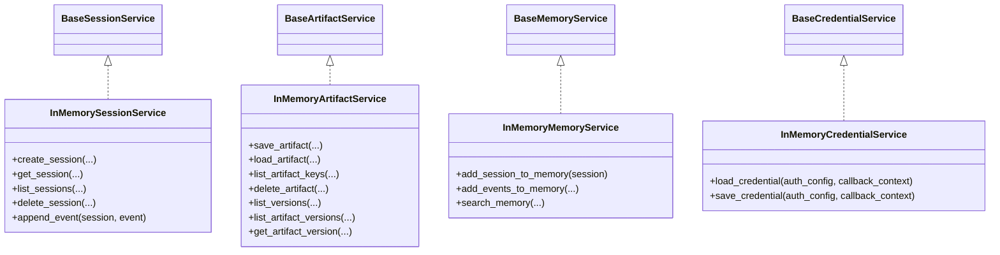
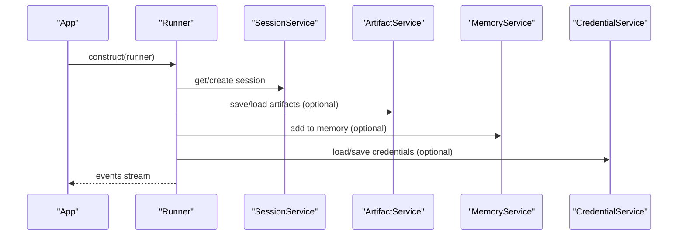
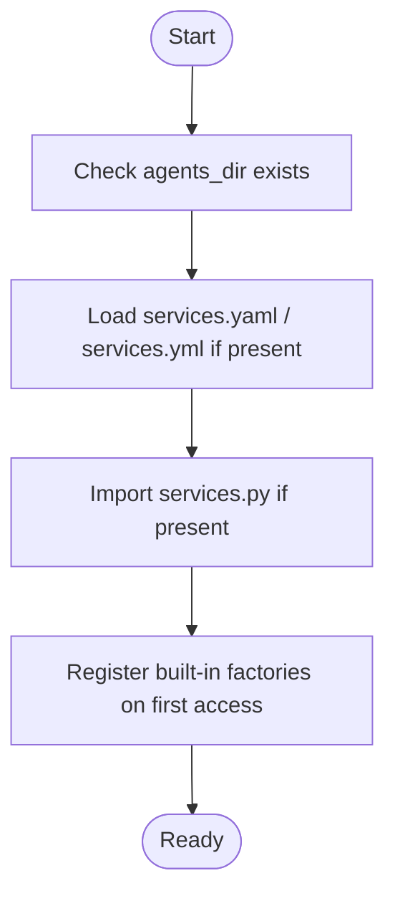
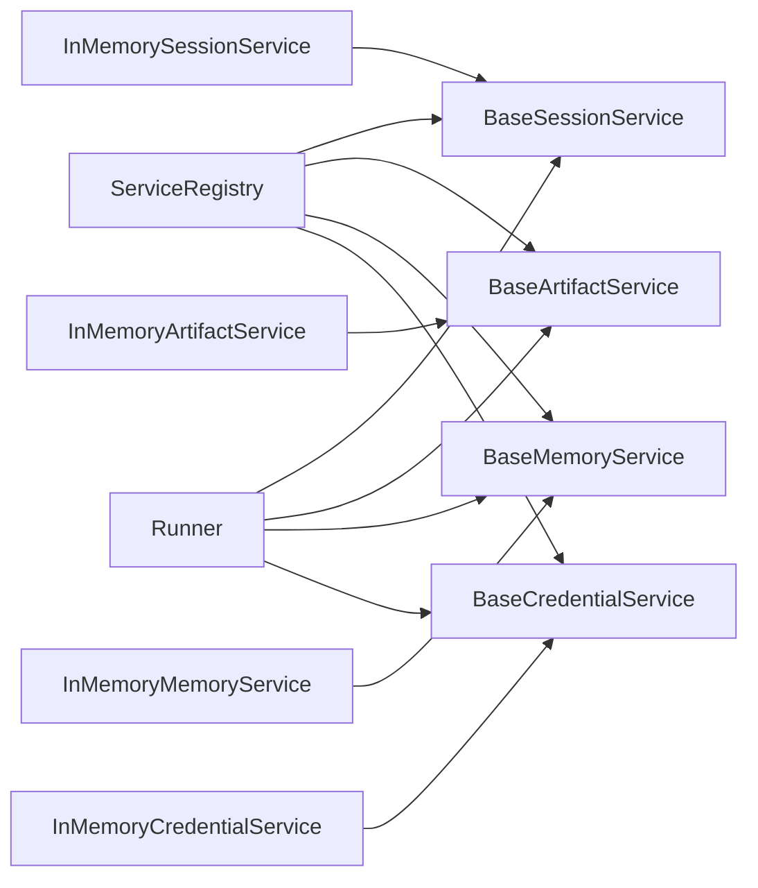

# Service Registry and Dependency Injection

<cite>
**Referenced Files in This Document**
- [service_registry.py](file://src/google/adk/cli/service_registry.py)
- [base_session_service.py](file://src/google/adk/sessions/base_session_service.py)
- [base_artifact_service.py](file://src/google/adk/artifacts/base_artifact_service.py)
- [base_memory_service.py](file://src/google/adk/memory/base_memory_service.py)
- [base_credential_service.py](file://src/google/adk/auth/credential_service/base_credential_service.py)
- [in_memory_session_service.py](file://src/google/adk/sessions/in_memory_session_service.py)
- [in_memory_artifact_service.py](file://src/google/adk/artifacts/in_memory_artifact_service.py)
- [in_memory_memory_service.py](file://src/google/adk/memory/in_memory_memory_service.py)
- [in_memory_credential_service.py](file://src/google/adk/auth/credential_service/in_memory_credential_service.py)
- [runners.py](file://src/google/adk/runners.py)
- [app.py](file://src/google/adk/apps/app.py)
- [services.py](file://contributing/samples/services.py)
- [services.yaml](file://contributing/samples/services.yaml)
</cite>

## Table of Contents
1. [Introduction](#introduction)
2. [Project Structure](#project-structure)
3. [Core Components](#core-components)
4. [Architecture Overview](#architecture-overview)
5. [Detailed Component Analysis](#detailed-component-analysis)
6. [Dependency Analysis](#dependency-analysis)
7. [Performance Considerations](#performance-considerations)
8. [Troubleshooting Guide](#troubleshooting-guide)
9. [Conclusion](#conclusion)
10. [Appendices](#appendices)

## Introduction
This document explains the service registry pattern and dependency injection system used by the application to manage pluggable backends for sessions, artifacts, memory, and credentials. It covers:
- Base service interfaces and their responsibilities
- How services are registered and resolved via URI schemes
- How runners consume services for agent execution
- Lifecycle, configuration, and initialization patterns
- Examples for implementing custom services, composing services, and resolving dependencies
- Isolation, error handling, and testing strategies

## Project Structure
The service registry and DI system spans several modules:
- CLI service registry: registers and resolves service factories by URI scheme
- Base service interfaces: define contracts for session, artifact, memory, and credential services
- Built-in implementations: in-memory services for quick prototyping
- Runner integration: injects services into the execution pipeline
- Application configuration: ties resumability and compaction to service usage

**Diagram sources**
- [service_registry.py](file://src/google/adk/cli/service_registry.py#L94-L151)
- [base_session_service.py](file://src/google/adk/sessions/base_session_service.py#L45-L154)
- [base_artifact_service.py](file://src/google/adk/artifacts/base_artifact_service.py#L88-L262)
- [base_memory_service.py](file://src/google/adk/memory/base_memory_service.py#L44-L141)
- [base_credential_service.py](file://src/google/adk/auth/credential_service/base_credential_service.py#L28-L76)
- [in_memory_session_service.py](file://src/google/adk/sessions/in_memory_session_service.py#L37-L339)
- [in_memory_artifact_service.py](file://src/google/adk/artifacts/in_memory_artifact_service.py#L49-L282)
- [in_memory_memory_service.py](file://src/google/adk/memory/in_memory_memory_service.py#L45-L135)
- [in_memory_credential_service.py](file://src/google/adk/auth/credential_service/in_memory_credential_service.py#L29-L67)
- [runners.py](file://src/google/adk/runners.py#L112-L218)
- [app.py](file://src/google/adk/apps/app.py#L111-L152)

**Section sources**
- [service_registry.py](file://src/google/adk/cli/service_registry.py#L1-L442)
- [runners.py](file://src/google/adk/runners.py#L112-L218)
- [app.py](file://src/google/adk/apps/app.py#L111-L152)

## Core Components
- Base interfaces define the contract for each service category:
  - Session: create, get, list, delete sessions; append events with state delta handling
  - Artifact: save/load/list/list versions per app/user/session/filename
  - Memory: add sessions/events/memories; search with keyword matching
  - Credential: load/save credentials keyed by auth config and callback context
- Built-in in-memory implementations provide thread-safe prototypes for development
- Runner holds optional/required service instances and orchestrates agent runs
- App encapsulates resumability and event compaction configs that influence runtime behavior

**Section sources**
- [base_session_service.py](file://src/google/adk/sessions/base_session_service.py#L45-L154)
- [base_artifact_service.py](file://src/google/adk/artifacts/base_artifact_service.py#L88-L262)
- [base_memory_service.py](file://src/google/adk/memory/base_memory_service.py#L44-L141)
- [base_credential_service.py](file://src/google/adk/auth/credential_service/base_credential_service.py#L28-L76)
- [in_memory_session_service.py](file://src/google/adk/sessions/in_memory_session_service.py#L37-L339)
- [in_memory_artifact_service.py](file://src/google/adk/artifacts/in_memory_artifact_service.py#L49-L282)
- [in_memory_memory_service.py](file://src/google/adk/memory/in_memory_memory_service.py#L45-L135)
- [in_memory_credential_service.py](file://src/google/adk/auth/credential_service/in_memory_credential_service.py#L29-L67)
- [runners.py](file://src/google/adk/runners.py#L112-L218)
- [app.py](file://src/google/adk/apps/app.py#L111-L152)

## Architecture Overview
The system uses a registry-driven factory pattern:
- A singleton ServiceRegistry maps URI schemes to factory functions
- Built-in factories are registered for common schemes (e.g., memory, gs, file, sqlite, postgresql, mysql, agentengine, rag)
- Users can augment the registry via YAML or Python modules
- At runtime, runners receive service instances (or None) and use them for session, artifact, memory, and credential operations

**Diagram sources**
- [service_registry.py](file://src/google/adk/cli/service_registry.py#L126-L151)
- [service_registry.py](file://src/google/adk/cli/service_registry.py#L218-L269)

**Section sources**
- [service_registry.py](file://src/google/adk/cli/service_registry.py#L94-L161)

## Detailed Component Analysis

### Service Registry and Resolution
- ServiceRegistry maintains three registries: session, artifact, memory
- Factories are registered for URI schemes; create_* methods resolve by scheme
- Built-in factories handle memory, gs, file, sqlite, postgresql/mysql, agentengine, rag, and others
- load_services_module loads YAML and/or Python modules to augment registrations
- get_service_registry initializes the singleton and registers built-ins

**Diagram sources**
- [service_registry.py](file://src/google/adk/cli/service_registry.py#L94-L151)
- [service_registry.py](file://src/google/adk/cli/service_registry.py#L85-L92)

**Section sources**
- [service_registry.py](file://src/google/adk/cli/service_registry.py#L94-L161)
- [service_registry.py](file://src/google/adk/cli/service_registry.py#L163-L213)
- [service_registry.py](file://src/google/adk/cli/service_registry.py#L218-L334)
- [service_registry.py](file://src/google/adk/cli/service_registry.py#L417-L442)

### Base Service Interfaces
- BaseSessionService: CRUD for sessions, event append with temp-state handling, state delta propagation
- BaseArtifactService: save/load/list/list versions by app/user/session/filename
- BaseMemoryService: add_session_to_memory, add_events_to_memory, add_memory, search_memory
- BaseCredentialService: load_credential, save_credential keyed by auth config and callback context

**Diagram sources**
- [base_session_service.py](file://src/google/adk/sessions/base_session_service.py#L45-L154)
- [base_artifact_service.py](file://src/google/adk/artifacts/base_artifact_service.py#L88-L262)
- [base_memory_service.py](file://src/google/adk/memory/base_memory_service.py#L44-L141)
- [base_credential_service.py](file://src/google/adk/auth/credential_service/base_credential_service.py#L28-L76)

**Section sources**
- [base_session_service.py](file://src/google/adk/sessions/base_session_service.py#L45-L154)
- [base_artifact_service.py](file://src/google/adk/artifacts/base_artifact_service.py#L88-L262)
- [base_memory_service.py](file://src/google/adk/memory/base_memory_service.py#L44-L141)
- [base_credential_service.py](file://src/google/adk/auth/credential_service/base_credential_service.py#L28-L76)

### Built-in In-Memory Implementations
- InMemorySessionService: stores sessions and state in-memory; merges app/user state into session state; supports filtering by recent events and timestamps
- InMemoryArtifactService: stores artifacts per path; supports user-scoped and session-scoped artifacts; versioning and MIME detection
- InMemoryMemoryService: keyword-based search over session events; thread-safe; prototype-grade
- InMemoryCredentialService: stores credentials per app/user in-memory

**Diagram sources**
- [in_memory_session_service.py](file://src/google/adk/sessions/in_memory_session_service.py#L37-L339)
- [in_memory_artifact_service.py](file://src/google/adk/artifacts/in_memory_artifact_service.py#L49-L282)
- [in_memory_memory_service.py](file://src/google/adk/memory/in_memory_memory_service.py#L45-L135)
- [in_memory_credential_service.py](file://src/google/adk/auth/credential_service/in_memory_credential_service.py#L29-L67)

**Section sources**
- [in_memory_session_service.py](file://src/google/adk/sessions/in_memory_session_service.py#L37-L339)
- [in_memory_artifact_service.py](file://src/google/adk/artifacts/in_memory_artifact_service.py#L49-L282)
- [in_memory_memory_service.py](file://src/google/adk/memory/in_memory_memory_service.py#L45-L135)
- [in_memory_credential_service.py](file://src/google/adk/auth/credential_service/in_memory_credential_service.py#L29-L67)

### Runner Integration and Dependency Injection
- Runner holds optional/required service fields: artifact_service, session_service, memory_service, credential_service
- Constructor validates either an App instance or app_name+agent; injects services accordingly
- During run_async, Runner retrieves/creates sessions, sets up invocation contexts, and executes agents
- Rewind logic uses artifact_service to restore versions and computes state deltas

**Diagram sources**
- [runners.py](file://src/google/adk/runners.py#L150-L218)
- [runners.py](file://src/google/adk/runners.py#L493-L622)
- [runners.py](file://src/google/adk/runners.py#L623-L758)

**Section sources**
- [runners.py](file://src/google/adk/runners.py#L112-L218)
- [runners.py](file://src/google/adk/runners.py#L395-L426)
- [runners.py](file://src/google/adk/runners.py#L493-L622)
- [runners.py](file://src/google/adk/runners.py#L623-L758)

### Configuration and Initialization Patterns
- YAML-based registration: services.yaml defines scheme/type/class; loaded before Python module
- Python-based registration: services.py imports get_service_registry and registers factories
- load_services_module enforces order: YAML first, then Python; Python can overwrite YAML
- Built-in services are registered on first access to the singleton registry

**Diagram sources**
- [service_registry.py](file://src/google/adk/cli/service_registry.py#L163-L213)
- [service_registry.py](file://src/google/adk/cli/service_registry.py#L218-L334)

**Section sources**
- [service_registry.py](file://src/google/adk/cli/service_registry.py#L163-L213)
- [service_registry.py](file://src/google/adk/cli/service_registry.py#L417-L442)

### Implementing Custom Services and Composition
- Implement a custom service class that inherits from the appropriate base interface
- Provide a factory function that accepts (uri, **kwargs) and returns your service instance
- Register via Python module (services.py) or YAML (services.yaml)
- Compose services by injecting multiple optional services into Runner; use artifact_service for persistence, memory_service for recall, credential_service for secure storage

Examples and references:
- Python registration example: [services.py](file://contributing/samples/services.py#L18-L32)
- YAML registration example: [services.yaml](file://contributing/samples/services.yaml#L4-L8)
- Factory registration: [service_registry.py](file://src/google/adk/cli/service_registry.py#L417-L442)

**Section sources**
- [services.py](file://contributing/samples/services.py#L18-L32)
- [services.yaml](file://contributing/samples/services.yaml#L4-L8)
- [service_registry.py](file://src/google/adk/cli/service_registry.py#L417-L442)

### Service Lifecycle Management
- Construction: factories initialize services with uri and kwargs
- Usage: Runner invokes service methods during run_async and rewind
- Destruction: services are held as object references; consider process lifecycle or explicit cleanup in advanced deployments
- State handling: session services merge app/user state into session state; temp state is ephemeral and trimmed before persistence

**Section sources**
- [service_registry.py](file://src/google/adk/cli/service_registry.py#L126-L151)
- [base_session_service.py](file://src/google/adk/sessions/base_session_service.py#L118-L154)
- [runners.py](file://src/google/adk/runners.py#L493-L622)

## Dependency Analysis
- Coupling: Runner depends on base interfaces, not concrete implementations
- Cohesion: Each service category is cohesive around a single responsibility
- External dependencies: Registry uses urllib parsing and dynamic imports; YAML loading via utility
- No circular dependencies observed among core service interfaces and registry

**Diagram sources**
- [service_registry.py](file://src/google/adk/cli/service_registry.py#L94-L161)
- [runners.py](file://src/google/adk/runners.py#L112-L218)
- [in_memory_session_service.py](file://src/google/adk/sessions/in_memory_session_service.py#L37-L339)
- [in_memory_artifact_service.py](file://src/google/adk/artifacts/in_memory_artifact_service.py#L49-L282)
- [in_memory_memory_service.py](file://src/google/adk/memory/in_memory_memory_service.py#L45-L135)
- [in_memory_credential_service.py](file://src/google/adk/auth/credential_service/in_memory_credential_service.py#L29-L67)

**Section sources**
- [service_registry.py](file://src/google/adk/cli/service_registry.py#L94-L161)
- [runners.py](file://src/google/adk/runners.py#L112-L218)

## Performance Considerations
- In-memory services are optimized for development and testing; they are not thread-safe for multi-process production
- Event compaction and resumability reduce token growth and enable efficient restarts
- Artifact references allow avoiding large payloads in sessions; only references are stored in events
- Consider backend-specific caching and batching for production deployments

[No sources needed since this section provides general guidance]

## Troubleshooting Guide
Common issues and resolutions:
- Session not found: Runner raises a SessionNotFoundError; enable auto_create_session or ensure app_name alignment
- Invalid app name: App validates identifiers and rejects reserved names
- YAML/Python registration failures: load_services_module logs warnings and stops on YAML load failure; Python module import errors are logged
- Missing credentials: InMemoryCredentialService returns None if not found; ensure proper callback context and auth config
- Rewind errors: Rewind logic computes deltas and raises on missing invocation ids

**Section sources**
- [runners.py](file://src/google/adk/runners.py#L384-L394)
- [runners.py](file://src/google/adk/runners.py#L415-L426)
- [app.py](file://src/google/adk/apps/app.py#L30-L39)
- [service_registry.py](file://src/google/adk/cli/service_registry.py#L163-L213)
- [in_memory_credential_service.py](file://src/google/adk/auth/credential_service/in_memory_credential_service.py#L36-L54)
- [runners.py](file://src/google/adk/runners.py#L623-L644)

## Conclusion
The service registry and dependency injection system provides a clean, extensible foundation for pluggable backends. By adhering to base interfaces and using the registry, teams can swap implementations, compose services, and maintain isolation between components. Built-in in-memory services simplify development, while production deployments can leverage backend-specific implementations through the same contract.

[No sources needed since this section summarizes without analyzing specific files]

## Appendices

### Appendix A: Service Registration Mechanisms
- YAML registration: Define services with scheme, type, and class; loaded before Python module
- Python registration: Import get_service_registry and register factories for schemes
- Overwrite behavior: If both YAML and Python define the same scheme, Python wins

**Section sources**
- [service_registry.py](file://src/google/adk/cli/service_registry.py#L24-L62)
- [service_registry.py](file://src/google/adk/cli/service_registry.py#L163-L213)
- [service_registry.py](file://src/google/adk/cli/service_registry.py#L417-L442)
- [services.py](file://contributing/samples/services.py#L18-L32)
- [services.yaml](file://contributing/samples/services.yaml#L4-L8)

### Appendix B: Runner Service Fields and Injection
- Required: session_service
- Optional: artifact_service, memory_service, credential_service
- Runner constructor validates either App or app_name+agent; injects services accordingly

**Section sources**
- [runners.py](file://src/google/adk/runners.py#L150-L218)

### Appendix C: Application Resumability and Compaction
- ResumabilityConfig enables pausing/resuming long-running invocations
- EventsCompactionConfig controls compaction triggers and summarization

**Section sources**
- [app.py](file://src/google/adk/apps/app.py#L42-L109)