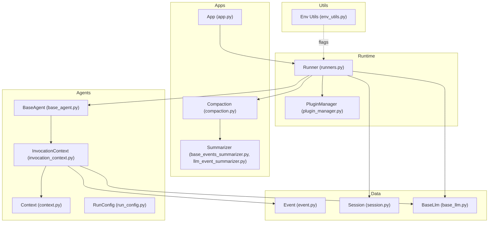
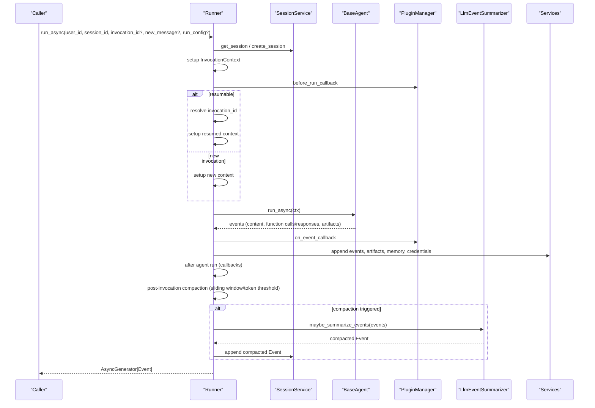
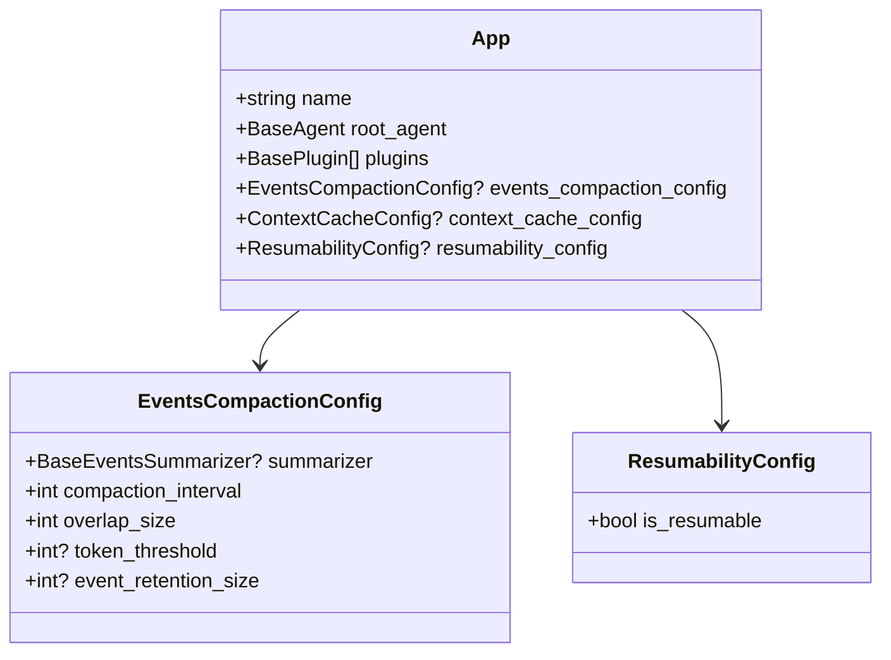
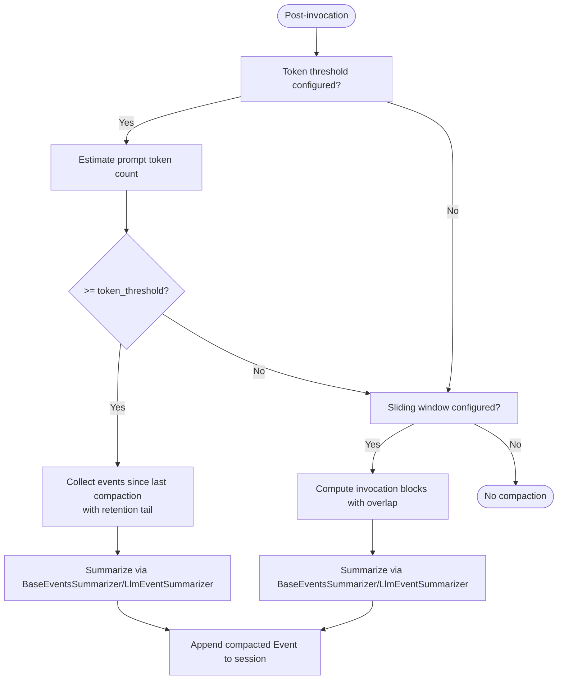
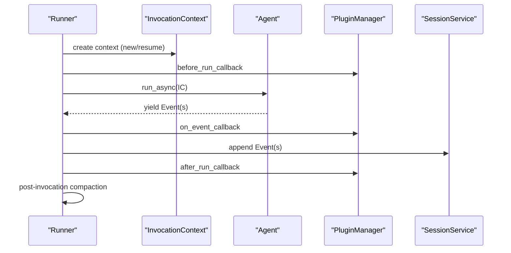
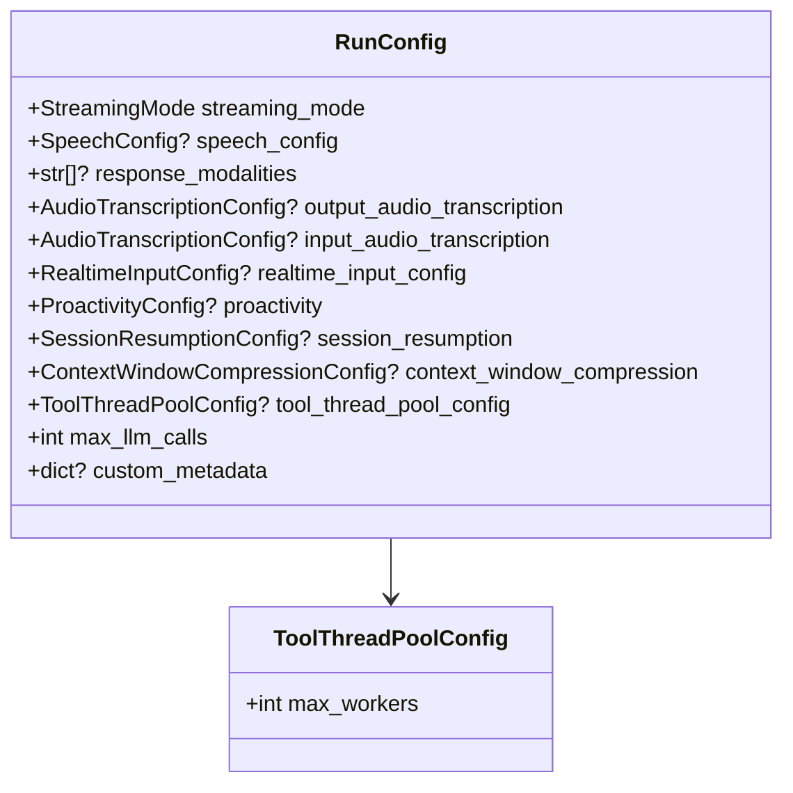
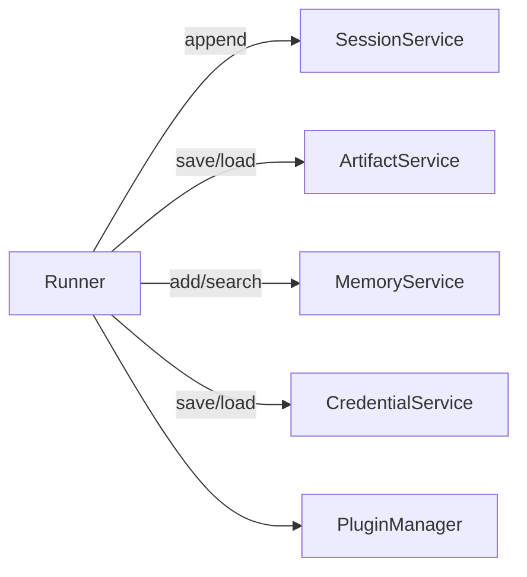
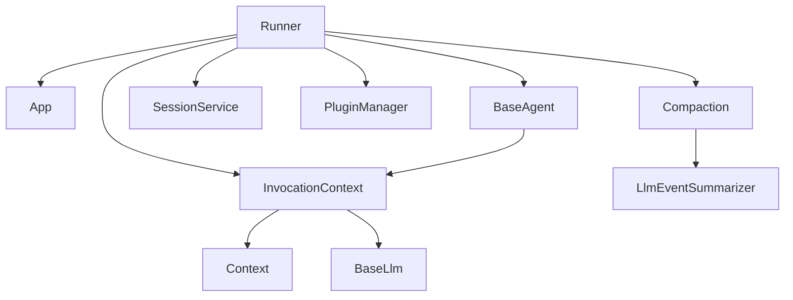

# Application Architecture

<cite>
**Referenced Files in This Document**
- [__init__.py](file://src/google/adk/__init__.py)
- [app.py](file://src/google/adk/apps/app.py)
- [compaction.py](file://src/google/adk/apps/compaction.py)
- [base_events_summarizer.py](file://src/google/adk/apps/base_events_summarizer.py)
- [llm_event_summarizer.py](file://src/google/adk/apps/llm_event_summarizer.py)
- [runners.py](file://src/google/adk/runners.py)
- [event.py](file://src/google/adk/events/event.py)
- [session.py](file://src/google/adk/sessions/session.py)
- [base_agent.py](file://src/google/adk/agents/base_agent.py)
- [plugin_manager.py](file://src/google/adk/plugins/plugin_manager.py)
- [run_config.py](file://src/google/adk/agents/run_config.py)
- [context.py](file://src/google/adk/agents/context.py)
- [invocation_context.py](file://src/google/adk/agents/invocation_context.py)
- [base_llm.py](file://src/google/adk/models/base_llm.py)
- [env_utils.py](file://src/google/adk/utils/env_utils.py)
</cite>

## Table of Contents
1. [Introduction](#introduction)
2. [Project Structure](#project-structure)
3. [Core Components](#core-components)
4. [Architecture Overview](#architecture-overview)
5. [Detailed Component Analysis](#detailed-component-analysis)
6. [Dependency Analysis](#dependency-analysis)
7. [Performance Considerations](#performance-considerations)
8. [Troubleshooting Guide](#troubleshooting-guide)
9. [Conclusion](#conclusion)

## Introduction
This document describes the architecture and runtime configuration of the ADK application. It explains the application lifecycle, initialization procedures, and runtime components. It details the event processing pipeline, request routing, and response handling mechanisms. It also covers compaction and summarization processes for efficient memory management, application configuration options, environment variable handling, and service integration patterns. Architectural diagrams illustrate component interactions and data flow, and practical guidance is provided for performance optimization, resource management, and scalability in production deployments.

## Project Structure
At a high level, the ADK organizes functionality into cohesive modules:
- Apps: Application definition, configuration, and compaction
- Agents: Agent abstractions, invocation context, and execution lifecycle
- Events: Event model and actions
- Sessions: Session model and persistence orchestration
- Plugins: Plugin framework for cross-cutting concerns
- Runners: Orchestration of agent runs, session management, and compaction
- Models: LLM abstraction and connections
- Utils: Environment and utility helpers

**Diagram sources**
- [app.py](file://src/google/adk/apps/app.py#L111-L152)
- [compaction.py](file://src/google/adk/apps/compaction.py#L377-L570)
- [base_events_summarizer.py](file://src/google/adk/apps/base_events_summarizer.py#L25-L48)
- [llm_event_summarizer.py](file://src/google/adk/apps/llm_event_summarizer.py#L30-L136)
- [runners.py](file://src/google/adk/runners.py#L112-L149)
- [plugin_manager.py](file://src/google/adk/plugins/plugin_manager.py#L60-L105)
- [event.py](file://src/google/adk/events/event.py#L31-L130)
- [session.py](file://src/google/adk/sessions/session.py#L27-L51)
- [base_agent.py](file://src/google/adk/agents/base_agent.py#L86-L138)
- [invocation_context.py](file://src/google/adk/agents/invocation_context.py#L100-L223)
- [context.py](file://src/google/adk/agents/context.py#L41-L110)
- [run_config.py](file://src/google/adk/agents/run_config.py#L182-L352)
- [base_llm.py](file://src/google/adk/models/base_llm.py#L32-L206)
- [env_utils.py](file://src/google/adk/utils/env_utils.py#L26-L60)

**Section sources**
- [__init__.py](file://src/google/adk/__init__.py#L17-L24)
- [app.py](file://src/google/adk/apps/app.py#L111-L152)
- [runners.py](file://src/google/adk/runners.py#L112-L149)

## Core Components
- App: Top-level container for an agent tree, plugins, and runtime policies (including resumability and event compaction).
- Runner: Orchestrates agent execution, session management, plugin hooks, and compaction.
- BaseAgent and InvocationContext: Define agent lifecycle, branching, state, and invocation boundaries.
- Event and Session: Immutable event model and session container for conversation history.
- PluginManager: Centralized plugin lifecycle and callback orchestration.
- Summarizers and Compaction: Sliding-window and token-threshold compaction with LLM-based summarization.
- RunConfig: Streaming modes, live agent options, tool thread pools, and limits.
- LLM Abstraction: Unified interface for model generation and live connections.

**Section sources**
- [app.py](file://src/google/adk/apps/app.py#L111-L152)
- [runners.py](file://src/google/adk/runners.py#L112-L149)
- [base_agent.py](file://src/google/adk/agents/base_agent.py#L86-L138)
- [invocation_context.py](file://src/google/adk/agents/invocation_context.py#L100-L223)
- [event.py](file://src/google/adk/events/event.py#L31-L130)
- [session.py](file://src/google/adk/sessions/session.py#L27-L51)
- [plugin_manager.py](file://src/google/adk/plugins/plugin_manager.py#L60-L105)
- [compaction.py](file://src/google/adk/apps/compaction.py#L377-L570)
- [llm_event_summarizer.py](file://src/google/adk/apps/llm_event_summarizer.py#L30-L136)
- [run_config.py](file://src/google/adk/agents/run_config.py#L182-L352)
- [base_llm.py](file://src/google/adk/models/base_llm.py#L32-L206)

## Architecture Overview
The ADK runtime centers on the Runner, which coordinates:
- Session retrieval/creation
- Invocation context setup (including resumability and branching)
- Agent execution with plugin callbacks
- Event emission and optional compaction
- Artifact, memory, and credential service integration

**Diagram sources**
- [runners.py](file://src/google/adk/runners.py#L493-L622)
- [plugin_manager.py](file://src/google/adk/plugins/plugin_manager.py#L130-L144)
- [compaction.py](file://src/google/adk/apps/compaction.py#L377-L570)
- [llm_event_summarizer.py](file://src/google/adk/apps/llm_event_summarizer.py#L83-L136)
- [base_agent.py](file://src/google/adk/agents/base_agent.py#L274-L305)

## Detailed Component Analysis

### Application Container and Configuration
- App encapsulates the root agent, plugins, context cache configuration, resumability policy, and event compaction configuration. It validates app naming and enforces safe identifiers.
- EventsCompactionConfig supports:
  - Sliding window compaction with overlap and invocation thresholds
  - Token-threshold compaction with retention of recent raw events
  - Optional summarizer injection; defaults to LLM-based summarizer when using LLM agents
- ResumabilityConfig enables best-effort resumption across long-running tool calls with idempotency caveat.

**Diagram sources**
- [app.py](file://src/google/adk/apps/app.py#L111-L152)
- [app.py](file://src/google/adk/apps/app.py#L42-L109)

**Section sources**
- [app.py](file://src/google/adk/apps/app.py#L111-L152)
- [app.py](file://src/google/adk/apps/app.py#L42-L109)

### Event Processing Pipeline and Summarization
- Event models capture content, function calls/responses, partial responses, and auxiliary metadata (e.g., long-running tool IDs).
- Summarization is pluggable via BaseEventsSummarizer; LlmEventSummarizer formats conversation history and delegates to an LLM to produce a compacted summary event.
- Compaction runs post-invocation:
  - Token-threshold compaction estimates prompt token counts and compacts older events while retaining a configurable tail of raw events.
  - Sliding-window compaction summarizes blocks of user-initiated invocations with overlap to maintain continuity.

**Diagram sources**
- [compaction.py](file://src/google/adk/apps/compaction.py#L312-L375)
- [compaction.py](file://src/google/adk/apps/compaction.py#L377-L570)
- [llm_event_summarizer.py](file://src/google/adk/apps/llm_event_summarizer.py#L83-L136)

**Section sources**
- [event.py](file://src/google/adk/events/event.py#L31-L130)
- [base_events_summarizer.py](file://src/google/adk/apps/base_events_summarizer.py#L25-L48)
- [llm_event_summarizer.py](file://src/google/adk/apps/llm_event_summarizer.py#L30-L136)
- [compaction.py](file://src/google/adk/apps/compaction.py#L312-L375)
- [compaction.py](file://src/google/adk/apps/compaction.py#L377-L570)

### Request Routing and Response Handling
- Runner.run_async orchestrates:
  - Session retrieval/creation and optional auto-create
  - Invocation context creation (new vs resumed)
  - Agent.run_async execution with plugin hooks
  - Event emission and artifact/memory/credential updates
  - Post-invocation compaction
- InvocationContext tracks invocation boundaries, agent states, live caches, and limits (e.g., max LLM calls).
- Context exposes APIs to load/save artifacts, manage credentials, request confirmations, and interact with memory.

**Diagram sources**
- [runners.py](file://src/google/adk/runners.py#L493-L622)
- [invocation_context.py](file://src/google/adk/agents/invocation_context.py#L100-L223)
- [plugin_manager.py](file://src/google/adk/plugins/plugin_manager.py#L130-L144)
- [base_agent.py](file://src/google/adk/agents/base_agent.py#L274-L305)

**Section sources**
- [runners.py](file://src/google/adk/runners.py#L493-L622)
- [invocation_context.py](file://src/google/adk/agents/invocation_context.py#L100-L223)
- [context.py](file://src/google/adk/agents/context.py#L41-L110)

### Runtime Configuration and Environment Handling
- RunConfig controls streaming modes (NONE, SSE, BIDI), live agent features, tool thread pools, and LLM call limits.
- Environment flags (e.g., progressive SSE streaming) influence runtime behavior.
- Runners validate and align app names with agent origins to prevent session lookup mismatches.

**Diagram sources**
- [run_config.py](file://src/google/adk/agents/run_config.py#L182-L352)

**Section sources**
- [run_config.py](file://src/google/adk/agents/run_config.py#L182-L352)
- [env_utils.py](file://src/google/adk/utils/env_utils.py#L26-L60)
- [runners.py](file://src/google/adk/runners.py#L333-L354)

### Service Integration Patterns
- Runner integrates with:
  - Artifact service for saving/loading artifacts and recording deltas
  - Memory service for adding/searching memory entries
  - Credential service for saving/loading credentials
  - Session service for retrieving/creating sessions and appending events
- Plugins can intercept and modify execution via standardized callbacks.

**Diagram sources**
- [runners.py](file://src/google/adk/runners.py#L135-L148)
- [plugin_manager.py](file://src/google/adk/plugins/plugin_manager.py#L60-L105)

**Section sources**
- [runners.py](file://src/google/adk/runners.py#L135-L148)
- [plugin_manager.py](file://src/google/adk/plugins/plugin_manager.py#L60-L105)

## Dependency Analysis
Key dependencies and coupling:
- Runner depends on App configuration, InvocationContext, BaseAgent, PluginManager, and SessionService.
- Compaction depends on BaseEventsSummarizer and LlmEventSummarizer; it is invoked post-invocation by Runner.
- BaseAgent composes InvocationContext and emits Events; Context augments InvocationContext with state and service accessors.
- LLM abstraction is injected into summarizers and agent flows.

**Diagram sources**
- [runners.py](file://src/google/adk/runners.py#L112-L149)
- [app.py](file://src/google/adk/apps/app.py#L111-L152)
- [compaction.py](file://src/google/adk/apps/compaction.py#L377-L570)
- [llm_event_summarizer.py](file://src/google/adk/apps/llm_event_summarizer.py#L30-L136)
- [base_agent.py](file://src/google/adk/agents/base_agent.py#L86-L138)
- [invocation_context.py](file://src/google/adk/agents/invocation_context.py#L100-L223)
- [context.py](file://src/google/adk/agents/context.py#L41-L110)
- [base_llm.py](file://src/google/adk/models/base_llm.py#L32-L206)

**Section sources**
- [runners.py](file://src/google/adk/runners.py#L112-L149)
- [compaction.py](file://src/google/adk/apps/compaction.py#L377-L570)

## Performance Considerations
- Event compaction reduces context size:
  - Sliding window compaction balances throughput with continuity using overlap windows.
  - Token-threshold compaction proactively summarizes when prompt token estimates exceed a threshold.
- Streaming modes:
  - SSE streaming enables progressive UI updates but requires careful deduplication and filtering of partial vs final events.
  - NONE mode minimizes overhead for batch or CLI workflows.
- Tool thread pools:
  - Offload blocking I/O and CPU-bound tasks to keep the event loop responsive; tune max_workers per workload.
- LLM call limits:
  - Enforce max_llm_calls to prevent runaway loops; monitor for exceptions when exceeded.
- Memory management:
  - Use artifact service to offload large payloads from session storage.
  - Rewind and artifact restoration provide rollback semantics for deterministic replay.

[No sources needed since this section provides general guidance]

## Troubleshooting Guide
- Session not found:
  - Runner raises a clear error when sessions are missing; auto-create can be enabled to create sessions on demand.
  - App name mismatch warnings indicate misalignment between runner configuration and agent origin; resolve by aligning app_name or construction parameters.
- Invocation resumption:
  - When resumable, Runner resolves invocation_id from function responses; ensure function call/response pairs are consistent.
- Plugin errors:
  - PluginManager propagates exceptions from plugin callbacks; review logs for failing plugin names and callback names.
- Rewind semantics:
  - Rewind computes state and artifact deltas to restore prior states; ensure artifact service is configured for versioned restores.

**Section sources**
- [runners.py](file://src/google/adk/runners.py#L384-L394)
- [runners.py](file://src/google/adk/runners.py#L333-L354)
- [runners.py](file://src/google/adk/runners.py#L623-L759)
- [plugin_manager.py](file://src/google/adk/plugins/plugin_manager.py#L299-L306)

## Conclusion
The ADK architecture cleanly separates application configuration (App), runtime orchestration (Runner), agent execution (BaseAgent/InvocationContext), and data persistence (Event/Session). Compaction and summarization reduce memory pressure and improve latency, while RunConfig and environment flags enable flexible streaming and live agent behaviors. The plugin system and service integrations provide extensibility for artifacts, memory, and credentials. For production, combine sliding-window and token-threshold compaction, appropriate streaming modes, tool thread pools, and strict LLM call limits to achieve robust performance and scalability.