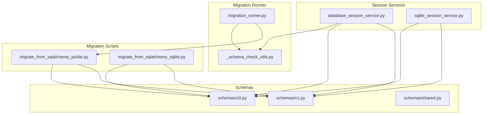
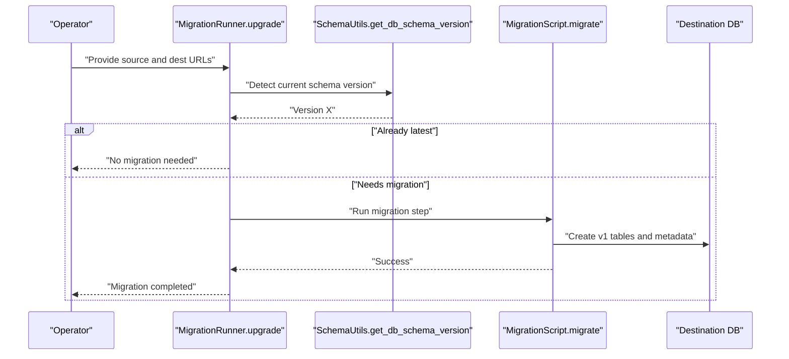
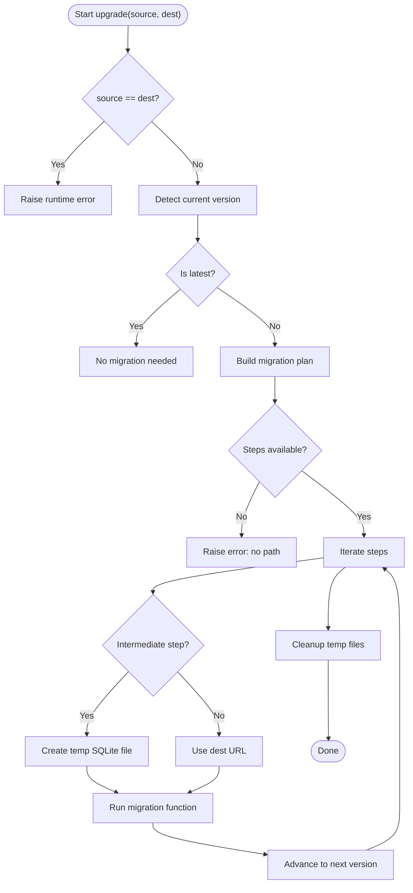
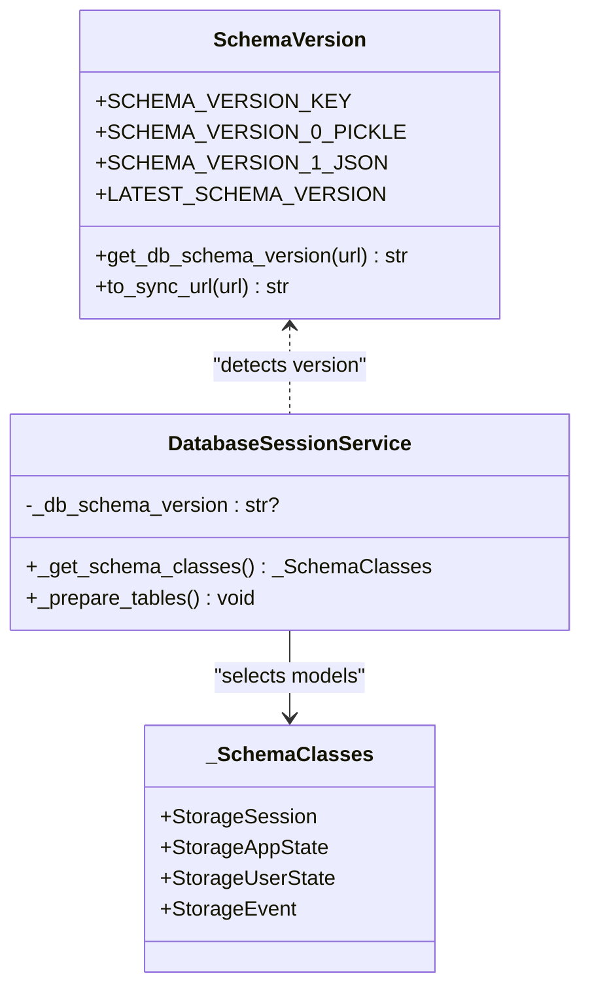
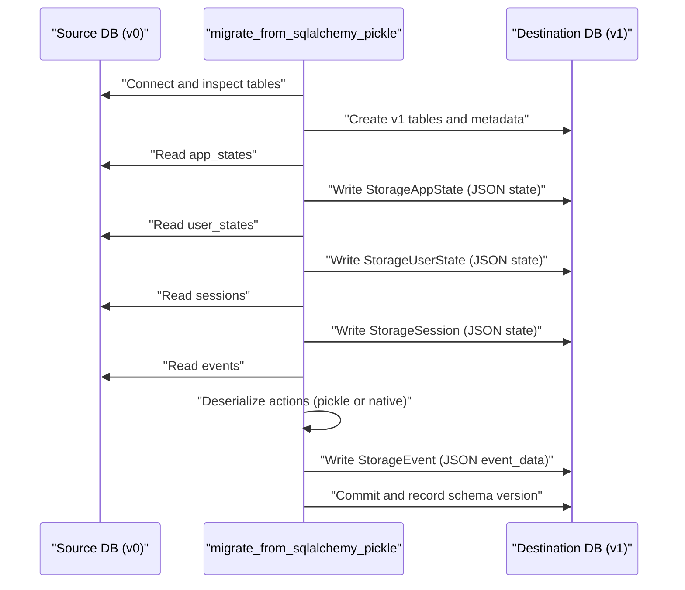
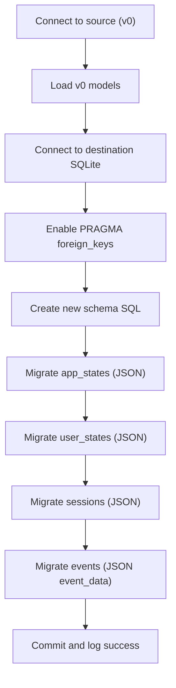
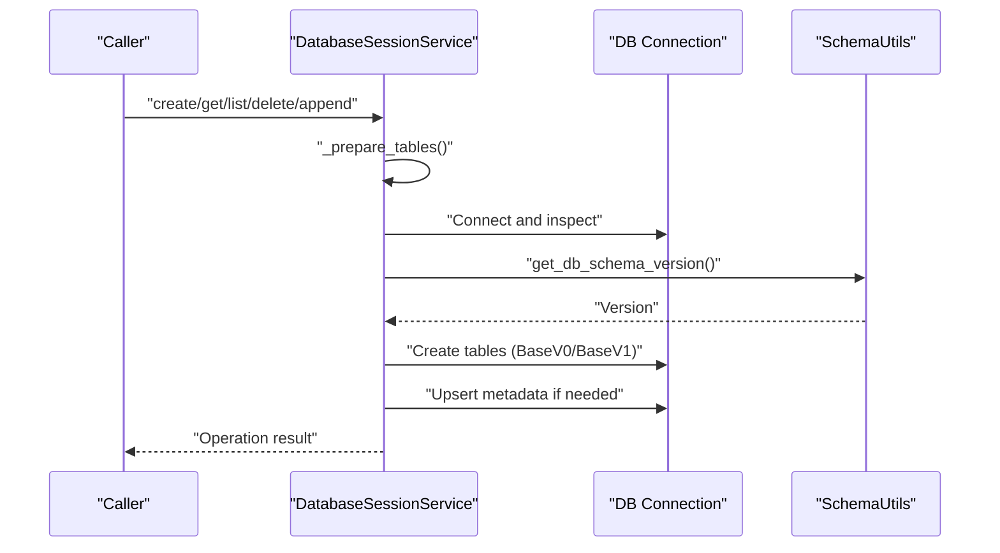
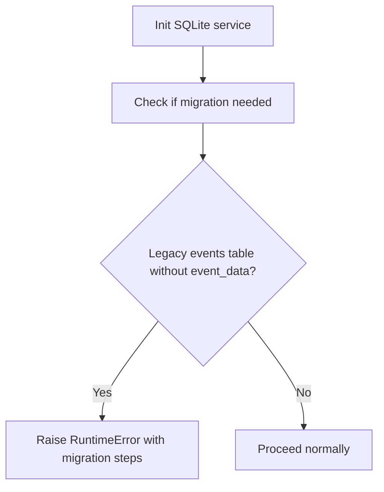
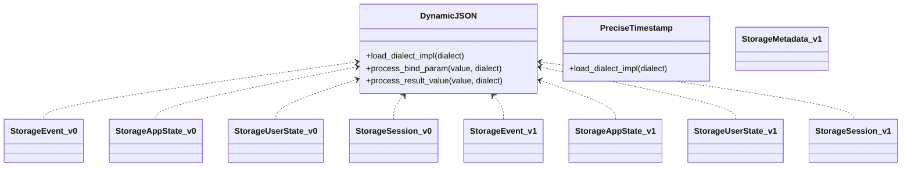
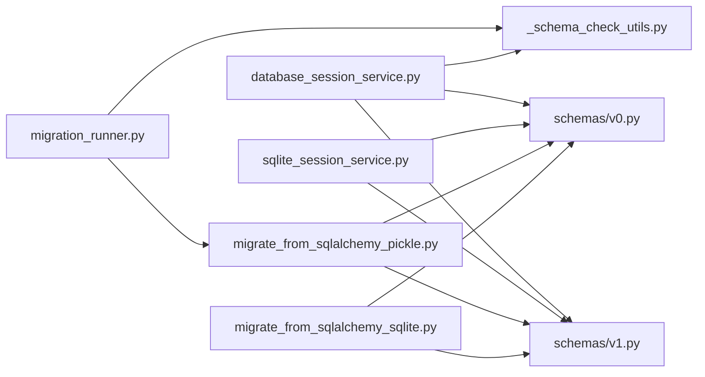

# Database Migration

<cite>
**Referenced Files in This Document**
- [migration_runner.py](file://src/google/adk/sessions/migration/migration_runner.py)
- [_schema_check_utils.py](file://src/google/adk/sessions/migration/_schema_check_utils.py)
- [migrate_from_sqlalchemy_pickle.py](file://src/google/adk/sessions/migration/migrate_from_sqlalchemy_pickle.py)
- [migrate_from_sqlalchemy_sqlite.py](file://src/google/adk/sessions/migration/migrate_from_sqlalchemy_sqlite.py)
- [database_session_service.py](file://src/google/adk/sessions/database_session_service.py)
- [sqlite_session_service.py](file://src/google/adk/sessions/sqlite_session_service.py)
- [v0.py](file://src/google/adk/sessions/schemas/v0.py)
- [v1.py](file://src/google/adk/sessions/schemas/v1.py)
- [shared.py](file://src/google/adk/sessions/schemas/shared.py)
- [db_migration.sh](file://scripts/db_migration.sh)
- [test_migration.py](file://tests/unittests/sessions/migration/test_migration.py)
- [test_database_schema.py](file://tests/unittests/sessions/migration/test_database_schema.py)
</cite>

## Table of Contents
1. [Introduction](#introduction)
2. [Project Structure](#project-structure)
3. [Core Components](#core-components)
4. [Architecture Overview](#architecture-overview)
5. [Detailed Component Analysis](#detailed-component-analysis)
6. [Dependency Analysis](#dependency-analysis)
7. [Performance Considerations](#performance-considerations)
8. [Troubleshooting Guide](#troubleshooting-guide)
9. [Conclusion](#conclusion)
10. [Appendices](#appendices)

## Introduction
This document describes database migration procedures and schema management for ADK production systems. It explains the migration runner architecture, automated migration processes, schema evolution patterns, version management, and backward compatibility considerations. It also covers the pickle-to-SQLite migration process, data preservation strategies, testing procedures, rollback mechanisms, production deployment workflows, and practical examples for schema comparison and validation. Guidance is included for zero-downtime migrations and common issues.

## Project Structure
The migration-related code resides under the sessions package and includes:
- Migration runner and utilities for schema detection and upgrades
- Migration scripts for moving from SQLAlchemy-backed schemas to the new JSON-based schema
- SQLite-specific migration from legacy SQLAlchemy SQLite to the new JSON schema
- Database session services that prepare tables and enforce schema versions
- Schema definitions for v0 (pickle-based) and v1 (JSON-based) with shared types

**Diagram sources**
- [migration_runner.py](file://src/google/adk/sessions/migration/migration_runner.py#L1-L128)
- [_schema_check_utils.py](file://src/google/adk/sessions/migration/_schema_check_utils.py#L1-L142)
- [migrate_from_sqlalchemy_pickle.py](file://src/google/adk/sessions/migration/migrate_from_sqlalchemy_pickle.py#L1-L318)
- [migrate_from_sqlalchemy_sqlite.py](file://src/google/adk/sessions/migration/migrate_from_sqlalchemy_sqlite.py#L1-L173)
- [database_session_service.py](file://src/google/adk/sessions/database_session_service.py#L1-L661)
- [sqlite_session_service.py](file://src/google/adk/sessions/sqlite_session_service.py#L1-L596)
- [v0.py](file://src/google/adk/sessions/schemas/v0.py#L1-L387)
- [v1.py](file://src/google/adk/sessions/schemas/v1.py#L1-L248)
- [shared.py](file://src/google/adk/sessions/schemas/shared.py#L1-L68)

**Section sources**
- [migration_runner.py](file://src/google/adk/sessions/migration/migration_runner.py#L1-L128)
- [database_session_service.py](file://src/google/adk/sessions/database_session_service.py#L1-L661)
- [sqlite_session_service.py](file://src/google/adk/sessions/sqlite_session_service.py#L1-L596)
- [v0.py](file://src/google/adk/sessions/schemas/v0.py#L1-L387)
- [v1.py](file://src/google/adk/sessions/schemas/v1.py#L1-L248)
- [shared.py](file://src/google/adk/sessions/schemas/shared.py#L1-L68)

## Core Components
- Migration runner: Orchestrates multi-step migrations from legacy schemas to the latest version, using temporary SQLite intermediates when needed.
- Schema detection utilities: Determine current schema version from database metadata or table structure.
- Migration scripts:
  - From SQLAlchemy-backed pickle-based schema to JSON-based schema
  - From SQLAlchemy SQLite to new SQLite JSON schema
- Session services:
  - DatabaseSessionService: Lazy table preparation, schema version enforcement, and dialect-aware timestamp handling
  - SqliteSessionService: Detects legacy SQLite schema and raises a controlled error with migration guidance

**Section sources**
- [migration_runner.py](file://src/google/adk/sessions/migration/migration_runner.py#L28-L89)
- [_schema_check_utils.py](file://src/google/adk/sessions/migration/_schema_check_utils.py#L26-L76)
- [migrate_from_sqlalchemy_pickle.py](file://src/google/adk/sessions/migration/migrate_from_sqlalchemy_pickle.py#L166-L296)
- [migrate_from_sqlalchemy_sqlite.py](file://src/google/adk/sessions/migration/migrate_from_sqlalchemy_sqlite.py#L34-L147)
- [database_session_service.py](file://src/google/adk/sessions/database_session_service.py#L255-L311)
- [sqlite_session_service.py](file://src/google/adk/sessions/sqlite_session_service.py#L139-L154)

## Architecture Overview
The migration architecture separates concerns:
- Detection: Determine current schema version using metadata and table inspection
- Orchestration: Chain migration steps and manage temporary artifacts
- Execution: Perform data transformations and schema updates
- Validation: Ensure schema version is recorded and tables are created

**Diagram sources**
- [migration_runner.py](file://src/google/adk/sessions/migration/migration_runner.py#L45-L127)
- [_schema_check_utils.py](file://src/google/adk/sessions/migration/_schema_check_utils.py#L79-L141)
- [migrate_from_sqlalchemy_pickle.py](file://src/google/adk/sessions/migration/migrate_from_sqlalchemy_pickle.py#L166-L296)

## Detailed Component Analysis

### Migration Runner
The runner maintains a migration map keyed by start version to the next version and the migration function. It iteratively applies migrations until reaching the latest version, using temporary SQLite files for intermediate steps when migrating across different database engines.

**Diagram sources**
- [migration_runner.py](file://src/google/adk/sessions/migration/migration_runner.py#L45-L127)

**Section sources**
- [migration_runner.py](file://src/google/adk/sessions/migration/migration_runner.py#L28-L89)
- [migration_runner.py](file://src/google/adk/sessions/migration/migration_runner.py#L96-L127)

### Schema Evolution and Version Management
- Versions:
  - v0: Uses pickle serialization for event actions and JSON for other fields
  - v1: Consolidates event data into a single JSON field and stores schema version in a metadata table
- Version detection:
  - Reads a metadata table if present
  - Falls back to inspecting table/column presence to detect legacy v0
  - Returns latest version for new databases
- Backward compatibility:
  - DatabaseSessionService dynamically selects schema classes based on detected version
  - Timestamp handling accounts for dialect differences (e.g., SQLite naive datetimes)

**Diagram sources**
- [_schema_check_utils.py](file://src/google/adk/sessions/migration/_schema_check_utils.py#L26-L76)
- [database_session_service.py](file://src/google/adk/sessions/database_session_service.py#L119-L197)

**Section sources**
- [_schema_check_utils.py](file://src/google/adk/sessions/migration/_schema_check_utils.py#L26-L76)
- [database_session_service.py](file://src/google/adk/sessions/database_session_service.py#L119-L197)
- [database_session_service.py](file://src/google/adk/sessions/database_session_service.py#L255-L311)

### Pickle-to-JSON Migration (SQLAlchemy)
This script migrates from the legacy SQLAlchemy schema (pickle-based actions) to the new JSON-based schema. It:
- Converts async driver URLs to sync equivalents
- Creates v1 tables in the destination
- Migrates app_states, user_states, sessions, and events
- Serializes event data as JSON and records schema version

**Diagram sources**
- [migrate_from_sqlalchemy_pickle.py](file://src/google/adk/sessions/migration/migrate_from_sqlalchemy_pickle.py#L166-L296)
- [v0.py](file://src/google/adk/sessions/schemas/v0.py#L179-L351)
- [v1.py](file://src/google/adk/sessions/schemas/v1.py#L55-L212)

**Section sources**
- [migrate_from_sqlalchemy_pickle.py](file://src/google/adk/sessions/migration/migrate_from_sqlalchemy_pickle.py#L166-L296)
- [v0.py](file://src/google/adk/sessions/schemas/v0.py#L179-L351)
- [v1.py](file://src/google/adk/sessions/schemas/v1.py#L55-L212)

### Pickle-to-JSON Migration (SQLite)
This script migrates from an existing SQLAlchemy SQLite database to the new SQLite JSON schema. It:
- Ensures v0 tables exist for inspection
- Creates the new SQLite schema with foreign keys enabled
- Inserts JSON-serialized state and event_data into the new schema

**Diagram sources**
- [migrate_from_sqlalchemy_sqlite.py](file://src/google/adk/sessions/migration/migrate_from_sqlalchemy_sqlite.py#L34-L147)
- [sqlite_session_service.py](file://src/google/adk/sessions/sqlite_session_service.py#L43-L93)

**Section sources**
- [migrate_from_sqlalchemy_sqlite.py](file://src/google/adk/sessions/migration/migrate_from_sqlalchemy_sqlite.py#L34-L147)
- [sqlite_session_service.py](file://src/google/adk/sessions/sqlite_session_service.py#L43-L93)

### Database Session Service (Lazy Preparation and Version Enforcement)
The DatabaseSessionService:
- Lazily prepares tables on first use
- Detects schema version and creates appropriate tables
- Enforces schema version metadata
- Handles dialect-specific timestamp conversions and foreign key pragmas for SQLite

**Diagram sources**
- [database_session_service.py](file://src/google/adk/sessions/database_session_service.py#L255-L311)
- [_schema_check_utils.py](file://src/google/adk/sessions/migration/_schema_check_utils.py#L79-L141)

**Section sources**
- [database_session_service.py](file://src/google/adk/sessions/database_session_service.py#L255-L311)
- [database_session_service.py](file://src/google/adk/sessions/database_session_service.py#L105-L116)
- [database_session_service.py](file://src/google/adk/sessions/database_session_service.py#L140-L160)

### SQLite Session Service (Legacy Schema Detection)
The SQLite session service detects legacy schema and raises a controlled error with explicit migration guidance, preventing accidental use of outdated schemas.

**Diagram sources**
- [sqlite_session_service.py](file://src/google/adk/sessions/sqlite_session_service.py#L139-L154)
- [sqlite_session_service.py](file://src/google/adk/sessions/sqlite_session_service.py#L557-L585)

**Section sources**
- [sqlite_session_service.py](file://src/google/adk/sessions/sqlite_session_service.py#L139-L154)
- [sqlite_session_service.py](file://src/google/adk/sessions/sqlite_session_service.py#L557-L585)

### Schema Definitions and Shared Types
- v0 schema:
  - Uses pickle for actions and JSON for dynamic fields
  - Defines relationships and constraints for sessions/events/app/user states
- v1 schema:
  - Consolidates event data into a single JSON field
  - Adds a metadata table to track schema version
  - Improves cascade deletion behavior
- Shared types:
  - DynamicJSON: JSONB on PostgreSQL, LONGTEXT on MySQL, TEXT elsewhere
  - PreciseTimestamp: Microsecond precision with dialect-specific handling

**Diagram sources**
- [shared.py](file://src/google/adk/sessions/schemas/shared.py#L29-L68)
- [v0.py](file://src/google/adk/sessions/schemas/v0.py#L98-L386)
- [v1.py](file://src/google/adk/sessions/schemas/v1.py#L55-L247)

**Section sources**
- [v0.py](file://src/google/adk/sessions/schemas/v0.py#L98-L386)
- [v1.py](file://src/google/adk/sessions/schemas/v1.py#L55-L247)
- [shared.py](file://src/google/adk/sessions/schemas/shared.py#L29-L68)

## Dependency Analysis
- Migration runner depends on schema detection utilities and migration scripts
- Database session service depends on schema detection utilities and schema modules
- SQLite session service depends on schema definitions and shared types
- Migration scripts depend on schema modules and SQLAlchemy ORM

**Diagram sources**
- [migration_runner.py](file://src/google/adk/sessions/migration/migration_runner.py#L23-L39)
- [database_session_service.py](file://src/google/adk/sessions/database_session_service.py#L47-L59)
- [sqlite_session_service.py](file://src/google/adk/sessions/sqlite_session_service.py#L32-L39)
- [migrate_from_sqlalchemy_pickle.py](file://src/google/adk/sessions/migration/migrate_from_sqlalchemy_pickle.py#L30-L36)
- [migrate_from_sqlalchemy_sqlite.py](file://src/google/adk/sessions/migration/migrate_from_sqlalchemy_sqlite.py#L25-L29)

**Section sources**
- [migration_runner.py](file://src/google/adk/sessions/migration/migration_runner.py#L23-L39)
- [database_session_service.py](file://src/google/adk/sessions/database_session_service.py#L47-L59)
- [sqlite_session_service.py](file://src/google/adk/sessions/sqlite_session_service.py#L32-L39)
- [migrate_from_sqlalchemy_pickle.py](file://src/google/adk/sessions/migration/migrate_from_sqlalchemy_pickle.py#L30-L36)
- [migrate_from_sqlalchemy_sqlite.py](file://src/google/adk/sessions/migration/migrate_from_sqlalchemy_sqlite.py#L25-L29)

## Performance Considerations
- Migration scripts iterate rows and perform per-row transformations; batch operations and indexing on large datasets can improve throughput
- Timestamp handling differs by dialect; ensure consistent timezone handling to avoid conversion overhead
- SQLite foreign keys are enabled via PRAGMA; enabling constraints can slow down bulk writes but improves data integrity
- Use temporary SQLite intermediates for cross-engine migrations to minimize downtime and simplify rollback

## Troubleshooting Guide
Common issues and resolutions:
- In-place migration not supported: The runner rejects identical source and destination URLs; provide separate URLs for source and destination
- Legacy SQLite schema detected: The SQLite service raises a controlled error with explicit migration steps; run the SQLite migration script to upgrade
- Schema version mismatch: Ensure the metadata table is present and correct; re-run migration to set the latest schema version
- Rollback on exceptions: DatabaseSessionService wraps operations in sessions that roll back on errors; verify transaction boundaries and connection pooling
- Alembic-based migrations: Use the provided script to initialize Alembic, stamp, autogenerate, and upgrade; ensure model imports are correct in generated revision files

**Section sources**
- [migration_runner.py](file://src/google/adk/sessions/migration/migration_runner.py#L69-L73)
- [sqlite_session_service.py](file://src/google/adk/sessions/sqlite_session_service.py#L145-L154)
- [database_session_service.py](file://src/google/adk/sessions/database_session_service.py#L200-L214)
- [db_migration.sh](file://scripts/db_migration.sh#L104-L141)

## Conclusion
ADK’s migration framework provides a robust, version-aware pipeline for evolving session and event schemas. By combining schema detection, stepwise migrations, and careful data preservation, operators can safely upgrade production databases. The framework supports both cross-engine migrations and SQLite-specific transitions, with clear guidance and diagnostics to maintain reliability and reduce risk.

## Appendices

### Practical Examples and Procedures
- Pickle-to-JSON migration (SQLAlchemy):
  - Use the migration script with source and destination URLs
  - Verify destination tables and metadata after completion
- SQLite migration:
  - Use the SQLite migration script to move from legacy SQLAlchemy SQLite to the new JSON schema
- Alembic-based upgrades:
  - Use the provided shell script to initialize Alembic, configure metadata, stamp, autogenerate, and upgrade

Validation and testing:
- Unit tests validate migration behavior and schema detection
- Use assertions to confirm schema version and table creation

**Section sources**
- [migrate_from_sqlalchemy_pickle.py](file://src/google/adk/sessions/migration/migrate_from_sqlalchemy_pickle.py#L298-L317)
- [migrate_from_sqlalchemy_sqlite.py](file://src/google/adk/sessions/migration/migrate_from_sqlalchemy_sqlite.py#L150-L172)
- [db_migration.sh](file://scripts/db_migration.sh#L19-L26)
- [test_migration.py](file://tests/unittests/sessions/migration/test_migration.py)
- [test_database_schema.py](file://tests/unittests/sessions/migration/test_database_schema.py)