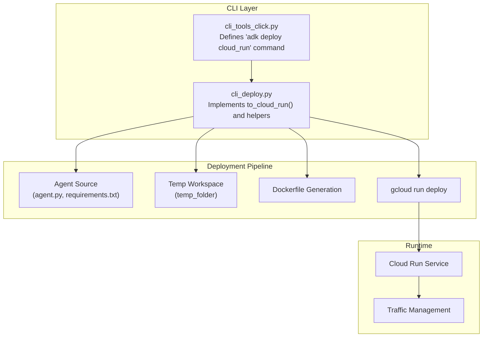
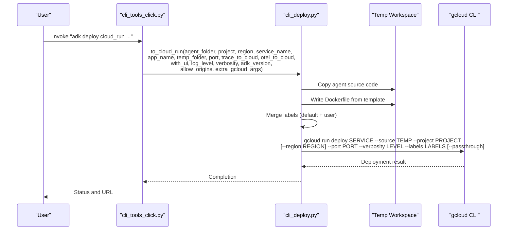
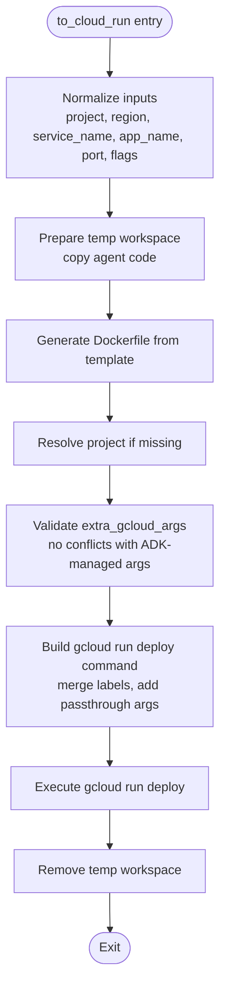
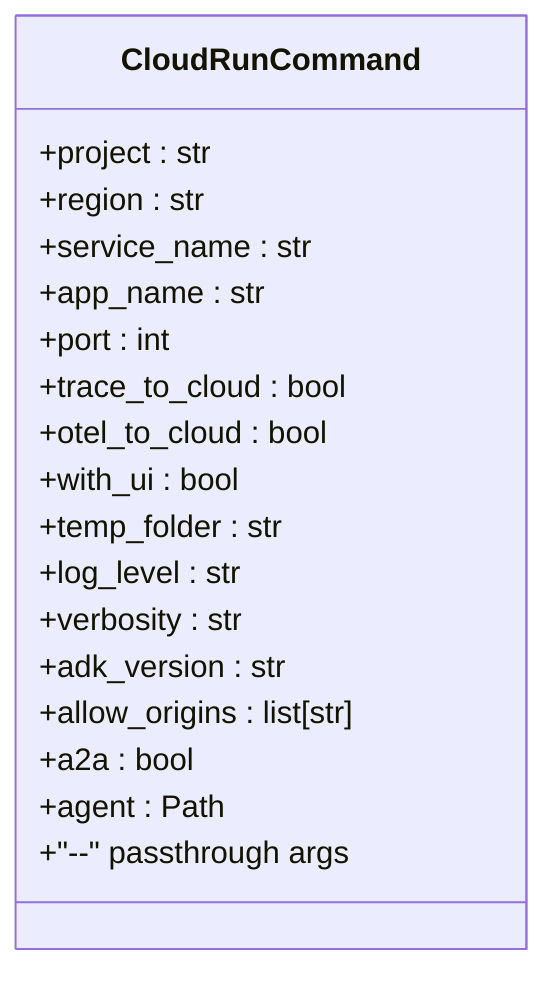
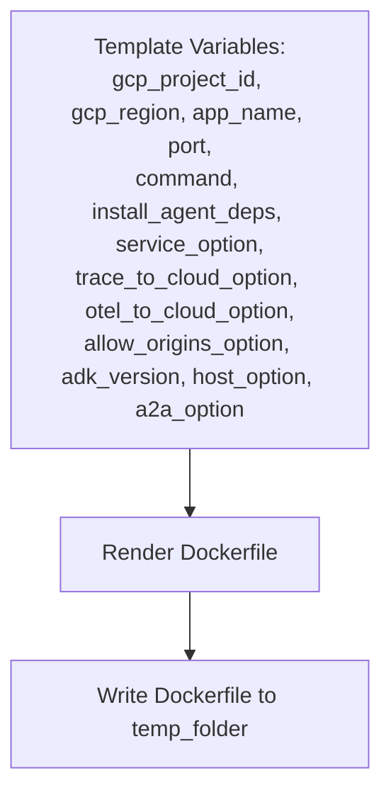
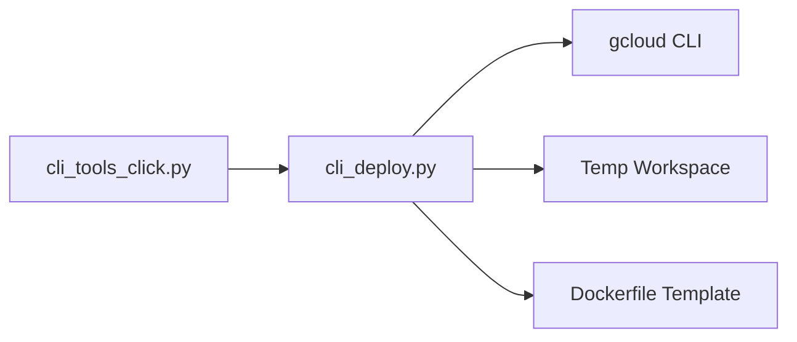

# Cloud Run Deployment

<cite>
**Referenced Files in This Document**
- [cli_deploy.py](file://src/google/adk/cli/cli_deploy.py)
- [cli_tools_click.py](file://src/google/adk/cli/cli_tools_click.py)
- [test_cli_deploy_to_cloud_run.py](file://tests/unittests/cli/utils/test_cli_deploy_to_cloud_run.py)
- [test_cli_tools_click.py](file://tests/unittests/cli/utils/test_cli_tools_click.py)
- [test_cors_regex.py](file://tests/unittests/cli/test_cors_regex.py)
</cite>

## Table of Contents
1. [Introduction](#introduction)
2. [Project Structure](#project-structure)
3. [Core Components](#core-components)
4. [Architecture Overview](#architecture-overview)
5. [Detailed Component Analysis](#detailed-component-analysis)
6. [Dependency Analysis](#dependency-analysis)
7. [Performance Considerations](#performance-considerations)
8. [Troubleshooting Guide](#troubleshooting-guide)
9. [Conclusion](#conclusion)
10. [Appendices](#appendices)

## Introduction
This document explains how to deploy an ADK agent to Google Cloud Run using the ADK CLI. It covers the complete deployment pipeline: Docker image preparation, service configuration, traffic management, and operational concerns such as service discovery, health checks, and rollback. It also documents the to_cloud_run function, including parameter validation, Dockerfile generation, and gcloud CLI integration. Practical examples, environment variable setup, CORS configuration, scaling, and troubleshooting are included.

## Project Structure
The Cloud Run deployment capability is implemented in the CLI layer and integrates with the gcloud command-line tool. The primary implementation resides in the CLI deployment module, with supporting CLI wiring and tests.

**Diagram sources**
- [cli_tools_click.py](file://src/google/adk/cli/cli_tools_click.py#L1486-L1622)
- [cli_deploy.py](file://src/google/adk/cli/cli_deploy.py#L626-L802)

**Section sources**
- [cli_tools_click.py](file://src/google/adk/cli/cli_tools_click.py#L1486-L1622)
- [cli_deploy.py](file://src/google/adk/cli/cli_deploy.py#L626-L802)

## Core Components
- to_cloud_run: Orchestrates Dockerfile generation, temporary workspace preparation, and invokes gcloud run deploy with validated parameters and labels.
- CLI command: Provides user-facing options for project, region, service name, app name, port, UI toggle, verbosity, and passthrough flags.
- Dockerfile template: Builds a minimal Python runtime image, installs ADK, copies agent code, optionally installs agent dependencies, exposes the port, and starts the ADK server.
- Label merging: Automatically adds a default label and merges user-provided labels.
- CORS configuration: Supports literal origins and regex patterns via allow_origins.

**Section sources**
- [cli_deploy.py](file://src/google/adk/cli/cli_deploy.py#L626-L802)
- [cli_deploy.py](file://src/google/adk/cli/cli_deploy.py#L65-L102)
- [cli_deploy.py](file://src/google/adk/cli/cli_deploy.py#L425-L469)
- [cli_tools_click.py](file://src/google/adk/cli/cli_tools_click.py#L1486-L1622)
- [test_cors_regex.py](file://tests/unittests/cli/test_cors_regex.py#L80-L182)

## Architecture Overview
The deployment flow transforms a local agent directory into a Cloud Run-ready container image and deploys it using gcloud. The CLI validates inputs, prepares a temporary workspace, writes a Dockerfile, and executes gcloud run deploy with merged labels and optional passthrough arguments.

**Diagram sources**
- [cli_tools_click.py](file://src/google/adk/cli/cli_tools_click.py#L1486-L1622)
- [cli_deploy.py](file://src/google/adk/cli/cli_deploy.py#L626-L802)

## Detailed Component Analysis

### to_cloud_run Function
The to_cloud_run function performs the following steps:
- Validates and normalizes inputs (project, region, service name, app name, ports, flags).
- Prepares a temporary workspace by copying agent source code and optionally installing agent dependencies.
- Generates a Dockerfile from a template, injecting environment variables, ADK version, and service options.
- Resolves the project if not provided.
- Validates that user-supplied gcloud arguments do not conflict with ADK-managed arguments.
- Builds the gcloud run deploy command with merged labels and optional passthrough arguments.
- Executes the deployment and ensures cleanup of the temporary workspace.

Key behaviors:
- Project resolution: Uses gcloud config if project is not provided.
- Conflict detection: Prevents overriding ADK-managed flags like --source, --project, --port, --verbosity, and --region when present in extra_gcloud_args.
- Label merging: Ensures a default "created-by=adk" label and merges user-provided labels.
- Cleanup: Removes the temporary workspace regardless of success or failure.

**Diagram sources**
- [cli_deploy.py](file://src/google/adk/cli/cli_deploy.py#L626-L802)

**Section sources**
- [cli_deploy.py](file://src/google/adk/cli/cli_deploy.py#L626-L802)
- [cli_deploy.py](file://src/google/adk/cli/cli_deploy.py#L425-L469)

### CLI Command Options
The CLI command supports the following options:
- --project: Target GCP project (defaults to gcloud config).
- --region: Target region for Cloud Run.
- --service_name: Cloud Run service name (defaulted if not provided).
- --app_name: App name inside the container (defaults to agent folder name).
- --port: Port for the ADK server (default 8000).
- --trace_to_cloud: Enable Cloud Trace export.
- --otel_to_cloud: Enable OpenTelemetry export to Google Cloud.
- --with_ui: Toggle to deploy ADK Web UI (otherwise API server only).
- --temp_folder: Temporary workspace directory for generated files.
- --log_level: Logging level for gcloud output.
- --verbosity: Deprecated alias for log level.
- --adk_version: ADK version to install in the container.
- --allow_origins: CORS origins (supports literal and regex patterns).
- --a2a: Enable A2A mode flag.
- Positional agent argument: Path to the agent source directory.
- Passthrough arguments after "--": Extra gcloud flags (validated for conflicts).

**Diagram sources**
- [cli_tools_click.py](file://src/google/adk/cli/cli_tools_click.py#L1486-L1622)

**Section sources**
- [cli_tools_click.py](file://src/google/adk/cli/cli_tools_click.py#L1486-L1622)

### Dockerfile Generation
The Dockerfile template:
- Uses a slim Python base image and creates a non-root user.
- Sets environment variables for GCP project and region.
- Installs the specified ADK version.
- Copies agent code into /app/agents/<app_name>.
- Optionally installs agent dependencies from requirements.txt.
- Exposes the configured port.
- Starts the ADK server with appropriate flags (web or api_server), host, CORS, tracing, telemetry, and service URIs.

**Diagram sources**
- [cli_deploy.py](file://src/google/adk/cli/cli_deploy.py#L65-L102)

**Section sources**
- [cli_deploy.py](file://src/google/adk/cli/cli_deploy.py#L65-L102)

### Traffic Management and Service Discovery
- Service naming: Use --service_name to set the Cloud Run service name. The CLI passes this directly to gcloud run deploy.
- Regional deployment: Use --region to target a specific region; the CLI injects --region into the gcloud command when provided.
- Traffic management: After deployment, Cloud Run manages traffic via revisions and traffic allocation. The CLI does not configure traffic percentages; use gcloud run services or Console for traffic changes.
- Service discovery: Cloud Run services are addressable via HTTPS URLs managed by GCP. The CLI prints the resulting service URL after deployment completes.

**Section sources**
- [cli_tools_click.py](file://src/google/adk/cli/cli_tools_click.py#L1486-L1622)
- [cli_deploy.py](file://src/google/adk/cli/cli_deploy.py#L746-L799)

### Scaling and Resource Configuration
- Horizontal scaling: Cloud Run scales containers automatically based on concurrent requests. Configure concurrency and max instances via gcloud flags passed through "--".
- CPU/memory: Pass --memory and --cpu via "--" to adjust per-container resources.
- Timeout and revision management: Use --timeout and other flags after "--" to tune behavior.
- Local storage fallback: When not using external services, Cloud Run falls back to in-memory storage unless local storage is forced.

Note: The CLI validates that user-provided gcloud flags do not conflict with ADK-managed flags such as --source, --project, --port, --verbosity, and --region.

**Section sources**
- [cli_deploy.py](file://src/google/adk/cli/cli_deploy.py#L425-L469)
- [cli_deploy.py](file://src/google/adk/cli/cli_deploy.py#L756-L798)
- [test_cli_deploy_to_cloud_run.py](file://tests/unittests/cli/utils/test_cli_deploy_to_cloud_run.py#L277-L349)

### CORS Configuration
- Literal origins: Provide a list of origins (e.g., https://example.com).
- Regex patterns: Prefix patterns with "regex:" (e.g., regex:https://.*\.example\.com).
- Wildcard: Use "*" to allow any origin.
- Middleware: The underlying server config applies allow_origins and allow_origin_regex accordingly.

**Section sources**
- [cli_deploy.py](file://src/google/adk/cli/cli_deploy.py#L713-L716)
- [test_cors_regex.py](file://tests/unittests/cli/test_cors_regex.py#L80-L182)

### Health Checks and Rollback Procedures
- Health checks: Cloud Run performs liveness and readiness probes based on the container’s listening port. Ensure the ADK server listens on the configured port and responds to health endpoints.
- Rollback: Use gcloud run services set-traffic to switch traffic to a previous revision. Alternatively, use the Cloud Console to manage traffic splits and promote a previous revision.

[No sources needed since this section provides general guidance]

## Dependency Analysis
The CLI command delegates to the deployment implementation, which depends on:
- gcloud CLI availability and authentication.
- Properly formatted agent source code with agent.py and optional requirements.txt.
- Valid ADK version string for installation.

**Diagram sources**
- [cli_tools_click.py](file://src/google/adk/cli/cli_tools_click.py#L1486-L1622)
- [cli_deploy.py](file://src/google/adk/cli/cli_deploy.py#L626-L802)

**Section sources**
- [cli_tools_click.py](file://src/google/adk/cli/cli_tools_click.py#L1486-L1622)
- [cli_deploy.py](file://src/google/adk/cli/cli_deploy.py#L626-L802)

## Performance Considerations
- Minimize cold starts: Keep the container image small by limiting dependencies and avoiding unnecessary layers.
- Optimize startup: Reduce initialization cost by avoiding heavy imports during module load.
- Concurrency tuning: Adjust Cloud Run concurrency and max instances via passthrough flags to balance latency and cost.

[No sources needed since this section provides general guidance]

## Troubleshooting Guide
Common issues and resolutions:
- Dependency conflicts or missing packages:
  - Ensure requirements.txt lists all dependencies. The Dockerfile installs agent dependencies if present.
  - Use passthrough flags after "--" to increase memory or CPU if builds fail due to resource limits.
- Authentication failures:
  - Confirm gcloud is authenticated and has the correct project selected. The CLI resolves the project if not provided.
- Conflicting gcloud arguments:
  - Remove flags that ADK manages (--source, --project, --port, --verbosity, --region) from extra_gcloud_args.
- CORS misconfiguration:
  - Verify allow_origins includes the correct literal or regex patterns. The CLI passes these to the server.
- Resource limits:
  - Increase container resources using --memory and --cpu after "--" if builds or runs fail due to insufficient resources.
- Cleanup failures:
  - The CLI removes the temporary workspace on success and failure. If interrupted, manually remove the temp directory.

**Section sources**
- [cli_deploy.py](file://src/google/adk/cli/cli_deploy.py#L425-L469)
- [cli_deploy.py](file://src/google/adk/cli/cli_deploy.py#L756-L798)
- [test_cli_deploy_to_cloud_run.py](file://tests/unittests/cli/utils/test_cli_deploy_to_cloud_run.py#L237-L275)

## Conclusion
The ADK CLI provides a streamlined path to deploy agents to Cloud Run. The to_cloud_run function automates Dockerfile generation, validates inputs, merges labels, and invokes gcloud run deploy with safe defaults and conflict prevention. With proper configuration of CORS, scaling, and service URIs, you can reliably deploy and operate ADK agents on Cloud Run.

## Appendices

### Practical Deployment Commands
- Basic deployment:
  - adk deploy cloud_run --project YOUR_PROJECT --region YOUR_REGION /path/to/agent
- With UI and custom service name:
  - adk deploy cloud_run --project YOUR_PROJECT --region YOUR_REGION --service_name YOUR_SERVICE --with_ui /path/to/agent
- With extra gcloud flags:
  - adk deploy cloud_run --project YOUR_PROJECT --region YOUR_REGION /path/to/agent -- --memory=2Gi --cpu=2 --max-instances=10
- With CORS:
  - adk deploy cloud_run --project YOUR_PROJECT --region YOUR_REGION --allow_origins https://app.example.com,regex:https://.*\.example\.com /path/to/agent

[No sources needed since this section provides general guidance]

### Environment Variables Setup
- Project and region:
  - Set via CLI flags or rely on gcloud config defaults.
- ADK service URIs:
  - Configure session_service_uri, artifact_service_uri, memory_service_uri according to your backend needs.
- Local storage:
  - Use --use_local_storage or --no_use_local_storage depending on whether you want local .adk storage in the container.

**Section sources**
- [cli_tools_click.py](file://src/google/adk/cli/cli_tools_click.py#L490-L574)