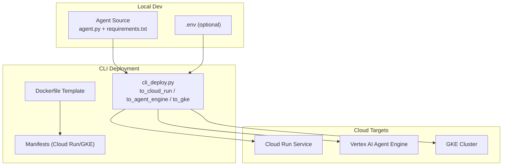
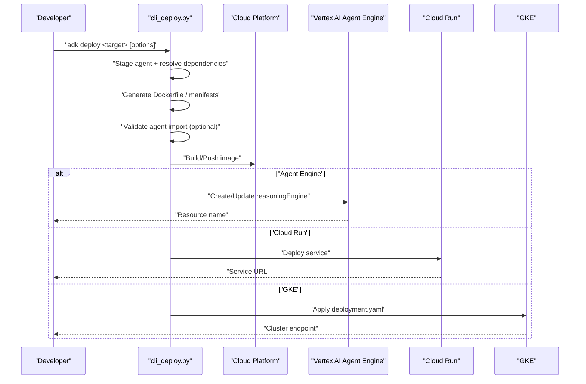
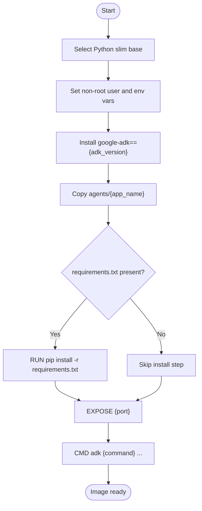
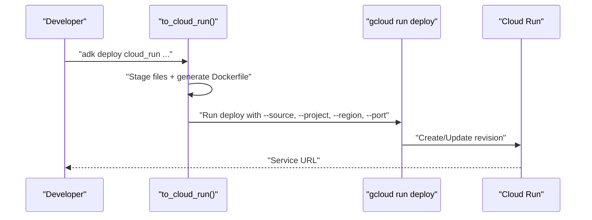
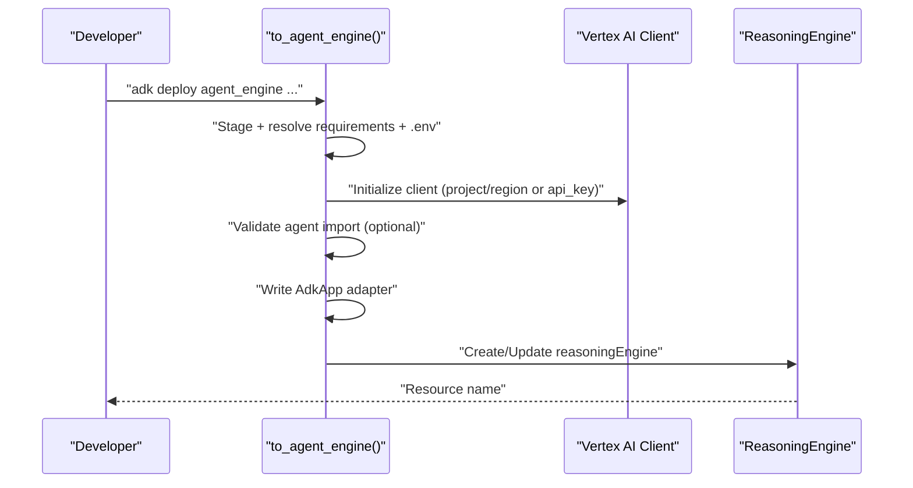
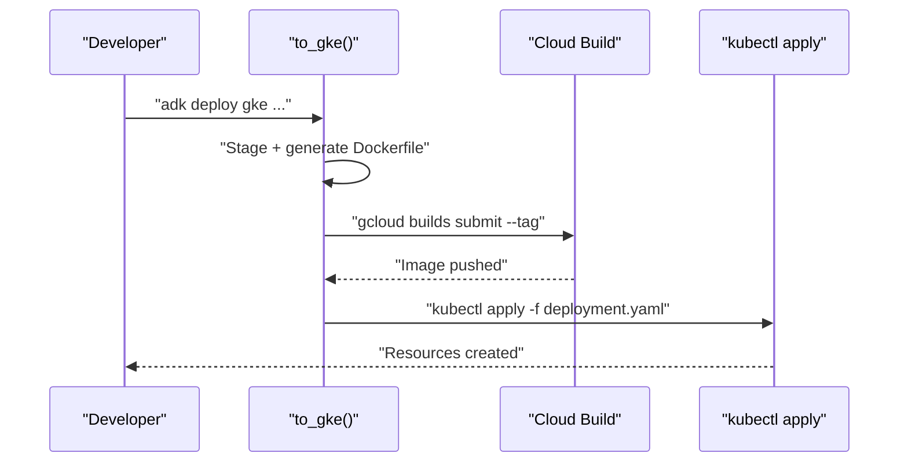
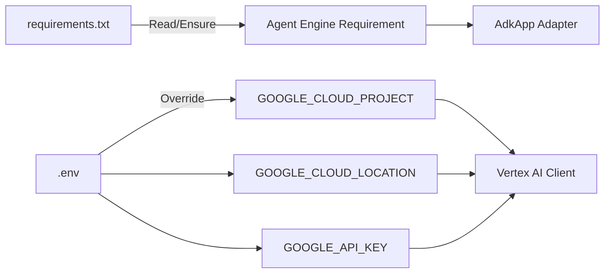

# Deployment Strategies

<cite>
**Referenced Files in This Document**
- [README.md](file://README.md)
- [cli_deploy.py](file://src/google/adk/cli/cli_deploy.py)
- [deployment_rbac.yaml](file://contributing/samples/gke_agent_sandbox/deployment_rbac.yaml)
- [compose.yml](file://contributing/samples/postgres_session_service/compose.yml)
- [requirements.txt](file://contributing/samples/adk_knowledge_agent/requirements.txt)
- [README.md](file://contributing/samples/adk_knowledge_agent/README.md)
- [test_cli_deploy.py](file://tests/unittests/cli/utils/test_cli_deploy.py)
</cite>

## Table of Contents
1. [Introduction](#introduction)
2. [Project Structure](#project-structure)
3. [Core Components](#core-components)
4. [Architecture Overview](#architecture-overview)
5. [Detailed Component Analysis](#detailed-component-analysis)
6. [Dependency Analysis](#dependency-analysis)
7. [Performance Considerations](#performance-considerations)
8. [Troubleshooting Guide](#troubleshooting-guide)
9. [Conclusion](#conclusion)
10. [Appendices](#appendices)

## Introduction
This document explains deployment strategies for Agent Development Kit (ADK) applications across containerized environments and managed platforms. It covers:
- Containerization with Docker using the provided template and multi-stage considerations
- Google Cloud Run deployment with service configuration, scaling, and traffic management
- Vertex AI Agent Engine deployment for managed AI applications, including configuration and dependency management
- Local development and staging options
- Practical examples of deployment manifests, configuration files, and pipelines
- Environment-specific configurations, secrets management, and validation procedures

## Project Structure
ADK provides a CLI-driven deployment pipeline that generates container images and deploys them to Cloud Run or Vertex AI Agent Engine. The CLI manages:
- Dockerfile generation and image tagging
- Manifest generation for GKE
- Environment variable injection and service URIs
- Validation of agent imports prior to deployment

**Diagram sources**
- [cli_deploy.py](file://src/google/adk/cli/cli_deploy.py#L626-L803)
- [cli_deploy.py](file://src/google/adk/cli/cli_deploy.py#L805-L1142)
- [cli_deploy.py](file://src/google/adk/cli/cli_deploy.py#L1144-L1383)

**Section sources**
- [README.md](file://README.md#L59-L60)
- [cli_deploy.py](file://src/google/adk/cli/cli_deploy.py#L626-L803)

## Core Components
- Dockerfile template: Generates a slim Python image, installs ADK, copies agent code, and runs the ADK server with optional UI and A2A support.
- Cloud Run deployment: Builds and pushes an image, then deploys a managed service with configurable scaling and traffic.
- Vertex AI Agent Engine deployment: Stages agent sources, resolves dependencies, initializes Vertex AI, and creates or updates an Agent Engine resource.
- GKE deployment: Generates a minimal Kubernetes manifest and applies it to a cluster using kubectl.
- Environment and secrets: Supports .env files and environment variables for project/region/API keys; injects telemetry flags.

**Section sources**
- [cli_deploy.py](file://src/google/adk/cli/cli_deploy.py#L65-L102)
- [cli_deploy.py](file://src/google/adk/cli/cli_deploy.py#L626-L803)
- [cli_deploy.py](file://src/google/adk/cli/cli_deploy.py#L805-L1142)
- [cli_deploy.py](file://src/google/adk/cli/cli_deploy.py#L1144-L1383)

## Architecture Overview
The deployment pipeline follows a deterministic flow: prepare, stage, validate, package, and deploy.

**Diagram sources**
- [cli_deploy.py](file://src/google/adk/cli/cli_deploy.py#L626-L803)
- [cli_deploy.py](file://src/google/adk/cli/cli_deploy.py#L805-L1142)
- [cli_deploy.py](file://src/google/adk/cli/cli_deploy.py#L1144-L1383)

## Detailed Component Analysis

### Dockerfile Template and Multi-Stage Builds
- The CLI generates a Dockerfile that:
  - Uses a slim Python base
  - Creates a non-root user and sets safe defaults
  - Installs ADK and agent dependencies
  - Copies agent code into /app/agents/<app_name>
  - Exposes the configured port
  - Starts the ADK server with optional UI and A2A support
- Multi-stage builds are not enforced by the template; however, you can adapt the template to reduce final image size by separating build-time dependencies.

**Diagram sources**
- [cli_deploy.py](file://src/google/adk/cli/cli_deploy.py#L65-L102)

**Section sources**
- [cli_deploy.py](file://src/google/adk/cli/cli_deploy.py#L65-L102)

### Cloud Run Deployment
- The CLI stages agent files, generates a Dockerfile, and invokes gcloud run deploy with:
  - Project, region, service name, port, verbosity
  - Optional labels merged with an internal label
  - Passthrough flags for advanced gcloud configuration
- Service configuration:
  - Port is configurable; the CLI passes --port to the container
  - Host binding is set conditionally for newer ADK versions
  - CORS origins can be whitelisted via --allow_origins
- Scaling and traffic:
  - Use gcloud run services update to configure concurrency, max instances, CPU/memory, and traffic splitting
  - Configure revisions and traffic allocation post-deploy

**Diagram sources**
- [cli_deploy.py](file://src/google/adk/cli/cli_deploy.py#L626-L803)

Practical guidance:
- Set environment variables via .env and pass them into the container; the CLI merges labels and supports extra gcloud args.
- After deployment, adjust scaling and traffic using gcloud run services update.

**Section sources**
- [cli_deploy.py](file://src/google/adk/cli/cli_deploy.py#L626-L803)

### Vertex AI Agent Engine Deployment
- The CLI stages agent sources, ensures dependencies include the Agent Engine requirement, reads .env for project/region/API key, and initializes Vertex AI.
- It optionally validates agent imports, writes an AdkApp adapter, and creates/updates a reasoningEngine resource.
- Configuration options include display name, description, telemetry flags, and environment variables.

**Diagram sources**
- [cli_deploy.py](file://src/google/adk/cli/cli_deploy.py#L805-L1142)

Operational notes:
- The CLI injects the Agent Engine dependency into requirements.txt if missing.
- Telemetry can be enabled via an environment variable flag.
- For Express Mode, supply an API key; otherwise, provide project and region.

**Section sources**
- [cli_deploy.py](file://src/google/adk/cli/cli_deploy.py#L805-L1142)

### GKE Deployment
- The CLI prepares a temporary workspace, generates a Dockerfile, builds and pushes an image via Cloud Build, and produces a minimal Kubernetes manifest.
- It then fetches cluster credentials and applies the manifest using kubectl.

**Diagram sources**
- [cli_deploy.py](file://src/google/adk/cli/cli_deploy.py#L1144-L1383)

RBAC and sandboxing:
- A sample RBAC manifest is provided for sandboxed code execution on GKE, granting scoped permissions for Jobs, Pods, and ConfigMaps.

**Section sources**
- [cli_deploy.py](file://src/google/adk/cli/cli_deploy.py#L1144-L1383)
- [deployment_rbac.yaml](file://contributing/samples/gke_agent_sandbox/deployment_rbac.yaml#L1-L51)

### Local Development and Staging
- Local execution examples:
  - A sample demonstrates running a PostgreSQL-backed session service locally using Docker Compose.
  - Another sample shows deploying an A2A agent to Cloud Run with UI and A2A enabled.
- Staging environments:
  - Use separate .env files per environment to override project/region/API keys.
  - Keep requirements.txt minimal and environment-specific; the Agent Engine flow adds the required dependency automatically.

**Section sources**
- [compose.yml](file://contributing/samples/postgres_session_service/compose.yml#L1-L25)
- [README.md](file://contributing/samples/adk_knowledge_agent/README.md#L1-L25)
- [requirements.txt](file://contributing/samples/adk_knowledge_agent/requirements.txt#L1-L1)

## Dependency Analysis
- ADK version pinning:
  - The Dockerfile template installs a specific ADK version to ensure reproducibility.
- Agent Engine dependency:
  - The CLI ensures requirements.txt contains the Agent Engine requirement; otherwise, it appends it.
- Environment variables:
  - Project and region can be provided via CLI or .env; API key enables Express Mode.
  - Telemetry flags are injected into environment variables when requested.

**Diagram sources**
- [cli_deploy.py](file://src/google/adk/cli/cli_deploy.py#L39-L63)
- [cli_deploy.py](file://src/google/adk/cli/cli_deploy.py#L998-L1060)

**Section sources**
- [cli_deploy.py](file://src/google/adk/cli/cli_deploy.py#L39-L63)
- [cli_deploy.py](file://src/google/adk/cli/cli_deploy.py#L998-L1060)

## Performance Considerations
- Image size and cold starts:
  - Prefer a slim base image and minimize installed packages to reduce cold start latency on Cloud Run.
- Resource sizing:
  - Adjust Cloud Run concurrency and CPU/memory to balance throughput and cost.
- Telemetry overhead:
  - Enable OpenTelemetry export selectively in production to avoid unnecessary overhead.

## Troubleshooting Guide
Common issues and resolutions:
- Missing requirements.txt:
  - The Agent Engine flow creates it if absent and injects the Agent Engine requirement.
- Import failures during deployment:
  - The CLI validates agent imports and surfaces detailed errors; fix missing dependencies or incorrect imports.
- Conflicting gcloud flags:
  - The CLI validates extra gcloud args against managed arguments and raises clear errors.
- Project/region resolution:
  - The CLI falls back to gcloud config if not provided; ensure gcloud is authenticated.

Validation references:
- Unit tests exercise project resolution, service option formatting, and Agent Engine deployment flows.

**Section sources**
- [cli_deploy.py](file://src/google/adk/cli/cli_deploy.py#L410-L470)
- [cli_deploy.py](file://src/google/adk/cli/cli_deploy.py#L471-L585)
- [test_cli_deploy.py](file://tests/unittests/cli/utils/test_cli_deploy.py#L98-L126)
- [test_cli_deploy.py](file://tests/unittests/cli/utils/test_cli_deploy.py#L222-L228)
- [test_cli_deploy.py](file://tests/unittests/cli/utils/test_cli_deploy.py#L243-L427)

## Conclusion
ADK’s CLI provides a robust, repeatable path to deploy agents across Cloud Run, Vertex AI Agent Engine, and GKE. By leveraging the provided templates and manifests, managing environment variables and dependencies carefully, and validating deployments early, teams can achieve reliable CI/CD pipelines and production-grade scalability.

## Appendices

### Example Commands and Flags
- Cloud Run:
  - Use service configuration flags and pass-through gcloud args after -- to customize deployment.
- Vertex AI Agent Engine:
  - Provide project/region or API key; optionally enable telemetry and set display/description.
- GKE:
  - Supply cluster credentials and apply the generated manifest.

**Section sources**
- [cli_deploy.py](file://src/google/adk/cli/cli_deploy.py#L746-L799)
- [cli_deploy.py](file://src/google/adk/cli/cli_deploy.py#L1062-L1139)