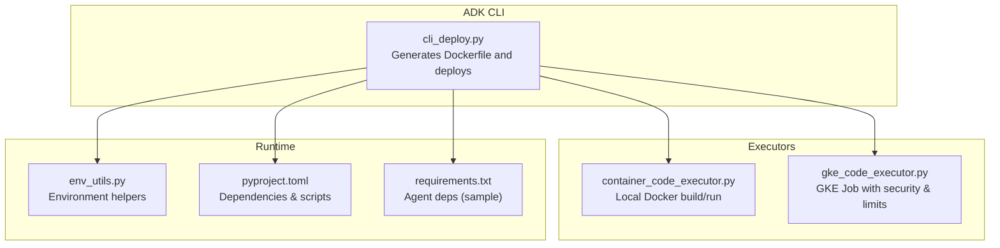
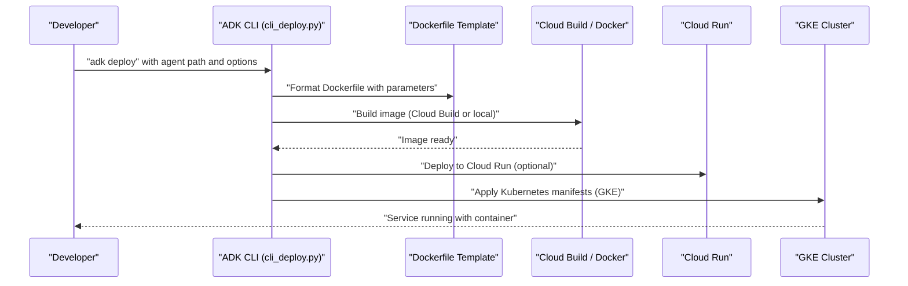
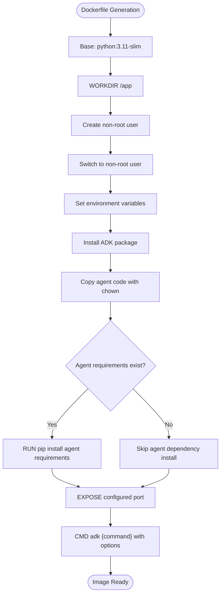
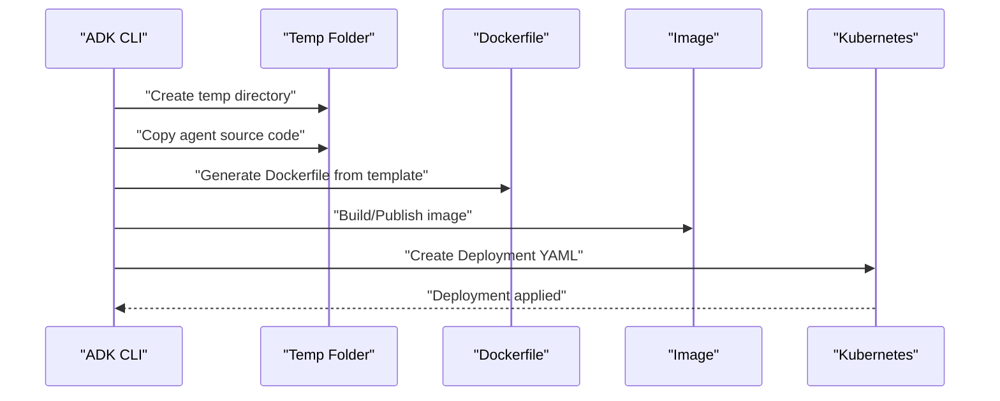
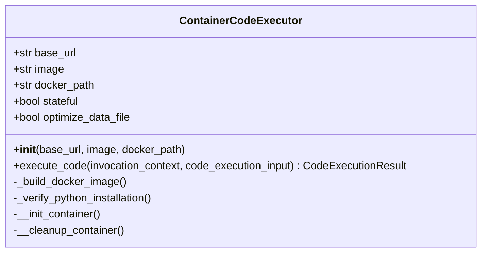
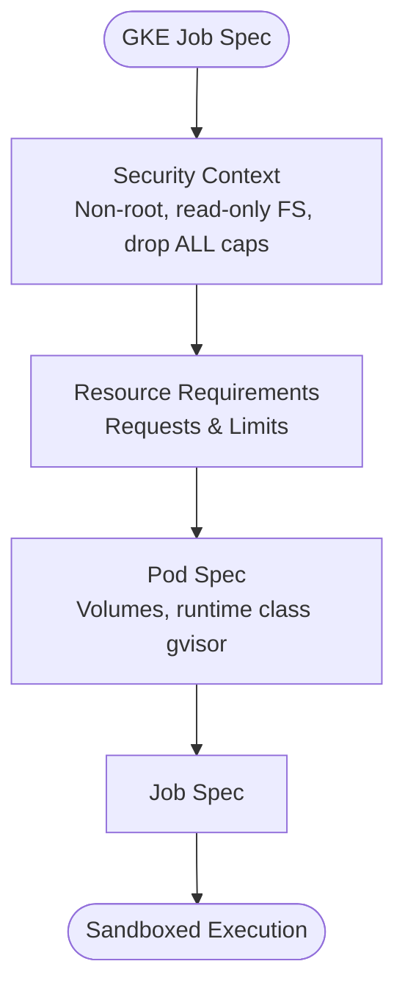
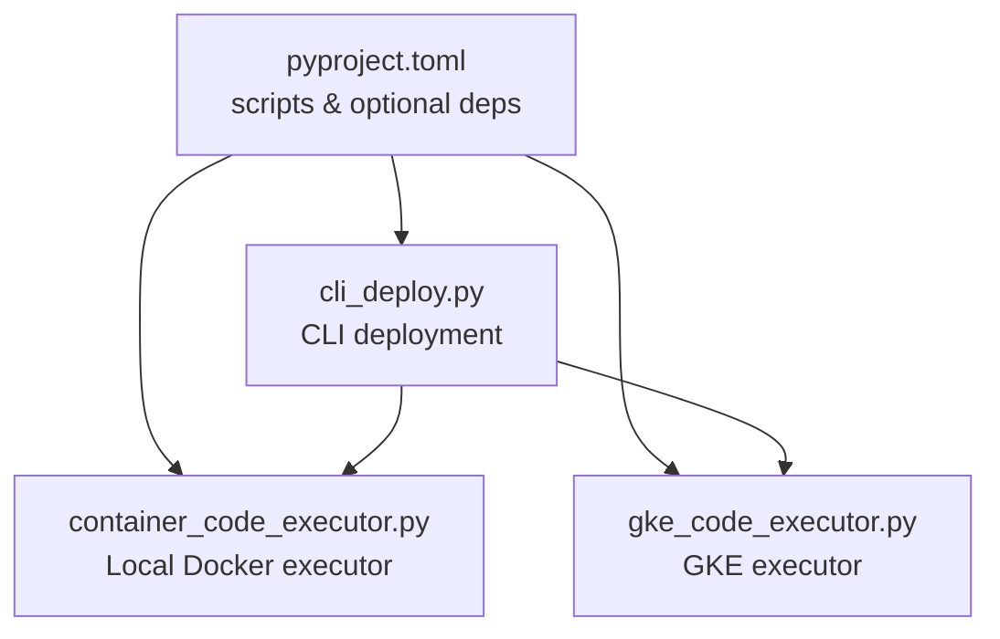

# Docker Containerization

<cite>
**Referenced Files in This Document**
- [cli_deploy.py](file://src/google/adk/cli/cli_deploy.py)
- [container_code_executor.py](file://src/google/adk/code_executors/container_code_executor.py)
- [gke_code_executor.py](file://src/google/adk/code_executors/gke_code_executor.py)
- [env_utils.py](file://src/google/adk/utils/env_utils.py)
- [pyproject.toml](file://pyproject.toml)
- [requirements.txt](file://contributing/samples/adk_knowledge_agent/requirements.txt)
</cite>

## Table of Contents
1. [Introduction](#introduction)
2. [Project Structure](#project-structure)
3. [Core Components](#core-components)
4. [Architecture Overview](#architecture-overview)
5. [Detailed Component Analysis](#detailed-component-analysis)
6. [Dependency Analysis](#dependency-analysis)
7. [Performance Considerations](#performance-considerations)
8. [Troubleshooting Guide](#troubleshooting-guide)
9. [Conclusion](#conclusion)

## Introduction
This document explains how the ADK Python project implements Docker containerization for agents and services. It covers the Dockerfile template structure, multi-stage build considerations, non-root user configuration, environment variable setup, container networking and port exposure, and the CMD instruction configuration. It also documents practical build and runtime guidance, security hardening, resource limits, and orchestration integration with Google Cloud Run and GKE. Finally, it provides troubleshooting advice for common containerization issues.

## Project Structure
The containerization logic is primarily implemented in the CLI deployment module, which generates a Dockerfile and orchestrates building and deploying images. Supporting components include a local Docker-based code executor and a GKE-based executor with security and resource controls.

**Diagram sources**
- [cli_deploy.py](file://src/google/adk/cli/cli_deploy.py#L65-L102)
- [container_code_executor.py](file://src/google/adk/code_executors/container_code_executor.py#L37-L201)
- [gke_code_executor.py](file://src/google/adk/code_executors/gke_code_executor.py#L281-L319)
- [env_utils.py](file://src/google/adk/utils/env_utils.py#L26-L59)
- [pyproject.toml](file://pyproject.toml#L1-L228)
- [requirements.txt](file://contributing/samples/adk_knowledge_agent/requirements.txt#L1-L1)

**Section sources**
- [cli_deploy.py](file://src/google/adk/cli/cli_deploy.py#L65-L102)
- [container_code_executor.py](file://src/google/adk/code_executors/container_code_executor.py#L37-L201)
- [gke_code_executor.py](file://src/google/adk/code_executors/gke_code_executor.py#L281-L319)
- [env_utils.py](file://src/google/adk/utils/env_utils.py#L26-L59)
- [pyproject.toml](file://pyproject.toml#L1-L228)
- [requirements.txt](file://contributing/samples/adk_knowledge_agent/requirements.txt#L1-L1)

## Core Components
- Dockerfile Template: Defines the base image, non-root user, environment variables, ADK installation, agent copy, optional agent dependencies, port exposure, and CMD invocation.
- CLI Deployment: Generates the Dockerfile, copies agent code, optionally installs agent-specific dependencies, builds/pushes the image, and creates Kubernetes manifests for GKE deployment.
- Local Docker Executor: Builds and runs a container locally using the Docker API, verifying Python availability inside the container.
- GKE Executor: Creates a Kubernetes Job with security hardening and resource limits suitable for sandboxed code execution.
- Environment Utilities: Helper to check environment flags used during runtime.
- Dependencies and Scripts: Declares the CLI entry point and optional dependencies for Docker and Kubernetes integrations.

**Section sources**
- [cli_deploy.py](file://src/google/adk/cli/cli_deploy.py#L65-L102)
- [cli_deploy.py](file://src/google/adk/cli/cli_deploy.py#L1234-L1265)
- [container_code_executor.py](file://src/google/adk/code_executors/container_code_executor.py#L37-L201)
- [gke_code_executor.py](file://src/google/adk/code_executors/gke_code_executor.py#L281-L319)
- [env_utils.py](file://src/google/adk/utils/env_utils.py#L26-L59)
- [pyproject.toml](file://pyproject.toml#L83-L84)
- [pyproject.toml](file://pyproject.toml#L158-L168)

## Architecture Overview
The containerization pipeline integrates CLI-driven generation of a Dockerfile, optional agent dependency installation, and deployment to cloud platforms. The diagram shows the end-to-end flow from agent source to container runtime.

**Diagram sources**
- [cli_deploy.py](file://src/google/adk/cli/cli_deploy.py#L1234-L1290)
- [cli_deploy.py](file://src/google/adk/cli/cli_deploy.py#L1292-L1382)

## Detailed Component Analysis

### Dockerfile Template Implementation
The template defines a secure, minimal container for ADK agents:
- Base Image: Python 3.11 slim
- Non-root User: Creates and switches to a non-root user
- Environment Variables: Sets PATH and Vertex AI-related variables
- ADK Installation: Installs the ADK package at the configured version
- Agent Copy: Copies agent code with proper ownership
- Agent Dependencies: Optionally installs agent requirements
- Port Exposure: Exposes the configured port
- CMD: Starts the ADK web or API server with service options and flags

**Diagram sources**
- [cli_deploy.py](file://src/google/adk/cli/cli_deploy.py#L65-L102)

**Section sources**
- [cli_deploy.py](file://src/google/adk/cli/cli_deploy.py#L65-L102)

### CLI Deployment Workflow
The CLI prepares a temporary build environment, copies agent code, conditionally installs agent dependencies, generates the Dockerfile, builds/pushes the image, and creates Kubernetes manifests for GKE.

**Diagram sources**
- [cli_deploy.py](file://src/google/adk/cli/cli_deploy.py#L1217-L1265)
- [cli_deploy.py](file://src/google/adk/cli/cli_deploy.py#L1267-L1290)
- [cli_deploy.py](file://src/google/adk/cli/cli_deploy.py#L1292-L1342)

**Section sources**
- [cli_deploy.py](file://src/google/adk/cli/cli_deploy.py#L1217-L1265)
- [cli_deploy.py](file://src/google/adk/cli/cli_deploy.py#L1267-L1290)
- [cli_deploy.py](file://src/google/adk/cli/cli_deploy.py#L1292-L1342)

### Local Docker Code Execution
The local executor builds and runs a container using the Docker API, ensuring Python is present and cleaning up after execution.

**Diagram sources**
- [container_code_executor.py](file://src/google/adk/code_executors/container_code_executor.py#L37-L201)

**Section sources**
- [container_code_executor.py](file://src/google/adk/code_executors/container_code_executor.py#L37-L201)

### GKE Sandbox Execution with Security and Limits
The GKE executor provisions a Job with:
- Security Context: Non-root, read-only root filesystem, dropped capabilities, no privilege escalation
- Resource Limits: CPU/memory requests and limits
- Runtime Class: gVisor for sandboxing

**Diagram sources**
- [gke_code_executor.py](file://src/google/adk/code_executors/gke_code_executor.py#L281-L319)

**Section sources**
- [gke_code_executor.py](file://src/google/adk/code_executors/gke_code_executor.py#L281-L319)

### Environment Variable Handling
Environment utilities provide a helper to check if a flag is enabled based on environment variables, useful for runtime toggles.

**Section sources**
- [env_utils.py](file://src/google/adk/utils/env_utils.py#L26-L59)

## Dependency Analysis
The CLI and executors depend on external tooling and optional extras:
- CLI entry point is declared in project scripts
- Optional dependencies include Docker and Kubernetes integrations
- Agent dependencies are installed from agent requirements files when present

**Diagram sources**
- [pyproject.toml](file://pyproject.toml#L83-L84)
- [pyproject.toml](file://pyproject.toml#L158-L168)
- [cli_deploy.py](file://src/google/adk/cli/cli_deploy.py#L1-L36)
- [container_code_executor.py](file://src/google/adk/code_executors/container_code_executor.py#L22-L25)
- [gke_code_executor.py](file://src/google/adk/code_executors/gke_code_executor.py#L1-L30)

**Section sources**
- [pyproject.toml](file://pyproject.toml#L83-L84)
- [pyproject.toml](file://pyproject.toml#L158-L168)
- [cli_deploy.py](file://src/google/adk/cli/cli_deploy.py#L1-L36)
- [container_code_executor.py](file://src/google/adk/code_executors/container_code_executor.py#L22-L25)
- [gke_code_executor.py](file://src/google/adk/code_executors/gke_code_executor.py#L1-L30)

## Performance Considerations
- Multi-stage builds: The template uses a single stage with a slim base image. For production, consider adding a dedicated build stage to reduce final image size.
- Layer caching: Keep the ADK installation and agent copy steps separate to maximize cache hits when only application code changes.
- Minimal runtime: The slim base image reduces attack surface and download time.
- Resource allocation: Use the GKE executor’s resource limits to prevent noisy-neighbor issues in shared clusters.

[No sources needed since this section provides general guidance]

## Troubleshooting Guide
Common containerization issues and resolutions:
- Dependency conflicts
  - Symptom: Pip install fails during image build.
  - Resolution: Pin compatible versions in agent requirements; ensure the agent requirements file is present and valid.
  - Reference: Agent requirements are conditionally installed when present.
- Permission problems
  - Symptom: Container fails to start or write to disk.
  - Resolution: Confirm the non-root user is used and ownership is set on copied files.
- Startup failures
  - Symptom: Container exits immediately.
  - Resolution: Verify the CMD matches the intended command and port exposure aligns with the application binding.

Practical checks:
- Verify Python availability inside the container (local executor validates this).
- Confirm environment variables are set as expected.
- Validate port exposure and service binding.

**Section sources**
- [cli_deploy.py](file://src/google/adk/cli/cli_deploy.py#L1222-L1227)
- [cli_deploy.py](file://src/google/adk/cli/cli_deploy.py#L69-L91)
- [container_code_executor.py](file://src/google/adk/code_executors/container_code_executor.py#L167-L171)
- [env_utils.py](file://src/google/adk/utils/env_utils.py#L26-L59)

## Conclusion
The ADK project provides a robust, secure containerization foundation for agents and services:
- A concise Dockerfile template with a slim base image, non-root user, environment variables, and deterministic CMD invocation
- A CLI that generates the Dockerfile, builds/publishes images, and integrates with Cloud Run and GKE
- Local and GKE executors with security hardening and resource limits
- Practical guidance for dependency management, port exposure, and troubleshooting