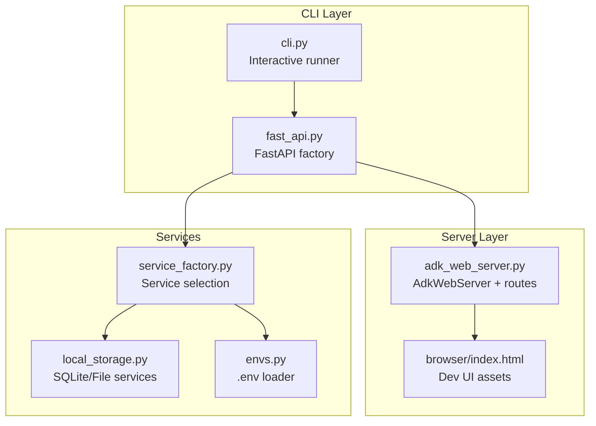
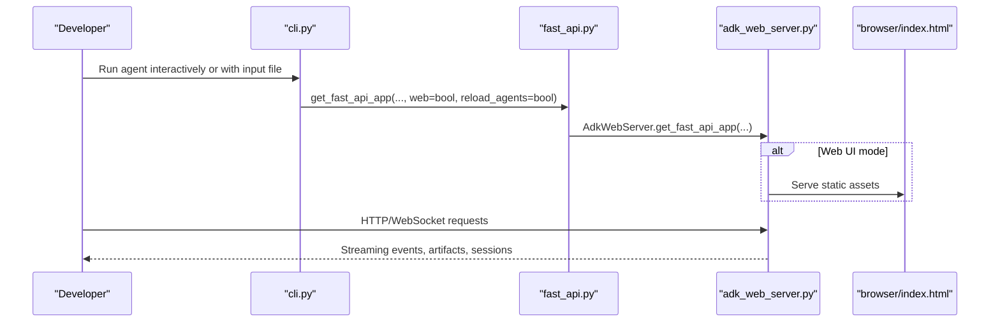
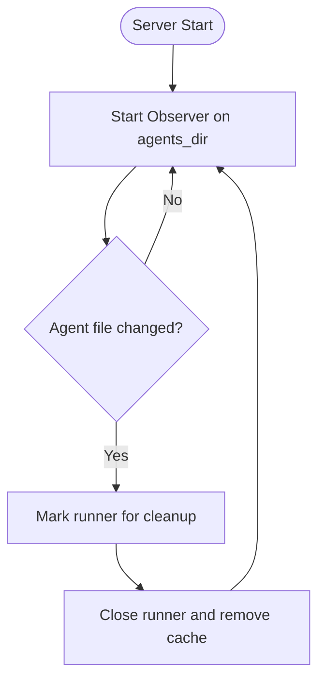
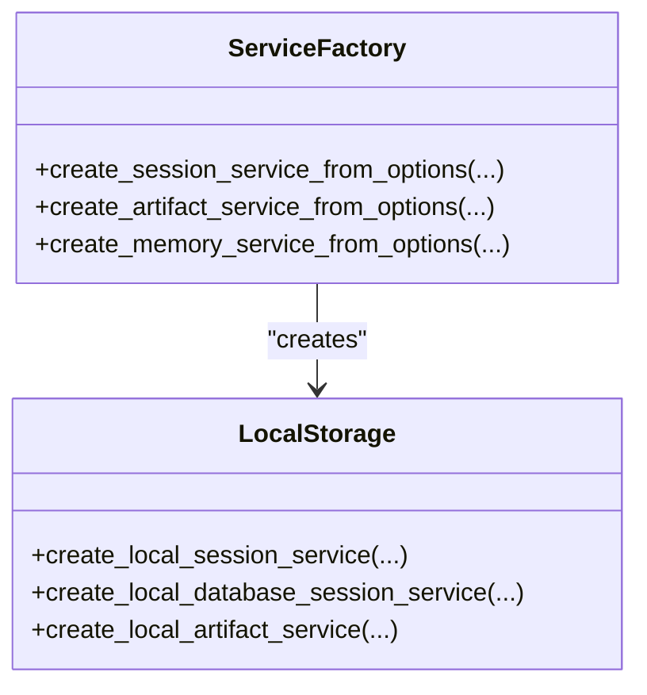
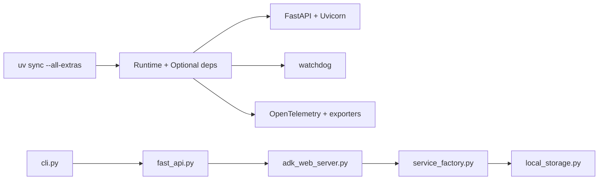

# Local Development Deployment

<cite>
**Referenced Files in This Document**
- [README.md](file://README.md)
- [CONTRIBUTING.md](file://CONTRIBUTING.md)
- [pyproject.toml](file://pyproject.toml)
- [cli.py](file://src/google/adk/cli/cli.py)
- [adk_web_server.py](file://src/google/adk/cli/adk_web_server.py)
- [fast_api.py](file://src/google/adk/cli/fast_api.py)
- [local_storage.py](file://src/google/adk/cli/utils/local_storage.py)
- [envs.py](file://src/google/adk/cli/utils/envs.py)
- [service_factory.py](file://src/google/adk/cli/utils/service_factory.py)
- [index.html](file://src/google/adk/cli/browser/index.html)
- [sample.env](file://contributing/samples/authn-adk-all-in-one/adk_agents/sample.env)
</cite>

## Table of Contents
1. [Introduction](#introduction)
2. [Project Structure](#project-structure)
3. [Core Components](#core-components)
4. [Architecture Overview](#architecture-overview)
5. [Detailed Component Analysis](#detailed-component-analysis)
6. [Dependency Analysis](#dependency-analysis)
7. [Performance Considerations](#performance-considerations)
8. [Troubleshooting Guide](#troubleshooting-guide)
9. [Conclusion](#conclusion)
10. [Appendices](#appendices)

## Introduction
This document explains how to deploy and run ADK locally for development. It covers:
- Starting the local server in web UI mode and API server mode
- Environment configuration and local storage
- Hot reload capabilities
- Port and host binding options
- Debugging and telemetry integration
- Practical commands, environment variables, and development workflow tips
- Local testing strategies and troubleshooting common issues

## Project Structure
ADK’s local development stack centers around a FastAPI application that can serve:
- A built-in web UI for agent development and debugging
- A pure API server for programmatic agent interactions
- Optional hot reload of agent code and assets

Key modules:
- CLI entrypoints and runners for interactive and scripted runs
- FastAPI server factory that wires services and routes
- Local storage utilities for sessions and artifacts
- Environment utilities for .env loading and overrides
- Service factory for selecting in-memory or persistent backends

**Diagram sources**
- [cli.py](file://src/google/adk/cli/cli.py#L136-L284)
- [fast_api.py](file://src/google/adk/cli/fast_api.py#L73-L599)
- [adk_web_server.py](file://src/google/adk/cli/adk_web_server.py#L450-L758)
- [local_storage.py](file://src/google/adk/cli/utils/local_storage.py#L41-L214)
- [envs.py](file://src/google/adk/cli/utils/envs.py#L53-L91)

**Section sources**
- [README.md](file://README.md#L1-L180)
- [pyproject.toml](file://pyproject.toml#L1-L228)

## Core Components
- Interactive CLI runner: Loads agents, manages sessions, streams events, and supports input files and saved sessions.
- FastAPI server factory: Builds a FastAPI app with optional web UI, A2A routes, and hot reload.
- AdkWebServer: Provides API endpoints for agents, sessions, artifacts, evaluations, and telemetry.
- Local storage: Creates per-agent SQLite session DB and file-based artifact storage under .adk/.
- Environment loader: Loads .env files for agents and preserves explicitly set environment variables.

**Section sources**
- [cli.py](file://src/google/adk/cli/cli.py#L136-L284)
- [fast_api.py](file://src/google/adk/cli/fast_api.py#L73-L270)
- [adk_web_server.py](file://src/google/adk/cli/adk_web_server.py#L450-L758)
- [local_storage.py](file://src/google/adk/cli/utils/local_storage.py#L41-L214)
- [envs.py](file://src/google/adk/cli/utils/envs.py#L53-L91)

## Architecture Overview
The local development server can operate in two modes:
- Web UI mode: Serves the built-in Angular dev UI under / and FastAPI routes for agent interactions.
- API server mode: Serves only the API routes without the UI.

Hot reload is enabled by watching the agents directory and invalidating runners when agent files change.

**Diagram sources**
- [cli.py](file://src/google/adk/cli/cli.py#L136-L284)
- [fast_api.py](file://src/google/adk/cli/fast_api.py#L73-L270)
- [adk_web_server.py](file://src/google/adk/cli/adk_web_server.py#L681-L758)
- [index.html](file://src/google/adk/cli/browser/index.html#L1-L35)

## Detailed Component Analysis

### Web UI Mode vs API Server Mode
- Web UI mode:
  - Enabled by passing web=True to the FastAPI factory.
  - Serves the Angular dev UI from the browser assets directory.
  - Adds builder endpoints for uploading and previewing agent files.
- API server mode:
  - Disable web to get a lean API server without UI assets.
  - Still exposes all agent, session, artifact, and evaluation endpoints.

Key differences:
- Static assets: Only present in web UI mode.
- Builder endpoints: Only present in web UI mode.
- Hot reload: Controlled by reload_agents flag.

**Section sources**
- [fast_api.py](file://src/google/adk/cli/fast_api.py#L255-L267)
- [adk_web_server.py](file://src/google/adk/cli/adk_web_server.py#L695-L758)
- [index.html](file://src/google/adk/cli/browser/index.html#L1-L35)

### Port and Host Binding Options
- Host binding: The server binds to a configurable host address (default 127.0.0.1).
- Port: The server listens on a configurable port (default 8000).
- URL prefix: Optional route prefix for deployments behind reverse proxies.

These options are exposed in the FastAPI factory and passed to the underlying ASGI server.

**Section sources**
- [fast_api.py](file://src/google/adk/cli/fast_api.py#L86-L89)

### Hot Reload Capabilities
- File watching: When reload_agents=True, the server starts a file system observer on the agents directory.
- Agent change handler: Invalidates cached runners and triggers cleanup when agent files change.
- Benefits: Rapid iteration without restarting the server.

**Diagram sources**
- [fast_api.py](file://src/google/adk/cli/fast_api.py#L235-L253)
- [adk_web_server.py](file://src/google/adk/cli/adk_web_server.py#L520-L552)

**Section sources**
- [fast_api.py](file://src/google/adk/cli/fast_api.py#L235-L253)
- [adk_web_server.py](file://src/google/adk/cli/adk_web_server.py#L520-L552)

### Local Storage Setup
- Per-agent SQLite session storage:
  - Created under each agent’s .adk/session.db.
  - Also supports a single shared session DB at the .adk level.
- File-based artifact storage:
  - Artifacts stored under each agent’s .adk/artifacts/.
- Service selection logic:
  - Uses environment flags to disable or force local storage.
  - Falls back to in-memory services when local storage is unavailable.

**Diagram sources**
- [service_factory.py](file://src/google/adk/cli/utils/service_factory.py#L170-L329)
- [local_storage.py](file://src/google/adk/cli/utils/local_storage.py#L41-L214)

**Section sources**
- [local_storage.py](file://src/google/adk/cli/utils/local_storage.py#L41-L214)
- [service_factory.py](file://src/google/adk/cli/utils/service_factory.py#L103-L144)

### Development Database Configuration
- Default behavior:
  - Per-agent SQLite session DB at .adk/session.db.
  - File-based artifacts at .adk/artifacts/.
- Override options:
  - Session service URI: Supports memory://, sqlite://, postgresql://, mysql://, agentengine://.
  - Memory service URI: Supports in-memory by default; custom URIs can be registered.
  - Artifact service URI: Supports in-memory by default; custom URIs can be registered.
- Environment controls:
  - ADK_DISABLE_LOCAL_STORAGE: Disables local storage and forces in-memory services.
  - ADK_FORCE_LOCAL_STORAGE: Forces local storage even in containerized environments.

**Section sources**
- [fast_api.py](file://src/google/adk/cli/fast_api.py#L111-L122)
- [service_factory.py](file://src/google/adk/cli/utils/service_factory.py#L103-L144)
- [service_factory.py](file://src/google/adk/cli/utils/service_factory.py#L170-L240)
- [service_factory.py](file://src/google/adk/cli/utils/service_factory.py#L242-L269)
- [service_factory.py](file://src/google/adk/cli/utils/service_factory.py#L272-L329)

### Environment Variable Configuration
- .env loading:
  - Loads .env files found walking upward from the agent directory.
  - Preserves explicitly set environment variables and applies later .env overrides.
- Global toggle:
  - ADK_DISABLE_LOAD_DOTENV: Skips loading .env files entirely.
- Example variables:
  - GOOGLE_GENAI_USE_VERTEXAI, GOOGLE_API_KEY, GOOGLE_MODEL, OAUTH_CLIENT_ID, OAUTH_CLIENT_SECRET.

Practical tips:
- Place a .env file in the agent’s directory or a parent directory to configure model and credentials.
- Use environment variables for API keys and model names to avoid committing secrets.

**Section sources**
- [envs.py](file://src/google/adk/cli/utils/envs.py#L53-L91)
- [sample.env](file://contributing/samples/authn-adk-all-in-one/adk_agents/sample.env#L1-L6)

### Debugging Tools Integration
- Telemetry:
  - OpenTelemetry providers can be configured to export to Google Cloud or via environment variables.
  - Internal span processors capture agent events for debugging.
- Trace endpoints:
  - /debug/trace/{event_id} returns trace data for a given event.
- Health/version endpoints:
  - /health and /version provide operational status and version info.

**Section sources**
- [adk_web_server.py](file://src/google/adk/cli/adk_web_server.py#L345-L448)
- [adk_web_server.py](file://src/google/adk/cli/adk_web_server.py#L796-L800)
- [adk_web_server.py](file://src/google/adk/cli/adk_web_server.py#L771-L783)

### Practical Commands and Workflows
- Install and prepare:
  - Use uv to create and activate a virtual environment.
  - Sync dependencies with extras for development.
- Start the server:
  - Web UI mode: Enable web=True and reload_agents for hot reload.
  - API server mode: Disable web to run a lean API server.
- Interactive CLI:
  - Run an agent interactively, load saved sessions, or feed input files.
- Builder endpoints (web UI mode):
  - Upload agent files and preview them in a temporary location.
  - Commit changes to persist them under the agent root.

Note: Replace placeholders with your agent path and desired options.

**Section sources**
- [CONTRIBUTING.md](file://CONTRIBUTING.md#L132-L220)
- [fast_api.py](file://src/google/adk/cli/fast_api.py#L73-L270)
- [cli.py](file://src/google/adk/cli/cli.py#L136-L284)

## Dependency Analysis
- Runtime dependencies include FastAPI, Uvicorn, watchdog for hot reload, and optional telemetry libraries.
- Optional extras enable extended tooling and evaluation features.
- The CLI depends on the FastAPI factory, which wires services and routes.

**Diagram sources**
- [pyproject.toml](file://pyproject.toml#L26-L74)
- [pyproject.toml](file://pyproject.toml#L86-L168)
- [cli.py](file://src/google/adk/cli/cli.py#L136-L284)
- [fast_api.py](file://src/google/adk/cli/fast_api.py#L73-L270)
- [adk_web_server.py](file://src/google/adk/cli/adk_web_server.py#L450-L758)
- [service_factory.py](file://src/google/adk/cli/utils/service_factory.py#L170-L329)
- [local_storage.py](file://src/google/adk/cli/utils/local_storage.py#L41-L214)

**Section sources**
- [pyproject.toml](file://pyproject.toml#L26-L74)
- [pyproject.toml](file://pyproject.toml#L86-L168)

## Performance Considerations
- Hot reload:
  - Watchdog monitors the agents directory; keep the directory structure lean to reduce overhead.
- Telemetry:
  - Exporters add CPU overhead; disable or limit exports in local development.
- Sessions and artifacts:
  - SQLite is lightweight; avoid storing very large artifacts in local storage for frequent reloads.

[No sources needed since this section provides general guidance]

## Troubleshooting Guide
Common issues and resolutions:
- Port conflicts:
  - Change the port using the port option in the FastAPI factory.
- Permission denied for local storage:
  - Set ADK_FORCE_LOCAL_STORAGE=1 to force local storage; otherwise, local storage is disabled and in-memory services are used.
- .env not loading:
  - Ensure ADK_DISABLE_LOAD_DOTENV is not set; confirm .env is placed in the agent directory or a parent directory.
- CORS errors:
  - Configure allow_origins to include your frontend origin; use regex: prefixes for dynamic origins.
- Telemetry not exporting:
  - Verify GOOGLE_CLOUD_PROJECT is set when using trace_to_cloud; otherwise, traces are not exported.

**Section sources**
- [fast_api.py](file://src/google/adk/cli/fast_api.py#L86-L89)
- [service_factory.py](file://src/google/adk/cli/utils/service_factory.py#L103-L144)
- [envs.py](file://src/google/adk/cli/utils/envs.py#L53-L91)
- [adk_web_server.py](file://src/google/adk/cli/adk_web_server.py#L760-L769)

## Conclusion
ADK’s local development stack provides a flexible, hot-reloadable environment for building and iterating on agents. Choose web UI mode for a rich developer experience or API server mode for programmatic workflows. Use environment variables for configuration, leverage local storage for sessions and artifacts, and tune telemetry and CORS to match your setup.

[No sources needed since this section summarizes without analyzing specific files]

## Appendices

### Appendix A: Environment Variables Reference
- ADK_DISABLE_LOAD_DOTENV: Skip loading .env files.
- ADK_DISABLE_LOCAL_STORAGE: Disable local storage and force in-memory services.
- ADK_FORCE_LOCAL_STORAGE: Force local storage even in containerized environments.
- GOOGLE_CLOUD_PROJECT: Required for exporting traces to Cloud Trace.
- GOOGLE_GENAI_USE_VERTEXAI, GOOGLE_API_KEY, GOOGLE_MODEL, OAUTH_CLIENT_ID, OAUTH_CLIENT_SECRET: Example variables for model and auth configuration.

**Section sources**
- [envs.py](file://src/google/adk/cli/utils/envs.py#L27-L28)
- [service_factory.py](file://src/google/adk/cli/utils/service_factory.py#L103-L144)
- [sample.env](file://contributing/samples/authn-adk-all-in-one/adk_agents/sample.env#L1-L6)