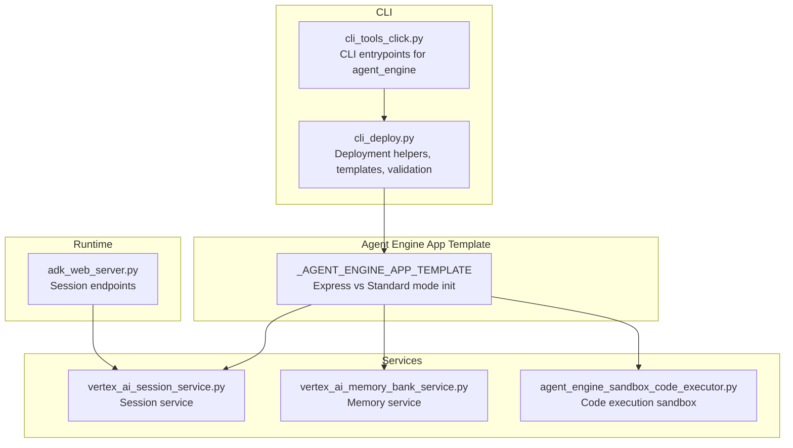
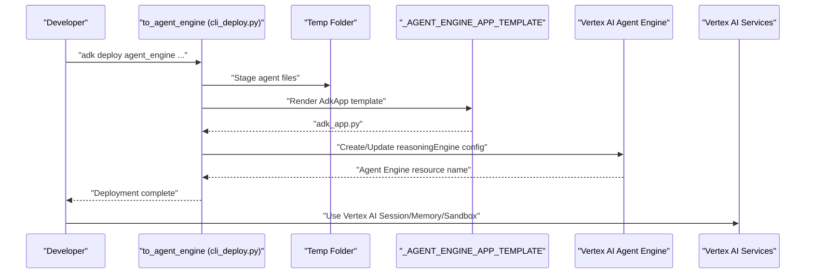
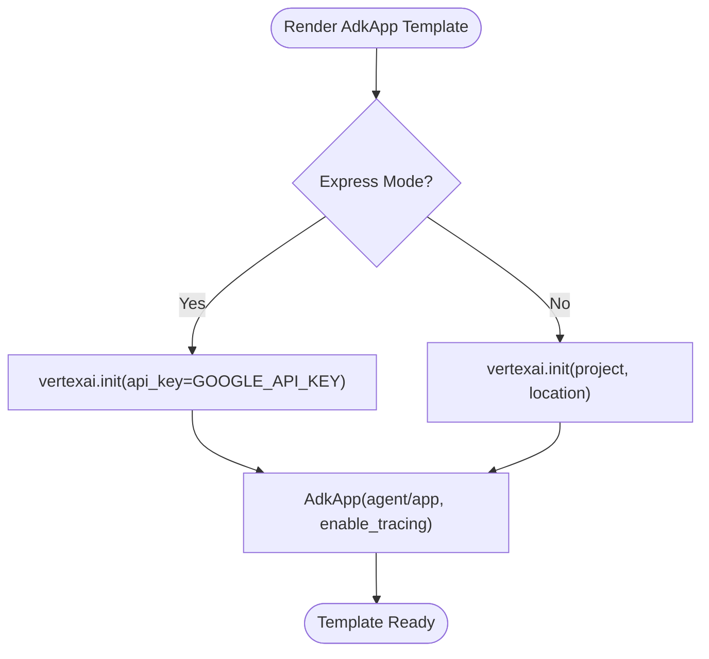
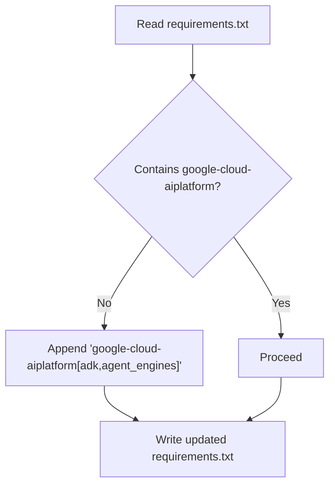
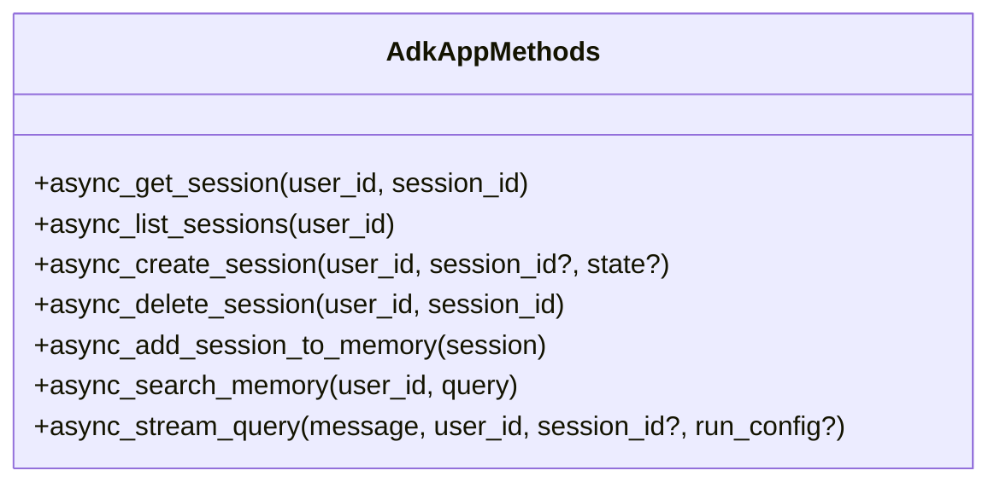
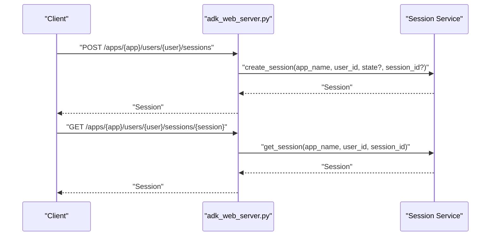
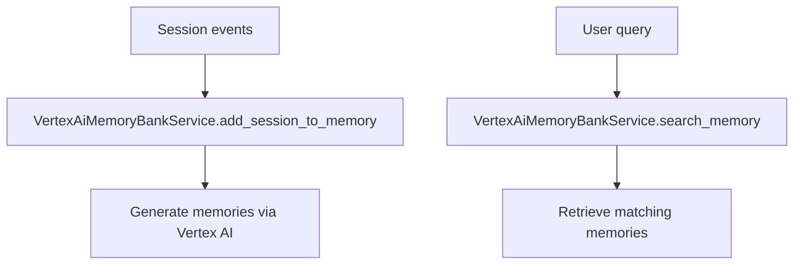
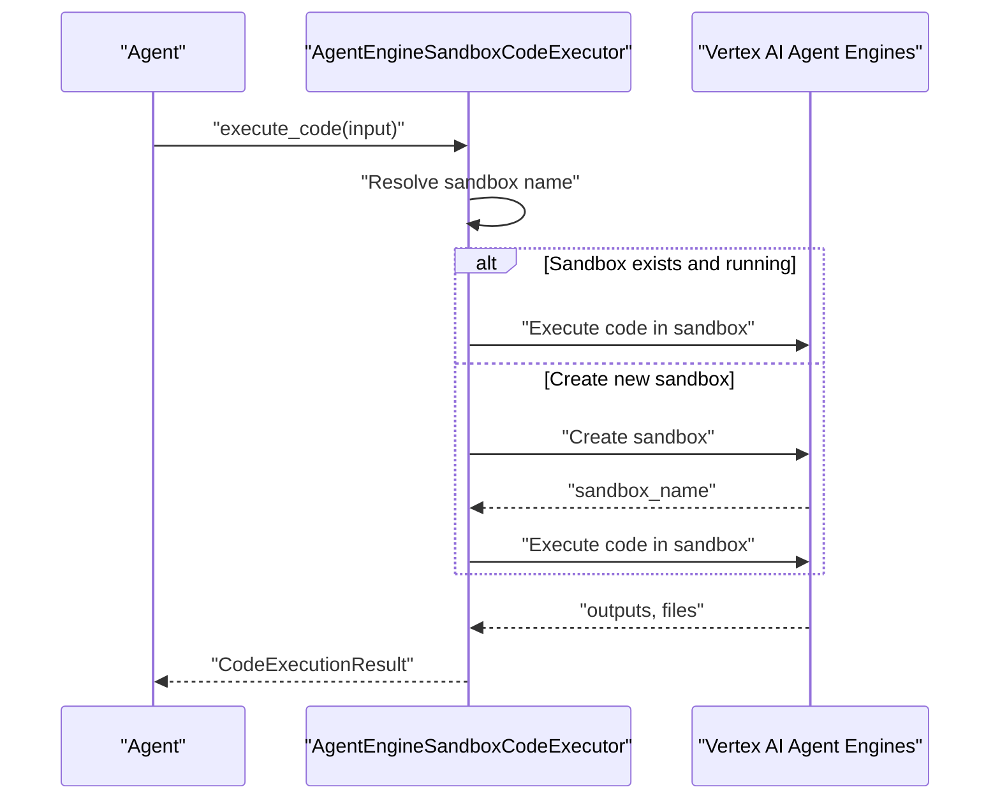
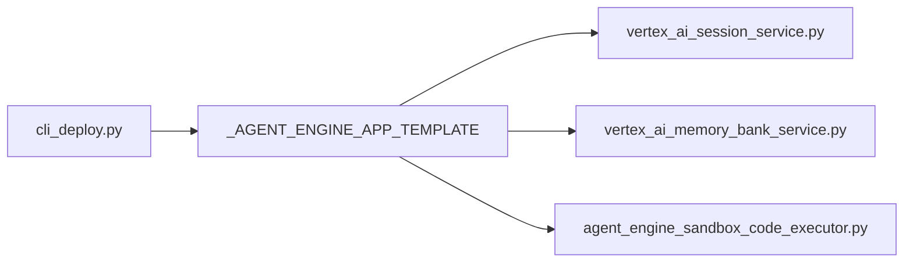

# Vertex AI Agent Engine

<cite>
**Referenced Files in This Document**
- [cli_deploy.py](file://src/google/adk/cli/cli_deploy.py)
- [cli_tools_click.py](file://src/google/adk/cli/cli_tools_click.py)
- [agent_engine_sandbox_code_executor.py](file://src/google/adk/code_executors/agent_engine_sandbox_code_executor.py)
- [agent.py](file://contributing/samples/agent_engine_code_execution/agent.py)
- [vertex_ai_memory_bank_service.py](file://src/google/adk/memory/vertex_ai_memory_bank_service.py)
- [vertex_ai_session_service.py](file://src/google/adk/sessions/vertex_ai_session_service.py)
- [adk_web_server.py](file://src/google/adk/cli/adk_web_server.py)
- [test_cli_deploy.py](file://tests/unittests/cli/utils/test_cli_deploy.py)
- [test_vertex_ai_memory_bank_service.py](file://tests/unittests/memory/test_vertex_ai_memory_bank_service.py)
</cite>

## Table of Contents
1. [Introduction](#introduction)
2. [Project Structure](#project-structure)
3. [Core Components](#core-components)
4. [Architecture Overview](#architecture-overview)
5. [Detailed Component Analysis](#detailed-component-analysis)
6. [Dependency Analysis](#dependency-analysis)
7. [Performance Considerations](#performance-considerations)
8. [Troubleshooting Guide](#troubleshooting-guide)
9. [Conclusion](#conclusion)

## Introduction
This document explains how to deploy and operate Vertex AI Agent Engine applications using the ADK tooling. It focuses on the Agent Engine App template, dependency management with google-cloud-aiplatform[adk,agent_engines], configuration requirements, Express Mode versus standard mode, API method signatures and parameter validation, async session management, memory integration patterns, and practical examples for configuration, session handling, and async operations. It also covers service account requirements, IAM permissions, regional availability, and troubleshooting deployment issues.

## Project Structure
The Agent Engine deployment pipeline is implemented in the CLI and integrates with Vertex AI services for sessions, memory, and code execution sandboxes. The key areas are:
- CLI deployment helpers that generate the Agent Engine app template and ensure dependencies
- Agent Engine app template that initializes Vertex AI and constructs AdkApp
- Vertex AI session and memory services used by the app
- Code execution sandbox integration for Agent Engine
- Web server and session APIs for local development and testing

**Diagram sources**
- [cli_deploy.py](file://src/google/adk/cli/cli_deploy.py#L104-L128)
- [cli_tools_click.py](file://src/google/adk/cli/cli_tools_click.py#L1956-L1999)
- [vertex_ai_session_service.py](file://src/google/adk/sessions/vertex_ai_session_service.py#L46-L74)
- [vertex_ai_memory_bank_service.py](file://src/google/adk/memory/vertex_ai_memory_bank_service.py#L141-L189)
- [agent_engine_sandbox_code_executor.py](file://src/google/adk/code_executors/agent_engine_sandbox_code_executor.py#L34-L93)
- [adk_web_server.py](file://src/google/adk/cli/adk_web_server.py#L945-L989)

**Section sources**
- [cli_deploy.py](file://src/google/adk/cli/cli_deploy.py#L104-L128)
- [cli_tools_click.py](file://src/google/adk/cli/cli_tools_click.py#L1956-L1999)

## Core Components
- Agent Engine App Template: Generates a minimal app that initializes Vertex AI (Express Mode or Standard Mode) and constructs AdkApp with tracing enabled.
- Dependency Management: Ensures google-cloud-aiplatform[adk,agent_engines] is present in requirements.txt.
- Session Management: Async-first session APIs exposed via AdkApp and used by the web server.
- Memory Integration: Vertex AI Memory Bank service for adding and searching memories.
- Code Execution Sandbox: Agent Engine sandbox for secure code execution within Agent Engine sessions.
- CLI Entrypoints: Click commands to deploy to Agent Engine with validation and environment configuration.

**Section sources**
- [cli_deploy.py](file://src/google/adk/cli/cli_deploy.py#L39-L62)
- [cli_deploy.py](file://src/google/adk/cli/cli_deploy.py#L104-L128)
- [cli_deploy.py](file://src/google/adk/cli/cli_deploy.py#L130-L407)
- [vertex_ai_session_service.py](file://src/google/adk/sessions/vertex_ai_session_service.py#L46-L74)
- [vertex_ai_memory_bank_service.py](file://src/google/adk/memory/vertex_ai_memory_bank_service.py#L141-L189)
- [agent_engine_sandbox_code_executor.py](file://src/google/adk/code_executors/agent_engine_sandbox_code_executor.py#L34-L93)
- [cli_tools_click.py](file://src/google/adk/cli/cli_tools_click.py#L1956-L1999)

## Architecture Overview
The deployment flow builds an Agent Engine app template, validates agent imports, ensures Agent Engine dependencies, and deploys to Vertex AI Agent Engine. The app initializes Vertex AI differently depending on Express Mode (API key) or Standard Mode (project/location). Sessions and memory are accessed via Vertex AI services, and code execution uses Agent Engine sandbox environments.

**Diagram sources**
- [cli_deploy.py](file://src/google/adk/cli/cli_deploy.py#L826-L851)
- [cli_deploy.py](file://src/google/adk/cli/cli_deploy.py#L1083-L1119)
- [cli_deploy.py](file://src/google/adk/cli/cli_deploy.py#L1062-L1076)

## Detailed Component Analysis

### Agent Engine App Template Implementation
- Express Mode: Initializes Vertex AI with an API key and sets environment variables for Vertex GenAI usage.
- Standard Mode: Initializes Vertex AI with project and location.
- AdkApp construction: Passes the agent/app object and enables tracing.

**Diagram sources**
- [cli_deploy.py](file://src/google/adk/cli/cli_deploy.py#L104-L128)

**Section sources**
- [cli_deploy.py](file://src/google/adk/cli/cli_deploy.py#L104-L128)

### Dependency Management with google-cloud-aiplatform[adk,agent_engines]
- The CLI ensures the Agent Engine dependency is present in requirements.txt. If missing, it appends the required dependency line.
- The Dockerfile template sets environment variables for Vertex GenAI usage and installs the ADK package.

**Diagram sources**
- [cli_deploy.py](file://src/google/adk/cli/cli_deploy.py#L39-L62)
- [cli_deploy.py](file://src/google/adk/cli/cli_deploy.py#L65-L102)

**Section sources**
- [cli_deploy.py](file://src/google/adk/cli/cli_deploy.py#L39-L62)
- [cli_deploy.py](file://src/google/adk/cli/cli_deploy.py#L65-L102)

### Configuration Requirements
- Environment variables for Vertex AI:
  - Express Mode: GOOGLE_API_KEY
  - Standard Mode: GOOGLE_CLOUD_PROJECT, GOOGLE_CLOUD_LOCATION
- Vertex GenAI usage flag: GOOGLE_GENAI_USE_VERTEXAI
- Optional tracing flags for Agent Engine telemetry

These are set in the generated Dockerfile and used by the app template initialization.

**Section sources**
- [cli_deploy.py](file://src/google/adk/cli/cli_deploy.py#L75-L81)
- [cli_deploy.py](file://src/google/adk/cli/cli_deploy.py#L116-L122)

### Express Mode vs Standard Mode Deployment
- Express Mode:
  - Initialize Vertex AI with an API key
  - Suitable for quick prototyping and simplified setup
- Standard Mode:
  - Initialize Vertex AI with project and location
  - Requires appropriate GCP project and region configuration

The CLI determines the mode based on whether an API key is provided and renders the template accordingly.

**Section sources**
- [cli_deploy.py](file://src/google/adk/cli/cli_deploy.py#L116-L122)
- [cli_deploy.py](file://src/google/adk/cli/cli_deploy.py#L1064-L1076)

### API Method Signatures and Parameter Validation
The Agent Engine app template exposes a set of async methods for session and memory operations, plus streaming query support. The CLI defines the method signatures and parameter schemas used by the Agent Engine runtime.

Key methods include:
- async_get_session, async_list_sessions, async_create_session, async_delete_session
- async_add_session_to_memory, async_search_memory
- async_stream_query and streaming_agent_run_with_events

Parameter validation is enforced via JSON Schema definitions for each method.

**Diagram sources**
- [cli_deploy.py](file://src/google/adk/cli/cli_deploy.py#L130-L407)

**Section sources**
- [cli_deploy.py](file://src/google/adk/cli/cli_deploy.py#L130-L407)

### Async Session Management Methods
- Async-first design: All session operations are async methods.
- Web server endpoints expose session creation, listing, retrieval, and deletion.
- Session state merging and persistence are handled by the underlying session service.

**Diagram sources**
- [adk_web_server.py](file://src/google/adk/cli/adk_web_server.py#L945-L989)
- [vertex_ai_session_service.py](file://src/google/adk/sessions/vertex_ai_session_service.py#L46-L74)

**Section sources**
- [adk_web_server.py](file://src/google/adk/cli/adk_web_server.py#L945-L989)
- [vertex_ai_session_service.py](file://src/google/adk/sessions/vertex_ai_session_service.py#L46-L74)

### Memory Integration Patterns
- VertexAiMemoryBankService integrates with Vertex AI Agent Engine memories to add and search memories.
- Supports async operations and requires an agent engine ID.
- Validates configuration keys and handles Express Mode API key usage.

**Diagram sources**
- [vertex_ai_memory_bank_service.py](file://src/google/adk/memory/vertex_ai_memory_bank_service.py#L141-L189)
- [test_vertex_ai_memory_bank_service.py](file://tests/unittests/memory/test_vertex_ai_memory_bank_service.py#L896-L940)

**Section sources**
- [vertex_ai_memory_bank_service.py](file://src/google/adk/memory/vertex_ai_memory_bank_service.py#L141-L189)
- [test_vertex_ai_memory_bank_service.py](file://tests/unittests/memory/test_vertex_ai_memory_bank_service.py#L896-L940)

### Practical Examples
- App configuration: The Agent Engine app template demonstrates initializing Vertex AI and constructing AdkApp with tracing.
- Session handling: The web server endpoints show how to create and manage sessions programmatically.
- Async operations: The session service and memory service demonstrate async patterns for session CRUD and memory operations.

**Section sources**
- [cli_deploy.py](file://src/google/adk/cli/cli_deploy.py#L104-L128)
- [adk_web_server.py](file://src/google/adk/cli/adk_web_server.py#L945-L989)
- [vertex_ai_session_service.py](file://src/google/adk/sessions/vertex_ai_session_service.py#L46-L74)
- [vertex_ai_memory_bank_service.py](file://src/google/adk/memory/vertex_ai_memory_bank_service.py#L141-L189)

### Code Execution Sandbox Integration
- AgentEngineSandboxCodeExecutor uses Vertex AI Agent Engine sandbox environments to execute code securely.
- Supports loading an existing sandbox or creating a new one per session.
- Stores sandbox resource names in session state for reuse.

**Diagram sources**
- [agent_engine_sandbox_code_executor.py](file://src/google/adk/code_executors/agent_engine_sandbox_code_executor.py#L94-L197)
- [agent.py](file://contributing/samples/agent_engine_code_execution/agent.py#L87-L94)

**Section sources**
- [agent_engine_sandbox_code_executor.py](file://src/google/adk/code_executors/agent_engine_sandbox_code_executor.py#L34-L93)
- [agent_engine_sandbox_code_executor.py](file://src/google/adk/code_executors/agent_engine_sandbox_code_executor.py#L94-L197)
- [agent.py](file://contributing/samples/agent_engine_code_execution/agent.py#L87-L94)

## Dependency Analysis
- CLI-to-Template: The CLI renders the Agent Engine app template and writes adk_app.py.
- Template-to-Services: The template initializes Vertex AI and constructs AdkApp; services are injected at runtime.
- Services-to-SDK: Session, memory, and sandbox services call Vertex AI SDKs for operations.

**Diagram sources**
- [cli_deploy.py](file://src/google/adk/cli/cli_deploy.py#L1083-L1119)
- [cli_deploy.py](file://src/google/adk/cli/cli_deploy.py#L104-L128)
- [vertex_ai_session_service.py](file://src/google/adk/sessions/vertex_ai_session_service.py#L46-L74)
- [vertex_ai_memory_bank_service.py](file://src/google/adk/memory/vertex_ai_memory_bank_service.py#L141-L189)
- [agent_engine_sandbox_code_executor.py](file://src/google/adk/code_executors/agent_engine_sandbox_code_executor.py#L34-L93)

**Section sources**
- [cli_deploy.py](file://src/google/adk/cli/cli_deploy.py#L1083-L1119)
- [cli_deploy.py](file://src/google/adk/cli/cli_deploy.py#L104-L128)

## Performance Considerations
- Prefer async session and memory operations to minimize blocking.
- Reuse sandbox environments when possible to reduce cold-start overhead.
- Enable tracing selectively to balance observability and performance.
- Use memory consolidation and compaction configurations judiciously to control token growth.

## Troubleshooting Guide
Common deployment and configuration issues and resolutions:
- Missing Agent Engine dependency:
  - Ensure requirements.txt contains google-cloud-aiplatform[adk,agent_engines].
  - The CLI will append it if missing.
- Agent import validation failures:
  - The CLI validates agent module imports before deployment.
  - Fix import paths and ensure all dependencies are listed in requirements.txt.
- Express Mode initialization:
  - Provide GOOGLE_API_KEY for Express Mode.
  - Ensure GOOGLE_GENAI_USE_VERTEXAI is set appropriately.
- Standard Mode initialization:
  - Provide GOOGLE_CLOUD_PROJECT and GOOGLE_CLOUD_LOCATION.
- Session and memory operations:
  - Verify agent engine ID is provided to memory and session services.
  - Confirm async methods are used consistently.

**Section sources**
- [cli_deploy.py](file://src/google/adk/cli/cli_deploy.py#L39-L62)
- [cli_deploy.py](file://src/google/adk/cli/cli_deploy.py#L471-L585)
- [cli_deploy.py](file://src/google/adk/cli/cli_deploy.py#L1064-L1076)
- [vertex_ai_memory_bank_service.py](file://src/google/adk/memory/vertex_ai_memory_bank_service.py#L168-L186)
- [test_cli_deploy.py](file://tests/unittests/cli/utils/test_cli_deploy.py#L540-L656)

## Conclusion
Vertex AI Agent Engine deployment with ADK centers around a concise app template that initializes Vertex AI in Express or Standard mode and constructs AdkApp with tracing. The CLI manages dependencies, validation, and deployment, while Vertex AI services provide async session, memory, and sandbox capabilities. Following the configuration requirements, using async patterns, and validating imports early will lead to reliable deployments and smooth operations.