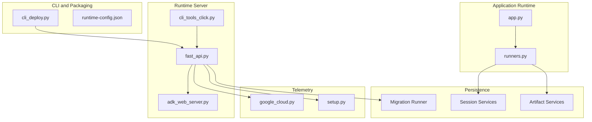
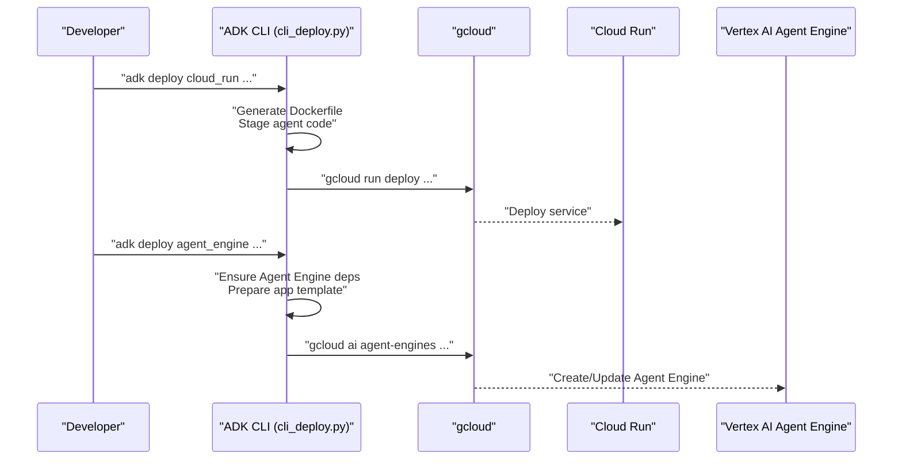
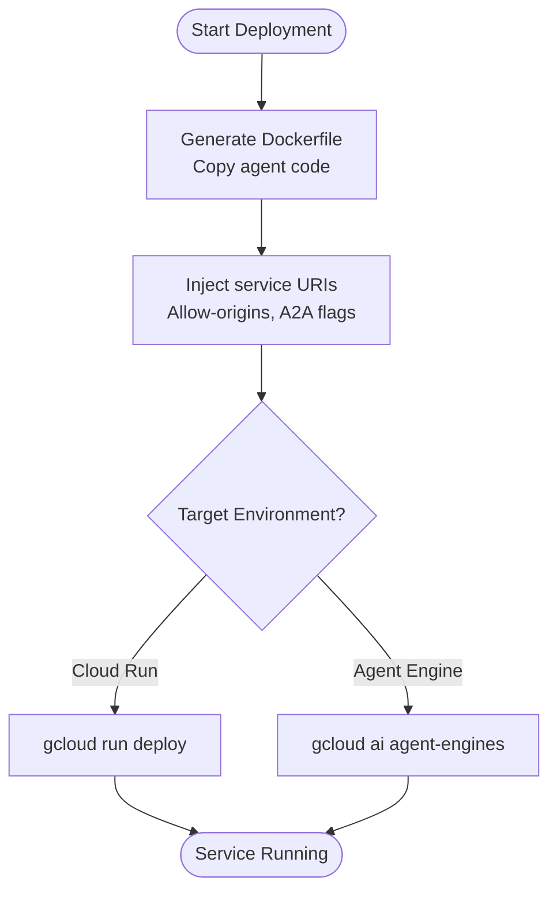
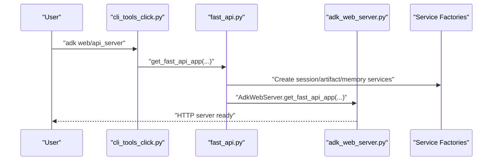
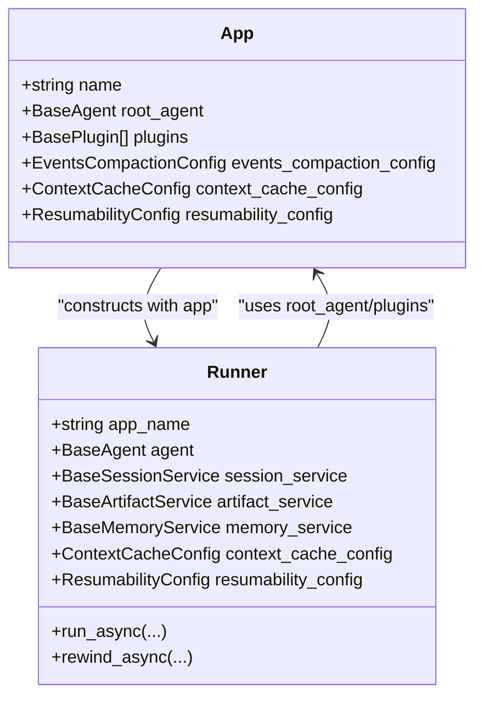
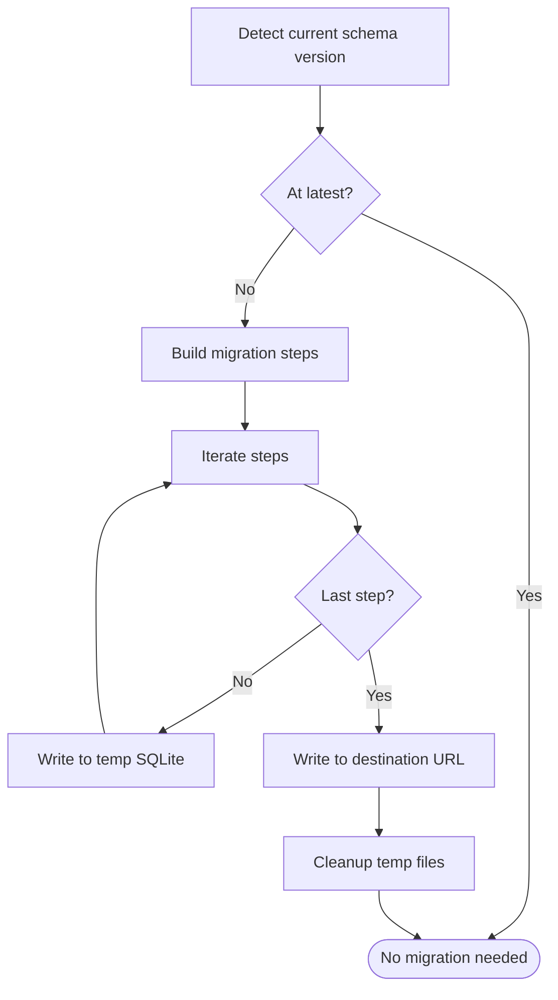
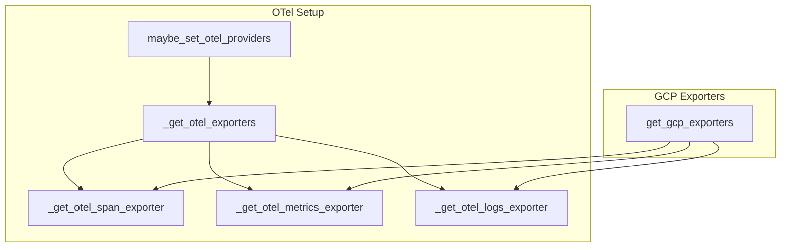
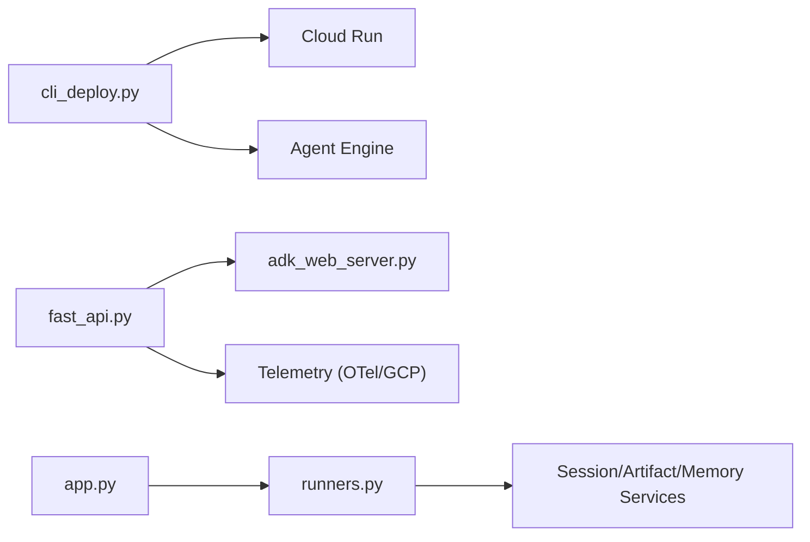

# Deployment and Production

<cite>
**Referenced Files in This Document**
- [cli_deploy.py](file://src/google/adk/cli/cli_deploy.py)
- [fast_api.py](file://src/google/adk/cli/fast_api.py)
- [adk_web_server.py](file://src/google/adk/cli/adk_web_server.py)
- [cli_tools_click.py](file://src/google/adk/cli/cli_tools_click.py)
- [env_utils.py](file://src/google/adk/utils/env_utils.py)
- [app.py](file://src/google/adk/apps/app.py)
- [runners.py](file://src/google/adk/runners.py)
- [google_cloud.py](file://src/google/adk/telemetry/google_cloud.py)
- [setup.py](file://src/google/adk/telemetry/setup.py)
- [migration_runner.py](file://src/google/adk/sessions/migration/migration_runner.py)
- [migrate_from_sqlalchemy_pickle.py](file://src/google/adk/sessions/migration/migrate_from_sqlalchemy_pickle.py)
- [db_migration.sh](file://scripts/db_migration.sh)
- [runtime-config.json](file://src/google/adk/cli/browser/assets/config/runtime-config.json)
- [README.md](file://contributing/samples/adk_knowledge_agent/README.md)
- [test_cli_deploy.py](file://tests/unittests/cli/utils/test_cli_deploy.py)
</cite>

## Table of Contents
1. [Introduction](#introduction)
2. [Project Structure](#project-structure)
3. [Core Components](#core-components)
4. [Architecture Overview](#architecture-overview)
5. [Detailed Component Analysis](#detailed-component-analysis)
6. [Dependency Analysis](#dependency-analysis)
7. [Performance Considerations](#performance-considerations)
8. [Troubleshooting Guide](#troubleshooting-guide)
9. [Conclusion](#conclusion)
10. [Appendices](#appendices)

## Introduction
This document provides comprehensive guidance for deploying and operating ADK applications in production. It covers deployment strategies for containerized environments, Google Cloud Run, and Vertex AI Agent Engine, along with runtime configuration, database migration and schema management, scaling and high availability patterns, CI/CD integration, monitoring and logging, and troubleshooting workflows.

## Project Structure
ADK’s deployment tooling centers around a CLI that generates deployment artifacts and orchestrates Cloud Run and Agent Engine deployments. The runtime server is a FastAPI application that hosts the agent execution engine, with optional UI assets and A2A support. Telemetry integrates with Google Cloud and OpenTelemetry. Sessions and artifacts are pluggable via service factories, enabling production-grade persistence and storage.

**Diagram sources**
- [cli_deploy.py](file://src/google/adk/cli/cli_deploy.py#L626-L800)
- [fast_api.py](file://src/google/adk/cli/fast_api.py#L73-L267)
- [adk_web_server.py](file://src/google/adk/cli/adk_web_server.py#L681-L697)
- [cli_tools_click.py](file://src/google/adk/cli/cli_tools_click.py#L1354-L1400)
- [app.py](file://src/google/adk/apps/app.py#L111-L152)
- [runners.py](file://src/google/adk/runners.py#L112-L220)
- [google_cloud.py](file://src/google/adk/telemetry/google_cloud.py#L70-L113)
- [setup.py](file://src/google/adk/telemetry/setup.py#L48-L123)
- [migration_runner.py](file://src/google/adk/sessions/migration/migration_runner.py#L45-L128)

**Section sources**
- [cli_deploy.py](file://src/google/adk/cli/cli_deploy.py#L626-L800)
- [fast_api.py](file://src/google/adk/cli/fast_api.py#L73-L267)
- [adk_web_server.py](file://src/google/adk/cli/adk_web_server.py#L681-L697)
- [cli_tools_click.py](file://src/google/adk/cli/cli_tools_click.py#L1354-L1400)
- [app.py](file://src/google/adk/apps/app.py#L111-L152)
- [runners.py](file://src/google/adk/runners.py#L112-L220)
- [google_cloud.py](file://src/google/adk/telemetry/google_cloud.py#L70-L113)
- [setup.py](file://src/google/adk/telemetry/setup.py#L48-L123)
- [migration_runner.py](file://src/google/adk/sessions/migration/migration_runner.py#L45-L128)

## Core Components
- CLI deployment pipeline: Generates Dockerfiles, stages agent code, injects service URIs, and deploys to Cloud Run or Agent Engine. Validates agent imports and merges labels.
- Runtime server: FastAPI app with session, artifact, and memory service factories; optional A2A routes; optional UI assets; telemetry hooks.
- Application runtime: App and Runner orchestrate agent execution, session lifecycle, and event compaction.
- Telemetry: Optional exporters to Google Cloud and generic OTLP endpoints.
- Persistence: Pluggable session and artifact services; migration runner for schema upgrades.

**Section sources**
- [cli_deploy.py](file://src/google/adk/cli/cli_deploy.py#L626-L800)
- [fast_api.py](file://src/google/adk/cli/fast_api.py#L73-L267)
- [runners.py](file://src/google/adk/runners.py#L112-L220)
- [setup.py](file://src/google/adk/telemetry/setup.py#L48-L123)
- [migration_runner.py](file://src/google/adk/sessions/migration/migration_runner.py#L45-L128)

## Architecture Overview
Production deployment architectures supported by ADK include:
- Containerized runtime with FastAPI serving agents, backed by external session and artifact services.
- Google Cloud Run for stateless autoscaling with optional UI and A2A.
- Vertex AI Agent Engine for managed agent hosting with optional Express Mode.

**Diagram sources**
- [cli_deploy.py](file://src/google/adk/cli/cli_deploy.py#L626-L800)
- [cli_deploy.py](file://src/google/adk/cli/cli_deploy.py#L104-L128)

**Section sources**
- [cli_deploy.py](file://src/google/adk/cli/cli_deploy.py#L626-L800)
- [cli_deploy.py](file://src/google/adk/cli/cli_deploy.py#L104-L128)

## Detailed Component Analysis

### Deployment Pipeline and Strategies
- Containerization:
  - The CLI generates a slim Python image, copies agent code, installs optional agent dependencies, and runs the ADK API server or web server with service URIs injected via environment variables and CLI options.
  - Supports allow-origin configuration for CORS and A2A mode toggles.
- Google Cloud Run:
  - The CLI builds a source-based deployment, validates conflicting flags, merges labels, and invokes gcloud run deploy with region/project/port/verbosity.
  - For newer ADK versions, session and artifact services default to in-memory when not provided.
- Vertex AI Agent Engine:
  - The CLI ensures Agent Engine dependencies are present, prepares an application template, and delegates to gcloud commands for Agent Engine creation/update.
  - Supports Express Mode and standard Vertex AI initialization modes.

**Diagram sources**
- [cli_deploy.py](file://src/google/adk/cli/cli_deploy.py#L626-L800)
- [cli_deploy.py](file://src/google/adk/cli/cli_deploy.py#L104-L128)

**Section sources**
- [cli_deploy.py](file://src/google/adk/cli/cli_deploy.py#L626-L800)
- [cli_deploy.py](file://src/google/adk/cli/cli_deploy.py#L104-L128)
- [README.md](file://contributing/samples/adk_knowledge_agent/README.md#L1-L25)

### Runtime Configuration and Service Factories
- FastAPI app construction:
  - Accepts session, artifact, and memory service URIs; selects local or cloud services based on URIs and flags.
  - Enables optional UI assets, A2A routes, telemetry hooks, and agent reload watcher.
- Environment handling:
  - Utilities detect environment flags for enabling features conditionally.
- Web server:
  - Provides endpoints for session creation and FastAPI app assembly with optional cloud tracing and OTLP export.

**Diagram sources**
- [cli_tools_click.py](file://src/google/adk/cli/cli_tools_click.py#L1354-L1400)
- [fast_api.py](file://src/google/adk/cli/fast_api.py#L73-L267)
- [adk_web_server.py](file://src/google/adk/cli/adk_web_server.py#L681-L697)

**Section sources**
- [fast_api.py](file://src/google/adk/cli/fast_api.py#L73-L267)
- [adk_web_server.py](file://src/google/adk/cli/adk_web_server.py#L681-L697)
- [cli_tools_click.py](file://src/google/adk/cli/cli_tools_click.py#L1354-L1400)
- [env_utils.py](file://src/google/adk/utils/env_utils.py#L26-L60)

### Application Architecture and Execution
- App and Runner:
  - App encapsulates the root agent, plugins, and optional resumability and event compaction configs.
  - Runner coordinates session retrieval/creation, invocation context setup, plugin execution, and event compaction.
- Streaming and A2A:
  - Optional A2A routes are mounted when enabled, exposing RPC and agent card endpoints.

**Diagram sources**
- [app.py](file://src/google/adk/apps/app.py#L111-L152)
- [runners.py](file://src/google/adk/runners.py#L112-L220)

**Section sources**
- [app.py](file://src/google/adk/apps/app.py#L111-L152)
- [runners.py](file://src/google/adk/runners.py#L112-L220)

### Database Migration and Schema Management
- Migration runner:
  - Upgrades sessions DB from current version to latest, building a sequence of migration steps and using temporary SQLite intermediates when needed.
  - Prevents in-place migration and cleans up temporary files on failure.
- Alembic-based script:
  - Initializes Alembic, stamps head, autogenerates revisions, and upgrades to latest for existing deployments.
- Manual migration helper:
  - Converts legacy SQLAlchemy-based sessions to current schema.

**Diagram sources**
- [migration_runner.py](file://src/google/adk/sessions/migration/migration_runner.py#L45-L128)
- [migrate_from_sqlalchemy_pickle.py](file://src/google/adk/sessions/migration/migrate_from_sqlalchemy_pickle.py#L36-L71)

**Section sources**
- [migration_runner.py](file://src/google/adk/sessions/migration/migration_runner.py#L45-L128)
- [db_migration.sh](file://scripts/db_migration.sh#L1-L144)

### Monitoring, Logging, and Observability
- Telemetry setup:
  - Conditional OTel providers and exporters based on environment variables; supports cloud tracing/metrics/logs.
- Google Cloud telemetry:
  - Dedicated hooks for Cloud Trace, Cloud Monitoring, and Cloud Logging exporters.

**Diagram sources**
- [setup.py](file://src/google/adk/telemetry/setup.py#L48-L173)
- [google_cloud.py](file://src/google/adk/telemetry/google_cloud.py#L70-L113)

**Section sources**
- [setup.py](file://src/google/adk/telemetry/setup.py#L48-L173)
- [google_cloud.py](file://src/google/adk/telemetry/google_cloud.py#L70-L113)

### CI/CD Integration and Automation
- CLI validation:
  - Unit tests validate project resolution from gcloud, environment variable handling, and CLI argument conflicts.
- Sample deployment:
  - A knowledge agent sample demonstrates Cloud Run deployment with environment variables and UI toggle.

**Section sources**
- [test_cli_deploy.py](file://tests/unittests/cli/utils/test_cli_deploy.py#L99-L126)
- [README.md](file://contributing/samples/adk_knowledge_agent/README.md#L1-L25)

## Dependency Analysis
- CLI to Runtime:
  - CLI constructs Dockerfiles and invokes gcloud; runtime server is FastAPI with service factories and telemetry hooks.
- App to Runner:
  - App defines configuration; Runner executes agent invocations and manages session lifecycle.
- Telemetry:
  - Runtime conditionally registers OTel providers and GCP exporters.

**Diagram sources**
- [cli_deploy.py](file://src/google/adk/cli/cli_deploy.py#L626-L800)
- [fast_api.py](file://src/google/adk/cli/fast_api.py#L73-L267)
- [adk_web_server.py](file://src/google/adk/cli/adk_web_server.py#L681-L697)
- [app.py](file://src/google/adk/apps/app.py#L111-L152)
- [runners.py](file://src/google/adk/runners.py#L112-L220)

**Section sources**
- [cli_deploy.py](file://src/google/adk/cli/cli_deploy.py#L626-L800)
- [fast_api.py](file://src/google/adk/cli/fast_api.py#L73-L267)
- [runners.py](file://src/google/adk/runners.py#L112-L220)

## Performance Considerations
- Autoscaling:
  - Cloud Run scales automatically; tune concurrency and minimum/maximum instances according to workload characteristics.
- Session and artifact services:
  - Use scalable backends (e.g., external databases, cloud storage) for production to avoid local storage limitations.
- Streaming and A2A:
  - Enable A2A only when needed; mount A2A routes conditionally to reduce overhead.
- Telemetry:
  - Prefer batch exporters and adjust sampling rates in high-throughput environments.

[No sources needed since this section provides general guidance]

## Troubleshooting Guide
- Deployment failures:
  - Validate project resolution and gcloud configuration; ensure no conflicting CLI flags; review error messages for missing requirements or import issues.
- Runtime errors:
  - Confirm service URIs are reachable; verify environment variables for telemetry; check CORS allow-origins configuration.
- Migration issues:
  - Use the Alembic script to stamp and upgrade; ensure model import paths are correct; clean up temporary files if migration fails.
- Session not found:
  - Verify app name alignment and auto-create session settings; check session service connectivity.

**Section sources**
- [test_cli_deploy.py](file://tests/unittests/cli/utils/test_cli_deploy.py#L99-L126)
- [cli_deploy.py](file://src/google/adk/cli/cli_deploy.py#L410-L468)
- [db_migration.sh](file://scripts/db_migration.sh#L1-L144)
- [runners.py](file://src/google/adk/runners.py#L384-L394)

## Conclusion
ADK provides a cohesive deployment and runtime stack for agent applications. By leveraging the CLI for packaging and Cloud Run/Agent Engine deployments, configuring robust service backends, and integrating telemetry and migrations, teams can operate reliable, scalable, and observable agent systems in production.

[No sources needed since this section summarizes without analyzing specific files]

## Appendices

### Practical Deployment Pipelines
- Cloud Run:
  - Prepare environment variables and run the CLI to generate and deploy the service.
- Vertex AI Agent Engine:
  - Ensure Agent Engine dependencies and use the CLI to create/update the agent engine.

**Section sources**
- [README.md](file://contributing/samples/adk_knowledge_agent/README.md#L1-L25)
- [cli_deploy.py](file://src/google/adk/cli/cli_deploy.py#L104-L128)

### Scaling and High Availability Patterns
- Horizontal scaling:
  - Use Cloud Run with autoscaling; provision multiple replicas for critical services.
- Load balancing:
  - Rely on Cloud Run’s managed load balancer; configure health checks and timeouts.
- High availability:
  - Distribute session and artifact services across regions; enable backups and disaster recovery.

[No sources needed since this section provides general guidance]

### Monitoring and Maintenance Procedures
- Telemetry:
  - Configure OTLP endpoints and GCP exporters; monitor traces, metrics, and logs.
- Maintenance:
  - Regularly upgrade sessions DB schema using provided scripts; validate service URIs and credentials.

**Section sources**
- [setup.py](file://src/google/adk/telemetry/setup.py#L48-L173)
- [google_cloud.py](file://src/google/adk/telemetry/google_cloud.py#L70-L113)
- [db_migration.sh](file://scripts/db_migration.sh#L1-L144)