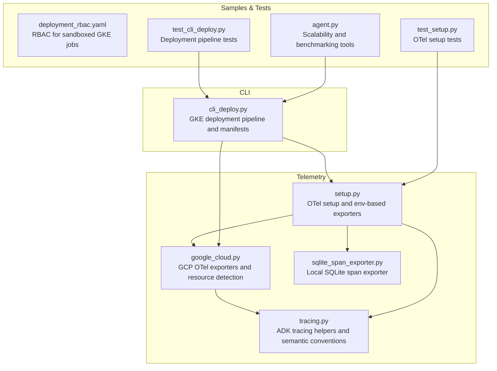
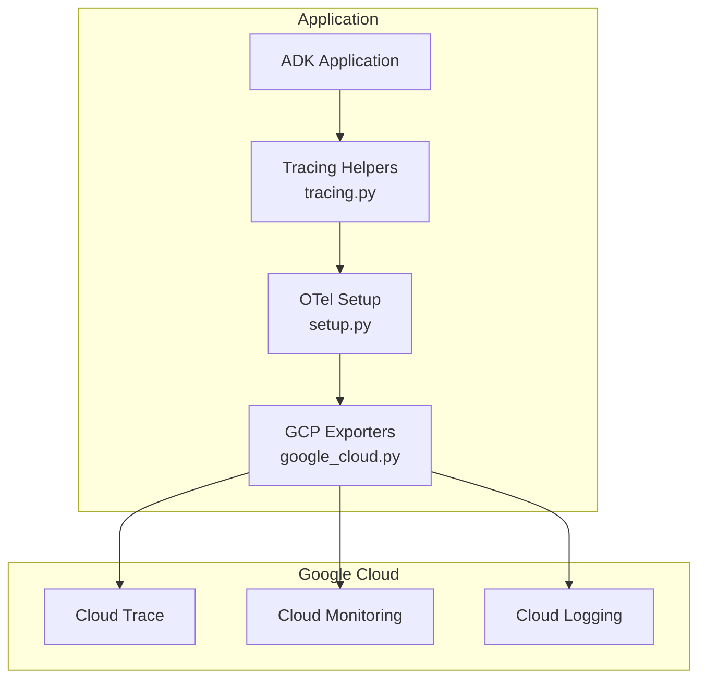
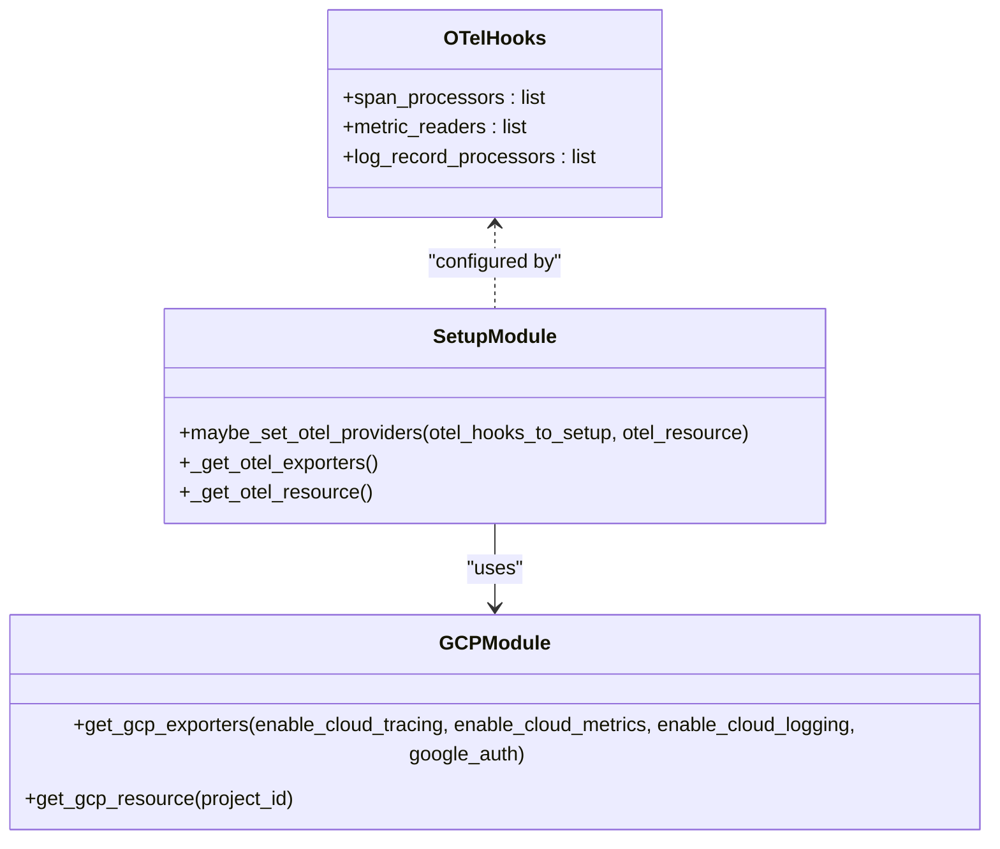
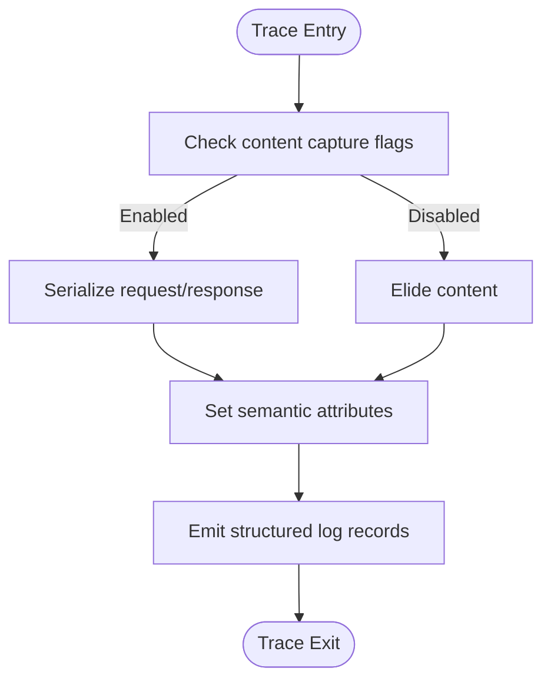
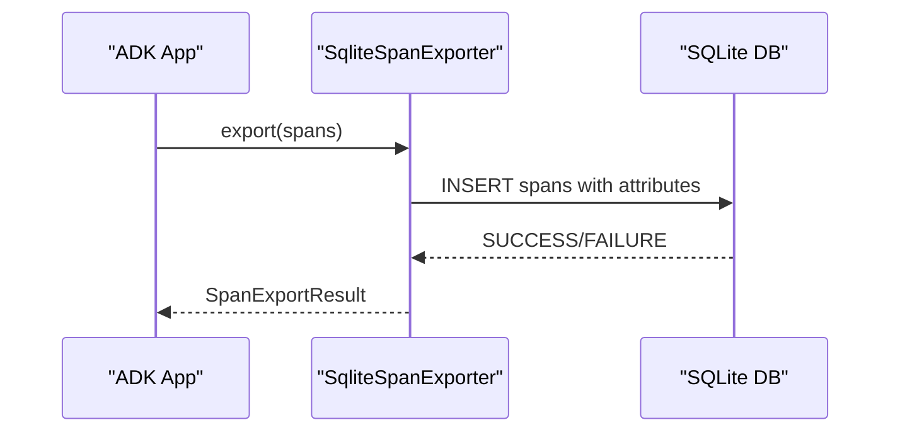
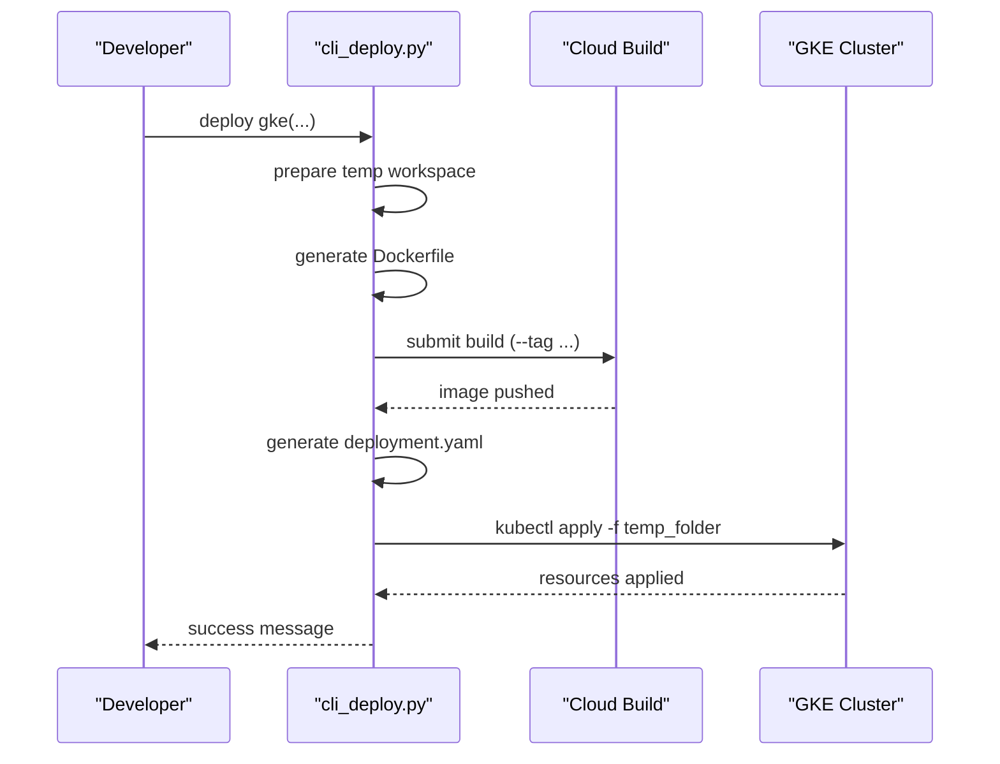
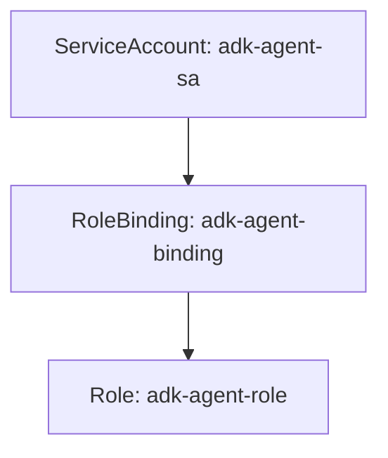
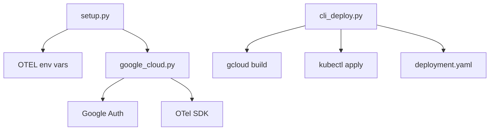

# Scaling and Monitoring

<cite>
**Referenced Files in This Document**
- [google_cloud.py](file://src/google/adk/telemetry/google_cloud.py)
- [setup.py](file://src/google/adk/telemetry/setup.py)
- [tracing.py](file://src/google/adk/telemetry/tracing.py)
- [sqlite_span_exporter.py](file://src/google/adk/telemetry/sqlite_span_exporter.py)
- [cli_deploy.py](file://src/google/adk/cli/cli_deploy.py)
- [deployment_rbac.yaml](file://contributing/samples/gke_agent_sandbox/deployment_rbac.yaml)
- [test_cli_deploy.py](file://tests/unittests/cli/utils/test_cli_deploy.py)
- [test_setup.py](file://tests/unittests/telemetry/test_setup.py)
- [agent.py](file://contributing/samples/cache_analysis/agent.py)
</cite>

## Table of Contents
1. [Introduction](#introduction)
2. [Project Structure](#project-structure)
3. [Core Components](#core-components)
4. [Architecture Overview](#architecture-overview)
5. [Detailed Component Analysis](#detailed-component-analysis)
6. [Dependency Analysis](#dependency-analysis)
7. [Performance Considerations](#performance-considerations)
8. [Troubleshooting Guide](#troubleshooting-guide)
9. [Conclusion](#conclusion)
10. [Appendices](#appendices)

## Introduction
This document provides production-grade guidance for scaling and monitoring ADK deployments across multiple environments. It covers horizontal and vertical scaling patterns, load balancing strategies, auto-scaling configurations, and capacity planning. It also documents the telemetry and observability architecture with OpenTelemetry integration and Google Cloud monitoring, along with practical examples for dashboards, performance benchmarks, and capacity planning calculations. High availability, disaster recovery, and maintenance windows are addressed to support reliable production operations.

## Project Structure
The repository organizes scaling and monitoring capabilities primarily within the telemetry subsystem and CLI deployment utilities:
- Telemetry: OpenTelemetry setup, GCP exporters, tracing helpers, and SQLite span exporter for local development.
- CLI: GKE deployment pipeline that generates Docker images, Kubernetes manifests, and applies them to clusters.
- Samples and tests: Example RBAC manifests and unit tests validating deployment and OTel setup.

**Diagram sources**
- [setup.py](file://src/google/adk/telemetry/setup.py#L48-L123)
- [google_cloud.py](file://src/google/adk/telemetry/google_cloud.py#L44-L94)
- [tracing.py](file://src/google/adk/telemetry/tracing.py#L95-L105)
- [sqlite_span_exporter.py](file://src/google/adk/telemetry/sqlite_span_exporter.py#L76-L87)
- [cli_deploy.py](file://src/google/adk/cli/cli_deploy.py#L1234-L1382)
- [deployment_rbac.yaml](file://contributing/samples/gke_agent_sandbox/deployment_rbac.yaml#L1-L51)
- [test_cli_deploy.py](file://tests/unittests/cli/utils/test_cli_deploy.py#L461-L509)
- [test_setup.py](file://tests/unittests/telemetry/test_setup.py#L29-L107)
- [agent.py](file://contributing/samples/cache_analysis/agent.py#L455-L556)

**Section sources**
- [google_cloud.py](file://src/google/adk/telemetry/google_cloud.py#L44-L94)
- [setup.py](file://src/google/adk/telemetry/setup.py#L48-L123)
- [cli_deploy.py](file://src/google/adk/cli/cli_deploy.py#L1234-L1382)
- [deployment_rbac.yaml](file://contributing/samples/gke_agent_sandbox/deployment_rbac.yaml#L1-L51)
- [test_cli_deploy.py](file://tests/unittests/cli/utils/test_cli_deploy.py#L461-L509)
- [test_setup.py](file://tests/unittests/telemetry/test_setup.py#L29-L107)
- [agent.py](file://contributing/samples/cache_analysis/agent.py#L455-L556)

## Core Components
- OpenTelemetry setup and environment-based exporters:
  - Centralized provider initialization and processor aggregation.
  - Support for OTLP endpoints via environment variables.
- GCP-specific exporters:
  - Tracing to Cloud Trace, metrics to Cloud Monitoring, logs to Cloud Logging.
  - Resource detection merging GCP platform attributes.
- Tracing helpers:
  - Semantic conventions for agent invocations, tool calls, and LLM interactions.
  - Controlled capture of message content via environment flags.
- SQLite span exporter:
  - Local development exporter enabling reload and replay of traces.
- CLI deployment:
  - Docker image build, Kubernetes manifest generation, and cluster application.
  - Options to enable Cloud Trace and OpenTelemetry export to Google Cloud.

Key responsibilities:
- Telemetry: Configure and wire OTel providers, export signals to GCP, and manage resource attributes.
- CLI: Package and deploy ADK applications to GKE with proper networking and load balancing.

**Section sources**
- [setup.py](file://src/google/adk/telemetry/setup.py#L48-L123)
- [google_cloud.py](file://src/google/adk/telemetry/google_cloud.py#L44-L94)
- [tracing.py](file://src/google/adk/telemetry/tracing.py#L130-L235)
- [sqlite_span_exporter.py](file://src/google/adk/telemetry/sqlite_span_exporter.py#L76-L87)
- [cli_deploy.py](file://src/google/adk/cli/cli_deploy.py#L1234-L1382)

## Architecture Overview
The production monitoring architecture integrates ADK’s telemetry with Google Cloud Observability:
- Tracing: Spans exported to Cloud Trace via GCP OTel exporter.
- Metrics: Periodic exports to Cloud Monitoring via GCP OTel exporter.
- Logs: Batched logs exported to Cloud Logging via GCP OTel exporter.
- Resource attributes: Merged from environment and GCP detectors to identify monitored resources.

**Diagram sources**
- [tracing.py](file://src/google/adk/telemetry/tracing.py#L95-L105)
- [setup.py](file://src/google/adk/telemetry/setup.py#L48-L123)
- [google_cloud.py](file://src/google/adk/telemetry/google_cloud.py#L44-L94)

**Section sources**
- [google_cloud.py](file://src/google/adk/telemetry/google_cloud.py#L133-L160)
- [setup.py](file://src/google/adk/telemetry/setup.py#L125-L128)

## Detailed Component Analysis

### Telemetry Providers and Exporters
- OTel setup:
  - Aggregates span processors, metric readers, and log record processors from configured hooks.
  - Adds generic OTLP exporters based on environment variables for traces, metrics, and logs.
  - Initializes TracerProvider, MeterProvider, and LoggerProvider if not already set externally.
- GCP exporters:
  - Conditional exporters for tracing, metrics, and logging based on flags.
  - Uses Google Auth session for secure OTLP endpoints.
  - Periodic metric reader with fixed interval for Cloud Monitoring.
- Resource detection:
  - Merges environment-detected attributes with GCP platform attributes for accurate monitored resource tagging.

**Diagram sources**
- [setup.py](file://src/google/adk/telemetry/setup.py#L41-L46)
- [setup.py](file://src/google/adk/telemetry/setup.py#L48-L123)
- [google_cloud.py](file://src/google/adk/telemetry/google_cloud.py#L44-L94)

**Section sources**
- [setup.py](file://src/google/adk/telemetry/setup.py#L48-L123)
- [google_cloud.py](file://src/google/adk/telemetry/google_cloud.py#L44-L94)

### Tracing Helpers and Semantic Conventions
- Tracing helpers:
  - Agent invocation, tool call, and LLM call tracing with standardized attributes.
  - Controlled capture of request/response content via environment flags.
- Experimental semantic conventions:
  - Support for experimental semantic conventions and operation details attributes.
- Logging integration:
  - Emits structured log records alongside spans for richer observability.

**Diagram sources**
- [tracing.py](file://src/google/adk/telemetry/tracing.py#L442-L446)
- [tracing.py](file://src/google/adk/telemetry/tracing.py#L529-L532)
- [tracing.py](file://src/google/adk/telemetry/tracing.py#L622-L655)

**Section sources**
- [tracing.py](file://src/google/adk/telemetry/tracing.py#L130-L235)
- [tracing.py](file://src/google/adk/telemetry/tracing.py#L442-L446)
- [tracing.py](file://src/google/adk/telemetry/tracing.py#L529-L532)

### SQLite Span Exporter (Local Development)
- Purpose:
  - Persist spans to a local SQLite database for development and debugging.
- Features:
  - Thread-safe connection management, schema creation, and indexing.
  - Serialization/deserialization of span attributes.
  - Query utilities to retrieve session traces.

**Diagram sources**
- [sqlite_span_exporter.py](file://src/google/adk/telemetry/sqlite_span_exporter.py#L128-L160)

**Section sources**
- [sqlite_span_exporter.py](file://src/google/adk/telemetry/sqlite_span_exporter.py#L76-L87)
- [sqlite_span_exporter.py](file://src/google/adk/telemetry/sqlite_span_exporter.py#L128-L160)

### CLI Deployment Pipeline (GKE)
- Steps:
  - Prepare build environment and copy agent code.
  - Generate Dockerfile with environment variables and command-line options.
  - Build and push container image using Cloud Build.
  - Generate Kubernetes Deployment and Service manifests.
  - Apply manifests to the cluster and print applied resources.
- Options:
  - Enable Cloud Trace and OpenTelemetry export to Google Cloud.
  - Configure allowed origins, service URIs, and A2A mode.

**Diagram sources**
- [cli_deploy.py](file://src/google/adk/cli/cli_deploy.py#L1234-L1382)
- [test_cli_deploy.py](file://tests/unittests/cli/utils/test_cli_deploy.py#L461-L509)

**Section sources**
- [cli_deploy.py](file://src/google/adk/cli/cli_deploy.py#L1234-L1382)
- [test_cli_deploy.py](file://tests/unittests/cli/utils/test_cli_deploy.py#L461-L509)

### RBAC for Sandbox Jobs (GKE)
- Provides scoped permissions for jobs running in a dedicated namespace.
- Grants verbs for managing Jobs, ConfigMaps, Pods, and reading Pod logs.

**Diagram sources**
- [deployment_rbac.yaml](file://contributing/samples/gke_agent_sandbox/deployment_rbac.yaml#L6-L50)

**Section sources**
- [deployment_rbac.yaml](file://contributing/samples/gke_agent_sandbox/deployment_rbac.yaml#L1-L51)

## Dependency Analysis
- Telemetry dependencies:
  - OTel setup depends on environment variables and GCP exporters.
  - GCP exporters depend on Google Auth and OTel SDK components.
- CLI deployment dependencies:
  - Uses gcloud and kubectl for cluster operations.
  - Generates Dockerfile and Kubernetes manifests dynamically.

**Diagram sources**
- [setup.py](file://src/google/adk/telemetry/setup.py#L131-L154)
- [google_cloud.py](file://src/google/adk/telemetry/google_cloud.py#L97-L130)
- [cli_deploy.py](file://src/google/adk/cli/cli_deploy.py#L1267-L1382)

**Section sources**
- [setup.py](file://src/google/adk/telemetry/setup.py#L131-L154)
- [google_cloud.py](file://src/google/adk/telemetry/google_cloud.py#L97-L130)
- [cli_deploy.py](file://src/google/adk/cli/cli_deploy.py#L1267-L1382)

## Performance Considerations
- Horizontal scaling:
  - Use Kubernetes Deployments with multiple replicas behind a Service and LoadBalancer.
  - Scale based on CPU, memory, and custom metrics using HPA.
- Vertical scaling:
  - Adjust container resource requests/limits and node autoscaling.
- Load balancing:
  - Expose via a GKE LoadBalancer Service to distribute traffic across pods.
- Telemetry overhead:
  - Control content capture via environment flags to reduce span size.
  - Tune periodic metric export intervals for Cloud Monitoring.

[No sources needed since this section provides general guidance]

## Troubleshooting Guide
- Telemetry setup:
  - Validate OTel provider initialization and exporter registration via tests.
  - Confirm environment variables for OTLP endpoints are set when using generic exporters.
- GKE deployment:
  - Review logs from gcloud builds and kubectl apply steps.
  - Verify generated deployment.yaml includes expected Service and Deployment resources.
- RBAC:
  - Ensure ServiceAccount, Role, and RoleBinding are created in the correct namespace.

**Section sources**
- [test_setup.py](file://tests/unittests/telemetry/test_setup.py#L29-L107)
- [test_cli_deploy.py](file://tests/unittests/cli/utils/test_cli_deploy.py#L461-L509)
- [deployment_rbac.yaml](file://contributing/samples/gke_agent_sandbox/deployment_rbac.yaml#L1-L51)

## Conclusion
By leveraging ADK’s OpenTelemetry integration and GCP exporters, teams can achieve robust production observability. The CLI deployment pipeline streamlines packaging and rollout to GKE with built-in load balancing and export options. Combined with horizontal and vertical scaling strategies, capacity planning, and structured troubleshooting, organizations can operate reliable, high-performance ADK deployments.

[No sources needed since this section summarizes without analyzing specific files]

## Appendices

### Practical Examples

- Monitoring dashboards
  - Traces: Use Cloud Trace to visualize agent invocation and tool call latency.
  - Metrics: Monitor request rate, error rate, latency, and token usage in Cloud Monitoring.
  - Logs: Filter by default log name and resource attributes in Cloud Logging.

- Performance benchmarks
  - Use the benchmarking tool to establish baselines and evaluate scalability limits.
  - Example metrics include latency, throughput, CPU/memory, and disk/network utilization.

- Capacity planning calculations
  - Estimate peak concurrent requests and derive required replicas.
  - Factor in model tokenization costs and memory footprint to size nodes and containers.

**Section sources**
- [agent.py](file://contributing/samples/cache_analysis/agent.py#L559-L611)