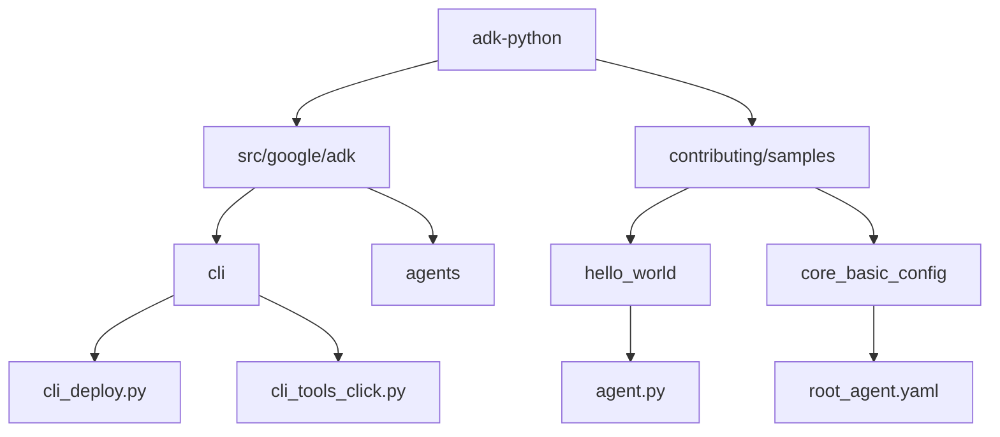
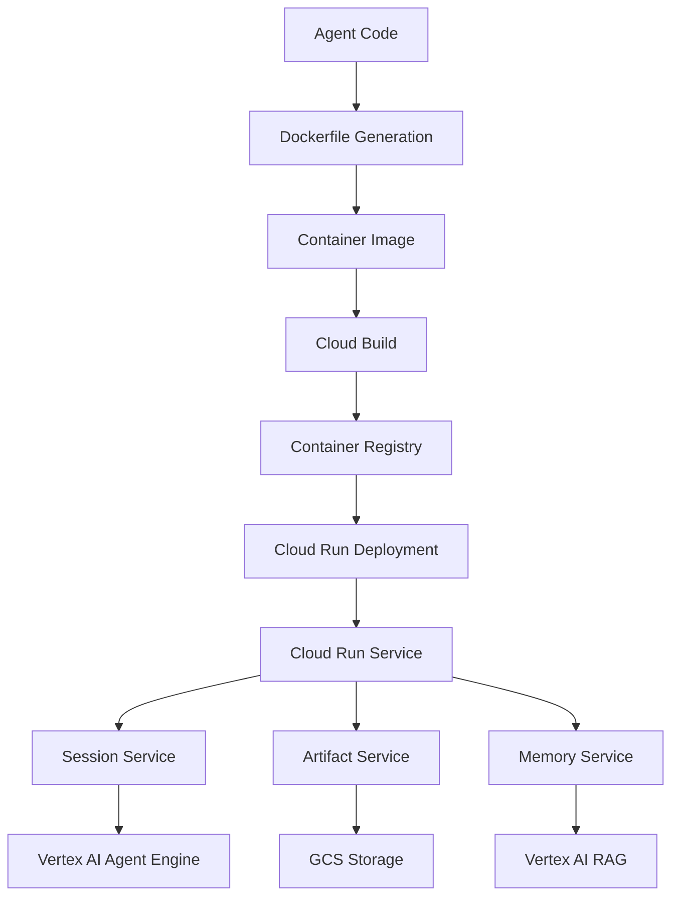
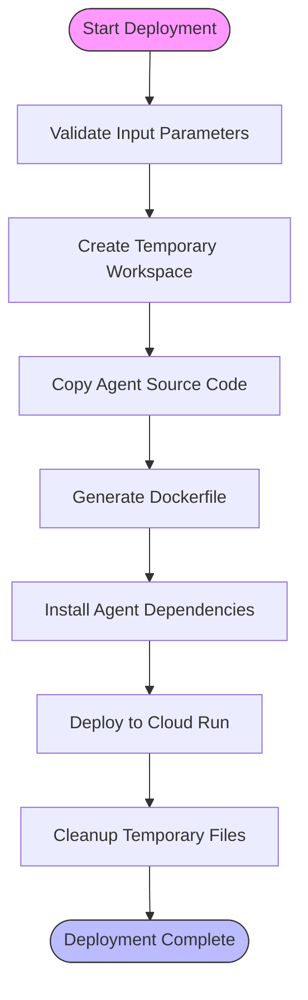
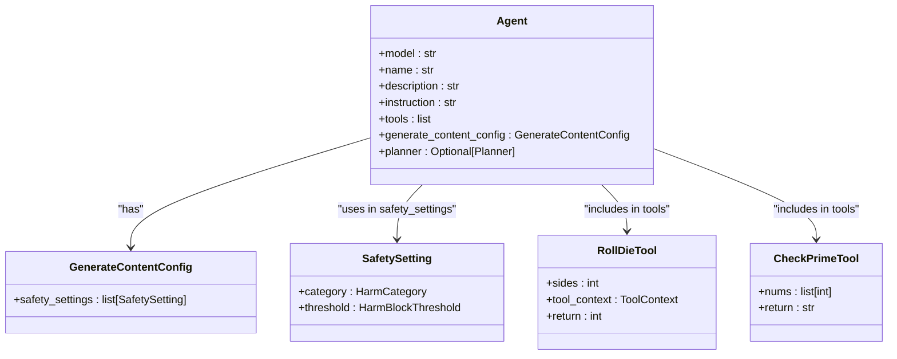
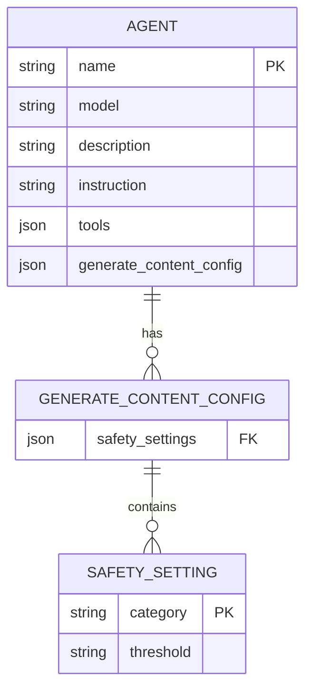
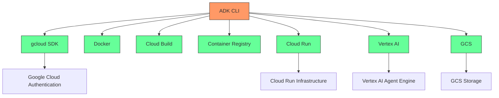
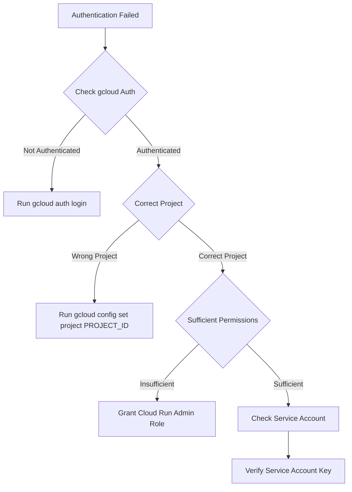
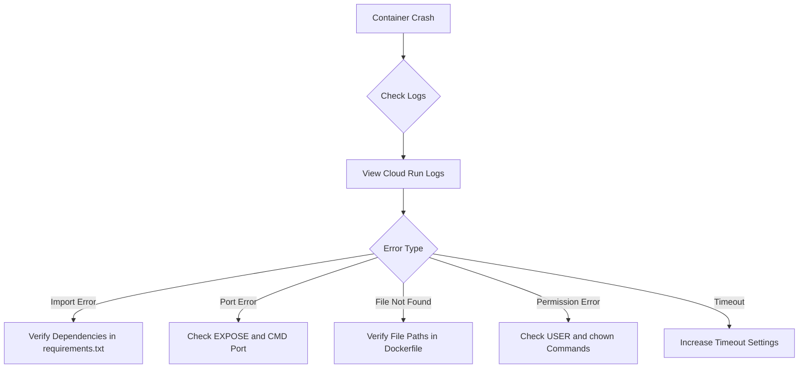

# Cloud Run

<cite>
**Referenced Files in This Document**   
- [cli_deploy.py](file://src/google/adk/cli/cli_deploy.py)
- [cli_tools_click.py](file://src/google/adk/cli/cli_tools_click.py)
- [fast_api.py](file://src/google/adk/cli/fast_api.py)
- [hello_world/agent.py](file://contributing/samples/hello_world/agent.py)
- [core_basic_config/root_agent.yaml](file://contributing/samples/core_basic_config/root_agent.yaml)
</cite>

## Table of Contents
1. [Introduction](#introduction)
2. [Project Structure](#project-structure)
3. [Core Components](#core-components)
4. [Architecture Overview](#architecture-overview)
5. [Detailed Component Analysis](#detailed-component-analysis)
6. [Dependency Analysis](#dependency-analysis)
7. [Performance Considerations](#performance-considerations)
8. [Troubleshooting Guide](#troubleshooting-guide)
9. [Conclusion](#conclusion)

## Introduction
This document provides comprehensive guidance for deploying agents to Google Cloud Run using the Agent Development Kit (ADK). It covers the complete deployment workflow, from packaging agents as containerized applications to configuring and managing deployed services. The documentation explains the implementation details of the deployment process, including the Dockerfile generation, service configuration, and integration with Google Cloud services. It also addresses security considerations, monitoring strategies, and troubleshooting common deployment issues.

## Project Structure
The ADK Python repository is organized with a clear structure that separates core functionality, CLI tools, and sample agents. The main components relevant to Cloud Run deployment are located in the `src/google/adk/cli` directory, which contains the deployment logic, while sample agents in the `contributing/samples` directory demonstrate various agent configurations and use cases.



**Diagram sources**
- [cli_deploy.py](file://src/google/adk/cli/cli_deploy.py#L24-L59)
- [hello_world/agent.py](file://contributing/samples/hello_world/agent.py#L67-L108)
- [core_basic_config/root_agent.yaml](file://contributing/samples/core_basic_config/root_agent.yaml#L1-L10)

**Section sources**
- [cli_deploy.py](file://src/google/adk/cli/cli_deploy.py#L1-L711)
- [cli_tools_click.py](file://src/google/adk/cli/cli_tools_click.py#L1-L1336)

## Core Components
The Cloud Run deployment functionality is implemented through several core components that work together to package and deploy agents. The primary components include the deployment CLI commands, the Dockerfile template generation, and the service configuration management. These components handle the conversion of agent code into containerized applications suitable for serverless deployment on Google Cloud Run.

**Section sources**
- [cli_deploy.py](file://src/google/adk/cli/cli_deploy.py#L125-L260)
- [cli_tools_click.py](file://src/google/adk/cli/cli_tools_click.py#L861-L1035)

## Architecture Overview
The deployment architecture for Cloud Run involves transforming agent code into containerized applications using a standardized process. The ADK CLI generates a Dockerfile and necessary deployment artifacts, then uses Google Cloud SDK to deploy the container to Cloud Run. The architecture integrates with various Google Cloud services for session management, artifact storage, and memory services, providing a comprehensive serverless solution for agent deployment.



**Diagram sources**
- [cli_deploy.py](file://src/google/adk/cli/cli_deploy.py#L24-L59)
- [fast_api.py](file://src/google/adk/cli/fast_api.py#L56-L386)

## Detailed Component Analysis

### Cloud Run Deployment Implementation
The Cloud Run deployment implementation is centered around the `to_cloud_run` function in the `cli_deploy.py` module. This function orchestrates the entire deployment process, from generating the necessary deployment artifacts to executing the deployment command. It creates a temporary workspace, copies the agent source code, generates a Dockerfile with appropriate configurations, and deploys the container to Cloud Run using the `gcloud` command-line tool.

#### Deployment Process Flow


**Diagram sources**
- [cli_deploy.py](file://src/google/adk/cli/cli_deploy.py#L125-L260)

#### Dockerfile Template Structure
The Dockerfile template used for Cloud Run deployment follows a security-conscious approach by creating a non-root user and setting appropriate permissions. It configures environment variables for Google Cloud integration, installs the ADK package, copies the agent code, and sets up the command to run the ADK server.

```mermaid
classDiagram
class Dockerfile {
+FROM python : 3.11-slim
+WORKDIR /app
+RUN adduser --disabled-password --gecos "" myuser
+RUN chown -R myuser : myuser /app
+USER myuser
+ENV PATH="/home/myuser/.local/bin : $PATH"
+ENV GOOGLE_GENAI_USE_VERTEXAI=1
+ENV GOOGLE_CLOUD_PROJECT={gcp_project_id}
+ENV GOOGLE_CLOUD_LOCATION={gcp_region}
+RUN pip install google-adk=={adk_version}
+COPY "agents/{app_name}/" "/app/agents/{app_name}/"
+RUN pip install -r "/app/agents/{app_name}/requirements.txt" if exists
+EXPOSE {port}
+CMD adk {command} --port={port} {host_option} {service_option} {trace_to_cloud_option} {allow_origins_option} {a2a_option} "/app/agents"
}
```

**Diagram sources**
- [cli_deploy.py](file://src/google/adk/cli/cli_deploy.py#L24-L59)

**Section sources**
- [cli_deploy.py](file://src/google/adk/cli/cli_deploy.py#L1-L711)

### Agent Configuration Analysis
Agents can be configured using either Python code or YAML configuration files. The analysis examines both approaches to understand how they are processed during deployment and how they affect the runtime behavior of the deployed service.

#### Code-Based Agent Configuration
The hello_world agent demonstrates a code-based configuration approach where the agent is defined as a Python object with various properties and methods. This approach provides maximum flexibility and allows for complex logic in agent behavior definition.



**Diagram sources**
- [hello_world/agent.py](file://contributing/samples/hello_world/agent.py#L67-L108)

#### YAML-Based Agent Configuration
The core_basic_config agent demonstrates a YAML-based configuration approach, which provides a declarative way to define agent properties. This approach is particularly useful for configuration management and version control.



**Diagram sources**
- [core_basic_config/root_agent.yaml](file://contributing/samples/core_basic_config/root_agent.yaml#L1-L10)

**Section sources**
- [hello_world/agent.py](file://contributing/samples/hello_world/agent.py#L1-L109)
- [core_basic_config/root_agent.yaml](file://contributing/samples/core_basic_config/root_agent.yaml#L1-L10)

## Dependency Analysis
The Cloud Run deployment process relies on several external dependencies and integrates with various Google Cloud services. Understanding these dependencies is crucial for successful deployment and operation of the agent services.



**Diagram sources**
- [cli_deploy.py](file://src/google/adk/cli/cli_deploy.py#L17-L22)
- [fast_api.py](file://src/google/adk/cli/fast_api.py#L36-L45)

## Performance Considerations
When deploying agents to Cloud Run, several performance considerations must be taken into account to ensure optimal service operation and cost efficiency. These include cold start times, concurrency settings, and resource allocation.

Cloud Run's serverless nature means that instances may need to be initialized when requests arrive, potentially leading to cold start delays. The deployment configuration allows for setting minimum instances to mitigate this issue, though it impacts cost. Concurrency settings can be adjusted to balance between resource utilization and response latency.

The container image size also affects deployment and startup times, so minimizing dependencies and optimizing the Dockerfile can improve performance. Additionally, the agent's internal processing logic and external service calls contribute to overall response times and should be optimized for the serverless environment.

## Troubleshooting Guide
This section addresses common issues encountered during Cloud Run deployment and provides guidance for resolution.

### Authentication and Permission Issues
Authentication problems typically arise from missing or incorrect Google Cloud credentials. Ensure that the `gcloud` CLI is properly authenticated with the correct project and that the service account has the necessary permissions for Cloud Run deployment.



**Diagram sources**
- [cli_deploy.py](file://src/google/adk/cli/cli_deploy.py#L83-L95)

### Container and Deployment Issues
Container-related problems often stem from incorrect Dockerfile configuration or missing dependencies. Verify that the agent code is correctly copied to the container and that all required packages are installed.



**Diagram sources**
- [cli_deploy.py](file://src/google/adk/cli/cli_deploy.py#L234-L256)

**Section sources**
- [cli_deploy.py](file://src/google/adk/cli/cli_deploy.py#L1-L711)

## Conclusion
Deploying agents to Google Cloud Run using the ADK CLI provides a streamlined process for containerizing and deploying agent applications. The deployment system automates the creation of Dockerfiles and handles the deployment workflow through integration with Google Cloud services. By understanding the configuration options, security considerations, and performance characteristics, developers can effectively deploy and manage agent services on Cloud Run. The combination of code-based and YAML-based configuration approaches offers flexibility for different use cases, while the integration with monitoring and logging services enables comprehensive observability of deployed agents.