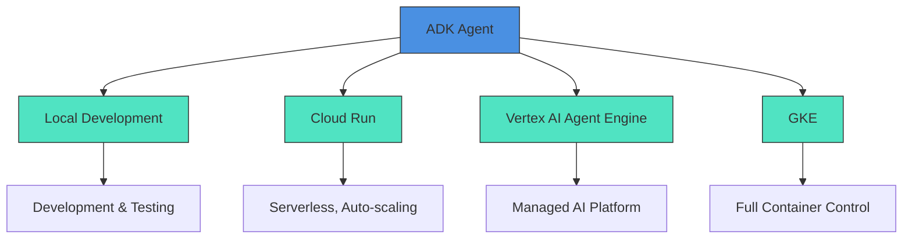
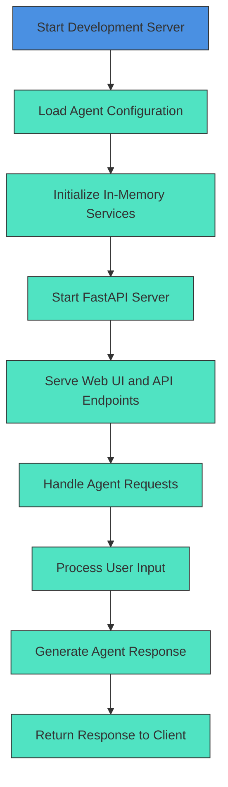
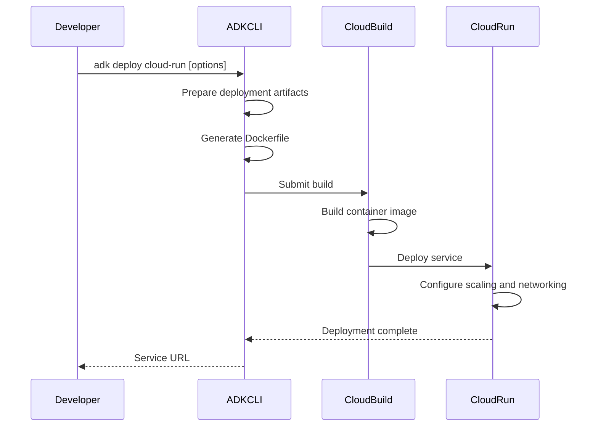
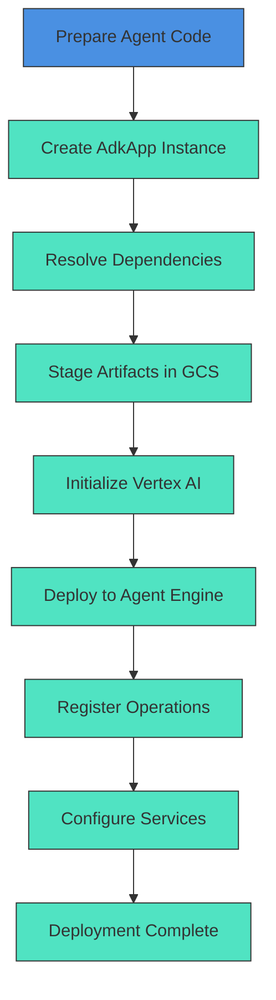
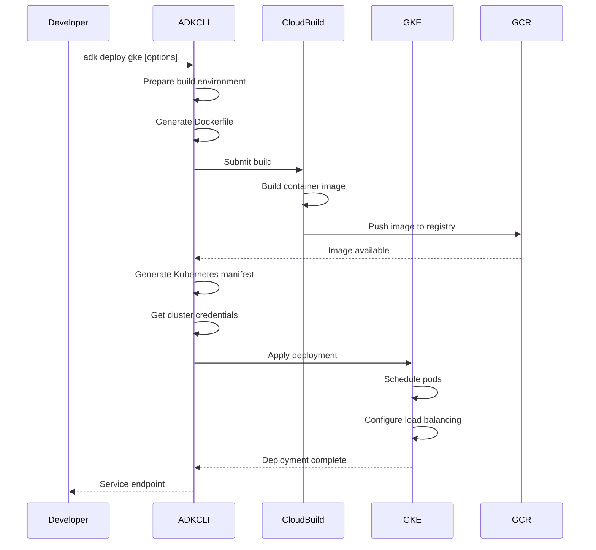
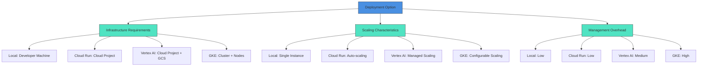
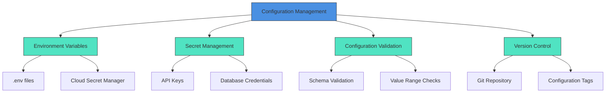
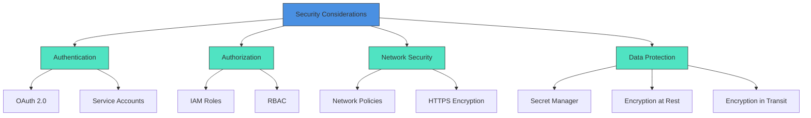
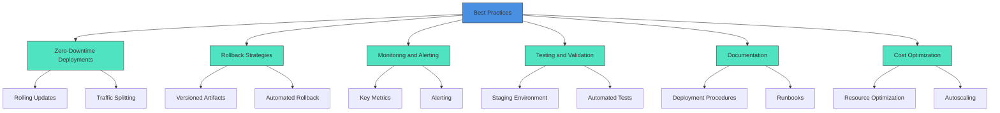

# Deployment

<cite>
**Referenced Files in This Document**   
- [cli_deploy.py](file://src/google/adk/cli/cli_deploy.py)
- [fast_api.py](file://src/google/adk/cli/fast_api.py)
- [adk_web_server.py](file://src/google/adk/cli/adk_web_server.py)
- [envs.py](file://src/google/adk/cli/utils/envs.py)
- [README.md](file://README.md)
</cite>

## Table of Contents
1. [Introduction](#introduction)
2. [Deployment Options Overview](#deployment-options-overview)
3. [Local Development Deployment](#local-development-deployment)
4. [Cloud Run Deployment](#cloud-run-deployment)
5. [Vertex AI Agent Engine Deployment](#vertex-ai-agent-engine-deployment)
6. [Google Kubernetes Engine (GKE) Deployment](#google-kubernetes-engine-gke-deployment)
7. [Infrastructure Requirements and Scaling](#infrastructure-requirements-and-scaling)
8. [Production Configuration and Lifecycle Management](#production-configuration-and-lifecycle-management)
9. [Security Considerations](#security-considerations)
10. [Best Practices for Production Deployments](#best-practices-for-production-deployments)

## Introduction

The Agent Development Kit (ADK) framework provides multiple deployment options for productionizing AI agents, offering flexibility for different use cases and infrastructure requirements. This document details the various deployment strategies available for ADK-built agents, including local development environments, Cloud Run, Vertex AI Agent Engine, and Google Kubernetes Engine (GKE). Each deployment option has specific trade-offs in terms of scalability, management overhead, and integration capabilities.

The ADK framework is designed to be deployment-agnostic, allowing developers to containerize and deploy agents across different environments while maintaining consistent functionality. The deployment process is streamlined through CLI commands that handle packaging, configuration, and deployment automation, reducing the complexity of productionizing AI agents.

**Section sources**
- [README.md](file://README.md#L47-L48)
- [cli_deploy.py](file://src/google/adk/cli/cli_deploy.py#L1-L711)

## Deployment Options Overview

The ADK framework supports four primary deployment options, each tailored to different production requirements:

1. **Local Development Environment**: For testing and debugging agents during development
2. **Cloud Run**: For serverless deployment with automatic scaling and minimal infrastructure management
3. **Vertex AI Agent Engine**: For managed agent deployment with integrated AI platform services
4. **Google Kubernetes Engine (GKE)**: For containerized deployment with full control over infrastructure and scaling

Each deployment option has distinct advantages and trade-offs. Cloud Run offers the simplest deployment model with automatic scaling and pay-per-use pricing, making it ideal for applications with variable traffic patterns. Vertex AI Agent Engine provides deep integration with Google's AI platform, including managed memory and session services. GKE offers the most flexibility and control for complex deployment scenarios requiring custom networking, storage, or scaling configurations.

The choice of deployment option depends on factors such as expected traffic patterns, required scalability, integration needs with other Google Cloud services, and operational expertise. The ADK framework ensures that agents can be deployed consistently across these environments with minimal code changes.

**Diagram sources**
- [cli_deploy.py](file://src/google/adk/cli/cli_deploy.py#L125-L711)
- [README.md](file://README.md#L47-L48)

**Section sources**
- [cli_deploy.py](file://src/google/adk/cli/cli_deploy.py#L125-L711)
- [README.md](file://README.md#L47-L48)

## Local Development Deployment

Local development deployment enables developers to test and debug agents in a controlled environment before production deployment. The ADK framework provides a built-in development server that can be launched using the `adk web` command, which starts a FastAPI server with integrated UI for agent interaction.

The local deployment process involves creating a Docker container with the agent code and dependencies, then running it on the developer's machine. The deployment configuration includes environment variables for Google Cloud project and location, which are loaded from `.env` files in the agent directory. This allows developers to maintain separate configuration for development and production environments.

For local testing, the ADK framework uses in-memory services for session management, artifact storage, and memory, which simplifies setup but is not suitable for production use. The development server also includes debugging tools such as trace visualization and event logging, which help identify issues in agent behavior and performance.

**Diagram sources**
- [fast_api.py](file://src/google/adk/cli/fast_api.py#L56-L387)
- [adk_web_server.py](file://src/google/adk/cli/adk_web_server.py#L202-L800)

**Section sources**
- [fast_api.py](file://src/google/adk/cli/fast_api.py#L56-L387)
- [adk_web_server.py](file://src/google/adk/cli/adk_web_server.py#L202-L800)
- [envs.py](file://src/google/adk/cli/utils/envs.py#L35-L55)

## Cloud Run Deployment

Cloud Run deployment provides a serverless option for hosting ADK agents with automatic scaling and minimal infrastructure management. The deployment process is automated through the `to_cloud_run` function in the ADK CLI, which packages the agent code into a Docker container and deploys it to Cloud Run.

The deployment workflow begins by copying the agent source code to a temporary directory, then generating a Dockerfile based on a template that includes the necessary runtime environment and dependencies. The Dockerfile specifies a Python 3.11-slim base image, creates a non-root user for security, and installs the specified ADK version. The container exposes a configurable port and runs the ADK server with appropriate command-line options.

Key configuration parameters for Cloud Run deployment include the Google Cloud project ID, region, service name, and port. The deployment also supports optional features such as tracing to Cloud Trace, UI integration, and cross-origin resource sharing (CORS) configuration. The ADK version used in the deployment is specified to ensure compatibility with the target environment.

Cloud Run automatically scales the service based on incoming traffic, from zero instances when idle to thousands of instances during peak load. This makes it cost-effective for applications with variable traffic patterns. The service also handles load balancing, health checks, and rolling updates, reducing operational overhead.

**Diagram sources**
- [cli_deploy.py](file://src/google/adk/cli/cli_deploy.py#L125-L260)
- [fast_api.py](file://src/google/adk/cli/fast_api.py#L56-L387)

**Section sources**
- [cli_deploy.py](file://src/google/adk/cli/cli_deploy.py#L125-L260)

## Vertex AI Agent Engine Deployment

Vertex AI Agent Engine deployment provides a managed platform for hosting ADK agents with deep integration into Google's AI ecosystem. This deployment option is designed for production environments requiring advanced AI capabilities, such as managed memory services, session persistence, and integration with Vertex AI features.

The deployment process uses the `to_agent_engine` function in the ADK CLI, which prepares the agent code for deployment to Vertex AI Agent Engine. Unlike other deployment options, this process involves creating an `AdkApp` instance that wraps the root agent and configures it for the Agent Engine environment. The deployment artifacts are staged in a Google Cloud Storage bucket before being deployed to the Agent Engine.

Key advantages of Vertex AI Agent Engine deployment include built-in support for agent state management, memory services, and evaluation frameworks. The platform handles infrastructure management, scaling, and monitoring, allowing developers to focus on agent logic and performance. The deployment also supports automatic versioning and rollback capabilities, which are essential for production reliability.

Configuration options for Vertex AI Agent Engine deployment include the staging bucket, trace configuration, and optional parameters for display name and description. The deployment process also handles environment variable management, with values from `.env` files being overridden by explicitly specified project and region parameters.

**Diagram sources**
- [cli_deploy.py](file://src/google/adk/cli/cli_deploy.py#L262-L481)
- [fast_api.py](file://src/google/adk/cli/fast_api.py#L84-L108)

**Section sources**
- [cli_deploy.py](file://src/google/adk/cli/cli_deploy.py#L262-L481)

## Google Kubernetes Engine (GKE) Deployment

Google Kubernetes Engine (GKE) deployment provides the most flexible and scalable option for hosting ADK agents in production environments. This deployment method is suitable for organizations requiring full control over infrastructure, networking, and scaling policies.

The GKE deployment process, implemented in the `to_gke` function of the ADK CLI, follows a multi-step workflow that includes building a container image, pushing it to Google Container Registry, and deploying it to a GKE cluster. The process begins by preparing the deployment environment, including copying agent source code and generating necessary configuration files.

The deployment creates a Kubernetes manifest that defines a deployment and service resource. The deployment specifies the container image, resource requirements, and replica count, while the service configures load balancing and external access. The ADK CLI handles cluster authentication by retrieving credentials using `gcloud container clusters get-credentials`.

Key advantages of GKE deployment include fine-grained control over resource allocation, custom networking configurations, and integration with other Kubernetes-native tools and services. This deployment option is ideal for complex agent architectures requiring specific infrastructure requirements or integration with existing Kubernetes workloads.

The deployment process includes comprehensive logging and status reporting, with clear indicators for each step's completion. After deployment, the service is accessible via the load balancer IP address, and health checks ensure the agent is running correctly.

**Diagram sources**
- [cli_deploy.py](file://src/google/adk/cli/cli_deploy.py#L483-L711)
- [fast_api.py](file://src/google/adk/cli/fast_api.py#L56-L387)

**Section sources**
- [cli_deploy.py](file://src/google/adk/cli/cli_deploy.py#L483-L711)

## Infrastructure Requirements and Scaling

Each deployment option has specific infrastructure requirements and scaling characteristics that impact performance, cost, and reliability. Understanding these factors is essential for selecting the appropriate deployment strategy for production agents.

**Local Development Environment**: Requires minimal infrastructure, typically a developer's machine with Docker installed. Scaling is limited to the local machine's resources, making it unsuitable for production workloads. This environment is optimized for development and testing rather than performance.

**Cloud Run**: Requires a Google Cloud project with Cloud Run API enabled. The service automatically scales from zero to handle incoming requests, with each instance processing one request at a time. Memory and CPU resources are configurable, with options ranging from 128MiB to 8GiB of memory and 0.0625 to 2 CPU cores. Cold start times may impact latency for infrequently accessed services.

**Vertex AI Agent Engine**: Requires a Google Cloud project with Vertex AI API enabled and a staging bucket in Google Cloud Storage. The platform manages infrastructure automatically, scaling based on traffic patterns. It provides integrated services for session management, memory, and evaluation, reducing the need for external dependencies.

**Google Kubernetes Engine (GKE)**: Requires a configured GKE cluster with sufficient nodes and resources. Scaling is controlled through Kubernetes deployment configurations, allowing for horizontal pod autoscaling based on CPU utilization or custom metrics. This option provides the most control over infrastructure but requires more operational expertise.

For high-traffic applications, GKE and Cloud Run offer the best scalability, with GKE providing more granular control over scaling policies. For applications with sporadic traffic, Cloud Run's serverless model can be more cost-effective. Vertex AI Agent Engine provides balanced scalability with minimal configuration overhead.

**Diagram sources**
- [cli_deploy.py](file://src/google/adk/cli/cli_deploy.py#L125-L711)
- [fast_api.py](file://src/google/adk/cli/fast_api.py#L138-L160)

**Section sources**
- [cli_deploy.py](file://src/google/adk/cli/cli_deploy.py#L125-L711)

## Production Configuration and Lifecycle Management

Effective production deployment requires careful configuration of agent settings and implementation of robust lifecycle management practices. The ADK framework provides mechanisms for configuring production parameters such as autoscaling, load balancing, monitoring, and environment variables.

Production configuration begins with environment-specific settings stored in `.env` files, which are loaded during deployment using the `load_dotenv_for_agent` function. These files contain sensitive information such as API keys, database connection strings, and service endpoints, which should not be included in version control.

For monitoring and observability, the ADK framework integrates with OpenTelemetry for distributed tracing, allowing developers to track agent execution across services. The `trace_to_cloud` option enables integration with Cloud Trace, providing detailed insights into request processing and performance bottlenecks.

Lifecycle management includes deployment, updates, and rollback strategies. The ADK CLI supports zero-downtime deployments through rolling updates, where new instances are gradually introduced while old instances continue serving requests. For rollback scenarios, previous versions can be redeployed using the same deployment process with the appropriate image tag or configuration.

Configuration management best practices include:
- Using environment variables for configuration values
- Storing sensitive data in secure locations like Secret Manager
- Implementing configuration validation before deployment
- Using versioned configuration files for reproducible deployments
- Monitoring configuration changes and their impact on performance

**Diagram sources**
- [envs.py](file://src/google/adk/cli/utils/envs.py#L35-L55)
- [telemetry.py](file://src/google/adk/telemetry.py#L38-L289)

**Section sources**
- [envs.py](file://src/google/adk/cli/utils/envs.py#L35-L55)
- [telemetry.py](file://src/google/adk/telemetry.py#L38-L289)

## Security Considerations

Security is paramount when deploying AI agents to production environments. The ADK framework incorporates several security features and best practices to protect agents and their data.

Authentication and authorization are implemented through Google Cloud's Identity and Access Management (IAM) system. Agents can be configured to require authentication for API access, with support for OAuth 2.0 and service account credentials. The framework also supports role-based access control (RBAC) for fine-grained permission management.

Network security is addressed through multiple layers of protection. The deployment process creates containers with non-root users to minimize the impact of potential vulnerabilities. For Cloud Run and GKE deployments, network policies can restrict traffic to specific IP ranges or services. The framework also supports HTTPS encryption for all external communications.

Data protection measures include secure handling of sensitive information, such as API keys and credentials, which should be stored in Google Cloud Secret Manager rather than configuration files. The framework also supports data encryption at rest and in transit, ensuring compliance with security standards.

Additional security best practices include:
- Regular security patching of container images
- Implementing input validation to prevent injection attacks
- Monitoring for suspicious activity and anomalous behavior
- Conducting regular security audits and penetration testing
- Implementing rate limiting to prevent abuse

**Diagram sources**
- [auth](file://src/google/adk/auth)
- [cli_deploy.py](file://src/google/adk/cli/cli_deploy.py#L29-L35)

**Section sources**
- [auth](file://src/google/adk/auth)
- [cli_deploy.py](file://src/google/adk/cli/cli_deploy.py#L29-L35)

## Best Practices for Production Deployments

Successful production deployment of ADK agents requires adherence to several best practices that ensure reliability, performance, and maintainability.

**Zero-Downtime Deployments**: Implement rolling updates to ensure continuous availability during deployments. For Cloud Run and GKE, configure appropriate minimum instance counts and health checks to prevent traffic from being routed to unhealthy instances. Use traffic splitting to gradually shift traffic to new versions, allowing for canary testing and quick rollback if issues are detected.

**Rollback Strategies**: Maintain previous deployment artifacts and configurations to enable rapid rollback in case of issues. For containerized deployments, keep previous image versions in the registry with clear tagging. Implement automated health checks that can trigger rollback if key metrics exceed thresholds.

**Monitoring and Alerting**: Set up comprehensive monitoring for key metrics such as request latency, error rates, and resource utilization. Use Cloud Monitoring to create dashboards and alerts for abnormal patterns. Implement distributed tracing to diagnose performance issues across service boundaries.

**Testing and Validation**: Conduct thorough testing in staging environments that mirror production. Use the ADK evaluation framework to validate agent behavior and performance before deployment. Implement automated tests that cover both functional and non-functional requirements.

**Documentation and Runbooks**: Maintain up-to-date documentation for deployment procedures, configuration parameters, and troubleshooting steps. Create runbooks for common operational tasks and incident response scenarios.

**Cost Optimization**: Monitor resource usage and adjust configurations to balance performance and cost. For serverless options like Cloud Run, optimize container startup time to reduce cold start latency. For GKE, right-size node pools and implement autoscaling policies.

**Diagram sources**
- [cli_deploy.py](file://src/google/adk/cli/cli_deploy.py#L125-L711)
- [fast_api.py](file://src/google/adk/cli/fast_api.py#L194-L213)

**Section sources**
- [cli_deploy.py](file://src/google/adk/cli/cli_deploy.py#L125-L711)
- [fast_api.py](file://src/google/adk/cli/fast_api.py#L194-L213)