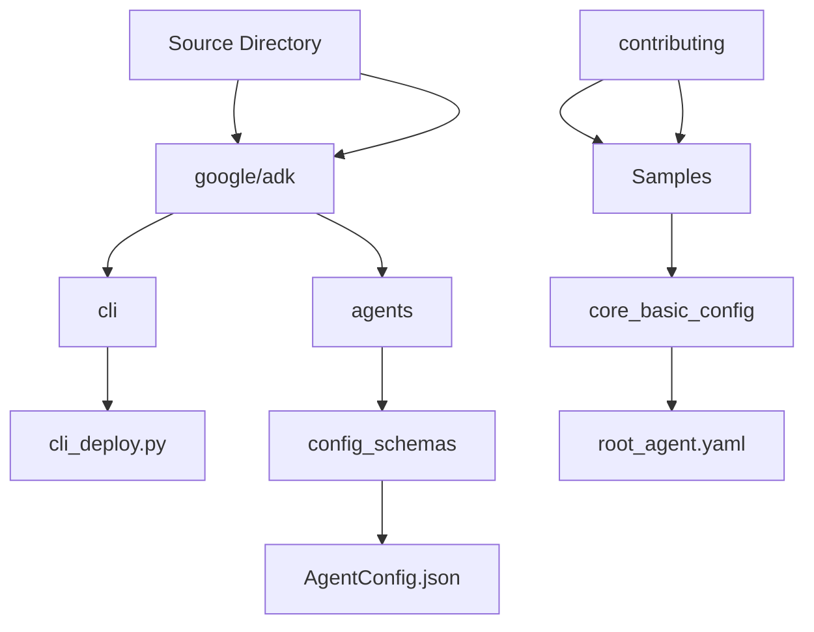
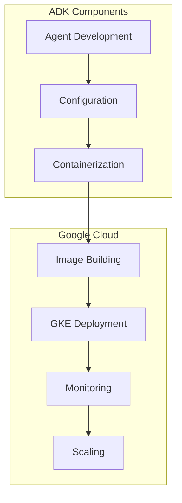
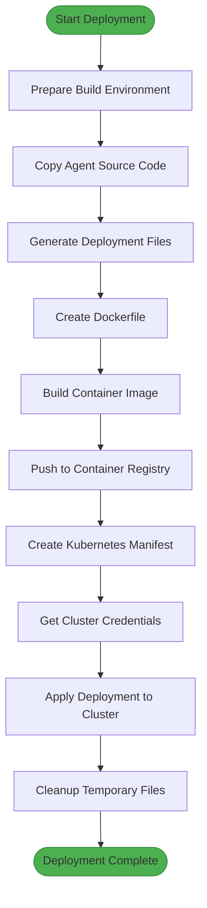
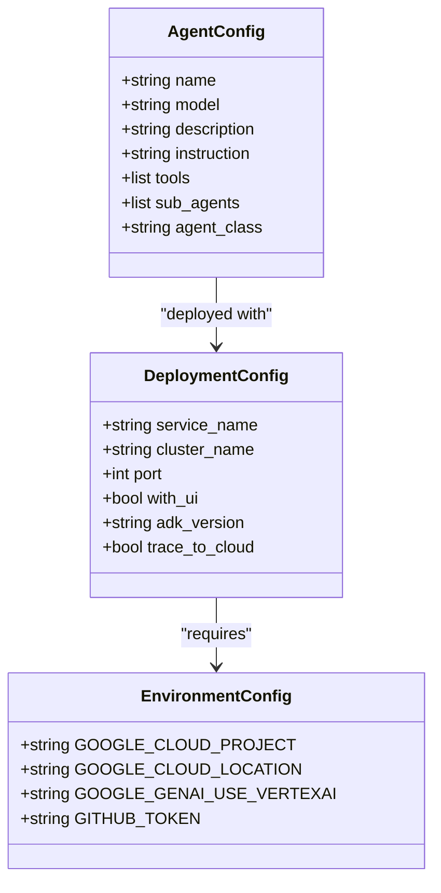
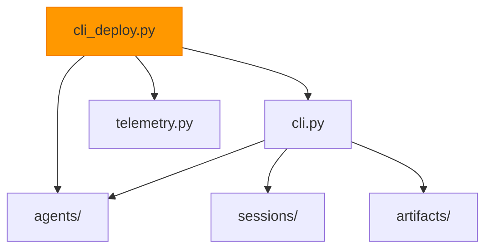

# Google Kubernetes Engine

<cite>
**Referenced Files in This Document**   
- [cli_deploy.py](file://src/google/adk/cli/cli_deploy.py)
- [telemetry.py](file://src/google/adk/telemetry.py)
- [agent.py](file://contributing/samples/adk_answering_agent/agent.py)
- [root_agent.yaml](file://contributing/samples/core_basic_config/root_agent.yaml)
- [cli.py](file://src/google/adk/cli/cli.py)
</cite>

## Table of Contents
1. [Introduction](#introduction)
2. [Project Structure](#project-structure)
3. [Core Components](#core-components)
4. [Architecture Overview](#architecture-overview)
5. [Detailed Component Analysis](#detailed-component-analysis)
6. [Dependency Analysis](#dependency-analysis)
7. [Performance Considerations](#performance-considerations)
8. [Troubleshooting Guide](#troubleshooting-guide)
9. [Conclusion](#conclusion)

## Introduction
This document provides comprehensive guidance for deploying agents to Google Kubernetes Engine (GKE). It covers the implementation details of containerizing agents and orchestrating them within a Kubernetes cluster. The documentation includes configuration requirements for GKE deployments, practical examples using ADK CLI tools, integration with Kubernetes primitives, security considerations, monitoring strategies, and troubleshooting guidance.

## Project Structure
The ADK Python repository contains a comprehensive set of tools and samples for developing and deploying agents. The core functionality for GKE deployment is located in the `src/google/adk/cli/` directory, specifically in the `cli_deploy.py` file which contains the deployment logic for various Google Cloud platforms including GKE.

**Diagram sources**
- [cli_deploy.py](file://src/google/adk/cli/cli_deploy.py)
- [AgentConfig.json](file://src/google/adk/agents/config_schemas/AgentConfig.json)

**Section sources**
- [cli_deploy.py](file://src/google/adk/cli/cli_deploy.py)
- [project_structure](file://project_structure)

## Core Components
The core components for GKE deployment include the ADK CLI deployment module, agent configuration files, and telemetry components. The deployment process is orchestrated through the `to_gke` function in `cli_deploy.py`, which handles the complete workflow from containerization to Kubernetes deployment.

**Section sources**
- [cli_deploy.py](file://src/google/adk/cli/cli_deploy.py#L483-L711)
- [telemetry.py](file://src/google/adk/telemetry.py#L1-L289)

## Architecture Overview
The architecture for deploying agents to GKE follows a structured workflow that begins with agent development and ends with production deployment. The process involves containerization, image building, and Kubernetes orchestration.

**Diagram sources**
- [cli_deploy.py](file://src/google/adk/cli/cli_deploy.py#L483-L711)

## Detailed Component Analysis

### GKE Deployment Component Analysis
The GKE deployment functionality is implemented in the `to_gke` function within the `cli_deploy.py` file. This component handles the complete deployment workflow for agents to Google Kubernetes Engine.

**Diagram sources**
- [cli_deploy.py](file://src/google/adk/cli/cli_deploy.py#L483-L711)

**Section sources**
- [cli_deploy.py](file://src/google/adk/cli/cli_deploy.py#L483-L711)

### Configuration Component Analysis
Agent configuration is managed through YAML files that define agent properties, models, instructions, and tool integrations. The configuration schema is defined in the AgentConfig.json file.

**Diagram sources**
- [root_agent.yaml](file://contributing/samples/core_basic_config/root_agent.yaml)
- [cli_deploy.py](file://src/google/adk/cli/cli_deploy.py)

**Section sources**
- [root_agent.yaml](file://contributing/samples/core_basic_config/root_agent.yaml)
- [AgentConfig.json](file://src/google/adk/agents/config_schemas/AgentConfig.json)

## Dependency Analysis
The GKE deployment functionality depends on several core components within the ADK framework, including the CLI module, agent configuration system, and telemetry components.

**Diagram sources**
- [cli_deploy.py](file://src/google/adk/cli/cli_deploy.py)
- [cli.py](file://src/google/adk/cli/cli.py)

**Section sources**
- [cli_deploy.py](file://src/google/adk/cli/cli_deploy.py)
- [cli.py](file://src/google/adk/cli/cli.py)

## Performance Considerations
When deploying agents to GKE, several performance considerations should be addressed:

1. **Container Optimization**: The Docker image is based on python:3.11-slim to minimize size
2. **Resource Management**: Proper configuration of memory and CPU limits in Kubernetes
3. **Scaling**: Implementation of HorizontalPodAutoscalers for dynamic scaling
4. **Caching**: Utilization of appropriate caching strategies for agent responses
5. **Network**: Optimization of network policies and service configurations

The deployment process includes built-in support for Cloud Trace integration, which can be enabled via the `trace_to_cloud` parameter to monitor performance metrics.

## Troubleshooting Guide
Common issues when deploying agents to GKE and their solutions:

1. **Image Build Failures**: Ensure all dependencies are properly specified in requirements.txt
2. **Cluster Access Issues**: Verify proper IAM permissions and cluster credentials
3. **Service Connectivity**: Check firewall rules and network policies
4. **Resource Constraints**: Monitor and adjust CPU and memory limits as needed
5. **Authentication Problems**: Validate service account configurations and workload identity setup

The deployment process includes comprehensive logging and cleanup procedures to assist with troubleshooting.

**Section sources**
- [cli_deploy.py](file://src/google/adk/cli/cli_deploy.py#L483-L711)
- [telemetry.py](file://src/google/adk/telemetry.py#L1-L289)

## Conclusion
Deploying agents to Google Kubernetes Engine using the ADK framework provides a robust and scalable solution for agent orchestration. The deployment process is well-structured, with clear separation of concerns between configuration, containerization, and orchestration components. By following the documented patterns and best practices, developers can effectively deploy and manage agents in production environments.