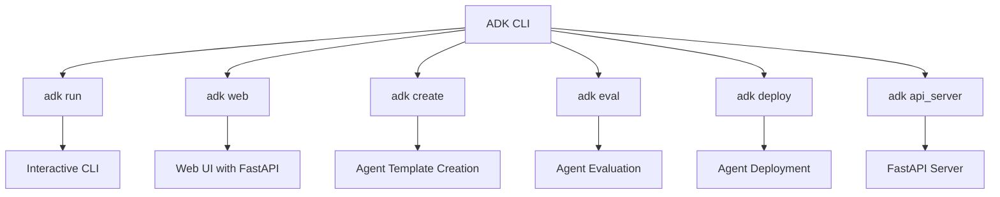
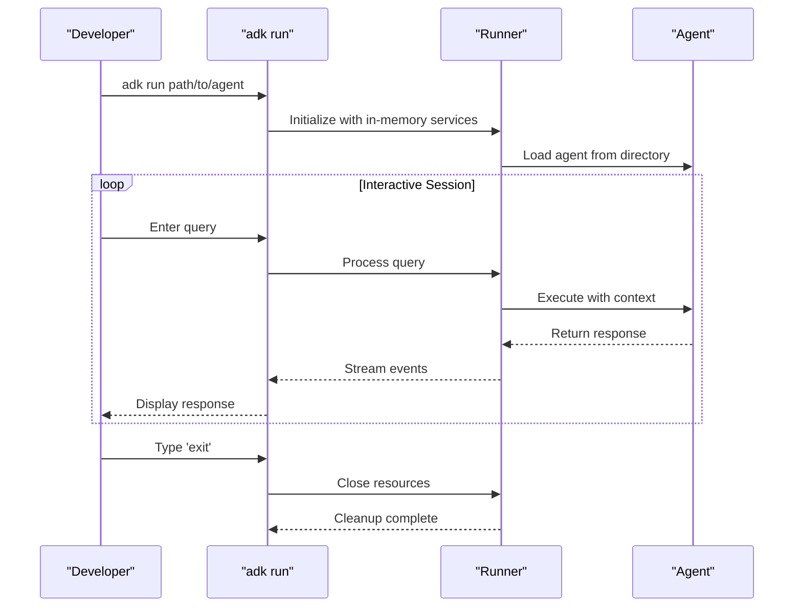
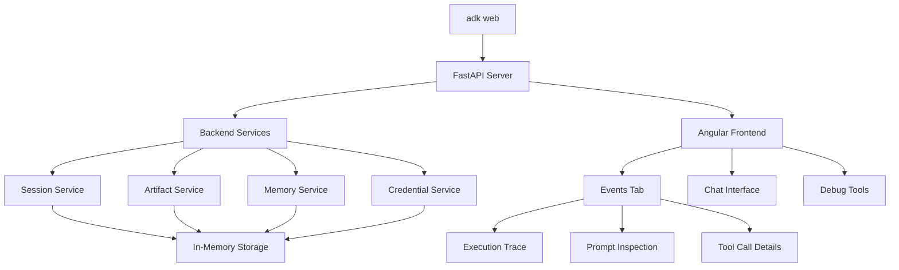
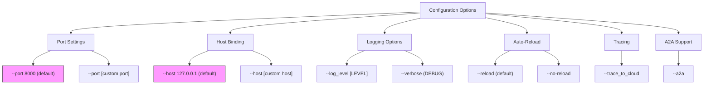
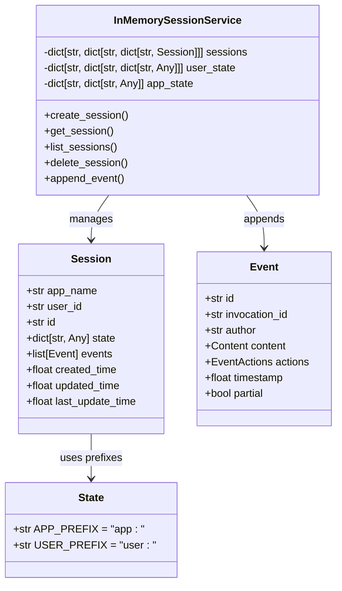
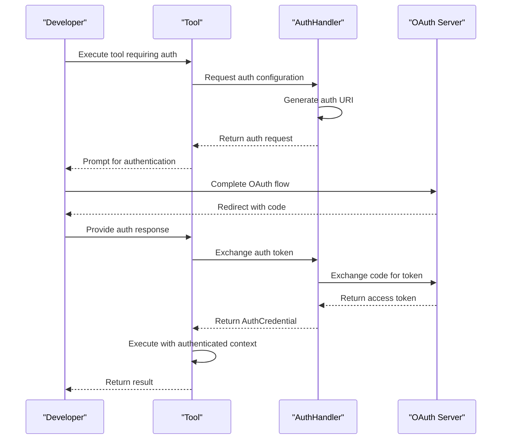

# Local Development

<cite>
**Referenced Files in This Document**   
- [cli.py](file://src/google/adk/cli/cli.py)
- [adk_web_server.py](file://src/google/adk/cli/adk_web_server.py)
- [fast_api.py](file://src/google/adk/cli/fast_api.py)
- [cli_tools_click.py](file://src/google/adk/cli/cli_tools_click.py)
- [envs.py](file://src/google/adk/cli/utils/envs.py)
- [runners.py](file://src/google/adk/runners.py)
- [in_memory_session_service.py](file://src/google/adk/sessions/in_memory_session_service.py)
- [auth_handler.py](file://src/google/adk/auth/auth_handler.py)
- [base_tool.py](file://src/google/adk/tools/base_tool.py)
- [contributing/adk_project_overview_and_architecture.md](file://contributing/adk_project_overview_and_architecture.md)
- [contributing/samples/spec_kit_integration/PORT_CONFIGURATION.md](file://contributing/samples/spec_kit_integration/PORT_CONFIGURATION.md)
- [run_openspec.sh](file://run_openspec.sh)
- [run_spec_kit.sh](file://run_spec_kit.sh)
- [run_mt_simics_agent.sh](file://run_mt_simics_agent.sh)
- [view_session.py](file://view_session.py)
</cite>

## Table of Contents
1. [Introduction](#introduction)
2. [ADK CLI Commands Overview](#adk-cli-commands-overview)
3. [Running Agents Locally with adk run](#running-agents-locally-with-adk-run)
4. [Starting Local Web Server with adk web](#starting-local-web-server-with-adk-web)
5. [Configuration Options for Local Execution](#configuration-options-for-local-execution)
6. [Session Management and State Persistence](#session-management-and-state-persistence)
7. [Tool Execution and Authentication Setup](#tool-execution-and-authentication-setup)
8. [Troubleshooting Common Local Development Issues](#troubleshooting-common-local-development-issues)
9. [Conclusion](#conclusion)

## Introduction
The Agent Development Kit (ADK) provides comprehensive tools for developing, testing, and deploying agents in local development environments. This document details the implementation and usage of ADK CLI tools for running agents locally, focusing on the `adk run` and `adk web` commands. The ADK framework enables developers to create interactive agent applications with support for session management, tool execution, and authentication flows. The local development environment is designed to be accessible to beginners while providing sufficient technical depth for experienced developers to optimize their workflows. The system architecture separates the backend FastAPI server from the frontend Angular application, allowing for flexible debugging and testing approaches.

**Section sources**
- [contributing/adk_project_overview_and_architecture.md](file://contributing/adk_project_overview_and_architecture.md#L27-L70)

## ADK CLI Commands Overview
The ADK CLI provides several commands for agent development and deployment, with `adk run` and `adk web` being the primary tools for local development. The `adk run` command enables quick, stateless functional checks in the terminal, while `adk web` provides an interactive UI for comprehensive debugging. Both commands are implemented in the `cli_tools_click.py` file using the Click framework, which provides robust command-line interface functionality. The CLI commands follow a hierarchical structure with the main command group containing subcommands for different operations such as create, run, eval, and deploy. The `HelpfulCommand` class enhances the user experience by displaying full help text when required arguments are missing, improving discoverability and reducing the learning curve for new users.

**Diagram sources**
- [src/google/adk/cli/cli_tools_click.py](file://src/google/adk/cli/cli_tools_click.py#L116-L119)

**Section sources**
- [src/google/adk/cli/cli_tools_click.py](file://src/google/adk/cli/cli_tools_click.py#L109-L113)

## Running Agents Locally with adk run
The `adk run` command provides a terminal-based interface for interacting with agents during local development. This command is implemented in the `cli_run` function in `cli_tools_click.py` and serves as a lightweight alternative to the web interface for quick testing and debugging. When executed, the command initializes a runner with in-memory services for artifacts, sessions, and credentials, creating an isolated environment for agent execution. The `run_cli` function in `cli.py` handles the core logic, supporting three interaction modes: interactive mode for real-time conversation, replay mode for testing with predefined inputs, and resume mode for continuing from a saved session. The command processes user input and displays both user queries and agent responses with appropriate prefixes, providing clear visibility into the conversation flow.

**Diagram sources**
- [src/google/adk/cli/cli_tools_click.py](file://src/google/adk/cli/cli_tools_click.py#L202-L281)
- [src/google/adk/cli/cli.py](file://src/google/adk/cli/cli.py#L122-L218)

**Section sources**
- [src/google/adk/cli/cli_tools_click.py](file://src/google/adk/cli/cli_tools_click.py#L202-L281)
- [src/google/adk/cli/cli.py](file://src/google/adk/cli/cli.py#L122-L218)

## Starting Local Web Server with adk web
The `adk web` command launches a FastAPI server with an integrated web UI for comprehensive agent debugging and testing. This command is implemented as a Click command in `cli_tools_click.py` and uses the `get_fast_api_app` function from `fast_api.py` to create the FastAPI application. The web server provides a decoupled system with a backend FastAPI server and a frontend Angular application that connects to the backend. The server exposes standard endpoints such as `/list-apps` and `/run_sse` for streaming responses, with the wire format using camelCase. The web interface includes an "Events" tab that allows developers to inspect the full execution trace, including prompts, tool calls, and responses, providing deep visibility into the agent's behavior. The server supports CORS configuration through the `--allow_origins` option, enabling cross-origin requests from specified domains.

**Diagram sources**
- [src/google/adk/cli/cli_tools_click.py](file://src/google/adk/cli/cli_tools_click.py#L706-L793)
- [src/google/adk/cli/fast_api.py](file://src/google/adk/cli/fast_api.py#L56-L387)

**Section sources**
- [src/google/adk/cli/cli_tools_click.py](file://src/google/adk/cli/cli_tools_click.py#L706-L793)
- [src/google/adk/cli/fast_api.py](file://src/google/adk/cli/fast_api.py#L56-L387)
- [contributing/adk_project_overview_and_architecture.md](file://contributing/adk_project_overview_and_architecture.md#L50-L57)

## Configuration Options for Local Execution
The ADK CLI provides extensive configuration options for customizing local execution behavior. These options are implemented as Click decorators and parameters in `cli_tools_click.py`, allowing developers to fine-tune the runtime environment. Key configuration options include port settings through the `--port` parameter (default: 8000), host binding with `--host` (default: 127.0.0.1), and logging level control via `--log_level` or the shorthand `--verbose`. The `--reload` option enables auto-reload functionality, automatically restarting the server when agent code changes are detected, which is particularly useful during active development. For debugging purposes, the `--trace_to_cloud` option enables OpenTelemetry tracing, allowing developers to monitor agent execution and performance metrics. The web server also supports A2A (Agent-to-Agent) endpoints when the `--a2a` flag is enabled, facilitating multi-agent system development and testing.

**Diagram sources**
- [src/google/adk/cli/cli_tools_click.py](file://src/google/adk/cli/cli_tools_click.py#L614-L703)

**Section sources**
- [src/google/adk/cli/cli_tools_click.py](file://src/google/adk/cli/cli_tools_click.py#L614-L703)

## Session Management and State Persistence
The ADK framework provides robust session management capabilities for maintaining conversation state across interactions. The `InMemorySessionService` class implements an in-memory session store suitable for local development and testing, using nested dictionaries to organize sessions by application name, user ID, and session ID. Each session contains a state dictionary that can store arbitrary key-value pairs, enabling developers to maintain context across multiple interactions. The `adk run` command supports session persistence through the `--save_session` and `--session_id` options, allowing developers to save and resume conversations. When a session is saved, it is serialized to a JSON file with a `.session.json` extension, containing all session metadata, events, and state information. The `view_session.py` utility script provides functionality to inspect saved session files, displaying conversation history and metadata in a human-readable format.

**Diagram sources**
- [src/google/adk/sessions/in_memory_session_service.py](file://src/google/adk/sessions/in_memory_session_service.py#L35-L304)
- [src/google/adk/sessions/session.py](file://src/google/adk/sessions/session.py)
- [src/google/adk/events/event.py](file://src/google/adk/events/event.py)

**Section sources**
- [src/google/adk/sessions/in_memory_session_service.py](file://src/google/adk/sessions/in_memory_session_service.py#L35-L304)
- [run_openspec.sh](file://run_openspec.sh#L1087-L1098)
- [view_session.py](file://view_session.py#L101-L359)

## Tool Execution and Authentication Setup
The ADK framework supports tool execution and authentication flows through a modular architecture implemented in the tools and auth packages. The `BaseTool` class serves as the foundation for all tools, defining the interface for tool execution and LLM request processing. Tools can be long-running operations that return resource IDs and complete asynchronously, or they can provide immediate results. The authentication system is implemented in the `auth_handler.py` file, with the `AuthHandler` class managing the OAuth2 flow for credential exchange. The handler generates authentication requests with appropriate URIs and state parameters, and processes authentication responses to obtain access tokens. Environment variables play a crucial role in authentication setup, with scripts like `setup_env.sh` guiding developers to set required variables such as `GITHUB_TOKEN` and `IFLOW_API_KEY`. The framework also supports configurable ports for MCP (Model Control Plane) servers, which is particularly important for WSL2 environments where the default port (8051) may have socket binding issues.

**Diagram sources**
- [src/google/adk/tools/base_tool.py](file://src/google/adk/tools/base_tool.py#L47-L213)
- [src/google/adk/auth/auth_handler.py](file://src/google/adk/auth/auth_handler.py#L38-L199)
- [contributing/samples/spec_kit_integration/PORT_CONFIGURATION.md](file://contributing/samples/spec_kit_integration/PORT_CONFIGURATION.md#L1-L176)

**Section sources**
- [src/google/adk/tools/base_tool.py](file://src/google/adk/tools/base_tool.py#L47-L213)
- [src/google/adk/auth/auth_handler.py](file://src/google/adk/auth/auth_handler.py#L38-L199)
- [setup_env.sh](file://setup_env.sh#L190-L195)
- [contributing/samples/spec_kit_integration/PORT_CONFIGURATION.md](file://contributing/samples/spec_kit_integration/PORT_CONFIGURATION.md#L1-L176)

## Troubleshooting Common Local Development Issues
Developers may encounter several common issues when working with the ADK in local environments, including dependency conflicts, port collisions, and authentication setup problems. Dependency conflicts can occur when required packages are missing or version mismatches exist; these can be resolved by ensuring the virtual environment is properly set up with `uv pip install -e .` as shown in `setup_env.sh`. Port collisions happen when the specified port is already in use, which can be addressed by using a different port number or ensuring the previous server instance has fully terminated. Authentication setup issues often stem from missing environment variables or incorrect OAuth configurations; developers should verify that all required environment variables are set and that the OAuth client configuration matches the service provider's requirements. For WSL2 users, socket binding issues with the default MCP server port (8051) can be mitigated by using a custom port via the `--port` option in scripts like `run_spec_kit_phased.sh`. Connection errors may also occur if the session service URI is incorrectly configured, so developers should validate their service URIs against the supported formats documented in the CLI help text.

**Section sources**
- [setup_env.sh](file://setup_env.sh#L166-L195)
- [run_spec_kit.sh](file://run_spec_kit.sh#L76-L125)
- [run_openspec.sh](file://run_openspec.sh#L414-L446)
- [contributing/samples/spec_kit_integration/PORT_CONFIGURATION.md](file://contributing/samples/spec_kit_integration/PORT_CONFIGURATION.md#L81-L104)

## Conclusion
The ADK provides a comprehensive set of tools for local agent development, with the `adk run` and `adk web` commands serving as the primary interfaces for testing and debugging. The framework's modular architecture, with separate services for sessions, artifacts, memory, and credentials, enables flexible configuration and easy extension. The integration of FastAPI for the backend and Angular for the frontend creates a powerful development environment with rich debugging capabilities. By understanding the configuration options, session management features, and tool execution patterns, developers can effectively leverage the ADK for both simple agent testing and complex multi-agent system development. The troubleshooting guidance provided addresses common local development challenges, helping developers overcome obstacles related to dependencies, port conflicts, and authentication setup. As the framework continues to evolve, these local development tools will remain essential for building and refining agent applications before deployment to production environments.