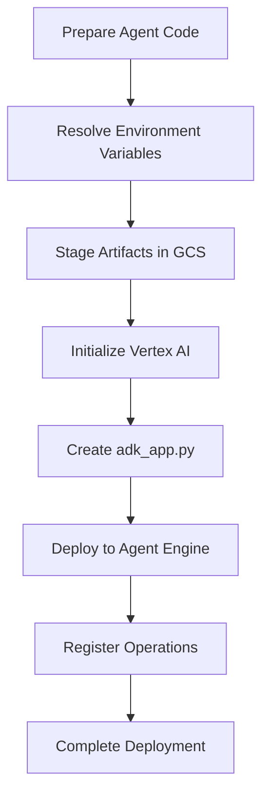
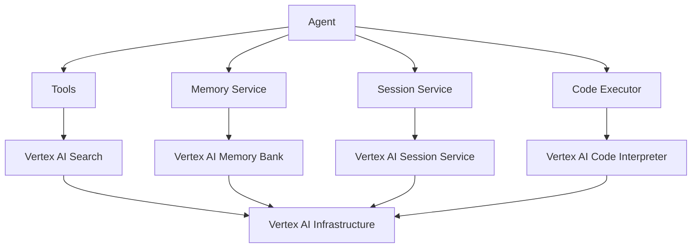

# Vertex AI Agent Engine

<cite>
**Referenced Files in This Document**   
- [cli_deploy.py](file://src/google/adk/cli/cli_deploy.py)
- [vertex_ai_code_executor.py](file://src/google/adk/code_executors/vertex_ai_code_executor.py)
- [vertex_ai_memory_bank_service.py](file://src/google/adk/memory/vertex_ai_memory_bank_service.py)
- [vertex_ai_session_service.py](file://src/google/adk/sessions/vertex_ai_session_service.py)
- [vertex_ai_search_tool.py](file://src/google/adk/tools/vertex_ai_search_tool.py)
- [settings.py](file://contributing/samples/adk_answering_agent/settings.py)
- [agent.py](file://contributing/samples/adk_answering_agent/agent.py)
- [README.md](file://contributing/samples/adk_answering_agent/README.md)
</cite>

## Table of Contents
1. [Introduction](#introduction)
2. [Configuration for Vertex AI Integration](#configuration-for-vertex-ai-integration)
3. [Deployment Workflow with ADK CLI](#deployment-workflow-with-adk-cli)
4. [Agent Components and Vertex AI Infrastructure](#agent-components-and-vertex-ai-infrastructure)
5. [Common Deployment Issues](#common-deployment-issues)
6. [Performance and Cost Optimization](#performance-and-cost-optimization)
7. [Monitoring and Debugging](#monitoring-and-debugging)
8. [Conclusion](#conclusion)

## Introduction
This document provides comprehensive guidance on deploying agents to Vertex AI Agent Engine using the ADK (Agent Development Kit) framework. It covers the complete deployment lifecycle, from configuration and deployment to monitoring and optimization. The document focuses on the specific requirements and workflows for Vertex AI integration, highlighting the differences from other deployment targets such as Cloud Run and GKE. The content is designed to help developers understand how to configure agents for Vertex AI, manage deployment versions, and leverage Vertex AI's managed infrastructure for agent components like tools, memory, and session management.

## Configuration for Vertex AI Integration

This section details the implementation of configuring agents for Vertex AI integration, including model specification, compute resources, and networking requirements.

### Model Specification and Environment Configuration
Configuring agents for Vertex AI requires specific environment variables and model specifications. The deployment process uses these configurations to establish the connection between the agent and Vertex AI services. Key environment variables include:

- `GOOGLE_GENAI_USE_VERTEXAI=TRUE`: Enables Vertex AI authentication
- `GOOGLE_CLOUD_PROJECT`: Specifies the Google Cloud project ID
- `GOOGLE_CLOUD_LOCATION`: Defines the Google Cloud region
- `VERTEXAI_DATASTORE_ID`: Identifies the full Vertex AI datastore ID for the document store

These variables are typically set in a `.env` file or passed directly to the deployment command. The model configuration is specified in the agent definition, with supported models including `gemini-2.5-pro` and other Gemini series models.

### Compute Resources and Networking
Vertex AI Agent Engine manages compute resources automatically, but developers can influence resource allocation through deployment parameters. The networking configuration is handled by Vertex AI, with the agent engine exposed through a secure endpoint. The deployment process creates the necessary network configurations, including firewall rules and access controls, based on the project and location settings.

**Section sources**
- [cli_deploy.py](file://src/google/adk/cli/cli_deploy.py#L262-L481)
- [settings.py](file://contributing/samples/adk_answering_agent/settings.py#L15-L45)
- [README.md](file://contributing/samples/adk_answering_agent/README.md#L90-L106)

## Deployment Workflow with ADK CLI

This section documents the deployment workflow using the ADK CLI tools, highlighting the differences from other deployment targets.

### ADK CLI Deployment Process
The ADK CLI provides a streamlined workflow for deploying agents to Vertex AI Agent Engine. The process involves several key steps:

1. **Agent Preparation**: The agent code is packaged with its dependencies and configuration files
2. **Environment Setup**: Required environment variables are resolved from the `.env` file or command-line parameters
3. **Artifact Staging**: Deployment artifacts are staged in a GCS bucket
4. **Agent Engine Creation**: The Vertex AI Agent Engine is created or updated with the new agent version

The `to_agent_engine` function in the CLI handles this workflow, managing the entire deployment process from start to finish.

### Differences from Other Deployment Targets
The deployment workflow for Vertex AI differs significantly from other targets like Cloud Run and GKE:

- **Managed Infrastructure**: Vertex AI handles all infrastructure management, unlike Cloud Run and GKE where developers manage the underlying platform
- **Simplified Configuration**: The deployment process requires fewer configuration parameters compared to GKE
- **Integrated Services**: Vertex AI provides integrated services for memory, session management, and artifact storage
- **Version Management**: Agent versions are managed automatically by Vertex AI, with built-in support for version rollback and comparison

The deployment process creates an `adk_app.py` file that serves as the entry point for the agent engine, configuring the agent with the necessary services and parameters.

**Diagram sources **
- [cli_deploy.py](file://src/google/adk/cli/cli_deploy.py#L262-L481)

**Section sources**
- [cli_deploy.py](file://src/google/adk/cli/cli_deploy.py#L262-L481)

## Agent Components and Vertex AI Infrastructure

This section explains the relationship between the agent's components (tools, memory, session management) and Vertex AI's managed infrastructure.

### Tools Integration
Agents can leverage various tools that integrate with Vertex AI services. The `VertexAiSearchTool` enables agents to search knowledge bases stored in Vertex AI Search, while the `VertexAiCodeExecutor` allows code execution using Vertex AI's code interpreter extension. These tools are configured with specific parameters such as data store IDs and resource names, enabling seamless integration with Vertex AI services.

### Memory and Session Management
Vertex AI provides managed services for memory and session management, which are accessed through dedicated service classes:

- `VertexAiMemoryBankService`: Implements memory storage and retrieval using Vertex AI Memory Bank
- `VertexAiSessionService`: Manages agent sessions through Vertex AI's session service API

These services handle the persistence and retrieval of agent state, conversation history, and user context, allowing agents to maintain continuity across interactions.

### Component Architecture
The agent components work together within the Vertex AI infrastructure to provide a cohesive experience:

**Diagram sources **
- [vertex_ai_search_tool.py](file://src/google/adk/tools/vertex_ai_search_tool.py#L32-L117)
- [vertex_ai_memory_bank_service.py](file://src/google/adk/memory/vertex_ai_memory_bank_service.py#L38-L165)
- [vertex_ai_session_service.py](file://src/google/adk/sessions/vertex_ai_session_service.py#L48-L494)
- [vertex_ai_code_executor.py](file://src/google/adk/code_executors/vertex_ai_code_executor.py#L106-L239)

**Section sources**
- [vertex_ai_search_tool.py](file://src/google/adk/tools/vertex_ai_search_tool.py#L32-L117)
- [vertex_ai_memory_bank_service.py](file://src/google/adk/memory/vertex_ai_memory_bank_service.py#L38-L165)
- [vertex_ai_session_service.py](file://src/google/adk/sessions/vertex_ai_session_service.py#L48-L494)
- [vertex_ai_code_executor.py](file://src/google/adk/code_executors/vertex_ai_code_executor.py#L106-L239)

## Common Deployment Issues

This section addresses common issues such as deployment timeouts, resource quota limitations, and compatibility requirements.

### Deployment Timeouts
Deployment timeouts can occur during the agent engine creation process, particularly when using the Long-Running Operation (LRO) pattern. The `VertexAiSessionService` includes retry logic with exponential backoff to handle transient failures during session creation. Developers should ensure that their deployment environment has sufficient network connectivity and that the Vertex AI APIs are accessible.

### Resource Quota Limitations
Resource quotas can limit the number of agent engines, sessions, or API calls that can be made. Developers should monitor their project's quota usage and request increases if necessary. The deployment process automatically handles some quota-related errors by retrying failed operations.

### Compatibility Requirements
Agents must meet specific compatibility requirements to work with Vertex AI Agent Engine:

- Python 3.11 runtime
- Specific versions of the ADK and Vertex AI client libraries
- Properly formatted agent configuration files
- Valid service account permissions

The deployment process validates these requirements before proceeding with the deployment.

**Section sources**
- [vertex_ai_session_service.py](file://src/google/adk/sessions/vertex_ai_session_service.py#L121-L167)
- [cli_deploy.py](file://src/google/adk/cli/cli_deploy.py#L356-L364)

## Performance and Cost Optimization

This section provides best practices for optimizing performance and cost when running agents on Vertex AI.

### Performance Optimization
To optimize agent performance on Vertex AI:

- Use efficient model configurations with appropriate temperature and token limits
- Implement caching for frequently accessed data
- Optimize tool usage to minimize external API calls
- Use streaming responses when appropriate to reduce latency

The `VertexAiCodeExecutor` includes built-in optimizations for code execution, such as pre-loading commonly used libraries and optimizing file handling.

### Cost Optimization
To minimize costs when running agents on Vertex AI:

- Use appropriate model sizes for the task complexity
- Implement session timeouts to free up resources
- Monitor and optimize API usage
- Use batch processing when possible to reduce the number of API calls

Developers should also consider the cost implications of different deployment configurations and choose the most cost-effective options for their use case.

**Section sources**
- [vertex_ai_code_executor.py](file://src/google/adk/code_executors/vertex_ai_code_executor.py#L37-L86)
- [cli_deploy.py](file://src/google/adk/cli/cli_deploy.py#L207-L223)

## Monitoring and Debugging

This section provides guidance for monitoring and debugging deployed agents using Vertex AI's observability tools.

### Logging and Monitoring
Vertex AI provides comprehensive logging and monitoring capabilities for deployed agents. The agent framework includes built-in logging that captures important events and errors. Developers can use Cloud Logging to monitor agent activity and troubleshoot issues.

The deployment process supports trace collection with the `trace_to_cloud` parameter, which enables Cloud Trace integration for detailed performance monitoring.

### Debugging Strategies
Effective debugging strategies for Vertex AI agents include:

- Using the ADK CLI to test agents locally before deployment
- Monitoring logs for error messages and warnings
- Using the session service to inspect agent state and conversation history
- Testing tools individually to isolate issues

The framework includes error handling and retry logic for common failure scenarios, helping to improve agent reliability.

**Section sources**
- [cli_deploy.py](file://src/google/adk/cli/cli_deploy.py#L269-L270)
- [vertex_ai_session_service.py](file://src/google/adk/sessions/vertex_ai_session_service.py#L322-L324)

## Conclusion
Deploying agents to Vertex AI Agent Engine using the ADK framework provides a streamlined and efficient process for creating intelligent agents. The integration with Vertex AI's managed infrastructure simplifies many aspects of agent development and deployment, from configuration and deployment to monitoring and optimization. By following the guidelines and best practices outlined in this document, developers can create robust and efficient agents that leverage the full capabilities of Vertex AI. The ADK CLI tools provide a consistent interface for deployment across different targets, while the Vertex AI integration offers enhanced features for memory, session management, and tool integration. As the agent ecosystem continues to evolve, these tools and practices will help developers create increasingly sophisticated and capable agents.