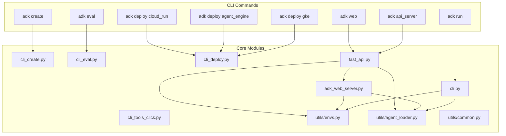
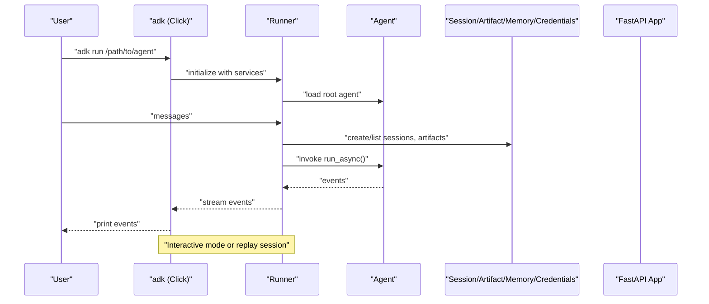
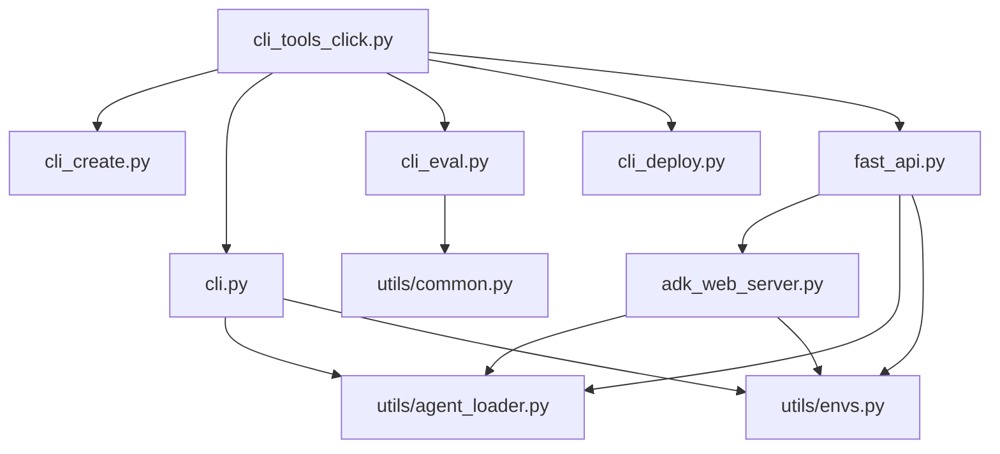

# CLI Interface

<cite>
**Referenced Files in This Document**
- [README.md](file://README.md)
- [src/google/adk/cli/__init__.py](file://src/google/adk/cli/__init__.py)
- [src/google/adk/cli/cli.py](file://src/google/adk/cli/cli.py)
- [src/google/adk/cli/cli_tools_click.py](file://src/google/adk/cli/cli_tools_click.py)
- [src/google/adk/cli/cli_create.py](file://src/google/adk/cli/cli_create.py)
- [src/google/adk/cli/cli_deploy.py](file://src/google/adk/cli/cli_deploy.py)
- [src/google/adk/cli/cli_eval.py](file://src/google/adk/cli/cli_eval.py)
- [src/google/adk/cli/fast_api.py](file://src/google/adk/cli/fast_api.py)
- [src/google/adk/cli/adk_web_server.py](file://src/google/adk/cli/adk_web_server.py)
- [src/google/adk/cli/utils/envs.py](file://src/google/adk/cli/utils/envs.py)
- [src/google/adk/cli/utils/agent_loader.py](file://src/google/adk/cli/utils/agent_loader.py)
- [src/google/adk/cli/utils/common.py](file://src/google/adk/cli/utils/common.py)
</cite>

## Table of Contents
1. [Introduction](#introduction)
2. [Project Structure](#project-structure)
3. [Core Components](#core-components)
4. [Architecture Overview](#architecture-overview)
5. [Detailed Component Analysis](#detailed-component-analysis)
6. [Dependency Analysis](#dependency-analysis)
7. [Performance Considerations](#performance-considerations)
8. [Troubleshooting Guide](#troubleshooting-guide)
9. [Conclusion](#conclusion)
10. [Appendices](#appendices)

## Introduction
This document provides comprehensive API documentation for the ADK Command Line Interface (CLI). It covers all available commands, their syntax, parameters, configuration options, and expected outputs. It also explains how the CLI integrates with the runner system and agent configuration files, documents environment variable configuration, and provides troubleshooting guidance for common issues such as authentication setup, deployment failures, and evaluation errors. Finally, it includes performance considerations and best practices for CI/CD integration.

## Project Structure
The CLI is organized around a central Click group with subcommands for creating agents, running agents locally, evaluating agents, and deploying agents to various platforms. Supporting modules handle agent loading, environment configuration, web server integration, and deployment workflows.

**Diagram sources**
- [src/google/adk/cli/cli_tools_click.py](file://src/google/adk/cli/cli_tools_click.py#L1-L1336)
- [src/google/adk/cli/cli.py](file://src/google/adk/cli/cli.py#L1-L218)
- [src/google/adk/cli/cli_create.py](file://src/google/adk/cli/cli_create.py#L1-L330)
- [src/google/adk/cli/cli_eval.py](file://src/google/adk/cli/cli_eval.py#L1-L359)
- [src/google/adk/cli/cli_deploy.py](file://src/google/adk/cli/cli_deploy.py#L1-L711)
- [src/google/adk/cli/fast_api.py](file://src/google/adk/cli/fast_api.py#L1-L387)
- [src/google/adk/cli/adk_web_server.py](file://src/google/adk/cli/adk_web_server.py#L1-L1100)
- [src/google/adk/cli/utils/envs.py](file://src/google/adk/cli/utils/envs.py#L1-L55)
- [src/google/adk/cli/utils/agent_loader.py](file://src/google/adk/cli/utils/agent_loader.py#L1-L231)
- [src/google/adk/cli/utils/common.py](file://src/google/adk/cli/utils/common.py#L1-L24)

**Section sources**
- [src/google/adk/cli/__init__.py](file://src/google/adk/cli/__init__.py#L1-L16)
- [src/google/adk/cli/cli_tools_click.py](file://src/google/adk/cli/cli_tools_click.py#L1-L1336)
- [README.md](file://README.md#L1-L158)

## Core Components
- CLI entrypoint and command groups: The CLI is defined as a Click group with subcommands for create, run, eval, web, api_server, and deploy subcommands.
- Agent loading and environment configuration: Utilities load agent modules and .env files, and support YAML-based agent configs.
- Web server integration: FastAPI app construction and endpoint registration for local development UI and runtime APIs.
- Deployment workflows: Helpers to generate Dockerfiles, stage artifacts, and deploy to Cloud Run, Vertex AI Agent Engine, and GKE.

Key responsibilities:
- adk create: scaffolds agent templates with code or YAML configuration, prompts for model/backend selection, and writes .env files.
- adk run: runs agents interactively or replays saved sessions, with optional session persistence.
- adk eval: executes evaluation test suites against agents and prints summaries.
- adk web/api_server: starts a FastAPI server with optional UI and A2A endpoints.
- adk deploy: deploys agents to Cloud Run, Agent Engine, or GKE with configurable services and options.

**Section sources**
- [src/google/adk/cli/cli_tools_click.py](file://src/google/adk/cli/cli_tools_click.py#L1-L1336)
- [src/google/adk/cli/cli.py](file://src/google/adk/cli/cli.py#L1-L218)
- [src/google/adk/cli/cli_create.py](file://src/google/adk/cli/cli_create.py#L1-L330)
- [src/google/adk/cli/cli_eval.py](file://src/google/adk/cli/cli_eval.py#L1-L359)
- [src/google/adk/cli/cli_deploy.py](file://src/google/adk/cli/cli_deploy.py#L1-L711)
- [src/google/adk/cli/fast_api.py](file://src/google/adk/cli/fast_api.py#L1-L387)
- [src/google/adk/cli/adk_web_server.py](file://src/google/adk/cli/adk_web_server.py#L1-L1100)
- [src/google/adk/cli/utils/envs.py](file://src/google/adk/cli/utils/envs.py#L1-L55)
- [src/google/adk/cli/utils/agent_loader.py](file://src/google/adk/cli/utils/agent_loader.py#L1-L231)
- [src/google/adk/cli/utils/common.py](file://src/google/adk/cli/utils/common.py#L1-L24)

## Architecture Overview
The CLI orchestrates agent execution and deployment through a runner system and service abstractions. The web server integrates with the same runner and services to expose runtime endpoints and a development UI.

**Diagram sources**
- [src/google/adk/cli/cli.py](file://src/google/adk/cli/cli.py#L1-L218)
- [src/google/adk/cli/adk_web_server.py](file://src/google/adk/cli/adk_web_server.py#L1-L1100)
- [src/google/adk/cli/fast_api.py](file://src/google/adk/cli/fast_api.py#L1-L387)

## Detailed Component Analysis

### adk create
Purpose: Scaffold a new agent project with either a code-based agent or a YAML-based agent configuration. Prompts for model/backend selection and writes .env with appropriate variables.

Syntax
- adk create [--model MODEL] [--api_key API_KEY] [--project PROJECT] [--region REGION] [--type TYPE] APP_NAME

Parameters
- APP_NAME: Required. Name of the agent directory to create.
- --model MODEL: Optional. Model identifier for the agent.
- --api_key API_KEY: Optional. API key for Google AI backend.
- --project PROJECT: Optional. Google Cloud project for Vertex AI backend.
- --region REGION: Optional. Google Cloud region for Vertex AI backend.
- --type TYPE: Optional. Agent type ("CODE" or "CONFIG"). Defaults to "CODE".

Behavior
- Creates a new directory named APP_NAME in the current working directory.
- Generates files: __init__.py, agent.py (code agent), or root_agent.yaml (config agent), and .env.
- Writes .env with GOOGLE_GENAI_USE_VERTEXAI, GOOGLE_API_KEY, GOOGLE_CLOUD_PROJECT, GOOGLE_CLOUD_LOCATION depending on backend selection.
- Prompts for backend selection if model starts with "gemini" and no explicit credentials are provided.

Expected output
- Confirmation messages indicating successful creation and files generated.

Practical examples
- Create a code-based agent with a specific model and API key.
- Create a YAML-based agent with Vertex AI backend and project/region.

Notes
- The "CONFIG" type is marked experimental and may change.

**Section sources**
- [src/google/adk/cli/cli_tools_click.py](file://src/google/adk/cli/cli_tools_click.py#L120-L183)
- [src/google/adk/cli/cli_create.py](file://src/google/adk/cli/cli_create.py#L1-L330)

### adk run
Purpose: Run an agent interactively or replay a saved session. Supports saving sessions on exit.

Syntax
- adk run [--save_session] [--session_id SESSION_ID] [--replay JSON_FILE] [--resume JSON_FILE] AGENT

Parameters
- AGENT: Required. Path to the agent source code folder.
- --save_session: Optional. Save the session to a JSON file on exit.
- --session_id SESSION_ID: Optional. Session ID to save when --save_session is set.
- --replay JSON_FILE: Optional. JSON file containing initial state and queries to replay.
- --resume JSON_FILE: Optional. JSON file of a previously saved session to resume.

Behavior
- Loads agent using AgentLoader and environment variables from .env.
- If --replay is provided, loads initial state and runs queries against a new session.
- If --resume is provided, replays a saved session and continues interacting.
- Otherwise, starts an interactive session with user input until "exit".
- Optionally saves the session to a .session.json file.

Expected output
- Interactive chat with agent events printed to stdout.
- Session saved to disk when requested.

Practical examples
- Run an agent interactively and save the session.
- Replay a test scenario from a JSON file.
- Resume a previous session for continued interaction.

**Section sources**
- [src/google/adk/cli/cli_tools_click.py](file://src/google/adk/cli/cli_tools_click.py#L202-L281)
- [src/google/adk/cli/cli.py](file://src/google/adk/cli/cli.py#L1-L218)
- [src/google/adk/cli/utils/agent_loader.py](file://src/google/adk/cli/utils/agent_loader.py#L1-L231)
- [src/google/adk/cli/utils/envs.py](file://src/google/adk/cli/utils/envs.py#L1-L55)

### adk eval
Purpose: Evaluate agents against evaluation test suites and print summaries.

Syntax
- adk eval [--config_file_path PATH] [--print_detailed_results] [--eval_storage_uri URI] AGENT_MODULE_FILE_PATH EVAL_SET_FILE_PATH_OR_ID...

Parameters
- AGENT_MODULE_FILE_PATH: Required. Path to the agent module directory (containing __init__.py with an "agent" module exposing root_agent).
- EVAL_SET_FILE_PATH_OR_ID: One or more eval set file paths or IDs. Mixing file paths and IDs is not allowed.
- --config_file_path PATH: Optional. Path to evaluation criteria config file (JSON).
- --print_detailed_results: Optional. Print detailed results to console.
- --eval_storage_uri URI: Optional. Storage URI for eval results (e.g., gs://bucket).

Behavior
- Loads the agent root_agent from the agent module.
- Parses eval set identifiers (file paths or IDs) and builds inference requests.
- Uses LocalEvalService to generate inferences and compute evaluation metrics.
- Prints a summary of passed/failed counts per eval set and optionally detailed results.

Expected output
- Summary of eval results per eval set.
- Optional detailed JSON output per eval case.

Practical examples
- Evaluate an agent against a local eval set file.
- Evaluate using eval set IDs stored remotely.
- Print detailed results for debugging.

**Section sources**
- [src/google/adk/cli/cli_tools_click.py](file://src/google/adk/cli/cli_tools_click.py#L283-L531)
- [src/google/adk/cli/cli_eval.py](file://src/google/adk/cli/cli_eval.py#L1-L359)

### adk web and adk api_server
Purpose: Start a FastAPI server for agent runtime APIs and optional development UI.

Syntax
- adk web [--host HOST] [--port PORT] [--allow_origins ORIGINS...] [--verbose] [--log_level LEVEL] [--trace_to_cloud] [--reload] [--a2a] [--reload_agents] [--eval_storage_uri URI] [--session_service_uri URI] [--artifact_service_uri URI] [--memory_service_uri URI] AGENTS_DIR
- adk api_server [same options as web] AGENTS_DIR

Parameters
- AGENTS_DIR: Directory containing agent subdirectories.
- Common options include host, port, CORS allow_origins, logging level, telemetry, A2A, and service URIs.
- Service URIs:
  - --session_service_uri: agentengine://<id_or_resource> or SQLAlchemy-compatible DB URL.
  - --artifact_service_uri: gs://<bucket> for GCS.
  - --memory_service_uri: rag://<rag_corpus_id> or agentengine://<id_or_resource>.
- --eval_storage_uri: Optional. Store eval results in GCS.

Behavior
- Builds session, artifact, memory, and credential services based on provided URIs.
- Initializes AgentLoader and AdkWebServer.
- Registers endpoints for sessions, artifacts, evaluation, and agent runs (including SSE and WebSocket).
- Optionally serves a development UI and enables A2A endpoints.

Expected output
- FastAPI server listening on the specified host/port.
- Accessible endpoints for agent interactions and evaluations.

Practical examples
- Start a local web server with CORS allowed for a frontend origin.
- Enable Cloud Trace for telemetry.
- Connect to Vertex AI Agent Engine for sessions/memory.

**Section sources**
- [src/google/adk/cli/cli_tools_click.py](file://src/google/adk/cli/cli_tools_click.py#L706-L859)
- [src/google/adk/cli/fast_api.py](file://src/google/adk/cli/fast_api.py#L1-L387)
- [src/google/adk/cli/adk_web_server.py](file://src/google/adk/cli/adk_web_server.py#L1-L1100)

### adk deploy
Purpose: Deploy agents to Cloud Run, Vertex AI Agent Engine, or GKE.

Subcommands
- adk deploy cloud_run [--project PROJECT] [--region REGION] [--service_name NAME] [--app_name NAME] [--port PORT] [--trace_to_cloud] [--with_ui] [--temp_folder PATH] [--log_level LEVEL] [--verbosity LEVEL] [--adk_version VERSION] [--a2a] [--allow_origins ORIGINS...] [--session_service_uri URI] [--artifact_service_uri URI] [--memory_service_uri URI] AGENT
- adk deploy agent_engine [--project PROJECT] [--region REGION] [--staging_bucket BUCKET] [--agent_engine_id ID] [--trace_to_cloud] [--display_name NAME] [--description DESC] [--adk_app FILE] [--temp_folder PATH] [--env_file PATH] [--requirements_file PATH] [--absolutize_imports BOOL] AGENT
- adk deploy gke [--project PROJECT] [--region REGION] [--cluster_name NAME] [--service_name NAME] [--app_name NAME] [--port PORT] [--trace_to_cloud] [--with_ui] [--log_level LEVEL] [--temp_folder PATH] [--adk_version VERSION] [--session_service_uri URI] [--artifact_service_uri URI] [--memory_service_uri URI] AGENT

Behavior
- cloud_run: Generates Dockerfile, stages agent code, and deploys to Cloud Run using gcloud run deploy. Supports UI or API server mode, CORS, A2A, and service URIs.
- agent_engine: Copies agent code, initializes Vertex AI, resolves requirements and environment variables, and registers/deploy Agent Engine module.
- gke: Prepares Dockerfile, builds/pushes image via Cloud Build, generates Kubernetes manifests, and applies them to the specified cluster.

Expected output
- Deployment logs and success messages.
- URLs/services for accessing deployed agents.

**Section sources**
- [src/google/adk/cli/cli_tools_click.py](file://src/google/adk/cli/cli_tools_click.py#L861-L1336)
- [src/google/adk/cli/cli_deploy.py](file://src/google/adk/cli/cli_deploy.py#L1-L711)

## Dependency Analysis
The CLI relies on several internal modules to provide agent loading, environment configuration, web server integration, and deployment helpers.

**Diagram sources**
- [src/google/adk/cli/cli_tools_click.py](file://src/google/adk/cli/cli_tools_click.py#L1-L1336)
- [src/google/adk/cli/cli_create.py](file://src/google/adk/cli/cli_create.py#L1-L330)
- [src/google/adk/cli/cli_eval.py](file://src/google/adk/cli/cli_eval.py#L1-L359)
- [src/google/adk/cli/cli_deploy.py](file://src/google/adk/cli/cli_deploy.py#L1-L711)
- [src/google/adk/cli/cli.py](file://src/google/adk/cli/cli.py#L1-L218)
- [src/google/adk/cli/fast_api.py](file://src/google/adk/cli/fast_api.py#L1-L387)
- [src/google/adk/cli/adk_web_server.py](file://src/google/adk/cli/adk_web_server.py#L1-L1100)
- [src/google/adk/cli/utils/agent_loader.py](file://src/google/adk/cli/utils/agent_loader.py#L1-L231)
- [src/google/adk/cli/utils/envs.py](file://src/google/adk/cli/utils/envs.py#L1-L55)
- [src/google/adk/cli/utils/common.py](file://src/google/adk/cli/utils/common.py#L1-L24)

**Section sources**
- [src/google/adk/cli/cli_tools_click.py](file://src/google/adk/cli/cli_tools_click.py#L1-L1336)
- [src/google/adk/cli/utils/agent_loader.py](file://src/google/adk/cli/utils/agent_loader.py#L1-L231)
- [src/google/adk/cli/utils/envs.py](file://src/google/adk/cli/utils/envs.py#L1-L55)
- [src/google/adk/cli/utils/common.py](file://src/google/adk/cli/utils/common.py#L1-L24)

## Performance Considerations
- Large-scale deployments:
  - Prefer Vertex AI Agent Engine for managed scaling and reduced cold starts.
  - Use GCS-backed artifact and memory services for stateless deployments.
  - Configure session service URIs to external databases or Agent Engine for horizontal scalability.
- Logging and telemetry:
  - Adjust --log_level and enable --trace_to_cloud for production visibility.
  - Use --reload_agents for development to minimize restarts.
- Streaming and SSE:
  - For real-time interactions, use SSE endpoints to reduce latency and overhead compared to polling.
- Containerization:
  - Pin ADK version (--adk_version) in Dockerfiles to ensure reproducible deployments.
  - Minimize Docker image size by excluding unnecessary files and using multi-stage builds.

[No sources needed since this section provides general guidance]

## Troubleshooting Guide
Common issues and resolutions:
- Authentication setup
  - Google AI: Provide --api_key or set GOOGLE_API_KEY in .env.
  - Vertex AI: Provide --project and --region or set GOOGLE_CLOUD_PROJECT and GOOGLE_CLOUD_LOCATION in .env.
  - Agent Engine: Ensure staging bucket exists and credentials are configured for Vertex AI.
- Deployment failures
  - Cloud Run: Verify gcloud configuration, project/region, and service name uniqueness. Check temp folder permissions and Dockerfile generation.
  - Agent Engine: Confirm staging bucket and environment variables; ensure requirements.txt is present or generated.
  - GKE: Ensure cluster credentials and network policies allow traffic; verify image tag and Kubernetes manifests.
- Evaluation errors
  - Missing evaluation dependencies: Install evaluation extras as indicated by CLI messages.
  - Invalid eval set format: Ensure eval set files conform to expected schema.
  - Session not found: Verify session IDs and user IDs used in requests.
- Environment variables
  - .env files are loaded from the agent directory upward; confirm paths and overrides when using --project/--region.

**Section sources**
- [src/google/adk/cli/cli_deploy.py](file://src/google/adk/cli/cli_deploy.py#L1-L711)
- [src/google/adk/cli/cli_eval.py](file://src/google/adk/cli/cli_eval.py#L1-L359)
- [src/google/adk/cli/utils/envs.py](file://src/google/adk/cli/utils/envs.py#L1-L55)

## Conclusion
The ADK CLI provides a comprehensive toolkit for developing, evaluating, and deploying AI agents. It integrates tightly with the runner system and service abstractions, enabling flexible local development and robust cloud deployments. By leveraging environment variables, service URIs, and standardized evaluation workflows, teams can streamline agent development and operational processes.

[No sources needed since this section summarizes without analyzing specific files]

## Appendices

### Environment Variables and Configuration
- Agent-level .env loading:
  - .env files are discovered by walking up the directory tree from the agent directory and loaded with override semantics.
- Backend selection:
  - GOOGLE_GENAI_USE_VERTEXAI toggles Vertex AI vs Google AI backend.
  - GOOGLE_API_KEY for Google AI.
  - GOOGLE_CLOUD_PROJECT and GOOGLE_CLOUD_LOCATION for Vertex AI.
- Service URIs:
  - session_service_uri: agentengine://<id_or_resource> or SQLAlchemy DB URL.
  - artifact_service_uri: gs://<bucket>.
  - memory_service_uri: rag://<rag_corpus_id> or agentengine://<id_or_resource>.

**Section sources**
- [src/google/adk/cli/utils/envs.py](file://src/google/adk/cli/utils/envs.py#L1-L55)
- [src/google/adk/cli/fast_api.py](file://src/google/adk/cli/fast_api.py#L1-L387)

### Practical Examples Index
- Running agents locally:
  - adk run path/to/my_agent
  - adk run --save_session --session_id my-id path/to/my_agent
  - adk run --replay replay.json path/to/my_agent
  - adk run --resume saved.session.json path/to/my_agent
- Evaluating agents:
  - adk eval path/to/agent_module path/to/eval_set.evalset.json
  - adk eval --print_detailed_results path/to/agent_module path/to/eval_set.evalset.json
- Deploying agents:
  - adk deploy cloud_run --project=my-project --region=us-central1 path/to/my_agent
  - adk deploy agent_engine --project=my-project --region=us-central1 --staging_bucket=my-bucket path/to/my_agent
  - adk deploy gke --project=my-project --region=us-central1 --cluster_name=my-cluster path/to/my_agent
- Starting servers:
  - adk web --host=0.0.0.0 --port=8000 path/to/agents_dir
  - adk api_server --session_service_uri=agentengine://projects/.../reasoningEngines/123 path/to/agents_dir

**Section sources**
- [src/google/adk/cli/cli_tools_click.py](file://src/google/adk/cli/cli_tools_click.py#L202-L1336)
- [README.md](file://README.md#L120-L158)