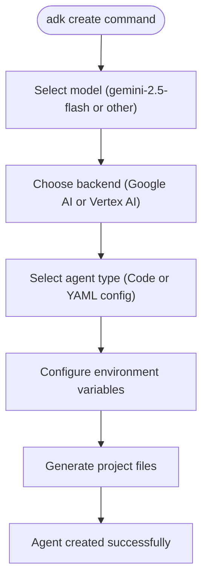
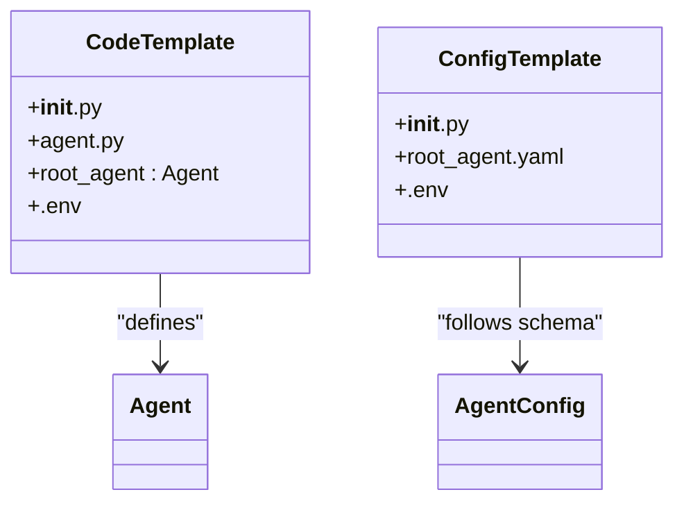

# Create Command

<cite>
**Referenced Files in This Document**   
- [cli_create.py](file://src/google/adk/cli/cli_create.py)
- [cli.py](file://src/google/adk/cli/cli.py)
- [agent.py](file://contributing/samples/hello_world/agent.py)
- [root_agent.yaml](file://contributing/samples/core_basic_config/root_agent.yaml)
- [main.py](file://contributing/samples/hello_world/main.py)
- [README.md](file://README.md)
- [INSTALL.md](file://INSTALL.md)
- [adk_project_overview_and_architecture.md](file://contributing/adk_project_overview_and_architecture.md)
</cite>

## Table of Contents
1. [Introduction](#introduction)
2. [Command Overview](#command-overview)
3. [Project Initialization Options](#project-initialization-options)
4. [Template Types](#template-types)
5. [Configuration and Environment Setup](#configuration-and-environment-setup)
6. [Directory Structure](#directory-structure)
7. [Creating Basic Agents](#creating-basic-agents)
8. [Multi-Agent System Creation](#multi-agent-system-creation)
9. [Agent Creation with Tool Integrations](#agent-creation-with-tool-integrations)
10. [Troubleshooting Guide](#troubleshooting-guide)
11. [Best Practices](#best-practices)

## Introduction

The `adk create` command is a scaffolding tool within the Agent Development Kit (ADK) framework that enables developers to quickly initialize new agent projects with proper directory structure and boilerplate code. This command automates the creation of essential files and configuration needed to start developing AI agents, following the framework's conventions for project organization and agent definition. The tool supports multiple template types and provides interactive prompts to guide users through the setup process, including model selection, backend configuration, and environment variables.

**Section sources**
- [README.md](file://README.md#L1-L158)
- [adk_project_overview_and_architecture.md](file://contributing/adk_project_overview_and_architecture.md#L1-L113)

## Command Overview

The `adk create` command serves as the primary entry point for initializing new agent projects within the ADK framework. It provides an interactive interface that guides developers through the agent creation process, handling the generation of necessary files and configuration based on user selections. The command supports both code-based and configuration-based agent definitions, allowing developers to choose their preferred approach for agent development.

The implementation of the `adk create` command is located in the `cli_create.py` module, which handles the command-line interface logic, user prompts, and file generation. The command offers several key features including model selection, backend configuration (Google AI or Vertex AI), and template type selection. It creates a standardized project structure that ensures compatibility with other ADK tools and deployment options.



**Diagram sources**
- [cli_create.py](file://src/google/adk/cli/cli_create.py#L1-L330)

**Section sources**
- [cli_create.py](file://src/google/adk/cli/cli_create.py#L1-L330)
- [cli.py](file://src/google/adk/cli/cli.py#L1-L218)

## Project Initialization Options

The `adk create` command provides several initialization options that allow developers to customize their agent setup during creation. These options include model selection, backend configuration, and agent type specification. The command offers an interactive prompt-based interface that guides users through these choices, with sensible defaults where applicable.

When initializing a new agent, developers can choose between the default gemini-2.5-flash model or specify another model. For the backend, users can select between Google AI (using API keys) or Vertex AI (using Google Cloud project and region). The command also allows users to choose between code-based agent definition (Python) or configuration-based agent definition (YAML), with the latter being marked as experimental in the current implementation.

The initialization process includes validation to ensure that required information is provided and that the target directory is either empty or the user confirms overwriting existing content. This prevents accidental data loss and ensures a clean project setup.

**Section sources**
- [cli_create.py](file://src/google/adk/cli/cli_create.py#L221-L329)

## Template Types

The `adk create` command supports two primary template types for agent creation: code-based templates and configuration-based templates. The code-based template generates Python files with agent definitions, while the configuration-based template uses YAML files to define agent properties.

The code-based template includes an `agent.py` file containing a root_agent instance defined using the Agent class, along with an `__init__.py` file that imports the agent. This approach follows the code-first philosophy of the ADK framework, allowing for maximum flexibility and IDE support. The configuration-based template generates a `root_agent.yaml` file that defines agent properties according to the AgentConfig schema, with a minimal `__init__.py` file.

Both template types include a `.env` file for environment variables, which is configured based on the selected backend. The choice between template types depends on developer preference and project requirements, with code-based templates recommended for complex agents requiring custom logic and configuration-based templates suitable for simpler agents with straightforward configurations.



**Diagram sources**
- [cli_create.py](file://src/google/adk/cli/cli_create.py#L24-L45)
- [root_agent.yaml](file://contributing/samples/core_basic_config/root_agent.yaml#L1-L10)

**Section sources**
- [cli_create.py](file://src/google/adk/cli/cli_create.py#L260-L273)
- [root_agent.yaml](file://contributing/samples/core_basic_config/root_agent.yaml#L1-L10)

## Configuration and Environment Setup

The `adk create` command handles configuration and environment setup by generating appropriate files based on the selected backend and agent type. For Google AI backend, it creates a `.env` file with the GOOGLE_API_KEY variable, while for Vertex AI backend, it includes GOOGLE_CLOUD_PROJECT and GOOGLE_CLOUD_LOCATION variables. The command also sets the GOOGLE_GENAI_USE_VERTEXAI flag to indicate which backend is being used.

The configuration process includes interactive prompts that guide users through providing necessary credentials and project information. When using Google AI backend, users are prompted to enter their API key, with a helpful message directing them to AI Studio if they don't have one. For Vertex AI backend, users are prompted for their Google Cloud project ID and region, with guidance provided for setting up a Google Cloud account if needed.

The generated configuration follows the framework's conventions for environment management, ensuring compatibility with other ADK tools and deployment options. The `.env` file is created in the agent directory and contains only the essential variables needed for the selected backend, keeping the configuration minimal and focused.

**Section sources**
- [cli_create.py](file://src/google/adk/cli/cli_create.py#L170-L208)
- [INSTALL.md](file://INSTALL.md#L1-L110)

## Directory Structure

The `adk create` command establishes a standardized directory structure for agent projects that follows the ADK framework conventions. This structure ensures compatibility with other ADK tools and deployment options, while providing a clear organization for agent code and configuration.

The generated directory includes essential files such as `__init__.py`, `agent.py` or `root_agent.yaml`, and `.env`. The `__init__.py` file contains the necessary imports to make the agent discoverable by ADK tools, while the agent definition file contains the root_agent instance. The `.env` file stores environment variables required for the selected backend.

This structure aligns with the canonical project structure described in the framework documentation, where agent directories contain the agent definition and initialization files. The standardized structure enables consistent tooling across different agent projects and simplifies the development workflow.

```mermaid
graph TD
AgentFolder[Agent Directory] --> InitFile[__init__.py]
AgentFolder --> AgentFile[agent.py or root_agent.yaml]
AgentFolder --> EnvFile[.env]
InitFile --> "from . import agent"
AgentFile --> "root_agent = Agent(...)"
EnvFile --> "Environment Variables"
```

**Diagram sources**
- [cli_create.py](file://src/google/adk/cli/cli_create.py#L179-L218)
- [adk_project_overview_and_architecture.md](file://contributing/adk_project_overview_and_architecture.md#L27-L47)

**Section sources**
- [cli_create.py](file://src/google/adk/cli/cli_create.py#L179-L218)
- [adk_project_overview_and_architecture.md](file://contributing/adk_project_overview_and_architecture.md#L27-L47)

## Creating Basic Agents

Creating basic agents with the `adk create` command involves a straightforward process that initializes a simple agent with minimal configuration. This is typically done using the default options, which create a code-based agent with the gemini-2.5-flash model and Google AI backend.

The generated agent includes a basic agent definition with essential properties such as name, description, instruction, and model. The instruction provides guidance for the agent's behavior, while the model specifies the underlying LLM to use. For basic agents, no additional tools or complex configurations are included, making them suitable for simple tasks and learning purposes.

The process begins with running the `adk create` command followed by the desired agent name. The command then guides the user through the initialization process, with default options selected where possible. Once completed, the user has a functional agent that can be immediately tested and extended.

**Section sources**
- [cli_create.py](file://src/google/adk/cli/cli_create.py#L284-L329)
- [agent.py](file://contributing/samples/hello_world/agent.py#L1-L109)

## Multi-Agent System Creation

While the `adk create` command primarily focuses on creating individual agents, the generated templates can serve as building blocks for multi-agent systems. The framework supports multi-agent architectures through the use of sub_agents in agent definitions, allowing for the creation of hierarchical agent structures.

For multi-agent systems, developers can create multiple agents using the `adk create` command and then configure them to work together by defining appropriate sub_agent relationships. The parent agent can delegate tasks to specialized child agents, creating a coordinated system that can handle complex workflows.

The configuration-based template is particularly useful for multi-agent systems, as it allows for clear definition of agent hierarchies through the sub_agents field in the YAML configuration. This approach enables declarative specification of multi-agent architectures, making them easier to understand and maintain.

**Section sources**
- [multi_agent_basic_config](file://contributing/samples/multi_agent_basic_config)
- [root_agent.yaml](file://contributing/samples/multi_agent_basic_config/root_agent.yaml#L1-L18)

## Agent Creation with Tool Integrations

The `adk create` command generates agents that can be easily extended with tool integrations. While the initial template does not include specific tools, it provides the foundation for adding various tool types such as built-in tools, custom functions, OpenAPI specs, and MCP (Model Control Protocol) tools.

Developers can enhance their agents by adding tools to the agent definition, either in the `agent.py` file for code-based agents or in the `root_agent.yaml` file for configuration-based agents. The framework provides a rich ecosystem of pre-built tools for common tasks, as well as mechanisms for creating custom tools to interact with external systems.

The hello_world sample demonstrates tool integration with the roll_die and check_prime functions, showing how tools can be added to an agent's capabilities. These tools can be used to extend the agent's functionality beyond simple text generation, enabling it to perform calculations, access external data, and interact with various services.

**Section sources**
- [agent.py](file://contributing/samples/hello_world/agent.py#L22-L64)
- [toolbox_agent](file://contributing/samples/toolbox_agent)

## Troubleshooting Guide

Common issues with the `adk create` command typically involve template generation, file permissions, and environment setup. One frequent issue is attempting to create an agent in a non-empty directory, which triggers a confirmation prompt to prevent accidental data loss. Users should ensure they have write permissions in the target directory and that the directory is either empty or intended to be overwritten.

Environment setup problems often occur when configuring the backend, particularly with Google Cloud credentials. Users may encounter issues with invalid API keys, incorrect project IDs, or missing gcloud configuration. The command provides helpful error messages and guidance for resolving these issues, including links to relevant documentation.

If the command fails to execute, users should verify that the ADK package is properly installed and that the `adk` command is available in their PATH. They should also check that Python 3.9 or higher is installed, as this is a prerequisite for the framework.

**Section sources**
- [cli_create.py](file://src/google/adk/cli/cli_create.py#L298-L306)
- [INSTALL.md](file://INSTALL.md#L86-L98)

## Best Practices

When using the `adk create` command, several best practices should be followed to ensure successful agent development and maintenance. First, it is recommended to use version control from the beginning of the project by initializing a Git repository immediately after agent creation. This enables tracking of changes and collaboration with other developers.

For code-based agents, following Python best practices such as proper module organization, meaningful variable names, and comprehensive documentation is essential. The code-first approach of the framework encourages treating agent development as software development, with all the associated benefits of versioning, testing, and IDE support.

When extending generated templates, developers should maintain clear separation between generated code and custom logic. This makes it easier to update to new template versions in the future and reduces the risk of conflicts. Additionally, using environment variables for configuration rather than hardcoding values enhances security and flexibility.

**Section sources**
- [adk_project_overview_and_architecture.md](file://contributing/adk_project_overview_and_architecture.md#L7-L11)
- [INSTALL.md](file://INSTALL.md#L102-L107)