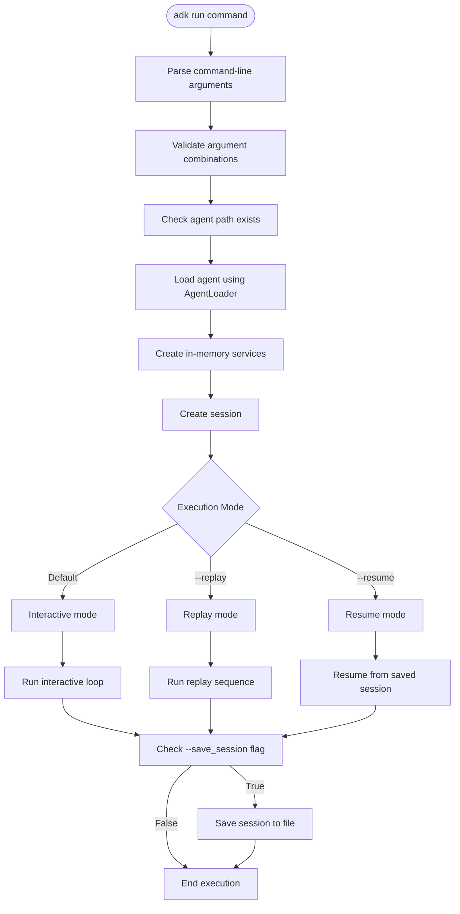
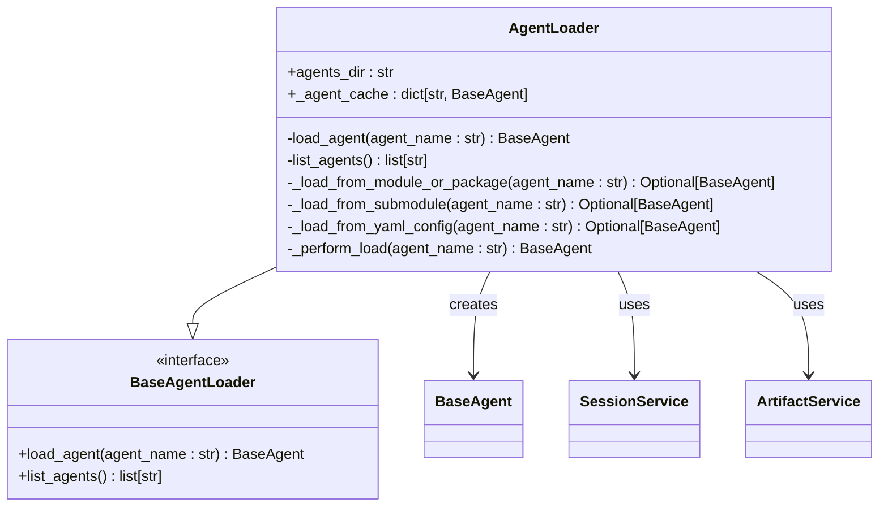
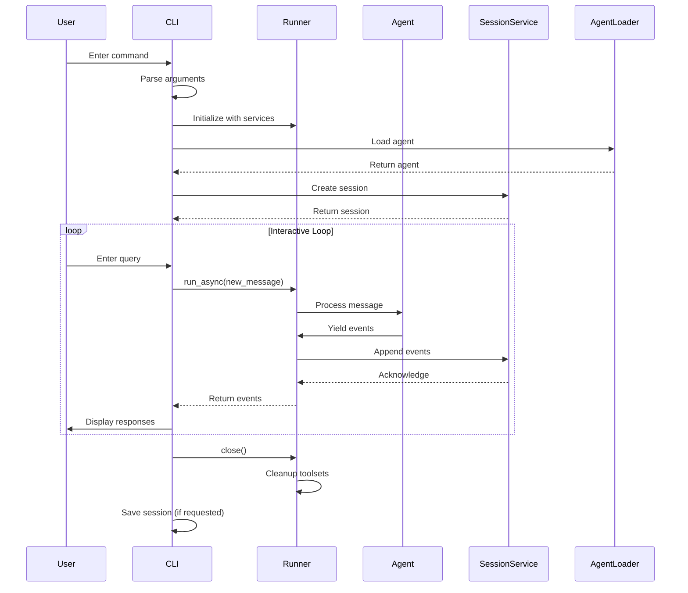
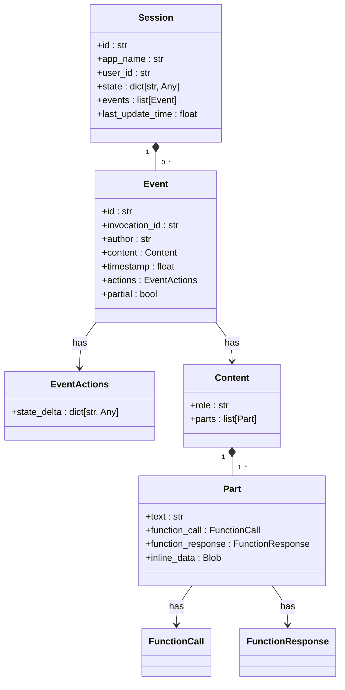

# Run Command

<cite>
**Referenced Files in This Document**   
- [cli_tools_click.py](file://src/google/adk/cli/cli_tools_click.py)
- [cli.py](file://src/google/adk/cli/cli.py)
- [runners.py](file://src/google/adk/runners.py)
- [agent_loader.py](file://src/google/adk/cli/utils/agent_loader.py)
- [session.py](file://src/google/adk/sessions/session.py)
- [in_memory_session_service.py](file://src/google/adk/sessions/in_memory_session_service.py)
- [hello_world/agent.py](file://contributing/samples/hello_world/agent.py)
- [multi_agent_seq_config/root_agent.yaml](file://contributing/samples/multi_agent_seq_config/root_agent.yaml)
- [core_custom_agent_config/root_agent.yaml](file://contributing/samples/core_custom_agent_config/root_agent.yaml)
</cite>

## Table of Contents
1. [Introduction](#introduction)
2. [Command Structure and Options](#command-structure-and-options)
3. [Agent Loading and Configuration](#agent-loading-and-configuration)
4. [Execution Flow and Runner Integration](#execution-flow-and-runner-integration)
5. [Session Management](#session-management)
6. [Running Single and Multi-Agent Systems](#running-single-and-multi-agent-systems)
7. [Configuration Overrides and Execution Parameters](#configuration-overrides-and-execution-parameters)
8. [Troubleshooting Common Issues](#troubleshooting-common-issues)
9. [Performance Considerations and Best Practices](#performance-considerations-and-best-practices)

## Introduction
The 'adk run' command is a core development tool in the Agent Development Kit (ADK) that enables local execution of agents for development and testing purposes. This command provides a CLI interface for interacting with agents, allowing developers to test agent behavior, validate configurations, and debug issues in a controlled environment. The command integrates with the ADK's Runner engine to manage agent execution, session state, and event processing, making it an essential tool for the agent development lifecycle.

**Section sources**
- [cli_tools_click.py](file://src/google/adk/cli/cli_tools_click.py#L202-L281)

## Command Structure and Options
The 'adk run' command provides several options for controlling agent execution and session management. The primary argument is the path to the agent source code folder, which can be specified as a directory path. The command supports three main execution modes: interactive mode (default), replay mode (using --replay), and resume mode (using --resume). These modes are mutually exclusive, ensuring clear execution paths.

Key command-line options include:
- **--save_session**: Flag to save the session to a JSON file upon exit
- **--session_id**: Specifies the session ID for saving sessions
- **--replay**: Path to a JSON file containing initial session state and user queries for replay
- **--resume**: Path to a previously saved session file to resume interaction

The command uses Click for argument parsing and provides helpful error messages with full help text when required arguments are missing. The validation ensures that --replay and --resume options cannot be used together, preventing conflicting execution modes.



**Diagram sources **
- [cli_tools_click.py](file://src/google/adk/cli/cli_tools_click.py#L202-L281)
- [cli.py](file://src/google/adk/cli/cli.py#L122-L218)

**Section sources**
- [cli_tools_click.py](file://src/google/adk/cli/cli_tools_click.py#L202-L281)

## Agent Loading and Configuration
The 'adk run' command utilizes the AgentLoader class to load agents from various directory structures and configuration formats. The loader supports multiple agent specification methods, including Python modules, packages, and YAML configuration files. When loading an agent, the system first attempts to import the agent as a module or package, looking for a 'root_agent' attribute. If this fails, it checks for an 'agent.py' submodule. As an experimental feature, the loader can also instantiate agents from YAML configuration files located in the agent directory.

The agent loading process includes automatic .env file loading for the specified agent, allowing environment-specific configurations to be applied during development. The loader implements caching to improve performance when reloading agents during development, and it properly handles module isolation to prevent conflicts between different agent loads.



**Diagram sources **
- [agent_loader.py](file://src/google/adk/cli/utils/agent_loader.py#L36-L231)

**Section sources**
- [agent_loader.py](file://src/google/adk/cli/utils/agent_loader.py#L36-L231)

## Execution Flow and Runner Integration
The 'adk run' command integrates with the Runner engine to execute agents and manage their lifecycle. The Runner class serves as the central execution manager, coordinating between the agent, session service, artifact service, and other components. When the 'adk run' command is executed, it creates a Runner instance with in-memory implementations of the required services, providing a self-contained environment for agent testing.

The execution flow begins with session creation and agent loading, followed by the main interaction loop. For interactive mode, the command uses a ReadlinePrompt handler to capture user input and feed it to the Runner. The Runner processes each message through its run_async method, which yields events representing the agent's responses, function calls, and other interactions. These events are then displayed to the user in real-time.

The Runner implements a sophisticated invocation context system that tracks the state of each agent invocation, including plugins, credentials, and execution configuration. This context is used to manage the agent's execution environment and ensure proper isolation between different invocations.



**Diagram sources **
- [runners.py](file://src/google/adk/runners.py#L59-L680)
- [cli.py](file://src/google/adk/cli/cli.py#L122-L218)

**Section sources**
- [runners.py](file://src/google/adk/runners.py#L59-L680)
- [cli.py](file://src/google/adk/cli/cli.py#L122-L218)

## Session Management
The 'adk run' command implements comprehensive session management to maintain conversation state and context across interactions. Sessions are represented by the Session class, which contains a unique identifier, application name, user ID, state dictionary, and event history. The in-memory session service provides temporary storage for sessions during development, making it suitable for testing but not for production use.

Session state is managed through a combination of session-specific state and shared state (app-level and user-level). The state system supports state deltas that can be applied through event actions, allowing agents to modify session state during execution. When saving sessions, the complete session object is serialized to a JSON file with the session ID as part of the filename, enabling easy retrieval and sharing of session data.

The command supports three session interaction modes:
1. **Interactive mode**: Creates a new session and allows continuous interaction
2. **Replay mode**: Creates a new session from an input file and runs predefined queries
3. **Resume mode**: Loads a previously saved session and continues interaction



**Diagram sources **
- [session.py](file://src/google/adk/sessions/session.py#L25-L59)
- [in_memory_session_service.py](file://src/google/adk/sessions/in_memory_session_service.py#L35-L304)

**Section sources**
- [session.py](file://src/google/adk/sessions/session.py#L25-L59)
- [in_memory_session_service.py](file://src/google/adk/sessions/in_memory_session_service.py#L35-L304)

## Running Single and Multi-Agent Systems
The 'adk run' command supports both single-agent and multi-agent system execution, providing flexibility for different development scenarios. For single-agent systems, the command loads the specified agent and runs it in isolation, making it ideal for testing individual agent functionality.

For multi-agent systems, the command can load complex agent hierarchies defined in YAML configuration files or Python code. The Runner automatically handles agent routing and context switching based on the conversation flow. When an agent in the hierarchy produces a function call, the Runner ensures that subsequent responses are directed to the appropriate agent, maintaining proper conversation context.

Examples of running different agent types:

**Single Agent Execution:**
```bash
adk run contributing/samples/hello_world
```

**Multi-Agent System Execution:**
```bash
adk run contributing/samples/multi_agent_seq_config
```

**Agent with Custom Configuration:**
```bash
adk run contributing/samples/core_custom_agent_config
```

The command automatically detects the agent type and configuration method, whether it's a Python-based agent with code-defined behavior or a configuration-based agent with YAML-defined parameters.

**Section sources**
- [hello_world/agent.py](file://contributing/samples/hello_world/agent.py#L67-L108)
- [multi_agent_seq_config/root_agent.yaml](file://contributing/samples/multi_agent_seq_config/root_agent.yaml)
- [core_custom_agent_config/root_agent.yaml](file://contributing/samples/core_custom_agent_config/root_agent.yaml)

## Configuration Overrides and Execution Parameters
The 'adk run' command provides several parameters for controlling agent execution and overriding default configurations. While the command primarily uses the agent's built-in configuration, it allows for session-level overrides through command-line options.

Key execution parameters include:
- **--save_session**: Enables session persistence, allowing developers to save and share conversation states
- **--session_id**: Specifies a custom session ID for saved sessions, facilitating organized session management
- **--replay**: Allows testing with predefined input sequences, enabling reproducible testing scenarios
- **--resume**: Supports continuing development from previously saved states, maintaining context across development sessions

These parameters work in conjunction with the agent's internal configuration, which may include model specifications, instructions, tools, and generation settings. The command does not provide direct overrides for model parameters or agent instructions, as these are typically managed through the agent's configuration files or code.

The integration with the Runner engine ensures that all execution parameters are properly propagated to the underlying services, maintaining consistency between the CLI interface and the execution environment.

**Section sources**
- [cli_tools_click.py](file://src/google/adk/cli/cli_tools_click.py#L202-L281)
- [cli.py](file://src/google/adk/cli/cli.py#L122-L218)

## Troubleshooting Common Issues
When using the 'adk run' command, developers may encounter several common issues. Understanding these issues and their solutions is crucial for efficient development.

**Agent Loading Failures:**
- **Cause**: Incorrect directory structure or missing root_agent definition
- **Solution**: Ensure the agent directory contains either an __init__.py file with root_agent or an agent.py file with root_agent
- **Debug Tip**: Verify the agent path is correct and check for .env file loading issues

**Configuration Errors:**
- **Cause**: Invalid YAML syntax in configuration files or missing required fields
- **Solution**: Validate YAML files with a syntax checker and ensure all required fields are present
- **Debug Tip**: Use the --verbose flag if available to get detailed error messages

**Execution Timeouts:**
- **Cause**: Long-running operations or infinite loops in agent logic
- **Solution**: Implement proper timeout handling in agent code and monitor resource usage
- **Debug Tip**: Use the development UI to monitor agent state and identify bottlenecks

**Session Management Issues:**
- **Cause**: Permission errors when saving sessions or corrupted session files
- **Solution**: Ensure write permissions in the agent directory and validate JSON format of session files
- **Debug Tip**: Check file paths and ensure the session ID doesn't contain invalid characters

For persistent issues, developers should check the logging output, verify agent dependencies, and ensure the ADK environment is properly configured.

**Section sources**
- [agent_loader.py](file://src/google/adk/cli/utils/agent_loader.py#L36-L231)
- [cli_tools_click.py](file://src/google/adk/cli/cli_tools_click.py#L202-L281)

## Performance Considerations and Best Practices
When running memory-intensive agents with the 'adk run' command, several performance considerations should be taken into account. The in-memory services used by the command are not designed for production-scale workloads but are optimized for development and testing efficiency.

Best practices for debugging with the development UI include:
- **Incremental Testing**: Start with simple queries and gradually increase complexity
- **Session Isolation**: Use unique session IDs for different test scenarios to avoid state conflicts
- **State Monitoring**: Regularly inspect session state to verify expected behavior
- **Tool Usage**: Leverage the --replay option for regression testing of specific scenarios

For memory-intensive agents, consider the following optimizations:
- **State Management**: Minimize the amount of data stored in session state
- **Event Filtering**: Use appropriate event filtering to reduce memory footprint
- **Resource Monitoring**: Monitor system resources during extended testing sessions

The development workflow should incorporate regular testing with both the 'adk run' command and other testing tools to ensure comprehensive coverage and reliable agent behavior.

**Section sources**
- [runners.py](file://src/google/adk/runners.py#L59-L680)
- [in_memory_session_service.py](file://src/google/adk/sessions/in_memory_session_service.py#L35-L304)
- [cli.py](file://src/google/adk/cli/cli.py#L122-L218)