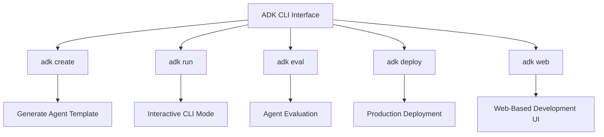
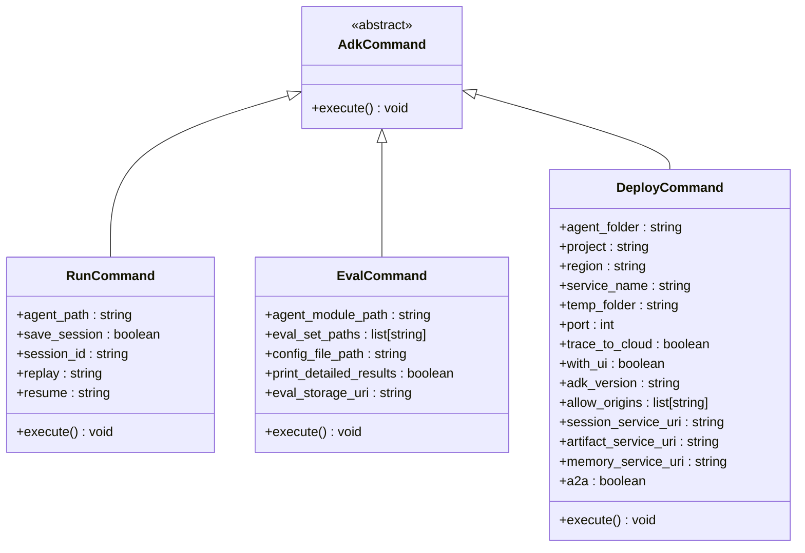
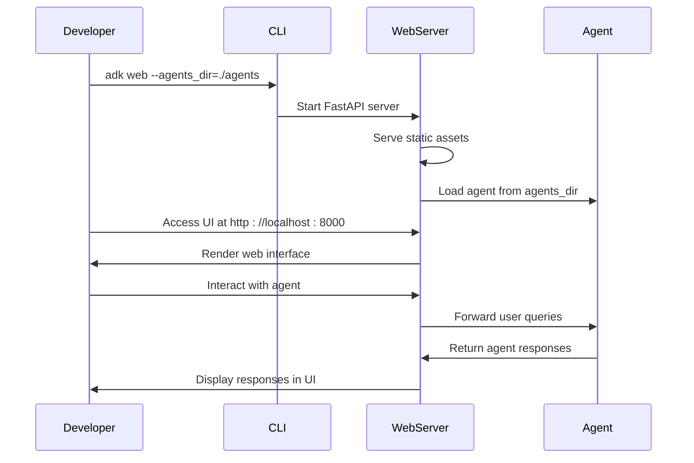
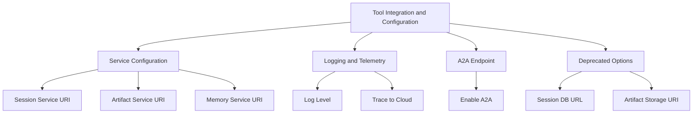

# Development Tools

<cite>
**Referenced Files in This Document**   
- [cli.py](file://src/google/adk/cli/cli.py)
- [cli_eval.py](file://src/google/adk/cli/cli_eval.py)
- [cli_deploy.py](file://src/google/adk/cli/cli_deploy.py)
- [cli_create.py](file://src/google/adk/cli/cli_create.py)
- [adk_web_server.py](file://src/google/adk/cli/adk_web_server.py)
- [fast_api.py](file://src/google/adk/cli/fast_api.py)
- [cli_tools_click.py](file://src/google/adk/cli/cli_tools_click.py)
- [index.html](file://src/google/adk/cli/browser/index.html)
</cite>

## Table of Contents
1. [Introduction](#introduction)
2. [Development Environment Setup](#development-environment-setup)
3. [CLI Interface Overview](#cli-interface-overview)
4. [Key CLI Commands](#key-cli-commands)
5. [Web-Based Development UI](#web-based-development-ui)
6. [Tool Integration and Configuration](#tool-integration-and-configuration)
7. [Common Development Workflow Challenges](#common-development-workflow-challenges)
8. [Best Practices for Efficient Agent Iteration](#best-practices-for-efficient-agent-iteration)

## Introduction
The Agent Development Kit (ADK) provides a comprehensive tooling ecosystem designed to streamline the development, testing, and deployment of AI agents. This document focuses on the development tools that support agent creation within the ADK framework, detailing the CLI interface for local development and deployment operations. The ADK's tooling is built to offer developers flexibility and control while maintaining compatibility with various models and deployment environments. Key components include the CLI for executing core operations such as running, evaluating, and deploying agents, as well as a web-based UI for interactive testing and debugging. These tools are integrated with the core framework to provide a seamless development experience, enabling efficient agent iteration and robust deployment strategies.

## Development Environment Setup
Setting up the development environment for ADK involves installing the necessary dependencies and configuring the workspace to support agent development. The recommended approach uses `uv`, a fast Python package installer and resolver, to manage dependencies efficiently. Begin by cloning the ADK repository and creating a virtual environment using `uv venv`. Activate the virtual environment and install the ADK package in editable mode with `uv pip install -e .`. This installation includes essential dependencies such as the Google GenAI SDK, LiteLLM for multi-provider LLM support, and FastAPI for web services. For development purposes, additional tools can be installed using `uv pip install -e ".[dev,test]"`. Alternative installation methods are available using `pip` if `uv` is not accessible. After setup, developers can run sample agents to verify the installation, such as the Agent OS sample with `adk run ./contributing/samples/agent_os`. This environment supports a wide range of samples, including basic configurations, multi-agent setups, and sequential workflow agents, providing a solid foundation for building and testing agents.

**Section sources**
- [INSTALL.md](file://INSTALL.md#L1-L110)
- [README.md](file://README.md#L1-L158)

## CLI Interface Overview
The ADK CLI interface serves as the primary tool for local development and deployment operations, offering a range of commands to manage the agent lifecycle. The CLI is implemented through the `cli_tools_click.py` module, which defines the main command group and individual commands for various operations. It leverages the Click library to provide a user-friendly interface with options for specifying parameters such as agent paths, configuration files, and deployment settings. The CLI supports both interactive and non-interactive modes, allowing developers to run agents, evaluate their performance, and deploy them to production environments. Commands are organized into groups such as `deploy` for deployment operations and `create` for initializing new agent projects. The CLI also integrates with the web-based development UI, enabling developers to start a FastAPI server with the web UI for agents using the `web` command. This integration facilitates a smooth transition between command-line operations and graphical interface interactions, enhancing the overall development experience.

**Diagram sources**
- [cli_tools_click.py](file://src/google/adk/cli/cli_tools_click.py#L1-L1336)

**Section sources**
- [cli_tools_click.py](file://src/google/adk/cli/cli_tools_click.py#L1-L1336)

## Key CLI Commands
The ADK CLI provides several key commands that are essential for agent development and deployment. The `adk run` command executes an agent in an interactive CLI mode, allowing developers to test the agent's responses and behavior in real-time. It supports options for saving sessions, replaying previous interactions, and resuming sessions from saved states. The `adk eval` command evaluates an agent's performance using predefined evaluation sets, providing metrics on the agent's accuracy and effectiveness. It supports detailed result output and can store evaluation results in specified storage locations. The `adk deploy` command deploys agents to production environments such as Google Cloud Run, Vertex AI Agent Engine, or Google Kubernetes Engine (GKE). It generates necessary deployment artifacts, including Dockerfiles and Kubernetes manifests, and handles the deployment process through integration with `gcloud` and `kubectl`. Each command is designed to be flexible and configurable, supporting various options to meet different development and deployment needs.

**Diagram sources**
- [cli.py](file://src/google/adk/cli/cli.py#L1-L218)
- [cli_eval.py](file://src/google/adk/cli/cli_eval.py#L1-L359)
- [cli_deploy.py](file://src/google/adk/cli/cli_deploy.py#L1-L711)

**Section sources**
- [cli.py](file://src/google/adk/cli/cli.py#L1-L218)
- [cli_eval.py](file://src/google/adk/cli/cli_eval.py#L1-L359)
- [cli_deploy.py](file://src/google/adk/cli/cli_deploy.py#L1-L711)

## Web-Based Development UI
The web-based development UI is an integral part of the ADK tooling ecosystem, providing a graphical interface for interactive agent testing and debugging. Implemented through the `adk_web_server.py` and `fast_api.py` modules, the UI is served via a FastAPI server and includes static assets located in the `browser` directory. The UI allows developers to visualize agent interactions, inspect session data, and debug agent behavior in real-time. It supports features such as session management, where developers can create, list, and delete sessions, and evaluation management, enabling the creation and execution of evaluation sets. The UI also integrates with the CLI, allowing developers to start the server with the `adk web` command and access the interface through a specified host and port. This integration facilitates a seamless development workflow, where developers can switch between command-line operations and graphical interactions as needed.

**Diagram sources**
- [adk_web_server.py](file://src/google/adk/cli/adk_web_server.py#L1-L1100)
- [fast_api.py](file://src/google/adk/cli/fast_api.py#L1-L387)
- [index.html](file://src/google/adk/cli/browser/index.html#L1-L35)

**Section sources**
- [adk_web_server.py](file://src/google/adk/cli/adk_web_server.py#L1-L1100)
- [fast_api.py](file://src/google/adk/cli/fast_api.py#L1-L387)
- [index.html](file://src/google/adk/cli/browser/index.html#L1-L35)

## Tool Integration and Configuration
The ADK framework supports extensive tool integration and configuration options to enhance agent capabilities and adapt to various deployment scenarios. The `fast_api.py` module provides decorators and functions to add common options to CLI commands, such as specifying session service URIs, artifact service URIs, and memory service URIs. These options allow developers to configure the agent's services, including connecting to Vertex AI Agent Engine sessions, SQLite databases, or GCS artifact services. The framework also supports deprecated options with warnings to guide developers towards recommended configurations. Additionally, the CLI includes options for enabling cloud trace for telemetry, setting logging levels, and enabling A2A endpoints for remote agent-to-agent communication. These configuration options ensure that agents can be tailored to specific requirements and integrated with external services seamlessly.

**Diagram sources**
- [fast_api.py](file://src/google/adk/cli/fast_api.py#L1-L387)

**Section sources**
- [fast_api.py](file://src/google/adk/cli/fast_api.py#L1-L387)

## Common Development Workflow Challenges
Developers working with the ADK framework may encounter several common challenges during the agent development workflow. One challenge is managing dependencies and ensuring compatibility between different versions of the ADK and its dependencies. This can be mitigated by using `uv` for dependency management and following the recommended installation procedures. Another challenge is debugging agent behavior, particularly when dealing with complex multi-agent systems or intricate tool integrations. The web-based development UI and detailed logging options can help address this by providing visibility into agent interactions and system states. Additionally, deploying agents to production environments may present challenges related to configuration and service integration. Using the `adk deploy` command with appropriate options and testing deployments in staging environments can help ensure smooth production deployments. Finally, maintaining consistent agent performance across different models and providers requires thorough evaluation and testing, which can be facilitated by the `adk eval` command and evaluation sets.

**Section sources**
- [INSTALL.md](file://INSTALL.md#L1-L110)
- [README.md](file://README.md#L1-L158)
- [cli_deploy.py](file://src/google/adk/cli/cli_deploy.py#L1-L711)

## Best Practices for Efficient Agent Iteration
To achieve efficient agent iteration, developers should adopt several best practices when using the ADK framework. First, leverage the web-based development UI for interactive testing and debugging, as it provides real-time feedback and visualization of agent interactions. Second, use the `adk eval` command regularly to evaluate agent performance against predefined evaluation sets, ensuring that changes improve accuracy and effectiveness. Third, maintain a clean and organized project structure, with clear separation between agent code, configuration files, and evaluation sets. This facilitates version control and collaboration. Fourth, utilize the `adk create` command to generate new agent templates, ensuring consistency and reducing setup time. Finally, document agent behavior and configuration options thoroughly, making it easier for team members to understand and contribute to the project. By following these practices, developers can streamline the agent development process and achieve faster iteration cycles.

**Section sources**
- [README.md](file://README.md#L1-L158)
- [cli_create.py](file://src/google/adk/cli/cli_create.py#L1-L330)
- [cli_eval.py](file://src/google/adk/cli/cli_eval.py#L1-L359)