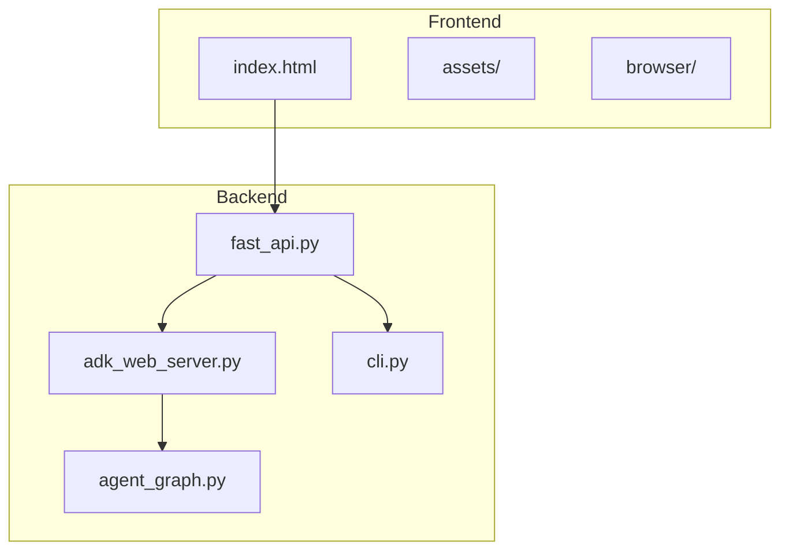
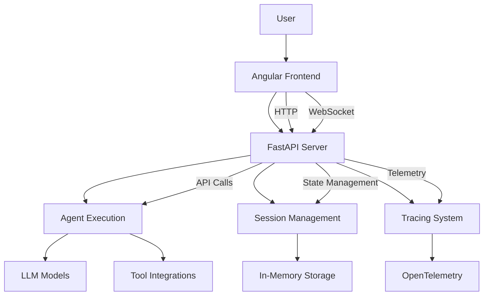
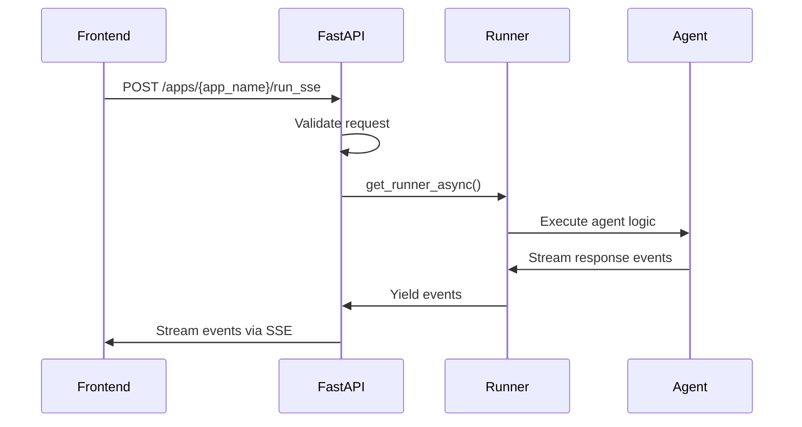
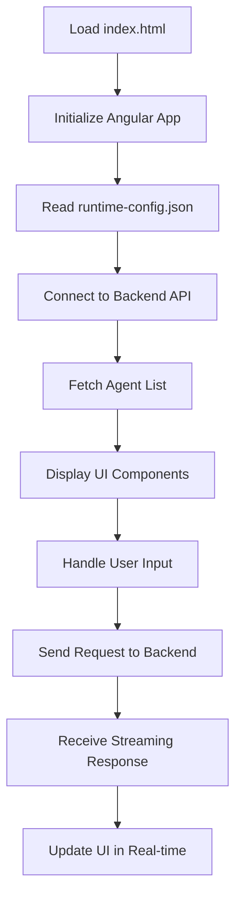
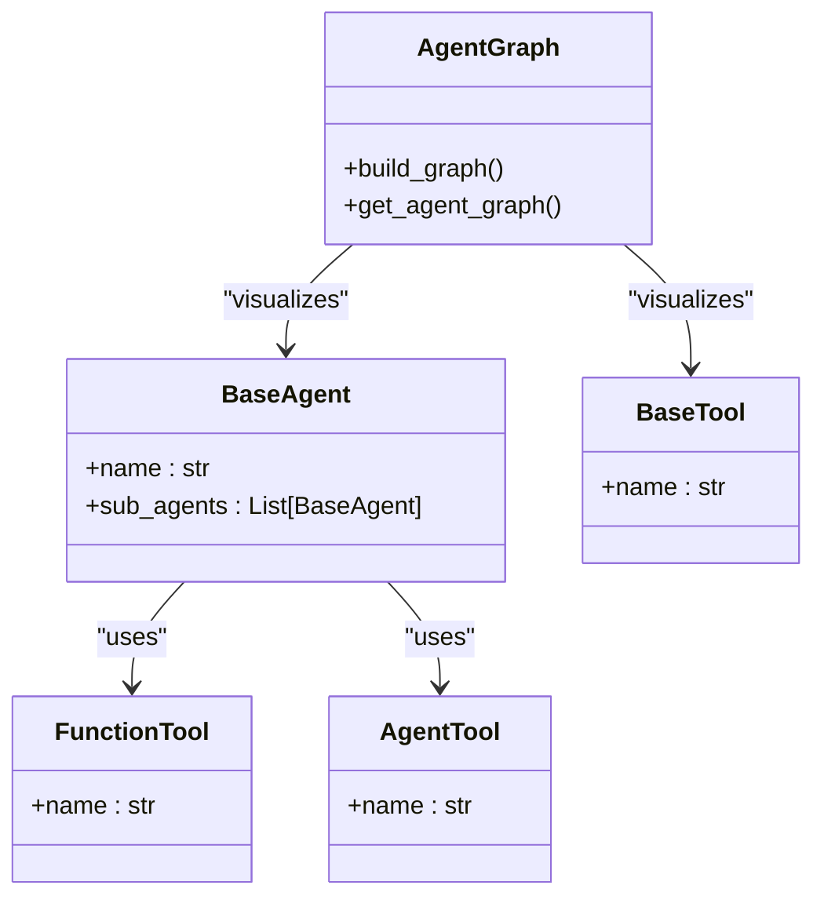
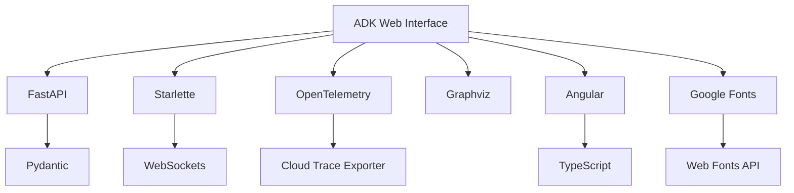

# Development UI

<cite>
**Referenced Files in This Document**   
- [adk_web_server.py](file://src/google/adk/cli/adk_web_server.py)
- [fast_api.py](file://src/google/adk/cli/fast_api.py)
- [index.html](file://src/google/adk/cli/browser/index.html)
- [agent_graph.py](file://src/google/adk/cli/agent_graph.py)
- [runtime-config.json](file://src/google/adk/cli/browser/assets/config/runtime-config.json)
</cite>

## Table of Contents
1. [Introduction](#introduction)
2. [Project Structure](#project-structure)
3. [Core Components](#core-components)
4. [Architecture Overview](#architecture-overview)
5. [Detailed Component Analysis](#detailed-component-analysis)
6. [Dependency Analysis](#dependency-analysis)
7. [Performance Considerations](#performance-considerations)
8. [Troubleshooting Guide](#troubleshooting-guide)
9. [Conclusion](#conclusion)

## Introduction
The ADK Development Web Interface is a comprehensive environment designed for interactive agent testing and debugging. This web-based development platform integrates a FastAPI server with WebSocket connections to enable live streaming of agent responses, providing developers with real-time visualization of input/output interactions. The interface allows for comprehensive testing of agent responses, inspection of tool calls, and debugging of conversation flows. It serves as a critical tool for developers working with the Agent Development Kit, offering a user-friendly interface to connect to agents, launch development servers, and interpret execution traces.

## Project Structure
The ADK Development Web Interface is organized within the `src/google/adk/cli` directory, which contains the core components of the web interface. The structure includes Python modules for the FastAPI server implementation, browser assets for the frontend, and supporting utilities. The browser assets directory contains static files including HTML, JavaScript, and CSS that comprise the frontend application. The configuration file `runtime-config.json` specifies the backend URL for the frontend to connect to. The Python modules `adk_web_server.py` and `fast_api.py` contain the server-side logic, while `agent_graph.py` provides functionality for visualizing agent relationships.

**Diagram sources**
- [index.html](file://src/google/adk/cli/browser/index.html)
- [fast_api.py](file://src/google/adk/cli/fast_api.py)
- [adk_web_server.py](file://src/google/adk/cli/adk_web_server.py)
- [agent_graph.py](file://src/google/adk/cli/agent_graph.py)

**Section sources**
- [adk_web_server.py](file://src/google/adk/cli/adk_web_server.py)
- [fast_api.py](file://src/google/adk/cli/fast_api.py)
- [index.html](file://src/google/adk/cli/browser/index.html)
- [agent_graph.py](file://src/google/adk/cli/agent_graph.py)

## Core Components
The ADK Development Web Interface consists of several core components that work together to provide a comprehensive development environment. The FastAPI server serves as the backend, handling API requests and managing agent execution. The frontend application, built with Angular, provides a user interface for interacting with agents. WebSocket connections enable real-time streaming of agent responses, allowing for live visualization of conversation flows. The agent graph visualization component provides insights into agent relationships and tool integrations. Session management ensures that conversation state is preserved across interactions, while the tracing system enables detailed debugging of agent execution.

**Section sources**
- [adk_web_server.py](file://src/google/adk/cli/adk_web_server.py#L210-L800)
- [fast_api.py](file://src/google/adk/cli/fast_api.py#L56-L387)
- [index.html](file://src/google/adk/cli/browser/index.html#L1-L35)

## Architecture Overview
The ADK Development Web Interface follows a decoupled architecture with a clear separation between frontend and backend components. The backend consists of a FastAPI server that exposes REST endpoints for agent management and execution. This server integrates with the core ADK session management system to maintain conversation state. The frontend is an Angular application that communicates with the backend via HTTP and WebSocket connections. The architecture supports live streaming of agent responses through Server-Sent Events (SSE) and WebSocket connections, enabling real-time interaction with agents. The system is designed to be extensible, allowing for the addition of custom endpoints and integration with external services.

**Diagram sources**
- [adk_web_server.py](file://src/google/adk/cli/adk_web_server.py)
- [fast_api.py](file://src/google/adk/cli/fast_api.py)

## Detailed Component Analysis

### FastAPI Server Implementation
The FastAPI server implementation in `adk_web_server.py` provides the core functionality for the development interface. It defines API endpoints for listing applications, managing sessions, and executing agent runs. The server uses Pydantic models for request validation and response serialization, ensuring type safety and data integrity. The implementation includes comprehensive error handling and logging to support debugging and monitoring. The server is designed to be extensible, allowing developers to add custom endpoints and integrate with external services.

#### For API/Service Components:

**Diagram sources**
- [adk_web_server.py](file://src/google/adk/cli/adk_web_server.py#L210-L800)
- [fast_api.py](file://src/google/adk/cli/fast_api.py#L56-L387)

**Section sources**
- [adk_web_server.py](file://src/google/adk/cli/adk_web_server.py#L210-L800)

### Frontend Components
The frontend components of the ADK Development Web Interface are implemented as an Angular application served from the `browser` directory. The main entry point is `index.html`, which loads the Angular application and its dependencies. The application connects to the backend API to retrieve agent information, send user inputs, and receive agent responses. The frontend includes visualization components for displaying conversation history, tool calls, and execution traces. The `runtime-config.json` file allows configuration of the backend URL, enabling the frontend to connect to different server instances.

#### For Complex Logic Components:

**Diagram sources**
- [index.html](file://src/google/adk/cli/browser/index.html)
- [runtime-config.json](file://src/google/adk/cli/browser/assets/config/runtime-config.json)

**Section sources**
- [index.html](file://src/google/adk/cli/browser/index.html)
- [runtime-config.json](file://src/google/adk/cli/browser/assets/config/runtime-config.json)

### Agent Graph Visualization
The agent graph visualization component, implemented in `agent_graph.py`, provides a graphical representation of agent relationships and tool integrations. This component uses Graphviz to generate directed graphs that illustrate the structure of agents and their connections to tools and other agents. The visualization includes different node shapes and colors to distinguish between agent types and tool types. This feature is particularly useful for understanding complex agent architectures and debugging agent interactions.

#### For Object-Oriented Components:

**Diagram sources**
- [agent_graph.py](file://src/google/adk/cli/agent_graph.py)

**Section sources**
- [agent_graph.py](file://src/google/adk/cli/agent_graph.py)

## Dependency Analysis
The ADK Development Web Interface has several key dependencies that enable its functionality. The FastAPI framework provides the web server capabilities, while Starlette handles the WebSocket connections. The OpenTelemetry library enables tracing and monitoring of agent execution. Graphviz is used for generating agent graph visualizations. The frontend depends on Angular for the user interface and Google Fonts for typography. The system integrates with the core ADK components for agent execution, session management, and tool integration. These dependencies are managed through the project's pyproject.toml file and are installed via pip.

**Diagram sources**
- [fast_api.py](file://src/google/adk/cli/fast_api.py)
- [adk_web_server.py](file://src/google/adk/cli/adk_web_server.py)

**Section sources**
- [fast_api.py](file://src/google/adk/cli/fast_api.py)
- [adk_web_server.py](file://src/google/adk/cli/adk_web_server.py)

## Performance Considerations
The ADK Development Web Interface is designed with performance in mind, particularly for handling large conversation histories and real-time data processing. The use of streaming responses via Server-Sent Events (SSE) and WebSockets minimizes latency and provides a responsive user experience. The in-memory session storage provides fast access to conversation state, while the tracing system is optimized to minimize overhead on agent execution. For production deployments, the interface can be configured to use external storage systems like Vertex AI for session persistence and Google Cloud Storage for artifact management. The system supports connection keep-alive and efficient data serialization to reduce network overhead.

## Troubleshooting Guide
Common issues with the ADK Development Web Interface include connection timeouts, streaming interruptions, and authentication problems. Connection timeouts can occur when the server is under heavy load or when network conditions are poor; these can be mitigated by increasing timeout values in the server configuration. Streaming interruptions may result from network instability or server resource constraints; implementing reconnection logic in the frontend can help maintain continuity. Authentication problems typically arise from misconfigured OAuth credentials or expired tokens; ensuring proper credential management and implementing token refresh mechanisms can resolve these issues. For debugging, the tracing system provides detailed insights into agent execution, while the event log helps identify the source of errors.

**Section sources**
- [adk_web_server.py](file://src/google/adk/cli/adk_web_server.py)
- [fast_api.py](file://src/google/adk/cli/fast_api.py)

## Conclusion
The ADK Development Web Interface provides a comprehensive environment for developing, testing, and debugging agents. Its integration of a FastAPI server, WebSocket connections, and a rich frontend interface enables real-time interaction with agents and detailed visualization of their behavior. The system's architecture supports extensibility and integration with external services, making it suitable for both development and production use cases. With its focus on performance, reliability, and ease of use, the ADK Development Web Interface is an essential tool for developers working with the Agent Development Kit.