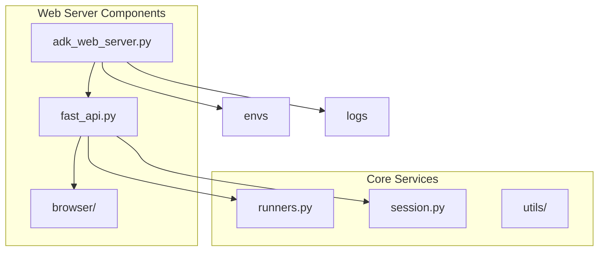
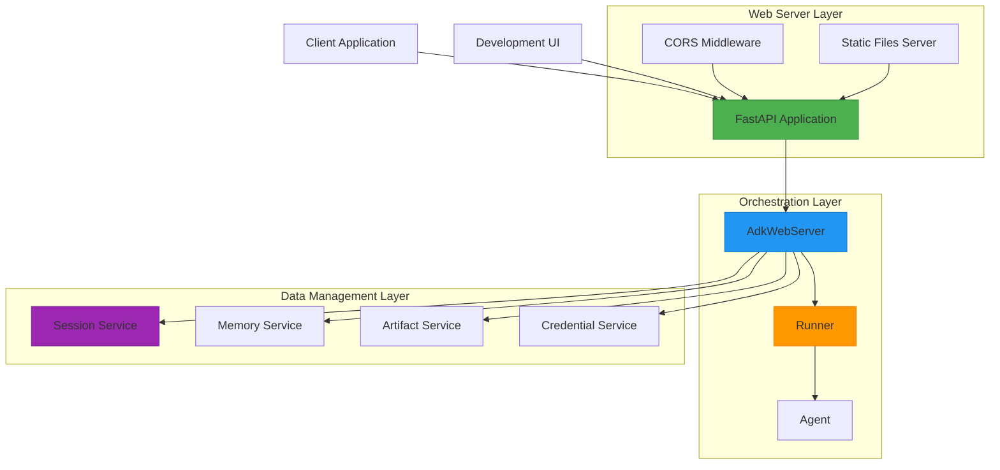
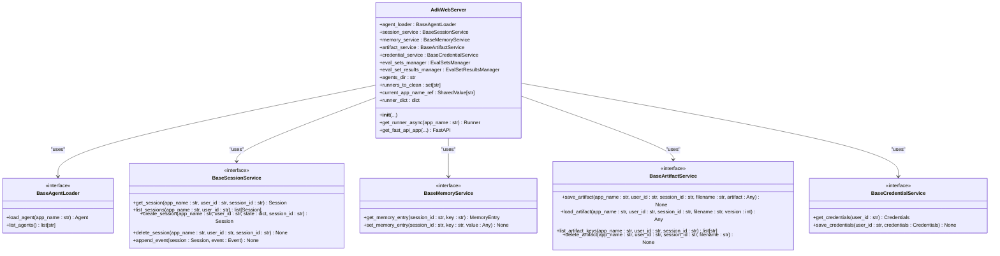
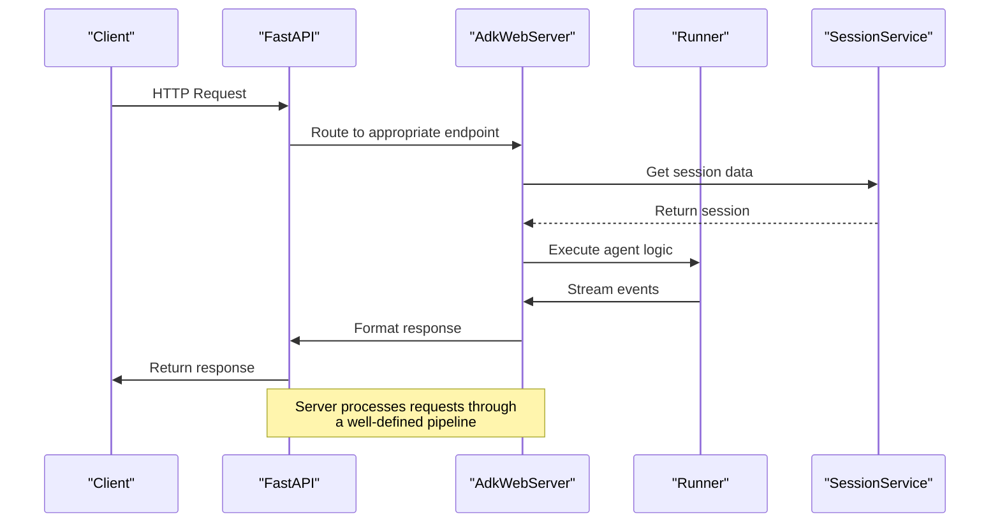
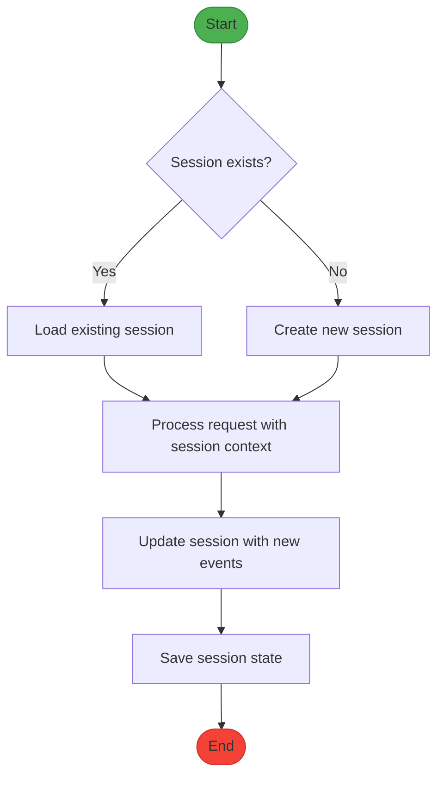
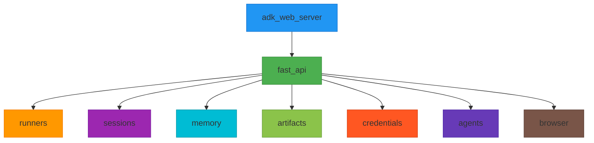

# Web Server Configuration

<cite>
**Referenced Files in This Document**   
- [adk_web_server.py](file://src/google/adk/cli/adk_web_server.py)
- [fast_api.py](file://src/google/adk/cli/fast_api.py)
- [runners.py](file://src/google/adk/runners.py)
- [session.py](file://src/google/adk/sessions/session.py)
- [envs.py](file://src/google/adk/cli/utils/envs.py)
- [logs.py](file://src/google/adk/cli/utils/logs.py)
- [index.html](file://src/google/adk/cli/browser/index.html)
</cite>

## Table of Contents
1. [Introduction](#introduction)
2. [Project Structure](#project-structure)
3. [Core Components](#core-components)
4. [Architecture Overview](#architecture-overview)
5. [Detailed Component Analysis](#detailed-component-analysis)
6. [Dependency Analysis](#dependency-analysis)
7. [Performance Considerations](#performance-considerations)
8. [Troubleshooting Guide](#troubleshooting-guide)
9. [Conclusion](#conclusion)

## Introduction
The ADK Development Web Server is a FastAPI-based server that powers the development UI for agent orchestration and session management. This documentation provides comprehensive details about the server's architecture, implementation, configuration, and integration with the Runner and Session systems. The server enables bidirectional communication through WebSocket endpoints for real-time streaming of agent responses and supports various customization options for server behavior, environment variables, logging, and telemetry.

## Project Structure
The ADK Development Web Server is organized within the `src/google/adk/cli` directory, with key components including the web server implementation, FastAPI configuration, and supporting utilities. The server serves both API endpoints and static assets for the development UI, with a clear separation between server logic, session management, and agent orchestration components.

**Diagram sources**
- [adk_web_server.py](file://src/google/adk/cli/adk_web_server.py)
- [fast_api.py](file://src/google/adk/cli/fast_api.py)
- [runners.py](file://src/google/adk/runners.py)
- [session.py](file://src/google/adk/sessions/session.py)

**Section sources**
- [adk_web_server.py](file://src/google/adk/cli/adk_web_server.py)
- [fast_api.py](file://src/google/adk/cli/fast_api.py)

## Core Components
The ADK Development Web Server consists of several core components that work together to provide a robust platform for agent development and testing. The main components include the AdkWebServer class, which manages the FastAPI application and various services, and the FastAPI configuration that handles server initialization and endpoint routing.

**Section sources**
- [adk_web_server.py](file://src/google/adk/cli/adk_web_server.py)
- [fast_api.py](file://src/google/adk/cli/fast_api.py)

## Architecture Overview
The ADK Development Web Server follows a modular architecture with clear separation of concerns between the web server layer, agent orchestration layer, and data management layer. The server is built on FastAPI, leveraging its asynchronous capabilities for handling concurrent requests and real-time communication.

**Diagram sources**
- [adk_web_server.py](file://src/google/adk/cli/adk_web_server.py)
- [fast_api.py](file://src/google/adk/cli/fast_api.py)
- [runners.py](file://src/google/adk/runners.py)

## Detailed Component Analysis
This section provides an in-depth analysis of the key components that make up the ADK Development Web Server, focusing on their implementation, interactions, and responsibilities.

### AdkWebServer Analysis
The AdkWebServer class is the central component that orchestrates the web server functionality, managing the FastAPI application and coordinating between various services.

#### Class Diagram

**Diagram sources**
- [adk_web_server.py](file://src/google/adk/cli/adk_web_server.py)

### FastAPI Configuration Analysis
The FastAPI configuration handles server initialization, endpoint routing, and integration with various services. It provides a flexible interface for customizing server behavior and supports both API endpoints and static file serving.

#### Sequence Diagram

**Diagram sources**
- [fast_api.py](file://src/google/adk/cli/fast_api.py)
- [adk_web_server.py](file://src/google/adk/cli/adk_web_server.py)

### Session Management Analysis
The session management system provides persistent storage for agent interactions, maintaining state across multiple requests and enabling continuity in agent conversations.

#### Flowchart

**Diagram sources**
- [session.py](file://src/google/adk/sessions/session.py)
- [runners.py](file://src/google/adk/runners.py)

**Section sources**
- [adk_web_server.py](file://src/google/adk/cli/adk_web_server.py)
- [fast_api.py](file://src/google/adk/cli/fast_api.py)
- [runners.py](file://src/google/adk/runners.py)
- [session.py](file://src/google/adk/sessions/session.py)

## Dependency Analysis
The ADK Development Web Server has a well-defined dependency structure that ensures modularity and separation of concerns. The server depends on various services for agent loading, session management, memory storage, artifact handling, and credential management.

**Diagram sources**
- [adk_web_server.py](file://src/google/adk/cli/adk_web_server.py)
- [fast_api.py](file://src/google/adk/cli/fast_api.py)

## Performance Considerations
The ADK Development Web Server is designed to handle concurrent sessions and large payloads efficiently. The server leverages FastAPI's asynchronous capabilities to process multiple requests simultaneously without blocking. For handling large payloads, the server implements streaming responses and efficient memory management to minimize resource consumption.

The WebSocket endpoint for bidirectional communication is optimized for real-time streaming of agent responses, with careful management of connection state and message buffering. The server also includes configuration options for tuning performance parameters such as connection timeouts, buffer sizes, and concurrency limits.

**Section sources**
- [adk_web_server.py](file://src/google/adk/cli/adk_web_server.py)
- [fast_api.py](file://src/google/adk/cli/fast_api.py)

## Troubleshooting Guide
When configuring the ADK Development Web Server, several common issues may arise. Port conflicts can occur when the specified port is already in use by another process; this can be resolved by changing the port number in the server configuration. CORS policies may prevent the development UI from accessing the API endpoints; this can be addressed by configuring the allowed origins in the server settings.

For SSL/TLS setup, ensure that valid certificates are provided and properly configured in the server settings. Issues with agent loading or session management may indicate problems with the agent directory structure or configuration files; verify that the agents directory is correctly specified and that all required configuration files are present.

**Section sources**
- [adk_web_server.py](file://src/google/adk/cli/adk_web_server.py)
- [fast_api.py](file://src/google/adk/cli/fast_api.py)
- [envs.py](file://src/google/adk/cli/utils/envs.py)
- [logs.py](file://src/google/adk/cli/utils/logs.py)

## Conclusion
The ADK Development Web Server provides a comprehensive platform for agent development and testing, with robust support for agent orchestration, session management, and real-time communication. The server's modular architecture and flexible configuration options make it suitable for a wide range of development scenarios, from simple agent testing to complex multi-agent systems.