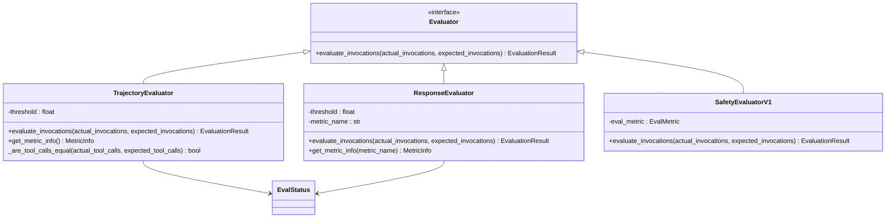
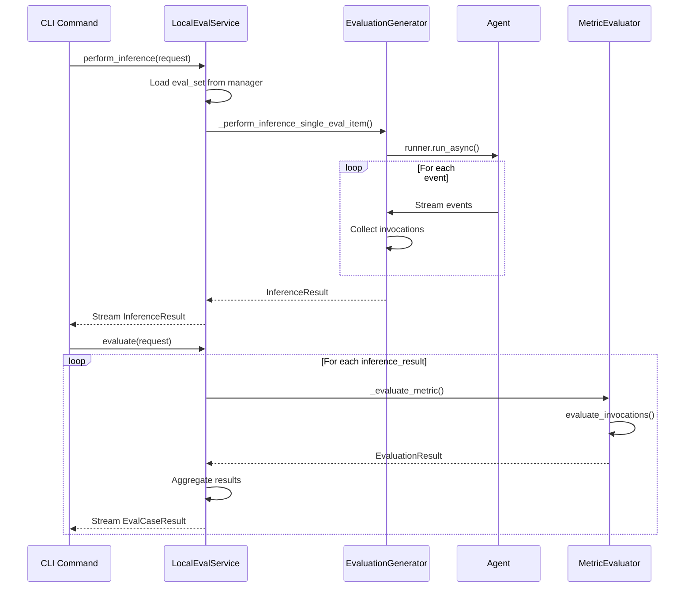

# Evaluation Concepts

<cite>
**Referenced Files in This Document**   
- [eval_set.py](file://src/google/adk/evaluation/eval_set.py)
- [eval_case.py](file://src/google/adk/evaluation/eval_case.py)
- [eval_result.py](file://src/google/adk/evaluation/eval_result.py)
- [evaluation_generator.py](file://src/google/adk/evaluation/evaluation_generator.py)
- [evaluator.py](file://src/google/adk/evaluation/evaluator.py)
- [response_evaluator.py](file://src/google/adk/evaluation/response_evaluator.py)
- [trajectory_evaluator.py](file://src/google/adk/evaluation/trajectory_evaluator.py)
- [eval_metrics.py](file://src/google/adk/evaluation/eval_metrics.py)
- [evaluation_constants.py](file://src/google/adk/evaluation/evaluation_constants.py)
- [cli_eval.py](file://src/google/adk/cli/cli_eval.py)
- [base_eval_service.py](file://src/google/adk/evaluation/base_eval_service.py)
- [local_eval_service.py](file://src/google/adk/evaluation/local_eval_service.py)
- [hello_world_eval_set_001.evalset.json](file://samples_for_testing/hello_world/hello_world_eval_set_001.evalset.json)
</cite>

## Table of Contents
1. [Core Evaluation Abstractions](#core-evaluation-abstractions)
2. [Evaluation Architecture](#evaluation-architecture)
3. [Evaluation Generator](#evaluation-generator)
4. [Evaluation Pipeline Integration](#evaluation-pipeline-integration)
5. [Evaluation Strategies](#evaluation-strategies)
6. [Common Evaluation Challenges](#common-evaluation-challenges)
7. [Best Practices](#best-practices)

## Core Evaluation Abstractions

The ADK Testing Framework provides a structured approach to evaluating AI agents through three core abstractions: Evaluation Sets, Eval Cases, and Evaluation Results. These abstractions form the foundation of the evaluation system, enabling systematic testing and measurement of agent performance.

An **Evaluation Set** represents a collection of test cases designed to evaluate specific agent capabilities. Each evaluation set contains metadata such as a unique identifier, name, and description, along with a list of individual evaluation cases. The evaluation set serves as the primary organizational unit for grouping related test scenarios, allowing for targeted assessment of particular agent functionalities or behaviors.

**Eval Cases** are the fundamental units of evaluation within an evaluation set. Each eval case represents a single interaction scenario between a user and the agent, structured as a conversation consisting of one or more invocations. An invocation captures a complete turn in the conversation, including the user's input content, the agent's final response, and intermediate data such as tool calls made during the agent's execution. This structure enables comprehensive evaluation of both simple single-turn interactions and complex multi-turn conversations with stateful context.

The **Evaluation Results** abstraction provides a standardized format for storing and analyzing the outcomes of evaluation runs. Results are organized hierarchically, with case-level results containing detailed metrics for individual eval cases, and set-level results aggregating performance across all cases in an evaluation set. The results include both quantitative scores and qualitative status indicators (PASSED, FAILED, or NOT_EVALUATED), along with detailed per-invocation metrics that enable granular analysis of agent performance.

These abstractions work together to create a flexible evaluation framework that can accommodate various testing scenarios, from basic functionality checks to complex multi-step workflows involving tool usage and state management.

**Section sources**
- [eval_set.py](file://src/google/adk/evaluation/eval_set.py#L22-L40)
- [eval_case.py](file://src/google/adk/evaluation/eval_case.py#L88-L105)
- [eval_result.py](file://src/google/adk/evaluation/eval_result.py#L31-L92)

## Evaluation Architecture

The evaluation system in the ADK framework is built around a modular architecture with pluggable metric evaluators that can assess different aspects of agent behavior. This architecture supports both response-level evaluation, which focuses on the quality of the agent's final output, and trajectory-level evaluation, which examines the sequence of actions and tool calls made by the agent during execution.

The core of the evaluation architecture is the **Evaluator** interface, which defines a contract for metric evaluation components. Each evaluator implements the `evaluate_invocations` method that takes actual and expected invocation sequences and returns an `EvaluationResult` containing scores and status indicators. This interface enables the framework to support a variety of evaluation strategies while maintaining a consistent API for result processing.

For **response-level evaluation**, the framework provides evaluators like the `ResponseEvaluator`, which assesses the quality of the agent's final response. This evaluator supports multiple metrics, including coherence scoring (on a 1-5 scale) and response matching (using ROUGE-1 metric with a 0-1 scale). These metrics help determine how well the agent's response aligns with expected content and how coherent the response is from a linguistic perspective.

For **trajectory-level evaluation**, the framework includes the `TrajectoryEvaluator`, which specifically assesses the accuracy of tool call sequences. This evaluator performs exact matching on tool names and arguments between the expected and actual trajectories, providing a binary score (0.0 or 1.0) for each invocation. This approach is particularly valuable for evaluating agents that rely on tool usage, as it verifies not only that the correct tools are called but also that they are called with the appropriate parameters in the correct sequence.

The evaluation architecture also includes a registry pattern through the `MetricEvaluatorRegistry`, which manages the lifecycle and discovery of available evaluators. This allows for easy extension of the evaluation framework with custom metrics while maintaining backward compatibility with existing evaluation workflows.

**Diagram sources**
- [evaluator.py](file://src/google/adk/evaluation/evaluator.py#L49-L59)
- [response_evaluator.py](file://src/google/adk/evaluation/response_evaluator.py#L34-L115)
- [trajectory_evaluator.py](file://src/google/adk/evaluation/trajectory_evaluator.py#L39-L303)
- [eval_metrics.py](file://src/google/adk/evaluation/eval_metrics.py#L28-L37)

## Evaluation Generator

The Evaluation Generator is a critical component that bridges the gap between evaluation specifications and actual agent execution. It is responsible for instantiating and running agents against evaluation cases, capturing their responses and intermediate states for subsequent evaluation. This component plays a pivotal role in the evaluation workflow by orchestrating the interaction between the test framework and the agent under test.

The generator operates by loading an agent from a specified module path and executing it against each invocation in an evaluation case. It manages the agent's execution context, including session state, artifact services, and memory services, ensuring that each evaluation runs in a controlled and isolated environment. The generator creates a fresh session for each evaluation case, with configurable initial state through the `SessionInput` parameter, allowing tests to be run with specific preconditions.

A key feature of the Evaluation Generator is its support for repeated evaluation runs through the `repeat_num` parameter. This capability addresses the non-deterministic nature of many AI agents by allowing multiple executions of the same test case and aggregating the results. This repetition helps to distinguish between consistent failures and occasional performance variations, providing a more reliable assessment of agent quality.

The generator also handles sub-agent evaluation through the `agent_name` parameter, enabling targeted testing of specific components within a multi-agent system. This is particularly useful in complex agent architectures where different sub-agents handle specialized tasks, allowing developers to validate individual components independently.

The generator's output consists of `EvalCaseResponses`, which contain the original evaluation case along with multiple response sequences from repeated executions. This rich data structure preserves the complete interaction history, including user inputs, agent responses, and intermediate tool calls, providing comprehensive information for subsequent evaluation metrics.

**Section sources**
- [evaluation_generator.py](file://src/google/adk/evaluation/evaluation_generator.py#L51-L262)

## Evaluation Pipeline Integration

The evaluation components are tightly integrated with the agent execution lifecycle through the evaluation service architecture. This integration ensures that evaluations can be performed consistently across different deployment scenarios, from local development to production environments.

The **BaseEvalService** defines the core interface for evaluation operations, consisting of two primary methods: `perform_inference` for generating agent responses to evaluation cases, and `evaluate` for assessing those responses against expected outcomes. This separation of concerns allows for flexible evaluation workflows where inference and evaluation can be performed as distinct phases, enabling scenarios such as batch processing or distributed evaluation.

The **LocalEvalService** provides a concrete implementation of this interface that executes evaluations in the local environment. It coordinates between the evaluation manager (which loads evaluation sets), the evaluation generator (which runs the agent), and the metric evaluators (which assess performance). This service handles the complete evaluation pipeline, from loading test cases to producing final results, while managing resources such as session and artifact services.

The integration with the agent execution lifecycle is facilitated through the use of standard ADK components like the `Runner` class, which manages the streaming execution of agents and captures events throughout the interaction. The evaluation framework subscribes to these events to collect response data, tool calls, and other intermediate states, ensuring that the evaluation captures the complete agent behavior rather than just the final output.

The evaluation pipeline also supports parallel execution through configurable parallelism settings in both the inference and evaluation phases. This allows for efficient processing of large evaluation sets while respecting rate limits and resource constraints. The use of asynchronous generators enables streaming of results, providing immediate feedback during long-running evaluation processes.

**Diagram sources**
- [base_eval_service.py](file://src/google/adk/evaluation/base_eval_service.py#L177-L202)
- [local_eval_service.py](file://src/google/adk/evaluation/local_eval_service.py#L64-L388)
- [evaluation_generator.py](file://src/google/adk/evaluation/evaluation_generator.py#L51-L262)

## Evaluation Strategies

The ADK framework supports multiple evaluation strategies through its flexible metric system, allowing developers to select appropriate approaches based on their specific agent types and use cases. These strategies range from simple exact matching to sophisticated LLM-based judgment, providing a spectrum of evaluation rigor and complexity.

For **deterministic agents** with predictable outputs, exact matching strategies are most effective. The `TrajectoryEvaluator` provides a robust solution for these scenarios, verifying that tool calls match exactly in both name and parameters. This approach is particularly valuable for agents that perform calculations, data retrieval, or other operations where precision is critical. The evaluation set JSON format supports this strategy by allowing specification of expected tool calls alongside user queries and expected responses.

For **non-deterministic agents** that generate creative or variable outputs, similarity-based metrics are more appropriate. The response matching capability using ROUGE-1 scoring allows for partial credit when responses contain the correct information but with different phrasing. This is complemented by coherence scoring, which assesses the linguistic quality of responses independent of their factual accuracy.

The framework also supports **LLM-as-judge** evaluations through metrics like `FinalResponseMatchV2Evaluator`, which uses a separate LLM to assess the quality of agent responses. This approach can capture nuanced aspects of response quality that are difficult to measure with automated metrics, such as relevance, helpfulness, and appropriateness. These evaluators can be configured with different judge models and sampling strategies to balance evaluation quality and cost.

For **safety-critical applications**, the framework includes specialized evaluators like `SafetyEvaluatorV1` that assess potential risks in agent behavior. These evaluators can detect harmful content, privacy violations, or other safety concerns in agent responses, providing an additional layer of quality assurance.

The choice of evaluation strategy should consider factors such as the agent's purpose, the criticality of accuracy, and the resources available for evaluation. Simple agents performing well-defined tasks may require only basic response and trajectory matching, while complex conversational agents may benefit from a combination of automated metrics and LLM-based judgment.

**Section sources**
- [response_evaluator.py](file://src/google/adk/evaluation/response_evaluator.py#L34-L115)
- [trajectory_evaluator.py](file://src/google/adk/evaluation/trajectory_evaluator.py#L39-L303)
- [llm_as_judge.py](file://src/google/adk/evaluation/llm_as_judge.py)
- [safety_evaluator.py](file://src/google/adk/evaluation/safety_evaluator.py)

## Common Evaluation Challenges

Evaluating AI agents presents several challenges that the ADK framework addresses through its comprehensive evaluation system. These challenges stem from the inherent characteristics of AI systems, including non-determinism, complex state management, and multi-step reasoning processes.

**Handling non-deterministic outputs** is one of the most significant challenges in agent evaluation. Unlike traditional software with deterministic behavior, AI agents can produce different outputs for the same input due to the stochastic nature of LLMs. The framework addresses this through repeated evaluation runs (controlled by the `repeat_num` parameter) and statistical aggregation of results. This approach helps distinguish between consistent failures and occasional variations, providing a more reliable assessment of agent quality.

**Measuring tool call accuracy** requires careful consideration of both the tools selected and the parameters provided. The `TrajectoryEvaluator` addresses this by performing exact matching on tool names and arguments, ensuring that agents not only call the correct tools but also provide appropriate parameters. The evaluation framework preserves tool call information in the intermediate data structure, allowing for detailed analysis of the agent's decision-making process.

**Assessing reasoning quality** involves evaluating not just the final answer but the logical process that led to it. The framework supports this through the capture of intermediate responses and tool calls, enabling analysis of the agent's problem-solving approach. For multi-agent systems, the framework can track interactions between sub-agents, providing visibility into collaborative reasoning processes.

Other challenges include managing **stateful interactions** across multiple turns, handling **asynchronous operations** and streaming responses, and evaluating **context management** capabilities. The evaluation system addresses these through the comprehensive `Invocation` structure, which captures the complete state of each interaction turn, including user input, agent response, and intermediate steps.

The framework also provides mechanisms for handling edge cases such as **partial failures** (where some tool calls succeed while others fail) and **timeout conditions**, ensuring that evaluation results accurately reflect the agent's reliability under various conditions.

**Section sources**
- [eval_case.py](file://src/google/adk/evaluation/eval_case.py#L34-L73)
- [trajectory_evaluator.py](file://src/google/adk/evaluation/trajectory_evaluator.py#L39-L303)
- [evaluation_generator.py](file://src/google/adk/evaluation/evaluation_generator.py#L51-L262)

## Best Practices

To effectively leverage the ADK evaluation framework, several best practices should be followed when designing and executing agent evaluations. These practices ensure reliable, meaningful, and actionable evaluation results that accurately reflect agent quality and performance.

When **designing evaluation sets**, create focused test cases that target specific agent capabilities. Each evaluation set should have a clear purpose, such as testing tool integration, conversational abilities, or error handling. Include a mix of positive and negative test cases to verify both correct behavior and appropriate handling of edge cases or invalid inputs.

For **metric selection**, choose evaluation strategies that align with the agent's purpose and the criticality of different aspects of its behavior. Use exact matching for mission-critical operations where precision is essential, and similarity-based metrics for creative or conversational tasks where flexibility is more important. Combine multiple metrics to get a comprehensive view of agent performance, but be mindful of evaluation costs, especially when using LLM-based judgment.

When **structuring evaluation cases**, provide sufficient context through the `SessionInput` parameter to ensure consistent test conditions. Include realistic user queries that reflect actual usage patterns, and specify expected tool calls and responses with appropriate detail. For complex scenarios, break down multi-step processes into individual test cases to isolate specific behaviors.

For **execution and analysis**, run evaluations with sufficient repetition to account for non-determinism, but balance this with resource constraints. Monitor evaluation metrics over time to identify trends and regressions. Use the detailed per-invocation results to diagnose specific failure modes rather than relying solely on overall pass/fail status.

Finally, **integrate evaluations** into the development workflow by running them as part of continuous integration pipelines. Use evaluation results to guide development priorities and validate improvements. Regularly update evaluation sets to reflect changes in requirements and to address newly discovered edge cases.

**Section sources**
- [hello_world_eval_set_001.evalset.json](file://samples_for_testing/hello_world/hello_world_eval_set_001.evalset.json)
- [eval_metrics.py](file://src/google/adk/evaluation/eval_metrics.py#L32-L43)
- [cli_eval.py](file://src/google/adk/cli/cli_eval.py#L82-L104)