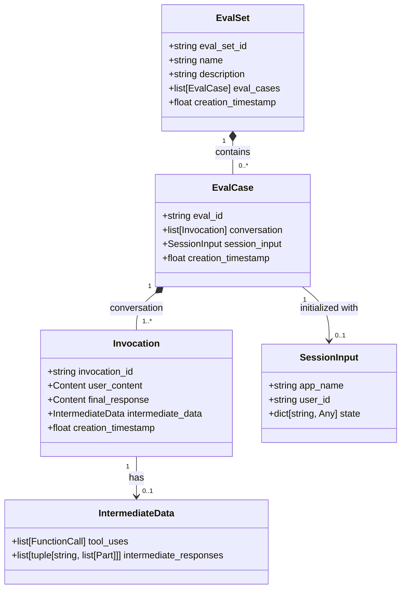
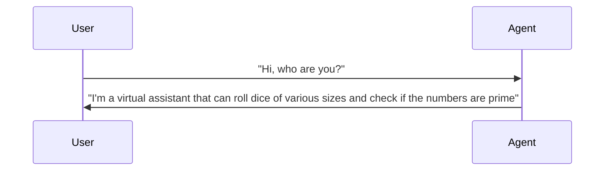
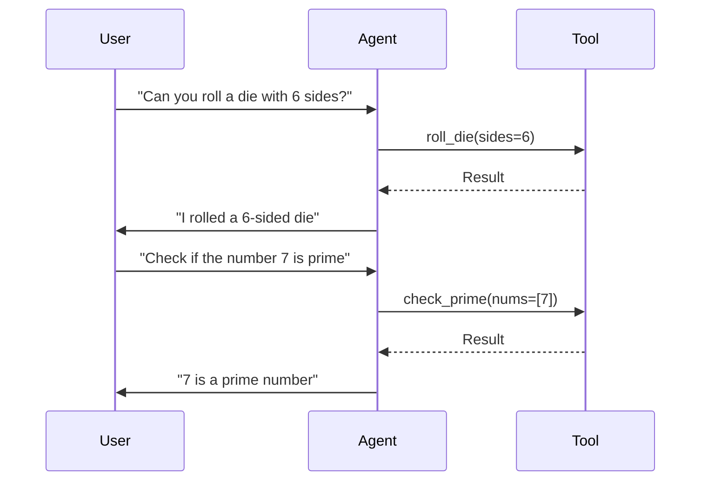
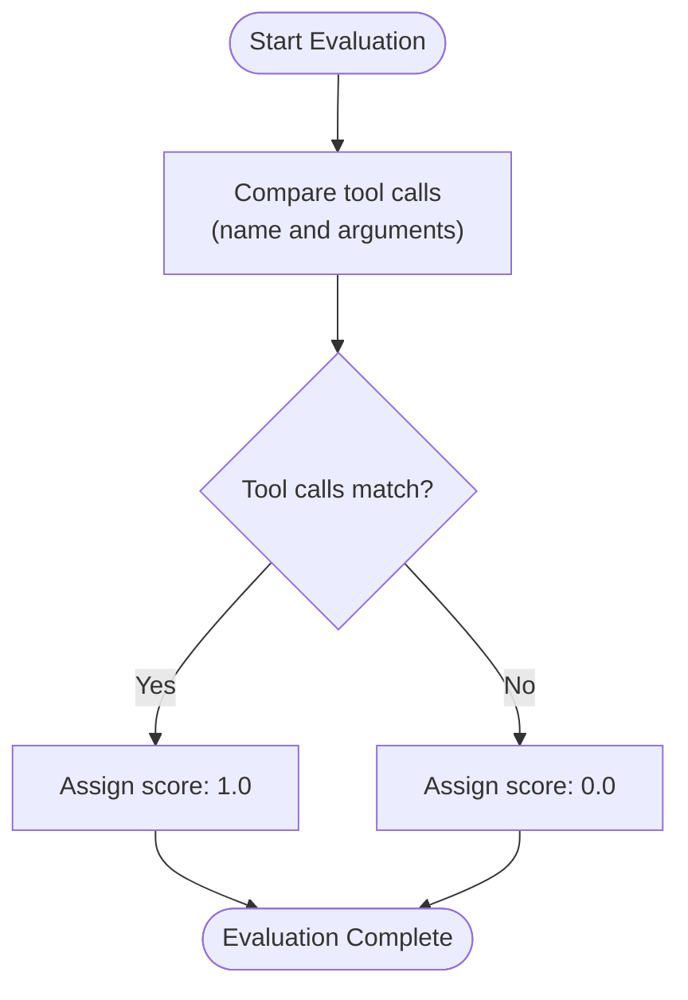
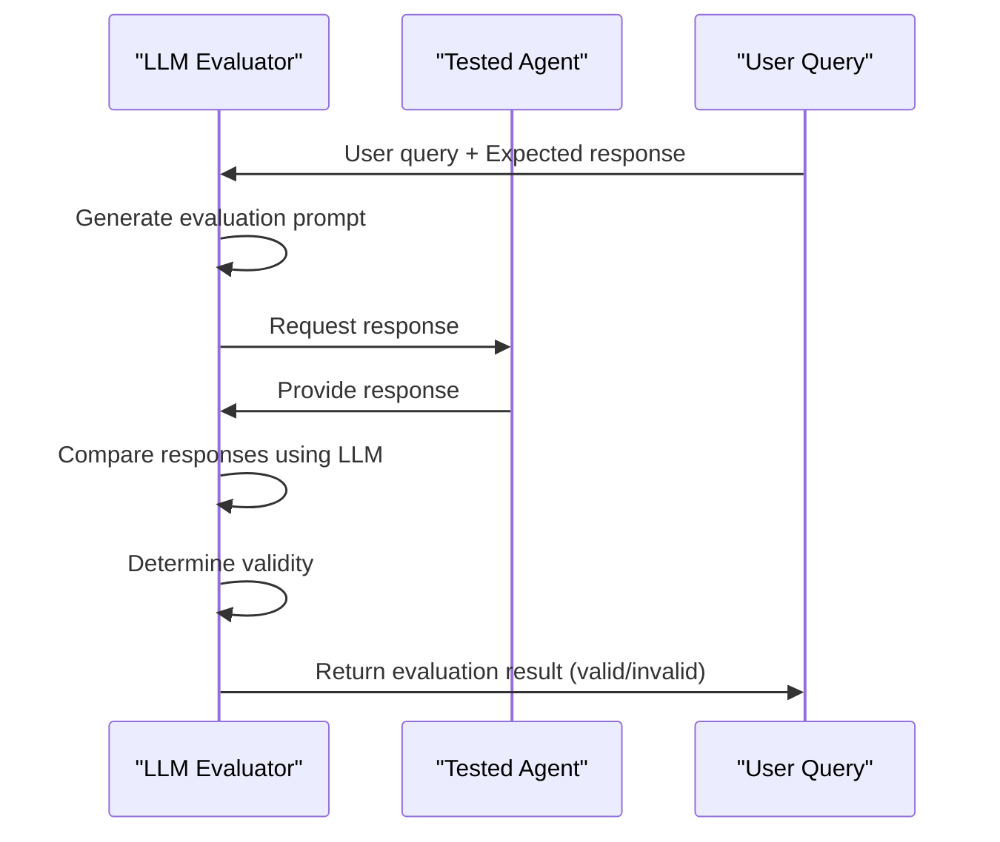
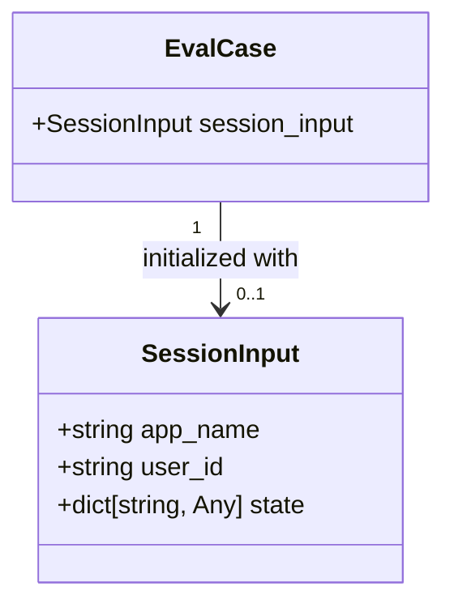

# Test Case Creation

<cite>
**Referenced Files in This Document**   
- [hello_world_eval_set_001.evalset.json](file://samples_for_testing/hello_world/hello_world_eval_set_001.evalset.json)
- [test_config.json](file://samples_for_testing/hello_world/test_config.json)
- [eval_case.py](file://src/google/adk/evaluation/eval_case.py)
- [eval_set.py](file://src/google/adk/evaluation/eval_set.py)
- [evaluator.py](file://src/google/adk/evaluation/evaluator.py)
- [trajectory_evaluator.py](file://src/google/adk/evaluation/trajectory_evaluator.py)
- [final_response_match_v2.py](file://src/google/adk/evaluation/final_response_match_v2.py)
- [llm_as_judge.py](file://src/google/adk/evaluation/llm_as_judge.py)
- [eval_metrics.py](file://src/google/adk/evaluation/eval_metrics.py)
- [evaluation_generator.py](file://src/google/adk/evaluation/evaluation_generator.py)
- [adk_project_overview_and_architecture.md](file://contributing/adk_project_overview_and_architecture.md)
</cite>

## Table of Contents
1. [Introduction](#introduction)
2. [Evaluation File Structure](#evaluation-file-structure)
3. [EvalSet.json Structure](#evalsetjson-structure)
4. [Test Configuration](#test-configuration)
5. [Creating Test Cases](#creating-test-cases)
6. [Assertion Types](#assertion-types)
7. [Testing Agents with Session State](#testing-agents-with-session-state)
8. [Test Organization and Best Practices](#test-organization-and-best-practices)
9. [Conclusion](#conclusion)

## Introduction

The ADK Testing Framework provides a comprehensive system for evaluating agent performance through structured JSON evaluation files. These files define input prompts, expected outputs, and evaluation criteria to systematically test agent behavior across various scenarios. The framework supports both simple single-turn interactions and complex multi-turn conversations with tool calls, enabling thorough validation of agent functionality.

The evaluation process assesses end-to-end performance with live LLMs, focusing on quality rather than simple pass/fail outcomes. Key metrics include tool_trajectory_avg_score (evaluating correct tool usage) and response_match_score (assessing the quality of final answers). Evaluations can be executed through multiple interfaces: the ADK web UI, pytest for CI/CD pipelines, or the adk eval CLI command.

This document provides comprehensive guidance on creating effective test cases, covering the structure of evaluation files, assertion types, session state testing, and best practices for maintaining comprehensive test coverage.

**Section sources**
- [adk_project_overview_and_architecture.md](file://contributing/adk_project_overview_and_architecture.md#L102-L112)

## Evaluation File Structure

The ADK Testing Framework uses two primary file types for test case definition: evalset.json files that contain the evaluation cases and test.json files that specify evaluation criteria. These JSON files work together to define comprehensive test suites for agent evaluation.

The evalset.json file serves as the primary container for test cases, defining a collection of evaluation scenarios with their inputs, expected outputs, and metadata. Each evaluation set has a unique identifier, name, description, and contains multiple evaluation cases. The test.json file complements this by specifying the evaluation criteria and thresholds that determine whether a test passes or fails.

Test files are typically organized in directories corresponding to specific agents or features being tested. For example, the hello_world agent has its evaluation files in the samples_for_testing/hello_world/ directory. This organizational structure allows for logical grouping of related tests and facilitates maintenance as agents evolve.

The framework supports both in-memory and persistent storage for evaluation sets, with the ability to manage test cases programmatically through the evaluation API. This flexibility enables integration with automated testing workflows and continuous integration systems.

**Section sources**
- [hello_world_eval_set_001.evalset.json](file://samples_for_testing/hello_world/hello_world_eval_set_001.evalset.json)
- [test_config.json](file://samples_for_testing/hello_world/test_config.json)

## EvalSet.json Structure

The evalset.json file defines a comprehensive evaluation set with a structured format that captures various aspects of agent interactions. The root structure includes metadata about the evaluation set and a collection of evaluation cases.



**Diagram sources**
- [eval_set.py](file://src/google/adk/evaluation/eval_set.py#L22-L40)
- [eval_case.py](file://src/google/adk/evaluation/eval_case.py#L88-L105)

The EvalSet structure contains several key fields:
- **eval_set_id**: A unique identifier for the evaluation set
- **name**: A human-readable name for the evaluation set
- **description**: Detailed description of the evaluation set's purpose
- **eval_cases**: An array of individual evaluation cases
- **creation_timestamp**: When the evaluation set was created

Each EvalCase represents a single test scenario and contains:
- **eval_id**: Unique identifier for the evaluation case
- **conversation**: An array of Invocation objects representing the interaction sequence
- **session_input**: Optional session initialization data
- **creation_timestamp**: When the evaluation case was created

The Invocation object captures a single turn in the conversation with:
- **invocation_id**: Unique identifier for the invocation
- **user_content**: The user's input message
- **final_response**: The expected final response from the agent
- **intermediate_data**: Tool calls and intermediate responses generated during processing
- **creation_timestamp**: When the invocation occurred

The IntermediateData structure captures tool usage during the agent's response generation, including the chronological sequence of tool calls and any intermediate responses from sub-agents in multi-agent systems.

**Section sources**
- [eval_set.py](file://src/google/adk/evaluation/eval_set.py#L22-L40)
- [eval_case.py](file://src/google/adk/evaluation/eval_case.py#L27-L105)

## Test Configuration

Test configuration files define the evaluation criteria and thresholds that determine whether test cases pass or fail. These JSON files specify the metrics to be evaluated and their acceptable thresholds, providing a standardized way to assess agent performance.

```json
{
  "criteria": {
    "tool_trajectory_avg_score": 0.8,
    "response_match_score": 0.3
  }
}
```

The configuration specifies two primary metrics:
- **tool_trajectory_avg_score**: Measures the accuracy of tool usage with a threshold of 0.8 (80% match required)
- **response_match_score**: Evaluates the similarity of the final response with a threshold of 0.3

These thresholds represent the minimum acceptable performance levels for each metric. The tool_trajectory_avg_score requires a high degree of precision in tool usage (80% match), reflecting the importance of correct tool selection and parameterization. The response_match_score has a lower threshold (30% match), allowing for more flexibility in natural language responses while still ensuring basic correctness.

The criteria are used by the evaluation framework to determine the overall success of test execution. Each metric is evaluated independently, and the test passes only if all specified metrics meet or exceed their thresholds. This approach enables fine-grained control over quality requirements for different aspects of agent behavior.

**Section sources**
- [test_config.json](file://samples_for_testing/hello_world/test_config.json)

## Creating Test Cases

Creating effective test cases involves defining comprehensive evaluation scenarios that cover various interaction patterns, from simple single-turn exchanges to complex multi-turn conversations with tool calls. The ADK framework supports a wide range of test scenarios through its flexible evaluation structure.

### Simple Single-Turn Interactions

For basic functionality testing, single-turn interactions verify that agents respond appropriately to direct queries. These tests focus on the agent's ability to understand user intent and provide relevant responses without requiring complex state management.



This example tests the agent's introduction response, verifying that it correctly identifies its capabilities. The evaluation case specifies both the user input and the expected response, enabling automated validation of the agent's behavior.

### Complex Multi-Turn Conversations

Multi-turn conversations test the agent's ability to maintain context and handle evolving user requests across multiple interactions. These tests are essential for validating conversational flow and context management.



This multi-turn scenario tests two distinct capabilities (dice rolling and prime checking) in sequence, verifying that the agent can handle different tool calls appropriately. The evaluation captures both the expected tool usage and final responses for each turn.

### Tool Call Testing

Tests involving tool calls validate that agents correctly identify when to use tools and provide appropriate parameters. The framework captures the complete tool usage trajectory, enabling precise verification of tool selection and argument passing.

For example, when testing a dice rolling capability:
- User input: "Can you roll a die with 6 sides?"
- Expected tool call: roll_die(sides=6)
- Expected response: "I rolled a 6-sided die"

The evaluation framework compares the actual tool calls against the expected ones, checking both the tool name and all arguments for exact matches. This ensures that agents not only select the correct tool but also provide properly formatted parameters.

**Section sources**
- [hello_world_eval_set_001.evalset.json](file://samples_for_testing/hello_world/hello_world_eval_set_001.evalset.json)
- [eval_case.py](file://src/google/adk/evaluation/eval_case.py#L52-L73)

## Assertion Types

The ADK Testing Framework supports multiple assertion types to validate different aspects of agent behavior, ranging from exact matches to sophisticated LLM-based evaluations. These assertion mechanisms provide flexible ways to verify agent outputs based on the specific requirements of each test scenario.

### Exact Match Assertions

Exact match assertions require perfect correspondence between expected and actual outputs. These are typically used for tool calls and structured data where precision is critical.



The TrajectoryEvaluator implements exact match assertions by comparing tool call trajectories. It verifies that both the tool names and their arguments match exactly between expected and actual invocations. A perfect match receives a score of 1.0, while any discrepancy results in a score of 0.0.

### Substring Match Assertions

Substring match assertions verify that expected content appears within the actual response, allowing for additional context or formatting differences. This approach provides flexibility while ensuring key information is present.

While not explicitly implemented as a separate evaluator, substring matching can be achieved through custom evaluation logic or by using the response_match_score metric with appropriate thresholds. This allows tests to pass as long as the essential information is included, even if the surrounding text varies.

### LLM-as-Judge Evaluations

LLM-as-judge evaluations use a separate LLM to assess the quality and correctness of agent responses. This sophisticated approach enables nuanced evaluation of natural language outputs, considering factors like relevance, coherence, and factual accuracy.



The FinalResponseMatchV2Evaluator implements this approach by:
1. Creating a structured prompt that includes the user query, agent response, and reference (expected) response
2. Submitting this prompt to a judge LLM (default: gemini-2.5-flash)
3. Parsing the judge's response to determine if the agent's output is valid
4. Converting the judgment to a numerical score (1.0 for valid, 0.0 for invalid)

This method allows for flexible evaluation that can accommodate different phrasings and formats while ensuring the core information is correct. The evaluator uses a detailed constitution that guides the judging process, including rules for handling format variations, numerical precision, and unit consistency.

**Section sources**
- [trajectory_evaluator.py](file://src/google/adk/evaluation/trajectory_evaluator.py#L39-L303)
- [final_response_match_v2.py](file://src/google/adk/evaluation/final_response_match_v2.py#L133-L248)
- [llm_as_judge.py](file://src/google/adk/evaluation/llm_as_judge.py#L36-L144)

## Testing Agents with Session State

Testing agents with session state requires configuring appropriate context to ensure consistent and predictable behavior during evaluation. The ADK framework provides mechanisms to initialize session state and test agents under specific contextual conditions.

### Session Input Configuration

The SessionInput structure allows test cases to specify initial state values that are applied when the evaluation begins. This is particularly important for agents that rely on contextual information such as user preferences, application state, or temporal data.



The SessionInput class contains three key fields:
- **app_name**: Identifies the application context
- **user_id**: Specifies the user for whom the session is initialized
- **state**: A dictionary containing arbitrary state values

This structure enables tests to set up specific scenarios by pre-populating session state with required values. For example, a test might initialize the session with today's date, user preferences, or authentication tokens to validate behavior under specific conditions.

### State-Dependent Testing

When testing agents with memory or persistent state, it's essential to consider how previous interactions affect current behavior. The framework supports this through multi-turn evaluation cases that build upon established context.

Tests should include scenarios that:
1. Verify initial state handling
2. Test state transitions across multiple interactions
3. Validate persistence of state between sessions
4. Check proper initialization of default values

The evaluation framework ensures that each test case starts with a clean session state unless explicitly initialized through the session_input field. This isolation prevents test contamination and ensures reliable, repeatable results.

**Section sources**
- [eval_case.py](file://src/google/adk/evaluation/eval_case.py#L75-L87)

## Test Organization and Best Practices

Effective test organization and adherence to best practices are crucial for maintaining comprehensive, readable, and maintainable test suites as agents evolve over time.

### Directory Structure

Organize test files in a logical directory structure that reflects the agent architecture and functionality:

```
tests/
├── hello_world/
│   ├── basic_interactions.evalset.json
│   ├── tool_calls.evalset.json
│   └── multi_turn.evalset.json
├── advanced_agent/
│   ├── session_state.evalset.json
│   ├── error_handling.evalset.json
│   └── integration.evalset.json
└── shared/
    └── common_config.json
```

This structure groups related tests together, making it easier to locate and maintain test cases. Consider organizing tests by:
- Feature area
- Complexity level
- Test type (unit, integration, end-to-end)
- Agent component

### Comprehensive Test Coverage

Ensure comprehensive coverage by including tests for:
- **Happy path scenarios**: Normal operation with expected inputs
- **Edge cases**: Boundary conditions and unusual inputs
- **Error conditions**: Invalid inputs and error recovery
- **Performance**: Response time and resource usage
- **Security**: Input validation and authorization

For each agent capability, create multiple test cases that explore different variations and edge conditions. This approach helps identify corner cases and ensures robust behavior across diverse usage patterns.

### Maintainable Test Design

Write tests that are easy to understand, modify, and extend:

1. **Use descriptive names**: Choose eval_id values that clearly indicate the test purpose
2. **Include documentation**: Add meaningful descriptions to evaluation sets and cases
3. **Group related tests**: Organize similar test cases together in the same evaluation set
4. **Parameterize when possible**: Use configuration files to manage test variations
5. **Avoid duplication**: Extract common patterns into reusable components

### Handling Edge Cases

Pay special attention to edge cases that might reveal subtle bugs:
- Empty or null inputs
- Extremely long inputs
- Special characters and encoding issues
- Rapid successive requests
- Concurrent access scenarios
- Network interruptions and timeouts

Include explicit tests for these conditions to ensure the agent handles them gracefully and provides appropriate responses or error messages.

**Section sources**
- [hello_world_eval_set_001.evalset.json](file://samples_for_testing/hello_world/hello_world_eval_set_001.evalset.json)
- [eval_set.py](file://src/google/adk/evaluation/eval_set.py#L22-L40)

## Conclusion

The ADK Testing Framework provides a robust system for creating comprehensive evaluation tests that assess end-to-end agent performance. By leveraging structured JSON files, the framework enables systematic testing of agent behavior across various scenarios, from simple single-turn interactions to complex multi-turn conversations with tool calls.

Key aspects of effective test case creation include:
- Understanding the evalset.json structure and its components
- Configuring appropriate evaluation criteria and thresholds
- Implementing diverse assertion types for different validation needs
- Testing agents with proper session state and context
- Organizing tests in a maintainable directory structure
- Following best practices for comprehensive coverage and readability

The framework's support for LLM-as-judge evaluations, exact match assertions, and flexible configuration options enables thorough validation of agent capabilities. By following the guidelines outlined in this document, developers can create effective test suites that ensure high-quality agent performance and facilitate reliable evolution of agent functionality over time.