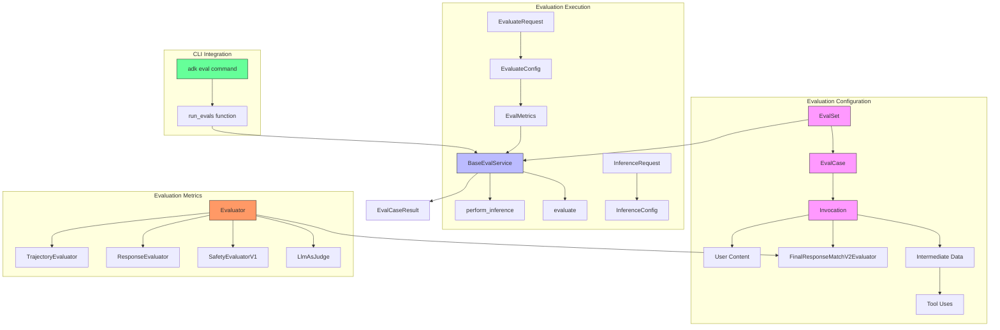
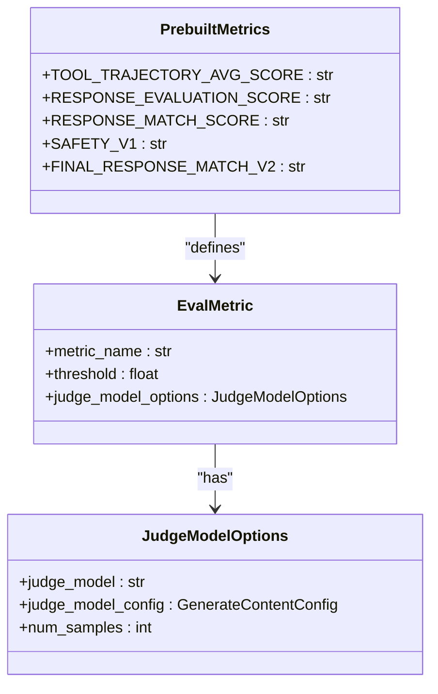
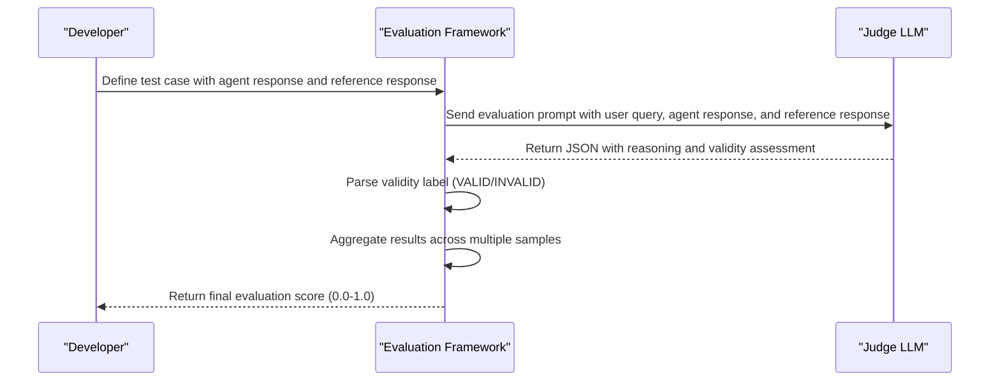
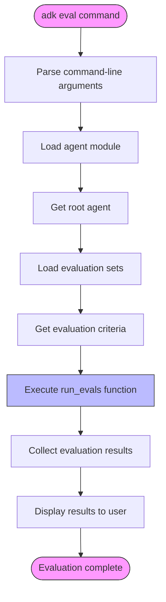

# Testing Framework

<cite>
**Referenced Files in This Document**   
- [cli_eval.py](file://src/google/adk/cli/cli_eval.py)
- [eval_set.py](file://src/google/adk/evaluation/eval_set.py)
- [eval_case.py](file://src/google/adk/evaluation/eval_case.py)
- [eval_metrics.py](file://src/google/adk/evaluation/eval_metrics.py)
- [evaluator.py](file://src/google/adk/evaluation/evaluator.py)
- [base_eval_service.py](file://src/google/adk/evaluation/base_eval_service.py)
- [llm_as_judge.py](file://src/google/adk/evaluation/llm_as_judge.py)
- [trajectory_evaluator.py](file://src/google/adk/evaluation/trajectory_evaluator.py)
- [response_evaluator.py](file://src/google/adk/evaluation/response_evaluator.py)
- [safety_evaluator.py](file://src/google/adk/evaluation/safety_evaluator.py)
- [final_response_match_v2.py](file://src/google/adk/evaluation/final_response_match_v2.py)
- [hello_world_eval_set_001.evalset.json](file://samples_for_testing/hello_world/hello_world_eval_set_001.evalset.json)
- [test_config.json](file://samples_for_testing/hello_world/test_config.json)
</cite>

## Table of Contents
1. [Introduction](#introduction)
2. [Architecture Overview](#architecture-overview)
3. [Evaluation Sets and Test Cases](#evaluation-sets-and-test-cases)
4. [Metrics and Evaluation Methodology](#metrics-and-evaluation-methodology)
5. [LLM-as-Judge Evaluation](#llm-as-judge-evaluation)
6. [CLI Integration](#cli-integration)
7. [Creating Evaluation Files](#creating-evaluation-files)
8. [Running Test Suites](#running-test-suites)
9. [Testing Challenges and Best Practices](#testing-challenges-and-best-practices)
10. [Conclusion](#conclusion)

## Introduction

The ADK Testing Framework provides a comprehensive system for evaluating agent performance and reliability. This framework enables developers to create structured test suites that validate agent behavior across various scenarios, from simple unit tests to complex integration tests involving multi-agent systems. The evaluation system is designed to address the unique challenges of testing AI agents, particularly those involving non-deterministic LLM outputs, tool call verification, and performance benchmarking.

The framework supports multiple evaluation methodologies, including exact matching, similarity scoring, and LLM-as-judge approaches. It provides a flexible architecture that allows for both local testing and integration with cloud-based evaluation services. The system is built around evaluation sets, which contain collections of test cases that define expected agent behaviors under specific conditions.

This documentation covers the complete workflow of using the ADK Testing Framework, from creating evaluation JSON files and defining expected outcomes to running test suites and interpreting results. It also addresses advanced topics such as configuring custom metrics, handling non-deterministic outputs, and implementing best practices for comprehensive test coverage.

## Architecture Overview

The ADK Testing Framework follows a modular architecture with clear separation between evaluation configuration, execution, and result processing. The system is built around several core components that work together to provide a comprehensive testing solution.



**Diagram sources**
- [eval_set.py](file://src/google/adk/evaluation/eval_set.py)
- [eval_case.py](file://src/google/adk/evaluation/eval_case.py)
- [base_eval_service.py](file://src/google/adk/evaluation/base_eval_service.py)
- [evaluator.py](file://src/google/adk/evaluation/evaluator.py)
- [cli_eval.py](file://src/google/adk/cli/cli_eval.py)

The architecture consists of three main layers: configuration, execution, and metrics. The configuration layer defines evaluation sets and test cases using JSON files that specify expected agent behaviors. The execution layer processes these configurations through the evaluation service, which manages the inference and evaluation workflows. The metrics layer contains various evaluators that assess different aspects of agent performance, from tool call accuracy to response quality and safety.

The framework is designed to be extensible, allowing developers to implement custom evaluators and integrate with external services. The CLI integration provides a user-friendly interface for running evaluations, while the underlying API enables programmatic access for automation and integration with CI/CD pipelines.

## Evaluation Sets and Test Cases

Evaluation sets are the fundamental organizational unit in the ADK Testing Framework, containing collections of test cases that validate specific agent behaviors. Each evaluation set is defined in a JSON file with a `.evalset.json` extension and follows a structured schema that specifies the test cases and their expected outcomes.

An evaluation set contains the following key components:
- **eval_set_id**: A unique identifier for the evaluation set
- **name**: A human-readable name for the evaluation set
- **description**: A detailed description of the evaluation set's purpose
- **eval_cases**: An array of individual test cases

Each test case (EvalCase) represents a specific interaction scenario and includes:
- **eval_id**: A unique identifier for the test case
- **conversation**: A sequence of invocations representing the user-agent interaction
- **session_input**: Optional initialization data for the agent's session state

An invocation represents a single turn in the conversation and contains:
- **user_content**: The user's input to the agent
- **final_response**: The expected final response from the agent
- **intermediate_data**: Tool calls and intermediate responses generated during execution
- **tool_uses**: A chronological list of tool calls the agent should make

The framework supports both simple and complex test scenarios. For basic functionality testing, a test case may contain a single invocation with a direct user query and expected response. For more complex scenarios involving multi-step reasoning or tool usage, the conversation can include multiple invocations that test the agent's ability to maintain context and perform sequential operations.

```json
{
  "eval_set_id": "github_copilot_hello_world_eval_set_001",
  "name": "GitHub Copilot Hello World Evaluation Set",
  "description": "Basic evaluation set for GitHub Copilot hello world agent testing dice rolling and prime checking functionality",
  "eval_cases": [
    {
      "eval_id": "github_copilot_hello_world_roll_die",
      "conversation": [
        {
          "invocation_id": "roll_die_test_001",
          "user_content": {
            "parts": [
              {
                "text": "Can you roll a die with 6 sides?"
              }
            ],
            "role": "user"
          },
          "final_response": {
            "parts": [
              {
                "text": "I rolled a 6-sided die"
              }
            ],
            "role": "model"
          },
          "intermediate_data": {
            "tool_uses": [
              {
                "args": {
                  "sides": 6
                },
                "name": "roll_die"
              }
            ]
          }
        }
      ]
    }
  ]
}
```

**Section sources**
- [eval_set.py](file://src/google/adk/evaluation/eval_set.py#L22-L40)
- [eval_case.py](file://src/google/adk/evaluation/eval_case.py#L88-L105)
- [hello_world_eval_set_001.evalset.json](file://samples_for_testing/hello_world/hello_world_eval_set_001.evalset.json)

## Metrics and Evaluation Methodology

The ADK Testing Framework provides a comprehensive set of metrics for evaluating different aspects of agent performance. These metrics are implemented as evaluators that assess specific dimensions of agent behavior, from tool call accuracy to response quality and safety.

The framework supports several built-in metrics through the `PrebuiltMetrics` enum:



**Diagram sources**
- [eval_metrics.py](file://src/google/adk/evaluation/eval_metrics.py#L32-L42)

The primary metrics include:

**Tool Trajectory Score**: This metric evaluates the accuracy of tool calls made by the agent. It performs an exact match on tool names and arguments, scoring 1.0 for perfect matches and 0.0 for mismatches. This is particularly useful for verifying that agents correctly use their available tools in the proper sequence.

**Response Match Score**: This metric assesses how closely the agent's final response matches the expected (golden) response using the Rouge-1 similarity metric. It scores responses on a scale from 0 to 1, with higher values indicating better alignment with the expected output.

**Response Evaluation Score**: This metric evaluates the coherence and quality of the agent's responses using Vertex AI's prebuilt metrics. It scores responses on a scale from 1 to 5, with higher values indicating more coherent and well-structured responses.

**Safety Score**: This metric evaluates the safety and harmlessness of agent responses using Vertex AI's safety evaluation capabilities. It scores responses on a scale from 0 to 1, with higher values indicating safer responses.

Each metric is configured with a threshold value that determines the pass/fail criteria for the evaluation. The framework aggregates results across all metrics to determine the overall evaluation status for each test case.

```python
# Example metric configuration
eval_metrics = [
    EvalMetric(
        metric_name=PrebuiltMetrics.TOOL_TRAJECTORY_AVG_SCORE.value,
        threshold=0.8
    ),
    EvalMetric(
        metric_name=PrebuiltMetrics.RESPONSE_MATCH_SCORE.value,
        threshold=0.3
    )
]
```

**Section sources**
- [eval_metrics.py](file://src/google/adk/evaluation/eval_metrics.py)
- [trajectory_evaluator.py](file://src/google/adk/evaluation/trajectory_evaluator.py)
- [response_evaluator.py](file://src/google/adk/evaluation/response_evaluator.py)
- [safety_evaluator.py](file://src/google/adk/evaluation/safety_evaluator.py)

## LLM-as-Judge Evaluation

The LLM-as-Judge methodology is a sophisticated evaluation approach that uses a large language model to assess the quality and correctness of agent responses. This approach is particularly valuable for evaluating complex responses where simple string matching or similarity scoring may not capture the nuances of correct behavior.

The `FinalResponseMatchV2Evaluator` implements the LLM-as-Judge methodology by using a judge model to compare the agent's response with a reference (golden) response. The evaluator follows a structured process:



**Diagram sources**
- [final_response_match_v2.py](file://src/google/adk/evaluation/final_response_match_v2.py#L132-L248)

The evaluation process involves several key steps:

1. **Prompt Construction**: The framework constructs a detailed prompt that includes the user query, the agent's response, and the reference response. The prompt provides clear instructions to the judge model on how to assess the response validity.

2. **Multiple Sampling**: To account for the non-deterministic nature of LLMs, the evaluation performs multiple samples (default: 5) for each response. This helps to ensure more reliable and consistent evaluation results.

3. **Response Parsing**: The judge model's response is parsed to extract the validity assessment. The framework uses regular expressions to identify the "is_the_agent_response_valid" field in the JSON response and convert it to a standardized label.

4. **Result Aggregation**: The results from multiple samples are aggregated using a majority voting approach. If there is a tie, the result is considered invalid, providing a conservative assessment.

The LLM-as-Judge approach offers several advantages over traditional evaluation methods:

- **Flexibility**: It can handle variations in response format and structure, allowing for valid responses that present information differently from the reference.
- **Context Awareness**: The judge model can understand the semantic meaning of responses, not just their surface-level similarity.
- **Complex Reasoning**: It can evaluate responses that require multi-step reasoning or mathematical calculations by trusting the reference response.

The framework provides extensive configuration options for the LLM-as-Judge evaluator, including the choice of judge model, generation parameters, and the number of evaluation samples. This allows developers to balance evaluation accuracy with computational cost based on their specific requirements.

**Section sources**
- [final_response_match_v2.py](file://src/google/adk/evaluation/final_response_match_v2.py)
- [llm_as_judge.py](file://src/google/adk/evaluation/llm_as_judge.py)

## CLI Integration

The ADK Testing Framework integrates with the CLI through the `adk eval` command, providing a user-friendly interface for running evaluations. The integration is implemented in the `cli_eval.py` module, which serves as the bridge between the command-line interface and the underlying evaluation system.



**Diagram sources**
- [cli_eval.py](file://src/google/adk/cli/cli_eval.py)

The CLI integration supports several key features:

**Command Structure**: The `adk eval` command accepts various arguments to control the evaluation process:
- Agent module path
- Evaluation set files or IDs
- Specific test cases to run
- Configuration file for evaluation criteria

**Evaluation Criteria**: The framework supports both default and custom evaluation criteria. When no configuration file is provided, it uses default thresholds:
```python
DEFAULT_CRITERIA = {
    TOOL_TRAJECTORY_SCORE_KEY: 1.0,
    RESPONSE_MATCH_SCORE_KEY: 0.8,
}
```

The criteria can be customized in a `test_config.json` file:
```json
{
  "criteria": {
    "tool_trajectory_avg_score": 0.8,
    "response_match_score": 0.3
  }
}
```

**Execution Flow**: When the `adk eval` command is executed, it follows this process:
1. Loads the agent module and retrieves the root agent
2. Parses the evaluation sets and test cases to run
3. Retrieves the evaluation criteria from the configuration file or uses defaults
4. Executes the evaluations using the `run_evals` function
5. Streams results to the console in real-time
6. Returns appropriate exit codes based on evaluation success

The integration also supports advanced features like:
- Running specific test cases within an evaluation set
- Parallel execution of multiple evaluations
- Detailed logging and error reporting
- Integration with session and artifact services for stateful evaluations

**Section sources**
- [cli_eval.py](file://src/google/adk/cli/cli_eval.py)
- [test_config.json](file://samples_for_testing/hello_world/test_config.json)

## Creating Evaluation Files

Creating effective evaluation files is essential for comprehensive agent testing. The ADK Testing Framework uses JSON files with specific naming conventions and structure to define evaluation sets and test cases.

### Evaluation Set Structure

Evaluation sets should be saved with the `.evalset.json` extension and follow this structure:

```json
{
  "eval_set_id": "unique_identifier",
  "name": "Human-readable name",
  "description": "Detailed description of the evaluation set",
  "eval_cases": [
    {
      "eval_id": "unique_test_case_id",
      "conversation": [
        {
          "invocation_id": "unique_invocation_id",
          "user_content": { /* User input */ },
          "final_response": { /* Expected response */ },
          "intermediate_data": { /* Tool calls and intermediate responses */ }
        }
      ],
      "session_input": { /* Optional session initialization */ }
    }
  ]
}
```

### Best Practices for Test Case Design

When creating evaluation files, consider the following best practices:

**1. Comprehensive Coverage**: Create test cases that cover various aspects of agent functionality:
- Basic capabilities and introduction
- Core features and tool usage
- Edge cases and error conditions
- Multi-turn conversations and context management

**2. Realistic Scenarios**: Design test cases that reflect real user interactions:
- Use natural language queries
- Include common user intents
- Test ambiguous or incomplete queries
- Verify appropriate error handling

**3. Tool Call Verification**: For agents with tool capabilities, include test cases that verify:
- Correct tool selection
- Proper argument formatting
- Appropriate tool call sequences
- Handling of tool execution results

**4. Response Quality**: Ensure test cases evaluate both the content and quality of responses:
- Accuracy of information
- Clarity and coherence
- Appropriateness for the context
- Safety and harmlessness

### Example Evaluation File

```json
{
  "eval_set_id": "github_copilot_hello_world_eval_set_001",
  "name": "GitHub Copilot Hello World Evaluation Set",
  "description": "Basic evaluation set for GitHub Copilot hello world agent testing dice rolling and prime checking functionality",
  "eval_cases": [
    {
      "eval_id": "github_copilot_hello_world_roll_die",
      "conversation": [
        {
          "invocation_id": "roll_die_test_001",
          "user_content": {
            "parts": [
              {
                "text": "Can you roll a die with 6 sides?"
              }
            ],
            "role": "user"
          },
          "final_response": {
            "parts": [
              {
                "text": "I rolled a 6-sided die"
              }
            ],
            "role": "model"
          },
          "intermediate_data": {
            "tool_uses": [
              {
                "args": {
                  "sides": 6
                },
                "name": "roll_die"
              }
            ]
          }
        }
      ]
    }
  ]
}
```

**Section sources**
- [hello_world_eval_set_001.evalset.json](file://samples_for_testing/hello_world/hello_world_eval_set_001.evalset.json)
- [eval_set.py](file://src/google/adk/evaluation/eval_set.py)
- [eval_case.py](file://src/google/adk/evaluation/eval_case.py)

## Running Test Suites

Running test suites in the ADK Testing Framework involves executing evaluation sets against agents and analyzing the results. The framework provides multiple approaches for running tests, from simple command-line execution to programmatic integration.

### CLI Execution

The primary method for running test suites is through the `adk eval` command:

```bash
# Run all test cases in an evaluation set
adk eval path/to/agent --eval-set path/to/evaluation_set.evalset.json

# Run specific test cases within an evaluation set
adk eval path/to/agent --eval-set path/to/evaluation_set.evalset.json:case1,case2

# Use custom evaluation criteria
adk eval path/to/agent --eval-set path/to/evaluation_set.evalset.json --config test_config.json
```

### Programmatic Execution

For integration with automated testing workflows, the framework provides a programmatic API:

```python
from src.google.adk.cli.cli_eval import run_evals
from src.google.adk.evaluation.eval_set import EvalSet
from src.google.adk.evaluation.eval_metrics import EvalMetric, PrebuiltMetrics

# Load evaluation set
eval_set = EvalSet.parse_file("path/to/evaluation_set.evalset.json")

# Define metrics
eval_metrics = [
    EvalMetric(
        metric_name=PrebuiltMetrics.TOOL_TRAJECTORY_AVG_SCORE.value,
        threshold=0.8
    ),
    EvalMetric(
        metric_name=PrebuiltMetrics.RESPONSE_MATCH_SCORE.value,
        threshold=0.3
    )
]

# Execute evaluations
async for result in run_evals(
    eval_cases_by_eval_set_id={eval_set.eval_set_id: eval_set.eval_cases},
    root_agent=root_agent,
    reset_func=reset_func,
    eval_metrics=eval_metrics
):
    # Process evaluation results
    print(f"Test {result.eval_id}: {result.final_eval_status}")
```

### Test Execution Options

The framework supports several execution options to accommodate different testing scenarios:

**Parallel Execution**: Configure parallelism levels for both inference and evaluation:
```python
InferenceConfig(parallelism=4)
EvaluateConfig(parallelism=4)
```

**Selective Testing**: Run specific evaluation sets or test cases:
- Specify evaluation sets by file path or ID
- Run specific test cases within a set using colon notation
- Combine multiple evaluation sets in a single run

**Result Handling**: The framework provides comprehensive result information:
- Per-test case pass/fail status
- Detailed metric scores and thresholds
- Per-invocation evaluation results
- Session IDs for debugging failed tests

### Integration Testing

For multi-agent systems, the framework supports integration testing by:
- Testing agent-to-agent handoffs
- Verifying context transfer between agents
- Evaluating coordinated behavior across multiple agents
- Testing complex workflows involving multiple agent interactions

**Section sources**
- [cli_eval.py](file://src/google/adk/cli/cli_eval.py#L198-L359)
- [base_eval_service.py](file://src/google/adk/evaluation/base_eval_service.py)

## Testing Challenges and Best Practices

Testing AI agents presents unique challenges due to the non-deterministic nature of large language models and the complexity of agent behaviors. The ADK Testing Framework addresses these challenges with specialized methodologies and best practices.

### Common Testing Challenges

**Non-deterministic Outputs**: LLMs can produce different outputs for the same input, making traditional pass/fail testing difficult. The framework addresses this through:
- Similarity-based metrics (Rouge scores)
- LLM-as-judge evaluation with multiple sampling
- Flexible matching that accounts for equivalent but differently phrased responses

**Tool Call Verification**: Ensuring agents use tools correctly requires careful test design:
- Exact matching of tool names and arguments
- Verification of tool call sequences
- Testing edge cases and error conditions in tool usage

**Performance Benchmarking**: Measuring agent performance involves multiple dimensions:
- Response time and latency
- Token usage and cost efficiency
- Resource consumption during execution
- Scalability under load

### Best Practices for Comprehensive Test Coverage

**1. Layered Testing Approach**: Implement a comprehensive testing strategy that includes:
- **Unit Testing**: Test individual agent capabilities in isolation
- **Integration Testing**: Verify interactions between agents and tools
- **End-to-End Testing**: Validate complete user workflows
- **Regression Testing**: Ensure existing functionality remains intact

**2. Test Case Design Principles**:
- **Atomic Tests**: Each test case should validate a single aspect of functionality
- **Independence**: Test cases should not depend on the state created by other tests
- **Reproducibility**: Tests should produce consistent results across executions
- **Maintainability**: Test files should be well-organized and documented

**3. Handling Non-determinism**:
- Use similarity metrics instead of exact string matching
- Implement LLM-as-judge evaluation for complex responses
- Set appropriate thresholds that account for reasonable variation
- Use multiple evaluation samples to improve reliability

**4. Performance Testing**:
- Measure response times under various conditions
- Monitor token usage and cost implications
- Test with different model configurations
- Evaluate performance with varying input complexity

**5. Maintenance and Evolution**:
- Regularly review and update test cases
- Remove obsolete tests and add new ones for new features
- Document test purpose and expected behavior
- Use version control for test files

**6. Integration with Development Workflow**:
- Run tests as part of CI/CD pipelines
- Set up automated test execution on code changes
- Integrate test results with monitoring and alerting systems
- Use test coverage metrics to guide development priorities

By following these best practices, developers can create robust test suites that ensure agent reliability, maintainability, and performance across various scenarios and use cases.

**Section sources**
- [trajectory_evaluator.py](file://src/google/adk/evaluation/trajectory_evaluator.py)
- [response_evaluator.py](file://src/google/adk/evaluation/response_evaluator.py)
- [final_response_match_v2.py](file://src/google/adk/evaluation/final_response_match_v2.py)
- [base_eval_service.py](file://src/google/adk/evaluation/base_eval_service.py)

## Conclusion

The ADK Testing Framework provides a comprehensive and flexible system for evaluating agent performance and reliability. By combining structured evaluation sets, multiple assessment methodologies, and seamless CLI integration, the framework enables developers to create robust test suites that validate agent behavior across various scenarios.

The architecture supports both simple unit testing of individual agents and complex integration testing of multi-agent systems. Key features like the LLM-as-judge evaluation methodology address the unique challenges of testing AI agents with non-deterministic outputs, while the comprehensive metrics system provides detailed insights into agent performance across multiple dimensions.

The framework's design emphasizes extensibility and integration, allowing developers to customize evaluation criteria, implement custom metrics, and incorporate testing into automated workflows. The clear separation between configuration, execution, and evaluation components makes the system maintainable and adaptable to evolving requirements.

By following the best practices outlined in this documentation, teams can build comprehensive test coverage that ensures agent reliability, safety, and performance. The combination of exact matching, similarity scoring, and LLM-based evaluation provides a robust foundation for validating agent behavior in production environments.

As AI agents become increasingly sophisticated, the importance of rigorous testing grows proportionally. The ADK Testing Framework provides the tools and methodologies needed to ensure that agents perform reliably and safely, delivering consistent value to users while minimizing risks and errors.