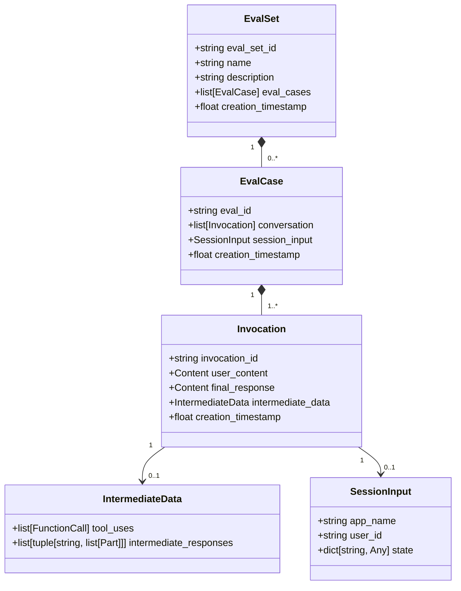
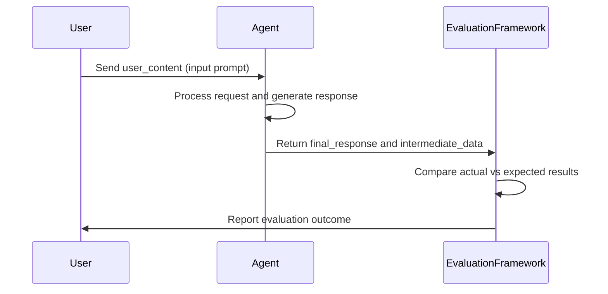
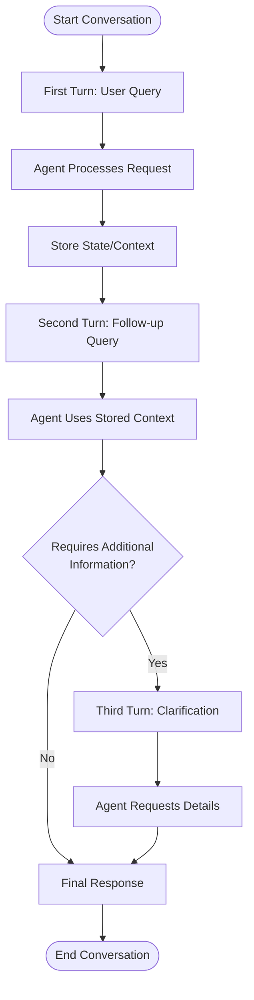
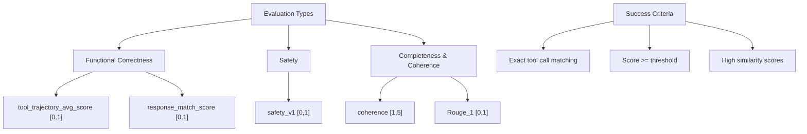

# Creating Test Cases

<cite>
**Referenced Files in This Document**   
- [hello_world_eval_set_001.evalset.json](file://samples_for_testing/hello_world/hello_world_eval_set_001.evalset.json)
- [test_config.json](file://samples_for_testing/hello_world/test_config.json)
- [eval_set.py](file://src/google/adk/evaluation/eval_set.py)
- [eval_case.py](file://src/google/adk/evaluation/eval_case.py)
- [trajectory_evaluator.py](file://src/google/adk/evaluation/trajectory_evaluator.py)
- [response_evaluator.py](file://src/google/adk/evaluation/response_evaluator.py)
- [safety_evaluator.py](file://src/google/adk/evaluation/safety_evaluator.py)
- [evaluation_constants.py](file://src/google/adk/evaluation/evaluation_constants.py)
</cite>

## Table of Contents
1. [Introduction](#introduction)
2. [Evaluation Set Structure](#evaluation-set-structure)
3. [Test Case Composition](#test-case-composition)
4. [Creating Simple Test Scenarios](#creating-simple-test-scenarios)
5. [Creating Complex Test Scenarios](#creating-complex-test-scenarios)
6. [Evaluation Types and Success Criteria](#evaluation-types-and-success-criteria)
7. [Handling LLM Output Variability](#handling-llm-output-variability)
8. [Test Data Representativeness](#test-data-representativeness)
9. [Test Suite Organization](#test-suite-organization)
10. [Best Practices for Test Design](#best-practices-for-test-design)

## Introduction

The ADK framework provides a comprehensive evaluation system for testing agent behavior and performance. This document details the process of creating effective test cases within the ADK framework, focusing on the structure of evaluation sets, test case composition, and best practices for different evaluation scenarios. The evaluation framework enables both functional testing of agent capabilities and quality assessment of end-to-end performance with live LLMs.

**Section sources**
- [adk_project_overview_and_architecture.md](file://contributing/adk_project_overview_and_architecture.md#L102-L112)

## Evaluation Set Structure

An evaluation set in the ADK framework is a JSON file that contains a collection of test cases designed to assess agent performance. The structure follows a hierarchical organization with the evaluation set as the container and individual test cases as its components.

The evaluation set has the following top-level properties:
- **eval_set_id**: A unique identifier for the evaluation set
- **name**: A human-readable name for the evaluation set
- **description**: A detailed description of the evaluation set's purpose
- **eval_cases**: An array of individual test cases
- **creation_timestamp**: The timestamp when the evaluation set was created

Each evaluation set serves as a logical grouping of related test scenarios, allowing for organized testing of specific agent capabilities or features. The evaluation framework supports running these sets through various interfaces including the ADK web UI, pytest for CI/CD pipelines, and the ADK CLI.

**Diagram sources**
- [eval_set.py](file://src/google/adk/evaluation/eval_set.py#L22-L40)
- [eval_case.py](file://src/google/adk/evaluation/eval_case.py#L88-L105)

**Section sources**
- [eval_set.py](file://src/google/adk/evaluation/eval_set.py#L22-L40)
- [hello_world_eval_set_001.evalset.json](file://samples_for_testing/hello_world/hello_world_eval_set_001.evalset.json#L1-L148)

## Test Case Composition

A test case in the ADK framework represents a single evaluation scenario and consists of several key components that define the expected agent behavior. Each test case is structured to capture both the input conditions and the expected output responses.

The core components of a test case include:
- **eval_id**: A unique identifier for the test case
- **conversation**: An array of invocations representing the interaction sequence
- **session_input**: Optional initialization data for the agent's session state
- **creation_timestamp**: The timestamp when the test case was created

The conversation component contains one or more invocations, each representing a single turn in the interaction. Each invocation includes:
- **invocation_id**: A unique identifier for the invocation
- **user_content**: The input prompt from the user
- **final_response**: The expected final response from the agent
- **intermediate_data**: Information about tool usage and intermediate responses

The intermediate_data field captures the agent's internal processing steps, including tool calls and intermediate responses from sub-agents in multi-agent systems. This allows for detailed evaluation of the agent's decision-making process and tool usage patterns.

**Section sources**
- [eval_case.py](file://src/google/adk/evaluation/eval_case.py#L88-L105)
- [hello_world_eval_set_001.evalset.json](file://samples_for_testing/hello_world/hello_world_eval_set_001.evalset.json#L6-L148)

## Creating Simple Test Scenarios

Simple test scenarios in the ADK framework focus on single-turn interactions where the agent responds to a direct user query. These scenarios are ideal for testing basic agent capabilities and straightforward functionality.

To create a simple test scenario, define a test case with a single invocation that includes:
- A clear user_content with a specific prompt
- An expected final_response that matches the desired output
- Appropriate intermediate_data if tool calls are expected

For example, a simple test case might verify that an agent correctly identifies its capabilities when asked "What can you do?". The test would specify the expected response describing the agent's functions. Another example could test a dice-rolling capability, where the user asks the agent to roll a die with a specific number of sides, and the test verifies both the appropriate tool call and the expected response.

Simple test scenarios should focus on atomic functionality, making them easy to understand, maintain, and debug. They serve as the foundation for more complex testing and provide quick feedback on basic agent behavior.

**Diagram sources**
- [hello_world_eval_set_001.evalset.json](file://samples_for_testing/hello_world/hello_world_eval_set_001.evalset.json#L37-L67)
- [eval_case.py](file://src/google/adk/evaluation/eval_case.py#L52-L73)

**Section sources**
- [hello_world_eval_set_001.evalset.json](file://samples_for_testing/hello_world/hello_world_eval_set_001.evalset.json#L37-L67)
- [eval_case.py](file://src/google/adk/evaluation/eval_case.py#L52-L73)

## Creating Complex Test Scenarios

Complex test scenarios in the ADK framework involve multi-turn conversations and state-dependent evaluations that test advanced agent capabilities. These scenarios are essential for evaluating how agents handle context, maintain state, and perform complex reasoning across multiple interactions.

To create complex test scenarios, structure the conversation array with multiple invocations that represent a coherent dialogue. Each subsequent invocation can build upon the context established in previous turns, allowing for testing of:
- Contextual understanding and memory
- State-dependent behavior
- Multi-step reasoning processes
- Tool orchestration across multiple turns

For state-dependent evaluations, utilize the session_input field to initialize the agent's state before the conversation begins. This allows testing of scenarios where the agent's behavior depends on specific initial conditions or previously stored information.

Multi-turn conversations should be designed to test specific workflows or user journeys, such as a complete task that requires multiple steps to accomplish. The intermediate_data field becomes particularly important in these scenarios, as it allows evaluation of the agent's decision-making process and tool usage patterns throughout the conversation.

**Diagram sources**
- [eval_case.py](file://src/google/adk/evaluation/eval_case.py#L94-L96)
- [session_state_agent.py](file://contributing/samples/session_state_agent/agent.py#L80-L160)

**Section sources**
- [eval_case.py](file://src/google/adk/evaluation/eval_case.py#L94-L96)
- [session_state_agent.py](file://contributing/samples/session_state_agent/agent.py#L80-L160)

## Evaluation Types and Success Criteria

The ADK framework supports multiple evaluation types, each with specific success criteria and metrics for assessing different aspects of agent performance. Understanding these evaluation types is crucial for creating effective test cases that provide meaningful insights.

The primary evaluation types include:

### Functional Correctness
This evaluation type focuses on whether the agent performs the requested task correctly. Key metrics include:
- **tool_trajectory_avg_score**: Measures the accuracy of tool usage patterns
- **response_match_score**: Evaluates if the final response matches the expected output

The success criteria for functional correctness typically require exact matches for tool calls (name and arguments) and high similarity scores for text responses.

### Safety Evaluation
This evaluation type assesses whether the agent's responses are safe and harmless. The SafetyEvaluatorV1 class evaluates responses using a metric with a range of [0,1], where values closer to 1 indicate safer responses. This evaluation requires a GCP project and uses Vertex AI's safety assessment capabilities.

### Completeness and Coherence
This evaluation type examines the quality and coherence of the agent's responses. Metrics include:
- **response_evaluation_score**: Measures response coherence on a scale of [1,5]
- **response_match_score**: Uses Rouge_1 metric to evaluate response similarity

Success criteria for completeness should consider both the factual accuracy of the response and its readability and coherence.

**Diagram sources**
- [trajectory_evaluator.py](file://src/google/adk/evaluation/trajectory_evaluator.py#L39-L72)
- [response_evaluator.py](file://src/google/adk/evaluation/response_evaluator.py#L34-L48)
- [safety_evaluator.py](file://src/google/adk/evaluation/safety_evaluator.py#L31-L44)

**Section sources**
- [trajectory_evaluator.py](file://src/google/adk/evaluation/trajectory_evaluator.py#L39-L72)
- [response_evaluator.py](file://src/google/adk/evaluation/response_evaluator.py#L34-L48)
- [safety_evaluator.py](file://src/google/adk/evaluation/safety_evaluator.py#L31-L44)

## Handling LLM Output Variability

LLM output variability presents a significant challenge in test case creation, as the same prompt may yield slightly different responses across multiple executions. The ADK framework provides several strategies for addressing this variability while maintaining meaningful evaluation criteria.

For text responses, use similarity-based metrics like Rouge_1 instead of exact string matching. This allows for minor variations in wording while still assessing whether the core content and meaning are preserved. The response_match_score metric with a reasonable threshold (e.g., 0.3 as shown in test_config.json) accommodates natural language variations.

For tool usage evaluation, the framework employs exact matching of tool names and arguments, as these represent discrete functional calls that should be consistent. The trajectory_evaluator.py implementation compares tool calls for exact matches, ensuring that the agent uses the correct tools with the appropriate parameters.

When defining success criteria, establish appropriate thresholds that balance strictness with practicality. The test_config.json file demonstrates this approach by specifying thresholds for different metrics:
- tool_trajectory_avg_score: 0.8 (80% accuracy required)
- response_match_score: 0.3 (30% similarity threshold)

Consider using multiple evaluation methods in combination to get a comprehensive assessment. For example, combine exact tool call verification with similarity-based response evaluation to ensure both functional correctness and response quality.

**Section sources**
- [test_config.json](file://samples_for_testing/hello_world/test_config.json#L1-L6)
- [trajectory_evaluator.py](file://src/google/adk/evaluation/trajectory_evaluator.py#L120-L132)
- [response_evaluator.py](file://src/google/adk/evaluation/response_evaluator.py#L104-L108)

## Test Data Representativeness

Creating representative test data is essential for ensuring that evaluation results accurately reflect real-world agent performance. Representative test data should mirror the diversity and complexity of actual user interactions.

To achieve representativeness, consider the following principles:
- Include a variety of query types and phrasings for the same intent
- Cover edge cases and boundary conditions
- Represent different user personas and use cases
- Include both simple and complex requests
- Incorporate realistic error conditions and ambiguous queries

The hello_world_eval_set_001.evalset.json demonstrates several representative scenarios, including capability inquiries ("What can you do?"), specific function requests ("Can you roll a die with 6 sides?"), and focused queries ("Check if the number 7 is prime"). This variety ensures comprehensive testing of the agent's capabilities.

When designing test data, analyze actual user interactions if available, and create scenarios that reflect common user patterns and workflows. This approach helps identify potential issues that might not surface with artificially constructed test cases.

**Section sources**
- [hello_world_eval_set_001.evalset.json](file://samples_for_testing/hello_world/hello_world_eval_set_001.evalset.json#L6-L148)
- [readme.md](file://contributing/samples/live_bidi_streaming_multi_agent/readme.md#L39-L43)

## Test Suite Organization

Effective organization of test suites is crucial for maintainability and comprehensive coverage. The ADK framework supports organizing test cases into logical groups based on functionality, complexity, or evaluation type.

Structure test suites according to the following principles:
- Group related test cases into evaluation sets by feature or capability
- Create separate evaluation sets for different evaluation types (functional, safety, performance)
- Organize test files in a directory structure that reflects the application's architecture
- Use consistent naming conventions for evaluation sets and test cases

The evaluation framework allows running specific evaluation sets or the entire suite, enabling targeted testing during development and comprehensive validation in CI/CD pipelines. This flexibility supports both rapid iteration on specific features and thorough regression testing.

Consider creating smoke tests, regression tests, and comprehensive test suites at different levels of granularity. This approach enables efficient testing workflows while ensuring adequate coverage across all agent capabilities.

**Section sources**
- [hello_world_eval_set_001.evalset.json](file://samples_for_testing/hello_world/hello_world_eval_set_001.evalset.json#L1-L148)
- [contributing/samples/](file://contributing/samples/)

## Best Practices for Test Design

Adhering to best practices in test design ensures that evaluation sets are effective, maintainable, and provide meaningful insights into agent performance.

Key best practices include:
- **Atomic test cases**: Focus each test case on a single capability or behavior
- **Clear documentation**: Provide descriptive names and detailed descriptions for evaluation sets and test cases
- **Realistic scenarios**: Design test cases that reflect actual user interactions and workflows
- **Comprehensive coverage**: Ensure test suites cover all critical functionality, edge cases, and error conditions
- **Maintainable structure**: Organize test files and evaluation sets in a logical, consistent manner
- **Appropriate thresholds**: Set evaluation thresholds that balance strictness with practicality
- **Regular updates**: Keep test cases current with evolving agent capabilities and requirements

When creating test cases, start with simple scenarios to verify basic functionality, then progressively build more complex tests that exercise advanced features. This incremental approach helps identify issues early and provides a solid foundation for comprehensive testing.

Regularly review and refine test cases based on evaluation results and changing requirements. This continuous improvement process ensures that the test suite remains effective and relevant throughout the agent's lifecycle.

**Section sources**
- [hello_world_eval_set_001.evalset.json](file://samples_for_testing/hello_world/hello_world_eval_set_001.evalset.json#L1-L148)
- [test_config.json](file://samples_for_testing/hello_world/test_config.json#L1-L6)
- [trajectory_evaluator.py](file://src/google/adk/evaluation/trajectory_evaluator.py#L39-L72)
- [response_evaluator.py](file://src/google/adk/evaluation/response_evaluator.py#L34-L48)