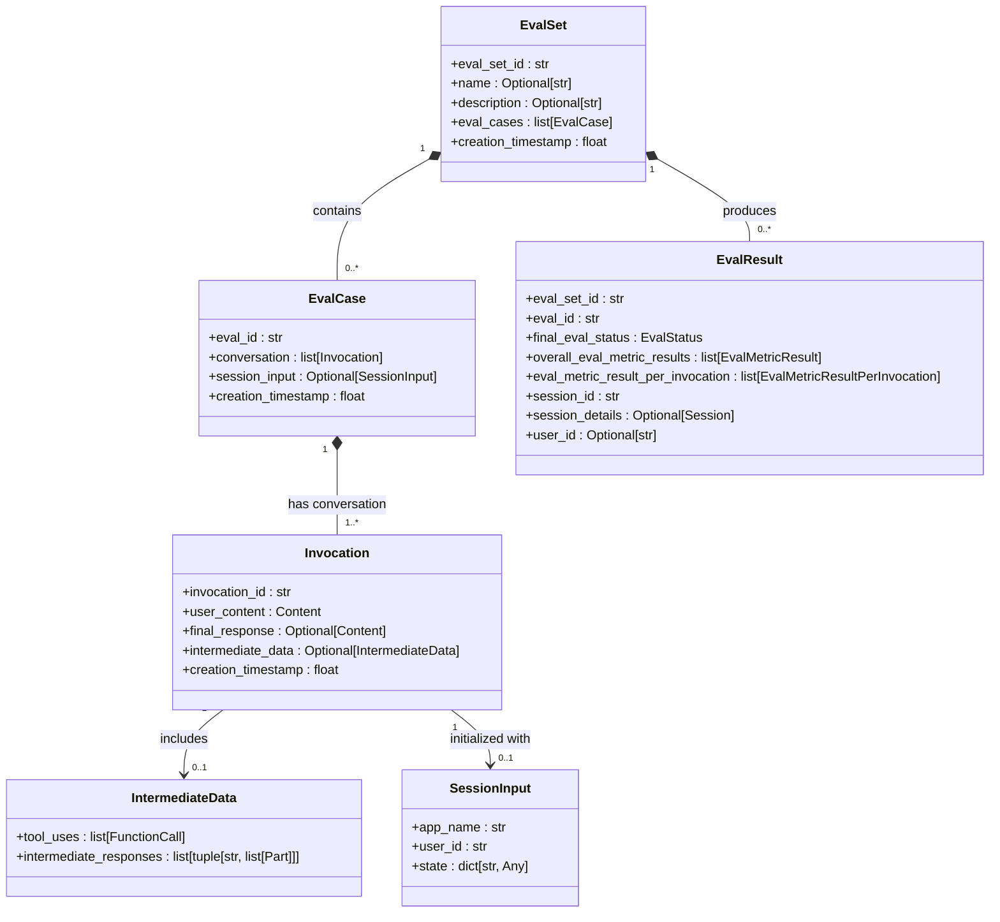
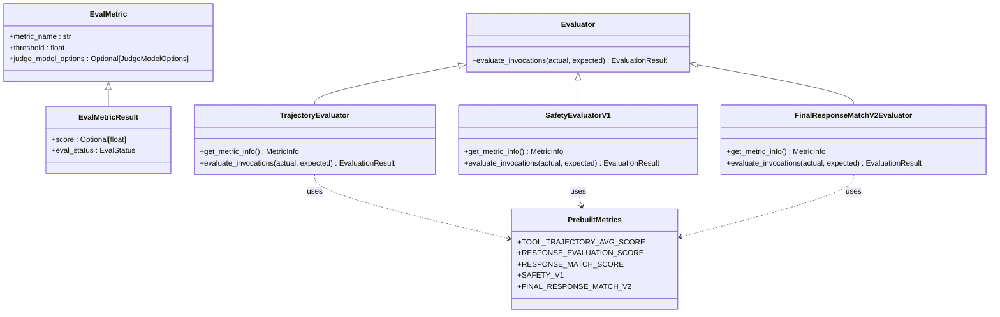
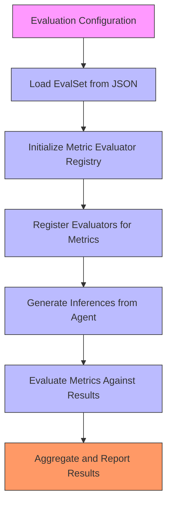
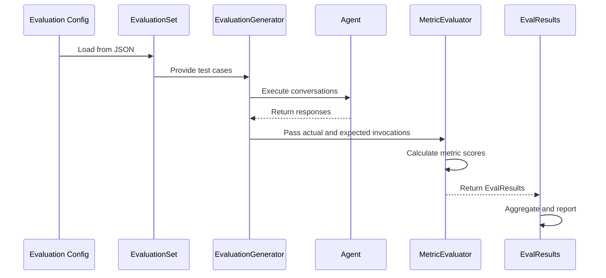

# Evaluation Concepts

<cite>
**Referenced Files in This Document**   
- [eval_set.py](file://src/google/adk/evaluation/eval_set.py)
- [eval_case.py](file://src/google/adk/evaluation/eval_case.py)
- [eval_result.py](file://src/google/adk/evaluation/eval_result.py)
- [eval_metrics.py](file://src/google/adk/evaluation/eval_metrics.py)
- [evaluator.py](file://src/google/adk/evaluation/evaluator.py)
- [trajectory_evaluator.py](file://src/google/adk/evaluation/trajectory_evaluator.py)
- [safety_evaluator.py](file://src/google/adk/evaluation/safety_evaluator.py)
- [final_response_match_v2.py](file://src/google/adk/evaluation/final_response_match_v2.py)
- [metric_evaluator_registry.py](file://src/google/adk/evaluation/metric_evaluator_registry.py)
- [local_eval_service.py](file://src/google/adk/evaluation/local_eval_service.py)
- [evaluation_generator.py](file://src/google/adk/evaluation/evaluation_generator.py)
- [hello_world_eval_set_001.evalset.json](file://samples_for_testing/hello_world/hello_world_eval_set_001.evalset.json)
- [test_config.json](file://samples_for_testing/hello_world/test_config.json)
</cite>

## Table of Contents
1. [Introduction](#introduction)
2. [Domain Model](#domain-model)
3. [Evaluation Metrics](#evaluation-metrics)
4. [Evaluation Configuration and Processing](#evaluation-configuration-and-processing)
5. [Data Flow](#data-flow)
6. [Common Issues and Best Practices](#common-issues-and-best-practices)

## Introduction
The ADK evaluation system provides a comprehensive framework for assessing the performance of AI agents through structured evaluation sets, cases, and results. This document explains the foundational concepts of the evaluation system, including the domain model, available metrics, configuration processing, and data flow from test case definition to result aggregation. The system is designed to be accessible to beginners while providing sufficient technical depth for experienced developers implementing custom evaluation logic.

## Domain Model
The ADK evaluation system is built around three core components: EvaluationSets, EvalCases, and EvalResults. These components form a hierarchical structure that organizes evaluation data and results.

**Diagram sources**
- [eval_set.py](file://src/google/adk/evaluation/eval_set.py#L22-L40)
- [eval_case.py](file://src/google/adk/evaluation/eval_case.py#L88-L105)
- [eval_result.py](file://src/google/adk/evaluation/eval_result.py#L31-L79)

**Section sources**
- [eval_set.py](file://src/google/adk/evaluation/eval_set.py#L22-L40)
- [eval_case.py](file://src/google/adk/evaluation/eval_case.py#L88-L105)
- [eval_result.py](file://src/google/adk/evaluation/eval_result.py#L31-L79)

### EvaluationSets
An EvaluationSet is a collection of evaluation cases that share a common purpose or testing scenario. It serves as the top-level container for organizing related test cases. Each EvaluationSet has a unique identifier (eval_set_id), an optional name and description, and a list of EvalCases. The EvaluationSet structure allows for grouping related test scenarios, making it easier to manage and analyze evaluation results across different aspects of agent functionality.

### EvalCases
An EvalCase represents a single interaction scenario to be evaluated. It contains a conversation consisting of one or more invocations, which represent the exchange between a user and the agent. Each invocation includes the user's input (user_content), the agent's response (final_response), and any intermediate data generated during the interaction, such as tool calls. EvalCases may also include session input to initialize the agent's state for the evaluation. This structure enables testing of both simple single-turn interactions and complex multi-turn conversations.

### EvalResults
EvalResults capture the outcomes of evaluating an EvalCase against one or more metrics. The results include both overall scores for the entire case and per-invocation scores that provide granular feedback on each step of the interaction. Each result contains the evaluation status (passed, failed, or not evaluated), metric scores, and references to the session data generated during evaluation. This comprehensive result structure enables detailed analysis of agent performance, identifying both overall success and specific areas for improvement.

## Evaluation Metrics
The ADK evaluation system provides several built-in metrics for assessing different aspects of agent performance. These metrics are designed to evaluate various dimensions of agent behavior, from exact response matching to safety and trajectory analysis.

**Diagram sources**
- [eval_metrics.py](file://src/google/adk/evaluation/eval_metrics.py#L71-L190)
- [evaluator.py](file://src/google/adk/evaluation/evaluator.py#L49-L59)
- [trajectory_evaluator.py](file://src/google/adk/evaluation/trajectory_evaluator.py#L39-L118)
- [safety_evaluator.py](file://src/google/adk/evaluation/safety_evaluator.py#L31-L73)
- [final_response_match_v2.py](file://src/google/adk/evaluation/final_response_match_v2.py#L133-L248)

**Section sources**
- [eval_metrics.py](file://src/google/adk/evaluation/eval_metrics.py#L32-L43)
- [trajectory_evaluator.py](file://src/google/adk/evaluation/trajectory_evaluator.py#L39-L118)
- [safety_evaluator.py](file://src/google/adk/evaluation/safety_evaluator.py#L31-L73)
- [final_response_match_v2.py](file://src/google/adk/evaluation/final_response_match_v2.py#L133-L248)

### Exact Match Metrics
Exact match metrics evaluate whether the agent's response precisely matches the expected response. The `FINAL_RESPONSE_MATCH_V2` metric uses a large language model as a judge to determine if the agent's final response is valid compared to a golden/expected response. This metric outputs a score between 0 and 1, with values closer to 1 indicating better performance. It is particularly useful for evaluating the correctness of agent responses when there is a clear expected answer. The evaluation uses a majority vote from multiple samples to determine the final score, making it robust against variability in LLM judgments.

### Safety Metrics
The safety metric (`SAFETY_V1`) evaluates the harmlessness of an agent's responses. This metric delegates the evaluation to the Vertex Gen AI Eval SDK and returns a score between 0 and 1, where values closer to 1 indicate safer responses. Using this metric requires a GCP project with appropriate environment variables configured. Safety evaluation is crucial for ensuring that agents do not generate harmful, biased, or inappropriate content, making it an essential component of responsible AI development and deployment.

### Trajectory Metrics
The trajectory metric (`TOOL_TRAJECTORY_AVG_SCORE`) evaluates the accuracy of tool use sequences in agent responses. This metric compares the expected and actual tool call trajectories for the same user interaction, performing an exact match on tool names and arguments for each step. A score of 1.0 indicates a perfect match, while 0.0 indicates a mismatch. This metric is particularly valuable for evaluating agents that use function calling or tool integration, as it verifies that the agent follows the correct sequence of actions to accomplish a task.

## Evaluation Configuration and Processing
Evaluation configurations define the criteria and metrics used to assess agent performance. These configurations are processed through a structured pipeline that generates and evaluates responses against the defined criteria.

**Diagram sources**
- [test_config.json](file://samples_for_testing/hello_world/test_config.json#L1-L6)
- [metric_evaluator_registry.py](file://src/google/adk/evaluation/metric_evaluator_registry.py#L86-L119)
- [local_eval_service.py](file://src/google/adk/evaluation/local_eval_service.py#L64-L388)
- [evaluation_generator.py](file://src/google/adk/evaluation/evaluation_generator.py#L51-L262)

**Section sources**
- [test_config.json](file://samples_for_testing/hello_world/test_config.json#L1-L6)
- [metric_evaluator_registry.py](file://src/google/adk/evaluation/metric_evaluator_registry.py#L86-L119)
- [local_eval_service.py](file://src/google/adk/evaluation/local_eval_service.py#L64-L388)

### Configuration Structure
Evaluation configurations specify the metrics to be used and their thresholds for passing. For example, the test configuration in `test_config.json` defines criteria for the tool trajectory average score (threshold of 0.8) and response match score (threshold of 0.3). These thresholds determine whether an evaluation passes or fails, with higher thresholds indicating stricter requirements. The configuration structure allows for flexible evaluation criteria that can be tailored to different agent capabilities and use cases.

### Processing Pipeline
The evaluation processing pipeline begins with loading an EvaluationSet from a JSON file, which contains the test cases to be evaluated. The system then initializes a Metric Evaluator Registry, which manages the available evaluators for different metrics. Evaluators are registered for each metric specified in the configuration. The pipeline generates inferences from the agent by processing each evaluation case, then evaluates the results against the expected outcomes using the appropriate evaluators. Finally, the results are aggregated and reported, providing both overall scores and detailed per-invocation metrics.

## Data Flow
The data flow in the ADK evaluation system follows a clear sequence from test case definition to result aggregation and reporting. This flow ensures that evaluations are conducted systematically and results are comprehensive.

**Diagram sources**
- [hello_world_eval_set_001.evalset.json](file://samples_for_testing/hello_world/hello_world_eval_set_001.evalset.json#L1-L148)
- [evaluation_generator.py](file://src/google/adk/evaluation/evaluation_generator.py#L51-L262)
- [local_eval_service.py](file://src/google/adk/evaluation/local_eval_service.py#L64-L388)
- [eval_result.py](file://src/google/adk/evaluation/eval_result.py#L31-L79)

**Section sources**
- [hello_world_eval_set_001.evalset.json](file://samples_for_testing/hello_world/hello_world_eval_set_001.evalset.json#L1-L148)
- [evaluation_generator.py](file://src/google/adk/evaluation/evaluation_generator.py#L51-L262)
- [local_eval_service.py](file://src/google/adk/evaluation/local_eval_service.py#L64-L388)

### Test Case Definition
Test cases are defined in JSON format within an EvaluationSet file, such as `hello_world_eval_set_001.evalset.json`. Each test case includes an identifier, a conversation with user inputs and expected responses, and optional session initialization data. The conversation consists of invocations that represent the interaction flow between the user and agent. This structured format allows for precise specification of expected agent behavior across various scenarios.

### Result Aggregation
After evaluation, results are aggregated at multiple levels. The system calculates per-invocation scores for each metric, providing detailed feedback on individual interaction steps. These scores are then aggregated to produce overall case-level results, which determine the final evaluation status (passed or failed). The aggregation process considers all specified metrics and their thresholds, with the final status typically failing if any metric fails. This comprehensive aggregation enables both granular analysis of specific issues and high-level assessment of overall agent performance.

## Common Issues and Best Practices
When working with the ADK evaluation system, several common issues may arise, along with best practices for addressing them.

### Metric Selection
Selecting appropriate metrics depends on the agent's capabilities and the evaluation goals. For agents that use tool calling, the trajectory metric is essential for verifying correct tool usage sequences. For content-focused agents, exact match or response evaluation metrics may be more appropriate. Safety metrics should be included for all agents to ensure responsible behavior. It's recommended to use multiple metrics to get a comprehensive view of agent performance rather than relying on a single metric.

### Threshold Configuration
Threshold values should be set based on the required level of performance and the nature of the task. Stricter thresholds (closer to 1.0) indicate higher performance requirements. For example, a threshold of 0.8 for tool trajectory suggests that 80% of tool calls must match the expected sequence. Thresholds should be adjusted based on testing results and the specific requirements of the use case. Starting with moderate thresholds and adjusting based on initial evaluation results is a practical approach.

### Handling Ambiguous Results
Some evaluation scenarios may have multiple valid responses, making exact matching inappropriate. In such cases, using the LLM-as-judge approach with the `FINAL_RESPONSE_MATCH_V2` metric provides flexibility in assessing response validity. The evaluation prompt for this metric includes guidelines for allowing format flexibility and focusing on key entities rather than exact wording. For ambiguous cases, it's also helpful to include multiple valid responses in the test cases or use human review to validate the evaluation results.