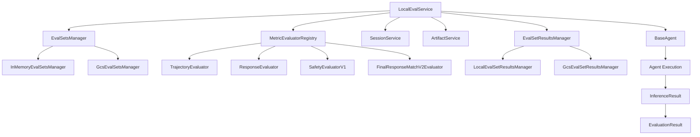
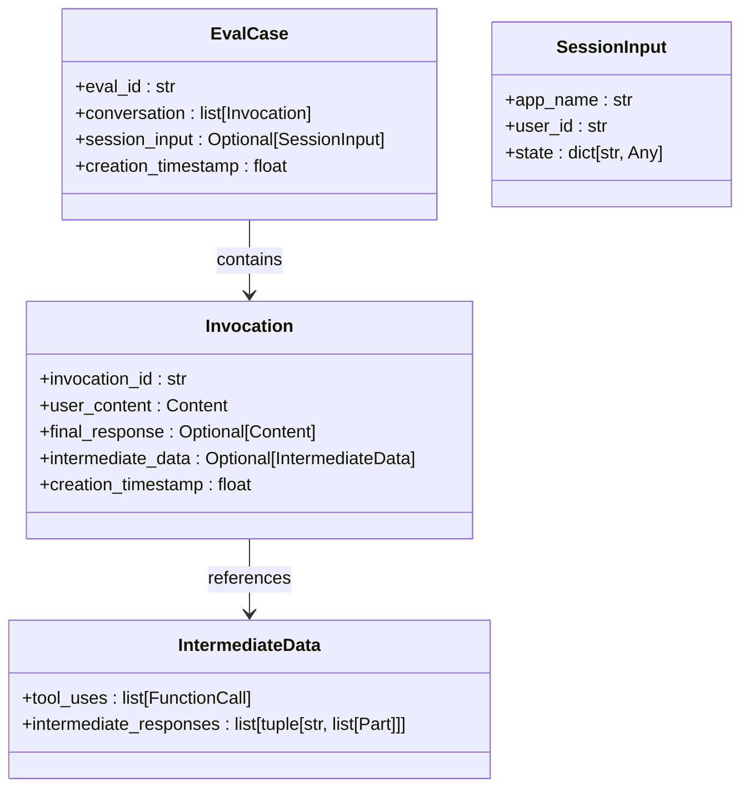
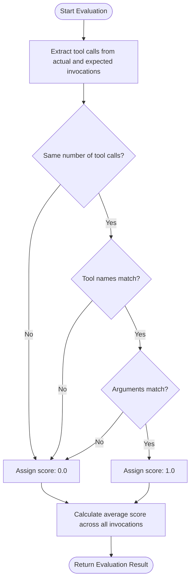
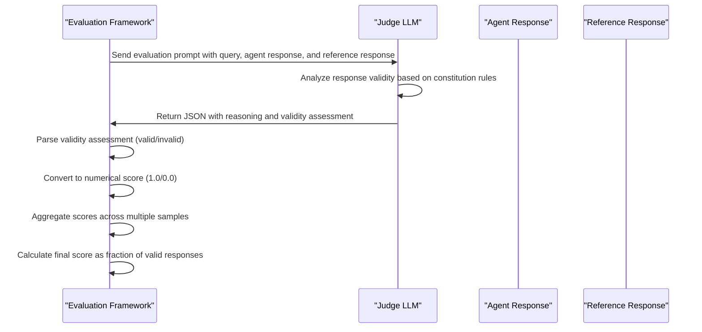
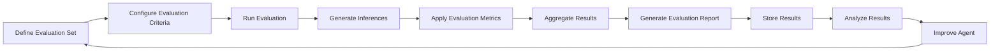
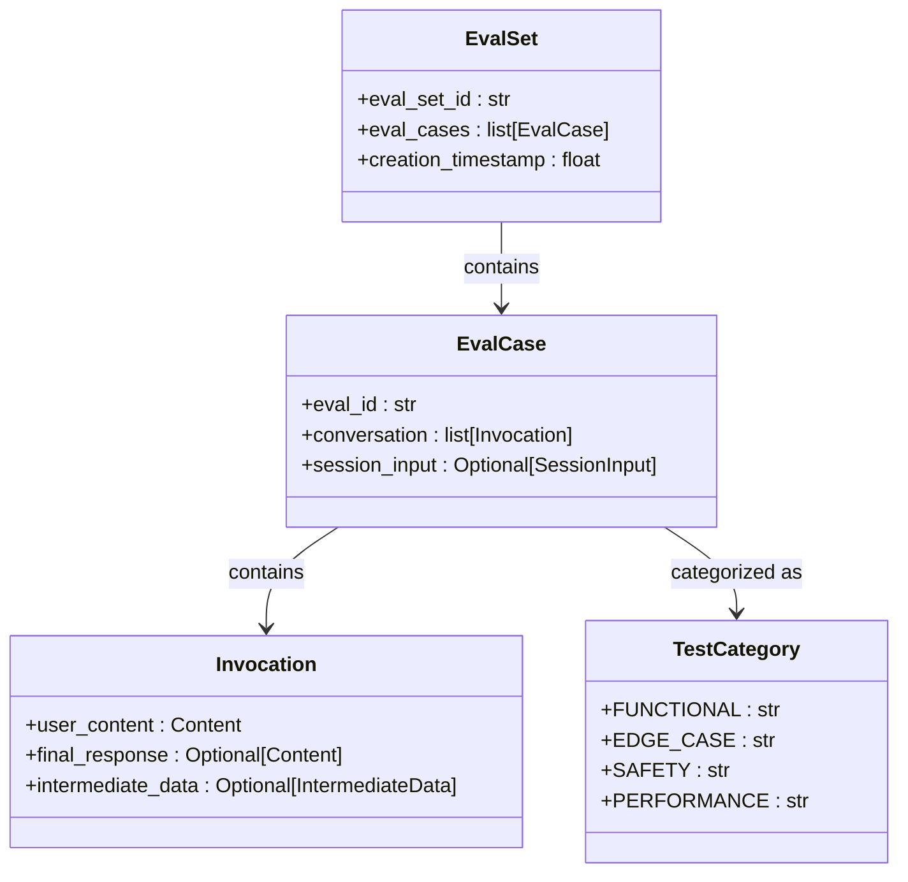
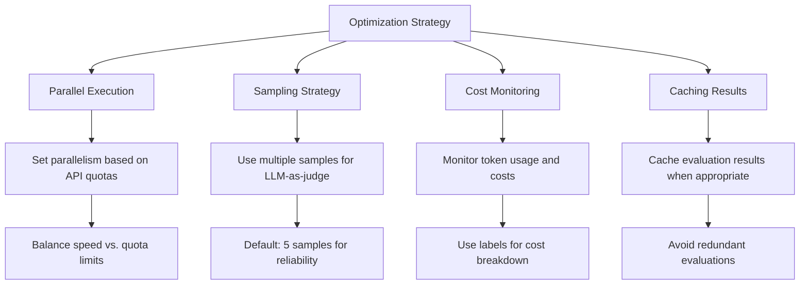

# Evaluation Framework

<cite>
**Referenced Files in This Document**   
- [base_eval_service.py](file://src/google/adk/evaluation/base_eval_service.py)
- [eval_case.py](file://src/google/adk/evaluation/eval_case.py)
- [eval_metrics.py](file://src/google/adk/evaluation/eval_metrics.py)
- [eval_result.py](file://src/google/adk/evaluation/eval_result.py)
- [trajectory_evaluator.py](file://src/google/adk/evaluation/trajectory_evaluator.py)
- [response_evaluator.py](file://src/google/adk/evaluation/response_evaluator.py)
- [safety_evaluator.py](file://src/google/adk/evaluation/safety_evaluator.py)
- [final_response_match_v2.py](file://src/google/adk/evaluation/final_response_match_v2.py)
- [llm_as_judge.py](file://src/google/adk/evaluation/llm_as_judge.py)
- [evaluation_generator.py](file://src/google/adk/evaluation/evaluation_generator.py)
- [local_eval_service.py](file://src/google/adk/evaluation/local_eval_service.py)
- [eval_sets_manager.py](file://src/google/adk/evaluation/eval_sets_manager.py)
- [gcs_eval_sets_manager.py](file://src/google/adk/evaluation/gcs_eval_sets_manager.py)
- [cli_eval.py](file://src/google/adk/cli/cli_eval.py)
- [evals.py](file://src/google/adk/cli/utils/evals.py)
- [hello_world_eval_set_001.evalset.json](file://samples_for_testing/hello_world/hello_world_eval_set_001.evalset.json)
- [test_config.json](file://samples_for_testing/hello_world/test_config.json)
</cite>

## Table of Contents
1. [Introduction](#introduction)
2. [Evaluation System Architecture](#evaluation-system-architecture)
3. [Core Evaluation Components](#core-evaluation-components)
4. [Evaluation Metrics Implementation](#evaluation-metrics-implementation)
5. [LLM-as-Judge Methodology](#llm-as-judge-methodology)
6. [Evaluation Workflow Integration](#evaluation-workflow-integration)
7. [Test Case Design and Management](#test-case-design-and-management)
8. [Performance and Cost Optimization](#performance-and-cost-optimization)
9. [Practical Examples](#practical-examples)
10. [Conclusion](#conclusion)

## Introduction

The Evaluation Framework in the ADK (Agent Development Kit) provides a comprehensive system for testing and validating agent performance through systematic evaluation. This framework ensures agent reliability and quality by implementing a structured approach to assessment that combines automated metrics with LLM-as-judge methodology. The evaluation system enables developers to measure agent behavior against predefined criteria, identify areas for improvement, and ensure consistent performance across various scenarios.

Systematic evaluation is critical in the agent development lifecycle as it provides objective measurements of agent capabilities, reliability, and safety. By establishing standardized evaluation protocols, teams can ensure that agents meet functional requirements, handle edge cases appropriately, and operate within safety constraints. The framework supports both automated metrics for quantifiable measurements and human judgment (or LLM-as-judge) for qualitative assessment of complex behaviors that require contextual understanding.

The evaluation system is designed to integrate seamlessly with the development workflow, enabling continuous improvement through regular assessment. It supports various evaluation strategies, from simple response matching to complex trajectory analysis, allowing teams to select appropriate methods based on their specific use cases and requirements.

**Section sources**
- [base_eval_service.py](file://src/google/adk/evaluation/base_eval_service.py#L1-L202)
- [eval_metrics.py](file://src/google/adk/evaluation/eval_metrics.py#L1-L190)

## Evaluation System Architecture

The ADK evaluation framework follows a modular architecture that separates concerns between evaluation services, metrics, evaluators, and storage managers. This design enables flexibility in evaluation strategies while maintaining consistency in results and reporting.



**Diagram sources**
- [local_eval_service.py](file://src/google/adk/evaluation/local_eval_service.py#L64-L388)
- [eval_sets_manager.py](file://src/google/adk/evaluation/eval_sets_manager.py#L25-L86)
- [gcs_eval_sets_manager.py](file://src/google/adk/evaluation/gcs_eval_sets_manager.py#L1-L100)

The architecture centers around the `LocalEvalService` which implements the `BaseEvalService` interface. This service coordinates the evaluation process by managing interactions between various components. The `EvalSetsManager` handles storage and retrieval of evaluation sets, supporting both in-memory and Google Cloud Storage (GCS) backends. The `MetricEvaluatorRegistry` manages different evaluation strategies, allowing pluggable evaluators for various metrics.

The evaluation process flows from agent execution to inference generation, then to metric evaluation and result aggregation. The service uses asynchronous processing to handle multiple evaluation tasks concurrently, improving efficiency when running large-scale evaluations. Results are stored through the `EvalSetResultsManager`, which provides persistence capabilities and supports both local and cloud-based storage options.

**Section sources**
- [base_eval_service.py](file://src/google/adk/evaluation/base_eval_service.py#L177-L202)
- [local_eval_service.py](file://src/google/adk/evaluation/local_eval_service.py#L64-L388)
- [eval_sets_manager.py](file://src/google/adk/evaluation/eval_sets_manager.py#L25-L86)

## Core Evaluation Components

The evaluation framework consists of several core components that work together to assess agent performance. These components include evaluation cases, metrics, results, and the service interface that orchestrates the evaluation process.

The `EvalCase` class represents a single evaluation scenario, containing a conversation between a user and the agent. Each evaluation case includes a series of invocations, where each invocation captures a user query, the expected agent response, and any tool usage that should occur. The `Invocation` class contains detailed information about each interaction, including user content, final responses, and intermediate data such as tool calls.



**Diagram sources**
- [eval_case.py](file://src/google/adk/evaluation/eval_case.py#L88-L105)
- [eval_case.py](file://src/google/adk/evaluation/eval_case.py#L52-L73)

The `EvalMetric` class defines the structure for evaluation metrics, specifying the metric name, threshold, and optional judge model configurations. Each metric produces an `EvalMetricResult` containing the computed score and evaluation status. The `EvalCaseResult` aggregates results across multiple metrics and invocations, providing both per-invocation details and overall evaluation status.

The framework uses a service-oriented approach with the `BaseEvalService` defining the contract for evaluation operations. The `perform_inference` method generates agent responses for evaluation cases, while the `evaluate` method computes metric scores and produces comprehensive evaluation results. This separation allows for different implementations of the evaluation service while maintaining a consistent interface.

**Section sources**
- [eval_case.py](file://src/google/adk/evaluation/eval_case.py#L1-L105)
- [eval_metrics.py](file://src/google/adk/evaluation/eval_metrics.py#L71-L114)
- [eval_result.py](file://src/google/adk/evaluation/eval_result.py#L31-L92)
- [base_eval_service.py](file://src/google/adk/evaluation/base_eval_service.py#L177-L202)

## Evaluation Metrics Implementation

The ADK framework provides several built-in evaluation metrics that assess different aspects of agent performance. These metrics are implemented as evaluator classes that inherit from the base `Evaluator` class and implement the `evaluate_invocations` method.

The `TrajectoryEvaluator` assesses the accuracy of tool usage by comparing the sequence of tool calls made by the agent against the expected trajectory. This evaluator performs an exact match on tool names and arguments, assigning a score of 1.0 for perfect matches and 0.0 for mismatches. The overall score is calculated as the average accuracy across all invocations in an evaluation case.



**Diagram sources**
- [trajectory_evaluator.py](file://src/google/adk/evaluation/trajectory_evaluator.py#L39-L303)

The `ResponseEvaluator` supports two types of response assessment: coherence scoring and response matching. For coherence evaluation, it leverages Vertex AI's prebuilt metrics to assess the quality of agent responses on a 1-5 scale. For response matching, it uses the ROUGE-1 metric to compare the similarity between the agent's response and a reference (golden) response, producing a score between 0 and 1.

The `SafetyEvaluatorV1` delegates safety assessment to Vertex AI's evaluation capabilities, measuring the harmlessness of agent responses on a 0-1 scale where higher values indicate safer responses. This metric is particularly important for ensuring that agents do not generate harmful or inappropriate content.

**Section sources**
- [trajectory_evaluator.py](file://src/google/adk/evaluation/trajectory_evaluator.py#L39-L303)
- [response_evaluator.py](file://src/google/adk/evaluation/response_evaluator.py#L34-L115)
- [safety_evaluator.py](file://src/google/adk/evaluation/safety_evaluator.py#L31-L73)

## LLM-as-Judge Methodology

The LLM-as-judge methodology in the ADK framework enables sophisticated evaluation of agent responses by leveraging large language models as automated raters. This approach is particularly valuable for assessing complex qualitative aspects of agent behavior that are difficult to measure with traditional metrics.

The `FinalResponseMatchV2Evaluator` implements this methodology by using an LLM to judge whether an agent's response is valid compared to a reference response. The evaluator formats a prompt that includes the user query, agent response, and reference response, then asks the LLM to determine if the agent response is valid. The prompt includes detailed instructions on how to evaluate responses, allowing for flexibility in format while ensuring correctness of content.



**Diagram sources**
- [final_response_match_v2.py](file://src/google/adk/evaluation/final_response_match_v2.py#L133-L248)
- [llm_as_judge.py](file://src/google/adk/evaluation/llm_as_judge.py#L36-L144)

The evaluation process involves multiple steps: prompt formatting, response generation, score conversion, and result aggregation. The `format_auto_rater_prompt` method constructs the evaluation prompt by inserting the user query, agent response, and reference response into a template. The `convert_auto_rater_response_to_score` method parses the LLM's JSON response to extract the validity assessment and convert it to a numerical score.

To improve reliability, the framework supports multiple sampling where the same evaluation is performed several times (default: 5 samples) and results are aggregated through majority voting. This approach reduces the impact of randomness in LLM outputs and produces more stable evaluation scores. The final score represents the fraction of valid responses across all samples, providing a continuous measure of response quality.

**Section sources**
- [final_response_match_v2.py](file://src/google/adk/evaluation/final_response_match_v2.py#L133-L248)
- [llm_as_judge.py](file://src/google/adk/evaluation/llm_as_judge.py#L36-L144)

## Evaluation Workflow Integration

The evaluation system integrates with the development workflow through command-line interfaces and programmatic APIs, enabling seamless testing and validation throughout the agent development lifecycle. The integration supports both automated testing in CI/CD pipelines and interactive evaluation during development.

The CLI provides commands for running evaluations, with configuration options specified through JSON files. The `test_config.json` file defines evaluation criteria, including thresholds for different metrics. When no configuration file is provided, the system uses default criteria with a 1.0 threshold for tool trajectory accuracy and 0.8 for response matching.



**Diagram sources**
- [cli_eval.py](file://src/google/adk/cli/cli_eval.py#L1-L359)
- [evals.py](file://src/google/adk/cli/utils/evals.py#L1-L232)

The evaluation workflow begins with defining an evaluation set in JSON format, where each evaluation case specifies the user queries and expected responses. The system then generates inferences by running the agent against these queries, capturing the actual responses and tool usage. Multiple evaluation metrics are applied to compare actual and expected behavior, producing detailed results at both the invocation and case levels.

Results are stored through the `EvalSetResultsManager`, which supports both local and cloud-based storage. The system provides detailed output during evaluation execution, indicating whether each test case passes or fails based on the configured thresholds. This immediate feedback enables developers to quickly identify and address issues in agent behavior.

**Section sources**
- [cli_eval.py](file://src/google/adk/cli/cli_eval.py#L1-L359)
- [evals.py](file://src/google/adk/cli/utils/evals.py#L1-L232)
- [test_config.json](file://samples_for_testing/hello_world/test_config.json)

## Test Case Design and Management

Effective test case design is critical for comprehensive agent evaluation. The ADK framework supports structured test case management through evaluation sets that can be stored in JSON format and managed through the `EvalSetsManager` interface.

Evaluation sets should cover three key areas: functional requirements, edge cases, and safety considerations. Functional test cases verify that the agent correctly handles expected inputs and produces appropriate responses. Edge case tests examine behavior with unusual or boundary conditions, such as malformed inputs, ambiguous queries, or requests outside the agent's capabilities. Safety tests ensure the agent responds appropriately to potentially harmful or inappropriate content.



**Diagram sources**
- [eval_set.py](file://src/google/adk/evaluation/eval_set.py#L1-L50)
- [eval_case.py](file://src/google/adk/evaluation/eval_case.py#L88-L105)

The framework supports hierarchical organization of test cases through evaluation sets, allowing teams to group related tests and run them collectively. Each evaluation case can specify session initialization parameters, enabling tests that depend on specific agent states or configurations. This capability is particularly useful for testing agents with memory or stateful behavior.

Test cases can be created manually or generated from existing agent sessions using the `convert_session_to_eval_invocations` utility. This feature enables teams to convert successful interactions into test cases, ensuring that the agent can reproduce desired behaviors. The system also supports updating and deleting test cases, providing flexibility in test suite maintenance.

**Section sources**
- [eval_set.py](file://src/google/adk/evaluation/eval_set.py#L1-L50)
- [eval_case.py](file://src/google/adk/evaluation/eval_case.py#L88-L105)
- [evals.py](file://src/google/adk/cli/utils/evals.py#L124-L197)

## Performance and Cost Optimization

Running large-scale evaluations can be resource-intensive, particularly when using LLM-as-judge methodologies. The ADK framework includes several features to optimize performance and minimize evaluation costs.

The framework supports parallel execution of evaluation tasks through configurable parallelism settings. The `InferenceConfig` and `EvaluateConfig` classes include parallelism parameters that control the number of concurrent operations. While higher parallelism improves evaluation speed, it must be balanced against API rate limits and quota constraints. The documentation recommends considering model SLAs and tool limitations when setting parallelism values.



**Diagram sources**
- [base_eval_service.py](file://src/google/adk/evaluation/base_eval_service.py#L45-L54)
- [base_eval_service.py](file://src/google/adk/evaluation/base_eval_service.py#L71-L82)

For LLM-as-judge evaluations, the framework implements a sampling strategy that balances reliability with cost. By default, each evaluation is performed five times with results aggregated through majority voting. This approach reduces the impact of LLM randomness while controlling costs by limiting the number of samples. Teams can adjust the sample count based on their reliability requirements and budget constraints.

The system supports cost monitoring through labels that can be attached to evaluation requests. These labels enable teams to track and analyze billing data, breaking down costs by application, evaluation type, or other dimensions. This visibility helps organizations optimize their evaluation strategies and allocate resources effectively.

**Section sources**
- [base_eval_service.py](file://src/google/adk/evaluation/base_eval_service.py#L33-L83)
- [final_response_match_v2.py](file://src/google/adk/evaluation/final_response_match_v2.py#L82-L83)

## Practical Examples

The ADK framework includes practical examples that demonstrate how to create and run evaluations. The hello_world sample provides a complete evaluation set that can be used as a template for developing custom tests.

To create an evaluation set, define a JSON file with the `.evalset.json` extension containing an array of evaluation cases. Each case specifies an ID, conversation history, and expected behavior. The conversation consists of invocations with user content and expected responses, including tool usage when applicable.

```json
{
  "eval_set_id": "hello_world_eval_set_001",
  "eval_cases": [
    {
      "eval_id": "greeting_001",
      "conversation": [
        {
          "user_content": {
            "parts": [
              {
                "text": "Hello, how are you?"
              }
            ],
            "role": "user"
          },
          "final_response": {
            "parts": [
              {
                "text": "Hello! I'm doing well, thank you for asking."
              }
            ],
            "role": "model"
          }
        }
      ]
    }
  ]
}
```

To run evaluations, use the CLI command with the agent module path and evaluation set specification:

```bash
adk eval run --agent-module-path samples_for_testing.hello_world --eval-sets hello_world_eval_set_001
```

The system will generate inferences by running the agent against the test cases, then apply the configured metrics to produce evaluation results. Results are displayed in real-time, showing whether each test passes or fails based on the specified criteria.

For more complex scenarios, create a test configuration file that specifies custom thresholds for different metrics:

```json
{
  "criteria": {
    "tool_trajectory_avg_score": 1.0,
    "response_match_score": 0.85,
    "safety_v1": 0.9
  }
}
```

This configuration ensures that tool usage must be perfect, responses must closely match the reference (85% similarity), and safety scores must exceed 0.9.

**Section sources**
- [hello_world_eval_set_001.evalset.json](file://samples_for_testing/hello_world/hello_world_eval_set_001.evalset.json)
- [test_config.json](file://samples_for_testing/hello_world/test_config.json)
- [cli_eval.py](file://src/google/adk/cli/cli_eval.py#L1-L359)

## Conclusion

The Evaluation Framework in the ADK provides a comprehensive system for testing and validating agent performance through systematic evaluation. By combining automated metrics with LLM-as-judge methodology, the framework enables thorough assessment of agent behavior across functional, edge case, and safety dimensions.

The modular architecture supports flexible evaluation strategies while maintaining consistency in results and reporting. The integration with development workflows enables continuous improvement through regular assessment, helping teams ensure agent reliability and quality. With support for both local and cloud-based storage, parallel execution, and cost optimization features, the framework scales from individual development to large-scale production testing.

By following best practices in test case design and leveraging the framework's capabilities, teams can build confidence in their agents' performance and ensure they meet the highest standards of reliability, accuracy, and safety.