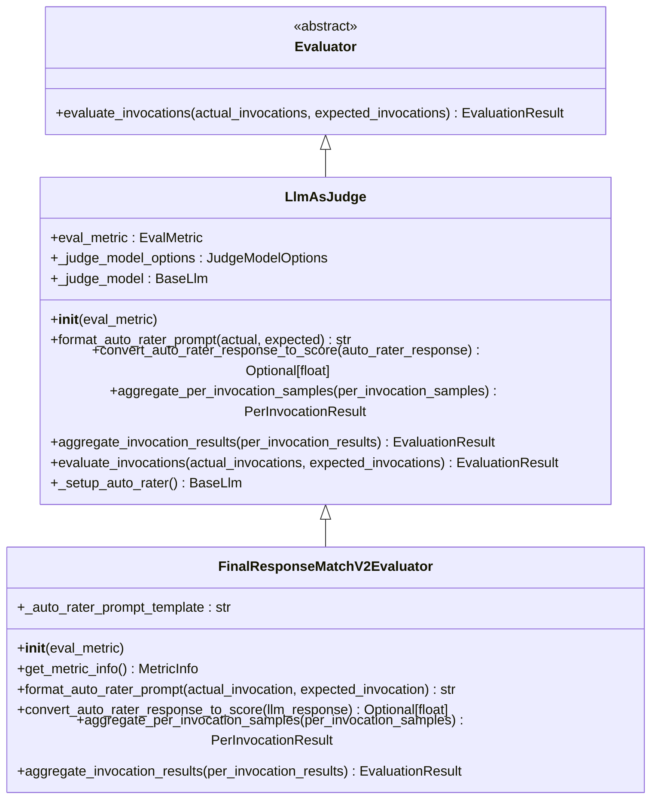
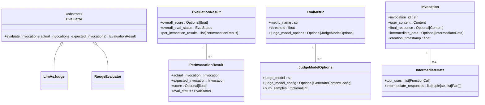
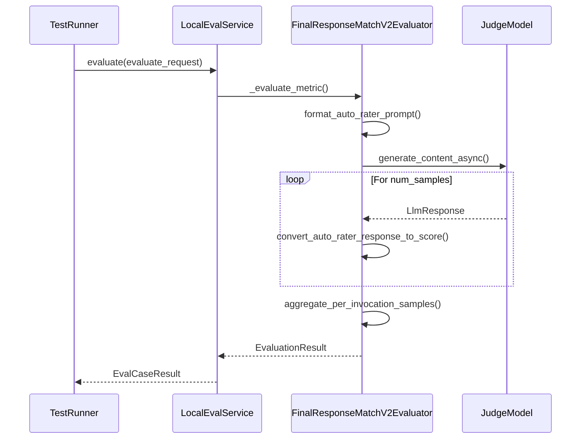
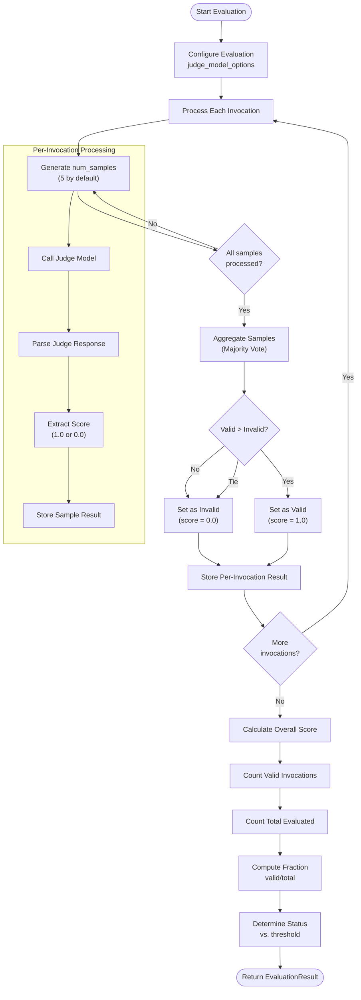
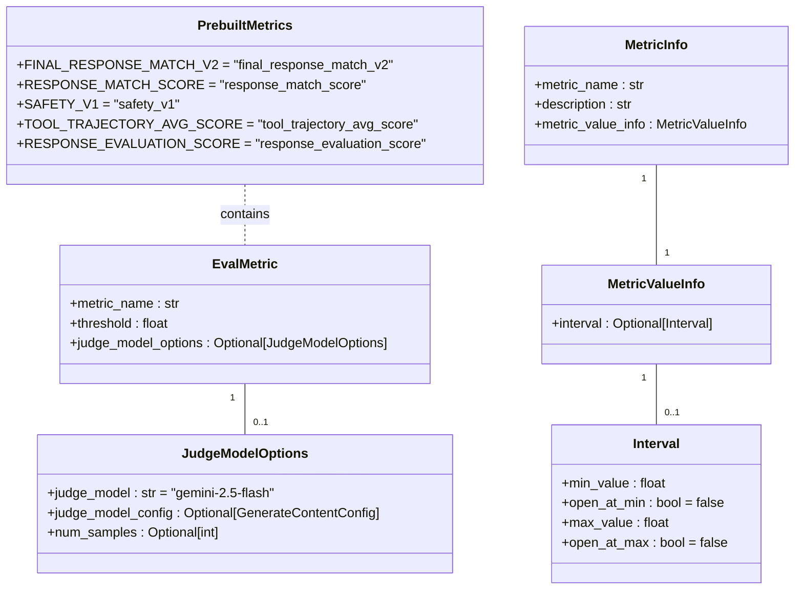
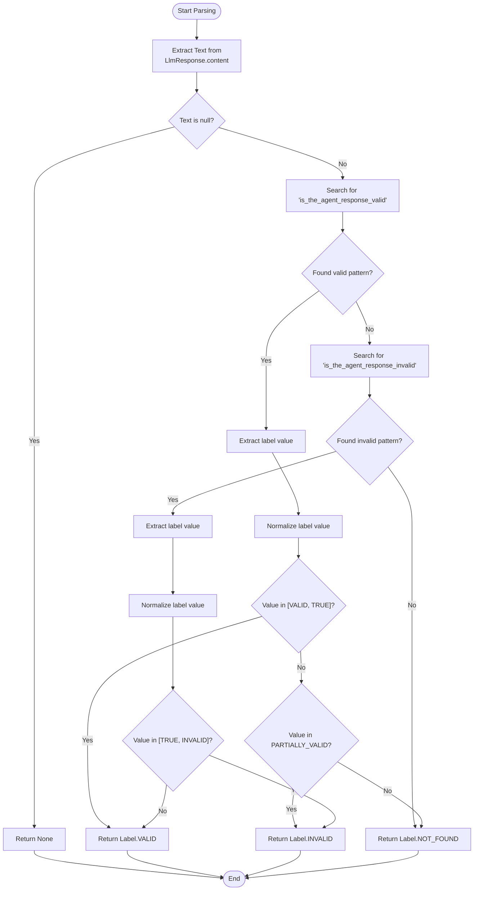

# LLM-as-Judge Evaluation

<cite>
**Referenced Files in This Document**   
- [llm_as_judge.py](file://src/google/adk/evaluation/llm_as_judge.py)
- [llm_as_judge_utils.py](file://src/google/adk/evaluation/llm_as_judge_utils.py)
- [final_response_match_v2.py](file://src/google/adk/evaluation/final_response_match_v2.py)
- [final_response_match_v1.py](file://src/google/adk/evaluation/final_response_match_v1.py)
- [eval_metrics.py](file://src/google/adk/evaluation/eval_metrics.py)
- [evaluator.py](file://src/google/adk/evaluation/evaluator.py)
- [eval_case.py](file://src/google/adk/evaluation/eval_case.py)
- [metric_evaluator_registry.py](file://src/google/adk/evaluation/metric_evaluator_registry.py)
- [local_eval_service.py](file://src/google/adk/evaluation/local_eval_service.py)
</cite>

## Table of Contents
1. [Introduction](#introduction)
2. [LLM-as-Judge Implementation](#llm-as-judge-implementation)
3. [Evaluator Architecture](#evaluator-architecture)
4. [Final Response Match V2 Evaluator](#final-response-match-v2-evaluator)
5. [Prompt Template Design](#prompt-template-design)
6. [Scoring and Aggregation](#scoring-and-aggregation)
7. [Evaluation Metrics Configuration](#evaluation-metrics-configuration)
8. [Response Parsing and Validation](#response-parsing-and-validation)
9. [Comparison of Evaluation Methods](#comparison-of-evaluation-methods)
10. [Best Practices and Recommendations](#best-practices-and-recommendations)

## Introduction

The LLM-as-Judge evaluation framework in the ADK (Agent Development Kit) provides a sophisticated approach to assessing agent performance by leveraging large language models as evaluators. This methodology enables nuanced assessment of agent responses by using specialized LLM judges that can understand context, evaluate correctness, and provide reliable scoring. The framework supports both automated metrics and LLM-based evaluation approaches, allowing for comprehensive assessment of agent capabilities.

The core concept involves using a dedicated LLM (the "judge" model) to evaluate the responses generated by an agent under test. The judge model is provided with the user query, the agent's response, and a reference (golden) response, then asked to determine whether the agent's response is valid according to specific criteria. This approach offers significant advantages over simple string matching or automated metrics, as it can understand semantic equivalence, handle variations in response format, and make nuanced judgments about response quality.

**Section sources**
- [llm_as_judge.py](file://src/google/adk/evaluation/llm_as_judge.py#L1-L144)
- [final_response_match_v2.py](file://src/google/adk/evaluation/final_response_match_v2.py#L1-L248)

## LLM-as-Judge Implementation

The LLM-as-Judge implementation in ADK is built around an extensible class hierarchy that allows for the creation of specialized evaluators. The core component is the `LlmAsJudge` abstract base class, which defines the interface and common functionality for all LLM-based evaluators.

The `LlmAsJudge` class serves as the foundation for all LLM-based evaluation in the framework. It handles the setup of the judge model, manages the evaluation workflow, and provides the infrastructure for prompt formatting, response processing, and score aggregation. The class is designed to be extended by specific evaluators that implement the domain-specific logic for their evaluation tasks.

Key responsibilities of the `LlmAsJudge` class include:
- Initializing and configuring the judge model based on the evaluation metric specifications
- Orchestrating the evaluation process across multiple invocations
- Managing multiple samples per invocation to improve reliability
- Coordinating the aggregation of results at both the invocation and overall levels

The implementation uses asynchronous processing to handle the potentially time-consuming LLM calls efficiently, allowing for parallel evaluation of multiple test cases when appropriate.

**Diagram sources **
- [llm_as_judge.py](file://src/google/adk/evaluation/llm_as_judge.py#L36-L144)
- [final_response_match_v2.py](file://src/google/adk/evaluation/final_response_match_v2.py#L133-L248)

**Section sources**
- [llm_as_judge.py](file://src/google/adk/evaluation/llm_as_judge.py#L36-L144)

## Evaluator Architecture

The evaluator architecture in ADK follows a modular design that separates concerns and enables extensibility. At the core of this architecture is the `Evaluator` interface, which defines the contract for all evaluation components in the system.

The architecture consists of several key components that work together to provide a comprehensive evaluation framework:

1. **Evaluator Interface**: The base `Evaluator` class defines the fundamental contract for all evaluators, requiring the implementation of the `evaluate_invocations` method that takes actual and expected invocations and returns an `EvaluationResult`.

2. **Evaluation Result Model**: The `EvaluationResult` class encapsulates the outcome of an evaluation, including the overall score, overall evaluation status, and per-invocation results. This model provides a standardized way to represent evaluation outcomes across different evaluator types.

3. **Metric Configuration**: The `EvalMetric` class represents an evaluation metric with properties such as metric name, threshold, and judge model options. This configuration-driven approach allows for flexible specification of evaluation criteria.

4. **Registry Pattern**: The `MetricEvaluatorRegistry` implements a registry pattern that maps metric names to their corresponding evaluator classes. This enables dynamic selection and instantiation of evaluators based on the evaluation configuration.

The architecture supports both synchronous and asynchronous evaluation methods, allowing evaluators to choose the most appropriate implementation approach based on their requirements. For example, simple metrics like ROUGE scores can be computed synchronously, while LLM-based evaluations require asynchronous processing due to the nature of LLM API calls.

**Diagram sources **
- [evaluator.py](file://src/google/adk/evaluation/evaluator.py#L49-L59)
- [eval_metrics.py](file://src/google/adk/evaluation/eval_metrics.py#L71-L93)
- [eval_case.py](file://src/google/adk/evaluation/eval_case.py#L52-L74)

**Section sources**
- [evaluator.py](file://src/google/adk/evaluation/evaluator.py#L49-L59)
- [eval_metrics.py](file://src/google/adk/evaluation/eval_metrics.py#L71-L93)
- [eval_case.py](file://src/google/adk/evaluation/eval_case.py#L52-L74)

## Final Response Match V2 Evaluator

The `FinalResponseMatchV2Evaluator` is a concrete implementation of the LLM-as-Judge pattern that specifically evaluates whether an agent's final response matches a reference (golden) response. This evaluator represents the v2 implementation of response matching, offering improved capabilities over the v1 approach.

The v2 evaluator uses a sophisticated prompt template that guides the judge model through a detailed evaluation process. The prompt provides clear instructions on how to assess response validity, including considerations for format flexibility, content completeness, and semantic equivalence. This structured approach helps ensure consistent and reliable evaluations across different test cases.

Key features of the `FinalResponseMatchV2Evaluator` include:

- **Flexible Format Handling**: The evaluator allows for variations in response format while maintaining strict requirements for content correctness. For example, it accepts both state abbreviations (e.g., "TX") and full names (e.g., "Texas") as valid responses.

- **Context-Aware Evaluation**: The prompt instructs the judge model to consider the context of the user query and reference response when making its determination, rather than performing simple string matching.

- **Robust Error Handling**: The implementation includes comprehensive error handling for cases where the judge model fails to produce a valid response or the response cannot be parsed.

- **Multiple Sampling**: The evaluator supports multiple samples per invocation, which are aggregated using a majority voting scheme to improve reliability.

The v2 evaluator is registered in the `MetricEvaluatorRegistry` with the metric name `FINAL_RESPONSE_MATCH_V2`, making it available for use in evaluation configurations. It is designed to be used with the `gemini-2.5-flash` model by default, but this can be overridden in the evaluation configuration.

**Diagram sources **
- [final_response_match_v2.py](file://src/google/adk/evaluation/final_response_match_v2.py#L133-L248)
- [local_eval_service.py](file://src/google/adk/evaluation/local_eval_service.py#L296-L323)

**Section sources**
- [final_response_match_v2.py](file://src/google/adk/evaluation/final_response_match_v2.py#L133-L248)

## Prompt Template Design

The prompt template used by the `FinalResponseMatchV2Evaluator` is a critical component of the evaluation system, as it directly influences the quality and reliability of the judgments made by the judge model. The template is designed to provide clear, comprehensive instructions that guide the judge model through the evaluation process.

The template structure includes several key sections:

1. **Role Definition**: The prompt establishes the judge model's role as an "expert rater for an AI agent," setting the context for its evaluation task.

2. **Task Description**: It clearly defines the primary focus of the rating task as checking the correctness of model responses, with specific attention to whether the agent's response fulfills the user query.

3. **Data Description**: The prompt describes the data components that will be provided, including the user query, agent response, and reference response.

4. **Evaluation Guidelines**: This is the most detailed section, providing specific instructions on how to evaluate responses. It covers important considerations such as:
   - Format flexibility (allowing different representations of the same information)
   - Content completeness (requiring all key entities to be present)
   - Unit awareness (ensuring correct units are used)
   - Numeric precision requirements
   - Handling of tables and dataframes

5. **Input Format**: The prompt specifies the exact format in which the input data will be provided, using a JSON-like structure with clear field names.

6. **Output Format**: It defines the required output format, which is a JSON object containing a reasoning field and a validity assessment.

The template uses a structured approach with clear section headings and bullet points to enhance readability and ensure that the judge model understands all aspects of the evaluation task. This structured format helps reduce ambiguity and improves the consistency of judgments across different test cases.

**Section sources**
- [final_response_match_v2.py](file://src/google/adk/evaluation/final_response_match_v2.py#L41-L80)

## Scoring and Aggregation

The scoring and aggregation strategy in the LLM-as-Judge framework is designed to provide reliable and robust evaluation results by addressing the inherent variability in LLM outputs. The framework employs a multi-level aggregation approach that combines results at both the invocation and overall levels.

At the per-invocation level, the framework supports multiple samples to account for the stochastic nature of LLM outputs. By default, the `FinalResponseMatchV2Evaluator` uses 5 samples per invocation, though this can be configured. Each sample produces a binary score (1.0 for valid, 0.0 for invalid) based on the judge model's assessment.

The aggregation of multiple samples follows a majority voting scheme:
- Results are categorized as valid (score = 1.0) or invalid (score = 0.0)
- Only successfully evaluated results are considered
- If there is a majority of valid results, the invocation is considered valid
- In case of a tie, the result is considered invalid (conservative approach)
- If no results were successfully evaluated, the first sample is used

At the overall level, the framework calculates the final score as the fraction of valid invocations across the entire test set. This provides a clear, interpretable metric that ranges from 0.0 to 1.0, where higher values indicate better agent performance.

The aggregation process also handles edge cases such as:
- Failed evaluations (where the judge model does not produce a valid response)
- Partially evaluated test sets
- Mixed evaluation outcomes

This comprehensive aggregation strategy helps ensure that the final evaluation score is robust and reliable, minimizing the impact of individual evaluation failures or anomalies.

**Diagram sources **
- [final_response_match_v2.py](file://src/google/adk/evaluation/final_response_match_v2.py#L195-L247)
- [llm_as_judge.py](file://src/google/adk/evaluation/llm_as_judge.py#L91-L137)

**Section sources**
- [final_response_match_v2.py](file://src/google/adk/evaluation/final_response_match_v2.py#L195-L247)

## Evaluation Metrics Configuration

The evaluation metrics in ADK are configured through the `EvalMetric` class, which provides a flexible and extensible way to specify evaluation criteria. The configuration system supports both prebuilt metrics and custom metrics, allowing for a wide range of evaluation scenarios.

Key configuration options include:

- **Metric Name**: Identifies the specific metric to be used (e.g., `FINAL_RESPONSE_MATCH_V2`)
- **Threshold**: Defines the minimum score required for a test case to pass
- **Judge Model Options**: Configuration specific to LLM-based evaluators, including:
  - Judge model identifier (e.g., "gemini-2.5-flash")
  - Model configuration parameters
  - Number of samples to generate per invocation

The configuration system is designed to be both flexible and type-safe, using Pydantic models to ensure that configurations are valid and complete. The `JudgeModelOptions` class provides default values for common settings, reducing the configuration burden for typical use cases.

For the `FinalResponseMatchV2Evaluator`, the default configuration uses the `gemini-2.5-flash` model with 5 samples per invocation. This configuration strikes a balance between evaluation quality and cost, as the flash model provides good performance at a lower cost than more advanced models.

The metrics system also supports registration of custom evaluators through the `MetricEvaluatorRegistry`, allowing developers to extend the framework with domain-specific evaluation logic. This extensibility is a key feature of the architecture, enabling the framework to adapt to new evaluation requirements.

**Diagram sources **
- [eval_metrics.py](file://src/google/adk/evaluation/eval_metrics.py#L71-L93)
- [metric_evaluator_registry.py](file://src/google/adk/evaluation/metric_evaluator_registry.py#L34-L75)

**Section sources**
- [eval_metrics.py](file://src/google/adk/evaluation/eval_metrics.py#L71-L93)

## Response Parsing and Validation

The response parsing and validation process in the LLM-as-Judge framework is designed to handle the variability and potential errors in LLM outputs. The `FinalResponseMatchV2Evaluator` includes robust parsing logic that can extract the validity assessment from the judge model's response, even when the response format deviates from expectations.

The parsing process uses regular expressions to extract the value of the `is_the_agent_response_valid` field from the judge model's JSON output. The implementation is designed to be flexible, handling variations such as:
- Different capitalization of the label value
- Array notation (e.g., ["valid"] instead of "valid")
- Whitespace variations
- Alternative field names (e.g., "is_the_agent_response_invalid")

The `_parse_critique` function implements this parsing logic, returning a `Label` enum value that indicates whether the response was valid, invalid, or if the label could not be determined. This enum-based approach provides a clear and type-safe way to represent the parsing outcome.

When the parsing process fails to extract a valid label, the framework handles this gracefully by returning a `NOT_FOUND` label, which results in a `None` score. This conservative approach ensures that unreliable evaluations do not negatively impact the overall results.

The validation process also includes checks for:
- Empty or null responses
- Malformed JSON
- Missing required fields
- Invalid label values

These validation checks help ensure the reliability of the evaluation process by identifying and handling edge cases appropriately.

**Diagram sources **
- [final_response_match_v2.py](file://src/google/adk/evaluation/final_response_match_v2.py#L85-L129)
- [llm_as_judge_utils.py](file://src/google/adk/evaluation/llm_as_judge_utils.py#L25-L36)

**Section sources**
- [final_response_match_v2.py](file://src/google/adk/evaluation/final_response_match_v2.py#L85-L129)

## Comparison of Evaluation Methods

The ADK framework supports multiple evaluation methods, each with its own strengths and trade-offs. Understanding these differences is crucial for selecting the appropriate evaluation approach for a given use case.

### LLM-as-Judge vs. Automated Metrics

The framework provides two main approaches to evaluation:

1. **LLM-as-Judge (v2)**: Uses a large language model to evaluate agent responses based on semantic understanding and contextual analysis.
2. **Automated Metrics (v1)**: Uses algorithmic approaches like ROUGE scoring to evaluate response similarity.

The `FinalResponseMatchV2Evaluator` represents the LLM-as-Judge approach, while the `RougeEvaluator` in `final_response_match_v1.py` represents the automated metrics approach.

| Aspect | LLM-as-Judge (v2) | Automated Metrics (v1) |
|--------|-------------------|------------------------|
| **Evaluation Method** | Semantic understanding by LLM | Algorithmic text similarity |
| **Flexibility** | High - understands semantic equivalence | Low - requires exact or near-exact matches |
| **Cost** | Higher - requires LLM API calls | Lower - local computation |
| **Latency** | Higher - network round trips | Lower - immediate computation |
| **Reliability** | High - but subject to judge model variability | High - deterministic |
| **Format Handling** | Excellent - handles different formats | Poor - sensitive to formatting |
| **Implementation** | Complex - requires prompt engineering | Simple - standard algorithms |

### Key Trade-offs

**Cost Considerations**: The LLM-as-Judge approach incurs costs for each evaluation call to the judge model. With multiple samples per invocation (default 5), the cost can be significant for large test sets. In contrast, automated metrics like ROUGE scoring have minimal computational cost.

**Latency**: LLM-based evaluations are inherently slower due to network latency and the time required for the judge model to generate a response. This can impact development velocity when running frequent evaluations. Automated metrics provide near-instant results.

**Reliability**: While LLM-based evaluations can provide more nuanced assessments, they are subject to the variability inherent in LLM outputs. The framework mitigates this through multiple sampling and majority voting, but some variability remains. Automated metrics are completely deterministic.

**Use Cases**: The LLM-as-Judge approach is best suited for high-stakes evaluations where nuanced understanding is required, such as assessing complex reasoning or creative responses. Automated metrics are more appropriate for routine testing and continuous integration scenarios where speed and cost are critical.

```mermaid
graph TD
A[Evaluation Methods] --> B[LLM-as-Judge v2]
A --> C[Automated Metrics v1]
B --> B1[Strengths]
B --> B2[Weaknesses]
B --> B3[Use Cases]
C --> C1[Strengths]
C --> C2[Weaknesses]
C --> C3[Use Cases]
B1 --> B11["Semantic understanding"]
B1 --> B12["Format flexibility"]
B1 --> B13["Context awareness"]
B1 --> B14["Nuanced assessment"]
B2 --> B21["Higher cost"]
B2 --> B22["Higher latency"]
B2 --> B23["Model variability"]
B2 --> B24["Complex setup"]
B3 --> B31["High-stakes evaluation"]
B3 --> B32["Complex reasoning tasks"]
B3 --> B33["Creative responses"]
B3 --> B34["Human-like assessment"]
C1 --> C11["Low cost"]
C1 --> C12["Fast execution"]
C1 --> C13["Deterministic results"]
C1 --> C14["Simple implementation"]
C2 --> C21["Limited flexibility"]
C2 --> C22["Format sensitivity"]
C2 --> C23["No semantic understanding"]
C2 --> C24["Exact match requirement"]
C3 --> C31["CI/CD pipelines"]
C3 --> C32["Rapid iteration"]
C3 --> C33["Large test suites"]
C3 --> C34["Regression testing"]
```

**Diagram sources **
- [final_response_match_v2.py](file://src/google/adk/evaluation/final_response_match_v2.py#L133-L248)
- [final_response_match_v1.py](file://src/google/adk/evaluation/final_response_match_v1.py#L35-L93)

**Section sources**
- [final_response_match_v2.py](file://src/google/adk/evaluation/final_response_match_v2.py#L133-L248)
- [final_response_match_v1.py](file://src/google/adk/evaluation/final_response_match_v1.py#L35-L93)

## Best Practices and Recommendations

Based on the analysis of the LLM-as-Judge implementation in ADK, several best practices and recommendations can be derived for effective evaluation of agent performance.

### Judge Model Selection

When selecting a judge model, consider the following factors:

- **Task Complexity**: For simple factual queries, a smaller, faster model may suffice. For complex reasoning tasks, a more capable model is recommended.
- **Cost vs. Quality**: Balance the evaluation quality requirements against budget constraints. The `gemini-2.5-flash` model provides a good balance for most use cases.
- **Latency Requirements**: Consider the impact of evaluation latency on development velocity. For CI/CD pipelines, faster models may be preferred.

### Prompt Engineering

Effective prompt engineering is critical for reliable LLM-based evaluation:

- **Clear Instructions**: Provide explicit, unambiguous instructions that leave little room for interpretation.
- **Comprehensive Guidelines**: Include detailed guidelines covering edge cases and common scenarios.
- **Structured Output**: Require structured output formats (like JSON) to facilitate parsing and reduce errors.
- **Examples**: Consider including few-shot examples in the prompt to guide the judge model's behavior.

### Evaluation Configuration

Optimize evaluation configuration for your specific needs:

- **Sample Count**: Adjust the `num_samples` parameter based on reliability requirements. The default of 5 provides good reliability, but can be reduced for cost savings or increased for critical evaluations.
- **Threshold Setting**: Set appropriate thresholds based on your quality requirements. Consider the trade-off between false positives and false negatives.
- **Parallelism**: Configure evaluation parallelism to balance speed and API rate limits.

### Handling Edge Cases

Implement strategies for handling common edge cases:

- **Failed Evaluations**: Have a fallback strategy for cases where the judge model fails to produce a valid response.
- **Ambiguous Cases**: Define clear rules for handling borderline cases to ensure consistency.
- **Format Variations**: Ensure the evaluation criteria account for legitimate format variations in agent responses.

### Validation and Calibration

To ensure evaluation reliability:

- **Human Validation**: Periodically compare LLM judge results with human judgments to validate accuracy.
- **Calibration Testing**: Test the evaluation system with known good and bad responses to verify its discrimination ability.
- **Continuous Monitoring**: Monitor evaluation results over time to detect any drift in judge model behavior.

These best practices help ensure that the LLM-as-Judge evaluation system provides reliable, consistent, and meaningful assessments of agent performance.

**Section sources**
- [final_response_match_v2.py](file://src/google/adk/evaluation/final_response_match_v2.py#L41-L80)
- [llm_as_judge.py](file://src/google/adk/evaluation/llm_as_judge.py#L51-L63)
- [eval_metrics.py](file://src/google/adk/evaluation/eval_metrics.py#L47-L68)