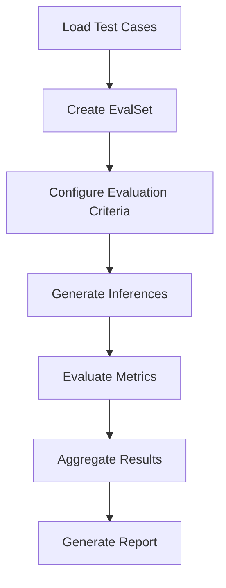
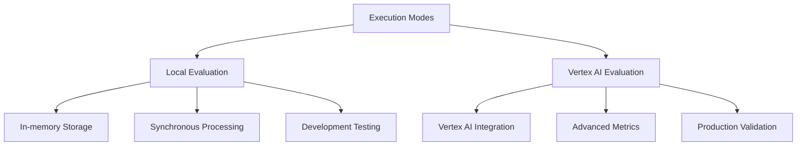
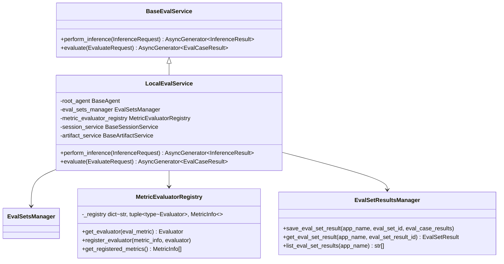

# Running Evaluations

<cite>
**Referenced Files in This Document**   
- [agent_evaluator.py](file://src/google/adk/evaluation/agent_evaluator.py)
- [local_eval_service.py](file://src/google/adk/evaluation/local_eval_service.py)
- [vertex_ai_eval_facade.py](file://src/google/adk/evaluation/vertex_ai_eval_facade.py)
- [base_eval_service.py](file://src/google/adk/evaluation/base_eval_service.py)
- [evaluation_generator.py](file://src/google/adk/evaluation/evaluation_generator.py)
- [eval_metrics.py](file://src/google/adk/evaluation/eval_metrics.py)
- [evaluator.py](file://src/google/adk/evaluation/evaluator.py)
- [metric_evaluator_registry.py](file://src/google/adk/evaluation/metric_evaluator_registry.py)
- [cli_eval.py](file://src/google/adk/cli/cli_eval.py)
- [test_config.json](file://samples_for_testing/hello_world/test_config.json)
</cite>

## Table of Contents
1. [Evaluation Execution Pipeline](#evaluation-execution-pipeline)
2. [Execution Modes](#execution-modes)
3. [Configuration Options](#configuration-options)
4. [CLI and API Usage](#cli-and-api-usage)
5. [Evaluation Services and Result Managers](#evaluation-services-and-result-managers)
6. [Common Issues and Troubleshooting](#common-issues-and-troubleshooting)
7. [Performance Considerations](#performance-considerations)
8. [Troubleshooting Guide](#troubleshooting-guide)

## Evaluation Execution Pipeline

The ADK framework provides a comprehensive evaluation system for assessing agent performance through a structured pipeline that handles test case loading, agent execution, and result collection. The evaluation process begins with the `AgentEvaluator` class, which orchestrates the entire workflow by loading evaluation datasets, configuring evaluation criteria, and managing the execution of test cases against agents.

The pipeline starts by loading test cases from `.test.json` files, which contain conversation sequences and expected outcomes. These test cases are organized into `EvalSet` objects that define the evaluation criteria and test data. The evaluation system supports both individual test files and directory-based evaluation sets, allowing for flexible organization of test cases.

During execution, the system generates inferences by running the agent against each test case in the evaluation set. This is handled by the `EvaluationGenerator` class, which manages the agent invocation process and collects the agent's responses. The generator creates isolated sessions for each evaluation to ensure test independence and uses the `Runner` class to execute the agent with the provided test inputs.

After inference generation, the system evaluates the results using configured metrics. The evaluation process compares the agent's actual responses and tool usage patterns against the expected outcomes defined in the test cases. Metrics are applied to measure various aspects of agent performance, including response accuracy, tool usage correctness, and safety compliance.

The evaluation results are then aggregated and analyzed to determine pass/fail status based on predefined thresholds. The system supports multiple runs of the same test cases to account for non-deterministic behavior in agent responses, providing statistical analysis of performance across runs.



**Diagram sources**
- [agent_evaluator.py](file://src/google/adk/evaluation/agent_evaluator.py#L119-L241)
- [evaluation_generator.py](file://src/google/adk/evaluation/evaluation_generator.py#L140-L222)

**Section sources**
- [agent_evaluator.py](file://src/google/adk/evaluation/agent_evaluator.py#L97-L661)
- [evaluation_generator.py](file://src/google/adk/evaluation/evaluation_generator.py#L51-L262)

## Execution Modes

The ADK evaluation framework supports multiple execution modes to accommodate different testing requirements and infrastructure constraints. The primary execution modes are local evaluation and Vertex AI evaluation, each with distinct characteristics and use cases.

Local evaluation mode executes assessments directly within the ADK environment using the `LocalEvalService` class. This mode is designed for rapid development and testing, providing immediate feedback without external dependencies. It runs evaluations synchronously or with limited parallelism, making it suitable for debugging and small-scale testing. The local mode uses in-memory storage for session and artifact management, ensuring fast execution but limited persistence.

Vertex AI evaluation mode leverages Google's Vertex AI platform for more sophisticated evaluation capabilities. This mode is accessed through the `VertexAiEvalFacade` class, which integrates with Vertex AI's evaluation SDK to provide advanced metrics and analysis. Vertex AI evaluation is particularly valuable for metrics that require large language models as judges, such as coherence, safety, and content quality assessments. This mode requires proper authentication and project configuration but offers more comprehensive evaluation capabilities.

The choice between execution modes depends on several factors, including evaluation complexity, required metrics, performance requirements, and infrastructure constraints. Local mode is ideal for unit testing and development workflows, while Vertex AI mode is better suited for comprehensive quality assurance and production validation.



**Diagram sources**
- [local_eval_service.py](file://src/google/adk/evaluation/local_eval_service.py#L64-L388)
- [vertex_ai_eval_facade.py](file://src/google/adk/evaluation/vertex_ai_eval_facade.py#L45-L154)

**Section sources**
- [local_eval_service.py](file://src/google/adk/evaluation/local_eval_service.py#L64-L388)
- [vertex_ai_eval_facade.py](file://src/google/adk/evaluation/vertex_ai_eval_facade.py#L45-L154)

## Configuration Options

The evaluation system provides extensive configuration options to customize the assessment process according to specific requirements. Configuration is primarily managed through JSON files and programmatic interfaces, allowing for flexible setup of evaluation parameters.

Evaluation criteria are defined in configuration files such as `test_config.json`, which specify the metrics to be used and their respective thresholds. The criteria are structured as a dictionary mapping metric names to threshold values. For example, a configuration might require a tool trajectory score of at least 0.8 and a response match score of at least 0.3. These thresholds determine the pass/fail status of individual test cases.

The evaluation system supports several built-in metrics, each with specific configuration requirements:
- `tool_trajectory_avg_score`: Measures the accuracy of tool usage patterns, with a threshold typically set between 0.8 and 1.0
- `response_match_score`: Evaluates the similarity between agent responses and expected responses using ROUGE-1 scoring, with thresholds usually between 0.3 and 0.8
- `safety_v1`: Assesses the safety and appropriateness of agent responses, with thresholds between 0.0 and 1.0
- `response_evaluation_score`: Measures response coherence and quality, with thresholds on a 1-5 scale

Parallelism settings can be configured to control the number of concurrent evaluations, balancing execution speed with resource utilization. The default parallelism is set to 4, but this can be adjusted based on available resources and rate limits. Higher parallelism can reduce evaluation time but may increase the risk of hitting API rate limits or overwhelming system resources.

Additional configuration options include labels for tracking and billing, session management parameters, and artifact storage settings. These options allow for fine-tuning the evaluation process to meet specific organizational requirements and infrastructure constraints.

**Section sources**
- [test_config.json](file://samples_for_testing/hello_world/test_config.json#L1-L6)
- [base_eval_service.py](file://src/google/adk/evaluation/base_eval_service.py#L33-L83)
- [eval_metrics.py](file://src/google/adk/evaluation/eval_metrics.py#L1-L200)

## CLI and API Usage

The ADK framework provides both command-line interface (CLI) and programmatic API options for executing evaluations, offering flexibility for different use cases and integration scenarios.

The CLI interface is accessed through the `adk eval` command, which provides a straightforward way to run evaluations from the terminal. To execute evaluations using the CLI, users specify the agent module path and the evaluation dataset location. For example:

```bash
adk eval --agent-module my_agent --eval-dataset ./tests/hello_world_eval_set_001.evalset.json
```

The CLI supports various options for customizing the evaluation process, including specifying the number of runs, setting the agent name for sub-agent evaluation, and providing an initial session file. The `--num-runs` parameter controls how many times each test case is executed, helping to account for non-deterministic behavior in agent responses.

For programmatic access, the `AgentEvaluator` class provides a comprehensive API for integrating evaluations into custom workflows and testing frameworks. The primary methods are `evaluate()` and `evaluate_eval_set()`, which allow for flexible evaluation of agents against test datasets. Here's an example of programmatic evaluation:

```python
from google.adk.evaluation import AgentEvaluator

# Evaluate an agent against a directory of test files
await AgentEvaluator.evaluate(
    agent_module="my_agent",
    eval_dataset_file_path_or_dir="./tests",
    num_runs=3,
    print_detailed_results=True
)
```

The API also supports more granular control through the `LocalEvalService` class, which exposes lower-level methods for performing inference and evaluation. This allows for custom evaluation workflows and integration with existing testing infrastructure.

Both CLI and API interfaces support the same core functionality, ensuring consistency across different usage patterns. The choice between CLI and API depends on the specific use case, with CLI being more suitable for ad-hoc testing and API being better for automated testing pipelines and integration with other tools.

**Section sources**
- [cli_eval.py](file://src/google/adk/cli/cli_eval.py#L198-L359)
- [agent_evaluator.py](file://src/google/adk/evaluation/agent_evaluator.py#L188-L241)

## Evaluation Services and Result Managers

The ADK evaluation framework employs a service-oriented architecture with specialized components for managing the evaluation process and results. The core of this architecture is the `BaseEvalService` interface, which defines the contract for evaluation services and enables extensibility through different implementations.

The `LocalEvalService` is the primary implementation of the evaluation service interface, responsible for executing evaluations locally. It manages the complete evaluation workflow, from inference generation to metric evaluation. The service coordinates between the agent, session management, and artifact storage components to ensure consistent evaluation conditions. It uses a configurable parallelism setting to control the number of concurrent evaluations, helping to optimize resource utilization while respecting rate limits.

Evaluation results are managed by the `EvalSetResultsManager` interface, which provides methods for saving, retrieving, and listing evaluation results. The framework includes in-memory and cloud storage implementations, allowing for flexible result persistence options. Results are stored as `EvalCaseResult` objects that contain detailed information about each test case execution, including metric scores, pass/fail status, and execution metadata.

The `MetricEvaluatorRegistry` plays a crucial role in the evaluation process by managing the collection of metric evaluators. This registry uses a factory pattern to instantiate the appropriate evaluator for each metric type, ensuring consistent evaluation behavior across different metrics. The default registry includes evaluators for core metrics like tool trajectory, response matching, and safety assessment.

Result aggregation and analysis are handled by the evaluation service, which combines individual metric results into an overall assessment. The service calculates aggregate scores across multiple runs and determines the final pass/fail status based on the configured criteria. Detailed results are preserved for debugging and analysis, while summary information is provided for quick assessment.



**Diagram sources**
- [base_eval_service.py](file://src/google/adk/evaluation/base_eval_service.py#L177-L202)
- [local_eval_service.py](file://src/google/adk/evaluation/local_eval_service.py#L64-L388)
- [eval_set_results_manager.py](file://src/google/adk/evaluation/eval_set_results_manager.py#L25-L53)
- [metric_evaluator_registry.py](file://src/google/adk/evaluation/metric_evaluator_registry.py#L35-L120)

**Section sources**
- [base_eval_service.py](file://src/google/adk/evaluation/base_eval_service.py#L177-L202)
- [local_eval_service.py](file://src/google/adk/evaluation/local_eval_service.py#L64-L388)
- [eval_set_results_manager.py](file://src/google/adk/evaluation/eval_set_results_manager.py#L25-L53)
- [metric_evaluator_registry.py](file://src/google/adk/evaluation/metric_evaluator_registry.py#L35-L120)

## Common Issues and Troubleshooting

When running evaluations in the ADK framework, several common issues may arise that can affect the execution process and results. Understanding these issues and their solutions is crucial for maintaining reliable evaluation workflows.

Execution timeouts are a frequent issue, particularly when evaluating complex agents or running large test suites. These timeouts can occur at different levels: agent response timeouts, tool execution timeouts, or overall evaluation timeouts. To address this, users should configure appropriate timeout values in the evaluation configuration and ensure that the agent's internal timeout settings are aligned with the evaluation requirements. For long-running evaluations, consider increasing the timeout thresholds or breaking large test suites into smaller batches.

Resource constraints can significantly impact evaluation performance and reliability. Memory limitations may cause evaluation failures when processing large datasets or running multiple concurrent evaluations. CPU constraints can lead to slow execution times and potential timeouts. To mitigate these issues, adjust the parallelism settings to match available resources, optimize agent code for efficiency, and consider using cloud-based evaluation services for resource-intensive assessments.

Failed evaluations can occur due to various reasons, including missing dependencies, configuration errors, or agent implementation issues. The evaluation system provides detailed error messages and logging to help diagnose these failures. Common causes include missing evaluation dependencies (requiring installation of the `google-adk[eval]` package), incorrect metric configurations, or agent code that raises exceptions during execution. Users should check the evaluation logs and ensure all required dependencies are installed and properly configured.

Authentication and authorization issues may arise when using Vertex AI evaluation mode. These typically manifest as missing project ID or location errors. To resolve these issues, ensure that the `GOOGLE_CLOUD_PROJECT` and `GOOGLE_CLOUD_LOCATION` environment variables are properly set, and that the executing account has the necessary permissions for Vertex AI services.

Data format issues can also cause evaluation failures, particularly when the test data does not match the expected schema. The evaluation system validates input data against the required structure, and mismatches will result in validation errors. Users should ensure that test cases include all required fields and that the data types match the expected formats.

**Section sources**
- [local_eval_service.py](file://src/google/adk/evaluation/local_eval_service.py#L377-L387)
- [vertex_ai_eval_facade.py](file://src/google/adk/evaluation/vertex_ai_eval_facade.py#L143-L146)
- [constants.py](file://src/google/adk/evaluation/constants.py#L17-L20)

## Performance Considerations

Running large-scale evaluations in the ADK framework requires careful consideration of performance factors to ensure efficient execution and optimal resource utilization. Several strategies can be employed to optimize evaluation performance and reduce costs.

Parallel execution is a key factor in evaluation performance, controlled by the `parallelism` parameter in the evaluation configuration. While higher parallelism can significantly reduce evaluation time, it must be balanced against API rate limits, tool SLAs, and available system resources. The default parallelism of 4 provides a reasonable starting point, but this should be adjusted based on the specific evaluation environment and constraints. Monitoring system resource utilization and API quota consumption can help determine the optimal parallelism level.

Caching strategies can dramatically improve evaluation performance, particularly for repeated evaluations or when testing similar scenarios. The framework's session and artifact management systems provide built-in caching capabilities that can be leveraged to avoid redundant computations. For expensive operations like model inference or tool execution, consider implementing custom caching mechanisms to store and reuse results when appropriate.

Resource optimization involves careful management of memory, CPU, and network usage during evaluation. Large evaluation datasets should be processed in batches to prevent memory exhaustion. For cloud-based evaluations, selecting appropriate machine types and scaling resources dynamically can help balance performance and cost. Monitoring tools should be used to identify performance bottlenecks and optimize resource allocation.

Cost optimization is particularly important when using cloud-based evaluation services like Vertex AI. Strategies include minimizing unnecessary evaluations, using local evaluation for development testing, and optimizing the number of runs per test case. For metrics that use large language models as judges, consider the cost implications of different model choices and evaluation frequencies.

Evaluation design can also impact performance. Well-structured test cases that focus on critical functionality can reduce the overall evaluation burden while maintaining comprehensive coverage. Prioritizing high-impact test cases and using statistical sampling for less critical scenarios can help optimize the evaluation process.

**Section sources**
- [base_eval_service.py](file://src/google/adk/evaluation/base_eval_service.py#L45-L54)
- [local_eval_service.py](file://src/google/adk/evaluation/local_eval_service.py#L117-L119)
- [vertex_ai_eval_facade.py](file://src/google/adk/evaluation/vertex_ai_eval_facade.py#L140-L146)

## Troubleshooting Guide

When encountering issues with evaluation execution in the ADK framework, a systematic troubleshooting approach can help identify and resolve problems efficiently. The following guide addresses common issues and their solutions.

For dependency-related errors, ensure that the evaluation module is properly installed. The framework requires the `google-adk[eval]` package for full evaluation functionality. If you encounter import errors or missing module warnings, install the evaluation dependencies using:

```bash
pip install "google-adk[eval]"
```

Configuration errors are a common source of evaluation failures. Verify that your evaluation configuration files follow the correct schema and include all required fields. Check that metric names are valid and thresholds are within acceptable ranges. The framework provides validation for configuration files, and any schema violations will be reported in the error messages.

Authentication issues typically occur when using Vertex AI evaluation mode. Ensure that your environment variables are properly set:
- `GOOGLE_CLOUD_PROJECT`: Your Google Cloud project ID
- `GOOGLE_CLOUD_LOCATION`: Your Google Cloud location

Verify that your authentication credentials are valid and that your account has the necessary permissions for Vertex AI services.

Session and state management issues can arise when evaluations require specific initial conditions. Ensure that session data is properly formatted and that any required state variables are correctly initialized. When using custom session management, verify that the session service is properly configured and accessible.

For performance-related issues, review your parallelism settings and resource allocation. If evaluations are timing out, consider reducing the parallelism level or increasing timeout thresholds. Monitor system resource utilization to identify bottlenecks and adjust configuration accordingly.

When debugging specific evaluation failures, enable detailed logging to gain insights into the execution process. The framework provides comprehensive logging that can help identify the root cause of issues. Check the evaluation logs for error messages, stack traces, and diagnostic information.

If problems persist, consider isolating the issue by running smaller test cases or using the local evaluation mode to eliminate external dependencies. This can help determine whether the issue is related to the evaluation framework, the agent implementation, or external services.

**Section sources**
- [constants.py](file://src/google/adk/evaluation/constants.py#L17-L20)
- [vertex_ai_eval_facade.py](file://src/google/adk/evaluation/vertex_ai_eval_facade.py#L143-L146)
- [local_eval_service.py](file://src/google/adk/evaluation/local_eval_service.py#L377-L387)