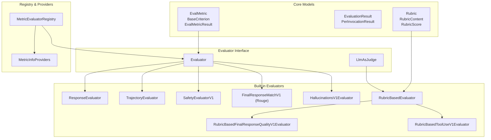
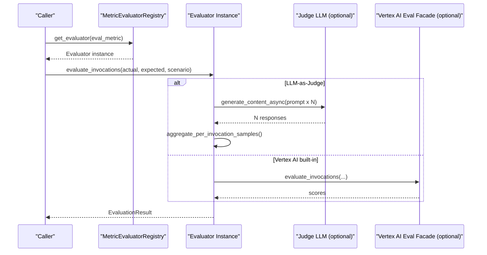
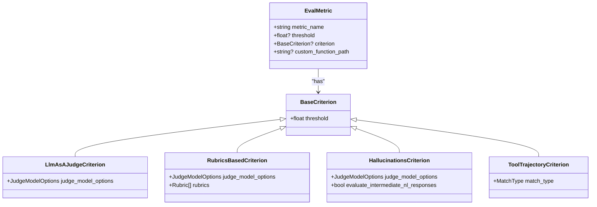
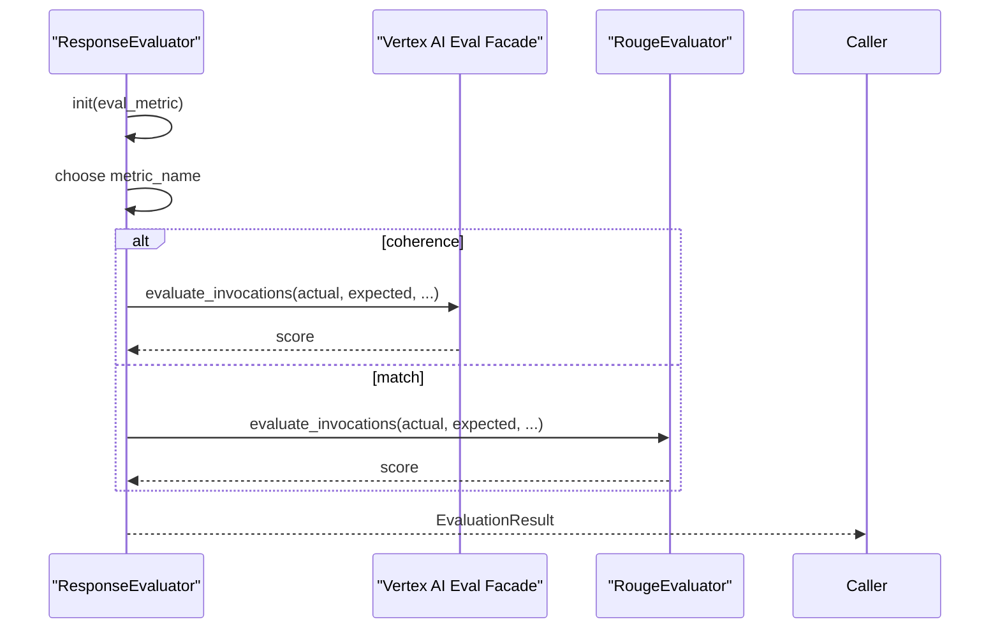
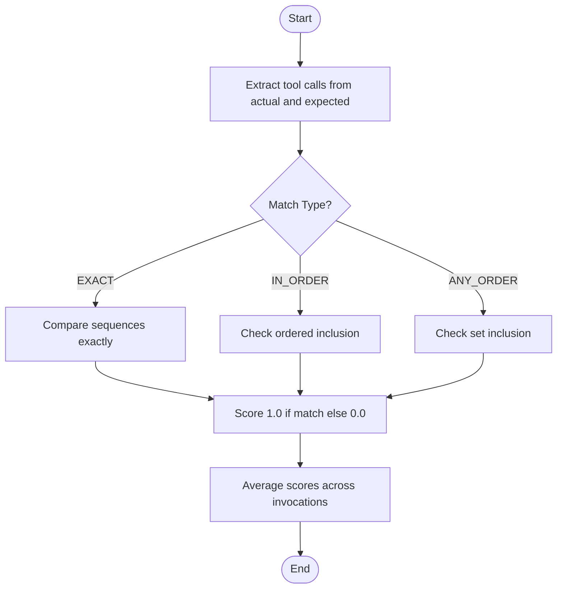
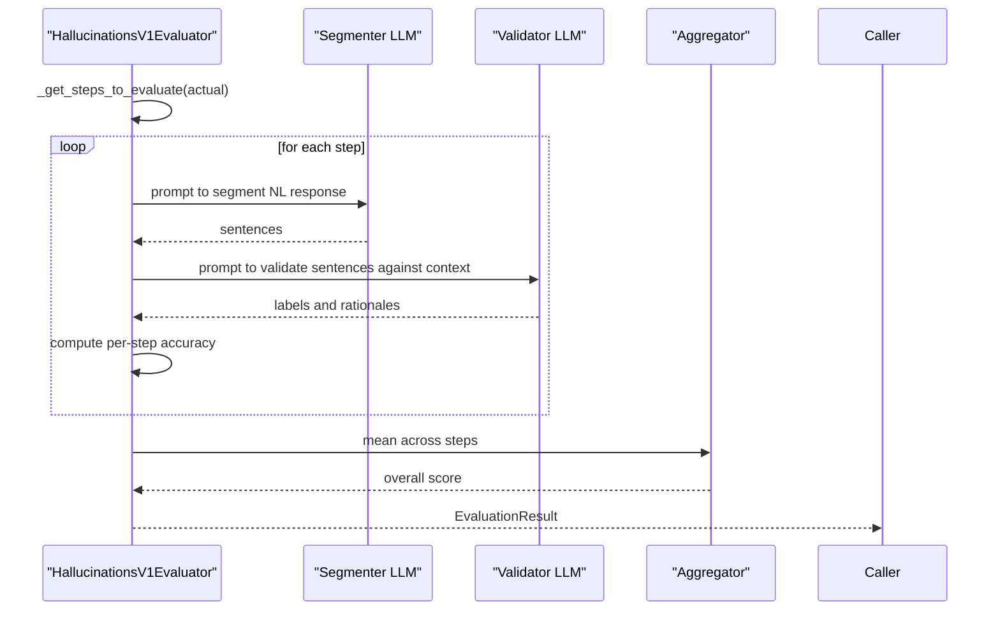
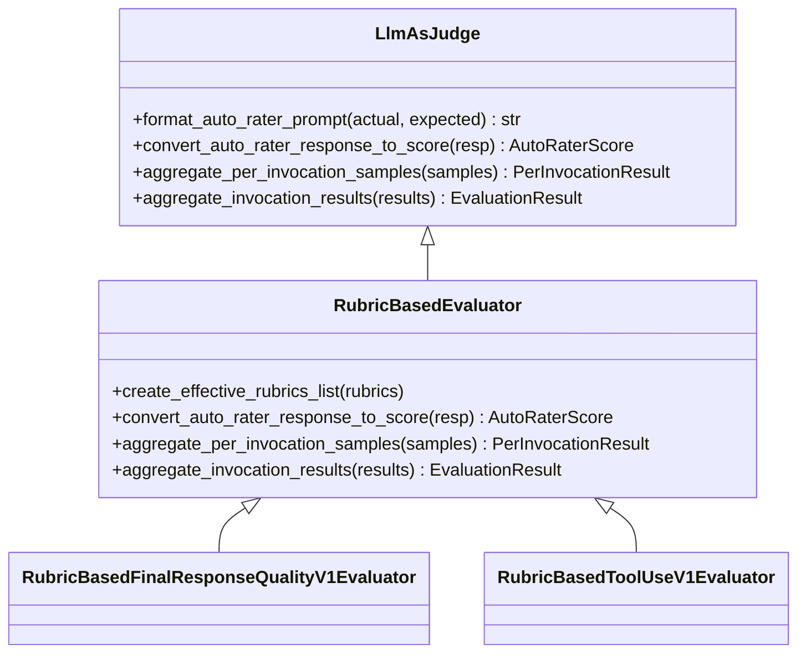
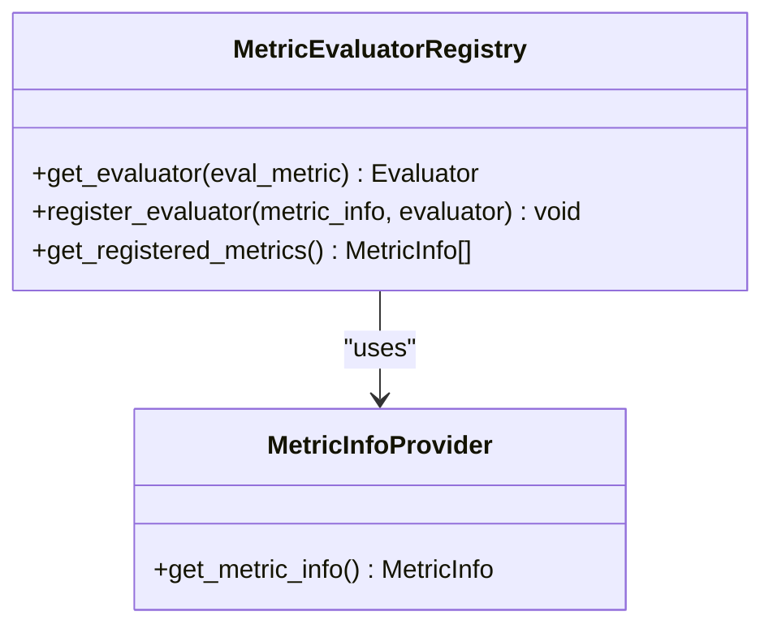
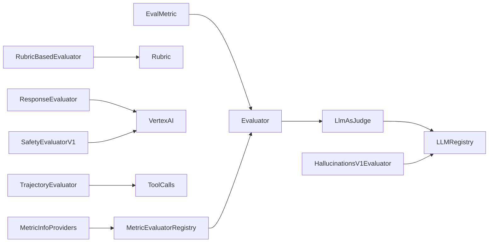

# Evaluation Metrics System

<cite>
**Referenced Files in This Document**
- [eval_metrics.py](file://src/google/adk/evaluation/eval_metrics.py)
- [evaluator.py](file://src/google/adk/evaluation/evaluator.py)
- [response_evaluator.py](file://src/google/adk/evaluation/response_evaluator.py)
- [trajectory_evaluator.py](file://src/google/adk/evaluation/trajectory_evaluator.py)
- [safety_evaluator.py](file://src/google/adk/evaluation/safety_evaluator.py)
- [hallucinations_v1.py](file://src/google/adk/evaluation/hallucinations_v1.py)
- [rubric_based_evaluator.py](file://src/google/adk/evaluation/rubric_based_evaluator.py)
- [rubric_based_final_response_quality_v1.py](file://src/google/adk/evaluation/rubric_based_final_response_quality_v1.py)
- [rubric_based_tool_use_quality_v1.py](file://src/google/adk/evaluation/rubric_based_tool_use_quality_v1.py)
- [llm_as_judge.py](file://src/google/adk/evaluation/llm_as_judge.py)
- [final_response_match_v1.py](file://src/google/adk/evaluation/final_response_match_v1.py)
- [metric_evaluator_registry.py](file://src/google/adk/evaluation/metric_evaluator_registry.py)
- [metric_info_providers.py](file://src/google/adk/evaluation/metric_info_providers.py)
- [eval_rubrics.py](file://src/google/adk/evaluation/eval_rubrics.py)
</cite>

## Table of Contents
1. [Introduction](#introduction)
2. [Project Structure](#project-structure)
3. [Core Components](#core-components)
4. [Architecture Overview](#architecture-overview)
5. [Detailed Component Analysis](#detailed-component-analysis)
6. [Dependency Analysis](#dependency-analysis)
7. [Performance Considerations](#performance-considerations)
8. [Troubleshooting Guide](#troubleshooting-guide)
9. [Conclusion](#conclusion)
10. [Appendices](#appendices)

## Introduction
This document describes the evaluation metrics system used to assess agent behavior across multiple dimensions: response quality, tool use effectiveness, safety, and hallucination detection. It explains the EvalMetric base class, the metric evaluation pipeline, and how metrics are computed from agent responses and trajectories. It also documents the ResponseEvaluator, TrajectoryEvaluator, and SafetyEvaluator, along with LLM-as-Judge evaluators for rubric-based assessments and hallucination detection. Guidance is included for developing custom metrics, configuring rubrics, scoring algorithms, validation, performance optimization, batch processing, and integration with LLM-as-Judge evaluation methods.

## Project Structure
The evaluation subsystem is organized around reusable Pydantic models, an evaluator interface, and specialized evaluators for different metric families. Registry and provider components manage metric metadata and evaluator instantiation.

**Diagram sources**
- [eval_metrics.py](file://src/google/adk/evaluation/eval_metrics.py#L254-L383)
- [evaluator.py](file://src/google/adk/evaluation/evaluator.py#L33-L81)
- [llm_as_judge.py](file://src/google/adk/evaluation/llm_as_judge.py#L49-L188)
- [response_evaluator.py](file://src/google/adk/evaluation/response_evaluator.py#L31-L99)
- [trajectory_evaluator.py](file://src/google/adk/evaluation/trajectory_evaluator.py#L38-L270)
- [safety_evaluator.py](file://src/google/adk/evaluation/safety_evaluator.py#L29-L62)
- [final_response_match_v1.py](file://src/google/adk/evaluation/final_response_match_v1.py#L32-L120)
- [hallucinations_v1.py](file://src/google/adk/evaluation/hallucinations_v1.py#L259-L760)
- [rubric_based_evaluator.py](file://src/google/adk/evaluation/rubric_based_evaluator.py#L288-L439)
- [rubric_based_final_response_quality_v1.py](file://src/google/adk/evaluation/rubric_based_final_response_quality_v1.py#L232-L313)
- [rubric_based_tool_use_quality_v1.py](file://src/google/adk/evaluation/rubric_based_tool_use_quality_v1.py#L128-L196)
- [metric_evaluator_registry.py](file://src/google/adk/evaluation/metric_evaluator_registry.py#L47-L154)
- [metric_info_providers.py](file://src/google/adk/evaluation/metric_info_providers.py#L24-L186)
- [eval_rubrics.py](file://src/google/adk/evaluation/eval_rubrics.py#L24-L83)

**Section sources**
- [eval_metrics.py](file://src/google/adk/evaluation/eval_metrics.py#L1-L384)
- [evaluator.py](file://src/google/adk/evaluation/evaluator.py#L1-L81)
- [metric_evaluator_registry.py](file://src/google/adk/evaluation/metric_evaluator_registry.py#L1-L154)

## Core Components
- EvalMetric: Defines a metric’s name, threshold, criterion, and optional custom function path. It is the configuration unit for all evaluators.
- BaseCriterion and subclasses: Provide typed criteria for different metric families (LLM-as-a-Judge, rubric-based, hallucinations, tool trajectory).
- EvaluationResult and PerInvocationResult: Standardized outputs for per-invocation and overall scores, statuses, and rubric-level details.
- MetricInfo and MetricInfoProvider: Describe metric semantics, value intervals, and human-readable descriptions.

Key configuration and data models:
- EvalMetric, EvalMetricResult, EvalMetricResultPerInvocation
- BaseCriterion, LlmAsAJudgeCriterion, RubricsBasedCriterion, HallucinationsCriterion, ToolTrajectoryCriterion
- MetricInfo, MetricValueInfo, Interval

**Section sources**
- [eval_metrics.py](file://src/google/adk/evaluation/eval_metrics.py#L254-L383)
- [evaluator.py](file://src/google/adk/evaluation/evaluator.py#L33-L81)
- [eval_rubrics.py](file://src/google/adk/evaluation/eval_rubrics.py#L24-L83)

## Architecture Overview
The evaluation pipeline is driven by a registry that maps metric names to evaluator classes. Each evaluator consumes actual and expected invocations (agent outputs and golden references) and produces standardized results.

**Diagram sources**
- [metric_evaluator_registry.py](file://src/google/adk/evaluation/metric_evaluator_registry.py#L52-L73)
- [llm_as_judge.py](file://src/google/adk/evaluation/llm_as_judge.py#L118-L181)
- [response_evaluator.py](file://src/google/adk/evaluation/response_evaluator.py#L77-L99)

## Detailed Component Analysis

### EvalMetric and Criterion Types
- EvalMetric: Central configuration for a metric, including metric_name, threshold, criterion, and optional custom_function_path.
- BaseCriterion and typed criteria:
  - LlmAsAJudgeCriterion: judge_model_options for sampling and model configuration.
  - RubricsBasedCriterion: judge_model_options plus rubrics list.
  - HallucinationsCriterion: judge_model_options plus option to evaluate intermediate NL responses.
  - ToolTrajectoryCriterion: match_type (EXACT, IN_ORDER, ANY_ORDER) with validation helpers.

**Diagram sources**
- [eval_metrics.py](file://src/google/adk/evaluation/eval_metrics.py#L69-L239)
- [eval_metrics.py](file://src/google/adk/evaluation/eval_metrics.py#L254-L306)

**Section sources**
- [eval_metrics.py](file://src/google/adk/evaluation/eval_metrics.py#L69-L306)

### ResponseEvaluator
- Supports response_evaluation_score (coherence via Vertex AI built-in) and response_match_score (ROUGE-1 against golden).
- Validates metric_name against supported prebuilt metrics and raises on unsupported values.
- Delegates to Vertex AI Eval facade for coherence; uses RougeEvaluator for matching.

**Diagram sources**
- [response_evaluator.py](file://src/google/adk/evaluation/response_evaluator.py#L31-L99)
- [final_response_match_v1.py](file://src/google/adk/evaluation/final_response_match_v1.py#L32-L120)

**Section sources**
- [response_evaluator.py](file://src/google/adk/evaluation/response_evaluator.py#L31-L99)

### TrajectoryEvaluator
- Compares tool call trajectories between actual and expected invocations.
- Three match strategies:
  - EXACT: exact sequence and arguments.
  - IN_ORDER: expected calls must appear in order (allow extras).
  - ANY_ORDER: expected calls must all be present (order irrelevant).
- Aggregates per-invocation scores into an overall average.

**Diagram sources**
- [trajectory_evaluator.py](file://src/google/adk/evaluation/trajectory_evaluator.py#L137-L270)

**Section sources**
- [trajectory_evaluator.py](file://src/google/adk/evaluation/trajectory_evaluator.py#L38-L270)

### SafetyEvaluatorV1
- Uses Vertex AI built-in safety metric via a single-turn evaluation facade.
- Expects a GCP project configuration for Vertex AI Eval.

**Section sources**
- [safety_evaluator.py](file://src/google/adk/evaluation/safety_evaluator.py#L29-L62)

### HallucinationsV1Evaluator
- Two-stage process:
  1) Segmenter: splits NL responses into sentences.
  2) Validator: checks each sentence against a constructed context (instructions, tools, prior tool calls/results, NL responses).
- Accuracy score is the fraction of sentences labeled “supported” or “not_applicable.”
- Supports evaluating intermediate NL responses when configured.

**Diagram sources**
- [hallucinations_v1.py](file://src/google/adk/evaluation/hallucinations_v1.py#L496-L760)

**Section sources**
- [hallucinations_v1.py](file://src/google/adk/evaluation/hallucinations_v1.py#L259-L760)

### LLM-as-Judge Pipeline and Rubric-Based Evaluators
- LlmAsJudge: Abstract base for LLM-as-Judge evaluators. Handles judge model setup, prompt formatting, repeated sampling, and aggregation.
- RubricBasedEvaluator: Extends LlmAsJudge with rubric-aware parsing, per-invocation aggregation (majority vote), and case-level summarization (mean).
- Specializations:
  - RubricBasedFinalResponseQualityV1Evaluator: rubric-based final response quality.
  - RubricBasedToolUseV1Evaluator: rubric-based tool use quality.

**Diagram sources**
- [llm_as_judge.py](file://src/google/adk/evaluation/llm_as_judge.py#L49-L188)
- [rubric_based_evaluator.py](file://src/google/adk/evaluation/rubric_based_evaluator.py#L288-L439)
- [rubric_based_final_response_quality_v1.py](file://src/google/adk/evaluation/rubric_based_final_response_quality_v1.py#L232-L313)
- [rubric_based_tool_use_quality_v1.py](file://src/google/adk/evaluation/rubric_based_tool_use_quality_v1.py#L128-L196)

**Section sources**
- [llm_as_judge.py](file://src/google/adk/evaluation/llm_as_judge.py#L49-L188)
- [rubric_based_evaluator.py](file://src/google/adk/evaluation/rubric_based_evaluator.py#L288-L439)

### Metric Registry and Info Providers
- MetricEvaluatorRegistry: Maps metric names to evaluator classes and MetricInfo descriptors. Supports custom metrics via a dedicated evaluator wrapper.
- MetricInfoProvider implementations: Provide metric metadata (name, description, value interval) for each built-in evaluator.

**Diagram sources**
- [metric_evaluator_registry.py](file://src/google/adk/evaluation/metric_evaluator_registry.py#L47-L154)
- [metric_info_providers.py](file://src/google/adk/evaluation/metric_info_providers.py#L24-L186)

**Section sources**
- [metric_evaluator_registry.py](file://src/google/adk/evaluation/metric_evaluator_registry.py#L47-L154)
- [metric_info_providers.py](file://src/google/adk/evaluation/metric_info_providers.py#L24-L186)

## Dependency Analysis
- Coupling:
  - Evaluators depend on EvalMetric/Evaluator abstractions and optional LLM model registry.
  - Rubric-based evaluators depend on rubric models and parsing/summarization utilities.
  - Hallucinations evaluator depends on LLM registry and parsing utilities.
- Cohesion:
  - Each evaluator encapsulates a single metric family with clear separation of concerns.
- External dependencies:
  - Vertex AI Eval facade for built-in metrics.
  - LLM registry for judge model instantiation.
  - ROUGE scorer for response matching.

**Diagram sources**
- [eval_metrics.py](file://src/google/adk/evaluation/eval_metrics.py#L254-L383)
- [evaluator.py](file://src/google/adk/evaluation/evaluator.py#L57-L81)
- [llm_as_judge.py](file://src/google/adk/evaluation/llm_as_judge.py#L183-L188)
- [rubric_based_evaluator.py](file://src/google/adk/evaluation/rubric_based_evaluator.py#L288-L439)
- [hallucinations_v1.py](file://src/google/adk/evaluation/hallucinations_v1.py#L303-L308)
- [response_evaluator.py](file://src/google/adk/evaluation/response_evaluator.py#L92-L98)
- [trajectory_evaluator.py](file://src/google/adk/evaluation/trajectory_evaluator.py#L137-L270)
- [safety_evaluator.py](file://src/google/adk/evaluation/safety_evaluator.py#L56-L61)
- [metric_evaluator_registry.py](file://src/google/adk/evaluation/metric_evaluator_registry.py#L104-L154)

**Section sources**
- [eval_metrics.py](file://src/google/adk/evaluation/eval_metrics.py#L254-L383)
- [evaluator.py](file://src/google/adk/evaluation/evaluator.py#L57-L81)
- [llm_as_judge.py](file://src/google/adk/evaluation/llm_as_judge.py#L183-L188)
- [rubric_based_evaluator.py](file://src/google/adk/evaluation/rubric_based_evaluator.py#L288-L439)
- [hallucinations_v1.py](file://src/google/adk/evaluation/hallucinations_v1.py#L303-L308)
- [response_evaluator.py](file://src/google/adk/evaluation/response_evaluator.py#L92-L98)
- [trajectory_evaluator.py](file://src/google/adk/evaluation/trajectory_evaluator.py#L137-L270)
- [safety_evaluator.py](file://src/google/adk/evaluation/safety_evaluator.py#L56-L61)
- [metric_evaluator_registry.py](file://src/google/adk/evaluation/metric_evaluator_registry.py#L104-L154)

## Performance Considerations
- Sampling and aggregation:
  - LLM-as-Judge evaluators repeat judge model calls (num_samples) and aggregate results (majority vote or mean) to reduce variance.
- Batch processing:
  - Evaluators iterate over lists of invocations; batching is implicit in list processing. For large sets, consider parallelizing across invocations and aggregating asynchronously.
- Cost and latency:
  - Reduce num_samples for exploratory runs; increase for robustness.
  - Prefer built-in Vertex AI metrics when available (e.g., coherence, safety) to offload computation.
- Parsing and validation:
  - Hallucinations evaluator performs regex parsing; ensure prompts remain stable to minimize retries and parsing overhead.

[No sources needed since this section provides general guidance]

## Troubleshooting Guide
Common issues and resolutions:
- Unsupported metric name:
  - ResponseEvaluator raises on unsupported metric_name. Verify against prebuilt metrics.
- Missing expected invocations:
  - Some evaluators require expected_invocations (e.g., trajectory, response match, safety via Vertex AI). Supply them or adjust metric configuration.
- Criterion type mismatch:
  - Evaluators validate criterion types. Ensure EvalMetric.criterion matches the evaluator’s expected type (e.g., ToolTrajectoryCriterion, RubricsBasedCriterion).
- Rubric validation:
  - Rubric-based evaluators require rubrics; ensure they are provided and properly typed.
- LLM judge failures:
  - Check judge model availability and configuration; verify num_samples and retry options.

**Section sources**
- [response_evaluator.py](file://src/google/adk/evaluation/response_evaluator.py#L53-L73)
- [trajectory_evaluator.py](file://src/google/adk/evaluation/trajectory_evaluator.py#L106-L108)
- [llm_as_judge.py](file://src/google/adk/evaluation/llm_as_judge.py#L124-L126)
- [rubric_based_evaluator.py](file://src/google/adk/evaluation/rubric_based_evaluator.py#L332-L336)

## Conclusion
The evaluation metrics system provides a modular, extensible framework for assessing agent behavior. It supports built-in metrics (coherence, safety, trajectory, response match) and powerful LLM-as-Judge evaluators for rubric-based quality and hallucination detection. The registry and providers simplify metric registration and metadata management, while standardized result models enable consistent interpretation and aggregation across diverse evaluation tasks.

[No sources needed since this section summarizes without analyzing specific files]

## Appendices

### Practical Examples

- Defining evaluation rubrics:
  - Create Rubric objects with unique rubric_id, rubric_content.text_property, optional description, and type (e.g., FINAL_RESPONSE_QUALITY, TOOL_USE_QUALITY).
  - Assign rubrics to EvalMetric.criterion.rubrics for rubric-based evaluators.

- Configuring metric weights and thresholds:
  - Set EvalMetric.threshold to define pass/fail boundaries.
  - For rubric-based evaluators, configure judge_model_options.judge_model and judge_model_options.num_samples to balance reliability and cost.

- Interpreting metric results:
  - Use EvaluationResult.overall_score and EvaluationResult.overall_eval_status.
  - Inspect per_invocation_results for granular insights and rubric_scores for rubric-level feedback.

- Integrating LLM-as-Judge:
  - Use LlmAsJudge subclasses (RubricBasedEvaluator derivatives) to define custom prompts and parsing logic.
  - Configure judge_model_options for model selection and generation parameters.

[No sources needed since this section provides general guidance]