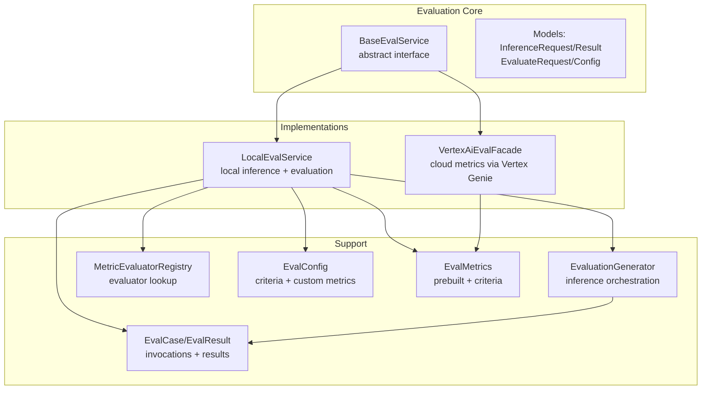
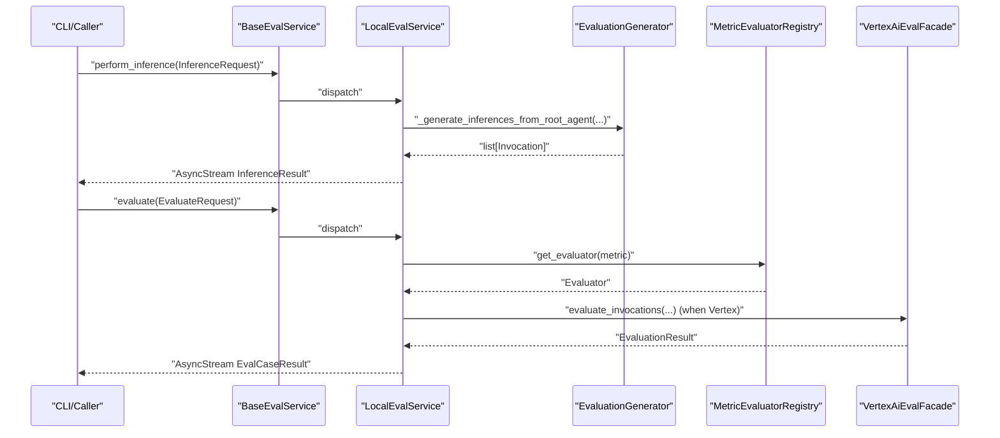
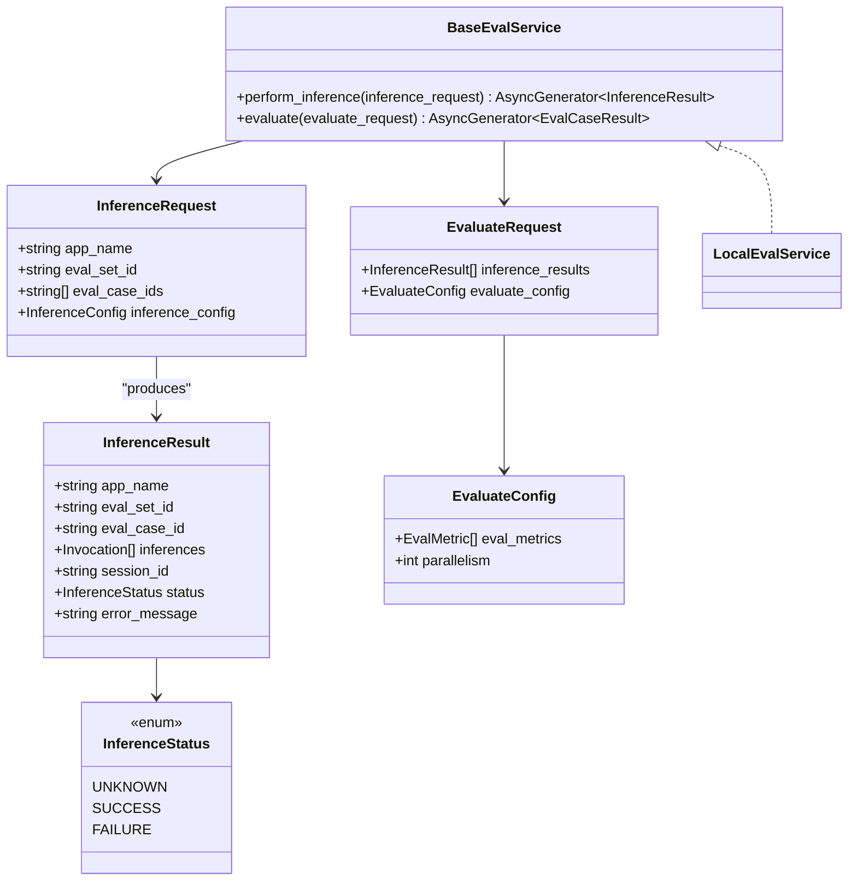
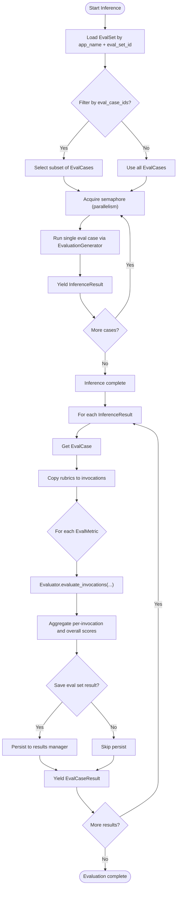
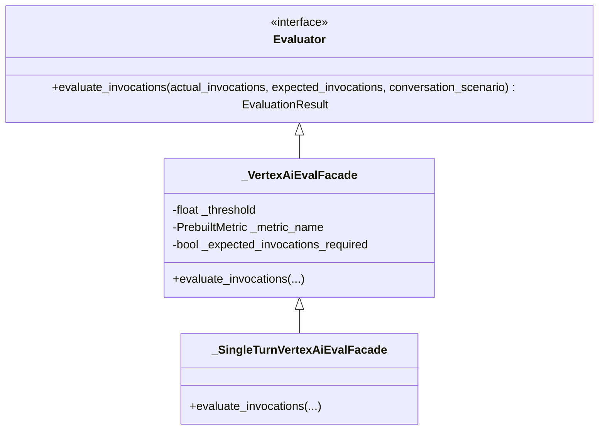
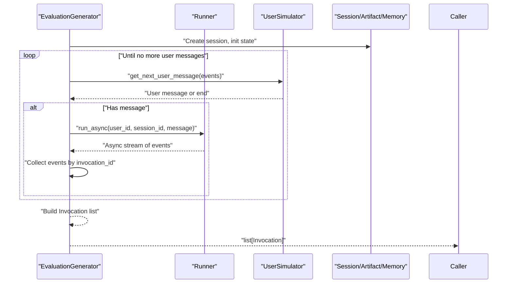
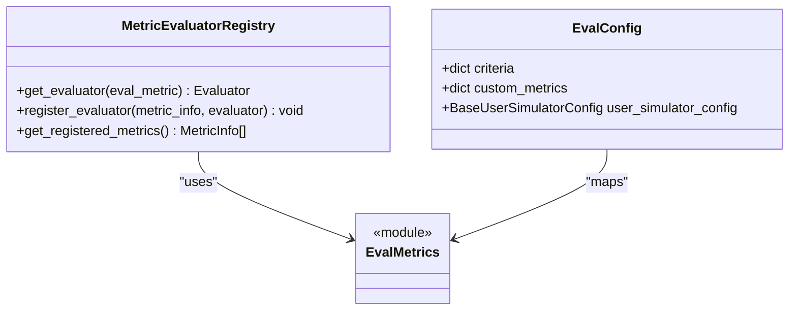
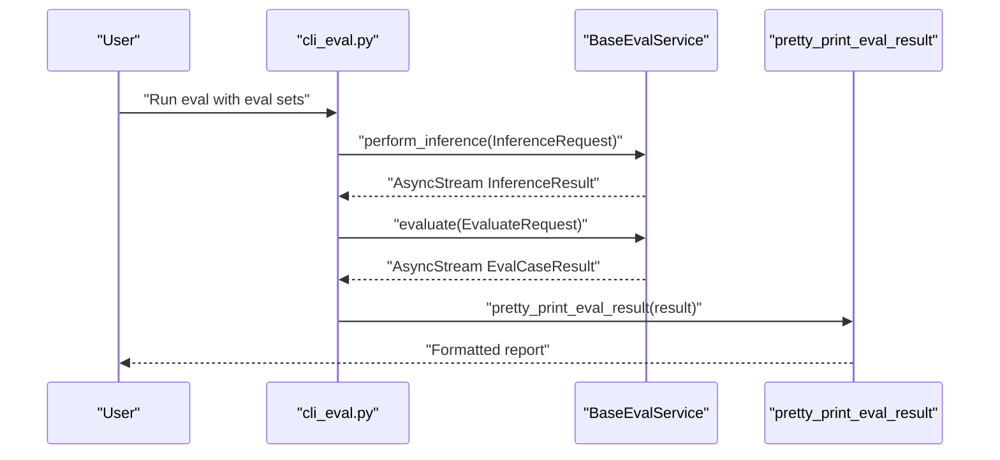
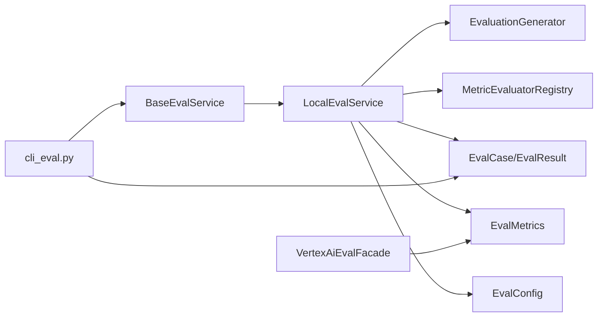

# Evaluation Services

<cite>
**Referenced Files in This Document**
- [base_eval_service.py](file://src/google/adk/evaluation/base_eval_service.py)
- [local_eval_service.py](file://src/google/adk/evaluation/local_eval_service.py)
- [vertex_ai_eval_facade.py](file://src/google/adk/evaluation/vertex_ai_eval_facade.py)
- [eval_config.py](file://src/google/adk/evaluation/eval_config.py)
- [evaluation_generator.py](file://src/google/adk/evaluation/evaluation_generator.py)
- [eval_metrics.py](file://src/google/adk/evaluation/eval_metrics.py)
- [metric_evaluator_registry.py](file://src/google/adk/evaluation/metric_evaluator_registry.py)
- [cli_eval.py](file://src/google/adk/cli/cli_eval.py)
- [eval_result.py](file://src/google/adk/evaluation/eval_result.py)
- [eval_case.py](file://src/google/adk/evaluation/eval_case.py)
</cite>

## Table of Contents
1. [Introduction](#introduction)
2. [Project Structure](#project-structure)
3. [Core Components](#core-components)
4. [Architecture Overview](#architecture-overview)
5. [Detailed Component Analysis](#detailed-component-analysis)
6. [Dependency Analysis](#dependency-analysis)
7. [Performance Considerations](#performance-considerations)
8. [Troubleshooting Guide](#troubleshooting-guide)
9. [Conclusion](#conclusion)
10. [Appendices](#appendices)

## Introduction
This document explains the evaluation services component in the ADK Python library. It focuses on the BaseEvalService abstract class and its role as the foundation for all evaluation operations, the evaluation service architecture (local and cloud-based via Vertex AI), configuration options for parallelism and requests, asynchronous evaluation workflows with streaming results, error handling, and practical examples for building custom evaluation services and integrating with different backends. It also covers lifecycle, resource management, performance optimization, scalability, quota management, and cost considerations for cloud-based evaluations.

## Project Structure
The evaluation subsystem centers around a small set of core modules:
- Base contract and request/response models
- Local evaluation service implementation
- Vertex AI evaluation facade for cloud-based metrics
- Evaluation configuration and metrics
- Evaluation generator for inference orchestration
- CLI integration for end-to-end evaluation

**Diagram sources**
- [base_eval_service.py](file://src/google/adk/evaluation/base_eval_service.py#L177-L202)
- [local_eval_service.py](file://src/google/adk/evaluation/local_eval_service.py#L111-L141)
- [vertex_ai_eval_facade.py](file://src/google/adk/evaluation/vertex_ai_eval_facade.py#L46-L103)
- [evaluation_generator.py](file://src/google/adk/evaluation/evaluation_generator.py#L69-L268)
- [metric_evaluator_registry.py](file://src/google/adk/evaluation/metric_evaluator_registry.py#L46-L102)
- [eval_config.py](file://src/google/adk/evaluation/eval_config.py#L71-L158)
- [eval_metrics.py](file://src/google/adk/evaluation/eval_metrics.py#L37-L140)
- [eval_case.py](file://src/google/adk/evaluation/eval_case.py#L80-L177)
- [eval_result.py](file://src/google/adk/evaluation/eval_result.py#L31-L92)

**Section sources**
- [base_eval_service.py](file://src/google/adk/evaluation/base_eval_service.py#L177-L202)
- [local_eval_service.py](file://src/google/adk/evaluation/local_eval_service.py#L111-L141)
- [vertex_ai_eval_facade.py](file://src/google/adk/evaluation/vertex_ai_eval_facade.py#L46-L103)
- [evaluation_generator.py](file://src/google/adk/evaluation/evaluation_generator.py#L69-L268)
- [metric_evaluator_registry.py](file://src/google/adk/evaluation/metric_evaluator_registry.py#L46-L102)
- [eval_config.py](file://src/google/adk/evaluation/eval_config.py#L71-L158)
- [eval_metrics.py](file://src/google/adk/evaluation/eval_metrics.py#L37-L140)
- [eval_case.py](file://src/google/adk/evaluation/eval_case.py#L80-L177)
- [eval_result.py](file://src/google/adk/evaluation/eval_result.py#L31-L92)

## Core Components
- BaseEvalService: Defines the async streaming contract for inference and evaluation.
- InferenceRequest/InferenceResult: Requests and streaming results for per-case inference generation.
- EvaluateRequest/EvaluateConfig: Requests and configuration for metric evaluation across inferences.
- LocalEvalService: Concrete implementation that orchestrates inference via EvaluationGenerator and evaluation via MetricEvaluatorRegistry.
- VertexAiEvalFacade: Cloud-backed evaluator using Vertex Genie Eval SDK for prebuilt metrics.
- EvaluationGenerator: Orchestrates agent runs, collects events, converts to Invocation records, and supports retry interception.
- MetricEvaluatorRegistry: Registry mapping metric names to evaluators and providing default metrics.
- EvalConfig/EvalMetrics: Configuration of criteria and thresholds, plus prebuilt metrics and criteria types.
- EvalCase/EvalResult: Data models for invocations, evaluation cases, and per-case results.

Key responsibilities:
- Asynchronous streaming: Both inference and evaluation return AsyncGenerator streams to enable incremental results.
- Parallelism controls: Configurable concurrency via semaphore-based throttling in both phases.
- Error isolation: Failures in a single inference or metric do not block others; errors recorded in results.
- Extensibility: Custom metrics via EvalConfig and registry registration.

**Section sources**
- [base_eval_service.py](file://src/google/adk/evaluation/base_eval_service.py#L33-L202)
- [local_eval_service.py](file://src/google/adk/evaluation/local_eval_service.py#L111-L229)
- [vertex_ai_eval_facade.py](file://src/google/adk/evaluation/vertex_ai_eval_facade.py#L46-L206)
- [evaluation_generator.py](file://src/google/adk/evaluation/evaluation_generator.py#L69-L268)
- [metric_evaluator_registry.py](file://src/google/adk/evaluation/metric_evaluator_registry.py#L46-L154)
- [eval_config.py](file://src/google/adk/evaluation/eval_config.py#L71-L219)
- [eval_metrics.py](file://src/google/adk/evaluation/eval_metrics.py#L37-L200)
- [eval_case.py](file://src/google/adk/evaluation/eval_case.py#L80-L200)
- [eval_result.py](file://src/google/adk/evaluation/eval_result.py#L31-L92)

## Architecture Overview
The evaluation pipeline is split into two stages:
1) Inference: Generate agent invocations for each eval case, optionally simulating user turns.
2) Evaluation: Compute metric scores per invocation and overall, aggregating results.

**Diagram sources**
- [base_eval_service.py](file://src/google/adk/evaluation/base_eval_service.py#L177-L202)
- [local_eval_service.py](file://src/google/adk/evaluation/local_eval_service.py#L142-L229)
- [evaluation_generator.py](file://src/google/adk/evaluation/evaluation_generator.py#L191-L268)
- [metric_evaluator_registry.py](file://src/google/adk/evaluation/metric_evaluator_registry.py#L52-L73)
- [vertex_ai_eval_facade.py](file://src/google/adk/evaluation/vertex_ai_eval_facade.py#L84-L103)

## Detailed Component Analysis

### BaseEvalService and Contracts
- Defines async streaming APIs:
  - perform_inference(InferenceRequest) -> AsyncGenerator[InferenceResult]
  - evaluate(EvaluateRequest) -> AsyncGenerator[EvalCaseResult]
- Provides request/response models and enums for statuses and parallelism configuration.

**Diagram sources**
- [base_eval_service.py](file://src/google/adk/evaluation/base_eval_service.py#L33-L202)

**Section sources**
- [base_eval_service.py](file://src/google/adk/evaluation/base_eval_service.py#L33-L202)

### LocalEvalService Implementation
- Orchestrates inference using EvaluationGenerator and yields InferenceResult items as they become available.
- Applies parallelism via asyncio.Semaphore on the inference phase.
- Performs evaluation by iterating over inference results, applying registered evaluators, and yielding EvalCaseResult items.
- Applies parallelism for evaluation tasks independently.
- Copies rubrics from EvalCase and per-invocation expectations to actual invocations before scoring.
- Aggregates per-invocation and overall metric results; computes final status based on individual metric statuses.
- Isolates failures: inference and metric evaluation errors are captured and surfaced without failing the whole batch.

**Diagram sources**
- [local_eval_service.py](file://src/google/adk/evaluation/local_eval_service.py#L142-L229)
- [evaluation_generator.py](file://src/google/adk/evaluation/evaluation_generator.py#L191-L268)
- [metric_evaluator_registry.py](file://src/google/adk/evaluation/metric_evaluator_registry.py#L52-L73)

**Section sources**
- [local_eval_service.py](file://src/google/adk/evaluation/local_eval_service.py#L111-L229)
- [evaluation_generator.py](file://src/google/adk/evaluation/evaluation_generator.py#L191-L268)
- [metric_evaluator_registry.py](file://src/google/adk/evaluation/metric_evaluator_registry.py#L46-L102)

### Vertex AI Evaluation Facade
- Provides a cloud-backed evaluator using Vertex Genie Eval SDK.
- Supports single-turn evaluation by constructing datasets per invocation and invoking the Vertex client’s evaluate API.
- Validates environment configuration (project/location or API key) and raises descriptive errors if missing.
- Converts metric scores to EvaluationResult with per-invocation and overall status.

**Diagram sources**
- [vertex_ai_eval_facade.py](file://src/google/adk/evaluation/vertex_ai_eval_facade.py#L46-L206)

**Section sources**
- [vertex_ai_eval_facade.py](file://src/google/adk/evaluation/vertex_ai_eval_facade.py#L46-L206)

### Evaluation Generator and Streaming Inference
- Generates responses by coordinating a Runner with a user simulator, collecting events, and converting them into Invocation records.
- Supports retry interception and ensures robustness against transient model failures.
- Exposes async generators for incremental event emission and invocation assembly.

**Diagram sources**
- [evaluation_generator.py](file://src/google/adk/evaluation/evaluation_generator.py#L191-L268)

**Section sources**
- [evaluation_generator.py](file://src/google/adk/evaluation/evaluation_generator.py#L69-L268)

### Metrics, Criteria, and Registry
- Prebuilt metrics and criteria define thresholds and specialized behaviors (e.g., LLM-as-a-judge, rubrics, hallucinations).
- EvalConfig maps metric names to criteria and supports custom metrics via code configuration.
- MetricEvaluatorRegistry registers evaluators and resolves them by metric name, enabling extensibility.

**Diagram sources**
- [eval_metrics.py](file://src/google/adk/evaluation/eval_metrics.py#L37-L140)
- [metric_evaluator_registry.py](file://src/google/adk/evaluation/metric_evaluator_registry.py#L46-L154)
- [eval_config.py](file://src/google/adk/evaluation/eval_config.py#L71-L158)

**Section sources**
- [eval_metrics.py](file://src/google/adk/evaluation/eval_metrics.py#L37-L200)
- [metric_evaluator_registry.py](file://src/google/adk/evaluation/metric_evaluator_registry.py#L46-L154)
- [eval_config.py](file://src/google/adk/evaluation/eval_config.py#L71-L219)

### CLI Integration and Usage Patterns
- CLI constructs InferenceRequest(s) and EvaluateRequest, then streams results using async context managers.
- Provides pretty-printing of invocation details and rubric scores.
- Supports selecting eval sets and specific eval case IDs.

**Diagram sources**
- [cli_eval.py](file://src/google/adk/cli/cli_eval.py#L135-L174)
- [cli_eval.py](file://src/google/adk/cli/cli_eval.py#L191-L296)

**Section sources**
- [cli_eval.py](file://src/google/adk/cli/cli_eval.py#L135-L174)
- [cli_eval.py](file://src/google/adk/cli/cli_eval.py#L191-L296)

## Dependency Analysis
- BaseEvalService is the central abstraction; LocalEvalService implements it and depends on:
  - EvaluationGenerator for inference orchestration
  - MetricEvaluatorRegistry for evaluator resolution
  - EvalCase/EvalResult models for data exchange
  - EvalMetrics for metric definitions and criteria
  - EvalConfig for configuration mapping
- VertexAiEvalFacade depends on Vertex Genie types and environment configuration.
- CLI depends on BaseEvalService and uses async context managers to consume streams.

**Diagram sources**
- [base_eval_service.py](file://src/google/adk/evaluation/base_eval_service.py#L177-L202)
- [local_eval_service.py](file://src/google/adk/evaluation/local_eval_service.py#L111-L141)
- [evaluation_generator.py](file://src/google/adk/evaluation/evaluation_generator.py#L69-L268)
- [metric_evaluator_registry.py](file://src/google/adk/evaluation/metric_evaluator_registry.py#L46-L102)
- [eval_metrics.py](file://src/google/adk/evaluation/eval_metrics.py#L37-L140)
- [eval_config.py](file://src/google/adk/evaluation/eval_config.py#L71-L158)
- [cli_eval.py](file://src/google/adk/cli/cli_eval.py#L135-L174)

**Section sources**
- [base_eval_service.py](file://src/google/adk/evaluation/base_eval_service.py#L177-L202)
- [local_eval_service.py](file://src/google/adk/evaluation/local_eval_service.py#L111-L141)
- [evaluation_generator.py](file://src/google/adk/evaluation/evaluation_generator.py#L69-L268)
- [metric_evaluator_registry.py](file://src/google/adk/evaluation/metric_evaluator_registry.py#L46-L102)
- [eval_metrics.py](file://src/google/adk/evaluation/eval_metrics.py#L37-L140)
- [eval_config.py](file://src/google/adk/evaluation/eval_config.py#L71-L158)
- [cli_eval.py](file://src/google/adk/cli/cli_eval.py#L135-L174)

## Performance Considerations
- Parallelism:
  - Inference parallelism: controlled via InferenceConfig.parallelism; enforced with asyncio.Semaphore in LocalEvalService.perform_inference.
  - Evaluation parallelism: controlled via EvaluateConfig.parallelism; enforced with asyncio.Semaphore in LocalEvalService.evaluate.
- Quota and rate limiting:
  - Cloud metrics (Vertex AI) are subject to quotas and per-second/minute SLAs; adjust parallelism accordingly to avoid throttling.
- Retry and resilience:
  - EvaluationGenerator installs plugins to ensure retry options for LLM requests, reducing flakiness in inference generation.
- Memory and artifacts:
  - LocalEvalService defaults to in-memory services for sessions, artifacts, and memory; consider persistence backends for large-scale runs.
- Cost control:
  - Reduce parallelism or limit eval sets/cases to manage cloud spend.
  - Prefer local metrics where possible; offload expensive judge-model evaluations to cloud only when needed.

[No sources needed since this section provides general guidance]

## Troubleshooting Guide
- Missing Vertex credentials:
  - VertexAiEvalFacade validates presence of project/location or API key and raises descriptive errors if missing.
- Metric evaluation failures:
  - LocalEvalService catches exceptions during metric evaluation and logs them; the metric is marked as not evaluated, allowing other metrics to proceed.
- Inference failures:
  - LocalEvalService captures exceptions during inference generation, marks status as failure, and continues with remaining cases.
- Validation errors:
  - EvalCase enforces that exactly one of conversation or conversation_scenario is provided.
  - EvalConfig validates custom metric arguments and criterion types.

**Section sources**
- [vertex_ai_eval_facade.py](file://src/google/adk/evaluation/vertex_ai_eval_facade.py#L66-L83)
- [local_eval_service.py](file://src/google/adk/evaluation/local_eval_service.py#L354-L369)
- [local_eval_service.py](file://src/google/adk/evaluation/local_eval_service.py#L501-L512)
- [eval_case.py](file://src/google/adk/evaluation/eval_case.py#L169-L177)
- [eval_config.py](file://src/google/adk/evaluation/eval_config.py#L61-L69)

## Conclusion
The evaluation services component provides a robust, extensible framework for agent evaluation. BaseEvalService defines a clean async streaming contract, LocalEvalService delivers efficient local inference and evaluation with configurable parallelism and error isolation, and VertexAiEvalFacade enables scalable cloud-based metrics. Together with EvaluationGenerator, EvalConfig, and MetricEvaluatorRegistry, it supports flexible, production-ready evaluation workflows.

[No sources needed since this section summarizes without analyzing specific files]

## Appendices

### Practical Examples

- Implement a custom metric evaluator:
  - Define a class implementing the evaluator interface and register it via MetricEvaluatorRegistry.register_evaluator.
  - Provide MetricInfo describing the metric and integrate with EvalConfig.custom_metrics to select it by name.

- Integrate with Vertex AI for judge-based metrics:
  - Configure environment variables for project/location or API key.
  - Use EvalConfig criteria with LLM-as-a-judge criterion to leverage Vertex Genie Eval SDK.

- Stream results in your own service:
  - Implement BaseEvalService and use async generators to yield InferenceResult and EvalCaseResult as soon as they are ready.

[No sources needed since this section provides general guidance]