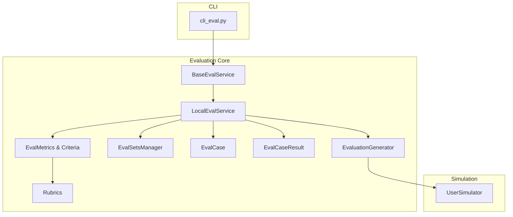
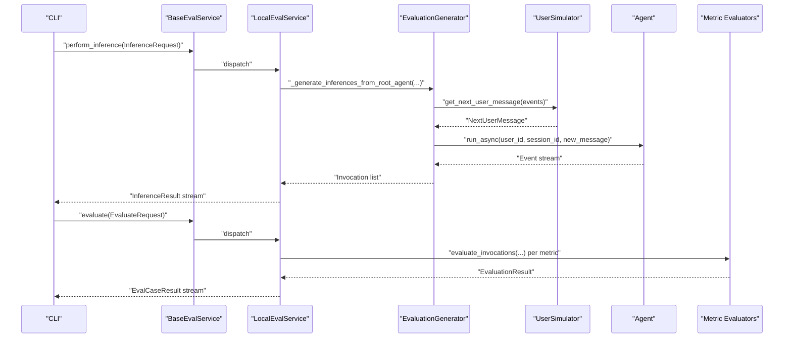
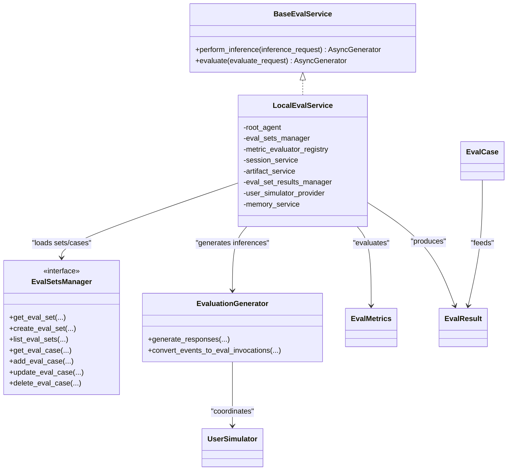

# Evaluation and Testing Framework

<cite>
**Referenced Files in This Document**
- [base_eval_service.py](file://src/google/adk/evaluation/base_eval_service.py)
- [local_eval_service.py](file://src/google/adk/evaluation/local_eval_service.py)
- [eval_metrics.py](file://src/google/adk/evaluation/eval_metrics.py)
- [eval_case.py](file://src/google/adk/evaluation/eval_case.py)
- [eval_result.py](file://src/google/adk/evaluation/eval_result.py)
- [eval_sets_manager.py](file://src/google/adk/evaluation/eval_sets_manager.py)
- [evaluation_generator.py](file://src/google/adk/evaluation/evaluation_generator.py)
- [user_simulator.py](file://src/google/adk/evaluation/simulation/user_simulator.py)
- [rubric_based_final_response_quality_v1.py](file://src/google/adk/evaluation/rubric_based_final_response_quality_v1.py)
- [safety_evaluator.py](file://src/google/adk/evaluation/safety_evaluator.py)
- [hallucinations_v1.py](file://src/google/adk/evaluation/hallucinations_v1.py)
- [cli_eval.py](file://src/google/adk/cli/cli_eval.py)
- [eval_rubrics.py](file://src/google/adk/evaluation/eval_rubrics.py)
</cite>

## Table of Contents
1. [Introduction](#introduction)
2. [Project Structure](#project-structure)
3. [Core Components](#core-components)
4. [Architecture Overview](#architecture-overview)
5. [Detailed Component Analysis](#detailed-component-analysis)
6. [Dependency Analysis](#dependency-analysis)
7. [Performance Considerations](#performance-considerations)
8. [Troubleshooting Guide](#troubleshooting-guide)
9. [Conclusion](#conclusion)
10. [Appendices](#appendices)

## Introduction
This document describes the ADK evaluation and testing framework. It explains the evaluation service architecture, execution modes (local and cloud-based), the metrics system (response quality, tool use effectiveness, safety, hallucination detection), the simulation framework for user interaction modeling, and the lifecycle of evaluation sets and test cases. It also covers automated evaluation workflows, practical examples, performance optimization, batch processing, scalability, CI/CD integration, and best practices for designing evaluations and analyzing results.

## Project Structure
The evaluation subsystem centers around a pluggable evaluation service, a set of evaluation metrics and rubrics, a simulation framework for user interactions, and a CLI for orchestrating end-to-end evaluation pipelines. The following diagram maps the primary modules and their relationships.

**Diagram sources**
- [base_eval_service.py](file://src/google/adk/evaluation/base_eval_service.py#L177-L202)
- [local_eval_service.py](file://src/google/adk/evaluation/local_eval_service.py#L111-L141)
- [evaluation_generator.py](file://src/google/adk/evaluation/evaluation_generator.py#L69-L268)
- [eval_sets_manager.py](file://src/google/adk/evaluation/eval_sets_manager.py#L25-L86)
- [eval_case.py](file://src/google/adk/evaluation/eval_case.py#L132-L177)
- [eval_result.py](file://src/google/adk/evaluation/eval_result.py#L31-L92)
- [eval_metrics.py](file://src/google/adk/evaluation/eval_metrics.py#L254-L384)
- [eval_rubrics.py](file://src/google/adk/evaluation/eval_rubrics.py#L35-L83)
- [user_simulator.py](file://src/google/adk/evaluation/simulation/user_simulator.py#L77-L117)
- [cli_eval.py](file://src/google/adk/cli/cli_eval.py#L28-L44)

**Section sources**
- [base_eval_service.py](file://src/google/adk/evaluation/base_eval_service.py#L177-L202)
- [local_eval_service.py](file://src/google/adk/evaluation/local_eval_service.py#L111-L141)
- [evaluation_generator.py](file://src/google/adk/evaluation/evaluation_generator.py#L69-L268)
- [eval_sets_manager.py](file://src/google/adk/evaluation/eval_sets_manager.py#L25-L86)
- [eval_case.py](file://src/google/adk/evaluation/eval_case.py#L132-L177)
- [eval_result.py](file://src/google/adk/evaluation/eval_result.py#L31-L92)
- [eval_metrics.py](file://src/google/adk/evaluation/eval_metrics.py#L254-L384)
- [eval_rubrics.py](file://src/google/adk/evaluation/eval_rubrics.py#L35-L83)
- [user_simulator.py](file://src/google/adk/evaluation/simulation/user_simulator.py#L77-L117)
- [cli_eval.py](file://src/google/adk/cli/cli_eval.py#L28-L44)

## Core Components
- Evaluation service abstractions and implementations:
  - Base evaluation contract and request/response models define the evaluation workflow.
  - Local evaluation service executes inferences and evaluations locally with concurrency control.
- Evaluation data models:
  - EvalCase defines a single evaluation scenario with either a static conversation or a conversation scenario.
  - Invocation represents a single turn’s user content, agent final response, and intermediate events.
  - EvalCaseResult aggregates per-metric scores and invocation-level results.
- Metrics and rubrics:
  - EvalMetric encapsulates metric name, threshold, and criterion (including judge model options).
  - Rubrics define testable properties used by rubric-based evaluators.
- Simulation:
  - UserSimulator drives conversational turns for evaluation, returning user messages and optional simulation-specific evaluators.
- CLI integration:
  - Provides commands to orchestrate evaluation sets, collect inferences, run evaluations, and print structured results.

**Section sources**
- [base_eval_service.py](file://src/google/adk/evaluation/base_eval_service.py#L33-L202)
- [local_eval_service.py](file://src/google/adk/evaluation/local_eval_service.py#L111-L513)
- [eval_case.py](file://src/google/adk/evaluation/eval_case.py#L80-L177)
- [eval_result.py](file://src/google/adk/evaluation/eval_result.py#L31-L92)
- [eval_metrics.py](file://src/google/adk/evaluation/eval_metrics.py#L254-L384)
- [eval_rubrics.py](file://src/google/adk/evaluation/eval_rubrics.py#L35-L83)
- [user_simulator.py](file://src/google/adk/evaluation/simulation/user_simulator.py#L77-L117)
- [cli_eval.py](file://src/google/adk/cli/cli_eval.py#L135-L315)

## Architecture Overview
The evaluation pipeline consists of:
- Inference generation: The evaluation generator coordinates a user simulator and an agent via a Runner to produce Invocation sequences.
- Evaluation scoring: The evaluation service evaluates each Invocation against configured metrics, aggregating per-invocation and overall results.
- Results management: Results can be streamed and optionally persisted via an EvalSetResultsManager.

**Diagram sources**
- [base_eval_service.py](file://src/google/adk/evaluation/base_eval_service.py#L177-L202)
- [local_eval_service.py](file://src/google/adk/evaluation/local_eval_service.py#L142-L229)
- [evaluation_generator.py](file://src/google/adk/evaluation/evaluation_generator.py#L191-L268)
- [user_simulator.py](file://src/google/adk/evaluation/simulation/user_simulator.py#L96-L110)
- [cli_eval.py](file://src/google/adk/cli/cli_eval.py#L135-L174)

## Detailed Component Analysis

### Evaluation Service Abstractions
- BaseEvalService defines asynchronous contracts for performing inferences and evaluating results, with typed requests and results.
- InferenceRequest carries app name, eval set id, optional eval case ids, and inference configuration including parallelism.
- EvaluateRequest carries inference results and evaluation configuration including parallelism and metric list.

Key behaviors:
- Concurrency control via semaphores for both inference and evaluation phases.
- Streaming of partial results to support real-time feedback and progress reporting.

**Section sources**
- [base_eval_service.py](file://src/google/adk/evaluation/base_eval_service.py#L33-L202)

### Local Evaluation Service
- Implements BaseEvalService to run evaluations locally with configurable services (session, artifact, memory).
- Performs inference per eval case using EvaluationGenerator and a UserSimulatorProvider.
- Evaluates metrics via a registry of evaluators, aggregating per-invocation and overall scores.
- Persists eval set results when a results manager is provided.

Concurrency and resilience:
- Uses asyncio.Semaphore to cap parallelism for both inference and evaluation.
- Wraps metric evaluation in try/catch to avoid single failures blocking others.

**Section sources**
- [local_eval_service.py](file://src/google/adk/evaluation/local_eval_service.py#L111-L513)

### Evaluation Data Models
- EvalCase supports either a static conversation (predefined turns) or a conversation scenario (simulated via a UserSimulator).
- Invocation captures user content, final response, intermediate events, and optional rubrics and app details.
- EvalCaseResult stores final status, overall metric results, per-invocation results, session identifiers, and optional session details.

Validation:
- EvalCase enforces mutual exclusivity between static conversation and scenario.

**Section sources**
- [eval_case.py](file://src/google/adk/evaluation/eval_case.py#L80-L177)
- [eval_result.py](file://src/google/adk/evaluation/eval_result.py#L31-L92)

### Metrics and Rubrics System
- EvalMetric supports multiple criterion types:
  - LlmAsAJudgeCriterion: judge model options and thresholds.
  - RubricsBasedCriterion: rubric lists for rubric-based metrics.
  - HallucinationsCriterion: options for hallucination detection with optional intermediate NL evaluation.
  - ToolTrajectoryCriterion: match types for tool call trajectory comparison.
- Prebuilt metrics include tool trajectory, response match, safety, final response quality, hallucinations, tool use quality, and per-turn user simulator quality.

Rubrics:
- Rubric and RubricContent define testable properties and optional descriptions/types.
- RubricScore records per-rubric scores and rationale.

**Section sources**
- [eval_metrics.py](file://src/google/adk/evaluation/eval_metrics.py#L43-L384)
- [eval_rubrics.py](file://src/google/adk/evaluation/eval_rubrics.py#L24-L83)

### Simulation Framework
- UserSimulator defines an interface to generate the next user message given conversation history and return a status.
- Provides an optional simulation-specific evaluator for measuring simulation fidelity.

Integration:
- EvaluationGenerator coordinates a UserSimulatorProvider to supply a simulator per eval case and iteratively collects events until completion.

**Section sources**
- [user_simulator.py](file://src/google/adk/evaluation/simulation/user_simulator.py#L77-L117)
- [evaluation_generator.py](file://src/google/adk/evaluation/evaluation_generator.py#L247-L268)

### Evaluation Generator
- Generates responses for an eval set by importing an agent module, resetting agent state if needed, and running the agent with a user simulator.
- Converts raw events into Invocation objects, extracting user content, final response, and intermediate events.
- Supports combining existing session data with eval datasets for offline evaluation.

**Section sources**
- [evaluation_generator.py](file://src/google/adk/evaluation/evaluation_generator.py#L69-L419)

### Example Metrics: Final Response Quality, Safety, Hallucinations
- Rubric-based final response quality evaluator:
  - Uses a judge model to score final answers against rubrics, considering tool calls as trusted evidence.
  - Formats prompts with developer instructions, tool declarations, user input, response steps, and final answer.
- Safety evaluator:
  - Delegates to a Vertex AI evaluation facade to compute safety scores in [0,1].
- Hallucinations evaluator:
  - Two-stage process: sentence segmentation followed by sentence validation against a constructed context.
  - Aggregates accuracy score across sentences; supports evaluation of intermediate NL responses.

**Section sources**
- [rubric_based_final_response_quality_v1.py](file://src/google/adk/evaluation/rubric_based_final_response_quality_v1.py#L231-L313)
- [safety_evaluator.py](file://src/google/adk/evaluation/safety_evaluator.py#L29-L62)
- [hallucinations_v1.py](file://src/google/adk/evaluation/hallucinations_v1.py#L258-L760)

### CLI Integration and Automated Workflows
- CLI provides:
  - Importing agents and retrieving root agents.
  - Parsing eval set/run specifications.
  - Collecting inferences and evaluation results asynchronously.
  - Pretty-printing invocation details and rubric scores.
  - Selecting between local and cloud-based eval sets managers depending on configuration.

**Section sources**
- [cli_eval.py](file://src/google/adk/cli/cli_eval.py#L70-L315)

## Dependency Analysis
The evaluation subsystem exhibits clear separation of concerns:
- Base contracts decouple orchestration from implementation.
- LocalEvalService depends on:
  - EvalSetsManager for loading eval sets and cases.
  - EvaluationGenerator for inference generation.
  - MetricEvaluatorRegistry for dispatching evaluators.
  - Session, Artifact, and Memory services for runtime context.
- Metrics depend on rubrics and judge models; evaluators may be synchronous or asynchronous.

**Diagram sources**
- [base_eval_service.py](file://src/google/adk/evaluation/base_eval_service.py#L177-L202)
- [local_eval_service.py](file://src/google/adk/evaluation/local_eval_service.py#L111-L141)
- [evaluation_generator.py](file://src/google/adk/evaluation/evaluation_generator.py#L69-L268)
- [eval_sets_manager.py](file://src/google/adk/evaluation/eval_sets_manager.py#L25-L86)
- [eval_case.py](file://src/google/adk/evaluation/eval_case.py#L132-L177)
- [eval_result.py](file://src/google/adk/evaluation/eval_result.py#L31-L92)
- [eval_metrics.py](file://src/google/adk/evaluation/eval_metrics.py#L254-L384)
- [user_simulator.py](file://src/google/adk/evaluation/simulation/user_simulator.py#L77-L117)

**Section sources**
- [base_eval_service.py](file://src/google/adk/evaluation/base_eval_service.py#L177-L202)
- [local_eval_service.py](file://src/google/adk/evaluation/local_eval_service.py#L111-L141)
- [evaluation_generator.py](file://src/google/adk/evaluation/evaluation_generator.py#L69-L268)
- [eval_sets_manager.py](file://src/google/adk/evaluation/eval_sets_manager.py#L25-L86)
- [eval_case.py](file://src/google/adk/evaluation/eval_case.py#L132-L177)
- [eval_result.py](file://src/google/adk/evaluation/eval_result.py#L31-L92)
- [eval_metrics.py](file://src/google/adk/evaluation/eval_metrics.py#L254-L384)
- [user_simulator.py](file://src/google/adk/evaluation/simulation/user_simulator.py#L77-L117)

## Performance Considerations
- Parallelism controls:
  - Both inference and evaluation use semaphores to bound concurrent work. Tune parallelism based on model quotas and tool SLAs.
- Retry and resilience:
  - Request interceptor and retry options ensure robustness during inference generation.
- Batch processing:
  - Streaming results enables early insights and reduces latency to first result.
- Scalability:
  - LocalEvalService can be extended to integrate cloud-based eval sets managers and results managers for distributed execution.
- Judge model sampling:
  - Some metrics support repeated sampling to mitigate model variance.

[No sources needed since this section provides general guidance]

## Troubleshooting Guide
Common issues and mitigations:
- Missing eval dependencies in CLI:
  - Pretty printing relies on pandas and tabulate; missing packages cause explicit errors.
- Metric evaluation failures:
  - LocalEvalService catches exceptions per metric to avoid cascading failures; check logs for specific metric errors.
- Inference failures:
  - LocalEvalService records failure status and error messages in InferenceResult; inspect error messages for root causes.
- Validation errors:
  - EvalCase enforces that exactly one of conversation or conversation_scenario is provided; mismatches raise validation errors.
- Rubric duplication:
  - Adding rubrics to invocations throws on duplicate rubric_id; ensure unique rubric identifiers.

**Section sources**
- [cli_eval.py](file://src/google/adk/cli/cli_eval.py#L196-L198)
- [local_eval_service.py](file://src/google/adk/evaluation/local_eval_service.py#L354-L368)
- [local_eval_service.py](file://src/google/adk/evaluation/local_eval_service.py#L500-L512)
- [eval_case.py](file://src/google/adk/evaluation/eval_case.py#L169-L176)
- [local_eval_service.py](file://src/google/adk/evaluation/local_eval_service.py#L71-L84)

## Conclusion
The ADK evaluation framework provides a modular, extensible foundation for building robust evaluation pipelines. It supports local execution with concurrency control, rubric-based and judge-model-driven metrics, simulation-driven user interactions, and CLI-driven automation. With clear contracts, streaming results, and resilience mechanisms, it is suitable for iterative agent development, continuous evaluation, and integration into CI/CD workflows.

[No sources needed since this section summarizes without analyzing specific files]

## Appendices

### Practical Setup and Execution Examples
- Define evaluation sets and cases:
  - Create EvalCase instances with either a static conversation or a conversation scenario and optional rubrics.
- Configure metrics:
  - Choose prebuilt metrics or define custom metrics with appropriate criteria (thresholds, judge model options, rubrics).
- Run locally:
  - Use the CLI to import an agent module, select eval sets and cases, and stream results.
- Interpret results:
  - Review overall status, per-metric scores, and per-invocation details; leverage rubric reasoning for targeted improvements.

[No sources needed since this section provides general guidance]

### Best Practices for Evaluation Design and Result Analysis
- Design:
  - Prefer rubric-based metrics for interpretable, testable properties.
  - Use conversation scenarios for realistic, dynamic user interactions.
  - Include diverse eval cases covering tool use, safety, and response quality.
- Execution:
  - Start with conservative parallelism; increase gradually based on quota and stability.
  - Enable retry options for inference generation to reduce flakiness.
- Analysis:
  - Inspect rubric scores and rationales to pinpoint weaknesses.
  - Track trends across eval sets to guide agent improvements.

[No sources needed since this section provides general guidance]