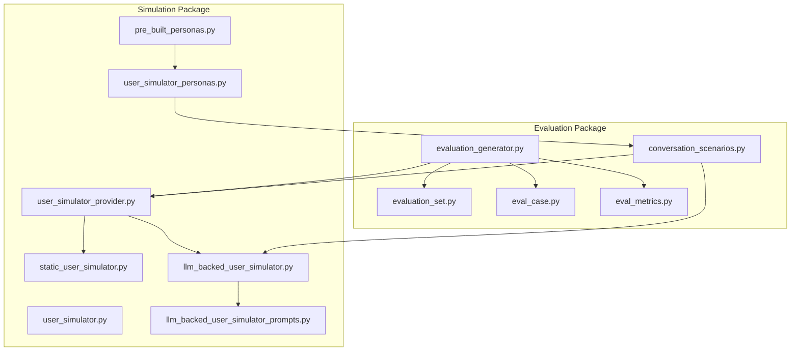
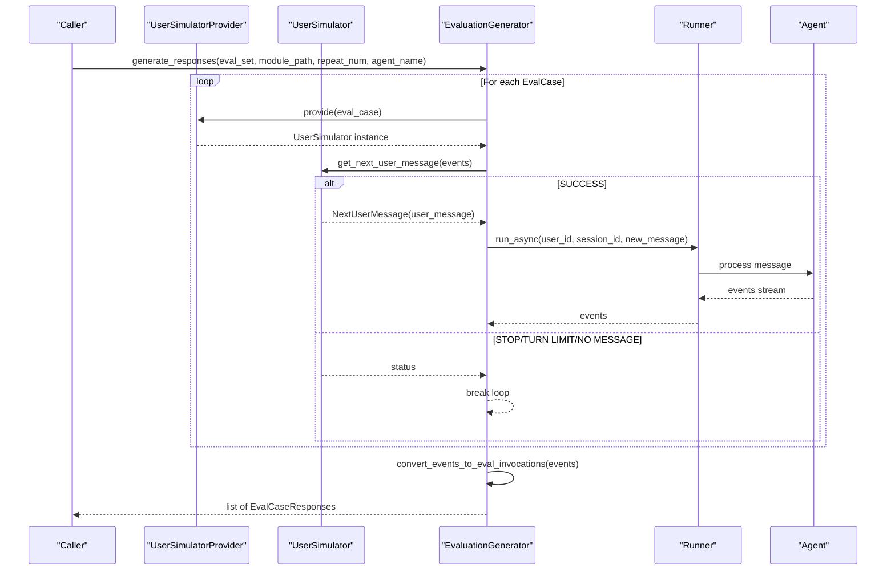
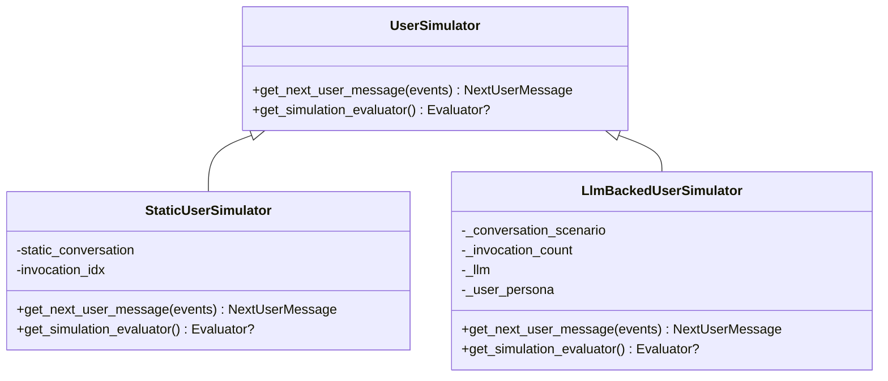
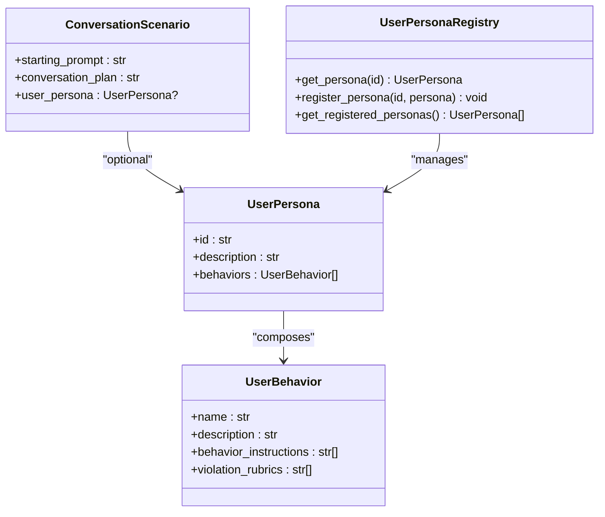
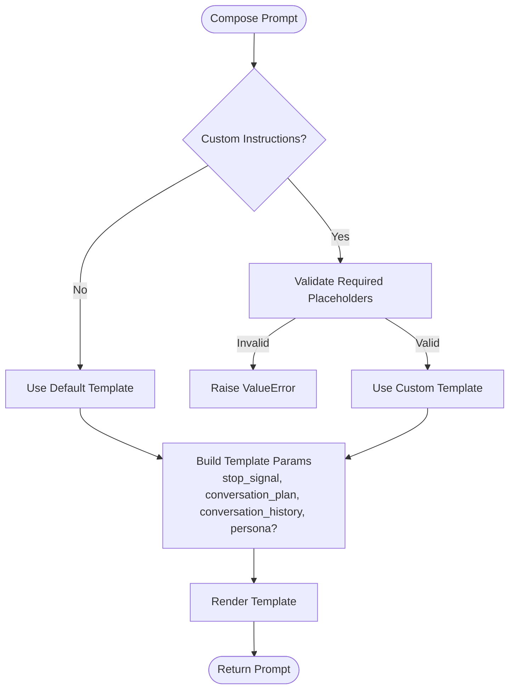
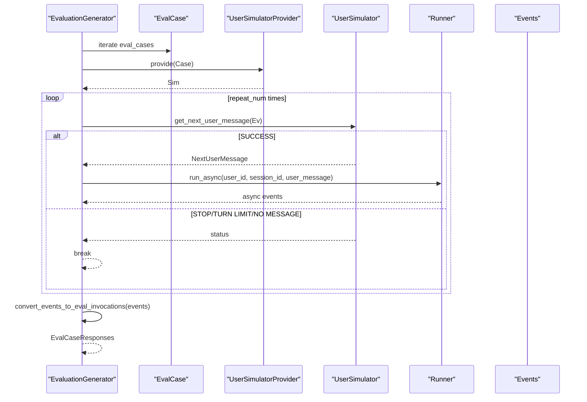
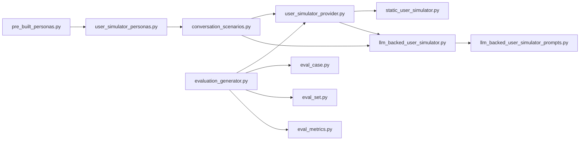

# Simulation and Benchmarking

<cite>
**Referenced Files in This Document**
- [user_simulator.py](file://src/google/adk/evaluation/simulation/user_simulator.py)
- [static_user_simulator.py](file://src/google/adk/evaluation/simulation/static_user_simulator.py)
- [llm_backed_user_simulator.py](file://src/google/adk/evaluation/simulation/llm_backed_user_simulator.py)
- [llm_backed_user_simulator_prompts.py](file://src/google/adk/evaluation/simulation/llm_backed_user_simulator_prompts.py)
- [user_simulator_provider.py](file://src/google/adk/evaluation/simulation/user_simulator_provider.py)
- [pre_built_personas.py](file://src/google/adk/evaluation/simulation/pre_built_personas.py)
- [user_simulator_personas.py](file://src/google/adk/evaluation/simulation/user_simulator_personas.py)
- [conversation_scenarios.py](file://src/google/adk/evaluation/conversation_scenarios.py)
- [evaluation_generator.py](file://src/google/adk/evaluation/evaluation_generator.py)
- [eval_case.py](file://src/google/adk/evaluation/eval_case.py)
- [eval_set.py](file://src/google/adk/evaluation/eval_set.py)
- [eval_metrics.py](file://src/google/adk/evaluation/eval_metrics.py)
</cite>

## Table of Contents
1. [Introduction](#introduction)
2. [Project Structure](#project-structure)
3. [Core Components](#core-components)
4. [Architecture Overview](#architecture-overview)
5. [Detailed Component Analysis](#detailed-component-analysis)
6. [Dependency Analysis](#dependency-analysis)
7. [Performance Considerations](#performance-considerations)
8. [Troubleshooting Guide](#troubleshooting-guide)
9. [Conclusion](#conclusion)
10. [Appendices](#appendices)

## Introduction
This document describes the simulation and benchmarking framework for evaluating agents. It focuses on the UserSimulator base class and its implementations, conversation scenario creation, user persona modeling, and realistic interaction patterns. It also documents the evaluation generator for creating synthetic test cases and benchmark datasets, simulation configuration, and practical examples for designing workflows, creating custom personas, and generating evaluation datasets. Finally, it covers performance optimization, parallel simulation execution, result aggregation, benchmarking methodologies, statistical significance testing, and comparison frameworks.

## Project Structure
The simulation and benchmarking capabilities are centered around the evaluation package with dedicated simulation modules and supporting evaluation data models and metrics.

**Diagram sources**
- [evaluation_generator.py](file://src/google/adk/evaluation/evaluation_generator.py#L69-L108)
- [user_simulator_provider.py](file://src/google/adk/evaluation/simulation/user_simulator_provider.py#L28-L78)
- [user_simulator.py](file://src/google/adk/evaluation/simulation/user_simulator.py#L77-L117)
- [static_user_simulator.py](file://src/google/adk/evaluation/simulation/static_user_simulator.py#L34-L80)
- [llm_backed_user_simulator.py](file://src/google/adk/evaluation/simulation/llm_backed_user_simulator.py#L110-L267)
- [llm_backed_user_simulator_prompts.py](file://src/google/adk/evaluation/simulation/llm_backed_user_simulator_prompts.py#L178-L218)
- [pre_built_personas.py](file://src/google/adk/evaluation/simulation/pre_built_personas.py#L512-L526)
- [user_simulator_personas.py](file://src/google/adk/evaluation/simulation/user_simulator_personas.py#L90-L127)
- [conversation_scenarios.py](file://src/google/adk/evaluation/conversation_scenarios.py#L27-L78)
- [eval_set.py](file://src/google/adk/evaluation/eval_set.py#L24-L42)
- [eval_case.py](file://src/google/adk/evaluation/eval_case.py#L132-L177)
- [eval_metrics.py](file://src/google/adk/evaluation/eval_metrics.py#L254-L384)

**Section sources**
- [evaluation_generator.py](file://src/google/adk/evaluation/evaluation_generator.py#L69-L108)
- [user_simulator_provider.py](file://src/google/adk/evaluation/simulation/user_simulator_provider.py#L28-L78)

## Core Components
- UserSimulator base class defines the contract for simulating user interactions, including message generation and optional simulation evaluation hooks.
- StaticUserSimulator consumes a predefined list of user messages for deterministic scenarios.
- LlmBackedUserSimulator generates user messages via an LLM using a structured plan and persona, with configurable invocation limits and stop signals.
- UserSimulatorProvider selects the appropriate simulator based on EvalCase configuration.
- ConversationScenario models the starting prompt, conversation plan, and optional persona for LLM-backed simulations.
- EvaluationGenerator orchestrates runs, coordinates the simulator with the agent under test, aggregates results, and converts events to invocation records.
- EvalCase and EvalSet define the structure for synthetic test cases and datasets.
- EvalMetrics provides metric definitions and criteria for evaluation.

**Section sources**
- [user_simulator.py](file://src/google/adk/evaluation/simulation/user_simulator.py#L77-L117)
- [static_user_simulator.py](file://src/google/adk/evaluation/simulation/static_user_simulator.py#L34-L80)
- [llm_backed_user_simulator.py](file://src/google/adk/evaluation/simulation/llm_backed_user_simulator.py#L110-L267)
- [user_simulator_provider.py](file://src/google/adk/evaluation/simulation/user_simulator_provider.py#L28-L78)
- [conversation_scenarios.py](file://src/google/adk/evaluation/conversation_scenarios.py#L27-L78)
- [evaluation_generator.py](file://src/google/adk/evaluation/evaluation_generator.py#L69-L108)
- [eval_case.py](file://src/google/adk/evaluation/eval_case.py#L132-L177)
- [eval_set.py](file://src/google/adk/evaluation/eval_set.py#L24-L42)
- [eval_metrics.py](file://src/google/adk/evaluation/eval_metrics.py#L254-L384)

## Architecture Overview
The framework integrates a user simulator with an agent under test through a Runner, capturing events and converting them into standardized invocation records for evaluation.

**Diagram sources**
- [evaluation_generator.py](file://src/google/adk/evaluation/evaluation_generator.py#L73-L108)
- [evaluation_generator.py](file://src/google/adk/evaluation/evaluation_generator.py#L137-L160)
- [evaluation_generator.py](file://src/google/adk/evaluation/evaluation_generator.py#L191-L268)
- [user_simulator_provider.py](file://src/google/adk/evaluation/simulation/user_simulator_provider.py#L43-L78)
- [user_simulator.py](file://src/google/adk/evaluation/simulation/user_simulator.py#L96-L110)

## Detailed Component Analysis

### UserSimulator Base Class and Implementations
- Contract definition: get_next_user_message receives conversation events and returns a NextUserMessage with either a user message or a status indicating why no message was produced.
- StaticUserSimulator: Iterates through a static conversation list and signals completion or stop conditions.
- LlmBackedUserSimulator: Uses an LLM to generate user messages based on a conversation plan and optional persona, with invocation limits and stop signals.

**Diagram sources**
- [user_simulator.py](file://src/google/adk/evaluation/simulation/user_simulator.py#L77-L117)
- [static_user_simulator.py](file://src/google/adk/evaluation/simulation/static_user_simulator.py#L34-L80)
- [llm_backed_user_simulator.py](file://src/google/adk/evaluation/simulation/llm_backed_user_simulator.py#L110-L267)

**Section sources**
- [user_simulator.py](file://src/google/adk/evaluation/simulation/user_simulator.py#L77-L117)
- [static_user_simulator.py](file://src/google/adk/evaluation/simulation/static_user_simulator.py#L34-L80)
- [llm_backed_user_simulator.py](file://src/google/adk/evaluation/simulation/llm_backed_user_simulator.py#L110-L267)

### Conversation Scenario Creation and Persona Modeling
- ConversationScenario encapsulates a starting prompt, a conversation plan, and an optional persona.
- UserPersonaRegistry manages personas composed of atomic behaviors with instructions and violation rubrics.
- Pre-built personas demonstrate expert, novice, and evaluator profiles.

**Diagram sources**
- [conversation_scenarios.py](file://src/google/adk/evaluation/conversation_scenarios.py#L27-L78)
- [user_simulator_personas.py](file://src/google/adk/evaluation/simulation/user_simulator_personas.py#L28-L127)
- [pre_built_personas.py](file://src/google/adk/evaluation/simulation/pre_built_personas.py#L459-L526)

**Section sources**
- [conversation_scenarios.py](file://src/google/adk/evaluation/conversation_scenarios.py#L27-L78)
- [user_simulator_personas.py](file://src/google/adk/evaluation/simulation/user_simulator_personas.py#L28-L127)
- [pre_built_personas.py](file://src/google/adk/evaluation/simulation/pre_built_personas.py#L459-L526)

### LLM-Backed User Simulator Prompting and Templates
- The simulator composes a prompt using a default template or a custom template with persona-specific instructions.
- Validation ensures required placeholders are present in custom templates.

**Diagram sources**
- [llm_backed_user_simulator_prompts.py](file://src/google/adk/evaluation/simulation/llm_backed_user_simulator_prompts.py#L178-L218)
- [llm_backed_user_simulator_prompts.py](file://src/google/adk/evaluation/simulation/llm_backed_user_simulator_prompts.py#L106-L136)

**Section sources**
- [llm_backed_user_simulator_prompts.py](file://src/google/adk/evaluation/simulation/llm_backed_user_simulator_prompts.py#L178-L218)
- [llm_backed_user_simulator_prompts.py](file://src/google/adk/evaluation/simulation/llm_backed_user_simulator_prompts.py#L106-L136)

### Evaluation Generator and Dataset Orchestration
- Generates responses for an EvalSet by iterating EvalCases, selecting a simulator, and invoking the agent multiple times (repeat_num) to reduce variance.
- Coordinates Runner lifecycle, intercepts LLM requests for metadata, and converts events to Invocation records.

**Diagram sources**
- [evaluation_generator.py](file://src/google/adk/evaluation/evaluation_generator.py#L73-L108)
- [evaluation_generator.py](file://src/google/adk/evaluation/evaluation_generator.py#L137-L160)
- [evaluation_generator.py](file://src/google/adk/evaluation/evaluation_generator.py#L191-L268)
- [user_simulator_provider.py](file://src/google/adk/evaluation/simulation/user_simulator_provider.py#L43-L78)

**Section sources**
- [evaluation_generator.py](file://src/google/adk/evaluation/evaluation_generator.py#L69-L108)
- [evaluation_generator.py](file://src/google/adk/evaluation/evaluation_generator.py#L191-L268)
- [eval_case.py](file://src/google/adk/evaluation/eval_case.py#L132-L177)
- [eval_set.py](file://src/google/adk/evaluation/eval_set.py#L24-L42)

### Practical Examples and Workflows

- Designing a user simulation workflow:
  - Define a ConversationScenario with a starting prompt and a conversation plan.
  - Optionally attach a persona from the registry or a custom persona.
  - Provide an EvalSet containing EvalCase entries that reference the scenario.
  - Use EvaluationGenerator.generate_responses to produce multiple responses per case.

- Creating custom personas:
  - Compose UserBehavior entries with instructions and rubrics.
  - Register a UserPersona with the registry and reference it by ID in a ConversationScenario.

- Generating evaluation datasets:
  - Build EvalSet with multiple EvalCase entries.
  - For static scenarios, embed a StaticConversation directly in EvalCase.
  - For dynamic scenarios, rely on LLM-backed user simulator via ConversationScenario.

**Section sources**
- [conversation_scenarios.py](file://src/google/adk/evaluation/conversation_scenarios.py#L27-L78)
- [user_simulator_personas.py](file://src/google/adk/evaluation/simulation/user_simulator_personas.py#L90-L127)
- [pre_built_personas.py](file://src/google/adk/evaluation/simulation/pre_built_personas.py#L512-L526)
- [eval_set.py](file://src/google/adk/evaluation/eval_set.py#L24-L42)
- [eval_case.py](file://src/google/adk/evaluation/eval_case.py#L132-L177)
- [evaluation_generator.py](file://src/google/adk/evaluation/evaluation_generator.py#L73-L108)

## Dependency Analysis
The following diagram highlights key dependencies among simulation and evaluation components.

**Diagram sources**
- [user_simulator_provider.py](file://src/google/adk/evaluation/simulation/user_simulator_provider.py#L28-L78)
- [static_user_simulator.py](file://src/google/adk/evaluation/simulation/static_user_simulator.py#L34-L80)
- [llm_backed_user_simulator.py](file://src/google/adk/evaluation/simulation/llm_backed_user_simulator.py#L110-L267)
- [llm_backed_user_simulator_prompts.py](file://src/google/adk/evaluation/simulation/llm_backed_user_simulator_prompts.py#L178-L218)
- [conversation_scenarios.py](file://src/google/adk/evaluation/conversation_scenarios.py#L27-L78)
- [pre_built_personas.py](file://src/google/adk/evaluation/simulation/pre_built_personas.py#L512-L526)
- [user_simulator_personas.py](file://src/google/adk/evaluation/simulation/user_simulator_personas.py#L90-L127)
- [evaluation_generator.py](file://src/google/adk/evaluation/evaluation_generator.py#L69-L108)
- [eval_case.py](file://src/google/adk/evaluation/eval_case.py#L132-L177)
- [eval_set.py](file://src/google/adk/evaluation/eval_set.py#L24-L42)
- [eval_metrics.py](file://src/google/adk/evaluation/eval_metrics.py#L254-L384)

**Section sources**
- [user_simulator_provider.py](file://src/google/adk/evaluation/simulation/user_simulator_provider.py#L28-L78)
- [evaluation_generator.py](file://src/google/adk/evaluation/evaluation_generator.py#L69-L108)

## Performance Considerations
- Invocation limits: LlmBackedUserSimulator enforces a maximum invocation count to prevent runaway conversations.
- Retry options: Ensures resilience against transient model failures during inference.
- Streaming and batching: Runner streams events; batching multiple runs per EvalCase reduces variance via repeat_num.
- Parallel execution: The generator processes EvalCases sequentially in the provided snippet; parallelization can be introduced at the EvalSet level by running multiple EvaluationGenerator.generate_responses concurrently with separate worker pools.

[No sources needed since this section provides general guidance]

## Troubleshooting Guide
- Stop signal detection: LlmBackedUserSimulator considers a stop condition when the stop signal appears in the LLM’s response; ensure the signal matches the configured value.
- Invocation limits: If the simulator reaches the maximum invocation count, it returns a TURN_LIMIT_REACHED status; adjust limits if needed.
- No message generation: If the LLM fails to produce a user message, a runtime error is raised; verify model configuration and prompts.
- Template validation: Custom instructions must include required placeholders; otherwise, a validation error is raised.
- Session initialization: EvaluationGenerator creates an in-memory session and resets agent state per invocation; ensure reset functions are provided when applicable.

**Section sources**
- [llm_backed_user_simulator.py](file://src/google/adk/evaluation/simulation/llm_backed_user_simulator.py#L224-L259)
- [llm_backed_user_simulator_prompts.py](file://src/google/adk/evaluation/simulation/llm_backed_user_simulator_prompts.py#L106-L136)
- [evaluation_generator.py](file://src/google/adk/evaluation/evaluation_generator.py#L225-L228)

## Conclusion
The simulation and benchmarking framework provides a robust foundation for constructing realistic user interactions and evaluating agent performance. The UserSimulator abstractions enable both deterministic static scenarios and dynamic LLM-backed simulations guided by conversation plans and personas. EvaluationGenerator integrates these components to produce standardized invocation records suitable for downstream metrics and rubric-based evaluations.

[No sources needed since this section summarizes without analyzing specific files]

## Appendices

### Simulation Configuration Reference
- BaseUserSimulatorConfig: Shared configuration base for user simulators.
- LlmBackedUserSimulatorConfig: Includes model selection, model configuration, max allowed invocations, and optional custom instructions.
- ConversationScenario: Defines starting prompt, conversation plan, and optional persona.
- UserPersonaRegistry: Manages persona registration and retrieval.

**Section sources**
- [user_simulator.py](file://src/google/adk/evaluation/simulation/user_simulator.py#L35-L42)
- [llm_backed_user_simulator.py](file://src/google/adk/evaluation/simulation/llm_backed_user_simulator.py#L47-L108)
- [conversation_scenarios.py](file://src/google/adk/evaluation/conversation_scenarios.py#L27-L78)
- [user_simulator_personas.py](file://src/google/adk/evaluation/simulation/user_simulator_personas.py#L90-L127)

### Benchmarking Methodologies and Statistical Significance
- Repeated sampling: Use repeat_num to collect multiple responses per EvalCase to estimate variability.
- Metric criteria: Apply thresholds and judge model options to compute scores and rubric-based evaluations.
- Comparison frameworks: Aggregate per-invocation results and compare distributions across agents or configurations using appropriate statistical tests.

**Section sources**
- [evaluation_generator.py](file://src/google/adk/evaluation/evaluation_generator.py#L73-L88)
- [eval_metrics.py](file://src/google/adk/evaluation/eval_metrics.py#L69-L120)
- [eval_metrics.py](file://src/google/adk/evaluation/eval_metrics.py#L254-L384)