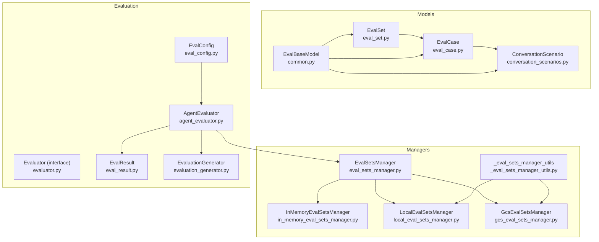
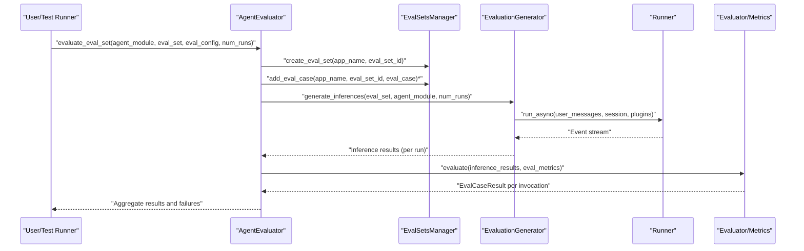
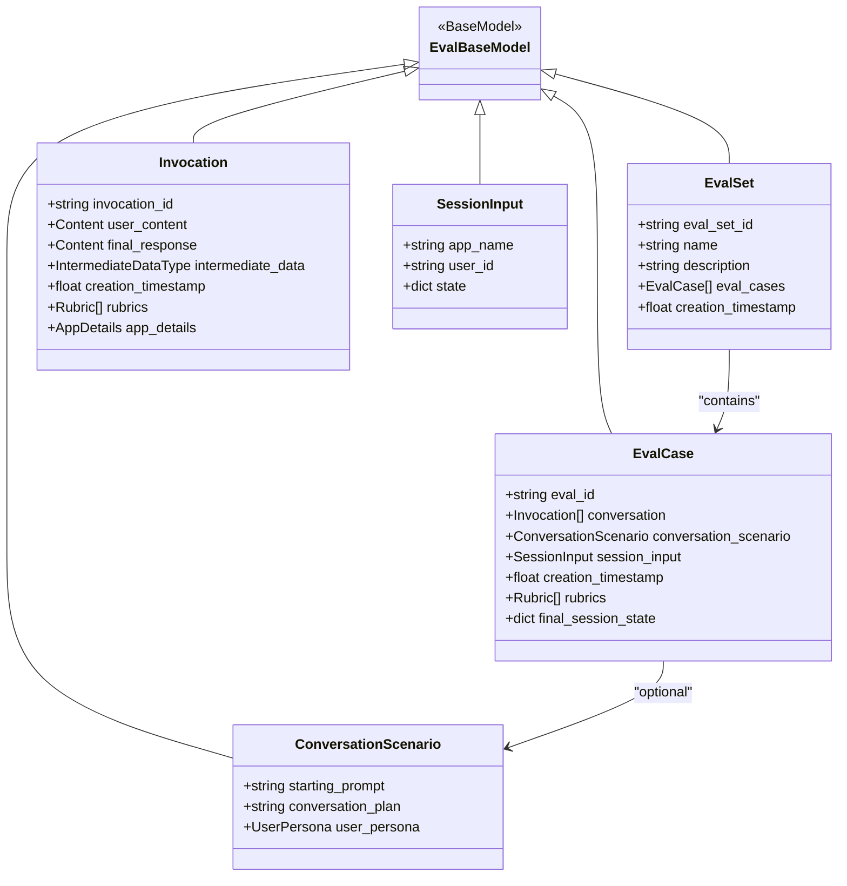
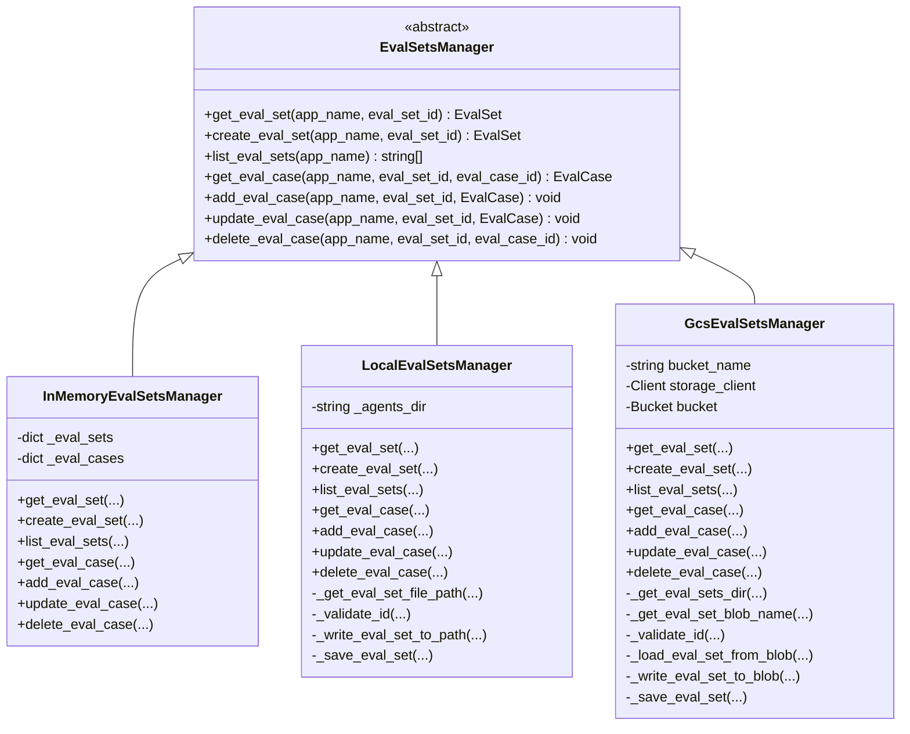
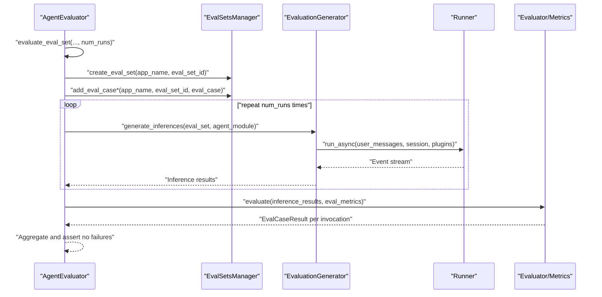
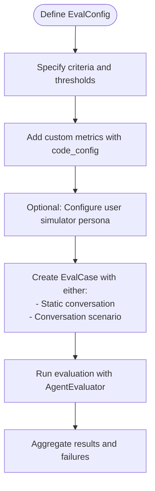
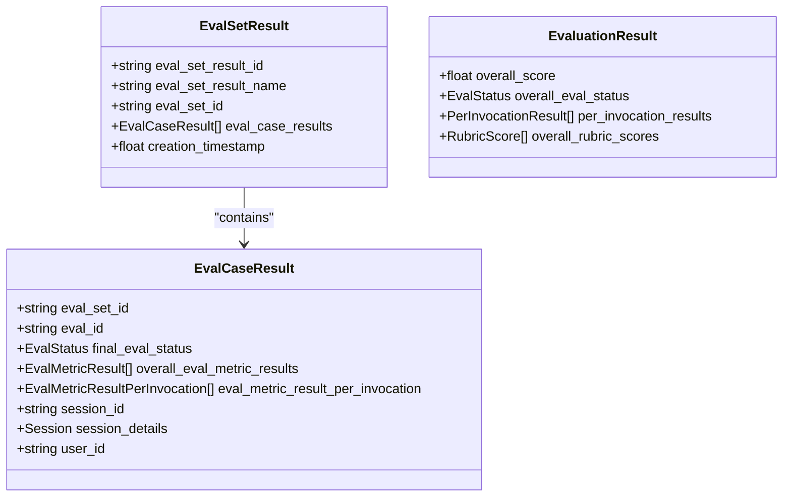
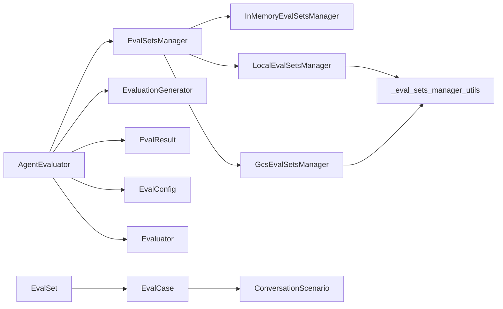

# Test Case Management and Workflows

<cite>
**Referenced Files in This Document**
- [eval_set.py](file://src/google/adk/evaluation/eval_set.py)
- [eval_case.py](file://src/google/adk/evaluation/eval_case.py)
- [eval_sets_manager.py](file://src/google/adk/evaluation/eval_sets_manager.py)
- [in_memory_eval_sets_manager.py](file://src/google/adk/evaluation/in_memory_eval_sets_manager.py)
- [local_eval_sets_manager.py](file://src/google/adk/evaluation/local_eval_sets_manager.py)
- [gcs_eval_sets_manager.py](file://src/google/adk/evaluation/gcs_eval_sets_manager.py)
- [_eval_sets_manager_utils.py](file://src/google/adk/evaluation/_eval_sets_manager_utils.py)
- [eval_result.py](file://src/google/adk/evaluation/eval_result.py)
- [common.py](file://src/google/adk/evaluation/common.py)
- [evaluator.py](file://src/google/adk/evaluation/evaluator.py)
- [agent_evaluator.py](file://src/google/adk/evaluation/agent_evaluator.py)
- [conversation_scenarios.py](file://src/google/adk/evaluation/conversation_scenarios.py)
- [eval_config.py](file://src/google/adk/evaluation/eval_config.py)
- [evaluation_generator.py](file://src/google/adk/evaluation/evaluation_generator.py)
- [test_gcs_eval_sets_manager.py](file://tests/unittests/evaluation/test_gcs_eval_sets_manager.py)
</cite>

## Table of Contents
1. [Introduction](#introduction)
2. [Project Structure](#project-structure)
3. [Core Components](#core-components)
4. [Architecture Overview](#architecture-overview)
5. [Detailed Component Analysis](#detailed-component-analysis)
6. [Dependency Analysis](#dependency-analysis)
7. [Performance Considerations](#performance-considerations)
8. [Troubleshooting Guide](#troubleshooting-guide)
9. [Conclusion](#conclusion)
10. [Appendices](#appendices)

## Introduction
This document explains the test case management and evaluation workflows in the repository. It focuses on how evaluation scenarios and test cases are modeled, how evaluation sets are managed across in-memory and cloud environments, and how evaluation pipelines are orchestrated end-to-end. It covers configuration, scenario definition, parameterization, scheduling, result collection, reporting, optimization, retries, error recovery, versioning, sharing, and CI/CD integration. Practical examples are included to guide creating robust evaluation pipelines and interpreting results.

## Project Structure
The evaluation subsystem centers around:
- Data models for evaluation sets and cases
- Managers for storing and retrieving evaluation sets and cases
- Evaluation orchestration and metrics evaluation
- Scenario and configuration support
- Utilities for migration and result aggregation

**Diagram sources**
- [eval_set.py](file://src/google/adk/evaluation/eval_set.py#L24-L42)
- [eval_case.py](file://src/google/adk/evaluation/eval_case.py#L132-L177)
- [conversation_scenarios.py](file://src/google/adk/evaluation/conversation_scenarios.py#L27-L67)
- [common.py](file://src/google/adk/evaluation/common.py#L21-L28)
- [eval_sets_manager.py](file://src/google/adk/evaluation/eval_sets_manager.py#L25-L86)
- [in_memory_eval_sets_manager.py](file://src/google/adk/evaluation/in_memory_eval_sets_manager.py#L28-L153)
- [local_eval_sets_manager.py](file://src/google/adk/evaluation/local_eval_sets_manager.py#L191-L341)
- [gcs_eval_sets_manager.py](file://src/google/adk/evaluation/gcs_eval_sets_manager.py#L42-L211)
- [_eval_sets_manager_utils.py](file://src/google/adk/evaluation/_eval_sets_manager_utils.py#L35-L108)
- [agent_evaluator.py](file://src/google/adk/evaluation/agent_evaluator.py#L97-L695)
- [evaluator.py](file://src/google/adk/evaluation/evaluator.py#L57-L81)
- [eval_result.py](file://src/google/adk/evaluation/eval_result.py#L31-L92)
- [eval_config.py](file://src/google/adk/evaluation/eval_config.py#L71-L219)
- [evaluation_generator.py](file://src/google/adk/evaluation/evaluation_generator.py#L69-L419)

**Section sources**
- [eval_set.py](file://src/google/adk/evaluation/eval_set.py#L24-L42)
- [eval_case.py](file://src/google/adk/evaluation/eval_case.py#L132-L177)
- [eval_sets_manager.py](file://src/google/adk/evaluation/eval_sets_manager.py#L25-L86)
- [in_memory_eval_sets_manager.py](file://src/google/adk/evaluation/in_memory_eval_sets_manager.py#L28-L153)
- [local_eval_sets_manager.py](file://src/google/adk/evaluation/local_eval_sets_manager.py#L191-L341)
- [gcs_eval_sets_manager.py](file://src/google/adk/evaluation/gcs_eval_sets_manager.py#L42-L211)
- [_eval_sets_manager_utils.py](file://src/google/adk/evaluation/_eval_sets_manager_utils.py#L35-L108)
- [eval_result.py](file://src/google/adk/evaluation/eval_result.py#L31-L92)
- [common.py](file://src/google/adk/evaluation/common.py#L21-L28)
- [evaluator.py](file://src/google/adk/evaluation/evaluator.py#L57-L81)
- [agent_evaluator.py](file://src/google/adk/evaluation/agent_evaluator.py#L97-L695)
- [conversation_scenarios.py](file://src/google/adk/evaluation/conversation_scenarios.py#L27-L67)
- [eval_config.py](file://src/google/adk/evaluation/eval_config.py#L71-L219)
- [evaluation_generator.py](file://src/google/adk/evaluation/evaluation_generator.py#L69-L419)

## Core Components
- EvalSet: A container for evaluation cases with metadata and creation timestamp.
- EvalCase: A single evaluation scenario with either a static conversation or a conversation scenario, plus session initialization and rubrics.
- EvalSetsManager and implementations: Interfaces and concrete managers for CRUD operations on evaluation sets and cases, supporting in-memory, local disk, and Google Cloud Storage backends.
- AgentEvaluator: Orchestrates evaluation runs, manages multiple runs per case, aggregates results, and reports failures.
- EvaluationGenerator: Generates inference responses for evaluation sets using a user simulator and runner pipeline.
- EvalConfig and metrics: Defines evaluation criteria, thresholds, and custom metrics.
- Results and evaluators: Structures for per-case/per-invocation results and the evaluator interface.

**Section sources**
- [eval_set.py](file://src/google/adk/evaluation/eval_set.py#L24-L42)
- [eval_case.py](file://src/google/adk/evaluation/eval_case.py#L132-L177)
- [eval_sets_manager.py](file://src/google/adk/evaluation/eval_sets_manager.py#L25-L86)
- [in_memory_eval_sets_manager.py](file://src/google/adk/evaluation/in_memory_eval_sets_manager.py#L28-L153)
- [local_eval_sets_manager.py](file://src/google/adk/evaluation/local_eval_sets_manager.py#L191-L341)
- [gcs_eval_sets_manager.py](file://src/google/adk/evaluation/gcs_eval_sets_manager.py#L42-L211)
- [agent_evaluator.py](file://src/google/adk/evaluation/agent_evaluator.py#L97-L695)
- [evaluation_generator.py](file://src/google/adk/evaluation/evaluation_generator.py#L69-L419)
- [eval_config.py](file://src/google/adk/evaluation/eval_config.py#L71-L219)
- [eval_result.py](file://src/google/adk/evaluation/eval_result.py#L31-L92)
- [evaluator.py](file://src/google/adk/evaluation/evaluator.py#L57-L81)

## Architecture Overview
The evaluation workflow integrates data modeling, storage, orchestration, and metrics evaluation. The high-level flow:
- Define evaluation scenarios via EvalCase (static conversation or scenario).
- Store and manage sets/cases via EvalSetsManager implementations.
- Orchestrate evaluation runs using AgentEvaluator, which delegates to EvaluationGenerator for inference generation and LocalEvalService for metrics evaluation.
- Aggregate results into EvalCaseResult/EvalSetResult for reporting and trend analysis.

**Diagram sources**
- [agent_evaluator.py](file://src/google/adk/evaluation/agent_evaluator.py#L108-L194)
- [evaluation_generator.py](file://src/google/adk/evaluation/evaluation_generator.py#L137-L268)
- [eval_sets_manager.py](file://src/google/adk/evaluation/eval_sets_manager.py#L25-L86)
- [in_memory_eval_sets_manager.py](file://src/google/adk/evaluation/in_memory_eval_sets_manager.py#L54-L103)

## Detailed Component Analysis

### Data Models: EvalSet and EvalCase
- EvalSet encapsulates a unique identifier, optional name/description, a list of EvalCase instances, and a creation timestamp.
- EvalCase supports:
  - Static conversation: a sequence of invocations with user content, final response, intermediate data, timestamps, rubrics, and app details.
  - Conversation scenario: a structured plan for a user simulator to generate dynamic conversations.
  - Session initialization: app name, user id, and initial state.
  - Validation ensures exactly one of conversation or conversation_scenario is provided.

**Diagram sources**
- [eval_set.py](file://src/google/adk/evaluation/eval_set.py#L24-L42)
- [eval_case.py](file://src/google/adk/evaluation/eval_case.py#L132-L177)
- [conversation_scenarios.py](file://src/google/adk/evaluation/conversation_scenarios.py#L27-L67)
- [common.py](file://src/google/adk/evaluation/common.py#L21-L28)

**Section sources**
- [eval_set.py](file://src/google/adk/evaluation/eval_set.py#L24-L42)
- [eval_case.py](file://src/google/adk/evaluation/eval_case.py#L132-L177)
- [conversation_scenarios.py](file://src/google/adk/evaluation/conversation_scenarios.py#L27-L67)
- [common.py](file://src/google/adk/evaluation/common.py#L21-L28)

### Evaluation Sets Manager Architecture
- EvalSetsManager defines the contract for getting, creating, listing, adding/updating/deleting cases.
- InMemoryEvalSetsManager: Uses nested dicts to store sets and cases in memory.
- LocalEvalSetsManager: Persists sets to disk with JSON schema validation and migration support.
- GcsEvalSetsManager: Stores sets in Google Cloud Storage with blob naming conventions and validation.

**Diagram sources**
- [eval_sets_manager.py](file://src/google/adk/evaluation/eval_sets_manager.py#L25-L86)
- [in_memory_eval_sets_manager.py](file://src/google/adk/evaluation/in_memory_eval_sets_manager.py#L28-L153)
- [local_eval_sets_manager.py](file://src/google/adk/evaluation/local_eval_sets_manager.py#L191-L341)
- [gcs_eval_sets_manager.py](file://src/google/adk/evaluation/gcs_eval_sets_manager.py#L42-L211)

**Section sources**
- [eval_sets_manager.py](file://src/google/adk/evaluation/eval_sets_manager.py#L25-L86)
- [in_memory_eval_sets_manager.py](file://src/google/adk/evaluation/in_memory_eval_sets_manager.py#L28-L153)
- [local_eval_sets_manager.py](file://src/google/adk/evaluation/local_eval_sets_manager.py#L191-L341)
- [gcs_eval_sets_manager.py](file://src/google/adk/evaluation/gcs_eval_sets_manager.py#L42-L211)
- [_eval_sets_manager_utils.py](file://src/google/adk/evaluation/_eval_sets_manager_utils.py#L35-L108)

### Evaluation Workflow Orchestration
- AgentEvaluator orchestrates:
  - Loading EvalSet from file or in-memory.
  - Determining evaluation configuration and criteria.
  - Generating inferences via EvaluationGenerator.
  - Evaluating metrics and aggregating results.
  - Reporting failures and overall status.
- EvaluationGenerator coordinates:
  - User simulator to produce user messages.
  - Runner to execute agent invocations.
  - Conversion of events to Invocation structures.
  - Retry and request interception plugins for resilience.

**Diagram sources**
- [agent_evaluator.py](file://src/google/adk/evaluation/agent_evaluator.py#L108-L194)
- [evaluation_generator.py](file://src/google/adk/evaluation/evaluation_generator.py#L137-L268)
- [eval_sets_manager.py](file://src/google/adk/evaluation/eval_sets_manager.py#L25-L86)

**Section sources**
- [agent_evaluator.py](file://src/google/adk/evaluation/agent_evaluator.py#L108-L194)
- [evaluation_generator.py](file://src/google/adk/evaluation/evaluation_generator.py#L137-L268)
- [evaluator.py](file://src/google/adk/evaluation/evaluator.py#L57-L81)

### Test Case Configuration, Scenarios, and Parameterization
- EvalConfig defines criteria and thresholds, supports custom metrics with code configuration, and optional user simulator configuration.
- ConversationScenario enables dynamic conversation generation with starting prompts, plans, and personas.
- Parameterization strategies:
  - Static conversation: embed expected tool calls and responses in EvalCase.
  - Scenario-driven: define conversation_plan and persona for user simulator.
  - Session initialization: provide app_name, user_id, and initial state for reproducible runs.

**Diagram sources**
- [eval_config.py](file://src/google/adk/evaluation/eval_config.py#L71-L219)
- [conversation_scenarios.py](file://src/google/adk/evaluation/conversation_scenarios.py#L27-L67)
- [eval_case.py](file://src/google/adk/evaluation/eval_case.py#L132-L177)

**Section sources**
- [eval_config.py](file://src/google/adk/evaluation/eval_config.py#L71-L219)
- [conversation_scenarios.py](file://src/google/adk/evaluation/conversation_scenarios.py#L27-L67)
- [eval_case.py](file://src/google/adk/evaluation/eval_case.py#L132-L177)

### Result Collection, Aggregation, and Reporting
- AgentEvaluator collects per-invocation results, computes overall scores and statuses, and prints detailed summaries when requested.
- EvalResult structures capture per-case and per-invocation metrics, session identifiers, and optional session details.
- Failures are aggregated and asserted to fail the overall evaluation run.

**Diagram sources**
- [eval_result.py](file://src/google/adk/evaluation/eval_result.py#L31-L92)
- [evaluator.py](file://src/google/adk/evaluation/evaluator.py#L43-L81)

**Section sources**
- [eval_result.py](file://src/google/adk/evaluation/eval_result.py#L31-L92)
- [evaluator.py](file://src/google/adk/evaluation/evaluator.py#L43-L81)
- [agent_evaluator.py](file://src/google/adk/evaluation/agent_evaluator.py#L648-L695)

### Practical Examples
- Creating an evaluation pipeline:
  - Define EvalSet with EvalCase instances (static or scenario-based).
  - Choose a manager backend (in-memory for tests, local/GCS for persistence).
  - Build EvalConfig with desired criteria/thresholds and optional custom metrics.
  - Invoke AgentEvaluator.evaluate_eval_set with agent module path, EvalSet, and EvalConfig.
- Managing test datasets:
  - Use LocalEvalSetsManager to persist EvalSet JSON files on disk.
  - Use GcsEvalSetsManager to store datasets in a GCS bucket for team/shared access.
- Automating evaluation runs:
  - Integrate AgentEvaluator.evaluate with CI/CD to run evaluations on pull requests or scheduled jobs.
  - Use num_runs to average results across multiple runs for stability.

[No sources needed since this section provides general guidance]

### Workflow Optimization, Retry Mechanisms, and Error Recovery
- Retry and resilience:
  - EvaluationGenerator attaches EnsureRetryOptionsPlugin to enforce retry options for LLM requests.
  - Request interceptor plugin records model requests to enrich Invocation with app details.
- Error handling:
  - NotFoundError raised when sets/cases are missing.
  - Validation errors for invalid identifiers and mismatched schemas.
  - Migration utilities to convert legacy formats to the current EvalSet schema.

**Section sources**
- [evaluation_generator.py](file://src/google/adk/evaluation/evaluation_generator.py#L229-L245)
- [local_eval_sets_manager.py](file://src/google/adk/evaluation/local_eval_sets_manager.py#L88-L173)
- [gcs_eval_sets_manager.py](file://src/google/adk/evaluation/gcs_eval_sets_manager.py#L52-L61)
- [test_gcs_eval_sets_manager.py](file://tests/unittests/evaluation/test_gcs_eval_sets_manager.py#L182-L224)

### Test Case Versioning, Sharing, and CI/CD Integration
- Versioning:
  - EvalSet includes creation_timestamp; use eval_set_id to version datasets.
  - Migration utilities support evolving schemas.
- Sharing:
  - LocalEvalSetsManager writes JSON files per app and eval set id.
  - GcsEvalSetsManager organizes datasets under app-specific prefixes in a bucket.
- CI/CD:
  - AgentEvaluator.evaluate supports scanning directories for .test.json files and evaluating them consistently.
  - Use EvalConfig to parameterize runs and thresholds across environments.

**Section sources**
- [local_eval_sets_manager.py](file://src/google/adk/evaluation/local_eval_sets_manager.py#L237-L263)
- [gcs_eval_sets_manager.py](file://src/google/adk/evaluation/gcs_eval_sets_manager.py#L129-L147)
- [agent_evaluator.py](file://src/google/adk/evaluation/agent_evaluator.py#L222-L248)

### Evaluation Result Interpretation, Trend Analysis, and Regression Detection
- Interpretation:
  - EvalStatus indicates PASSED/FAILED/NOT_EVALUATED per metric and overall.
  - AgentEvaluator prints detailed per-invocation tables when requested.
- Trend analysis:
  - Persist EvalSetResult to JSON for historical tracking.
  - Compare overall_eval_status and scores across runs to detect regressions.
- Regression detection:
  - Establish thresholds in EvalConfig; failures indicate potential regressions.
  - Use num_runs averaging to reduce variance and stabilize trends.

**Section sources**
- [eval_result.py](file://src/google/adk/evaluation/eval_result.py#L31-L92)
- [agent_evaluator.py](file://src/google/adk/evaluation/agent_evaluator.py#L413-L462)
- [evaluator.py](file://src/google/adk/evaluation/evaluator.py#L43-L81)

## Dependency Analysis
The evaluation subsystem exhibits low coupling and high cohesion:
- Managers depend on shared utilities for CRUD operations on EvalSet/EvalCase.
- AgentEvaluator depends on managers, generator, and evaluator interfaces.
- Models rely on a common base for validation and serialization.

**Diagram sources**
- [agent_evaluator.py](file://src/google/adk/evaluation/agent_evaluator.py#L97-L695)
- [eval_sets_manager.py](file://src/google/adk/evaluation/eval_sets_manager.py#L25-L86)
- [in_memory_eval_sets_manager.py](file://src/google/adk/evaluation/in_memory_eval_sets_manager.py#L28-L153)
- [local_eval_sets_manager.py](file://src/google/adk/evaluation/local_eval_sets_manager.py#L191-L341)
- [gcs_eval_sets_manager.py](file://src/google/adk/evaluation/gcs_eval_sets_manager.py#L42-L211)
- [_eval_sets_manager_utils.py](file://src/google/adk/evaluation/_eval_sets_manager_utils.py#L35-L108)
- [eval_result.py](file://src/google/adk/evaluation/eval_result.py#L31-L92)
- [eval_config.py](file://src/google/adk/evaluation/eval_config.py#L71-L219)
- [eval_case.py](file://src/google/adk/evaluation/eval_case.py#L132-L177)
- [conversation_scenarios.py](file://src/google/adk/evaluation/conversation_scenarios.py#L27-L67)

**Section sources**
- [agent_evaluator.py](file://src/google/adk/evaluation/agent_evaluator.py#L97-L695)
- [eval_sets_manager.py](file://src/google/adk/evaluation/eval_sets_manager.py#L25-L86)
- [in_memory_eval_sets_manager.py](file://src/google/adk/evaluation/in_memory_eval_sets_manager.py#L28-L153)
- [local_eval_sets_manager.py](file://src/google/adk/evaluation/local_eval_sets_manager.py#L191-L341)
- [gcs_eval_sets_manager.py](file://src/google/adk/evaluation/gcs_eval_sets_manager.py#L42-L211)
- [_eval_sets_manager_utils.py](file://src/google/adk/evaluation/_eval_sets_manager_utils.py#L35-L108)
- [eval_result.py](file://src/google/adk/evaluation/eval_result.py#L31-L92)
- [eval_config.py](file://src/google/adk/evaluation/eval_config.py#L71-L219)
- [eval_case.py](file://src/google/adk/evaluation/eval_case.py#L132-L177)
- [conversation_scenarios.py](file://src/google/adk/evaluation/conversation_scenarios.py#L27-L67)

## Performance Considerations
- Use in-memory manager for unit tests to minimize IO overhead.
- Prefer GCS manager for shared workloads and CI/CD pipelines to centralize datasets.
- Increase num_runs to average out stochasticity in model outputs; balance cost vs. stability.
- Leverage user simulator personas to generate realistic conversational loads without manual scripting.

[No sources needed since this section provides general guidance]

## Troubleshooting Guide
Common issues and resolutions:
- Missing eval set or case:
  - NotFoundError indicates the set/case does not exist; verify app_name and ids.
- Duplicate eval case id:
  - ValueError raised when adding a case with an existing eval_id; ensure unique ids.
- Invalid identifiers:
  - Managers validate EvalSet/EvalCase ids against allowed patterns; adjust to alphanumeric and underscore.
- Legacy schema:
  - LocalEvalSetsManager supports conversion from older JSON format to EvalSet schema; use migration utility.
- Missing Vertex Evaluation SDK:
  - Import warnings indicate optional dependency; install to enable Vertex Evaluation features.

**Section sources**
- [in_memory_eval_sets_manager.py](file://src/google/adk/evaluation/in_memory_eval_sets_manager.py#L56-L98)
- [local_eval_sets_manager.py](file://src/google/adk/evaluation/local_eval_sets_manager.py#L214-L235)
- [gcs_eval_sets_manager.py](file://src/google/adk/evaluation/gcs_eval_sets_manager.py#L113-L118)
- [test_gcs_eval_sets_manager.py](file://tests/unittests/evaluation/test_gcs_eval_sets_manager.py#L182-L204)
- [local_eval_sets_manager.py](file://src/google/adk/evaluation/local_eval_sets_manager.py#L88-L173)
- [agent_evaluator.py](file://src/google/adk/evaluation/agent_evaluator.py#L251-L271)
- [__init__.py](file://src/google/adk/evaluation/__init__.py#L21-L31)

## Conclusion
The evaluation subsystem provides a robust framework for organizing, managing, and executing evaluation pipelines. With clear data models, flexible storage backends, configurable metrics, and resilient orchestration, teams can build reliable automated evaluation workflows, interpret results effectively, and integrate evaluations into CI/CD. Versioning, sharing, and trend analysis capabilities support long-term maintenance and regression detection.

[No sources needed since this section summarizes without analyzing specific files]

## Appendices
- Example file formats:
  - EvalSet JSON schema for local storage and GCS blobs.
  - ConversationScenario JSON for dynamic user simulations.
  - EvalConfig JSON for criteria and custom metrics.
- Migration utilities:
  - Convert legacy formats to the current EvalSet schema for seamless upgrades.

[No sources needed since this section provides general guidance]