# Advanced Integration Examples

<cite>
**Referenced Files in This Document**
- [authn-all-in-one README](file://contributing/samples/authn-adk-all-in-one/README.md)
- [IDP app.py](file://contributing/samples/authn-adk-all-in-one/idp/app.py)
- [Hotel Booker main.py](file://contributing/samples/authn-adk-all-in-one/hotel_booker_app/main.py)
- [ADK Agent OpenAPI Tools agent.py](file://contributing/samples/authn-adk-all-in-one/adk_agents/agent_openapi_tools/agent.py)
- [BigQuery agent.py](file://contributing/samples/bigquery/agent.py)
- [Spanner agent.py](file://contributing/samples/spanner/agent.py)
- [Bigtable agent.py](file://contributing/samples/bigtable/agent.py)
- [Computer Use agent.py](file://contributing/samples/computer_use/agent.py)
- [Pub/Sub agent.py](file://contributing/samples/pubsub/agent.py)
- [Vertex AI Code Execution agent.py](file://contributing/samples/vertex_code_execution/agent.py)
- [Interactions API agent.py](file://contributing/samples/interactions_api/agent.py)
- [Interactions API main.py](file://contributing/samples/interactions_api/main.py)
- [Live Agent API Server live_agent_example.py](file://contributing/samples/live_agent_api_server_example/live_agent_example.py)
</cite>

## Table of Contents
1. [Introduction](#introduction)
2. [Project Structure](#project-structure)
3. [Core Components](#core-components)
4. [Architecture Overview](#architecture-overview)
5. [Detailed Component Analysis](#detailed-component-analysis)
6. [Dependency Analysis](#dependency-analysis)
7. [Performance Considerations](#performance-considerations)
8. [Troubleshooting Guide](#troubleshooting-guide)
9. [Conclusion](#conclusion)
10. [Appendices](#appendices)

## Introduction
This document presents advanced integration examples for building enterprise-grade systems with the ADK. It covers:
- Comprehensive authentication flows using an all-in-one IDP, hotel booking app, and OpenAPI tooling
- Database integrations with BigQuery, Spanner, and Bigtable
- Computer use automation with browser control
- Pub/Sub messaging integration
- Vertex AI code execution
- Interactions API usage for function calling and multi-turn conversations
- Live agent API server implementation for real-time audio/text interactions

The guide emphasizes production-ready patterns: authentication flows, connection management, error handling, performance optimization, security, monitoring, and scalability.

## Project Structure
The repository organizes advanced integration samples under contributing/samples. Each example demonstrates a distinct integration pattern:
- authn-adk-all-in-one: IDP, backend app, and agent using OpenAPI tools
- bigquery, spanner, bigtable: database toolsets with configurable credentials
- computer_use: browser automation via a ComputerUseToolset
- pubsub: messaging toolset for publishing and pulling messages
- vertex_code_execution: Vertex AI code interpreter integration
- interactions_api: Interactions API usage with function calling and multi-turn sessions
- live_agent_api_server_example: WebSocket-based live agent server with audio/text modalities

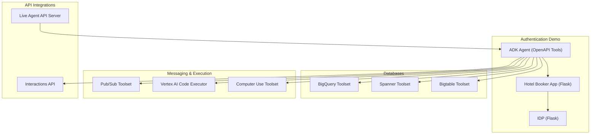

**Diagram sources**
- [IDP app.py](file://contributing/samples/authn-adk-all-in-one/idp/app.py#L188-L465)
- [Hotel Booker main.py](file://contributing/samples/authn-adk-all-in-one/hotel_booker_app/main.py#L172-L262)
- [ADK Agent OpenAPI Tools agent.py](file://contributing/samples/authn-adk-all-in-one/adk_agents/agent_openapi_tools/agent.py#L44-L66)
- [BigQuery agent.py](file://contributing/samples/bigquery/agent.py#L80-L99)
- [Spanner agent.py](file://contributing/samples/spanner/agent.py#L70-L207)
- [Bigtable agent.py](file://contributing/samples/bigtable/agent.py#L61-L134)
- [Pub/Sub agent.py](file://contributing/samples/pubsub/agent.py#L62-L81)
- [Vertex AI Code Execution agent.py](file://contributing/samples/vertex_code_execution/agent.py#L80-L101)
- [Computer Use agent.py](file://contributing/samples/computer_use/agent.py#L34-L44)
- [Interactions API agent.py](file://contributing/samples/interactions_api/agent.py#L84-L105)
- [Live Agent API Server live_agent_example.py](file://contributing/samples/live_agent_api_server_example/live_agent_example.py#L437-L795)

**Section sources**
- [authn-all-in-one README](file://contributing/samples/authn-adk-all-in-one/README.md#L1-L153)
- [IDP app.py](file://contributing/samples/authn-adk-all-in-one/idp/app.py#L188-L465)
- [Hotel Booker main.py](file://contributing/samples/authn-adk-all-in-one/hotel_booker_app/main.py#L172-L262)
- [ADK Agent OpenAPI Tools agent.py](file://contributing/samples/authn-adk-all-in-one/adk_agents/agent_openapi_tools/agent.py#L44-L66)
- [BigQuery agent.py](file://contributing/samples/bigquery/agent.py#L80-L99)
- [Spanner agent.py](file://contributing/samples/spanner/agent.py#L70-L207)
- [Bigtable agent.py](file://contributing/samples/bigtable/agent.py#L61-L134)
- [Computer Use agent.py](file://contributing/samples/computer_use/agent.py#L34-L44)
- [Pub/Sub agent.py](file://contributing/samples/pubsub/agent.py#L62-L81)
- [Vertex AI Code Execution agent.py](file://contributing/samples/vertex_code_execution/agent.py#L80-L101)
- [Interactions API agent.py](file://contributing/samples/interactions_api/agent.py#L84-L105)
- [Live Agent API Server live_agent_example.py](file://contributing/samples/live_agent_api_server_example/live_agent_example.py#L437-L795)

## Core Components
- Authentication Demo (IDP + Backend App + Agent)
  - IDP implements OpenID Connect discovery, token issuance, and consent flow
  - Backend app validates JWTs and exposes protected endpoints
  - Agent constructs OpenAPI toolset with dynamic auth scheme and credential exchange
- Database Integrations
  - BigQuery, Spanner, Bigtable toolsets with configurable credentials (ADC, OAuth2, Service Account)
- Messaging & Execution
  - Pub/Sub toolset for publish/pull/ack
  - Vertex AI code executor for data science workflows
  - Computer use toolset for browser automation
- API Integrations
  - Interactions API for function calling and multi-turn sessions
  - Live agent API server for real-time audio/text modalities

**Section sources**
- [IDP app.py](file://contributing/samples/authn-adk-all-in-one/idp/app.py#L188-L465)
- [Hotel Booker main.py](file://contributing/samples/authn-adk-all-in-one/hotel_booker_app/main.py#L92-L170)
- [ADK Agent OpenAPI Tools agent.py](file://contributing/samples/authn-adk-all-in-one/adk_agents/agent_openapi_tools/agent.py#L21-L66)
- [BigQuery agent.py](file://contributing/samples/bigquery/agent.py#L40-L99)
- [Spanner agent.py](file://contributing/samples/spanner/agent.py#L38-L207)
- [Bigtable agent.py](file://contributing/samples/bigtable/agent.py#L32-L134)
- [Pub/Sub agent.py](file://contributing/samples/pubsub/agent.py#L35-L81)
- [Vertex AI Code Execution agent.py](file://contributing/samples/vertex_code_execution/agent.py#L80-L101)
- [Computer Use agent.py](file://contributing/samples/computer_use/agent.py#L34-L44)
- [Interactions API agent.py](file://contributing/samples/interactions_api/agent.py#L84-L105)

## Architecture Overview
The authentication demo composes three services:
- IDP: Issues access tokens and ID tokens, supports PKCE and client credentials
- Backend App: Validates JWTs using JWKS and enforces token-required routes
- Agent: Builds OpenAPI toolset dynamically and invokes backend APIs with exchanged tokens

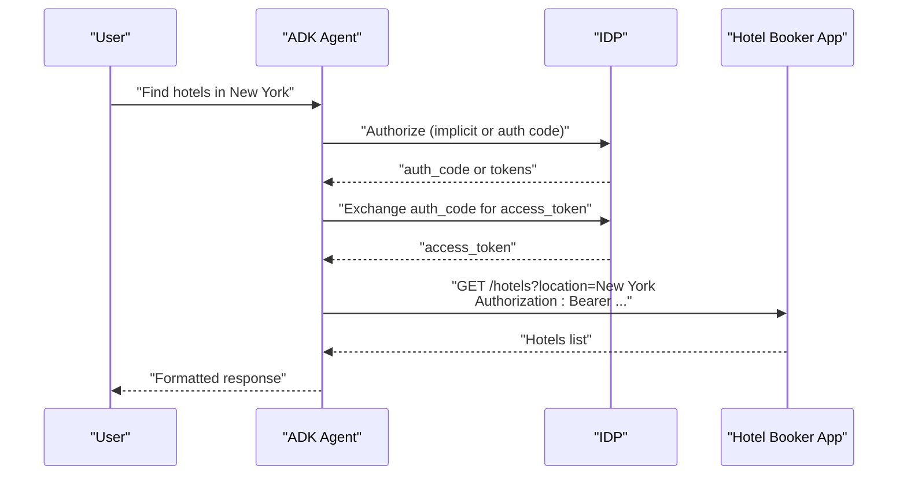

**Diagram sources**
- [IDP app.py](file://contributing/samples/authn-adk-all-in-one/idp/app.py#L198-L316)
- [Hotel Booker main.py](file://contributing/samples/authn-adk-all-in-one/hotel_booker_app/main.py#L172-L191)
- [ADK Agent OpenAPI Tools agent.py](file://contributing/samples/authn-adk-all-in-one/adk_agents/agent_openapi_tools/agent.py#L21-L66)

**Section sources**
- [authn-all-in-one README](file://contributing/samples/authn-adk-all-in-one/README.md#L31-L40)
- [IDP app.py](file://contributing/samples/authn-adk-all-in-one/idp/app.py#L198-L465)
- [Hotel Booker main.py](file://contributing/samples/authn-adk-all-in-one/hotel_booker_app/main.py#L92-L170)
- [ADK Agent OpenAPI Tools agent.py](file://contributing/samples/authn-adk-all-in-one/adk_agents/agent_openapi_tools/agent.py#L21-L66)

## Detailed Component Analysis

### Authentication Demo: IDP, Backend App, and Agent
- IDP
  - Implements OpenID configuration endpoint, JWKS endpoint, authorization endpoint, and token endpoint
  - Supports PKCE, client credentials, and implicit grants
  - Generates signed JWTs with configurable private key and JWKS
- Backend App
  - Validates JWTs using cached OIDC config and JWKS
  - Protects endpoints with a decorator that decodes and verifies tokens
- Agent
  - Dynamically builds an OpenAPI toolset from a YAML spec
  - Exchanges auth code for access token and attaches bearer tokens to tool invocations

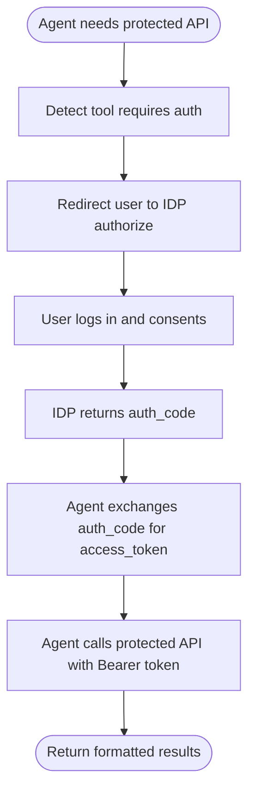

**Diagram sources**
- [IDP app.py](file://contributing/samples/authn-adk-all-in-one/idp/app.py#L198-L465)
- [Hotel Booker main.py](file://contributing/samples/authn-adk-all-in-one/hotel_booker_app/main.py#L92-L170)
- [ADK Agent OpenAPI Tools agent.py](file://contributing/samples/authn-adk-all-in-one/adk_agents/agent_openapi_tools/agent.py#L21-L66)

**Section sources**
- [authn-all-in-one README](file://contributing/samples/authn-adk-all-in-one/README.md#L31-L40)
- [IDP app.py](file://contributing/samples/authn-adk-all-in-one/idp/app.py#L188-L465)
- [Hotel Booker main.py](file://contributing/samples/authn-adk-all-in-one/hotel_booker_app/main.py#L92-L170)
- [ADK Agent OpenAPI Tools agent.py](file://contributing/samples/authn-adk-all-in-one/adk_agents/agent_openapi_tools/agent.py#L21-L66)

### BigQuery Integration
- Configurable credentials: ADC, OAuth2, Service Account, or external access token
- Tool configuration supports write modes and result limits
- Agent defines a data science agent with BigQuery toolset

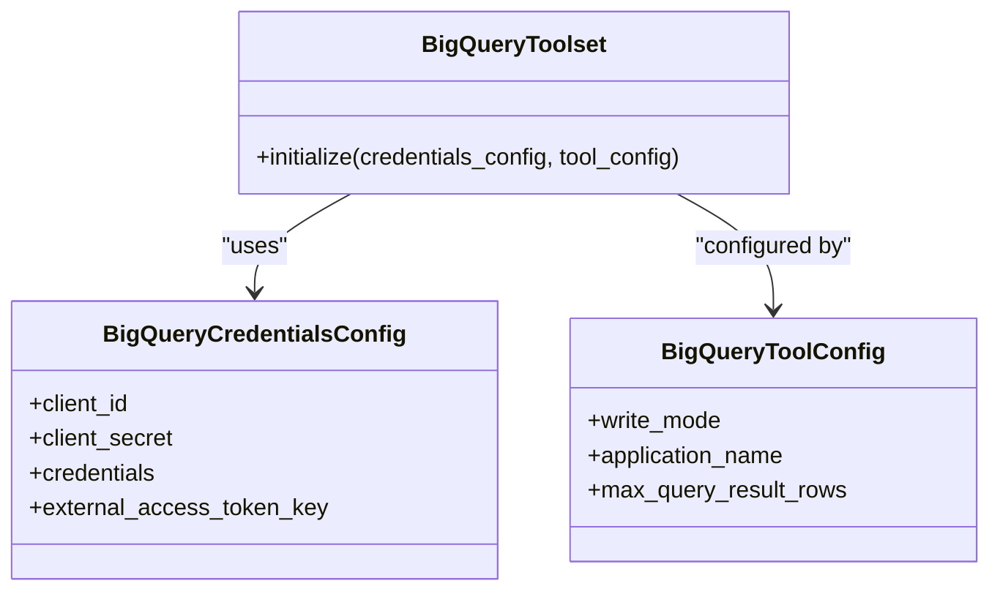

**Diagram sources**
- [BigQuery agent.py](file://contributing/samples/bigquery/agent.py#L40-L99)

**Section sources**
- [BigQuery agent.py](file://contributing/samples/bigquery/agent.py#L25-L99)

### Spanner Integration
- Configurable credentials: ADC, OAuth2, or Service Account
- Tool settings enable read capabilities and dict-list result mode
- Demonstrates custom SQL tools and parameterized queries

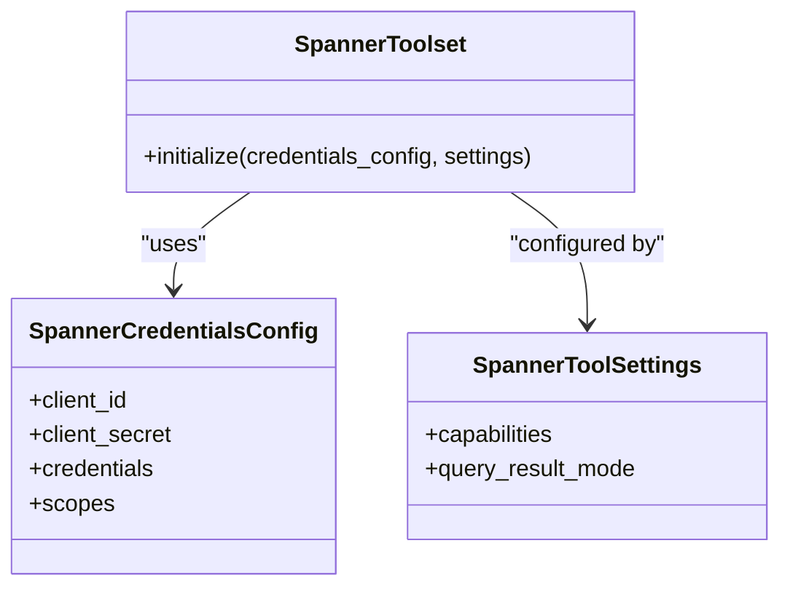

**Diagram sources**
- [Spanner agent.py](file://contributing/samples/spanner/agent.py#L38-L78)

**Section sources**
- [Spanner agent.py](file://contributing/samples/spanner/agent.py#L31-L207)

### Bigtable Integration
- Configurable credentials: ADC, OAuth2, or Service Account
- Tool settings for Bigtable toolset
- Custom SQL tool for location-based hotel search

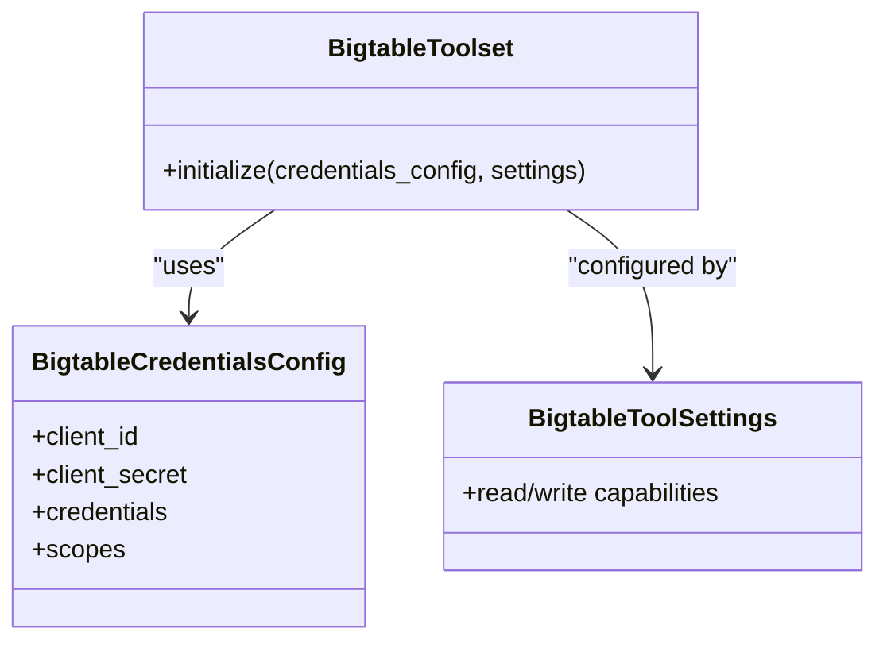

**Diagram sources**
- [Bigtable agent.py](file://contributing/samples/bigtable/agent.py#L32-L63)

**Section sources**
- [Bigtable agent.py](file://contributing/samples/bigtable/agent.py#L27-L134)

### Computer Use Automation
- Browser automation via ComputerUseToolset with a Playwright-backed computer instance
- Defines a dedicated agent model for computer use tasks

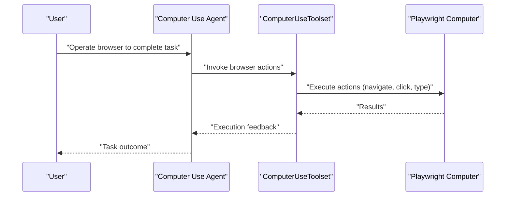

**Diagram sources**
- [Computer Use agent.py](file://contributing/samples/computer_use/agent.py#L34-L44)

**Section sources**
- [Computer Use agent.py](file://contributing/samples/computer_use/agent.py#L23-L44)

### Pub/Sub Integration
- Configurable credentials: ADC, OAuth2, or Service Account
- Toolset supports publishing, pulling, and acknowledging messages

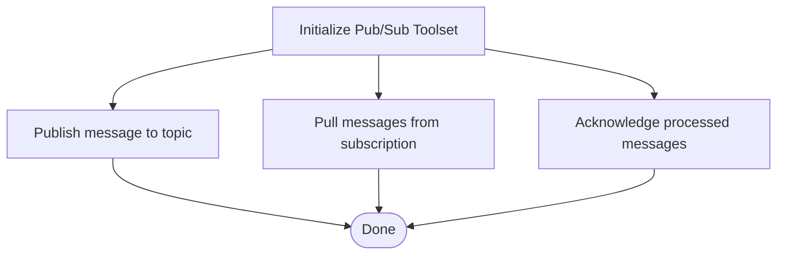

**Diagram sources**
- [Pub/Sub agent.py](file://contributing/samples/pubsub/agent.py#L62-L81)

**Section sources**
- [Pub/Sub agent.py](file://contributing/samples/pubsub/agent.py#L25-L81)

### Vertex AI Code Execution
- Agent configured with VertexAiCodeExecutor for data science workflows
- Includes system instructions for stateful, iterative analysis

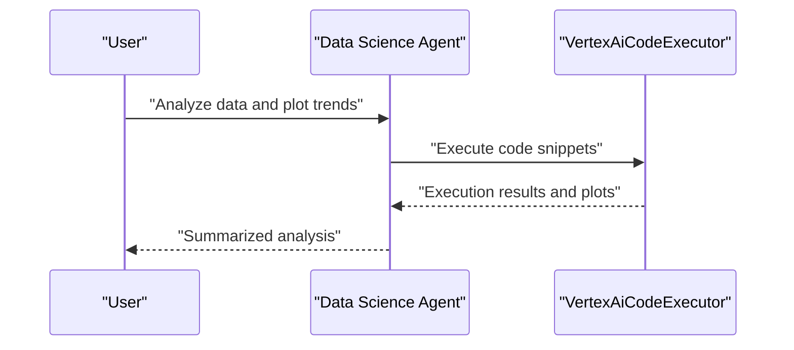

**Diagram sources**
- [Vertex AI Code Execution agent.py](file://contributing/samples/vertex_code_execution/agent.py#L80-L101)

**Section sources**
- [Vertex AI Code Execution agent.py](file://contributing/samples/vertex_code_execution/agent.py#L15-L101)

### Interactions API Integration
- Agent configured with Gemini using Interactions API
- Mixes built-in and custom function tools via bypass for multi-tools
- Automated tests validate basic text, function calling, multi-turn, and custom function tools

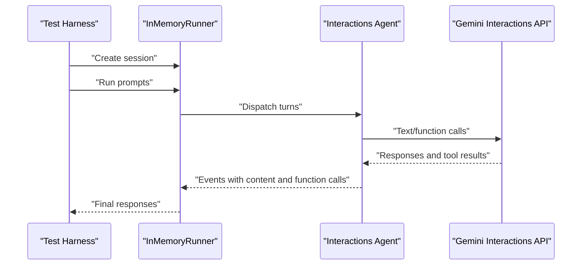

**Diagram sources**
- [Interactions API agent.py](file://contributing/samples/interactions_api/agent.py#L84-L105)
- [Interactions API main.py](file://contributing/samples/interactions_api/main.py#L295-L329)

**Section sources**
- [Interactions API agent.py](file://contributing/samples/interactions_api/agent.py#L15-L105)
- [Interactions API main.py](file://contributing/samples/interactions_api/main.py#L133-L329)

### Live Agent API Server Implementation
- WebSocket client connects to live agent server with app/user/session identifiers
- Manages audio input/output, text messages, and continuous audio streaming
- Handles session creation, event parsing, and audio playback

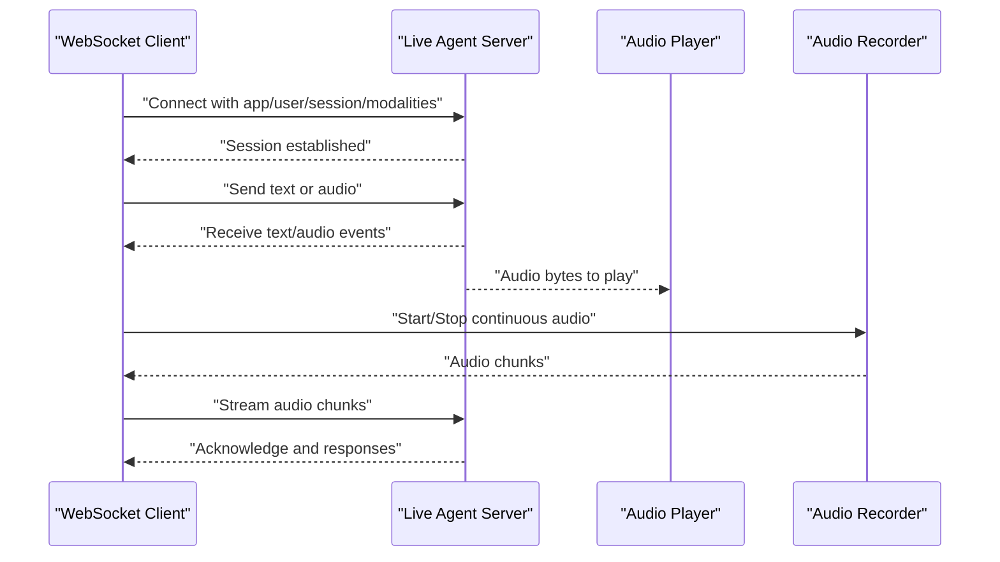

**Diagram sources**
- [Live Agent API Server live_agent_example.py](file://contributing/samples/live_agent_api_server_example/live_agent_example.py#L437-L795)

**Section sources**
- [Live Agent API Server live_agent_example.py](file://contributing/samples/live_agent_api_server_example/live_agent_example.py#L437-L795)

## Dependency Analysis
- Authentication Demo
  - IDP depends on Flask, PyJWT, and environment variables for keys
  - Backend App depends on Flask, SQLite, python-dotenv, PyJWT, and requests for OIDC discovery
  - Agent depends on OpenAPI toolset and auth helpers
- Database Toolsets
  - BigQuery/Spanner/Bigtable toolsets depend on Google Auth and respective client libraries
- Messaging & Execution
  - Pub/Sub toolset depends on Google Auth and Pub/Sub client
  - Vertex AI code executor depends on Vertex AI SDK
- Interactions API
  - Requires a GenAI SDK with interactions support
- Live Agent API Server
  - Depends on websockets, httpx, PyAudio, sounddevice, numpy

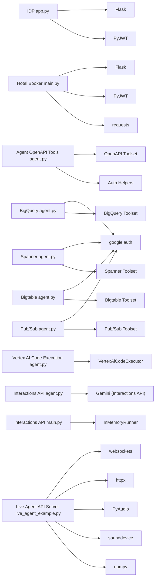

**Diagram sources**
- [IDP app.py](file://contributing/samples/authn-adk-all-in-one/idp/app.py#L28-L46)
- [Hotel Booker main.py](file://contributing/samples/authn-adk-all-in-one/hotel_booker_app/main.py#L19-L26)
- [ADK Agent OpenAPI Tools agent.py](file://contributing/samples/authn-adk-all-in-one/adk_agents/agent_openapi_tools/agent.py#L18-L29)
- [BigQuery agent.py](file://contributing/samples/bigquery/agent.py#L23-L24)
- [Spanner agent.py](file://contributing/samples/spanner/agent.py#L27-L28)
- [Bigtable agent.py](file://contributing/samples/bigtable/agent.py#L24-L25)
- [Pub/Sub agent.py](file://contributing/samples/pubsub/agent.py#L23-L24)
- [Vertex AI Code Execution agent.py](file://contributing/samples/vertex_code_execution/agent.py#L18-L19)
- [Interactions API agent.py](file://contributing/samples/interactions_api/agent.py#L30-L31)
- [Interactions API main.py](file://contributing/samples/interactions_api/main.py#L49-L50)
- [Live Agent API Server live_agent_example.py](file://contributing/samples/live_agent_api_server_example/live_agent_example.py#L24-L26)

**Section sources**
- [IDP app.py](file://contributing/samples/authn-adk-all-in-one/idp/app.py#L28-L46)
- [Hotel Booker main.py](file://contributing/samples/authn-adk-all-in-one/hotel_booker_app/main.py#L19-L26)
- [ADK Agent OpenAPI Tools agent.py](file://contributing/samples/authn-adk-all-in-one/adk_agents/agent_openapi_tools/agent.py#L18-L29)
- [BigQuery agent.py](file://contributing/samples/bigquery/agent.py#L23-L24)
- [Spanner agent.py](file://contributing/samples/spanner/agent.py#L27-L28)
- [Bigtable agent.py](file://contributing/samples/bigtable/agent.py#L24-L25)
- [Pub/Sub agent.py](file://contributing/samples/pubsub/agent.py#L23-L24)
- [Vertex AI Code Execution agent.py](file://contributing/samples/vertex_code_execution/agent.py#L18-L19)
- [Interactions API agent.py](file://contributing/samples/interactions_api/agent.py#L30-L31)
- [Interactions API main.py](file://contributing/samples/interactions_api/main.py#L49-L50)
- [Live Agent API Server live_agent_example.py](file://contributing/samples/live_agent_api_server_example/live_agent_example.py#L24-L26)

## Performance Considerations
- Authentication
  - Cache OIDC discovery and JWKS in backend app to reduce latency and network calls
  - Minimize token verification overhead by validating issuer, audience, and expiry efficiently
- Database Integrations
  - Use read-only or protected write modes in production to prevent unintended mutations
  - Apply result limits and pagination for large datasets
  - Prefer parameterized queries to mitigate injection risks and improve caching
- Messaging
  - Batch publishes and use acknowledgments to ensure reliability
  - Tune pull deadlines and retry policies for transient failures
- Code Execution
  - Limit execution time and resource usage; leverage Vertex AI quotas and timeouts
  - Persist intermediate artifacts to artifacts storage for reproducibility
- Live Agent
  - Optimize audio buffer sizes and sample rates to balance latency and quality
  - Implement backpressure and graceful shutdown for audio streams

[No sources needed since this section provides general guidance]

## Troubleshooting Guide
- Authentication Demo
  - Ensure JWKS and private key are correctly configured in IDP
  - Verify OIDC discovery URLs and redirect URIs match client configuration
  - Confirm token validation includes issuer, audience, and expiry checks
- Backend App
  - Check database connectivity and schema for hotel booking operations
  - Validate Authorization header format and token presence
- Database Toolsets
  - Confirm credentials type and environment variables for ADC/OAuth2/Service Account
  - Review tool settings for capabilities and result modes
- Pub/Sub
  - Verify topic/subscription permissions and project ID configuration
- Interactions API
  - Ensure the SDK supports interactions; otherwise tests will fail
  - Validate multi-tool bypass conditions and function calling compatibility
- Live Agent
  - Confirm session creation succeeds and modalities are supported
  - Check audio device availability and PyAudio initialization

**Section sources**
- [IDP app.py](file://contributing/samples/authn-adk-all-in-one/idp/app.py#L48-L64)
- [Hotel Booker main.py](file://contributing/samples/authn-adk-all-in-one/hotel_booker_app/main.py#L92-L170)
- [BigQuery agent.py](file://contributing/samples/bigquery/agent.py#L46-L78)
- [Spanner agent.py](file://contributing/samples/spanner/agent.py#L43-L68)
- [Bigtable agent.py](file://contributing/samples/bigtable/agent.py#L34-L59)
- [Pub/Sub agent.py](file://contributing/samples/pubsub/agent.py#L39-L60)
- [Interactions API main.py](file://contributing/samples/interactions_api/main.py#L267-L291)
- [Live Agent API Server live_agent_example.py](file://contributing/samples/live_agent_api_server_example/live_agent_example.py#L437-L474)

## Conclusion
These advanced integration examples demonstrate how to combine authentication, databases, messaging, code execution, and real-time interactions into enterprise-grade systems. By following the patterns outlined—secure authentication flows, robust connection management, resilient error handling, and performance-conscious configurations—you can deploy scalable, secure, and observable solutions.

[No sources needed since this section summarizes without analyzing specific files]

## Appendices
- Security Considerations
  - Use short-lived tokens and enforce strict issuer/audience validation
  - Restrict scopes and capabilities to least privilege
  - Store secrets securely and rotate keys regularly
- Monitoring and Observability
  - Instrument authentication flows, database queries, and code execution
  - Track session lifecycles and interaction IDs for debugging
- Scaling Patterns
  - Stateless agents behind load balancers
  - Asynchronous processing for Pub/Sub and code execution
  - Horizontal scaling of database connections and toolset instances

[No sources needed since this section provides general guidance]