# Agent-to-Agent (A2A) Protocol Examples

<cite>
**Referenced Files in This Document**
- [a2a_basic README](file://contributing/samples/a2a_basic/README.md)
- [a2a_auth README](file://contributing/samples/a2a_auth/README.md)
- [a2a_human_in_loop README](file://contributing/samples/a2a_human_in_loop/README.md)
- [mcp_dynamic_header README](file://contributing/samples/mcp_dynamic_header_agent/README.md)
- [mcp_in_agent_tool_remote README](file://contributing/samples/mcp_in_agent_tool_remote/README.md)
- [mcp_in_agent_tool_stdio README](file://contributing/samples/mcp_in_agent_tool_stdio/README.md)
- [mcp_service_account README](file://contributing/samples/mcp_service_account_agent/README.md)
- [mcp_sse README](file://contributing/samples/mcp_sse_agent/README.md)
</cite>

## Table of Contents
1. [Introduction](#introduction)
2. [Project Structure](#project-structure)
3. [Core Components](#core-components)
4. [Architecture Overview](#architecture-overview)
5. [Detailed Component Analysis](#detailed-component-analysis)
6. [Dependency Analysis](#dependency-analysis)
7. [Performance Considerations](#performance-considerations)
8. [Troubleshooting Guide](#troubleshooting-guide)
9. [Conclusion](#conclusion)
10. [Appendices](#appendices)

## Introduction
This document explains Agent-to-Agent (A2A) protocol examples and Model Context Protocol (MCP) integration patterns in the Agent Development Kit (ADK). It covers:
- Basic A2A communication across local and remote agents
- Authentication flows (OAuth and service accounts)
- Human-in-the-loop scenarios with long-running tools
- MCP tool integration patterns: remote SSE, stdio subprocess, progress callbacks, dynamic headers, and service account authentication
- Configuration guidance, error handling, security considerations, performance optimization, debugging, scaling, and dependency management

## Project Structure
The repository organizes A2A and MCP samples under contributing/samples. The A2A samples demonstrate:
- Basic A2A: local roll agent and remote prime agent
- Authenticated A2A: local YouTube search and remote BigQuery agent with OAuth
- Human-in-the-loop A2A: local reimbursement agent delegating large claims to a remote approval agent

MCP samples demonstrate:
- Remote SSE mode with an external HTTP server
- Stdio mode launching a subprocess server
- Dynamic header injection for Streamable HTTP
- Service account authentication for Streamable HTTP
- SSE streaming with a filesystem server

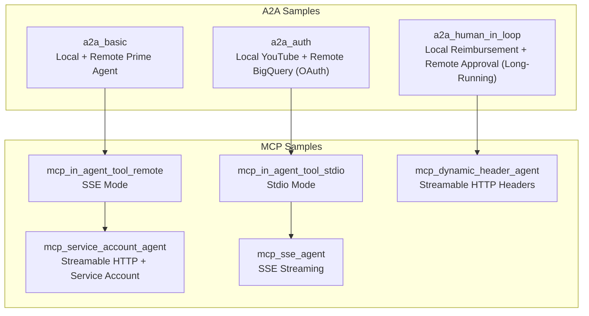

**Section sources**
- [a2a_basic README](file://contributing/samples/a2a_basic/README.md#L1-L154)
- [a2a_auth README](file://contributing/samples/a2a_auth/README.md#L1-L217)
- [a2a_human_in_loop README](file://contributing/samples/a2a_human_in_loop/README.md#L1-L168)
- [mcp_in_agent_tool_remote README](file://contributing/samples/mcp_in_agent_tool_remote/README.md#L1-L75)
- [mcp_in_agent_tool_stdio README](file://contributing/samples/mcp_in_agent_tool_stdio/README.md#L1-L75)
- [mcp_dynamic_header README](file://contributing/samples/mcp_dynamic_header_agent/README.md#L1-L8)
- [mcp_service_account README](file://contributing/samples/mcp_service_account_agent/README.md#L1-L55)
- [mcp_sse README](file://contributing/samples/mcp_sse_agent/README.md#L1-L9)

## Core Components
- A2A Basic: Demonstrates local roll agent and remote prime agent communicating over HTTP. The root agent orchestrates task delegation and combines results.
- A2A Auth: Shows OAuth-driven delegation from a local YouTube search agent to a remote BigQuery agent. The root agent surfaces OAuth challenges to the user and exchanges tokens securely.
- A2A Human-in-the-Loop: Automates small reimbursements locally and escalates large ones to a remote approval agent using long-running tools with pending states and human updates.
- MCP Remote SSE: Integrates an AgentTool wrapper around an MCP toolset connected via SSE to a remote HTTP server.
- MCP Stdio: Launches an MCP server as a subprocess and communicates via stdio.
- MCP Dynamic Headers: Adds custom per-request headers to Streamable HTTP requests to an MCP server.
- MCP Service Account: Authenticates Streamable HTTP requests using a Google Cloud service account.
- MCP SSE Streaming: Streams updates from an MCP server using SSE to a filesystem-backed server.

**Section sources**
- [a2a_basic README](file://contributing/samples/a2a_basic/README.md#L84-L138)
- [a2a_auth README](file://contributing/samples/a2a_auth/README.md#L108-L188)
- [a2a_human_in_loop README](file://contributing/samples/a2a_human_in_loop/README.md#L82-L147)
- [mcp_in_agent_tool_remote README](file://contributing/samples/mcp_in_agent_tool_remote/README.md#L1-L75)
- [mcp_in_agent_tool_stdio README](file://contributing/samples/mcp_in_agent_tool_stdio/README.md#L1-L75)
- [mcp_dynamic_header README](file://contributing/samples/mcp_dynamic_header_agent/README.md#L1-L8)
- [mcp_service_account README](file://contributing/samples/mcp_service_account_agent/README.md#L1-L55)
- [mcp_sse README](file://contributing/samples/mcp_sse_agent/README.md#L1-L9)

## Architecture Overview
The A2A architecture centers on a root agent delegating tasks to local and remote sub-agents. Remote agents expose RPC endpoints defined in agent cards and are invoked over HTTP. The human-in-the-loop sample extends this with long-running tools that return pending states and later accept updated responses with the same identifiers.

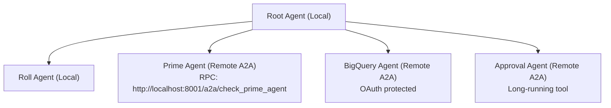

**Diagram sources**
- [a2a_basic README](file://contributing/samples/a2a_basic/README.md#L15-L22)
- [a2a_auth README](file://contributing/samples/a2a_auth/README.md#L15-L22)
- [a2a_human_in_loop README](file://contributing/samples/a2a_human_in_loop/README.md#L15-L22)

**Section sources**
- [a2a_basic README](file://contributing/samples/a2a_basic/README.md#L13-L40)
- [a2a_auth README](file://contributing/samples/a2a_auth/README.md#L13-L44)
- [a2a_human_in_loop README](file://contributing/samples/a2a_human_in_loop/README.md#L13-L45)

## Detailed Component Analysis

### A2A Basic: Local + Remote Prime Agent
- Local roll agent uses a function tool to roll dice.
- Remote prime agent exposes a prime-checking tool and is reachable via HTTP at a configured RPC endpoint.
- Root agent orchestrates combined operations like “roll and check.”

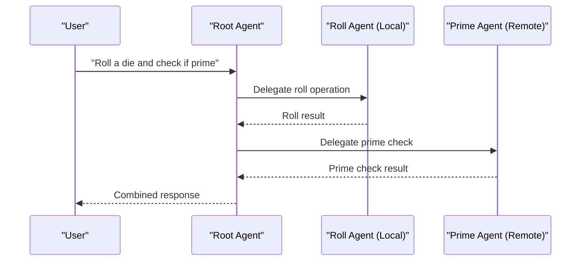

**Diagram sources**
- [a2a_basic README](file://contributing/samples/a2a_basic/README.md#L61-L82)

**Section sources**
- [a2a_basic README](file://contributing/samples/a2a_basic/README.md#L84-L138)

### A2A Auth: OAuth with Remote BigQuery Agent
- Local YouTube search agent handles public queries.
- Remote BigQuery agent surfaces OAuth challenges to the root agent.
- Root agent guides the user through OAuth and exchanges tokens for authenticated BigQuery operations.

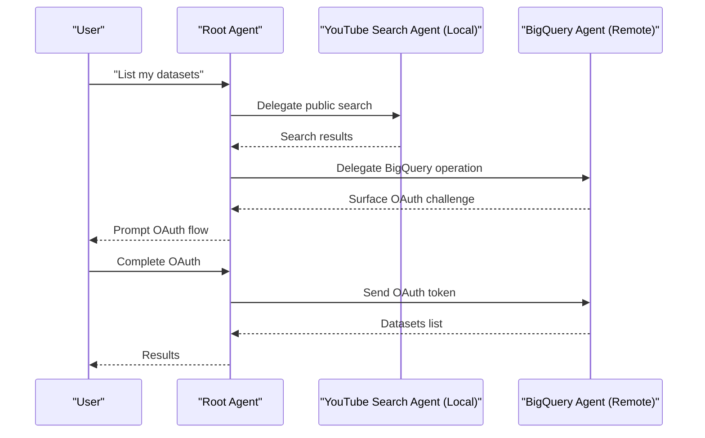

**Diagram sources**
- [a2a_auth README](file://contributing/samples/a2a_auth/README.md#L122-L134)

**Section sources**
- [a2a_auth README](file://contributing/samples/a2a_auth/README.md#L108-L188)

### A2A Human-in-the-Loop: Long-Running Tools and Pending States
- Small reimbursements are auto-approved locally.
- Large reimbursements trigger a long-running tool in the remote approval agent.
- The remote agent returns a pending response with a ticket ID and surfaces the approval request to the root agent.
- The human manager reviews and updates the tool response; the root agent relays the updated response back to the remote agent.

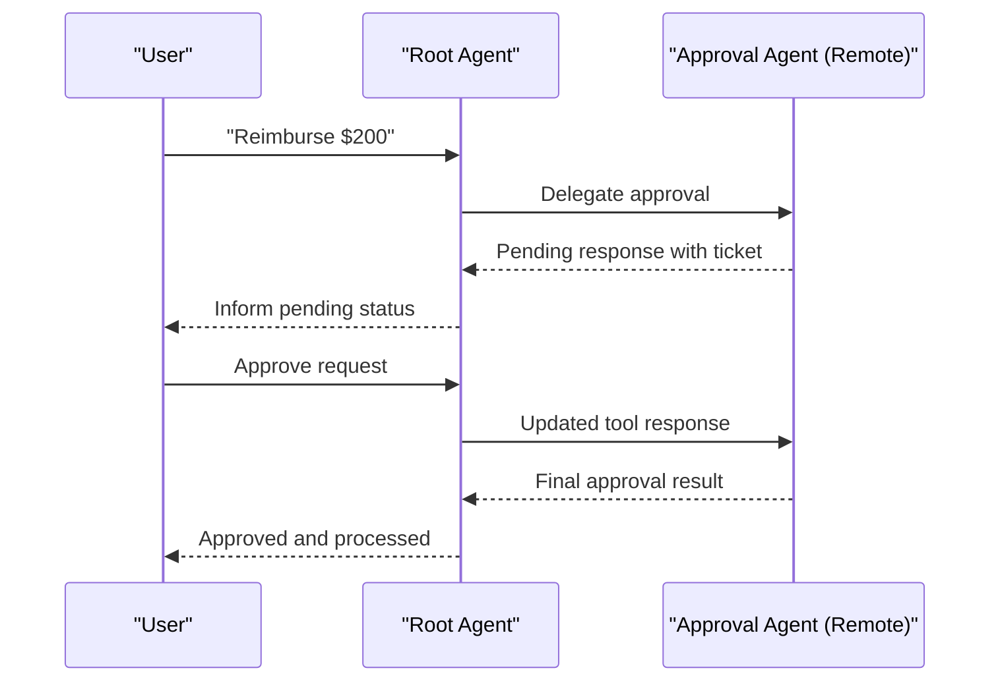

**Diagram sources**
- [a2a_human_in_loop README](file://contributing/samples/a2a_human_in_loop/README.md#L97-L107)

**Section sources**
- [a2a_human_in_loop README](file://contributing/samples/a2a_human_in_loop/README.md#L82-L147)

### MCP Integration Patterns

#### Remote SSE Mode
- The agent connects to an external MCP server over SSE.
- The server is started separately and exposed at an HTTP endpoint.
- The agent’s tool wrapper uses an MCP toolset configured for SSE transport.

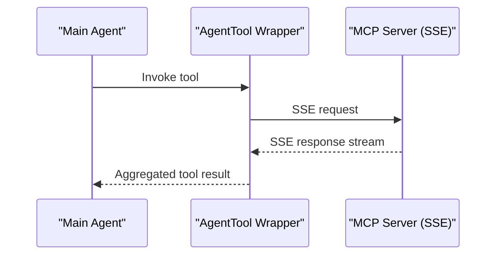

**Diagram sources**
- [mcp_in_agent_tool_remote README](file://contributing/samples/mcp_in_agent_tool_remote/README.md#L52-L68)

**Section sources**
- [mcp_in_agent_tool_remote README](file://contributing/samples/mcp_in_agent_tool_remote/README.md#L1-L75)

#### Stdio Mode (Subprocess)
- The MCP server is launched as a subprocess using a package runner.
- Communication occurs via stdin/stdout.
- No separate server startup is required.

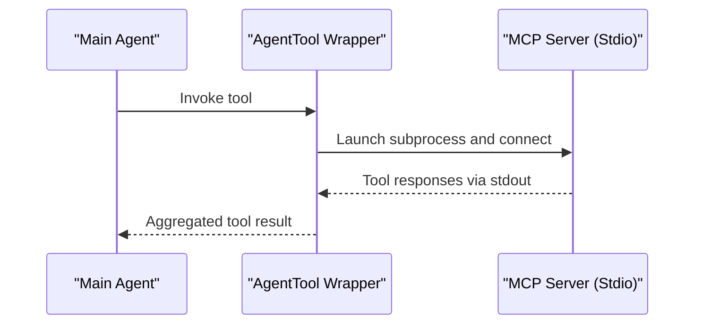

**Diagram sources**
- [mcp_in_agent_tool_stdio README](file://contributing/samples/mcp_in_agent_tool_stdio/README.md#L52-L68)

**Section sources**
- [mcp_in_agent_tool_stdio README](file://contributing/samples/mcp_in_agent_tool_stdio/README.md#L1-L75)

#### Dynamic Header Handling (Streamable HTTP)
- The agent injects custom per-request headers into Streamable HTTP requests to the MCP server.
- Useful for tenant routing, correlation IDs, or authorization metadata.

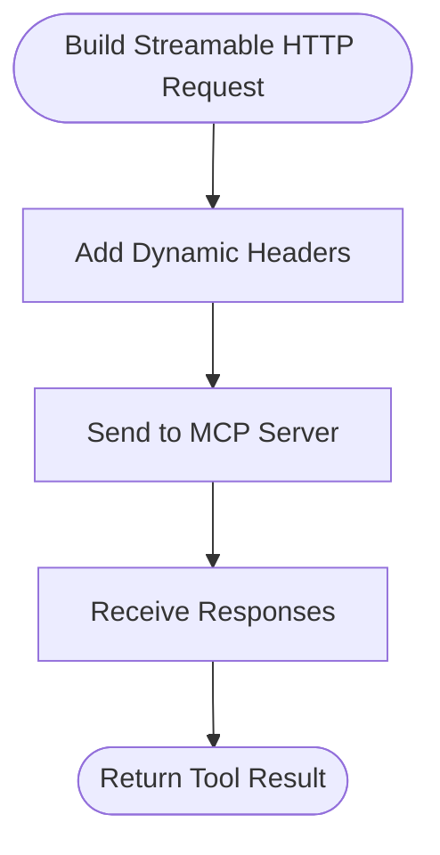

**Diagram sources**
- [mcp_dynamic_header README](file://contributing/samples/mcp_dynamic_header_agent/README.md#L1-L8)

**Section sources**
- [mcp_dynamic_header README](file://contributing/samples/mcp_dynamic_header_agent/README.md#L1-L8)

#### Service Account Authentication (Streamable HTTP)
- Streamable HTTP requests are authenticated using a Google Cloud service account.
- Requires configuring the MCP server URL and service account credentials in the agent.

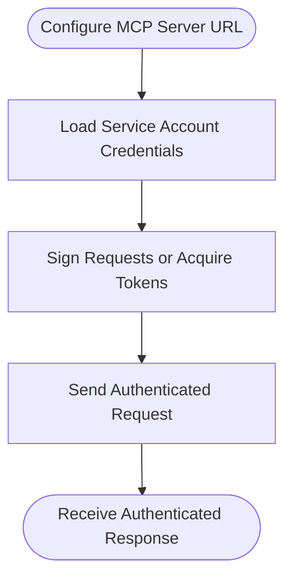

**Diagram sources**
- [mcp_service_account README](file://contributing/samples/mcp_service_account_agent/README.md#L9-L46)

**Section sources**
- [mcp_service_account README](file://contributing/samples/mcp_service_account_agent/README.md#L1-L55)

#### SSE Streaming (Filesystem Server)
- The agent streams updates from an MCP server using SSE.
- The server is backed by a filesystem and exposed via SSE.

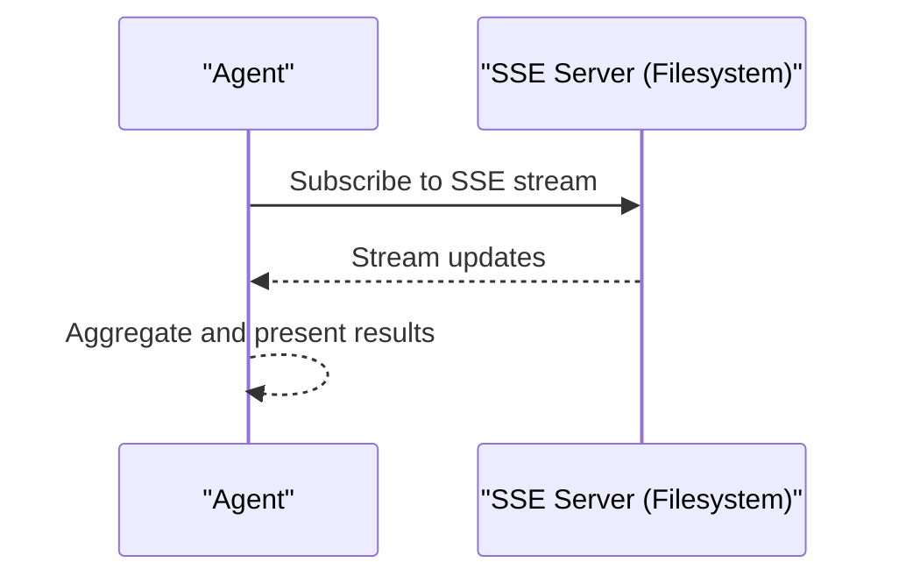

**Diagram sources**
- [mcp_sse README](file://contributing/samples/mcp_sse_agent/README.md#L1-L9)

**Section sources**
- [mcp_sse README](file://contributing/samples/mcp_sse_agent/README.md#L1-L9)

## Dependency Analysis
- A2A samples depend on:
  - Local sub-agents for deterministic operations
  - Remote A2A servers exposing RPC endpoints defined in agent cards
  - HTTP connectivity and correct URL configuration
- MCP samples depend on:
  - Transport-specific servers (SSE or stdio)
  - Proper configuration of URLs, headers, or service account credentials
  - Consistent tool response handling (especially for long-running tools)

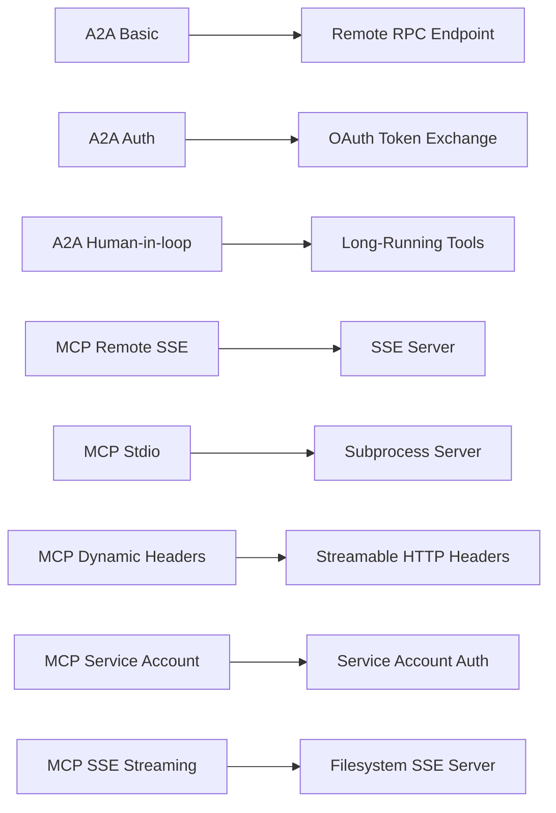

**Diagram sources**
- [a2a_basic README](file://contributing/samples/a2a_basic/README.md#L112-L138)
- [a2a_auth README](file://contributing/samples/a2a_auth/README.md#L162-L188)
- [a2a_human_in_loop README](file://contributing/samples/a2a_human_in_loop/README.md#L121-L147)
- [mcp_in_agent_tool_remote README](file://contributing/samples/mcp_in_agent_tool_remote/README.md#L17-L34)
- [mcp_in_agent_tool_stdio README](file://contributing/samples/mcp_in_agent_tool_stdio/README.md#L17-L26)
- [mcp_dynamic_header README](file://contributing/samples/mcp_dynamic_header_agent/README.md#L1-L8)
- [mcp_service_account README](file://contributing/samples/mcp_service_account_agent/README.md#L9-L46)
- [mcp_sse README](file://contributing/samples/mcp_sse_agent/README.md#L1-L9)

**Section sources**
- [a2a_basic README](file://contributing/samples/a2a_basic/README.md#L110-L138)
- [a2a_auth README](file://contributing/samples/a2a_auth/README.md#L160-L188)
- [a2a_human_in_loop README](file://contributing/samples/a2a_human_in_loop/README.md#L119-L147)
- [mcp_in_agent_tool_remote README](file://contributing/samples/mcp_in_agent_tool_remote/README.md#L15-L34)
- [mcp_in_agent_tool_stdio README](file://contributing/samples/mcp_in_agent_tool_stdio/README.md#L15-L26)
- [mcp_dynamic_header README](file://contributing/samples/mcp_dynamic_header_agent/README.md#L1-L8)
- [mcp_service_account README](file://contributing/samples/mcp_service_account_agent/README.md#L9-L46)
- [mcp_sse README](file://contributing/samples/mcp_sse_agent/README.md#L1-L9)

## Performance Considerations
- Minimize cross-service latency by colocating related agents and servers when feasible.
- Use local caching for deterministic sub-agent results to reduce remote calls.
- Batch tool invocations where appropriate to reduce overhead.
- For long-running tools, implement efficient polling intervals and idempotent updates to avoid redundant processing.
- Optimize network paths for SSE and HTTP transports; prefer local loopback for development and secure VPC networking in production.
- Tune model and tool invocation concurrency based on resource availability.

## Troubleshooting Guide
- A2A Connectivity:
  - Verify RPC endpoints in agent cards match deployed locations.
  - Confirm local and remote servers are running on expected ports.
  - Check firewall rules and CORS settings for cross-origin requests.
- OAuth:
  - Ensure client credentials and redirect URIs are configured correctly.
  - Validate required scopes for target APIs.
  - Confirm user has access to requested resources.
- Long-Running Tools:
  - Ensure updated tool responses use the same identifiers as original calls.
  - Validate pending state transitions and timeout handling.
- MCP:
  - For SSE, confirm the server is reachable at the specified endpoint.
  - For stdio, ensure the subprocess launcher is available and executable.
  - For Streamable HTTP, verify headers and service account credentials are correctly set.

**Section sources**
- [a2a_basic README](file://contributing/samples/a2a_basic/README.md#L140-L154)
- [a2a_auth README](file://contributing/samples/a2a_auth/README.md#L190-L217)
- [a2a_human_in_loop README](file://contributing/samples/a2a_human_in_loop/README.md#L149-L168)
- [mcp_in_agent_tool_remote README](file://contributing/samples/mcp_in_agent_tool_remote/README.md#L15-L34)
- [mcp_in_agent_tool_stdio README](file://contributing/samples/mcp_in_agent_tool_stdio/README.md#L15-L26)
- [mcp_dynamic_header README](file://contributing/samples/mcp_dynamic_header_agent/README.md#L1-L8)
- [mcp_service_account README](file://contributing/samples/mcp_service_account_agent/README.md#L9-L46)
- [mcp_sse README](file://contributing/samples/mcp_sse_agent/README.md#L1-L9)

## Conclusion
The A2A and MCP samples illustrate practical patterns for distributed agent systems:
- A2A enables seamless orchestration across local and remote agents with clear delegation and RPC endpoints.
- Authentication strategies (OAuth and service accounts) protect sensitive operations while maintaining usability.
- Human-in-the-loop workflows combine automation with governance using long-running tools and explicit approvals.
- MCP integrates diverse toolsets via SSE and stdio, with advanced features like dynamic headers and service account authentication.
Adopt the provided configuration and error-handling guidance to build secure, scalable, and observable agent ecosystems.

## Appendices
- Configuration Checklist:
  - A2A: Set RPC URLs in agent cards; ensure ports and hostnames are correct.
  - OAuth: Configure client credentials and scopes; validate redirect URIs.
  - MCP SSE: Confirm server endpoint and transport settings.
  - MCP Stdio: Ensure subprocess launcher availability.
  - MCP Streamable HTTP: Provide headers or service account credentials.
- Security Best Practices:
  - Use HTTPS for all remote endpoints.
  - Scope OAuth and service account credentials minimally.
  - Sanitize and validate tool inputs; avoid command injection.
  - Log and monitor authentication and authorization events.
- Scaling Guidance:
  - Horizontal scale remote agents behind load balancers.
  - Use queues for long-running tool updates to decouple producers and consumers.
  - Implement circuit breakers and retries for transient failures.
  - Centralize configuration via environment variables or secure secret stores.