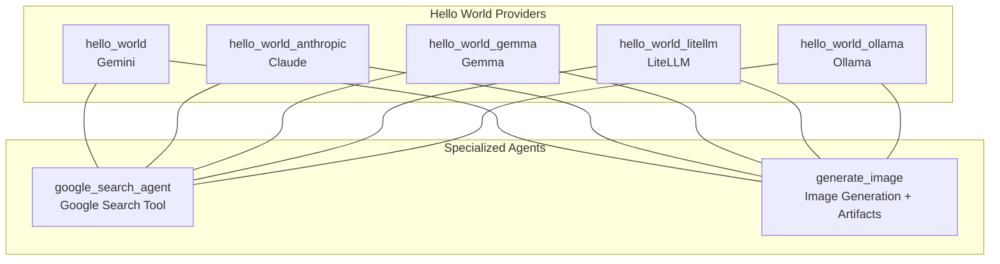
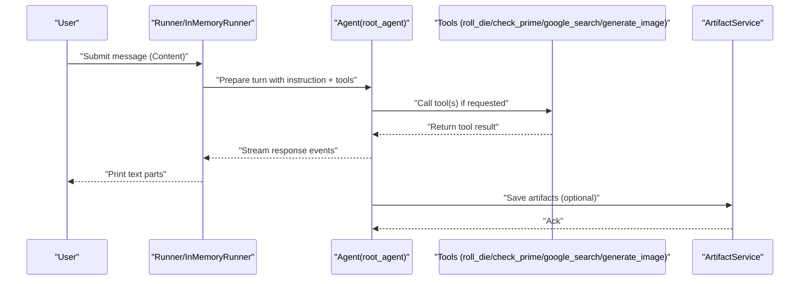
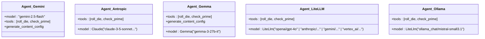
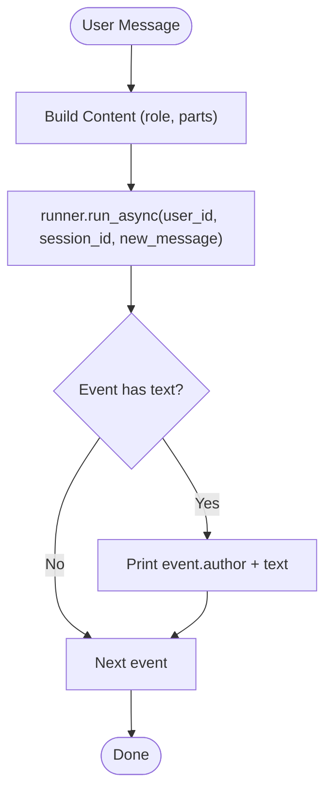
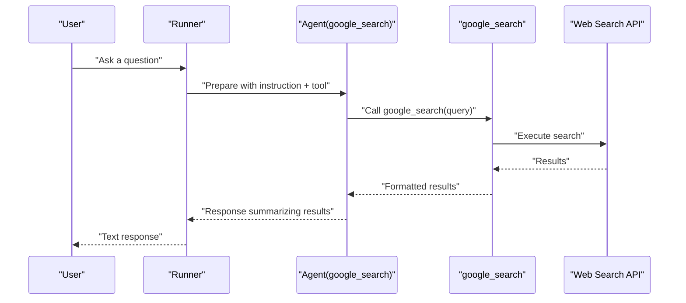
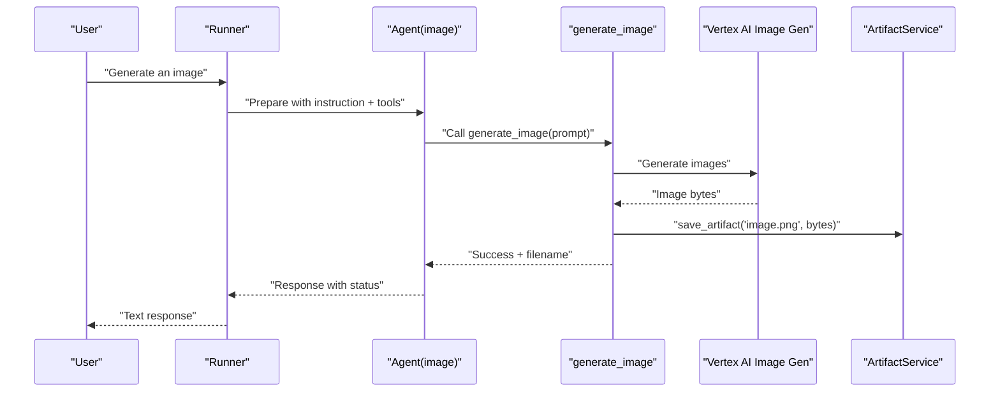
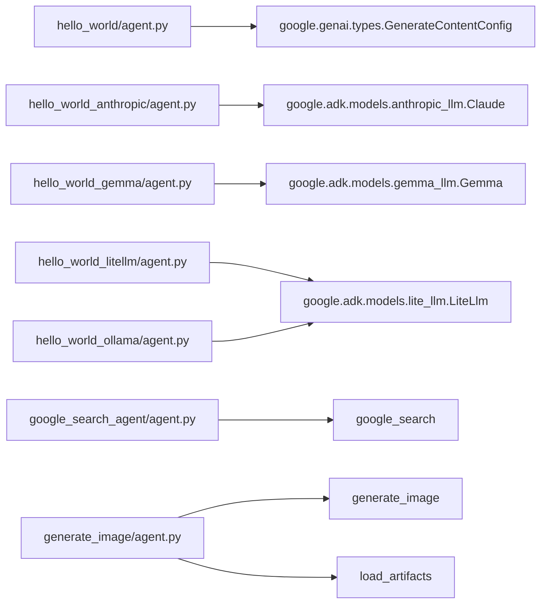

# Basic Agent Examples

<cite>
**Referenced Files in This Document**
- [hello_world/agent.py](file://contributing/samples/hello_world/agent.py)
- [hello_world/main.py](file://contributing/samples/hello_world/main.py)
- [hello_world_anthropic/agent.py](file://contributing/samples/hello_world_anthropic/agent.py)
- [hello_world_anthropic/main.py](file://contributing/samples/hello_world_anthropic/main.py)
- [hello_world_gemma/agent.py](file://contributing/samples/hello_world_gemma/agent.py)
- [hello_world_gemma/main.py](file://contributing/samples/hello_world_gemma/main.py)
- [hello_world_litellm/agent.py](file://contributing/samples/hello_world_litellm/agent.py)
- [hello_world_litellm/main.py](file://contributing/samples/hello_world_litellm/main.py)
- [hello_world_ollama/agent.py](file://contributing/samples/hello_world_ollama/agent.py)
- [hello_world_ollama/main.py](file://contributing/samples/hello_world_ollama/main.py)
- [google_search_agent/agent.py](file://contributing/samples/google_search_agent/agent.py)
- [generate_image/agent.py](file://contributing/samples/generate_image/agent.py)
</cite>

## Table of Contents
1. [Introduction](#introduction)
2. [Project Structure](#project-structure)
3. [Core Components](#core-components)
4. [Architecture Overview](#architecture-overview)
5. [Detailed Component Analysis](#detailed-component-analysis)
6. [Dependency Analysis](#dependency-analysis)
7. [Performance Considerations](#performance-considerations)
8. [Troubleshooting Guide](#troubleshooting-guide)
9. [Conclusion](#conclusion)
10. [Appendices](#appendices)

## Introduction
This document explains basic agent examples that demonstrate fundamental agent patterns across multiple LLM providers and capabilities. It covers:
- Hello World variations for Anthropic, Gemma, LiteLLM, and Ollama
- Agent configuration patterns, tool integration basics, and response handling
- External API integration via the Google Search Agent
- Image generation examples with artifacts
- Agent lifecycle management, error handling, and debugging techniques
- Guidance for adapting and extending these examples

## Project Structure
The repository organizes examples by feature and provider. For basic agent examples, focus on the hello_world family and specialized agents such as Google Search and image generation.

**Diagram sources**
- [hello_world/agent.py](file://contributing/samples/hello_world/agent.py#L67-L109)
- [hello_world_anthropic/agent.py](file://contributing/samples/hello_world_anthropic/agent.py#L62-L91)
- [hello_world_gemma/agent.py](file://contributing/samples/hello_world_gemma/agent.py#L63-L96)
- [hello_world_litellm/agent.py](file://contributing/samples/hello_world_litellm/agent.py#L62-L95)
- [hello_world_ollama/agent.py](file://contributing/samples/hello_world_ollama/agent.py#L61-L90)
- [google_search_agent/agent.py](file://contributing/samples/google_search_agent/agent.py#L18-L26)
- [generate_image/agent.py](file://contributing/samples/generate_image/agent.py#L46-L54)

**Section sources**
- [hello_world/agent.py](file://contributing/samples/hello_world/agent.py#L67-L109)
- [hello_world_anthropic/agent.py](file://contributing/samples/hello_world_anthropic/agent.py#L62-L91)
- [hello_world_gemma/agent.py](file://contributing/samples/hello_world_gemma/agent.py#L63-L96)
- [hello_world_litellm/agent.py](file://contributing/samples/hello_world_litellm/agent.py#L62-L95)
- [hello_world_ollama/agent.py](file://contributing/samples/hello_world_ollama/agent.py#L61-L90)
- [google_search_agent/agent.py](file://contributing/samples/google_search_agent/agent.py#L18-L26)
- [generate_image/agent.py](file://contributing/samples/generate_image/agent.py#L46-L54)

## Core Components
- Agent definition: Each example defines a root Agent with model selection, name, description, instruction, and tools.
- Tools: Functions exposed to the model via the Agent’s tool list. They accept typed parameters and optionally a ToolContext for state/artifacts.
- Runner and Session: Execution harnesses that manage runs, sessions, and artifacts. Different examples use Runner with in-memory services or InMemoryRunner depending on the sample.

Key patterns:
- Model configuration differs by provider (Gemini, Claude, Gemma, LiteLLM, Ollama).
- Tool integration passes typed arguments and can persist artifacts via ToolContext.
- Response handling iterates over streaming events and prints text parts.

**Section sources**
- [hello_world/agent.py](file://contributing/samples/hello_world/agent.py#L67-L109)
- [hello_world_anthropic/agent.py](file://contributing/samples/hello_world_anthropic/agent.py#L62-L91)
- [hello_world_gemma/agent.py](file://contributing/samples/hello_world_gemma/agent.py#L63-L96)
- [hello_world_litellm/agent.py](file://contributing/samples/hello_world_litellm/agent.py#L62-L95)
- [hello_world_ollama/agent.py](file://contributing/samples/hello_world_ollama/agent.py#L61-L90)
- [hello_world/main.py](file://contributing/samples/hello_world/main.py#L30-L104)
- [hello_world_anthropic/main.py](file://contributing/samples/hello_world_anthropic/main.py#L32-L77)
- [hello_world_gemma/main.py](file://contributing/samples/hello_world_gemma/main.py#L33-L78)
- [hello_world_litellm/main.py](file://contributing/samples/hello_world_litellm/main.py#L32-L77)
- [hello_world_ollama/main.py](file://contributing/samples/hello_world_ollama/main.py#L33-L78)

## Architecture Overview
The examples share a common runtime flow: initialize an Agent, create a Session, submit user Content, iterate over streamed events, and optionally save artifacts.

**Diagram sources**
- [hello_world/main.py](file://contributing/samples/hello_world/main.py#L41-L72)
- [hello_world_anthropic/main.py](file://contributing/samples/hello_world_anthropic/main.py#L47-L59)
- [hello_world_gemma/main.py](file://contributing/samples/hello_world_gemma/main.py#L48-L60)
- [hello_world_litellm/main.py](file://contributing/samples/hello_world_litellm/main.py#L47-L59)
- [hello_world_ollama/main.py](file://contributing/samples/hello_world_ollama/main.py#L48-L60)
- [hello_world/agent.py](file://contributing/samples/hello_world/agent.py#L91-L94)
- [google_search_agent/agent.py](file://contributing/samples/google_search_agent/agent.py#L18-L25)
- [generate_image/agent.py](file://contributing/samples/generate_image/agent.py#L21-L43)

## Detailed Component Analysis

### Hello World Variations Across Providers
This section compares configuration differences and provider-specific setup across Anthropic, Gemma, LiteLLM, and Ollama.

- Gemini (hello_world)
  - Uses the base Agent with a model string and optional GenerateContentConfig for safety settings.
  - Demonstrates ToolContext usage for state persistence across turns.
  - Includes artifact listing for byte inputs.

- Anthropic (hello_world_anthropic)
  - Uses Claude model via google.adk.models.anthropic_llm.Claude.
  - No ToolContext in tool signatures; simpler tool interface.
  - Uses Runner with explicit in-memory services.

- Gemma (hello_world_gemma)
  - Uses google.adk.agents.llm_agent.Agent and google.adk.models.gemma_llm.Gemma.
  - Applies GenerateContentConfig with temperature and top_p.

- LiteLLM (hello_world_litellm)
  - Uses google.adk.models.lite_llm.LiteLlm with provider/model identifiers.
  - Multiple commented provider/model combinations show flexibility.

- Ollama (hello_world_ollama)
  - Uses LiteLlm with ollama_chat/<model> to route to local Ollama.
  - Simplified tool signature compared to Gemini example.

**Diagram sources**
- [hello_world/agent.py](file://contributing/samples/hello_world/agent.py#L67-L109)
- [hello_world_anthropic/agent.py](file://contributing/samples/hello_world_anthropic/agent.py#L62-L91)
- [hello_world_gemma/agent.py](file://contributing/samples/hello_world_gemma/agent.py#L63-L96)
- [hello_world_litellm/agent.py](file://contributing/samples/hello_world_litellm/agent.py#L62-L95)
- [hello_world_ollama/agent.py](file://contributing/samples/hello_world_ollama/agent.py#L61-L90)

Provider-specific setup requirements:
- Anthropic: Requires Claude model configuration via google.adk.models.anthropic_llm.Claude.
- Gemma: Requires google.adk.models.gemma_llm.Gemma and optional GenerateContentConfig tuning.
- LiteLLM: Requires provider/model identifiers; supports OpenAI, Anthropic, Google, and Vertex AI backends.
- Ollama: Requires LiteLlm with ollama_chat/<model> and a running local Ollama server.

Common patterns:
- All define roll_die and check_prime tools.
- All use Agent with instruction and tools.
- Streaming response handling iterates over events and prints text parts.

**Section sources**
- [hello_world/agent.py](file://contributing/samples/hello_world/agent.py#L67-L109)
- [hello_world_anthropic/agent.py](file://contributing/samples/hello_world_anthropic/agent.py#L62-L91)
- [hello_world_gemma/agent.py](file://contributing/samples/hello_world_gemma/agent.py#L63-L96)
- [hello_world_litellm/agent.py](file://contributing/samples/hello_world_litellm/agent.py#L62-L95)
- [hello_world_ollama/agent.py](file://contributing/samples/hello_world_ollama/agent.py#L61-L90)

### Tool Integration Basics
- Tool signatures differ slightly across examples:
  - Gemini example uses ToolContext for state and artifact saving.
  - Other examples omit ToolContext in tool signatures.
- Tools are passed to Agent.tools and invoked by the model when instructed.
- Responses are handled by iterating over streamed events and printing text parts.

**Diagram sources**
- [hello_world/main.py](file://contributing/samples/hello_world/main.py#L41-L72)
- [hello_world_anthropic/main.py](file://contributing/samples/hello_world_anthropic/main.py#L47-L59)
- [hello_world_gemma/main.py](file://contributing/samples/hello_world_gemma/main.py#L48-L60)
- [hello_world_litellm/main.py](file://contributing/samples/hello_world_litellm/main.py#L47-L59)
- [hello_world_ollama/main.py](file://contributing/samples/hello_world_ollama/main.py#L48-L60)

**Section sources**
- [hello_world/agent.py](file://contributing/samples/hello_world/agent.py#L91-L94)
- [hello_world_anthropic/agent.py](file://contributing/samples/hello_world_anthropic/agent.py#L86-L89)
- [hello_world_gemma/agent.py](file://contributing/samples/hello_world_gemma/agent.py#L87-L90)
- [hello_world_litellm/agent.py](file://contributing/samples/hello_world_litellm/agent.py#L89-L93)
- [hello_world_ollama/agent.py](file://contributing/samples/hello_world_ollama/agent.py#L84-L88)

### Google Search Agent (External API Integration)
- Integrates google_search tool to perform web searches and answer questions about results.
- Demonstrates adding a single tool to the Agent and invoking it via natural language instructions.

**Diagram sources**
- [google_search_agent/agent.py](file://contributing/samples/google_search_agent/agent.py#L18-L26)

**Section sources**
- [google_search_agent/agent.py](file://contributing/samples/google_search_agent/agent.py#L18-L26)

### Image Generation Example (Artifacts)
- Defines generate_image tool using Vertex AI’s image generation endpoint.
- Saves generated image bytes as an artifact for later retrieval.
- Demonstrates combining tools with load_artifacts for downstream use.

**Diagram sources**
- [generate_image/agent.py](file://contributing/samples/generate_image/agent.py#L21-L43)

**Section sources**
- [generate_image/agent.py](file://contributing/samples/generate_image/agent.py#L21-L54)

## Dependency Analysis
- Provider-specific model classes:
  - Anthropic: google.adk.models.anthropic_llm.Claude
  - Gemma: google.adk.models.gemma_llm.Gemma
  - LiteLLM: google.adk.models.lite_llm.LiteLlm
- Tools:
  - Built-in tools: google_search, load_artifacts
  - Custom tools: roll_die, check_prime, generate_image
- Runner and Session:
  - Runner with in-memory artifact and session services
  - InMemoryRunner for simplified execution in hello_world

**Diagram sources**
- [hello_world/agent.py](file://contributing/samples/hello_world/agent.py#L100-L107)
- [hello_world_anthropic/agent.py](file://contributing/samples/hello_world_anthropic/agent.py#L19-L63)
- [hello_world_gemma/agent.py](file://contributing/samples/hello_world_gemma/agent.py#L19-L64)
- [hello_world_litellm/agent.py](file://contributing/samples/hello_world_litellm/agent.py#L19-L66)
- [hello_world_ollama/agent.py](file://contributing/samples/hello_world_ollama/agent.py#L18-L62)
- [google_search_agent/agent.py](file://contributing/samples/google_search_agent/agent.py#L16-L25)
- [generate_image/agent.py](file://contributing/samples/generate_image/agent.py#L16-L53)

**Section sources**
- [hello_world/agent.py](file://contributing/samples/hello_world/agent.py#L100-L107)
- [hello_world_anthropic/agent.py](file://contributing/samples/hello_world_anthropic/agent.py#L19-L63)
- [hello_world_gemma/agent.py](file://contributing/samples/hello_world_gemma/agent.py#L19-L64)
- [hello_world_litellm/agent.py](file://contributing/samples/hello_world_litellm/agent.py#L19-L66)
- [hello_world_ollama/agent.py](file://contributing/samples/hello_world_ollama/agent.py#L18-L62)
- [google_search_agent/agent.py](file://contributing/samples/google_search_agent/agent.py#L16-L25)
- [generate_image/agent.py](file://contributing/samples/generate_image/agent.py#L16-L53)

## Performance Considerations
- Streaming response handling reduces latency by yielding partial results.
- Using in-memory artifact and session services simplifies setup but is not suitable for production scale.
- LiteLLM enables routing to multiple providers; choose models appropriate for your workload and latency targets.
- Tool calls should be kept minimal and focused to reduce round-trips.

[No sources needed since this section provides general guidance]

## Troubleshooting Guide
- Environment variables: Ensure .env is loaded to configure credentials and endpoints.
- Logging: Enable temporary logs for easier debugging.
- Session state: Verify session creation and state updates when using ToolContext.
- Artifacts: Confirm artifact keys and MIME types when saving binary content.
- Provider-specific issues:
  - Anthropic: Validate Claude model identifier and API key.
  - Gemma: Tune generate_content_config parameters for deterministic behavior.
  - LiteLLM: Confirm provider/model string format and backend availability.
  - Ollama: Ensure local Ollama server is reachable and model is pulled.

**Section sources**
- [hello_world/main.py](file://contributing/samples/hello_world/main.py#L26-L27)
- [hello_world_anthropic/main.py](file://contributing/samples/hello_world_anthropic/main.py#L28-L29)
- [hello_world_gemma/main.py](file://contributing/samples/hello_world_gemma/main.py#L29-L30)
- [hello_world_litellm/main.py](file://contributing/samples/hello_world_litellm/main.py#L28-L29)
- [hello_world_ollama/main.py](file://contributing/samples/hello_world_ollama/main.py#L28-L30)

## Conclusion
These basic agent examples illustrate consistent patterns for configuring agents, integrating tools, and handling responses across multiple providers. By understanding provider-specific setup and leveraging streaming, artifacts, and sessions, you can adapt these examples for diverse use cases and extend functionality with additional tools and providers.

[No sources needed since this section summarizes without analyzing specific files]

## Appendices
- Adapting examples:
  - Swap model provider by changing the model field to the appropriate provider class or string.
  - Add new tools by defining functions and appending to Agent.tools.
  - Extend instructions to guide the model on new tasks.
- Extending functionality:
  - Integrate external APIs via tools similar to google_search.
  - Persist artifacts for images, documents, or outputs.
  - Use ToolContext for cross-turn state when needed.

[No sources needed since this section provides general guidance]