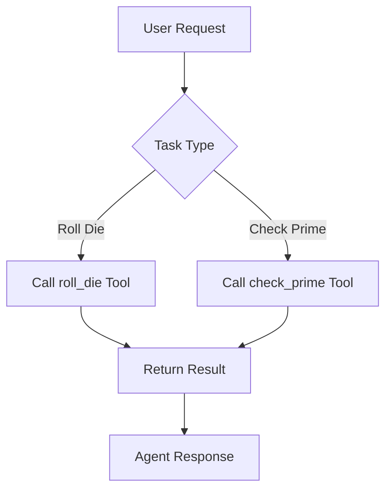
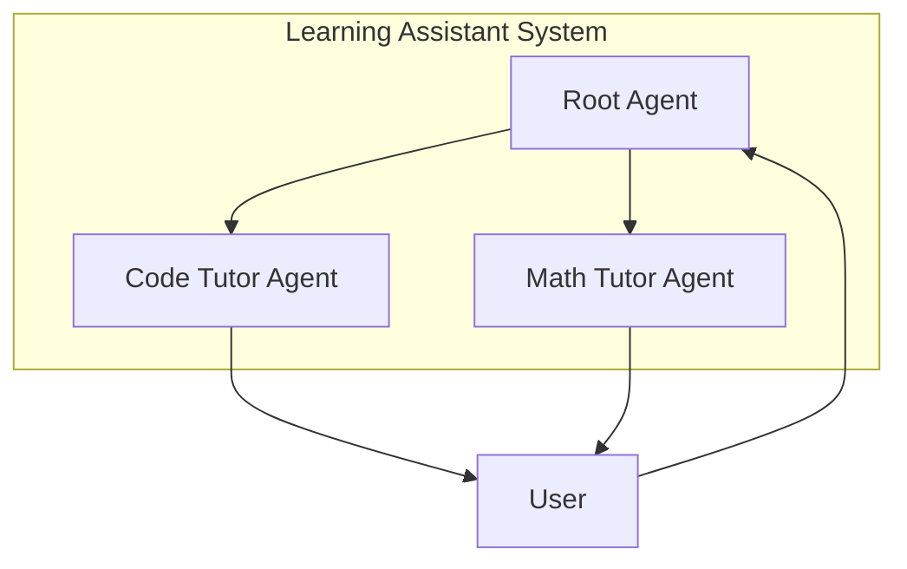
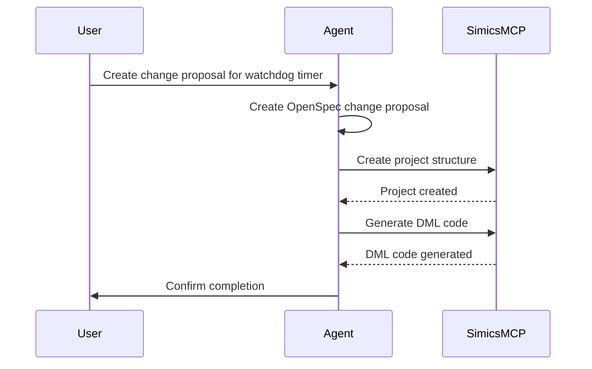
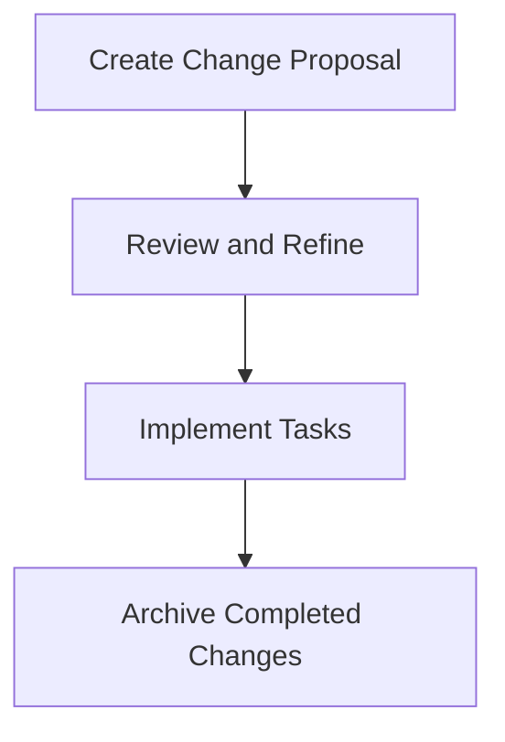

# Examples and Tutorials

<cite>
**Referenced Files in This Document**   
- [agent.py](file://contributing/samples/hello_world/agent.py)
- [agent.py](file://contributing/samples/adk_answering_agent/agent.py)
- [agent.py](file://contributing/samples/multi_agent_basic_config/root_agent.yaml)
- [agent.py](file://contributing/samples/simics_integration/agent.py)
- [agent.py](file://contributing/samples/openspec_integration/agent.py)
- [README.md](file://contributing/samples/adk_answering_agent/README.md)
- [README.md](file://contributing/samples/multi_agent_basic_config/README.md)
- [README.md](file://contributing/samples/simics_integration/README.md)
- [README.md](file://contributing/samples/openspec_integration/README.md)
</cite>

## Table of Contents
1. [Introduction](#introduction)
2. [Core Example Categories](#core-example-categories)
3. [Building Common Agent Types](#building-common-agent-types)
4. [Complex Example Walkthroughs](#complex-example-walkthroughs)
5. [Real-World Use Cases](#real-world-use-cases)
6. [Adapting Examples to Business Requirements](#adapting-examples-to-business-requirements)
7. [Common Implementation Challenges and Solutions](#common-implementation-challenges-and-solutions)
8. [Best Practices for Agent Development](#best-practices-for-agent-development)

## Introduction

The ADK framework provides a comprehensive set of examples and tutorials designed to guide developers through the process of building sophisticated AI agents. These resources demonstrate various capabilities and integration patterns, from simple single-agent systems to complex multi-agent architectures. The examples are organized to cater to both beginners and experienced developers, offering practical implementation guidance for common agent types such as customer service bots, code assistants, and workflow automators.

The examples are located in the `contributing/samples` directory and are designed to test specific features or scenarios. Each example is self-contained and includes the necessary configuration and code to demonstrate a particular capability. The tutorials in this document will walk you through the key examples, explaining their purpose, implementation details, and how to adapt them to specific business requirements.

**Section sources**
- [README.md](file://contributing/README.md)

## Core Example Categories

The ADK framework examples can be categorized into several core types, each demonstrating different aspects of agent development and integration. These categories include basic agents, multi-agent systems, integration agents, and specialized agents for specific use cases.

### Basic Agents

Basic agents are the simplest form of agents in the ADK framework, designed to perform a single task or a set of related tasks. The `hello_world` example is a minimal agent that demonstrates the core concepts of agent definition, tool usage, and instruction-based behavior. This agent can roll a die and check prime numbers, showcasing how to define tools and use them within an agent's instruction set.



**Diagram sources**
- [agent.py](file://contributing/samples/hello_world/agent.py)

### Multi-Agent Systems

Multi-agent systems demonstrate how to create complex applications by composing multiple specialized agents into flexible hierarchies. The `multi_agent_basic_config` example shows a learning assistant that delegates questions to specialized tutoring agents for coding and math. This example illustrates how to create a parent agent that routes tasks to child agents based on the nature of the user's query.



**Diagram sources**
- [root_agent.yaml](file://contributing/samples/multi_agent_basic_config/root_agent.yaml)

### Integration Agents

Integration agents demonstrate how to connect the ADK framework with external systems and tools. The `simics_integration` and `openspec_integration` examples show how to integrate with hardware development tools and specification-driven development workflows, respectively. These agents use specialized tools to interact with external systems, such as Simics for hardware modeling and OpenSpec for spec-driven development.

### Specialized Agents

Specialized agents are designed for specific use cases, such as customer service, code assistance, or workflow automation. The `adk_answering_agent` example is a specialized agent that answers questions in GitHub discussions for the ADK repository. This agent uses a large language model to analyze open discussions, retrieve information from a document store, generate responses, and post comments in GitHub.

**Section sources**
- [README.md](file://contributing/samples/adk_answering_agent/README.md)
- [README.md](file://contributing/samples/multi_agent_basic_config/README.md)
- [README.md](file://contributing/samples/simics_integration/README.md)
- [README.md](file://contributing/samples/openspec_integration/README.md)

## Building Common Agent Types

This section provides step-by-step tutorials for building common agent types using the ADK framework. Each tutorial includes a practical implementation guide, code snippets, and best practices for development.

### Customer Service Bots

Customer service bots are designed to handle user inquiries and provide support. The `adk_answering_agent` example demonstrates how to build a customer service bot that can answer questions in GitHub discussions. This agent uses a combination of tools to retrieve information, generate responses, and post comments.

#### Implementation Steps

1. **Define the Agent**: Create an agent with a specific model, name, and description.
2. **Set Up Tools**: Configure the necessary tools, such as `VertexAiSearchTool` for retrieving information and `AgentTool` for interacting with other agents.
3. **Write Instructions**: Define the agent's behavior through detailed instructions that specify how to handle different types of queries.
4. **Handle Environment Variables**: Use environment variables to manage configuration settings, such as API keys and project IDs.

```python
root_agent = Agent(
    model="gemini-2.5-pro",
    name="adk_answering_agent",
    description="Answer questions about ADK repo.",
    instruction=f"""
    You are a helpful assistant that responds to questions from the GitHub repository `{OWNER}/{REPO}`
    based on information about Google ADK found in the document store. You can access the document store
    using the `VertexAiSearchTool`.
    """,
    tools=[
        VertexAiSearchTool(data_store_id=VERTEXAI_DATASTORE_ID),
        AgentTool(gemini_assistant_agent),
        get_discussion_and_comments,
        add_comment_to_discussion,
        add_label_to_discussion,
        convert_gcs_links_to_https,
    ],
)
```

**Section sources**
- [agent.py](file://contributing/samples/adk_answering_agent/agent.py)

### Code Assistants

Code assistants help developers with coding tasks, such as debugging, code generation, and documentation. The `hello_world_gemini_cli_codeassist` example demonstrates how to build a code assistant that can help with coding tasks using the Gemini CLI.

#### Implementation Steps

1. **Define the Agent**: Create an agent with a model optimized for code generation, such as `gemini-2.0-flash`.
2. **Add Code-Related Tools**: Include tools for code execution, syntax checking, and documentation generation.
3. **Write Code-Specific Instructions**: Define instructions that guide the agent on how to handle coding tasks, such as generating code snippets or debugging code.
4. **Integrate with Development Environment**: Connect the agent to the development environment, such as an IDE or code editor, to provide real-time assistance.

### Workflow Automators

Workflow automators are designed to automate complex workflows, such as project setup, code deployment, and testing. The `simics_integration` example demonstrates how to build a workflow automator that sets up Simics projects and generates DML device skeletons.

#### Implementation Steps

1. **Define the Agent**: Create an agent with a model suitable for handling complex workflows, such as `github_copilot/gpt-5-mini`.
2. **Add Workflow-Specific Tools**: Include tools for project setup, code generation, and testing, such as `create_simics_project` and `generate_dml_registers`.
3. **Write Workflow Instructions**: Define instructions that specify the steps for automating the workflow, such as creating a project structure and generating code.
4. **Handle Environment Variables**: Use environment variables to manage configuration settings, such as project paths and device names.

```python
class SimicsIntegrationAgent(LlmAgent):
    def __init__(self, **kwargs):
        # Initialize the agent with specific tools and instructions
        super().__init__(
            name=agent_name,
            model=agent_model,
            instruction=system_instructions,
            description="Simics integration agent for hardware development within OpenSpec projects",
            tools=[simics_toolset],
            **kwargs
        )
```

**Section sources**
- [agent.py](file://contributing/samples/simics_integration/agent.py)

## Complex Example Walkthroughs

This section provides in-depth walkthroughs of complex examples, such as the Simics integration agent and multi-agent systems. These walkthroughs illustrate how to combine multiple features to solve practical problems and provide guidance on adapting the examples to specific business requirements.

### Simics Integration Agent

The Simics integration agent demonstrates how to integrate the ADK framework with Simics hardware development tools for device modeling and hardware specification work. This agent can create Simics project structures, generate DML device skeletons, and process Device Data Model (DDM) XML specifications.

#### Key Features

- **Simics Project Setup**: Automatically creates Simics project structures.
- **DML Device Skeleton Creation**: Generates device skeleton files for hardware modeling.
- **DDM XML Integration**: Processes DDM XML specifications.
- **Hardware Specification Support**: Works with hardware specification documents.

#### Implementation Details

The Simics integration agent uses a combination of tools and instructions to automate the hardware development workflow. The agent is initialized with specific environment variables, such as `DDM_XML`, `SPEC_FILE`, `DEVICE_NAME`, and `MCP_PORT`, which are used to configure the agent's behavior.

```python
def __init__(self, **kwargs):
    # Get environment variables
    ipxact_xml = os.getenv('IPXACT_XML')
    spec_file = os.getenv('SPEC_FILE') 
    device_name = os.getenv('DEVICE_NAME', 'wdt')
    mcp_port = int(os.getenv('MCP_PORT', '8051'))
    
    # Create system instructions
    system_instructions = f"""You are a Simics hardware development assistant specialized in setting up Simics projects and generating DML device code.
    
    ## CRITICAL: YOU MUST EXECUTE BOTH STEPS - NO EXCEPTIONS
    
    When the user asks you to set up a Simics project, you MUST execute BOTH these steps in order:
    
    🔧 STEP 1: Call create_simics_project to create the base project structure
    🔧 STEP 2: Call generate_dml_registers to generate DML code from IP-XACT XML
    🔧 STEP 3: Provide a brief confirmation after all tools complete
    """
    
    # Create MCP toolset for Simics with restricted tool filter
    simics_toolset = MCPToolset(
        connection_params=connection_params,
        tool_filter=simics_tool_filter
    )
    
    # Initialize the LlmAgent
    super().__init__(
        name=agent_name,
        model=agent_model,
        instruction=system_instructions,
        description="Simics integration agent for hardware development within OpenSpec projects",
        tools=[simics_toolset],
        **kwargs
    )
```

**Section sources**
- [agent.py](file://contributing/samples/simics_integration/agent.py)
- [README.md](file://contributing/samples/simics_integration/README.md)

### Multi-Agent Systems

Multi-agent systems demonstrate how to create scalable applications by composing multiple specialized agents into flexible hierarchies. The `multi_agent_basic_config` example shows a learning assistant that delegates questions to specialized tutoring agents for coding and math.

#### Key Features

- **Delegation**: The root agent delegates coding questions to the code_tutor_agent and math questions to the math_tutor_agent.
- **Specialized Expertise**: Each sub-agent is specialized in a specific domain, allowing for more accurate and detailed responses.
- **Flexible Hierarchy**: The system can be extended by adding more sub-agents for different domains.

#### Implementation Details

The multi-agent system is defined using a YAML configuration file that specifies the root agent and its sub-agents. The root agent is configured to delegate tasks based on the nature of the user's query, while the sub-agents are specialized in specific domains.

```yaml
agent_class: LlmAgent
model: gemini-2.5-flash
name: root_agent
description: Learning assistant that provides tutoring in code and math.
instruction: |
  You are a learning assistant that helps students with coding and math questions.

  You delegate coding questions to the code_tutor_agent and math questions to the math_tutor_agent.

  Follow these steps:
  1. If the user asks about programming or coding, delegate to the code_tutor_agent.
  2. If the user asks about math concepts or problems, delegate to the math_tutor_agent.
  3. Always provide clear explanations and encourage learning.
sub_agents:
  - config_path: code_tutor_agent.yaml
  - config_path: math_tutor_agent.yaml
```

**Section sources**
- [root_agent.yaml](file://contributing/samples/multi_agent_basic_config/root_agent.yaml)
- [README.md](file://contributing/samples/multi_agent_basic_config/README.md)

## Real-World Use Cases

This section illustrates real-world use cases showing how to combine multiple features to solve practical problems. These use cases demonstrate how to adapt the examples to specific business requirements and provide guidance on implementing complex workflows.

### Hardware Device Modeling

The Simics integration agent can be used to model hardware devices, such as a watchdog timer, using Simics and DML 1.4. This use case demonstrates how to create a change proposal, review hardware specifications, implement the device using Simics MCP tools, and archive the completed device.

#### Workflow

1. **Create Change Proposal**: Ask the agent to create an OpenSpec change proposal for the hardware device.
2. **Review Specifications**: Review the hardware specifications and make any necessary refinements.
3. **Implement Using Simics MCP Tools**: Use the Simics MCP tools to implement the device, including creating the project structure, writing tests, and building the device module.
4. **Archive Completed Device**: Archive the completed device and update the specifications.



**Diagram sources**
- [README.md](file://contributing/samples/simics_integration/README.md)

### Spec-Driven Development

The OpenSpec integration agent demonstrates how to use OpenSpec for spec-driven development, aligning humans and AI coding assistants by establishing clear specifications before any code is written. This use case shows how to create a change proposal, review and refine the specifications, implement the tasks, and archive the completed changes.

#### Workflow

1. **Create Change Proposal**: Ask the agent to create an OpenSpec change proposal for a new feature.
2. **Review and Refine**: Iterate on the specifications until they are clear and complete.
3. **Implement Tasks**: Implement the tasks specified in the change proposal.
4. **Archive Completed Changes**: Archive the completed changes and update the specifications.



**Diagram sources**
- [README.md](file://contributing/samples/openspec_integration/README.md)

## Adapting Examples to Business Requirements

This section provides guidance on adapting the examples to specific business requirements. It covers how to modify the agents' behavior, add new tools, and integrate with existing systems.

### Modifying Agent Behavior

To adapt an agent to specific business requirements, you can modify its behavior by changing the instructions, adding new tools, or adjusting the model configuration. For example, you can modify the `adk_answering_agent` to handle questions in a different repository by changing the `OWNER` and `REPO` environment variables.

### Adding New Tools

You can extend the functionality of an agent by adding new tools. For example, you can add a tool for interacting with a database or a tool for sending emails. The tools are defined as functions and added to the agent's `tools` list.

### Integrating with Existing Systems

To integrate an agent with existing systems, you can use the agent's tools to interact with external APIs, databases, or other systems. For example, you can integrate the `simics_integration` agent with a CI/CD pipeline to automate the build and test process.

**Section sources**
- [README.md](file://contributing/samples/adk_answering_agent/README.md)
- [README.md](file://contributing/samples/simics_integration/README.md)
- [README.md](file://contributing/samples/openspec_integration/README.md)

## Common Implementation Challenges and Solutions

This section addresses common implementation challenges and provides solutions based on the provided samples. It covers issues such as tool execution failures, environment configuration, and agent confusion.

### Tool Execution Failures

Tool execution failures can occur due to incorrect configuration, missing dependencies, or network issues. To resolve these issues, ensure that the tool is properly configured, all dependencies are installed, and the network connection is stable.

### Environment Configuration

Environment configuration issues can arise from missing or incorrect environment variables. To avoid these issues, ensure that all required environment variables are set and that their values are correct.

### Agent Confusion

Agent confusion can occur when the agent does not understand the workflow or the instructions are unclear. To resolve this issue, provide clear and detailed instructions and ensure that the agent reads the necessary documentation, such as `AGENTS.md`.

**Section sources**
- [README.md](file://contributing/samples/simics_integration/README.md)
- [README.md](file://contributing/samples/openspec_integration/README.md)

## Best Practices for Agent Development

This section provides best practices for agent development, based on the examples and tutorials in the ADK framework. These practices include writing clear instructions, using appropriate models, and testing the agent thoroughly.

### Writing Clear Instructions

Clear instructions are essential for guiding the agent's behavior. Instructions should be detailed and specific, covering all possible scenarios and edge cases.

### Using Appropriate Models

The choice of model can significantly impact the agent's performance. Select a model that is optimized for the agent's specific use case, such as a model for code generation or a model for natural language understanding.

### Testing the Agent

Thorough testing is crucial for ensuring the agent's reliability and accuracy. Test the agent with a variety of inputs and scenarios to identify and fix any issues.

**Section sources**
- [README.md](file://contributing/samples/adk_answering_agent/README.md)
- [README.md](file://contributing/samples/multi_agent_basic_config/README.md)
- [README.md](file://contributing/samples/simics_integration/README.md)
- [README.md](file://contributing/samples/openspec_integration/README.md)