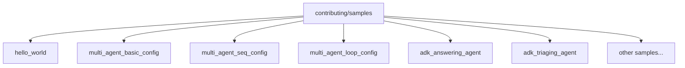
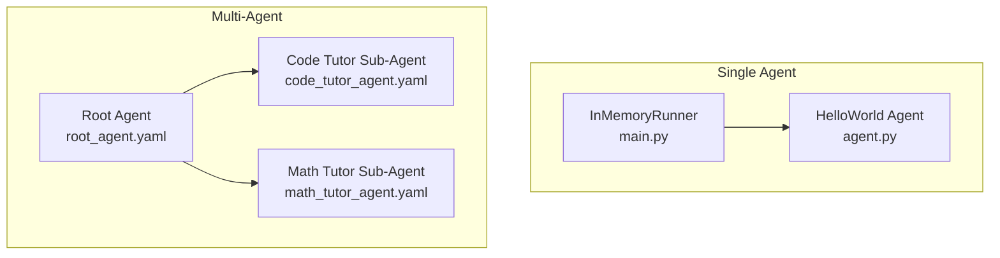
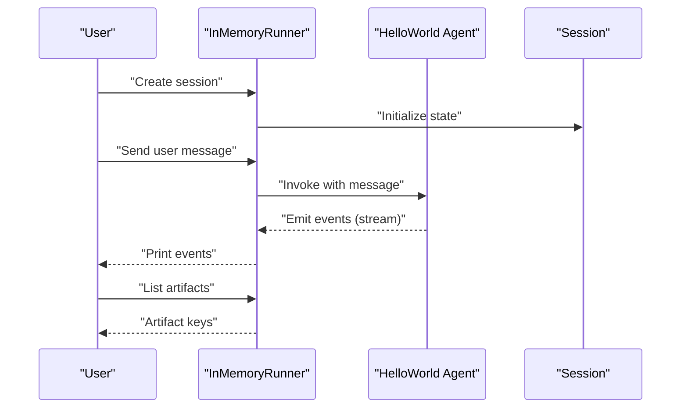
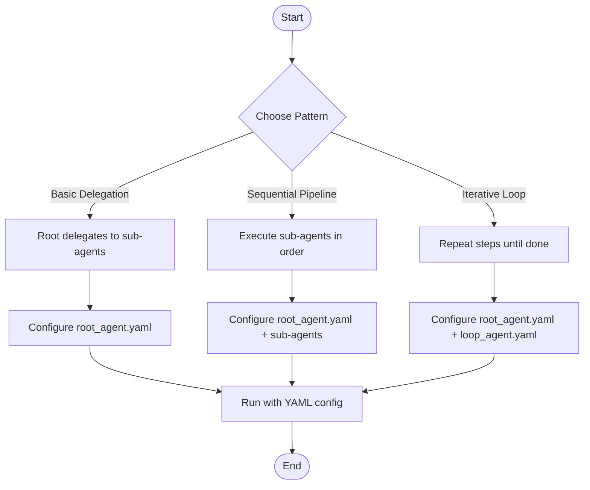
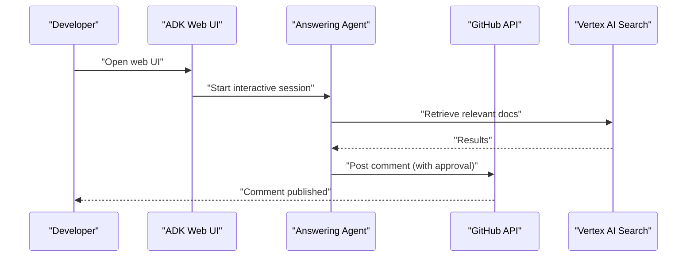
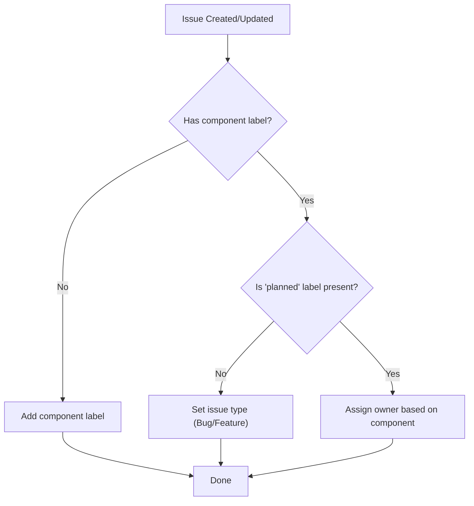
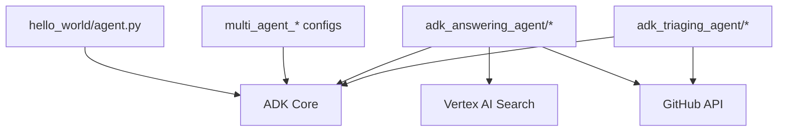

# Examples and Tutorials

<cite>
**Referenced Files in This Document**
- [README.md](file://README.md)
- [contributing/README.md](file://contributing/README.md)
- [hello_world/agent.py](file://contributing/samples/hello_world/agent.py)
- [hello_world/main.py](file://contributing/samples/hello_world/main.py)
- [multi_agent_basic_config/root_agent.yaml](file://contributing/samples/multi_agent_basic_config/root_agent.yaml)
- [multi_agent_basic_config/code_tutor_agent.yaml](file://contributing/samples/multi_agent_basic_config/code_tutor_agent.yaml)
- [multi_agent_basic_config/math_tutor_agent.yaml](file://contributing/samples/multi_agent_basic_config/math_tutor_agent.yaml)
- [multi_agent_seq_config/root_agent.yaml](file://contributing/samples/multi_agent_seq_config/root_agent.yaml)
- [multi_agent_loop_config/root_agent.yaml](file://contributing/samples/multi_agent_loop_config/root_agent.yaml)
- [adk_answering_agent/README.md](file://contributing/samples/adk_answering_agent/README.md)
- [adk_triaging_agent/README.md](file://contributing/samples/adk_triaging_agent/README.md)
</cite>

## Table of Contents
1. [Introduction](#introduction)
2. [Project Structure](#project-structure)
3. [Core Components](#core-components)
4. [Architecture Overview](#architecture-overview)
5. [Detailed Component Analysis](#detailed-component-analysis)
6. [Dependency Analysis](#dependency-analysis)
7. [Performance Considerations](#performance-considerations)
8. [Troubleshooting Guide](#troubleshooting-guide)
9. [Conclusion](#conclusion)
10. [Appendices](#appendices)

## Introduction
This document is a practical, code-first guide to learning and using the Agent Development Kit (ADK) through curated community samples. It organizes the examples into progressive learning paths, starting with the hello_world tutorial for newcomers, progressing through multi-agent orchestration patterns, and concluding with specialized agents for answering questions, triaging issues, and documentation updates. Each section links to concrete files so you can follow along and adapt the examples to your use cases.

## Project Structure
The examples and tutorials are organized under the contributing/samples directory. They include:
- Single-agent quickstarts (hello_world variants)
- Multi-agent orchestration patterns (basic delegation, sequential pipelines, iterative loops)
- Specialized agents (answering, triaging, documentation)
- Additional integration and tool-focused samples

**Section sources**
- [README.md](file://README.md#L1-L180)
- [contributing/README.md](file://contributing/README.md#L1-L17)

## Core Components
- Hello World (single-agent): Demonstrates defining a simple agent with tools, running it in-memory, and observing session state and artifacts.
- Multi-agent basics: A root agent delegating to specialized sub-agents via YAML configuration.
- Multi-agent sequences and loops: Sequential and iterative pipelines composed of sub-agents.
- Specialized agents: Answering agent for GitHub discussions and triaging agent for labeling and assignment.

**Section sources**
- [hello_world/agent.py](file://contributing/samples/hello_world/agent.py#L67-L109)
- [hello_world/main.py](file://contributing/samples/hello_world/main.py#L30-L104)
- [multi_agent_basic_config/root_agent.yaml](file://contributing/samples/multi_agent_basic_config/root_agent.yaml#L1-L18)
- [multi_agent_seq_config/root_agent.yaml](file://contributing/samples/multi_agent_seq_config/root_agent.yaml#L1-L9)
- [multi_agent_loop_config/root_agent.yaml](file://contributing/samples/multi_agent_loop_config/root_agent.yaml#L1-L8)
- [adk_answering_agent/README.md](file://contributing/samples/adk_answering_agent/README.md#L1-L120)
- [adk_triaging_agent/README.md](file://contributing/samples/adk_triaging_agent/README.md#L1-L95)

## Architecture Overview
The examples illustrate two primary patterns:
- Single-agent pattern: Agent defines tools and instructions; client code runs the agent in-memory and streams events.
- Multi-agent pattern: Root agent delegates to sub-agents; orchestration is configured via YAML with agent classes and sub-agent lists.

**Diagram sources**
- [hello_world/agent.py](file://contributing/samples/hello_world/agent.py#L67-L109)
- [hello_world/main.py](file://contributing/samples/hello_world/main.py#L30-L104)
- [multi_agent_basic_config/root_agent.yaml](file://contributing/samples/multi_agent_basic_config/root_agent.yaml#L1-L18)
- [multi_agent_basic_config/code_tutor_agent.yaml](file://contributing/samples/multi_agent_basic_config/code_tutor_agent.yaml#L1-L16)
- [multi_agent_basic_config/math_tutor_agent.yaml](file://contributing/samples/multi_agent_basic_config/math_tutor_agent.yaml#L1-L16)

## Detailed Component Analysis

### Hello World Tutorial (Beginner)
This tutorial introduces the fundamental building blocks: define an agent, attach tools, run it, and observe session state and artifacts.

Key steps:
- Define the agent with model, name, description, instruction, and tools.
- Create an in-memory runner and a session.
- Send user messages and stream events to observe responses.
- Inspect session state and artifacts after runs.

**Diagram sources**
- [hello_world/agent.py](file://contributing/samples/hello_world/agent.py#L67-L109)
- [hello_world/main.py](file://contributing/samples/hello_world/main.py#L30-L104)

Best practices:
- Keep instructions precise and include explicit tool-use steps.
- Use RunConfig options (e.g., saving artifacts) when needed.
- Observe session state to validate tool effects.

Adaptation tips:
- Replace tools with domain-specific functions.
- Adjust instructions for your use case (e.g., math, code, or data analysis).
- Enable structured outputs or safety settings as required.

**Section sources**
- [hello_world/agent.py](file://contributing/samples/hello_world/agent.py#L22-L109)
- [hello_world/main.py](file://contributing/samples/hello_world/main.py#L30-L104)

### Multi-Agent Configuration Patterns (Intermediate)
This section covers how to compose agents using YAML configuration.

- Basic delegation: A root agent delegates to specialized sub-agents.
- Sequential pipeline: A SequentialAgent orchestrates ordered sub-agents.
- Iterative loop: A loop agent repeats steps until convergence.

**Diagram sources**
- [multi_agent_basic_config/root_agent.yaml](file://contributing/samples/multi_agent_basic_config/root_agent.yaml#L1-L18)
- [multi_agent_basic_config/code_tutor_agent.yaml](file://contributing/samples/multi_agent_basic_config/code_tutor_agent.yaml#L1-L16)
- [multi_agent_basic_config/math_tutor_agent.yaml](file://contributing/samples/multi_agent_basic_config/math_tutor_agent.yaml#L1-L16)
- [multi_agent_seq_config/root_agent.yaml](file://contributing/samples/multi_agent_seq_config/root_agent.yaml#L1-L9)
- [multi_agent_loop_config/root_agent.yaml](file://contributing/samples/multi_agent_loop_config/root_agent.yaml#L1-L8)

Patterns and guidance:
- Basic delegation: Use for simple split-and-ask scenarios. Keep sub-agent instructions focused and non-overlapping.
- Sequential pipeline: Ideal for multi-step workflows (e.g., write → review → refactor).
- Iterative loop: Suitable for refinement cycles (e.g., draft → feedback → revise).

**Section sources**
- [multi_agent_basic_config/root_agent.yaml](file://contributing/samples/multi_agent_basic_config/root_agent.yaml#L1-L18)
- [multi_agent_basic_config/code_tutor_agent.yaml](file://contributing/samples/multi_agent_basic_config/code_tutor_agent.yaml#L1-L16)
- [multi_agent_basic_config/math_tutor_agent.yaml](file://contributing/samples/multi_agent_basic_config/math_tutor_agent.yaml#L1-L16)
- [multi_agent_seq_config/root_agent.yaml](file://contributing/samples/multi_agent_seq_config/root_agent.yaml#L1-L9)
- [multi_agent_loop_config/root_agent.yaml](file://contributing/samples/multi_agent_loop_config/root_agent.yaml#L1-L8)

### Specialized Use Cases (Advanced)
These examples demonstrate production-grade agents for real-world tasks.

#### Answering Agent
Purpose: Automatically answer GitHub discussions using a knowledge base and optional human approval.

Key capabilities:
- Interactive mode via a web UI.
- Batch processing for oncall teams.
- GitHub Actions automation.
- Knowledge base update via Vertex AI Search.

**Diagram sources**
- [adk_answering_agent/README.md](file://contributing/samples/adk_answering_agent/README.md#L1-L120)

Guidance:
- Use environment variables for credentials and service IDs.
- Prefer direct JSON passing in GitHub Actions to reduce API calls.
- Keep instructions aligned with repository tone and policies.

**Section sources**
- [adk_answering_agent/README.md](file://contributing/samples/adk_answering_agent/README.md#L1-L120)

#### Triaging Agent
Purpose: Automatically triage GitHub issues by adding component labels, setting types, and assigning owners.

Key capabilities:
- Component label mapping and owner assignment.
- Support for interactive and automated workflows.
- Scheduled runs and trigger-based automation.

**Diagram sources**
- [adk_triaging_agent/README.md](file://contributing/samples/adk_triaging_agent/README.md#L1-L95)

Guidance:
- Align component labels with your repository’s structure.
- Use non-interactive mode for automated runs.
- Configure scheduled runs to catch backlog.

**Section sources**
- [adk_triaging_agent/README.md](file://contributing/samples/adk_triaging_agent/README.md#L1-L95)

## Dependency Analysis
The examples depend on the ADK runtime and optional external services:
- ADK core: agents, runners, sessions, tools, and configuration.
- Optional integrations: Vertex AI Search, GitHub APIs, and cloud services.

**Diagram sources**
- [hello_world/agent.py](file://contributing/samples/hello_world/agent.py#L67-L109)
- [multi_agent_basic_config/root_agent.yaml](file://contributing/samples/multi_agent_basic_config/root_agent.yaml#L1-L18)
- [adk_answering_agent/README.md](file://contributing/samples/adk_answering_agent/README.md#L1-L120)
- [adk_triaging_agent/README.md](file://contributing/samples/adk_triaging_agent/README.md#L1-L95)

**Section sources**
- [README.md](file://README.md#L1-L180)
- [contributing/README.md](file://contributing/README.md#L1-L17)

## Performance Considerations
- Minimize redundant API calls: pass JSON payloads directly in automation where possible.
- Use structured outputs and safety settings to reduce retries.
- For multi-agent systems, keep sub-agent responsibilities narrowly scoped to reduce coordination overhead.
- Persist artifacts and state judiciously to balance observability and storage costs.

## Troubleshooting Guide
Common issues and resolutions:
- Authentication failures: Ensure environment variables for credentials and service IDs are set correctly.
- Missing dependencies: Install required packages as documented in sample READMEs.
- Streaming and artifacts: Verify RunConfig options and session state inspection.
- Multi-agent delegation: Confirm YAML paths and agent class names match the intended orchestration.

**Section sources**
- [adk_answering_agent/README.md](file://contributing/samples/adk_answering_agent/README.md#L77-L120)
- [adk_triaging_agent/README.md](file://contributing/samples/adk_triaging_agent/README.md#L74-L95)

## Conclusion
By progressing from hello_world to multi-agent orchestration and then to specialized agents, you can incrementally build expertise in ADK. Start small with single-agent examples, then compose multi-agent systems using YAML, and finally adopt production-grade agents for answering and triaging. Customize instructions, tools, and integrations to fit your domain and operational needs.

## Appendices
- Beginner path: hello_world single-agent example.
- Intermediate path: multi-agent basic delegation, sequential pipelines, and iterative loops.
- Advanced path: answering and triaging agents with automation and knowledge bases.