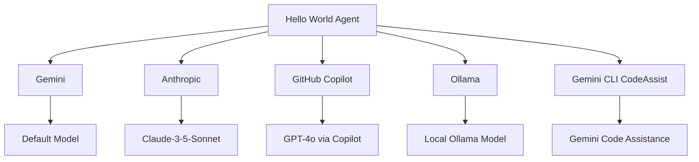
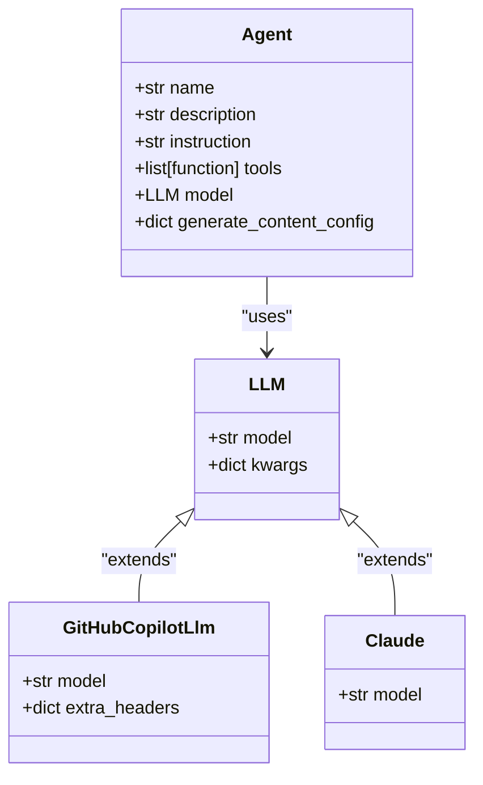
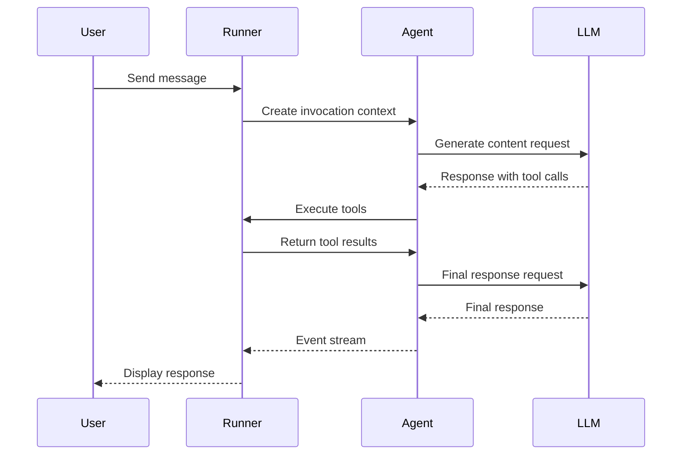
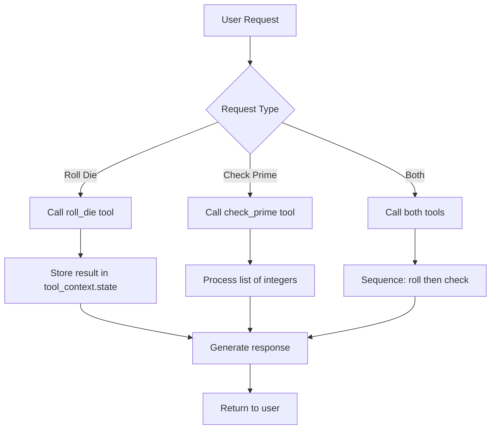

# Hello World Examples

<cite>
**Referenced Files in This Document**   
- [contributing/samples/hello_world/agent.py](file://contributing/samples/hello_world/agent.py)
- [contributing/samples/hello_world/main.py](file://contributing/samples/hello_world/main.py)
- [contributing/samples/hello_world_anthropic/agent.py](file://contributing/samples/hello_world_anthropic/agent.py)
- [contributing/samples/hello_world_anthropic/main.py](file://contributing/samples/hello_world_anthropic/main.py)
- [contributing/samples/hello_world_github_copilot/agent.py](file://contributing/samples/hello_world_github_copilot/agent.py)
- [contributing/samples/hello_world_github_copilot/main.py](file://contributing/samples/hello_world_github_copilot/main.py)
- [contributing/samples/hello_world_ollama/agent.py](file://contributing/samples/hello_world_ollama/agent.py)
- [contributing/samples/hello_world_ollama/main.py](file://contributing/samples/hello_world_ollama/main.py)
- [src/google/adk/agents/base_agent.py](file://src/google/adk/agents/base_agent.py)
- [src/google/adk/models/github_copilot_llm.py](file://src/google/adk/models/github_copilot_llm.py)
- [src/google/adk/models/anthropic_llm.py](file://src/google/adk/models/anthropic_llm.py)
- [src/google/adk/models/gemini_llm_connection.py](file://src/google/adk/models/gemini_llm_connection.py)
- [src/google/adk/runners.py](file://src/google/adk/runners.py)
- [src/google/adk/cli/utils/logs.py](file://src/google/adk/cli/utils/logs.py)
</cite>

## Table of Contents
1. [Introduction](#introduction)
2. [Core Hello World Agent](#core-hello-world-agent)
3. [LLM Integration Variants](#llm-integration-variants)
4. [Agent Initialization and Configuration](#agent-initialization-and-configuration)
5. [Execution Environment and Runner Setup](#execution-environment-and-runner-setup)
6. [Tool Integration and Function Calling](#tool-integration-and-function-calling)
7. [Configuration-Driven vs Code-Based Approaches](#configuration-driven-vs-code-based-approaches)
8. [Common Configuration Options](#common-configuration-options)
9. [Extending Basic Agents](#extending-basic-agents)
10. [Development and Debugging](#development-and-debugging)
11. [Conclusion](#conclusion)

## Introduction
The Hello World Examples in the ADK framework serve as foundational introductions to agent development, demonstrating how to create simple agents that interact with various Large Language Model (LLM) backends. These examples illustrate core patterns for agent initialization, tool integration, and execution across different LLM providers including Gemini, Anthropic, GitHub Copilot, and Ollama. The examples are designed to help developers understand the basic structure of ADK agents, how to configure them for different LLMs, and how to execute and test them in local development environments. Each variant demonstrates the same core functionality—rolling dice and checking prime numbers—while showcasing the specific configuration requirements for each LLM backend.

## Core Hello World Agent

The core Hello World agent provides a basic implementation using the default Gemini model. This agent demonstrates the fundamental structure of an ADK agent with tool integration for dice rolling and prime number checking. The agent is configured with a clear instruction set that defines its behavior when handling user requests for dice rolls and prime number verification. It maintains state across interactions through session management, allowing it to remember previous dice rolls when requested by the user. The agent's configuration includes safety settings that disable content filtering for dice-related queries, which might otherwise be flagged as potentially dangerous content.

**Section sources**
- [contributing/samples/hello_world/agent.py](file://contributing/samples/hello_world/agent.py#L67-L109)
- [contributing/samples/hello_world/main.py](file://contributing/samples/hello_world/main.py#L30-L104)

## LLM Integration Variants

The ADK framework provides Hello World examples for multiple LLM providers, each demonstrating the specific configuration requirements for that backend. The Anthropic variant uses the Claude model with a specific version identifier, while the GitHub Copilot variant leverages the GitHub Copilot integration through LiteLLM. The Ollama variant demonstrates local model execution, and the Gemini CLI CodeAssist variant shows integration with GitHub's code assistance features. Each variant maintains the same core functionality but adapts the model configuration to the specific requirements of the LLM provider, including authentication methods, model naming conventions, and API endpoint configurations.

**Diagram sources**
- [contributing/samples/hello_world/agent.py](file://contributing/samples/hello_world/agent.py#L68)
- [contributing/samples/hello_world_anthropic/agent.py](file://contributing/samples/hello_world_anthropic/agent.py#L63)
- [contributing/samples/hello_world_github_copilot/agent.py](file://contributing/samples/hello_world_github_copilot/agent.py#L69)
- [contributing/samples/hello_world_ollama/agent.py](file://contributing/samples/hello_world_ollama/agent.py#L69)

## Agent Initialization and Configuration

Agent initialization in the ADK framework follows a consistent pattern across all variants, with the `Agent` class serving as the central component. The agent is configured with essential properties including name, description, instruction set, tools, and model specification. The configuration process demonstrates how to set up an agent with multiple tools that can be called in parallel or sequentially based on user requests. The instruction set plays a crucial role in defining the agent's behavior, specifying exactly when and how to use each tool, and establishing the expected response format. Model configuration varies by LLM provider, with some requiring specific model identifiers and others supporting direct model references.

**Diagram sources**
- [contributing/samples/hello_world/agent.py](file://contributing/samples/hello_world/agent.py#L67-L109)
- [src/google/adk/models/github_copilot_llm.py](file://src/google/adk/models/github_copilot_llm.py#L23-L101)
- [src/google/adk/models/anthropic_llm.py](file://src/google/adk/models/anthropic_llm.py)

## Execution Environment and Runner Setup

The execution environment for Hello World agents is established through the Runner class, which manages the agent's lifecycle and interaction with the LLM backend. The InMemoryRunner provides a simple execution environment for local development and testing, while the full Runner class supports more advanced features like artifact and session management. The execution flow begins with creating a session for the user, then processing user messages through the agent, and finally handling the event stream that contains the agent's responses. The runner setup includes configuration for logging, which helps developers debug agent behavior and understand the flow of interactions.

**Diagram sources**
- [contributing/samples/hello_world/main.py](file://contributing/samples/hello_world/main.py#L30-L104)
- [src/google/adk/runners.py](file://src/google/adk/runners.py)
- [src/google/adk/agents/base_agent.py](file://src/google/adk/agents/base_agent.py#L214-L250)

## Tool Integration and Function Calling

Tool integration is a core feature demonstrated in the Hello World examples, with the `roll_die` and `check_prime` functions serving as primary tools. These tools showcase different patterns: a synchronous function for dice rolling and an asynchronous function for prime number checking. The tools are designed with proper type annotations and documentation, which the LLM uses to understand their purpose and parameters. The instruction set explicitly defines when and how to use these tools, including the requirement to pass integer values rather than strings. Tool context is used to maintain state across interactions, allowing the agent to remember previous dice rolls and include them in subsequent responses.

**Diagram sources**
- [contributing/samples/hello_world/agent.py](file://contributing/samples/hello_world/agent.py#L22-L37)
- [contributing/samples/hello_world/agent.py](file://contributing/samples/hello_world/agent.py#L39-L65)
- [contributing/samples/hello_world/agent.py](file://contributing/samples/hello_world/agent.py#L75-L89)

## Configuration-Driven vs Code-Based Approaches

The ADK framework supports both code-based and configuration-driven approaches to agent development. The Hello World examples primarily use the code-based approach, where the agent is defined directly in Python code with all configuration parameters specified inline. This approach is ideal for development and testing, providing maximum flexibility and ease of debugging. The framework also supports configuration-driven approaches using YAML files, which are better suited for production deployments where configuration management and version control are important. The code-based approach allows for dynamic configuration and programmatic agent creation, while the configuration-driven approach promotes separation of concerns between code and configuration.

**Section sources**
- [contributing/samples/hello_world/agent.py](file://contributing/samples/hello_world/agent.py)
- [contributing/samples/core_basic_config/root_agent.yaml](file://contributing/samples/core_basic_config/root_agent.yaml)

## Common Configuration Options

The Hello World examples demonstrate several common configuration options that are applicable across different LLM backends. These include model specification, safety settings, instruction sets, and tool registration. The generate_content_config parameter is used to configure safety settings, such as disabling dangerous content filtering for dice-related queries. The instruction parameter provides detailed guidance to the LLM on how to handle user requests and when to use specific tools. Tool registration is consistent across all variants, with functions being passed directly to the agent constructor. These configuration options form the foundation for more complex agent behaviors and can be extended with additional parameters for specific use cases.

**Section sources**
- [contributing/samples/hello_world/agent.py](file://contributing/samples/hello_world/agent.py#L95-L108)
- [contributing/samples/hello_world_anthropic/agent.py](file://contributing/samples/hello_world_anthropic/agent.py#L62-L90)

## Extending Basic Agents

The Hello World agents can be extended in several ways to demonstrate more advanced ADK features. Memory integration can be added to maintain longer-term context across sessions, while additional tools can be incorporated to expand the agent's capabilities. The agent can be configured to use different planners for more sophisticated reasoning, or to integrate with external services through API tools. Multi-agent configurations can be created by combining multiple Hello World agents with different specializations. These extensions build upon the basic agent structure while maintaining the same core execution patterns, making them ideal for progressive learning and development.

**Section sources**
- [contributing/samples/hello_world/agent.py](file://contributing/samples/hello_world/agent.py)
- [contributing/samples/memory/agent.py](file://contributing/samples/memory/agent.py)
- [contributing/samples/multi_agent_basic_config/root_agent.yaml](file://contributing/samples/multi_agent_basic_config/root_agent.yaml)

## Development and Debugging

The Hello World examples include several features that support local development and debugging. The logging utilities provide detailed output of agent interactions, helping developers understand the flow of messages and tool calls. The test configuration includes assertions to verify that the agent maintains state correctly across interactions. The main.py files in each example include timing measurements to monitor performance, and the use of in-memory services simplifies setup and reduces dependencies. These debugging features are essential for understanding agent behavior and identifying issues during development, particularly when working with asynchronous tool execution and state management.

**Section sources**
- [contributing/samples/hello_world/main.py](file://contributing/samples/hello_world/main.py#L27)
- [contributing/samples/hello_world/main.py](file://contributing/samples/hello_world/main.py#L73-L80)
- [src/google/adk/cli/utils/logs.py](file://src/google/adk/cli/utils/logs.py)

## Conclusion

The Hello World Examples in the ADK framework provide a comprehensive introduction to agent development, covering the essential concepts of agent initialization, LLM integration, tool usage, and execution. By examining the different variants for various LLM providers, developers can understand the common patterns and specific requirements for each backend. The examples demonstrate best practices for agent configuration, including clear instruction sets, proper tool integration, and effective state management. These foundational examples serve as a springboard for more complex agent development, providing a solid understanding of the ADK framework's core capabilities and architecture.