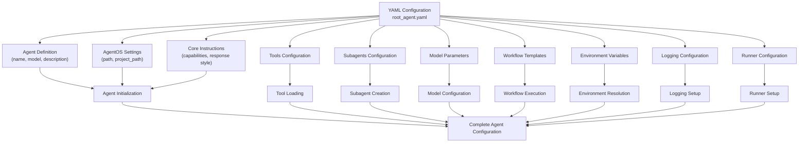
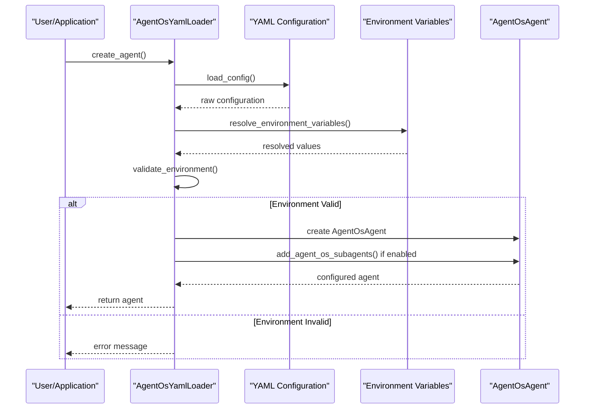
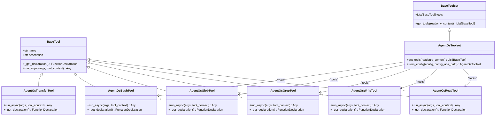
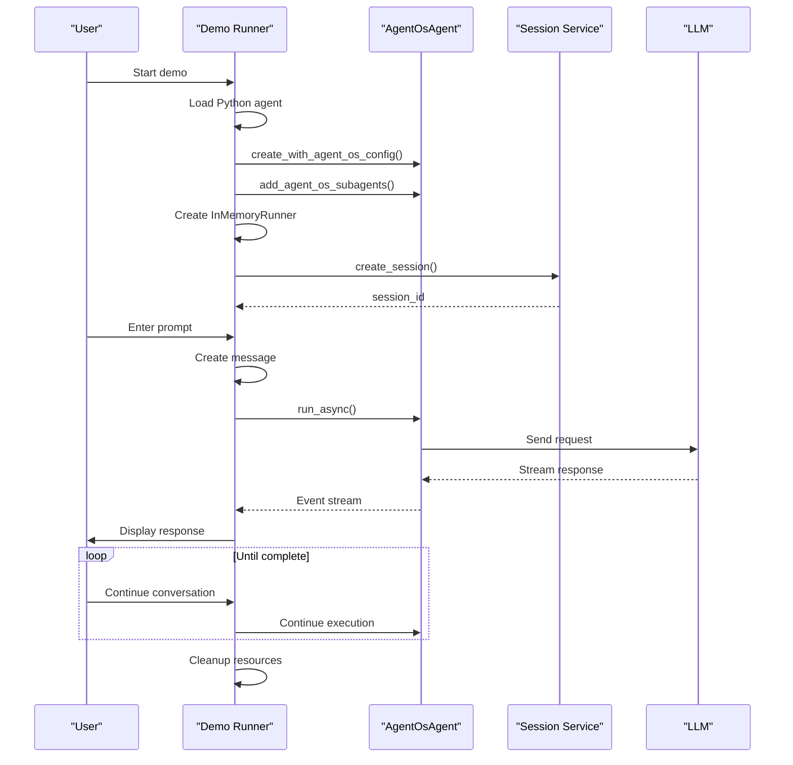

# AgentOS Integration

<cite>
**Referenced Files in This Document**   
- [agent_os_agent.py](file://contributing/samples/agent_os_integration/python/agent_os_agent.py)
- [agent_os_tools.py](file://contributing/samples/agent_os_integration/agent_os_tools.py)
- [demo_runner.py](file://contributing/samples/agent_os_integration/demo_runner.py)
- [root_agent.yaml](file://contributing/samples/agent_os_integration/yaml/root_agent.yaml)
- [yaml_loader.py](file://contributing/samples/agent_os_integration/yaml/yaml_loader.py)
- [agent.py](file://contributing/samples/agent_os_integration/python/agent.py)
- [AGENT_OS_INTEGRATION.md](file://contributing/samples/agent_os_integration/AGENT_OS_INTEGRATION.md)
- [README.md](file://contributing/samples/agent_os_integration/README.md)
</cite>

## Table of Contents
1. [Introduction](#introduction)
2. [YAML Configuration System](#yaml-configuration-system)
3. [Python Agent Implementation](#python-agent-implementation)
4. [Configuration Management and Dynamic Behavior](#configuration-management-and-dynamic-behavior)
5. [Tool Integration and External Tool Usage](#tool-integration-and-external-tool-usage)
6. [Workflow Execution and Demo Runner](#workflow-execution-and-demo-runner)
7. [Common Issues and Troubleshooting](#common-issues-and-troubleshooting)
8. [Relationships with Core Components](#relationships-with-core-components)
9. [Conclusion](#conclusion)

## Introduction

The AgentOS Integration section provides comprehensive guidance on connecting ADK agents with the AgentOS ecosystem. This integration enables structured, spec-driven development workflows by combining the capabilities of Google's Agent Development Kit (ADK) with the AgentOS framework. The system supports multiple configuration approaches, including YAML-based declarative configurations and Python-based programmatic implementations, allowing developers to define agent workflows that follow AgentOS methodologies for product planning, specification creation, task execution, and code analysis.

The integration offers specialized subagents for various development tasks, including context fetching, file creation, project management, git workflow handling, test running, and date checking. These components work together to maintain high coding standards, ensure proper documentation, and follow established development processes. The system is designed to be flexible, supporting both direct Python usage and YAML configuration through a robust loader system that resolves environment variables and validates configurations.

**Section sources**
- [AGENT_OS_INTEGRATION.md](file://contributing/samples/agent_os_integration/AGENT_OS_INTEGRATION.md#L1-L265)
- [README.md](file://contributing/samples/agent_os_integration/README.md#L1-L537)

## YAML Configuration System

The YAML configuration system provides a declarative approach to defining agent workflows within the AgentOS ecosystem. The primary configuration file, `root_agent.yaml`, contains comprehensive settings for the agent's behavior, tools, subagents, and workflows. This YAML-based approach enables configuration-as-code principles, allowing teams to version control and share agent configurations across projects.

The configuration structure includes several key sections: agent definition with name, model, and description; AgentOS-specific settings such as path and project location; core instructions that define the agent's capabilities and response style; tools configuration; subagents configuration; model parameters; and workflow templates. Environment variables are supported through the `${VAR_NAME}` syntax, allowing for flexible configuration across different deployment environments. The system also includes validation for required environment variables such as `GOOGLE_API_KEY` and `AGENT_OS_PATH`.

Workflow templates defined in the YAML configuration include product planning, specification creation, task execution, and code analysis, each with a defined sequence of steps that the agent follows. These templates ensure consistent execution of development processes across different projects and team members. The configuration also includes logging settings, runner configuration, and environment requirements to ensure proper setup and operation.



**Diagram sources**
- [root_agent.yaml](file://contributing/samples/agent_os_integration/yaml/root_agent.yaml#L1-L219)

**Section sources**
- [root_agent.yaml](file://contributing/samples/agent_os_integration/yaml/root_agent.yaml#L1-L219)
- [README.md](file://contributing/samples/agent_os_integration/README.md#L379-L395)

## Python Agent Implementation

The Python agent implementation provides a programmatic approach to creating and configuring AgentOS agents within the ADK framework. The core implementation is defined in `agent_os_agent.py`, which extends the `LlmAgent` class to incorporate AgentOS-specific functionality. This approach offers greater flexibility and control compared to YAML configuration, allowing developers to customize agent behavior through code.

The `AgentOsAgent` class provides several key methods for agent creation and configuration. The `create_with_agent_os` class method serves as a convenience constructor that initializes an agent with default AgentOS settings. The `add_agent_os_subagents` method dynamically creates and attaches specialized subagents for context fetching, file creation, project management, git workflow handling, test running, and date checking. Each subagent is configured with specific instructions and access to the full suite of AgentOS tools, enabling them to perform their specialized tasks effectively.

The agent implementation follows object-oriented design principles, with each subagent having its own specific instruction set that guides its behavior. These instructions reference external documentation files (`.adk/agents/*.md`) to ensure that subagents follow the most current guidance and workflows. The parent agent maintains references to all subagents and can delegate tasks to them using the `transfer_to_agent` tool, creating a hierarchical workflow where specialized agents handle specific aspects of development tasks.

```mermaid
classDiagram
class AgentOsAgent {
+str name
+str model
+str instruction
+str description
+List[BaseTool] tools
+List[LlmAgent] sub_agents
+parent_agent : Optional[LlmAgent]
+__init__(name, model, instruction, description, **kwargs)
+create_with_agent_os(agent_os_path, project_path, **kwargs) AgentOsAgent
+add_agent_os_subagents(agent_os_path) void
+_get_default_instruction() str
+_get_context_fetcher_instruction() str
+_get_file_creator_instruction() str
+_get_project_manager_instruction() str
+_get_git_workflow_instruction() str
+_get_test_runner_instruction() str
+_get_date_checker_instruction() str
}
class LlmAgent {
+str name
+str model
+str instruction
+str description
+List[BaseTool] tools
+List[LlmAgent] sub_agents
+parent_agent : Optional[LlmAgent]
}
class LlmAgent <|-- AgentOsAgent : "extends"
AgentOsAgent --> "6" LlmAgent : "sub_agents"
AgentOsAgent --> "1" AgentOsToolset : "tools"
```

**Diagram sources**
- [agent_os_agent.py](file://contributing/samples/agent_os_integration/python/agent_os_agent.py#L54-L521)

**Section sources**
- [agent_os_agent.py](file://contributing/samples/agent_os_integration/python/agent_os_agent.py#L54-L521)
- [agent.py](file://contributing/samples/agent_os_integration/python/agent.py#L39-L51)

## Configuration Management and Dynamic Behavior

The AgentOS integration employs a sophisticated configuration management system that enables dynamic agent behavior based on environment variables, external configuration files, and runtime conditions. The system supports multiple configuration sources, including YAML files, environment variables, and programmatic settings, which are resolved and merged to create the final agent configuration.

The `AgentOsYamlLoader` class in `yaml_loader.py` implements the core configuration loading functionality. It recursively resolves environment variables in configuration values, allowing for flexible deployment across different environments. The loader supports the `${VAR_NAME}` and `$VAR_NAME` syntax for environment variable references, with fallback values if variables are not set. This enables configuration of sensitive information like API keys and paths without hardcoding them into configuration files.

Configuration validation is an integral part of the system, with methods to verify that required environment variables are present before agent creation. The loader provides access to different configuration sections through dedicated methods like `get_workflows()`, `get_runner_config()`, and `get_logging_config()`, allowing components to access only the configuration they need. The system also includes a configuration summary feature that prints key configuration values for debugging and verification purposes.

The dynamic behavior extends to agent creation, where the system can conditionally load subagents and tools based on configuration flags. For example, the `auto_add_subagents` setting in the YAML configuration determines whether specialized subagents are automatically attached to the main agent. This flexibility allows teams to customize agent capabilities based on their specific needs and project requirements.



**Diagram sources**
- [yaml_loader.py](file://contributing/samples/agent_os_integration/yaml/yaml_loader.py#L39-L294)

**Section sources**
- [yaml_loader.py](file://contributing/samples/agent_os_integration/yaml/yaml_loader.py#L39-L294)
- [root_agent.yaml](file://contributing/samples/agent_os_integration/yaml/root_agent.yaml#L24-L29)

## Tool Integration and External Tool Usage

The AgentOS integration provides a comprehensive suite of tools that enable agents to interact with the external environment, perform file operations, execute system commands, and manage development workflows. These tools are implemented in `agent_os_tools.py` and organized into a `AgentOsToolset` that can be easily added to agents. The tool system follows the ADK's tool architecture, extending the `BaseTool` class to create specialized functionality.

The core tools include `AgentOsReadTool` for reading file contents, `AgentOsWriteTool` for creating and updating files with overwrite protection, `AgentOsGrepTool` for pattern searching across files, `AgentOsGlobTool` for finding files matching glob patterns, and `AgentOsBashTool` for executing shell commands. Additionally, the `AgentOsTransferTool` enables control transfer between agents, facilitating the subagent architecture where specialized agents handle specific tasks.

Each tool implements the `_get_declaration()` method to define its interface for the LLM, specifying parameters, types, and descriptions that guide the model in using the tool correctly. The tools handle errors gracefully, returning structured error responses rather than raising exceptions, which allows the agent to respond appropriately to tool execution failures. The implementation includes robust error handling for common issues like file not found, permission errors, and command timeouts.

The tool system demonstrates configuration-as-code principles by providing a `create_agent_os_toolset()` factory function that instantiates all tools and returns them as a `AgentOsToolset`. This approach enables consistent tool configuration across different agent instances and simplifies integration with both YAML and Python-based agent configurations.



**Diagram sources**
- [agent_os_tools.py](file://contributing/samples/agent_os_integration/agent_os_tools.py#L58-L458)

**Section sources**
- [agent_os_tools.py](file://contributing/samples/agent_os_integration/agent_os_tools.py#L58-L458)
- [AGENT_OS_INTEGRATION.md](file://contributing/samples/agent_os_integration/AGENT_OS_INTEGRATION.md#L90-L117)

## Workflow Execution and Demo Runner

The workflow execution system in AgentOS integration enables agents to perform complex development tasks through structured workflows that follow AgentOS methodologies. The `demo_runner.py` script provides an interactive demonstration of these workflows, showcasing both Python and YAML agent configurations in action. This runner serves as both a testing tool and an example of how to integrate AgentOS agents with the ADK runner system.

The demo runner executes several key workflows: product planning for new applications, specification creation for features, task execution for development work, and code analysis for existing projects. It supports AgentOS commands like `@plan-product`, `@create-spec`, `@execute-tasks`, and `@analyze-project`, which trigger specific workflows defined in the configuration. The runner creates isolated sessions for each execution, ensuring that state is properly managed and that different tasks do not interfere with each other.

The execution flow follows a consistent pattern: create a runner instance with the configured agent, create a session for the user, send a message to initiate the workflow, and process the event stream to capture the agent's response. The runner handles both the technical aspects of agent execution and provides user-friendly output that shows the progress and results of each workflow. It also includes error handling and debugging features to help diagnose issues during execution.

The demo runner supports comparative testing, allowing users to execute the same prompt with both the Python-based `AgentOsAgent` and the YAML-based configuration to compare their behavior and responses. This feature is valuable for validating that different configuration approaches produce consistent results and for identifying any discrepancies in agent behavior.



**Diagram sources**
- [demo_runner.py](file://contributing/samples/agent_os_integration/demo_runner.py#L79-L333)

**Section sources**
- [demo_runner.py](file://contributing/samples/agent_os_integration/demo_runner.py#L79-L333)
- [README.md](file://contributing/samples/agent_os_integration/README.md#L124-L147)

## Common Issues and Troubleshooting

The AgentOS integration may encounter several common issues that developers should be aware of when setting up and using the system. Understanding these issues and their solutions is crucial for maintaining smooth operation and effective troubleshooting. The most frequent problems relate to configuration parsing, tool registration, state management, and environment setup.

Configuration parsing errors often occur when YAML files contain syntax errors or when environment variables referenced in configurations are not set. The system includes validation for required environment variables like `GOOGLE_API_KEY` and `AGENT_OS_PATH`, and will provide clear error messages when these are missing. To resolve configuration issues, developers should verify the YAML syntax, ensure all required environment variables are set, and use the configuration summary feature to inspect loaded values.

Tool registration conflicts can arise when multiple tool instances with the same name are added to an agent, or when tool dependencies are not properly resolved. The AgentOS integration avoids this by organizing tools into a single `AgentOsToolset` that manages all AgentOS-specific tools. If tool conflicts occur, developers should check that they are not inadvertently adding the same tool multiple times and ensure that the tool loading path is correctly configured.

State management across agent boundaries presents challenges when subagents need to share context or when control is transferred between agents. The system addresses this through the `transfer_to_agent` tool, which maintains proper parent-child relationships between agents and ensures that state is preserved during handoffs. Developers should ensure that subagents properly return control to their parent agents and that session state is managed correctly across different agent instances.

Other common issues include import errors when the Python path is not correctly configured, model errors due to incorrect model names or API credentials, and file permission errors when tools attempt to read or write files. The troubleshooting guide recommends enabling debug logging to gain more insight into execution issues and verifying the directory structure to ensure all required files are accessible.

**Section sources**
- [AGENT_OS_INTEGRATION.md](file://contributing/samples/agent_os_integration/AGENT_OS_INTEGRATION.md#L234-L253)
- [README.md](file://contributing/samples/agent_os_integration/README.md#L430-L469)

## Relationships with Core Components

The AgentOS integration maintains strong relationships with several core components of the ADK framework, creating a cohesive system for agent development and deployment. The most fundamental relationship is with the tool system, which provides the foundation for all external interactions and functionality. The AgentOS tools extend the ADK's `BaseTool` class and integrate with the tool context system, allowing them to participate in the agent's decision-making process and tool calling capabilities.

The configuration-as-code principle is central to the integration, with YAML configurations serving as declarative definitions of agent behavior that can be version controlled, shared, and audited. This approach aligns with modern DevOps practices and enables teams to manage agent configurations as code, applying the same rigor and processes used for application code. The YAML loader system bridges the gap between declarative configuration and programmatic implementation, allowing the same configuration to be used across different deployment scenarios.

The subagent architecture demonstrates a sophisticated use of the ADK's agent composition capabilities, where a parent agent delegates specific tasks to specialized child agents. This hierarchical structure enables division of labor, with each subagent focusing on a specific aspect of development work while the parent agent coordinates the overall workflow. The system uses the `transfer_to_agent` tool to manage control flow between agents, maintaining proper parent-child relationships and ensuring that state is preserved during handoffs.

The integration also leverages the ADK's runner system, particularly the `InMemoryRunner`, to execute agents and manage sessions. This relationship enables the demo runner to provide interactive testing of agent workflows and showcases how agents can be integrated into applications. The session management capabilities ensure that conversation state is maintained across multiple interactions, providing a coherent user experience.

**Section sources**
- [agent_os_agent.py](file://contributing/samples/agent_os_integration/python/agent_os_agent.py#L54-L521)
- [agent_os_tools.py](file://contributing/samples/agent_os_integration/agent_os_tools.py#L58-L458)
- [yaml_loader.py](file://contributing/samples/agent_os_integration/yaml/yaml_loader.py#L39-L294)

## Conclusion

The AgentOS integration with ADK provides a comprehensive framework for implementing structured, spec-driven development workflows. By combining YAML-based configuration with Python-based implementation, the system offers flexibility for different use cases and team preferences. The integration enables developers to leverage AgentOS methodologies for product planning, specification creation, task execution, and code analysis through a well-designed architecture of specialized subagents and comprehensive tools.

Key strengths of the integration include its support for configuration-as-code principles, robust tool system for external interactions, and hierarchical agent architecture that enables division of labor. The system provides multiple entry points for integration, from direct Python usage to YAML configuration, making it accessible to developers with different preferences and requirements. The demo runner and comprehensive testing suite ensure that the integration works reliably and provide valuable examples for implementation.

For teams adopting this integration, the recommended approach is to start with the YAML configuration for simpler use cases and progress to Python-based implementation for more complex requirements. Proper environment setup, including configuration of required environment variables and verification of tool permissions, is essential for successful deployment. The troubleshooting guide and debug logging capabilities provide valuable resources for diagnosing and resolving issues during implementation and operation.