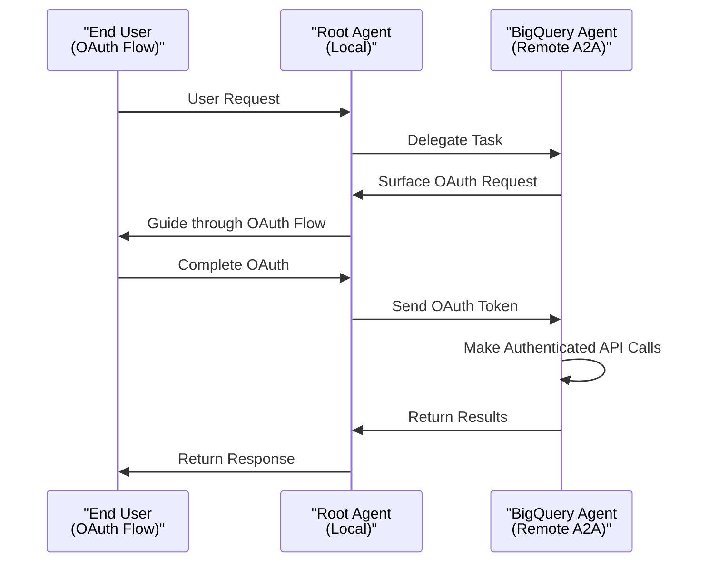
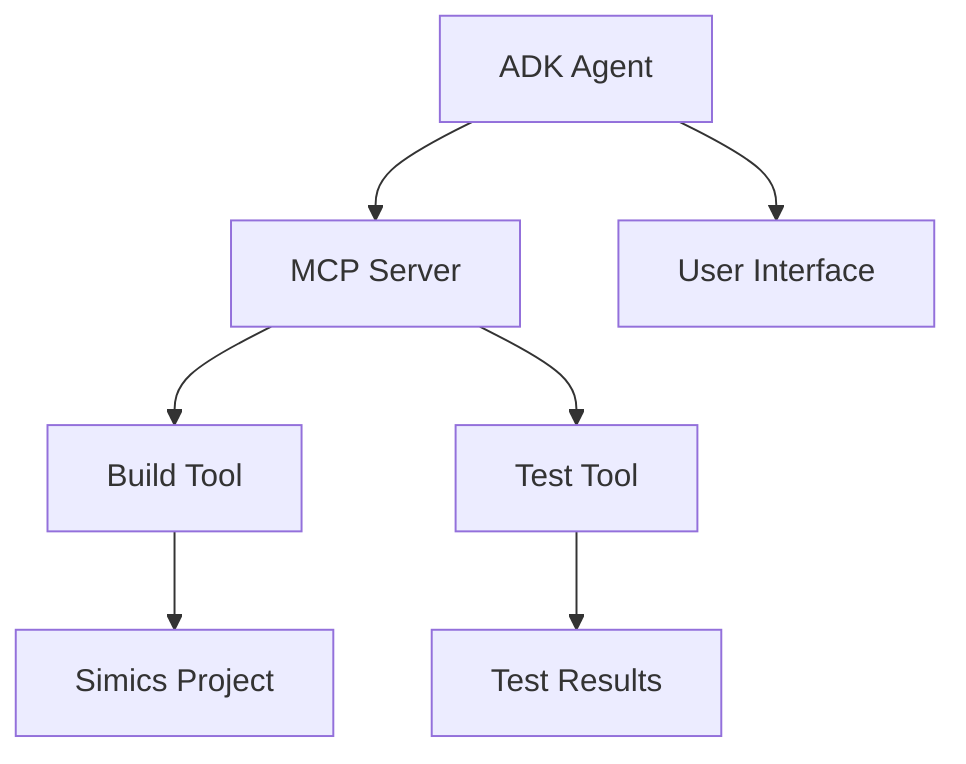

# Integration Examples

<cite>
**Referenced Files in This Document**   
- [AGENT_OS_INTEGRATION.md](file://contributing/samples/agent_os_integration/AGENT_OS_INTEGRATION.md)
- [root_agent.yaml](file://contributing/samples/agent_os_integration/yaml_agent/root_agent.yaml)
- [agent_os_agent.py](file://contributing/samples/agent_os_integration/python/agent_os_agent.py)
- [simics_integration/agent.py](file://contributing/samples/simics_integration/agent.py)
- [a2a_auth/agent.py](file://contributing/samples/a2a_auth/agent.py)
- [spec_kit_integration/agent.py](file://contributing/samples/spec_kit_integration/agent.py)
- [mcp_sse_agent/agent.py](file://contributing/samples/mcp_sse_agent/agent.py)
- [powers/openspec-apply/POWER.md](file://powers/openspec-apply/POWER.md)
- [powers/openspec-apply/mcp.json](file://powers/openspec-apply/mcp.json)
- [openspec-scripts/AGENTS.md](file://openspec-scripts/AGENTS.md)
</cite>

## Table of Contents
1. [AgentOS Integration](#agentos-integration)
2. [Simics Integration](#simics-integration)
3. [A2A Protocol Usage](#a2a-protocol-usage)
4. [MCP Integration](#mcp-integration)
5. [System-Level Integrations](#system-level-integrations)
6. [Common Issues and Error Handling](#common-issues-and-error-handling)

## AgentOS Integration

The ADK framework provides comprehensive integration with AgentOS, enabling structured, specification-driven development workflows. This integration supports both YAML-based and Python-based agent configurations, allowing developers to define complex agent workflows for product planning, specification creation, task execution, and code analysis.

AgentOS integration is implemented through specialized agents that follow AgentOS workflows and leverage a suite of tools for file operations, system commands, and subagent delegation. The integration includes a main agent that orchestrates workflows and delegates tasks to specialized subagents such as context_fetcher, file_creator, project_manager, git_workflow, test_runner, and date_checker.

Configuration can be done through YAML files or Python code. The YAML configuration provides a declarative approach to defining agent behavior, while the Python implementation offers programmatic control over agent creation and subagent management. Both approaches support the same core capabilities, including spec-driven development, file operations, code quality maintenance, project management, and Git workflow handling.

**Section sources**
- [AGENT_OS_INTEGRATION.md](file://contributing/samples/agent_os_integration/AGENT_OS_INTEGRATION.md)
- [root_agent.yaml](file://contributing/samples/agent_os_integration/yaml_agent/root_agent.yaml)
- [agent_os_agent.py](file://contributing/samples/agent_os_integration/python/agent_os_agent.py)

## Simics Integration

The Simics integration agent enables hardware development within OpenSpec projects by providing specialized capabilities for creating Simics project structures and DML device skeletons. This agent automatically sets up Simics projects, manages DDM XML and hardware specifications, and integrates with the Simics MCP server for hardware simulation.

The integration is designed to work with the spec_kit_integration sample and requires the Simics MCP server to be running. The agent uses environment variables to configure its behavior, including DDM_XML for the DDM XML file path, SPEC_FILE for the specification file path, DEVICE_NAME for the device name, and MCP_PORT for the Simics MCP server port.

Key capabilities include project setup, device development, and hardware specification processing. The agent can create complete Simics project structures, generate DML device skeletons, set up build configurations, and initialize development environments. It also provides guidance on implementing registers defined in DDM XML specifications and generates documentation from hardware specifications.

```mermaid
graph TD
A[DDM XML<br/>Spec Files] --> B[Simics Agent<br/>(ADK)]
B --> C[Simics MCP<br/>Server]
B --> D[User<br/>Interaction]
C --> E[Simics Project<br/>& DML Files]
```

**Diagram sources**
- [simics_integration/agent.py](file://contributing/samples/simics_integration/agent.py)
- [spec_kit_integration/agent.py](file://contributing/samples/spec_kit_integration/agent.py)

**Section sources**
- [simics_integration/agent.py](file://contributing/samples/simics_integration/agent.py)
- [spec_kit_integration/agent.py](file://contributing/samples/spec_kit_integration/agent.py)

## A2A Protocol Usage

The Agent-to-Agent (A2A) protocol enables secure remote agent communication with authentication and callback mechanisms. This protocol is demonstrated in the A2A OAuth Authentication sample, which implements a multi-agent system where a remote agent can surface OAuth authentication requests to a local agent.

The architecture consists of a root agent that orchestrates user requests and delegates tasks to specialized agents, including a YouTube search agent for local operations and a BigQuery agent for remote A2A operations. The OAuth authentication workflow allows the remote BigQuery agent to surface authentication requests to the root agent, which guides the end user through the OAuth flow before returning authentication credentials to the remote agent for API access.

The implementation uses a RemoteA2aAgent class to connect to remote agents via A2A protocol. The agent card JSON file contains the RPC endpoint URL where the remote agent is deployed. When deploying to different environments, the URL in the agent card must be updated to point to the actual deployment location.



**Diagram sources**
- [a2a_auth/agent.py](file://contributing/samples/a2a_auth/agent.py)

**Section sources**
- [a2a_auth/agent.py](file://contributing/samples/a2a_auth/agent.py)
- [a2a_auth/README.md](file://contributing/samples/a2a_auth/README.md)

## MCP Integration

Model Context Protocol (MCP) integrations enable ADK agents to interact with external tools and services through standardized interfaces. The powers/ directory contains examples of specialized agents configured for specific MCP integrations, such as the openspec-apply power for Simics DML device implementation.

The openspec-apply power provides a complete OpenSpec apply workflow for Simics DML device implementation, including domain knowledge and build/test tools. It uses MCP tools like build_simics_project and run_simics_test to build and test DML code. The integration requires the openspec-memories/ directory for DML and test documentation.

MCP servers are configured through mcp.json files that specify transport type, URL, and auto-approval settings. For example, the simics-sse-server uses SSE transport at http://localhost:8056/sse and auto-approves build_simics_project and run_simics_test tools. The agent uses absolute paths for all Simics MCP tools to ensure compatibility with the SSE transport server's process context.



**Diagram sources**
- [powers/openspec-apply/POWER.md](file://powers/openspec-apply/POWER.md)
- [powers/openspec-apply/mcp.json](file://powers/openspec-apply/mcp.json)

**Section sources**
- [powers/openspec-apply/POWER.md](file://powers/openspec-apply/POWER.md)
- [powers/openspec-apply/mcp.json](file://powers/openspec-apply/mcp.json)

## System-Level Integrations

System-level integrations are demonstrated through scripts in the openspec-scripts/ directory, which provide end-to-end workflows for various development scenarios. These scripts automate complex workflows by combining multiple tools and agents to achieve specific outcomes.

The AGENTS.md document provides comprehensive instructions for AI coding assistants using OpenSpec for spec-driven development. It outlines a three-stage workflow: creating changes, implementing changes, and archiving changes. The document includes detailed guidance on directory structure, command usage, and best practices for specification-driven development.

Key scripts include run_openspec.sh for executing OpenSpec workflows, run-kiro.sh for Kiro agent operations, and run-rovodev.sh for RovoDev agent operations. These scripts handle environment setup, agent execution, and result processing, providing a seamless interface between the user and the underlying agent system.

The integration examples demonstrate how to combine multiple agents and tools to create sophisticated development workflows. For example, the spec_kit_integration agent uses a combination of basic file operations, bash commands, and Simics MCP tools to implement a complete specification-driven development process.

**Section sources**
- [openspec-scripts/AGENTS.md](file://openspec-scripts/AGENTS.md)

## Common Issues and Error Handling

Common issues in distributed agent environments include authentication token management, cross-system data formatting, and error handling in distributed environments. The ADK framework provides mechanisms to address these challenges through standardized protocols and error handling strategies.

For authentication token management, the A2A protocol handles OAuth token exchange between agents securely. The root agent guides the user through the OAuth flow and securely transfers the token to the remote agent. Token refresh and expiration handling can be implemented by extending the sample.

Cross-system data formatting issues are addressed through standardized data models and protocol buffers. The MCP protocol ensures consistent data formatting between agents and external tools. When integrating with external systems, data transformation functions can be used to convert between different data formats.

Error handling in distributed environments is implemented through comprehensive logging, error reporting, and recovery mechanisms. Agents are designed to handle connection issues, authentication failures, and tool execution errors gracefully. The framework provides debugging tools and logging capabilities to help diagnose and resolve issues.

Specific troubleshooting guidance is provided for each integration:
- For MCP server issues, ensure the server is running and the port configuration is correct
- For file not found errors, verify paths and file permissions
- For tool execution failures, check tool availability and configuration
- For authentication issues, verify credentials and OAuth configuration

**Section sources**
- [a2a_auth/README.md](file://contributing/samples/a2a_auth/README.md)
- [simics_integration/README.md](file://contributing/samples/simics_integration/README.md)
- [spec_kit_integration/README.md](file://contributing/samples/spec_kit_integration/README.md)