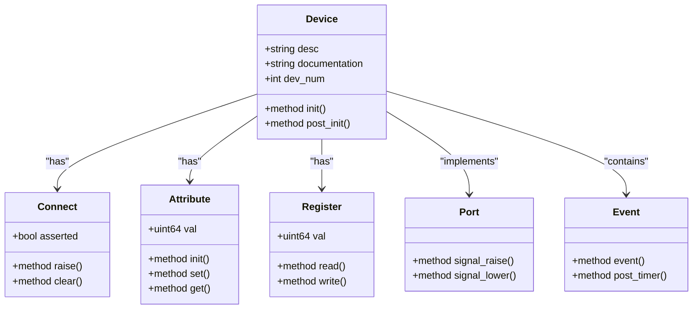
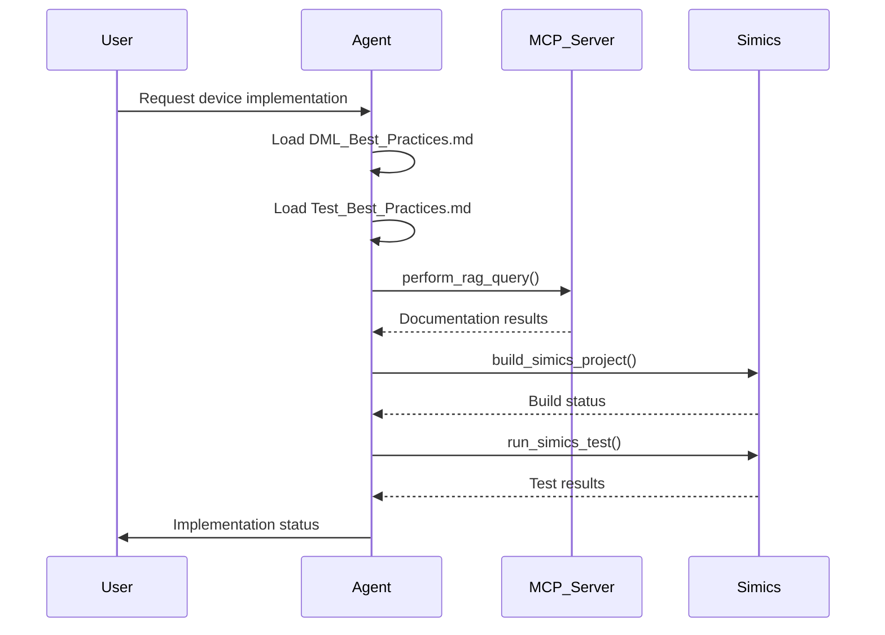
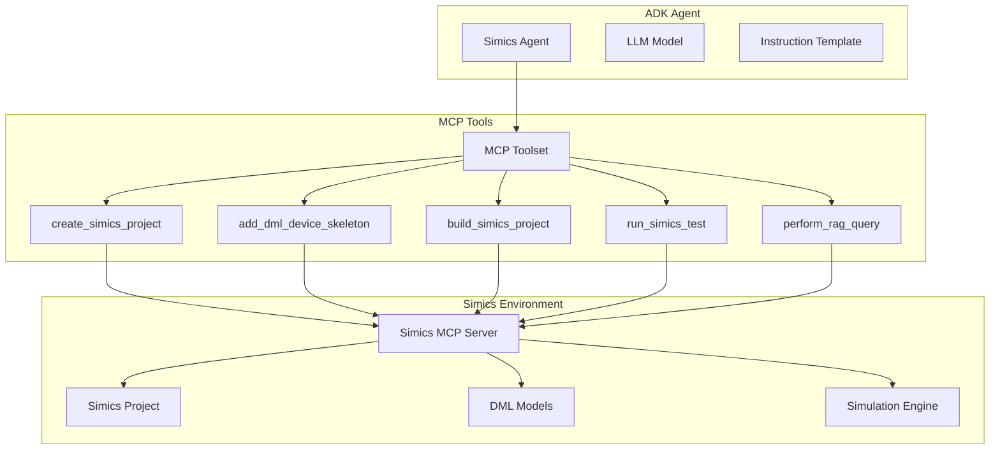

# Simics Integration

<cite>
**Referenced Files in This Document**   
- [agent.py](file://simics_agent/agent.py)
- [sample-device.dml](file://simics_agent/sample-device.dml)
- [instructions.md](file://simics_agent/instructions.md)
- [simics_concepts.md](file://simics_agent/simics_concepts.md)
- [simics_test.md](file://simics_agent/simics_test.md)
- [spec_kit_tools.py](file://contributing/samples/spec_kit_integration/spec_kit_tools.py)
- [simics_mcp_tools.py](file://contributing/samples/openspec_integration/simics_mcp_tools.py)
</cite>

## Table of Contents
1. [Introduction](#introduction)
2. [Simics Agent Implementation](#simics-agent-implementation)
3. [DML Model Integration](#dml-model-integration)
4. [POWER Configuration and openspec Commands](#power-configuration-and-openspec-commands)
5. [Simulation State Management](#simulation-state-management)
6. [Common Issues and Error Recovery](#common-issues-and-error-recovery)
7. [Integration with Core Components](#integration-with-core-components)
8. [Conclusion](#conclusion)

## Introduction
The Simics Integration framework enables ADK agents to connect with Simics simulation environments for hardware modeling and verification tasks. This document details the implementation of the Simics agent in agent.py, its interaction with DML models, and how it handles simulation-specific commands within the ADK ecosystem. The integration leverages MCP tools to interface with Simics workflows, allowing agents to perform device modeling, build projects, run tests, and query documentation programmatically. The system is designed to support autonomous hardware development workflows, from specification to implementation and validation, using a combination of AI-driven agents and Simics simulation capabilities.

## Simics Agent Implementation

The Simics agent implementation in agent.py establishes a connection between the ADK framework and Simics simulation environments through MCP (Model Control Protocol) tools. The agent is built on the LlmAgent class and uses LiteLLM as its language model interface. It initializes with environment variables for the LLM configuration (LITELLM_BASE_URL, LITELLM_API_KEY, LITELLM_MODEL) and loads instructions from external markdown files that provide context for Simics development.

The agent's core functionality is enabled through the create_simics_mcp_toolset function, which establishes an SSE (Server-Sent Events) connection to the Simics MCP server on port 8051 (configurable via MCP_PORT environment variable). This toolset exposes a filtered set of Simics capabilities, including project management tools (list_installed_packages, list_simics_platforms, get_simics_version), device modeling tools (create_simics_project, add_dml_device_skeleton, build_simics_project), and RAG (Retrieval-Augmented Generation) query tools for documentation search.

The agent's instruction template is dynamically populated with content from simics_concepts.md, sample-device.dml, and simics_test.md, providing the LLM with comprehensive context about Simics concepts, DML syntax, and test patterns. This approach ensures the agent has immediate access to domain-specific knowledge without requiring external lookups for basic information.

**Section sources**
- [agent.py](file://simics_agent/agent.py#L30-L77)
- [agent.py](file://simics_agent/agent.py#L80-L152)
- [instructions.md](file://simics_agent/instructions.md#L1-L93)

## DML Model Integration

### DML Syntax and Device Modeling
Device modeling in Simics is implemented using DML (Device Modeling Language) 1.4, as demonstrated in the sample-device.dml file. The DML code structure follows a hierarchical pattern with device declarations, parameter definitions, imports, templates, and component implementations. Key elements include:

- **Device Declaration**: The `device dev_tpl;` statement defines the device name
- **Parameters**: Configurable attributes like `param desc` and `param documentation` provide metadata
- **Imports**: External modules like `simics/devs/signal.dml` are imported for interface definitions
- **Templates**: Reusable code patterns like `is sreset;` for reset functionality
- **Connects**: Interface connections for inter-device communication
- **Attributes**: State variables with getter/setter methods
- **Registers**: Memory-mapped I/O components with read/write implementations
- **Ports**: Interface implementations for external communication
- **Events**: Asynchronous operations for timing and deferred execution

The DML implementation emphasizes software-visible behaviors while abstracting internal timing details. The agent follows guidelines to implement all registers completely, using dummy or unimplemented templates for registers not functionally needed. Register implementations include proper read and write methods with logging for debugging purposes.



**Diagram sources**
- [sample-device.dml](file://simics_agent/sample-device.dml#L1-L206)

### Device Modeling Workflow
The agent follows a structured workflow for device modeling as outlined in the instructions.md file:

1. **Planning**: Create a plan.md file detailing all device specifications, workflows, and user stories
2. **Project Setup**: Create a Simics project using the create_simics_project tool
3. **Skeleton Creation**: Generate a DML device skeleton using add_dml_device_skeleton
4. **Implementation**: Write DML code with proper register implementations and state management
5. **Testing**: Develop Python test cases to validate device behavior
6. **Validation**: Compare test plans with actual tests to ensure coverage

The agent uses RAG (Retrieval-Augmented Generation) tools to search for device examples and documentation when implementing complex features. It can query specific sources like DML documentation, Python API references, or source code to gather implementation details.

**Section sources**
- [sample-device.dml](file://simics_agent/sample-device.dml#L1-L206)
- [instructions.md](file://simics_agent/instructions.md#L16-L47)
- [simics_concepts.md](file://simics_agent/simics_concepts.md#L1-L78)

## POWER Configuration and openspec Commands

### POWER Configuration Structure
The POWER configurations in the powers/ directory enable openspec commands within Simics workflows by providing standardized execution environments. Each POWER configuration contains:

- **POWER.md**: Documentation describing the configuration's purpose and usage
- **README.txt**: Brief overview and setup instructions
- **mcp.json**: MCP server configuration for tool exposure

These configurations are specifically designed to support different phases of the OpenSpec workflow:
- **openspec-apply**: For applying specifications and implementing device models
- **openspec-generate-proposal-prompt**: For generating proposal prompts
- **openspec-improve-apply**: For improving applied specifications
- **openspec-improve-propose**: For improving proposed specifications
- **openspec-propose**: For proposing new specifications
- **openspec-propose-multiple-spec-deltas**: For handling multiple specification deltas

### openspec Command Integration
The openspec commands are integrated into the Simics workflow through the MCP toolset, allowing the agent to execute phase-based operations autonomously. The workflow follows a three-phase pattern:

1. **Proposal Phase**: The agent analyzes specifications, creates proposal.md, tasks.md, and design.md files, and validates the proposal
2. **Apply Phase**: The agent implements the solution following TDD principles, building and testing the device model
3. **Archive Phase**: The agent archives completed changes and updates specifications

The agent uses the perform_rag_query tool with specific source_type parameters to search documentation during implementation:
- `source_type="dml"`: Search Simics DML documentation
- `source_type="python"`: Search Simics Python API documentation
- `source_type="docs"`: Search Simics documentation
- `source_type="source"`: Search both DML and Python sources
- `source_type="all"`: Search all available sources



**Diagram sources**
- [powers](file://powers)
- [simics_mcp_tools.py](file://contributing/samples/openspec_integration/simics_mcp_tools.py#L119-L142)

**Section sources**
- [powers](file://powers)
- [simics_mcp_tools.py](file://contributing/samples/openspec_integration/simics_mcp_tools.py#L51-L145)

## Simulation State Management

### State Management Principles
Simulation state management in Simics follows checkpoint-safe principles where all internal states must be exposed as attributes for proper saving and restoration. The agent implements state management through:

- **Session Variables**: Using DML session variables for temporary state storage
- **Saved Variables**: Persistent state that survives simulation restarts
- **Attributes**: Configuration state exposed as attributes for checkpointing
- **Events**: Asynchronous operations that maintain state across simulation time

The agent adheres to best practices for state management by ensuring all critical state is checkpoint-safe and can be properly restored. This is particularly important for devices with timers, counters, or other time-dependent behavior.

### Implementation Patterns
The sample-device.dml demonstrates several state management patterns:

- **Register State**: Register values are stored in the regs bank and managed through read/write methods
- **Attribute State**: Device-specific state like frequency is stored in attributes with proper initialization
- **Event State**: Timer events maintain state through the event mechanism and post/delta scheduling
- **Connection State**: Signal connections track assertion state in saved boolean variables

The agent follows the principle of lazy evaluation for timing-sensitive components, avoiding cycle-accurate updates that would cause performance issues. Instead, it uses event-based timing where operations are scheduled to occur at specific future times.

```mermaid
flowchart TD
A[Device Creation] --> B[init() Method]
B --> C[Set Reset State]
C --> D[post_init() Method]
D --> E[Establish Connections]
E --> F[Simulation Running]
F --> G{Event Triggered?}
G --> |Yes| H[Execute Event Handler]
G --> |No| I[Process Register Access]
H --> J[Update Device State]
I --> K[Return Register Value]
J --> F
K --> F
```

**Diagram sources**
- [sample-device.dml](file://simics_agent/sample-device.dml#L188-L206)
- [simics_concepts.md](file://simics_agent/simics_concepts.md#L74-L75)

**Section sources**
- [sample-device.dml](file://simics_agent/sample-device.dml#L188-L206)
- [simics_concepts.md](file://simics_agent/simics_concepts.md#L74-L75)

## Common Issues and Error Recovery

### Simulation Synchronization
Simulation synchronization issues commonly arise from improper event handling and timing assumptions. The agent addresses these by:

- Using lazy events that trigger only when externally visible changes occur
- Avoiding posting events every tick/cycle due to performance implications
- Properly managing event cancellation and re-scheduling
- Using appropriate time quantums for different clock domains

The agent follows the principle that events should only be posted when necessary to notify the external world of state changes, rather than for internal bookkeeping.

### Command Timing Constraints
Command timing constraints are managed through proper event scheduling and clock management. The agent ensures that:

- Events are scheduled with appropriate delta values in cycles or seconds
- Clock objects are properly assigned to devices that don't connect to existing queues
- Time-based operations use the correct clock domain
- Simulation time advances are coordinated across related components

When timing issues occur, the agent uses the SIM_continue() method to advance simulation time and validate timing behavior through test cases.

### Error Recovery in Virtualized Environments
The agent implements robust error recovery mechanisms for virtualized environments:

- **Build Failures**: The agent uses build_simics_project with proper error reporting and retries after fixing syntax issues
- **Test Failures**: Test results are analyzed, and the agent uses debugging logs to identify root causes
- **Connection Issues**: MCP server connections are retried with appropriate timeouts
- **State Corruption**: Checkpoint/restore mechanisms are used to recover from invalid states

The agent follows a systematic error recovery process:
1. Identify the error type from logs and error messages
2. Use RAG tools to search for relevant documentation and examples
3. Apply fixes and re-run the failing operation
4. Validate the fix through testing
5. Document the resolution for future reference

**Section sources**
- [instructions.md](file://simics_agent/instructions.md#L48-L51)
- [simics_test.md](file://simics_agent/simics_test.md#L602-L606)
- [simics_concepts.md](file://simics_agent/simics_concepts.md#L74-L75)

## Integration with Core Components

### A2A Protocol for Remote Simulation Control
The Simics agent integrates with the A2A (Agent-to-Agent) protocol for remote simulation control, enabling distributed workflows where agents can coordinate simulation tasks. The A2A protocol allows:

- Remote execution of simulation commands
- Distributed test execution across multiple environments
- Coordinated device modeling across different simulation instances
- Shared state management between collaborating agents

This integration enables complex workflows where multiple agents can work on different aspects of a simulation project simultaneously, with proper synchronization and state management.

### Tool System for Simulation Command Execution
The tool system provides a structured approach to simulation command execution through the MCP toolset. The agent uses a filtered set of tools appropriate for each workflow phase:

- **Project Setup Phase**: create_simics_project, add_dml_device_skeleton
- **Implementation Phase**: build_simics_project, run_simics_test, perform_rag_query
- **Validation Phase**: list_installed_packages, get_simics_version, list_simics_platforms

The tool system follows a consistent pattern where each tool is exposed through the MCP server and called with specific parameters. The agent handles tool execution results, including success status, output, and error messages, to make decisions about subsequent actions.

The integration with the spec_kit_integration tools provides additional capabilities for specification-driven development, allowing the agent to follow structured workflows for device modeling and validation.



**Diagram sources**
- [spec_kit_tools.py](file://contributing/samples/spec_kit_integration/spec_kit_tools.py#L98-L727)
- [simics_mcp_tools.py](file://contributing/samples/openspec_integration/simics_mcp_tools.py#L51-L145)

**Section sources**
- [spec_kit_tools.py](file://contributing/samples/spec_kit_integration/spec_kit_tools.py#L98-L727)
- [simics_mcp_tools.py](file://contributing/samples/openspec_integration/simics_mcp_tools.py#L51-L145)

## Conclusion
The Simics Integration framework provides a comprehensive solution for connecting ADK agents with Simics simulation environments. By leveraging MCP tools, POWER configurations, and structured workflows, the agent can autonomously handle device modeling tasks from specification to implementation and validation. The integration with DML models, openspec commands, and core components like the A2A protocol enables sophisticated hardware development workflows that combine AI-driven automation with precise simulation control. The system addresses common challenges in virtualized environments through robust error recovery mechanisms and proper state management, ensuring reliable and efficient simulation workflows.