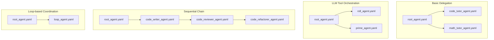
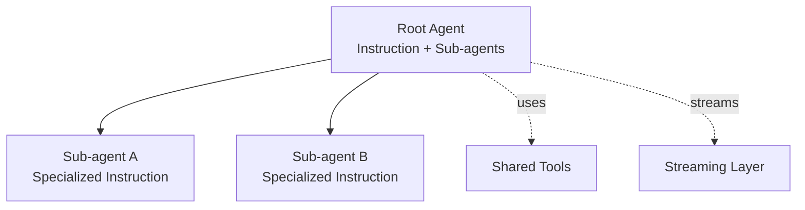
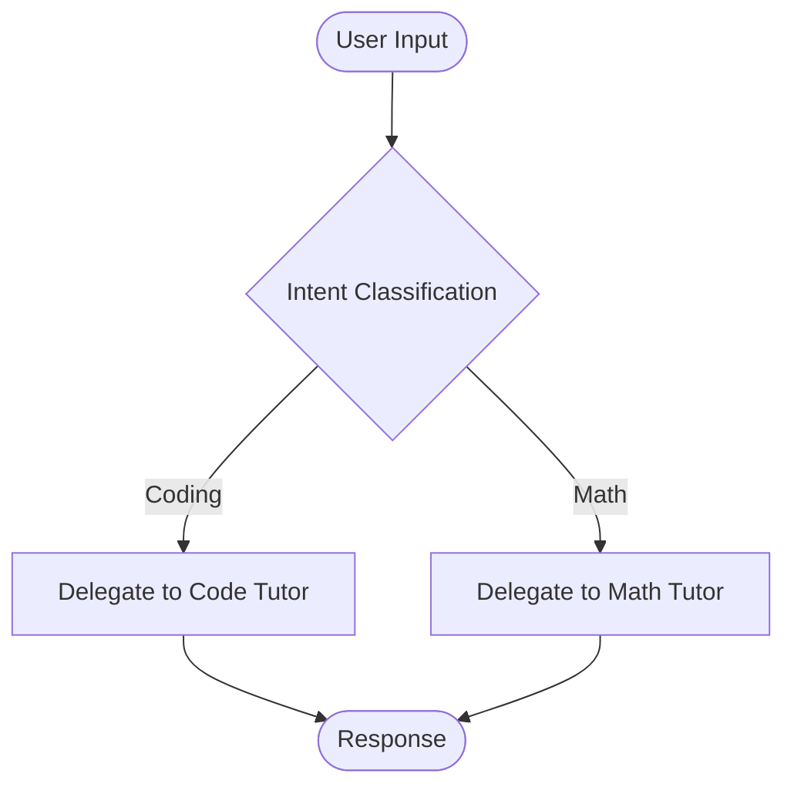
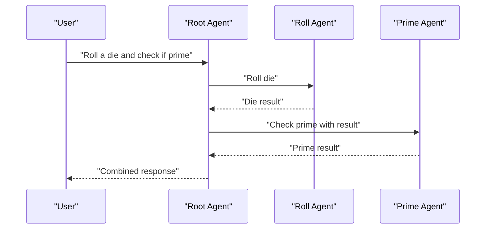
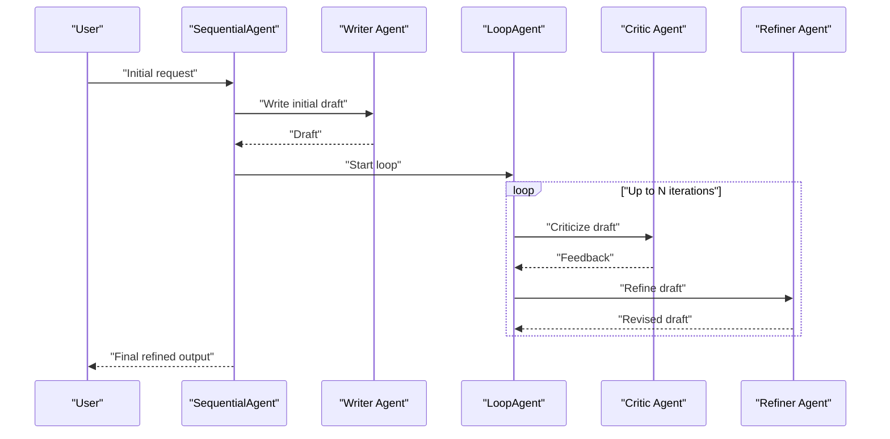
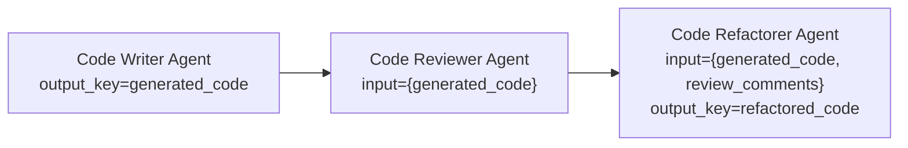
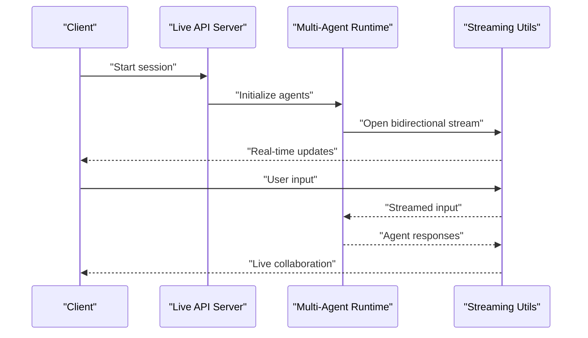
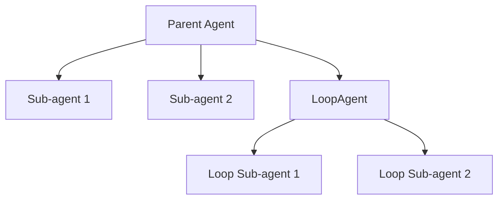
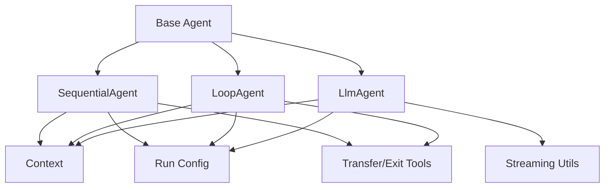

# Multi-Agent Patterns

<cite>
**Referenced Files in This Document**
- [root_agent.yaml](file://contributing/samples/multi_agent_basic_config/root_agent.yaml)
- [code_tutor_agent.yaml](file://contributing/samples/multi_agent_basic_config/code_tutor_agent.yaml)
- [math_tutor_agent.yaml](file://contributing/samples/multi_agent_basic_config/math_tutor_agent.yaml)
- [root_agent.yaml](file://contributing/samples/multi_agent_llm_config/root_agent.yaml)
- [roll_agent.yaml](file://contributing/samples/multi_agent_llm_config/roll_agent.yaml)
- [prime_agent.yaml](file://contributing/samples/multi_agent_llm_config/prime_agent.yaml)
- [root_agent.yaml](file://contributing/samples/multi_agent_loop_config/root_agent.yaml)
- [loop_agent.yaml](file://contributing/samples/multi_agent_loop_config/loop_agent.yaml)
- [root_agent.yaml](file://contributing/samples/multi_agent_seq_config/root_agent.yaml)
- [code_writer_agent.yaml](file://contributing/samples/multi_agent_seq_config/sub_agents/code_writer_agent.yaml)
- [code_reviewer_agent.yaml](file://contributing/samples/multi_agent_seq_config/sub_agents/code_reviewer_agent.yaml)
- [code_refactorer_agent.yaml](file://contributing/samples/multi_agent_seq_config/sub_agents/code_refactorer_agent.yaml)
- [live_bidi_streaming_multi_agent/readme.md](file://contributing/samples/live_bidi_streaming_multi_agent/readme.md)
- [live_bidi_streaming_multi_agent/agent.py](file://contributing/samples/live_bidi_streaming_multi_agent/agent.py)
- [live_bidi_streaming_single_agent/readme.md](file://contributing/samples/live_bidi_streaming_single_agent/readme.md)
- [live_bidi_streaming_single_agent/agent.py](file://contributing/samples/live_bidi_streaming_single_agent/agent.py)
- [live_bidi_streaming_tools_agent/readme.md](file://contributing/samples/live_bidi_streaming_tools_agent/readme.md)
- [live_bidi_streaming_tools_agent/agent.py](file://contributing/samples/live_bidi_streaming_tools_agent/agent.py)
- [live_agent_api_server_example/readme.md](file://contributing/samples/live_agent_api_server_example/readme.md)
- [live_agent_api_server_example/live_agent_example.py](file://contributing/samples/live_agent_api_server_example/live_agent_example.py)
- [live_bidi_debug_utils/pcm_audio_player.py](file://contributing/samples/live_bidi_debug_utils/pcm_audio_player.py)
- [src/google/adk/agents/sequential_agent.py](file://src/google/adk/agents/sequential_agent.py)
- [src/google/adk/agents/loop_agent.py](file://src/google/adk/agents/loop_agent.py)
- [src/google/adk/agents/llm_agent.py](file://src/google/adk/agents/llm_agent.py)
- [src/google/adk/agents/base_agent.py](file://src/google/adk/agents/base_agent.py)
- [src/google/adk/agents/sequential_agent_config.py](file://src/google/adk/agents/sequential_agent_config.py)
- [src/google/adk/agents/loop_agent_config.py](file://src/google/adk/agents/loop_agent_config.py)
- [src/google/adk/agents/llm_agent_config.py](file://src/google/adk/agents/llm_agent_config.py)
- [src/google/adk/agents/context.py](file://src/google/adk/agents/context.py)
- [src/google/adk/agents/run_config.py](file://src/google/adk/agents/run_config.py)
- [src/google/adk/tools/transfer_to_agent_tool.py](file://src/google/adk/tools/transfer_to_agent_tool.py)
- [src/google/adk/tools/exit_loop_tool.py](file://src/google/adk/tools/exit_loop_tool.py)
- [src/google/adk/utils/streaming_utils.py](file://src/google/adk/utils/streaming_utils.py)
- [src/google/adk/errors/tool_execution_error.py](file://src/google/adk/errors/tool_execution_error.py)
- [src/google/adk/errors/input_validation_error.py](file://src/google/adk/errors/input_validation_error.py)
- [src/google/adk/errors/session_not_found_error.py](file://src/google/adk/errors/session_not_found_error.py)
</cite>

## Table of Contents
1. [Introduction](#introduction)
2. [Project Structure](#project-structure)
3. [Core Components](#core-components)
4. [Architecture Overview](#architecture-overview)
5. [Detailed Component Analysis](#detailed-component-analysis)
6. [Dependency Analysis](#dependency-analysis)
7. [Performance Considerations](#performance-considerations)
8. [Troubleshooting Guide](#troubleshooting-guide)
9. [Conclusion](#conclusion)
10. [Appendices](#appendices)

## Introduction
This document explains multi-agent patterns and orchestration examples available in the repository. It covers:
- Basic multi-agent configurations with parent-child delegation
- LLM-specific multi-agent setups with tool-enabled sub-agents
- Loop-based agent coordination for iterative refinement
- Sequential agent chains for linear workflows
- Live bidirectional streaming multi-agent example for real-time collaboration
- Sub-agent patterns and hierarchical agent architectures
- Configuration examples for parent-child relationships, inter-agent communication, and state sharing
- Performance considerations, error propagation, and debugging guidance
- Practical advice for selecting patterns per use case

## Project Structure
The multi-agent samples are organized under contributing/samples, grouped by pattern:
- multi_agent_basic_config: Parent delegates to two sub-agents
- multi_agent_llm_config: Parent delegates and orchestrates tool calls across sub-agents
- multi_agent_loop_config: Iterative loop with a critic and refiner
- multi_agent_seq_config: Linear chain of specialized agents
- live_bidi_streaming_*: Real-time collaborative streaming examples
- live_agent_api_server_example: Live API server example

**Diagram sources**
- [root_agent.yaml](file://contributing/samples/multi_agent_basic_config/root_agent.yaml#L1-L18)
- [code_tutor_agent.yaml](file://contributing/samples/multi_agent_basic_config/code_tutor_agent.yaml#L1-L16)
- [math_tutor_agent.yaml](file://contributing/samples/multi_agent_basic_config/math_tutor_agent.yaml#L1-L16)
- [root_agent.yaml](file://contributing/samples/multi_agent_llm_config/root_agent.yaml#L1-L27)
- [roll_agent.yaml](file://contributing/samples/multi_agent_llm_config/roll_agent.yaml#L1-L12)
- [prime_agent.yaml](file://contributing/samples/multi_agent_llm_config/prime_agent.yaml#L1-L13)
- [root_agent.yaml](file://contributing/samples/multi_agent_seq_config/root_agent.yaml#L1-L9)
- [code_writer_agent.yaml](file://contributing/samples/multi_agent_seq_config/sub_agents/code_writer_agent.yaml#L1-L12)
- [code_reviewer_agent.yaml](file://contributing/samples/multi_agent_seq_config/sub_agents/code_reviewer_agent.yaml#L1-L27)
- [code_refactorer_agent.yaml](file://contributing/samples/multi_agent_seq_config/sub_agents/code_refactorer_agent.yaml#L1-L27)
- [root_agent.yaml](file://contributing/samples/multi_agent_loop_config/root_agent.yaml#L1-L8)
- [loop_agent.yaml](file://contributing/samples/multi_agent_loop_config/loop_agent.yaml#L1-L9)

**Section sources**
- [root_agent.yaml](file://contributing/samples/multi_agent_basic_config/root_agent.yaml#L1-L18)
- [root_agent.yaml](file://contributing/samples/multi_agent_llm_config/root_agent.yaml#L1-L27)
- [root_agent.yaml](file://contributing/samples/multi_agent_loop_config/root_agent.yaml#L1-L8)
- [root_agent.yaml](file://contributing/samples/multi_agent_seq_config/root_agent.yaml#L1-L9)

## Core Components
- Root agent orchestrator: Defines high-level instructions and lists sub-agents. It can also define shared tools and generation configs.
- Sub-agents: Specialized agents with focused instructions and optional tools.
- SequentialAgent: Executes sub-agents in order, passing outputs via keys.
- LoopAgent: Iteratively runs sub-agents up to a configured limit, enabling refinement loops.
- LlmAgent: General-purpose agent leveraging LLMs with configurable models and safety settings.
- Streaming utilities: Support live, bidirectional streaming for real-time collaboration.

Key configuration fields:
- agent_class: Selects the agent type (e.g., LlmAgent, SequentialAgent, LoopAgent)
- name, description, instruction: Agent identity and behavior definition
- sub_agents: List of child agent configurations
- tools: Optional tool declarations for LLM-based agents
- output_key: Used in sequential chains to propagate intermediate results
- max_iterations: Controls loop iterations for LoopAgent

**Section sources**
- [root_agent.yaml](file://contributing/samples/multi_agent_basic_config/root_agent.yaml#L1-L18)
- [code_tutor_agent.yaml](file://contributing/samples/multi_agent_basic_config/code_tutor_agent.yaml#L1-L16)
- [math_tutor_agent.yaml](file://contributing/samples/multi_agent_basic_config/math_tutor_agent.yaml#L1-L16)
- [root_agent.yaml](file://contributing/samples/multi_agent_llm_config/root_agent.yaml#L1-L27)
- [roll_agent.yaml](file://contributing/samples/multi_agent_llm_config/roll_agent.yaml#L1-L12)
- [prime_agent.yaml](file://contributing/samples/multi_agent_llm_config/prime_agent.yaml#L1-L13)
- [root_agent.yaml](file://contributing/samples/multi_agent_loop_config/root_agent.yaml#L1-L8)
- [loop_agent.yaml](file://contributing/samples/multi_agent_loop_config/loop_agent.yaml#L1-L9)
- [root_agent.yaml](file://contributing/samples/multi_agent_seq_config/root_agent.yaml#L1-L9)
- [code_writer_agent.yaml](file://contributing/samples/multi_agent_seq_config/sub_agents/code_writer_agent.yaml#L1-L12)
- [code_reviewer_agent.yaml](file://contributing/samples/multi_agent_seq_config/sub_agents/code_reviewer_agent.yaml#L1-L27)
- [code_refactorer_agent.yaml](file://contributing/samples/multi_agent_seq_config/sub_agents/code_refactorer_agent.yaml#L1-L27)

## Architecture Overview
The multi-agent runtime composes a root agent that delegates to sub-agents. The root coordinates:
- Conditional delegation based on intent
- Tool invocation across sub-agents
- Iterative refinement via LoopAgent
- Ordered execution via SequentialAgent

[No sources needed since this diagram shows conceptual workflow, not actual code structure]

## Detailed Component Analysis

### Basic Multi-Agent Configuration (Parent-Child Delegation)
This pattern demonstrates a root agent delegating to two sub-agents based on user intent. The root defines high-level instructions and lists sub-agents. Sub-agents focus on distinct domains.

**Diagram sources**
- [root_agent.yaml](file://contributing/samples/multi_agent_basic_config/root_agent.yaml#L6-L17)
- [code_tutor_agent.yaml](file://contributing/samples/multi_agent_basic_config/code_tutor_agent.yaml#L5-L15)
- [math_tutor_agent.yaml](file://contributing/samples/multi_agent_basic_config/math_tutor_agent.yaml#L5-L15)

Configuration highlights:
- Root agent lists sub-agents via config_path entries
- Sub-agents define domain-specific instructions
- No explicit tool invocation is required here; delegation is intent-based

**Section sources**
- [root_agent.yaml](file://contributing/samples/multi_agent_basic_config/root_agent.yaml#L1-L18)
- [code_tutor_agent.yaml](file://contributing/samples/multi_agent_basic_config/code_tutor_agent.yaml#L1-L16)
- [math_tutor_agent.yaml](file://contributing/samples/multi_agent_basic_config/math_tutor_agent.yaml#L1-L16)

### LLM-Specific Multi-Agent Setup with Tool Orchestration
This pattern extends the basic setup by adding tools and enabling the root agent to orchestrate tool calls across sub-agents. The root defines shared tools and generation configs, while sub-agents declare their own tools.

**Diagram sources**
- [root_agent.yaml](file://contributing/samples/multi_agent_llm_config/root_agent.yaml#L6-L20)
- [roll_agent.yaml](file://contributing/samples/multi_agent_llm_config/roll_agent.yaml#L6-L11)
- [prime_agent.yaml](file://contributing/samples/multi_agent_llm_config/prime_agent.yaml#L6-L12)

Configuration highlights:
- Root agent declares tools and generation configs
- Sub-agents declare their own tools
- The root orchestrates cross-agent tool calls

**Section sources**
- [root_agent.yaml](file://contributing/samples/multi_agent_llm_config/root_agent.yaml#L1-L27)
- [roll_agent.yaml](file://contributing/samples/multi_agent_llm_config/roll_agent.yaml#L1-L12)
- [prime_agent.yaml](file://contributing/samples/multi_agent_llm_config/prime_agent.yaml#L1-L13)

### Loop-Based Agent Coordination (Iterative Refinement)
This pattern uses a LoopAgent to iteratively refine outputs using a critic and refiner. The SequentialAgent composes the initial writer and the loop.

**Diagram sources**
- [root_agent.yaml](file://contributing/samples/multi_agent_loop_config/root_agent.yaml#L2-L7)
- [loop_agent.yaml](file://contributing/samples/multi_agent_loop_config/loop_agent.yaml#L2-L8)

Configuration highlights:
- SequentialAgent composes writer and loop agents
- LoopAgent sets max_iterations and runs sub-agents in iteration
- Critic and refiner exchange feedback to improve quality

**Section sources**
- [root_agent.yaml](file://contributing/samples/multi_agent_loop_config/root_agent.yaml#L1-L8)
- [loop_agent.yaml](file://contributing/samples/multi_agent_loop_config/loop_agent.yaml#L1-L9)

### Sequential Agent Chains (Linear Workflows)
This pattern executes a fixed sequence of agents, passing intermediate results via output_key. Each agent consumes prior outputs and produces new ones.

**Diagram sources**
- [root_agent.yaml](file://contributing/samples/multi_agent_seq_config/root_agent.yaml#L5-L8)
- [code_writer_agent.yaml](file://contributing/samples/multi_agent_seq_config/sub_agents/code_writer_agent.yaml#L11-L11)
- [code_reviewer_agent.yaml](file://contributing/samples/multi_agent_seq_config/sub_agents/code_reviewer_agent.yaml#L10-L26)
- [code_refactorer_agent.yaml](file://contributing/samples/multi_agent_seq_config/sub_agents/code_refactorer_agent.yaml#L10-L26)

Configuration highlights:
- output_key in upstream agents enables downstream consumption
- Downstream agents reference upstream keys in their instructions
- SequentialAgent ensures ordered execution

**Section sources**
- [root_agent.yaml](file://contributing/samples/multi_agent_seq_config/root_agent.yaml#L1-L9)
- [code_writer_agent.yaml](file://contributing/samples/multi_agent_seq_config/sub_agents/code_writer_agent.yaml#L1-L12)
- [code_reviewer_agent.yaml](file://contributing/samples/multi_agent_seq_config/sub_agents/code_reviewer_agent.yaml#L1-L27)
- [code_refactorer_agent.yaml](file://contributing/samples/multi_agent_seq_config/sub_agents/code_refactorer_agent.yaml#L1-L27)

### Live Bidirectional Streaming Multi-Agent Example
The live streaming examples demonstrate real-time collaboration with audio/video and tool interactions. These samples include:
- Multi-agent streaming
- Single-agent streaming
- Tools-enabled streaming
- Live API server example
- Debug utilities for PCM audio playback

**Diagram sources**
- [live_agent_api_server_example/readme.md](file://contributing/samples/live_agent_api_server_example/readme.md)
- [live_agent_api_server_example/live_agent_example.py](file://contributing/samples/live_agent_api_server_example/live_agent_example.py)
- [live_bidi_streaming_multi_agent/readme.md](file://contributing/samples/live_bidi_streaming_multi_agent/readme.md)
- [live_bidi_streaming_multi_agent/agent.py](file://contributing/samples/live_bidi_streaming_multi_agent/agent.py)
- [live_bidi_streaming_single_agent/readme.md](file://contributing/samples/live_bidi_streaming_single_agent/readme.md)
- [live_bidi_streaming_single_agent/agent.py](file://contributing/samples/live_bidi_streaming_single_agent/agent.py)
- [live_bidi_streaming_tools_agent/readme.md](file://contributing/samples/live_bidi_streaming_tools_agent/readme.md)
- [live_bidi_streaming_tools_agent/agent.py](file://contributing/samples/live_bidi_streaming_tools_agent/agent.py)
- [live_bidi_debug_utils/pcm_audio_player.py](file://contributing/samples/live_bidi_debug_utils/pcm_audio_player.py)
- [src/google/adk/utils/streaming_utils.py](file://src/google/adk/utils/streaming_utils.py)

Configuration highlights:
- Streaming utilities enable low-latency, bidirectional collaboration
- Debug utilities support audio playback for live sessions
- API server example shows how to expose live multi-agent capabilities

**Section sources**
- [live_agent_api_server_example/readme.md](file://contributing/samples/live_agent_api_server_example/readme.md)
- [live_agent_api_server_example/live_agent_example.py](file://contributing/samples/live_agent_api_server_example/live_agent_example.py)
- [live_bidi_streaming_multi_agent/readme.md](file://contributing/samples/live_bidi_streaming_multi_agent/readme.md)
- [live_bidi_streaming_multi_agent/agent.py](file://contributing/samples/live_bidi_streaming_multi_agent/agent.py)
- [live_bidi_streaming_single_agent/readme.md](file://contributing/samples/live_bidi_streaming_single_agent/readme.md)
- [live_bidi_streaming_single_agent/agent.py](file://contributing/samples/live_bidi_streaming_single_agent/agent.py)
- [live_bidi_streaming_tools_agent/readme.md](file://contributing/samples/live_bidi_streaming_tools_agent/readme.md)
- [live_bidi_streaming_tools_agent/agent.py](file://contributing/samples/live_bidi_streaming_tools_agent/agent.py)
- [live_bidi_debug_utils/pcm_audio_player.py](file://contributing/samples/live_bidi_debug_utils/pcm_audio_player.py)
- [src/google/adk/utils/streaming_utils.py](file://src/google/adk/utils/streaming_utils.py)

### Sub-Agent Patterns and Hierarchical Architectures
Hierarchical multi-agent systems can combine:
- Parent agents that orchestrate multiple sub-agents
- LoopAgents nested inside SequentialAgents for iterative refinement
- Tool-enabled sub-agents that communicate via shared tools

[No sources needed since this diagram shows conceptual workflow, not actual code structure]

## Dependency Analysis
The multi-agent runtime depends on:
- Agent base classes and configs (SequentialAgent, LoopAgent, LlmAgent)
- Context management for state sharing across agents
- Tooling for inter-agent communication (transfer and exit tools)
- Streaming utilities for live collaboration

**Diagram sources**
- [src/google/adk/agents/base_agent.py](file://src/google/adk/agents/base_agent.py)
- [src/google/adk/agents/sequential_agent.py](file://src/google/adk/agents/sequential_agent.py)
- [src/google/adk/agents/loop_agent.py](file://src/google/adk/agents/loop_agent.py)
- [src/google/adk/agents/llm_agent.py](file://src/google/adk/agents/llm_agent.py)
- [src/google/adk/agents/context.py](file://src/google/adk/agents/context.py)
- [src/google/adk/agents/run_config.py](file://src/google/adk/agents/run_config.py)
- [src/google/adk/tools/transfer_to_agent_tool.py](file://src/google/adk/tools/transfer_to_agent_tool.py)
- [src/google/adk/tools/exit_loop_tool.py](file://src/google/adk/tools/exit_loop_tool.py)
- [src/google/adk/utils/streaming_utils.py](file://src/google/adk/utils/streaming_utils.py)

**Section sources**
- [src/google/adk/agents/base_agent.py](file://src/google/adk/agents/base_agent.py)
- [src/google/adk/agents/sequential_agent.py](file://src/google/adk/agents/sequential_agent.py)
- [src/google/adk/agents/loop_agent.py](file://src/google/adk/agents/loop_agent.py)
- [src/google/adk/agents/llm_agent.py](file://src/google/adk/agents/llm_agent.py)
- [src/google/adk/agents/context.py](file://src/google/adk/agents/context.py)
- [src/google/adk/agents/run_config.py](file://src/google/adk/agents/run_config.py)
- [src/google/adk/tools/transfer_to_agent_tool.py](file://src/google/adk/tools/transfer_to_agent_tool.py)
- [src/google/adk/tools/exit_loop_tool.py](file://src/google/adk/tools/exit_loop_tool.py)
- [src/google/adk/utils/streaming_utils.py](file://src/google/adk/utils/streaming_utils.py)

## Performance Considerations
- Minimize round-trips: Prefer tool orchestration in the root agent to reduce agent switching overhead
- Control loop iterations: Set max_iterations thoughtfully to balance quality and latency
- Streaming efficiency: Use streaming utilities for real-time collaboration to avoid polling
- Model selection: Choose smaller models for sub-agents when possible to reduce cost and latency
- Output key propagation: Avoid excessive intermediate outputs to reduce context bloat in sequential chains

[No sources needed since this section provides general guidance]

## Troubleshooting Guide
Common issues and remedies:
- Tool execution failures: Inspect tool execution errors and retry policies
- Input validation errors: Ensure prompts and instructions conform to expected schemas
- Session not found: Verify session initialization and persistence
- Streaming interruptions: Confirm streaming utilities are properly initialized and network conditions are stable

**Section sources**
- [src/google/adk/errors/tool_execution_error.py](file://src/google/adk/errors/tool_execution_error.py)
- [src/google/adk/errors/input_validation_error.py](file://src/google/adk/errors/input_validation_error.py)
- [src/google/adk/errors/session_not_found_error.py](file://src/google/adk/errors/session_not_found_error.py)
- [src/google/adk/utils/streaming_utils.py](file://src/google/adk/utils/streaming_utils.py)

## Conclusion
The repository provides robust multi-agent patterns:
- Basic delegation for intent-driven routing
- LLM-centric orchestration with shared tools
- Iterative refinement via LoopAgent within SequentialAgent
- Linear sequential chains with output-key propagation
- Live, bidirectional streaming for real-time collaboration

Select patterns based on use case:
- Intent-based routing: Basic multi-agent configuration
- Tool orchestration: LLM-specific multi-agent setup
- Quality refinement: Loop-based coordination
- Linear workflows: Sequential agent chains
- Real-time collaboration: Live streaming examples

[No sources needed since this section summarizes without analyzing specific files]

## Appendices
- Configuration reference: agent_class, name, description, instruction, sub_agents, tools, output_key, max_iterations
- Inter-agent communication: Shared tools, output_key propagation, transfer/exit tools
- State sharing: Context management and run configuration

[No sources needed since this section provides general guidance]