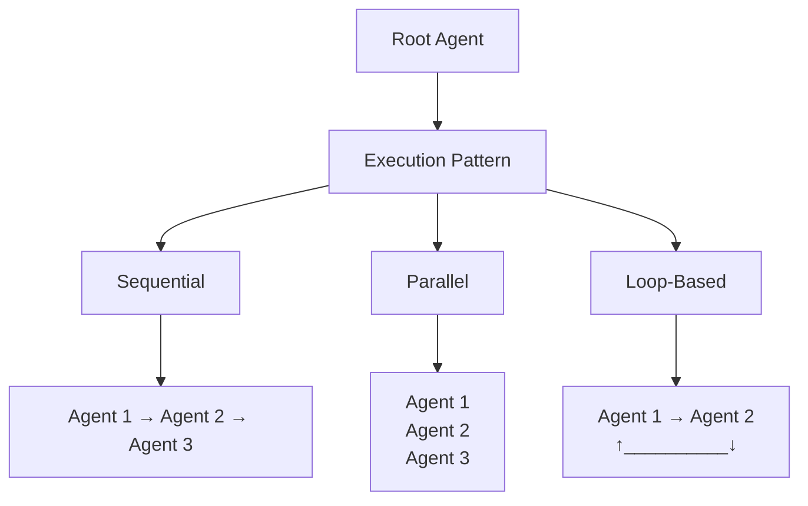
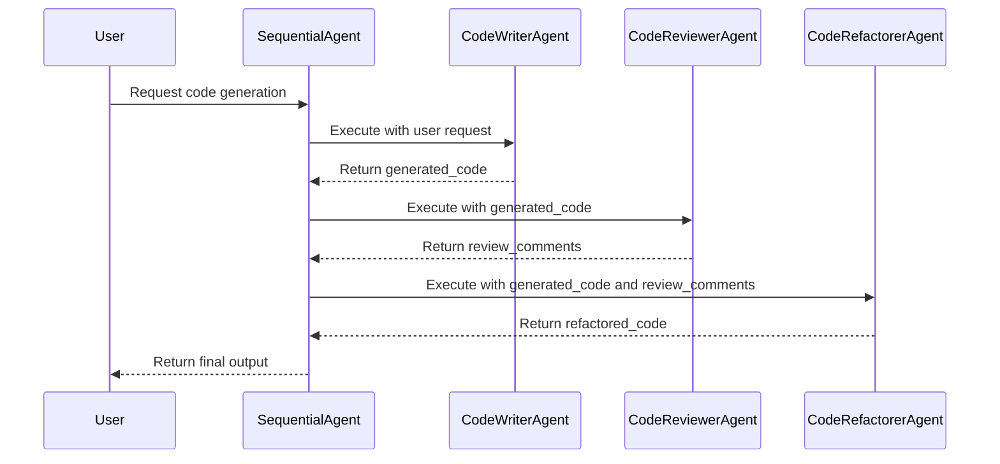
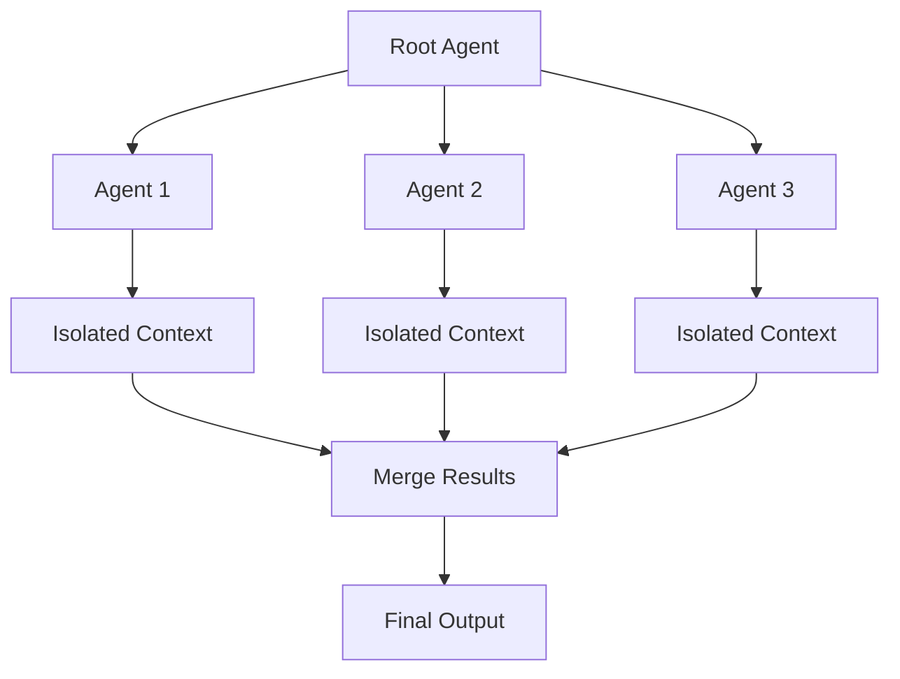
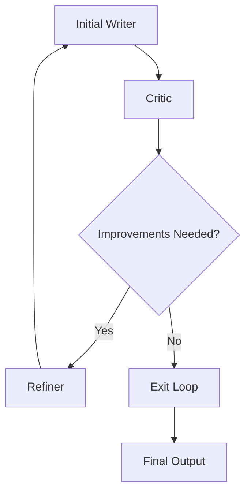
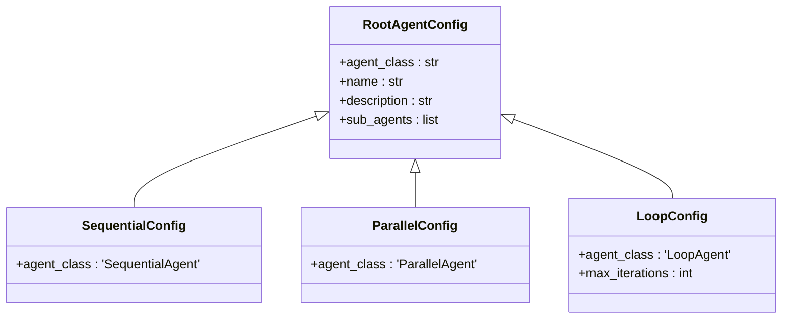
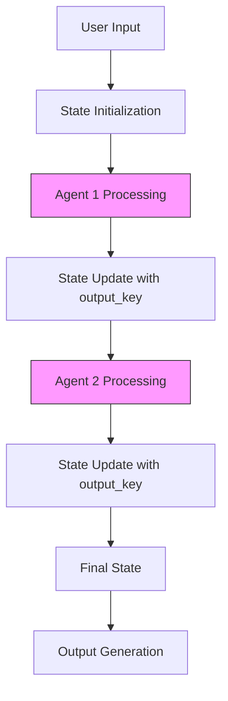
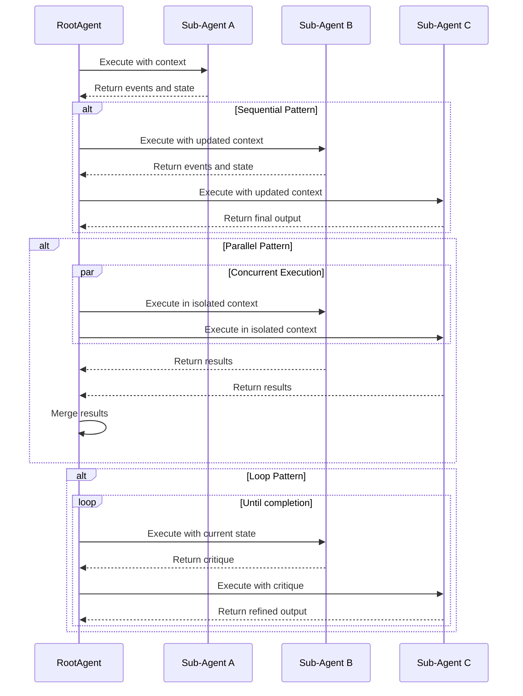
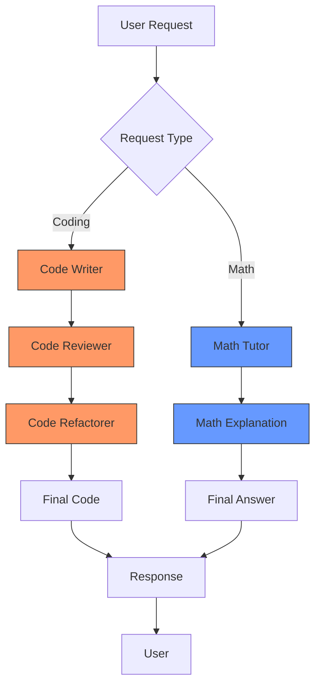
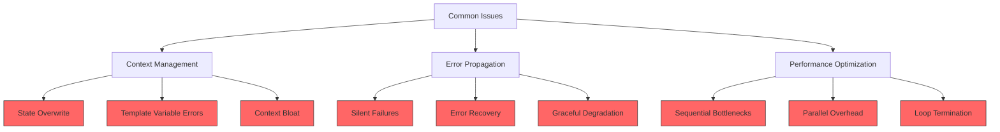
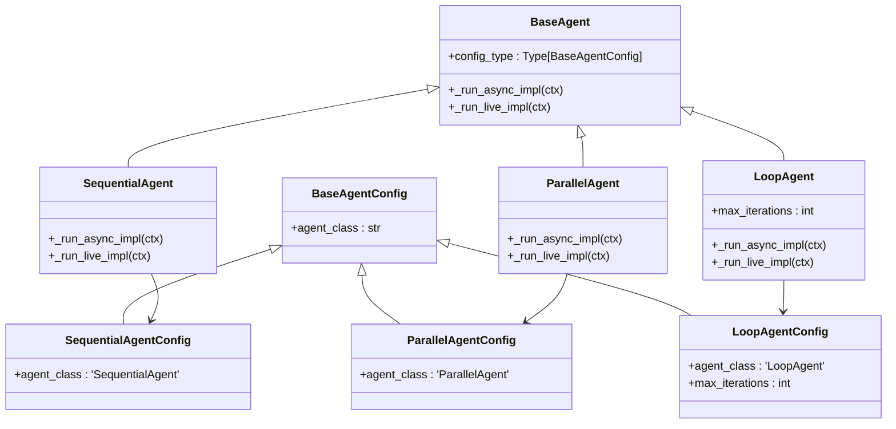

# Multi-Agent Systems

<cite>
**Referenced Files in This Document**   
- [root_agent.yaml](file://contributing/samples/multi_agent_basic_config/root_agent.yaml)
- [code_tutor_agent.yaml](file://contributing/samples/multi_agent_basic_config/code_tutor_agent.yaml)
- [math_tutor_agent.yaml](file://contributing/samples/multi_agent_basic_config/math_tutor_agent.yaml)
- [root_agent.yaml](file://contributing/samples/multi_agent_seq_config/root_agent.yaml)
- [code_writer_agent.yaml](file://contributing/samples/multi_agent_seq_config/sub_agents/code_writer_agent.yaml)
- [code_reviewer_agent.yaml](file://contributing/samples/multi_agent_seq_config/sub_agents/code_reviewer_agent.yaml)
- [code_refactorer_agent.yaml](file://contributing/samples/multi_agent_seq_config/sub_agents/code_refactorer_agent.yaml)
- [root_agent.yaml](file://contributing/samples/multi_agent_loop_config/root_agent.yaml)
- [loop_agent.yaml](file://contributing/samples/multi_agent_loop_config/loop_agent.yaml)
- [initial_writer_agent.yaml](file://contributing/samples/multi_agent_loop_config/writer_agents/initial_writer_agent.yaml)
- [critic_agent.yaml](file://contributing/samples/multi_agent_loop_config/writer_agents/critic_agent.yaml)
- [refiner_agent.yaml](file://contributing/samples/multi_agent_loop_config/writer_agents/refiner_agent.yaml)
- [sequential_agent.py](file://src/google/adk/agents/sequential_agent.py)
- [parallel_agent.py](file://src/google/adk/agents/parallel_agent.py)
- [loop_agent.py](file://src/google/adk/agents/loop_agent.py)
- [sequential_agent_config.py](file://src/google/adk/agents/sequential_agent_config.py)
- [parallel_agent_config.py](file://src/google/adk/agents/parallel_agent_config.py)
- [loop_agent_config.py](file://src/google/adk/agents/loop_agent_config.py)
</cite>

## Table of Contents
1. [Introduction](#introduction)
2. [Architectural Patterns for Agent Execution](#architectural-patterns-for-agent-execution)
3. [Sequential Agent Workflows](#sequential-agent-workflows)
4. [Parallel Agent Execution](#parallel-agent-execution)
5. [Loop-Based Agent Patterns](#loop-based-agent-patterns)
6. [Root Agent Configuration](#root-agent-configuration)
7. [Sub-Agent Configuration and State Management](#sub-agent-configuration-and-state-management)
8. [Control Flow Between Agents](#control-flow-between-agents)
9. [Complex Workflow Examples](#complex-workflow-examples)
10. [Common Implementation Issues](#common-implementation-issues)
11. [Framework Integration](#framework-integration)

## Introduction
Multi-Agent Systems in the ADK framework enable coordinated workflows through structured agent collaboration. This document details the implementation of sequential, parallel, and loop-based execution patterns using YAML configuration files and code-based definitions. The system allows for sophisticated task delegation, state passing, and termination conditions across multiple specialized agents. By leveraging the SequentialAgent, ParallelAgent, and LoopAgent classes, developers can create complex workflows for applications ranging from code generation pipelines to writer-critic-refiner loops. The configuration-driven approach simplifies the orchestration of agent interactions while maintaining flexibility for advanced use cases.

## Architectural Patterns for Agent Execution

**Diagram sources**
- [sequential_agent.py](file://src/google/adk/agents/sequential_agent.py)
- [parallel_agent.py](file://src/google/adk/agents/parallel_agent.py)
- [loop_agent.py](file://src/google/adk/agents/loop_agent.py)

**Section sources**
- [sequential_agent.py](file://src/google/adk/agents/sequential_agent.py#L34-L87)
- [parallel_agent.py](file://src/google/adk/agents/parallel_agent.py#L161-L204)
- [loop_agent.py](file://src/google/adk/agents/loop_agent.py#L37-L93)

The ADK framework supports three primary architectural patterns for multi-agent execution: sequential, parallel, and loop-based workflows. Each pattern serves distinct use cases and provides different control flow mechanisms. Sequential execution processes agents in a defined order, making it ideal for linear workflows where each step depends on the previous one. Parallel execution runs multiple agents simultaneously in isolated contexts, suitable for scenarios requiring diverse perspectives or concurrent processing. Loop-based execution creates iterative refinement cycles, perfect for writer-critic-refiner patterns and other feedback-driven processes. These patterns are implemented through specialized agent classes that inherit from the BaseAgent, providing consistent interfaces while enabling pattern-specific behaviors.

## Sequential Agent Workflows

**Diagram sources**
- [root_agent.yaml](file://contributing/samples/multi_agent_seq_config/root_agent.yaml#L1-L9)
- [sequential_agent.py](file://src/google/adk/agents/sequential_agent.py#L40-L48)

**Section sources**
- [root_agent.yaml](file://contributing/samples/multi_agent_seq_config/root_agent.yaml#L1-L9)
- [code_writer_agent.yaml](file://contributing/samples/multi_agent_seq_config/sub_agents/code_writer_agent.yaml#L1-L12)
- [code_reviewer_agent.yaml](file://contributing/samples/multi_agent_seq_config/sub_agents/code_reviewer_agent.yaml#L1-L27)
- [code_refactorer_agent.yaml](file://contributing/samples/multi_agent_seq_config/sub_agents/code_refactorer_agent.yaml#L1-L27)

Sequential agent workflows execute sub-agents in a predetermined order, with each agent receiving the output from the previous one. The SequentialAgent class implements this pattern by iterating through its sub_agents collection and executing each agent's run_async method in sequence. This approach is particularly effective for linear processing pipelines such as code generation workflows, where a code writer produces initial output, a code reviewer provides feedback, and a code refactoring agent applies the suggested improvements. The root_agent.yaml configuration in the multi_agent_seq_config sample demonstrates this pattern, defining a CodePipelineAgent that orchestrates three specialized sub-agents. Each sub-agent is configured with specific instructions and output keys that facilitate state passing between stages, ensuring a smooth transition of data and context throughout the workflow.

## Parallel Agent Execution

**Diagram sources**
- [parallel_agent.py](file://src/google/adk/agents/parallel_agent.py#L161-L197)
- [parallel_agent_config.py](file://src/google/adk/agents/parallel_agent_config.py#L28-L42)

**Section sources**
- [parallel_agent.py](file://src/google/adk/agents/parallel_agent.py#L161-L204)
- [parallel_agent_config.py](file://src/google/adk/agents/parallel_agent_config.py#L28-L42)

Parallel agent execution enables multiple agents to process tasks simultaneously in isolated contexts, making it ideal for scenarios requiring diverse perspectives or concurrent analysis. The ParallelAgent class achieves this by creating separate invocation contexts for each sub-agent, ensuring that their execution environments remain independent. The framework uses asyncio to manage concurrent execution, merging the event streams from all agents while maintaining proper ordering and synchronization. This pattern is particularly beneficial for generating multiple responses to the same query, running different algorithms on the same data, or gathering diverse opinions for subsequent evaluation. The _create_branch_ctx_for_sub_agent function ensures each sub-agent operates in its own context branch, preventing interference between parallel processes. Results from parallel agents can be aggregated and processed by a subsequent agent, enabling sophisticated ensemble approaches to problem solving.

## Loop-Based Agent Patterns

**Diagram sources**
- [loop_agent.py](file://src/google/adk/agents/loop_agent.py#L37-L72)
- [loop_agent.yaml](file://contributing/samples/multi_agent_loop_config/loop_agent.yaml#L1-L9)

**Section sources**
- [loop_agent.py](file://src/google/adk/agents/loop_agent.py#L37-L93)
- [loop_agent.yaml](file://contributing/samples/multi_agent_loop_config/loop_agent.yaml#L1-L9)
- [critic_agent.yaml](file://contributing/samples/multi_agent_loop_config/writer_agents/critic_agent.yaml#L1-L33)
- [refiner_agent.yaml](file://contributing/samples/multi_agent_loop_config/writer_agents/refiner_agent.yaml#L1-L26)

Loop-based agent patterns create iterative refinement cycles that continue until specific termination conditions are met. The LoopAgent class implements this pattern by repeatedly executing its sub-agents in sequence until either a maximum iteration count is reached or a sub-agent signals completion. This approach is particularly effective for writer-critic-refiner workflows, where an initial writer produces content, a critic evaluates it and suggests improvements, and a refiner applies those suggestions in a continuous cycle. The multi_agent_loop_config sample demonstrates this pattern with an IterativeWritingPipeline that uses a RefinementLoop agent to coordinate the process. The loop continues until the critic agent determines that no major issues remain, at which point the refiner agent calls the exit_loop tool to terminate the cycle. The max_iterations parameter provides a safety mechanism to prevent infinite loops, ensuring the process concludes even if perfect quality is not achieved.

## Root Agent Configuration

**Diagram sources**
- [root_agent.yaml](file://contributing/samples/multi_agent_basic_config/root_agent.yaml#L1-L18)
- [sequential_agent_config.py](file://src/google/adk/agents/sequential_agent_config.py#L28-L42)
- [parallel_agent_config.py](file://src/google/adk/agents/parallel_agent_config.py#L28-L42)
- [loop_agent_config.py](file://src/google/adk/agents/loop_agent_config.py#L29-L45)

**Section sources**
- [root_agent.yaml](file://contributing/samples/multi_agent_basic_config/root_agent.yaml#L1-L18)
- [root_agent.yaml](file://contributing/samples/multi_agent_seq_config/root_agent.yaml#L1-L9)
- [root_agent.yaml](file://contributing/samples/multi_agent_loop_config/root_agent.yaml#L1-L8)

The root agent configuration serves as the orchestration point for multi-agent workflows, defining the execution pattern and coordinating sub-agent activities. Implemented as a YAML file, the root_agent.yaml specifies the agent_class that determines the execution pattern (SequentialAgent, ParallelAgent, or LoopAgent), along with metadata such as name and description. The sub_agents section lists the configuration files for each participating agent, establishing the workflow structure. For sequential and loop-based patterns, the order of agents in the sub_agents list determines their execution sequence. Loop-based configurations can include the optional max_iterations parameter to limit the number of refinement cycles. All configurations reference the AgentConfig.json schema, ensuring validity and consistency across deployments. The root agent's instruction field provides high-level guidance for task delegation and workflow management, enabling intelligent routing of user requests to appropriate sub-agents based on content analysis.

## Sub-Agent Configuration and State Management

**Diagram sources**
- [code_writer_agent.yaml](file://contributing/samples/multi_agent_seq_config/sub_agents/code_writer_agent.yaml#L1-L12)
- [code_reviewer_agent.yaml](file://contributing/samples/multi_agent_seq_config/sub_agents/code_reviewer_agent.yaml#L1-L27)
- [code_refactorer_agent.yaml](file://contributing/samples/multi_agent_seq_config/sub_agents/code_refactorer_agent.yaml#L1-L27)

**Section sources**
- [code_writer_agent.yaml](file://contributing/samples/multi_agent_seq_config/sub_agents/code_writer_agent.yaml#L1-L12)
- [code_reviewer_agent.yaml](file://contributing/samples/multi_agent_seq_config/sub_agents/code_reviewer_agent.yaml#L1-L27)
- [code_refactorer_agent.yaml](file://contributing/samples/multi_agent_seq_config/sub_agents/code_refactorer_agent.yaml#L1-L27)
- [initial_writer_agent.yaml](file://contributing/samples/multi_agent_loop_config/writer_agents/initial_writer_agent.yaml#L1-L14)
- [critic_agent.yaml](file://contributing/samples/multi_agent_loop_config/writer_agents/critic_agent.yaml#L1-L33)
- [refiner_agent.yaml](file://contributing/samples/multi_agent_loop_config/writer_agents/refiner_agent.yaml#L1-L26)

Sub-agent configuration focuses on specialized roles within the multi-agent workflow, with each agent designed for a specific task. Configuration files define the agent_class (typically LlmAgent), name, description, and model parameters, along with detailed instructions that guide the agent's behavior. A critical aspect of sub-agent design is state management through the output_key parameter, which specifies how the agent's output is stored in the shared context for use by subsequent agents. In sequential workflows, agents reference previous outputs using template variables (e.g., {generated_code}), creating a chain of state passing. The instruction field often includes specific formatting requirements, such as enclosing code in triple backticks, to ensure consistent output parsing. For loop-based patterns, agents may include tools like exit_loop to signal completion, and use conditional logic to determine whether to continue refinement or terminate the cycle. Proper configuration of include_contents and output formatting ensures efficient state management and prevents context bloat.

## Control Flow Between Agents

**Diagram sources**
- [sequential_agent.py](file://src/google/adk/agents/sequential_agent.py#L40-L48)
- [parallel_agent.py](file://src/google/adk/agents/parallel_agent.py#L174-L193)
- [loop_agent.py](file://src/google/adk/agents/loop_agent.py#L55-L72)

**Section sources**
- [sequential_agent.py](file://src/google/adk/agents/sequential_agent.py#L40-L87)
- [parallel_agent.py](file://src/google/adk/agents/parallel_agent.py#L174-L204)
- [loop_agent.py](file://src/google/adk/agents/loop_agent.py#L55-L93)

Control flow between agents is managed through the root agent's execution pattern implementation, with each pattern providing distinct mechanisms for orchestrating agent interactions. In sequential workflows, control flows linearly from one agent to the next, with the SequentialAgent ensuring that each sub-agent completes before the next begins. The framework passes the updated context, including any state changes from output_key assignments, to subsequent agents. Parallel workflows distribute control simultaneously to multiple agents, with the ParallelAgent managing concurrent execution through asyncio and merging the results. Loop-based patterns create cyclical control flow, with the LoopAgent repeatedly executing its sub-agents until termination conditions are met. The control flow can be influenced by agent outputs, such as the escalate action or specific tool calls (like exit_loop), which signal the need to terminate the current process. Event-driven architecture ensures that all agent outputs are properly propagated through the system, maintaining visibility into the workflow's progress and enabling real-time monitoring and intervention when necessary.

## Complex Workflow Examples

**Diagram sources**
- [root_agent.yaml](file://contributing/samples/multi_agent_basic_config/root_agent.yaml#L1-L18)
- [root_agent.yaml](file://contributing/samples/multi_agent_seq_config/root_agent.yaml#L1-L9)

**Section sources**
- [root_agent.yaml](file://contributing/samples/multi_agent_basic_config/root_agent.yaml#L1-L18)
- [code_tutor_agent.yaml](file://contributing/samples/multi_agent_basic_config/code_tutor_agent.yaml#L1-L16)
- [math_tutor_agent.yaml](file://contributing/samples/multi_agent_basic_config/math_tutor_agent.yaml#L1-L16)
- [root_agent.yaml](file://contributing/samples/multi_agent_seq_config/root_agent.yaml#L1-L9)
- [code_writer_agent.yaml](file://contributing/samples/multi_agent_seq_config/sub_agents/code_writer_agent.yaml#L1-L12)

Complex workflow examples demonstrate the practical application of multi-agent patterns to real-world scenarios. The multi_agent_basic_config sample illustrates a learning assistant that intelligently routes user queries to specialized sub-agents based on content analysis, delegating coding questions to a code_tutor_agent and math questions to a math_tutor_agent. This routing pattern showcases how a root agent can serve as an intelligent dispatcher, optimizing resource utilization by directing tasks to the most appropriate specialist. The multi_agent_seq_config sample demonstrates a code generation pipeline where a CodePipelineAgent coordinates three specialized agents in sequence: a code writer that generates initial code, a code reviewer that provides feedback, and a code refactoring agent that implements improvements. This pipeline exemplifies how sequential workflows can create sophisticated processing chains that produce higher-quality outputs than individual agents could achieve alone. Both examples highlight the framework's ability to manage complex state transitions and coordinate specialized expertise toward a common goal.

## Common Implementation Issues

**Diagram sources**
- [context_utils.py](file://src/google/adk/utils/context_utils.py)
- [sequential_agent.py](file://src/google/adk/agents/sequential_agent.py)
- [loop_agent.py](file://src/google/adk/agents/loop_agent.py)

**Section sources**
- [sequential_agent.py](file://src/google/adk/agents/sequential_agent.py#L40-L87)
- [loop_agent.py](file://src/google/adk/agents/loop_agent.py#L55-L93)
- [context_utils.py](file://src/google/adk/utils/context_utils.py)

Common implementation issues in multi-agent systems include challenges with context management, error propagation, and performance optimization. Context management issues arise when multiple agents modify shared state, potentially leading to state overwrite conflicts or template variable resolution errors. Developers must carefully design output_key strategies to prevent unintended overwrites and ensure proper data flow between agents. Error propagation presents challenges in distributed workflows, where failures in one agent can cascade through the system; implementing proper error handling and recovery mechanisms is crucial for system reliability. Performance optimization requires balancing the benefits of parallel execution against the overhead of context isolation and result merging, while sequential workflows may suffer from bottlenecks if individual agents are slow. Loop-based patterns face challenges with termination conditions, requiring careful tuning of max_iterations and completion criteria to avoid infinite loops while ensuring sufficient refinement. Context bloat can occur when agents accumulate unnecessary history, impacting both performance and cost, necessitating strategies for context condensation and selective retention.

## Framework Integration

**Diagram sources**
- [sequential_agent.py](file://src/google/adk/agents/sequential_agent.py#L34-L87)
- [parallel_agent.py](file://src/google/adk/agents/parallel_agent.py#L161-L204)
- [loop_agent.py](file://src/google/adk/agents/loop_agent.py#L37-L93)
- [sequential_agent_config.py](file://src/google/adk/agents/sequential_agent_config.py#L28-L42)
- [parallel_agent_config.py](file://src/google/adk/agents/parallel_agent_config.py#L28-L42)
- [loop_agent_config.py](file://src/google/adk/agents/loop_agent_config.py#L29-L45)

**Section sources**
- [sequential_agent.py](file://src/google/adk/agents/sequential_agent.py#L34-L87)
- [parallel_agent.py](file://src/google/adk/agents/parallel_agent.py#L161-L204)
- [loop_agent.py](file://src/google/adk/agents/loop_agent.py#L37-L93)
- [sequential_agent_config.py](file://src/google/adk/agents/sequential_agent_config.py#L28-L42)
- [parallel_agent_config.py](file://src/google/adk/agents/parallel_agent_config.py#L28-L42)
- [loop_agent_config.py](file://src/google/adk/agents/loop_agent_config.py#L29-L45)

Framework integration of multi-agent systems is achieved through a well-defined class hierarchy and configuration system that ensures consistency and extensibility. The core architecture centers on the BaseAgent class, which provides the fundamental interface for agent execution through the _run_async_impl and _run_live_impl methods. Specialized agent classes—SequentialAgent, ParallelAgent, and LoopAgent—inherit from BaseAgent and implement pattern-specific execution logic while maintaining a consistent interface. Each agent class is paired with a corresponding configuration class (SequentialAgentConfig, ParallelAgentConfig, LoopAgentConfig) that defines the valid schema for YAML configuration files. The config_type field in each agent class establishes the relationship between agent implementations and their configuration schemas. This design enables the framework to instantiate the correct agent type based on the agent_class specified in the YAML configuration, while ensuring that configuration parameters are properly validated against the appropriate schema. The experimental decorator indicates that these features are under active development, signaling potential future enhancements and modifications.