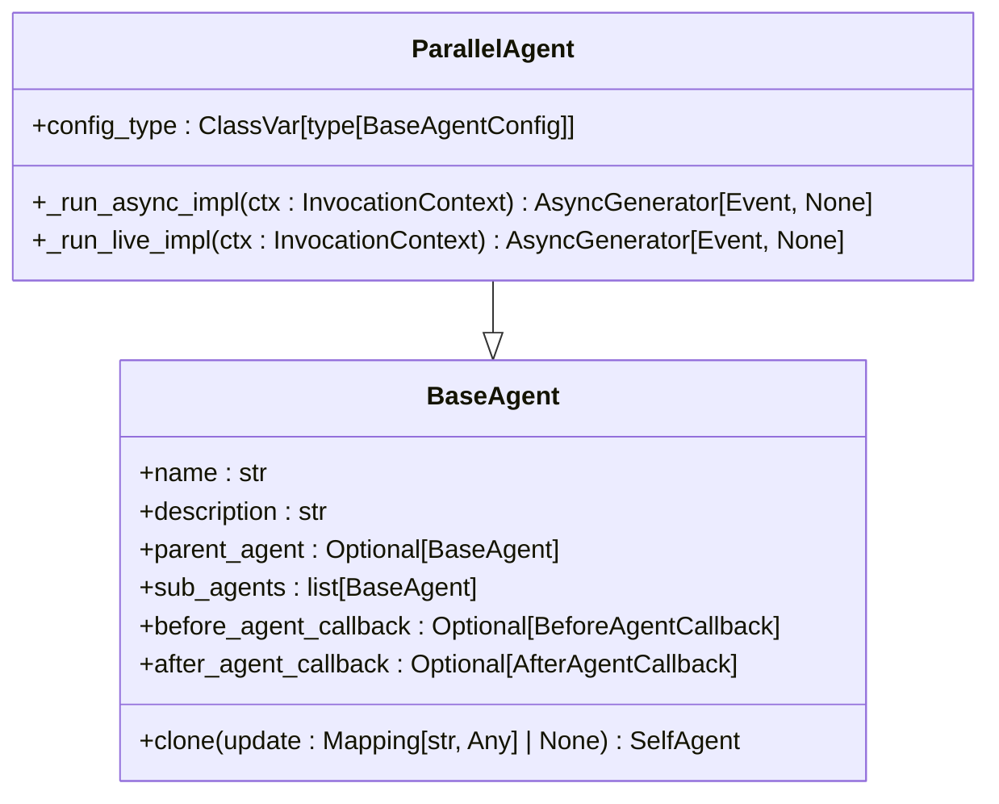
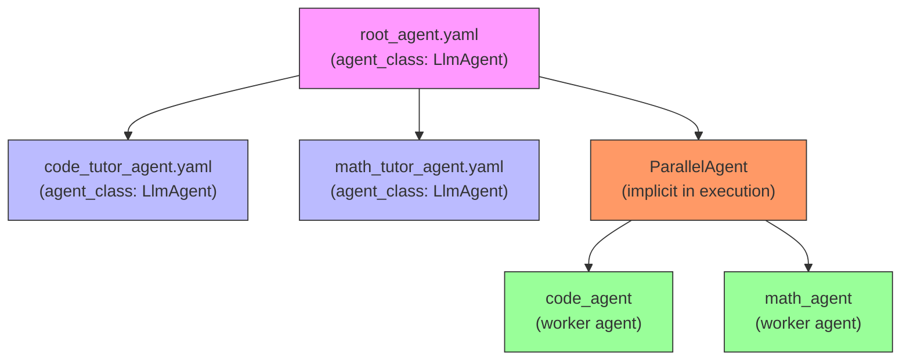
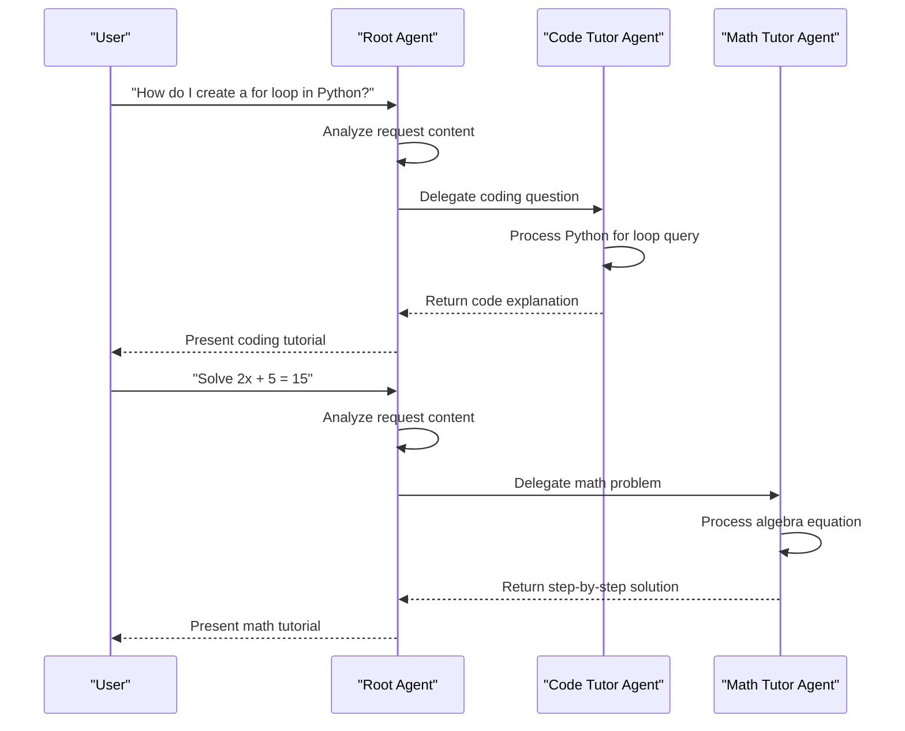
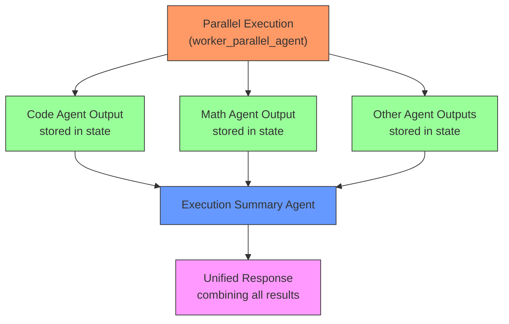
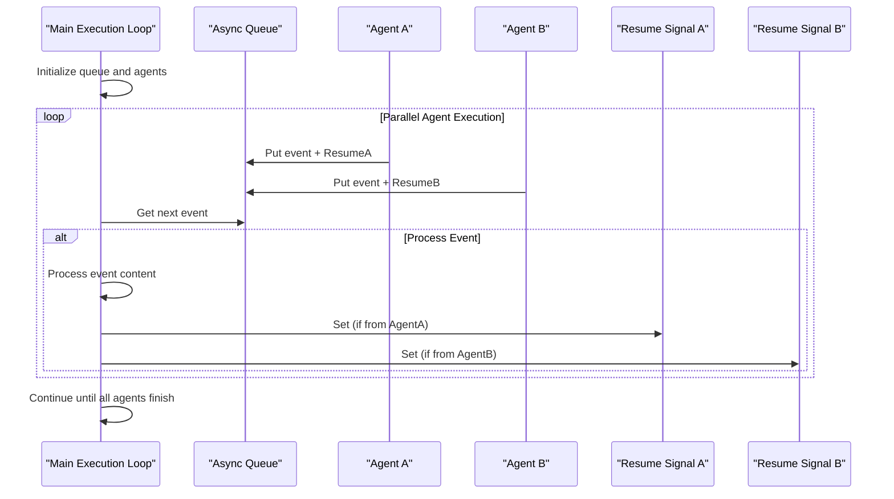
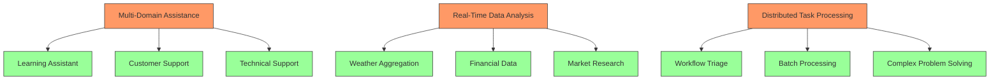
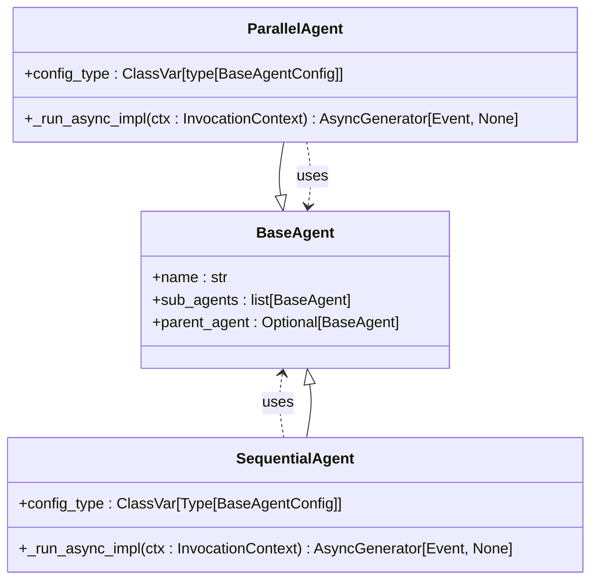

# Parallel Multi-Agent Systems

<cite>
**Referenced Files in This Document**   
- [parallel_agent.py](file://src/google/adk/agents/parallel_agent.py)
- [parallel_agent_config.py](file://src/google/adk/agents/parallel_agent_config.py)
- [root_agent.yaml](file://contributing/samples/multi_agent_basic_config/root_agent.yaml)
- [math_tutor_agent.yaml](file://contributing/samples/multi_agent_basic_config/math_tutor_agent.yaml)
- [code_tutor_agent.yaml](file://contributing/samples/multi_agent_basic_config/code_tutor_agent.yaml)
- [execution_agent.py](file://contributing/samples/workflow_triage/execution_agent.py)
- [agent.py](file://contributing/samples/workflow_triage/agent.py)
- [base_agent.py](file://src/google/adk/agents/base_agent.py)
- [sequential_agent.py](file://src/google/adk/agents/sequential_agent.py)
</cite>

## Table of Contents
1. [Introduction](#introduction)
2. [ParallelAgent Implementation](#parallelagent-implementation)
3. [Configuration and Setup](#configuration-and-setup)
4. [Task Distribution Mechanisms](#task-distribution-mechanisms)
5. [Result Aggregation Strategies](#result-aggregation-strategies)
6. [Synchronization Patterns](#synchronization-patterns)
7. [Usage Patterns](#usage-patterns)
8. [Common Issues and Solutions](#common-issues-and-solutions)
9. [Integration with Core Framework](#integration-with-core-framework)
10. [Performance Optimization](#performance-optimization)

## Introduction

Parallel Multi-Agent Systems enable concurrent execution of independent agents to improve throughput and responsiveness. This document explains the implementation details of the ParallelAgent class and how it manages simultaneous execution of specialized agents like math_tutor and code_tutor through configuration files such as root_agent.yaml. The system allows multiple agents to process different aspects of a request simultaneously, providing significant performance benefits over sequential execution.

The core concept revolves around delegating tasks to specialized agents that can operate independently and concurrently. This approach is particularly effective for scenarios requiring multiple perspectives or attempts on a single task, such as running different algorithms simultaneously or generating multiple responses for review by a subsequent evaluation agent.

**Section sources**
- [parallel_agent.py](file://src/google/adk/agents/parallel_agent.py#L161-L169)
- [root_agent.yaml](file://contributing/samples/multi_agent_basic_config/root_agent.yaml#L1-L18)

## ParallelAgent Implementation

The ParallelAgent class implements concurrent execution of sub-agents through asynchronous programming patterns. It inherits from BaseAgent and overrides the _run_async_impl method to coordinate parallel execution. The implementation uses Python's asyncio framework to manage concurrent operations, ensuring efficient resource utilization and responsiveness.

The core execution flow begins with creating isolated branches for each sub-agent using the _create_branch_ctx_for_sub_agent function. This ensures that each agent operates with its own invocation context, preventing interference between parallel processes. The agent runs are then merged using either _merge_agent_run (for Python 3.11+) or _merge_agent_run_pre_3_11 (for earlier versions), which handle the coordination of multiple asynchronous generators.

A key feature of the implementation is the use of asyncio.Queue to manage event flow between agents and the main execution loop. Each agent's events are placed on the queue sequentially, but the agents themselves process in parallel. The system uses resume signals (asyncio.Event) to ensure backpressure control, guaranteeing that each agent won't move on until its generated event is processed by the upstream runner.

**Diagram sources **
- [parallel_agent.py](file://src/google/adk/agents/parallel_agent.py#L161-L204)
- [base_agent.py](file://src/google/adk/agents/base_agent.py#L71-L200)

**Section sources**
- [parallel_agent.py](file://src/google/adk/agents/parallel_agent.py#L161-L204)
- [base_agent.py](file://src/google/adk/agents/base_agent.py#L71-L200)

## Configuration and Setup

The configuration of Parallel Multi-Agent Systems is managed through YAML files that define agent hierarchies and relationships. The root_agent.yaml file serves as the entry point, specifying the main agent that delegates tasks to specialized sub-agents. In the multi_agent_basic_config example, the root agent is configured to route coding questions to code_tutor_agent and math questions to math_tutor_agent.

The configuration schema follows a hierarchical structure where the root agent specifies its sub-agents through the sub_agents list, with each entry containing a config_path pointing to the respective agent's configuration file. Each specialized agent (like math_tutor_agent.yaml and code_tutor_agent.yaml) defines its own name, description, and instruction set tailored to its specific domain expertise.

The ParallelAgentConfig class provides the schema validation for parallel agent configurations, marked as experimental with appropriate decorators. The configuration system uses Pydantic models with strict validation (extra='forbid') to ensure configuration integrity and prevent unexpected fields from being accepted.

**Diagram sources **
- [root_agent.yaml](file://contributing/samples/multi_agent_basic_config/root_agent.yaml#L1-L18)
- [code_tutor_agent.yaml](file://contributing/samples/multi_agent_basic_config/code_tutor_agent.yaml#L1-L16)
- [math_tutor_agent.yaml](file://contributing/samples/multi_agent_basic_config/math_tutor_agent.yaml#L1-L16)

**Section sources**
- [root_agent.yaml](file://contributing/samples/multi_agent_basic_config/root_agent.yaml#L1-L18)
- [code_tutor_agent.yaml](file://contributing/samples/multi_agent_basic_config/code_tutor_agent.yaml#L1-L16)
- [math_tutor_agent.yaml](file://contributing/samples/multi_agent_basic_config/math_tutor_agent.yaml#L1-L16)
- [parallel_agent_config.py](file://src/google/adk/agents/parallel_agent_config.py#L28-L42)

## Task Distribution Mechanisms

The task distribution mechanism in Parallel Multi-Agent Systems operates through intelligent delegation based on request content analysis. The root agent analyzes incoming requests and routes them to appropriate specialized agents based on predefined criteria. In the learning assistant example, coding-related queries are directed to the code_tutor_agent while mathematical queries are routed to the math_tutor_agent.

A more sophisticated implementation is demonstrated in the workflow_triage sample, where the execution manager agent analyzes user input to determine relevant worker agents and updates an execution plan accordingly. This dynamic approach allows the system to activate only the agents relevant to the current request, optimizing resource usage and reducing unnecessary processing.

The system supports both static and dynamic task distribution. Static distribution, as seen in the basic multi-agent configuration, uses fixed routing rules defined in the agent instructions. Dynamic distribution, implemented in more complex workflows, uses tools like update_execution_plan to modify the agent activation list at runtime based on the specific requirements of each request.

**Diagram sources **
- [root_agent.yaml](file://contributing/samples/multi_agent_basic_config/root_agent.yaml#L6-L14)
- [agent.py](file://contributing/samples/workflow_triage/agent.py#L31-L58)
- [execution_agent.py](file://contributing/samples/workflow_triage/execution_agent.py#L49-L71)

**Section sources**
- [root_agent.yaml](file://contributing/samples/multi_agent_basic_config/root_agent.yaml#L6-L14)
- [agent.py](file://contributing/samples/workflow_triage/agent.py#L31-L58)
- [execution_agent.py](file://contributing/samples/workflow_triage/execution_agent.py#L49-L71)

## Result Aggregation Strategies

Result aggregation in Parallel Multi-Agent Systems follows a coordinated approach where outputs from concurrent agents are collected and synthesized into a cohesive response. The system uses state management through ToolContext to store individual agent outputs, which are then accessed by a summarization agent to create a unified response.

In the workflow_triage implementation, the execution_summary_agent dynamically generates its instructions based on which agents were activated during the current invocation. It retrieves outputs from the state store (e.g., code_agent_output, math_agent_output) and incorporates them into its prompt, ensuring that the summary reflects all relevant information from the parallel execution.

The aggregation process maintains proper sequencing through the use of the SequentialAgent, which ensures that the worker_parallel_agent completes its execution before the execution_summary_agent begins. This ordered approach prevents race conditions and ensures that all parallel results are available before summarization begins.

**Diagram sources **
- [execution_agent.py](file://contributing/samples/workflow_triage/execution_agent.py#L74-L119)
- [agent.py](file://contributing/samples/workflow_triage/agent.py#L31-L58)

**Section sources**
- [execution_agent.py](file://contributing/samples/workflow_triage/execution_agent.py#L74-L119)

## Synchronization Patterns

The synchronization patterns in Parallel Multi-Agent Systems are designed to ensure coordinated execution while maintaining the benefits of concurrency. The primary synchronization mechanism uses asyncio primitives like Queue and Event to manage the flow of events between parallel agents and the main execution loop.

The _merge_agent_run function implements a sophisticated synchronization pattern that processes agents in parallel while ensuring sequential event delivery. Each agent's events are placed on a shared queue, but the agents themselves execute concurrently. The system uses resume signals (asyncio.Event) to implement backpressure control, ensuring that each agent waits for its event to be processed before generating the next one.

For Python versions prior to 3.11, the system includes a custom implementation (_merge_agent_run_pre_3_11) that replicates the functionality of asyncio.TaskGroup, providing proper task cancellation and exception handling. This ensures consistent behavior across different Python versions while maintaining the synchronization guarantees.

The branch context creation (_create_branch_ctx_for_sub_agent) provides isolation between parallel agents by creating unique branch identifiers that incorporate both the parent and sub-agent names. This prevents interference between concurrent processes while maintaining traceability.

**Diagram sources **
- [parallel_agent.py](file://src/google/adk/agents/parallel_agent.py#L50-L159)
- [parallel_agent.py](file://src/google/adk/agents/parallel_agent.py#L34-L47)

**Section sources**
- [parallel_agent.py](file://src/google/adk/agents/parallel_agent.py#L50-L159)

## Usage Patterns

Parallel Multi-Agent Systems support several key usage patterns that leverage concurrent execution for improved performance and functionality. The most common pattern is multi-domain assistance, where a root agent delegates to specialized agents for different domains such as coding, mathematics, or other subject areas.

Real-time data analysis is another important usage pattern, demonstrated in the parallel_functions sample. This pattern involves making multiple API calls or data queries in parallel, significantly reducing overall response time compared to sequential execution. For example, retrieving weather data for multiple cities can be done concurrently rather than waiting for each request to complete before starting the next.

Distributed task processing represents a more advanced usage pattern where complex tasks are broken down into independent subtasks that can be processed in parallel. The workflow_triage sample illustrates this pattern, where an execution manager analyzes a request and activates only the relevant worker agents, allowing for efficient resource utilization and faster response times.

**Diagram sources **
- [root_agent.yaml](file://contributing/samples/multi_agent_basic_config/root_agent.yaml#L1-L18)
- [parallel_functions/README.md](file://contributing/samples/parallel_functions/README.md#L1-L104)
- [workflow_triage/README.md](file://contributing/samples/workflow_triage/README.md#L1-L68)

**Section sources**
- [root_agent.yaml](file://contributing/samples/multi_agent_basic_config/root_agent.yaml#L1-L18)
- [parallel_functions/README.md](file://contributing/samples/parallel_functions/README.md#L1-L104)
- [workflow_triage/README.md](file://contributing/samples/workflow_triage/README.md#L1-L68)

## Common Issues and Solutions

Several common issues arise in Parallel Multi-Agent Systems, with corresponding solutions implemented in the framework. Resource contention is addressed through proper isolation of agent contexts and state management, preventing conflicts when multiple agents access shared resources.

Load balancing challenges are mitigated through dynamic agent selection, as demonstrated in the workflow_triage sample. By activating only relevant agents for each request, the system optimizes resource usage and prevents unnecessary processing. The before_agent_callback mechanism allows agents to skip execution when not relevant, further improving efficiency.

Inconsistent response times are minimized through the use of proper asynchronous patterns. The parallel_functions sample emphasizes the importance of using await asyncio.sleep() instead of time.sleep() to avoid blocking Python's GIL, ensuring true parallel execution. This design choice prevents sequential execution despite asyncio parallelism, maintaining consistent performance improvements.

Thread safety is ensured through the use of asyncio primitives and proper state management. The system's design allows multiple tools to safely modify state concurrently without race conditions, with state modifications preserved correctly through the asynchronous execution model.

**Section sources**
- [parallel_functions/README.md](file://contributing/samples/parallel_functions/README.md#L1-L104)
- [execution_agent.py](file://contributing/samples/workflow_triage/execution_agent.py#L34-L46)
- [parallel_agent.py](file://src/google/adk/agents/parallel_agent.py#L195-L196)

## Integration with Core Framework

The ParallelAgent integrates seamlessly with the core agent framework through well-defined interfaces and inheritance patterns. It extends the BaseAgent class, adhering to the framework's architecture while providing specialized parallel execution capabilities. The config_type class variable specifies ParallelAgentConfig as its configuration type, ensuring proper schema validation and type safety.

Integration with the execution model is achieved through the _run_async_impl method override, which coordinates the parallel execution of sub-agents while maintaining compatibility with the framework's event-driven architecture. The system uses the InvocationContext to manage execution state and branching, ensuring proper isolation between parallel processes.

The agent hierarchy is maintained through the parent_agent and sub_agents properties inherited from BaseAgent, allowing for nested agent structures and complex workflows. This integration enables the creation of sophisticated multi-agent systems where ParallelAgent instances can be combined with SequentialAgent and other agent types to create hybrid execution patterns.

**Diagram sources **
- [parallel_agent.py](file://src/google/adk/agents/parallel_agent.py#L161-L204)
- [sequential_agent.py](file://src/google/adk/agents/sequential_agent.py#L34-L87)
- [base_agent.py](file://src/google/adk/agents/base_agent.py#L71-L200)

**Section sources**
- [parallel_agent.py](file://src/google/adk/agents/parallel_agent.py#L161-L204)
- [sequential_agent.py](file://src/google/adk/agents/sequential_agent.py#L34-L87)
- [base_agent.py](file://src/google/adk/agents/base_agent.py#L71-L200)

## Performance Optimization

Performance optimization in Parallel Multi-Agent Systems focuses on maximizing throughput and minimizing response times through efficient concurrency patterns. The system achieves significant performance improvements by executing independent agents simultaneously rather than sequentially.

Key optimization techniques include proper use of asynchronous programming patterns, avoiding blocking operations that would prevent true parallelism. The framework emphasizes the use of await asyncio.sleep() instead of time.sleep() to prevent GIL blocking, ensuring that I/O-bound operations can proceed concurrently.

Resource utilization is optimized through dynamic agent activation, where only relevant agents are executed for each request. This selective execution pattern, combined with the ability to process multiple independent tasks simultaneously, results in substantial performance gains compared to sequential processing.

The system's design also optimizes memory usage and context switching by maintaining lightweight agent instances and efficient event handling. The use of generators for event streaming minimizes memory overhead while providing responsive feedback to users during long-running operations.

**Section sources**
- [parallel_functions/README.md](file://contributing/samples/parallel_functions/README.md#L1-L104)
- [parallel_agent.py](file://src/google/adk/agents/parallel_agent.py#L50-L159)
- [workflow_triage/README.md](file://contributing/samples/workflow_triage/README.md#L1-L68)