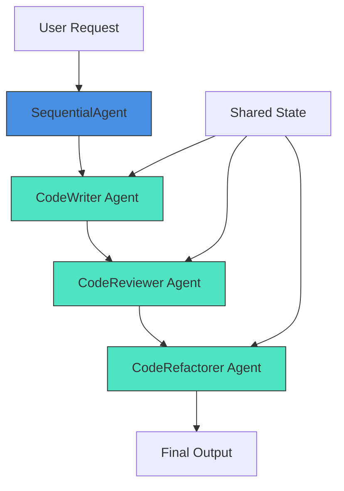
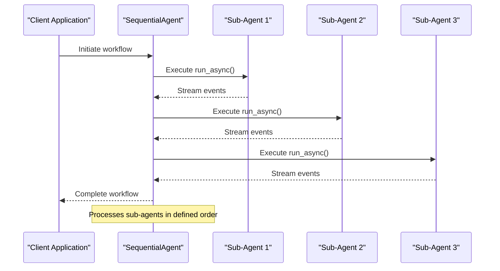
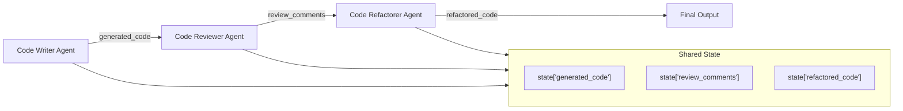
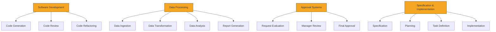

# Sequential Multi-Agent Systems

<cite>
**Referenced Files in This Document**   
- [sequential_agent.py](file://src/google/adk/agents/sequential_agent.py)
- [sequential_agent_config.py](file://src/google/adk/agents/sequential_agent_config.py)
- [root_agent.yaml](file://contributing/samples/multi_agent_seq_config/root_agent.yaml)
- [code_writer_agent.yaml](file://contributing/samples/multi_agent_seq_config/sub_agents/code_writer_agent.yaml)
- [code_reviewer_agent.yaml](file://contributing/samples/multi_agent_seq_config/sub_agents/code_reviewer_agent.yaml)
- [code_refactorer_agent.yaml](file://contributing/samples/multi_agent_seq_config/sub_agents/code_refactorer_agent.yaml)
- [agent.py](file://contributing/samples/workflow_agent_seq/agent.py)
- [sequential_spec_kit_agent.py](file://contributing/samples/spec_kit_integration/sequential_spec_kit_agent.py)
- [base_agent.py](file://src/google/adk/agents/base_agent.py)
- [invocation_context.py](file://src/google/adk/agents/invocation_context.py)
</cite>

## Table of Contents
1. [Introduction](#introduction)
2. [Core Architecture](#core-architecture)
3. [SequentialAgent Implementation](#sequentialagent-implementation)
4. [Configuration and Workflow Definition](#configuration-and-workflow-definition)
5. [State Management and Context Passing](#state-management-and-context-passing)
6. [Error Handling and Execution Control](#error-handling-and-execution-control)
7. [Usage Patterns](#usage-patterns)
8. [Performance Considerations](#performance-considerations)
9. [Troubleshooting Guide](#troubleshooting-guide)
10. [Conclusion](#conclusion)

## Introduction
Sequential Multi-Agent Systems provide a structured approach to orchestrating multiple AI agents in a linear workflow where tasks are processed in a defined order. This document details the implementation of the SequentialAgent class and its role in coordinating sub-agents through YAML configurations that define pipelines such as code_writer → code_reviewer → code_refactorer. The system enables complex workflows by chaining specialized agents together, allowing each to focus on a specific task while maintaining state across the entire pipeline.

The SequentialAgent pattern is particularly valuable for software development workflows, data processing pipelines, and approval systems where tasks must be completed in a specific sequence. By breaking down complex processes into discrete steps handled by specialized agents, this approach improves reliability, maintainability, and the quality of outputs.

**Section sources**
- [sequential_agent.py](file://src/google/adk/agents/sequential_agent.py#L1-L87)
- [sequential_agent_config.py](file://src/google/adk/agents/sequential_agent_config.py#L1-L42)

## Core Architecture
The Sequential Multi-Agent System architecture is built around the SequentialAgent class, which acts as an orchestrator for a series of sub-agents that execute in a predetermined order. Each sub-agent in the sequence can be a specialized LLM agent configured for a specific task, such as code generation, review, or refactoring. The architecture follows a pipeline pattern where the output of one agent becomes the input context for the next.

The system leverages a shared state mechanism through the InvocationContext, which maintains data across agent executions. This allows information to flow seamlessly from one stage of the pipeline to the next, enabling complex workflows where later agents can reference the outputs and decisions of earlier agents. The architecture supports both YAML-based configuration for declarative workflow definition and programmatic agent creation for dynamic pipeline construction.



**Diagram sources**
- [sequential_agent.py](file://src/google/adk/agents/sequential_agent.py#L34-L87)
- [agent.py](file://contributing/samples/workflow_agent_seq/agent.py#L24-L96)

**Section sources**
- [sequential_agent.py](file://src/google/adk/agents/sequential_agent.py#L34-L87)
- [base_agent.py](file://src/google/adk/agents/base_agent.py#L71-L200)

## SequentialAgent Implementation
The SequentialAgent class implements a shell agent that runs its sub-agents in sequence, providing a clean interface for orchestrating multi-step workflows. The core implementation consists of two primary methods: _run_async_impl and _run_live_impl, which handle standard and live execution modes respectively.

In the standard execution mode, the SequentialAgent iterates through its sub_agents collection, executing each agent's run_async method and yielding events as they occur. The implementation uses async context managers (Aclosing) to ensure proper resource cleanup after each agent completes. For live execution scenarios, the system introduces a task_completed function that sub-agents can call to signal completion, allowing the orchestrator to move to the next agent in the sequence.

The agent maintains a strict execution order, ensuring that each sub-agent completes before the next begins. This linear processing model provides predictable behavior and simplifies debugging, as each stage of the pipeline can be examined independently. The implementation also handles error propagation, allowing failures in one agent to terminate the entire sequence or be handled by subsequent agents depending on the configuration.



**Diagram sources**
- [sequential_agent.py](file://src/google/adk/agents/sequential_agent.py#L40-L87)
- [invocation_context.py](file://src/google/adk/agents/invocation_context.py#L92-L221)

**Section sources**
- [sequential_agent.py](file://src/google/adk/agents/sequential_agent.py#L34-L87)
- [invocation_context.py](file://src/google/adk/agents/invocation_context.py#L92-L221)

## Configuration and Workflow Definition
Workflows in the Sequential Multi-Agent System can be defined through YAML configuration files or programmatically in Python code. The YAML approach provides a declarative way to specify agent pipelines, making it easy to modify workflows without changing code. The root_agent.yaml file defines the SequentialAgent and its sub-agents through a config_path reference system that points to individual agent configuration files.

Each sub-agent is configured with specific parameters including model selection, instructions, and output keys that determine how data flows through the pipeline. The configuration system supports template variables (e.g., {generated_code}) that reference state from previous agents, enabling context-aware processing. This approach allows for the creation of sophisticated pipelines where later agents can analyze and build upon the outputs of earlier stages.

Programmatic configuration offers additional flexibility, allowing dynamic agent creation and parameterization. This approach is useful when workflow steps need to be determined at runtime based on input conditions or external factors. Both configuration methods ultimately create the same agent structure, providing developers with options based on their specific use case requirements.

```mermaid
flowchart TD
Config[Workflow Definition] --> YAML["YAML Configuration\n(root_agent.yaml)"]
Config --> Programmatic["Programmatic Configuration\n(agent.py)"]
YAML --> AgentList["sub_agents:\n - config_path: sub_agents/code_writer_agent.yaml\n - config_path: sub_agents/code_reviewer_agent.yaml\n - config_path: sub_agents/code_refactorer_agent.yaml"]
Programmatic --> AgentCreation["code_pipeline_agent = SequentialAgent(\n name=\"CodePipelineAgent\",\n sub_agents=[code_writer_agent, code_reviewer_agent, code_refactorer_agent]\n)"]
AgentList --> Pipeline[Execution Pipeline]
AgentCreation --> Pipeline
```

**Diagram sources**
- [root_agent.yaml](file://contributing/samples/multi_agent_seq_config/root_agent.yaml#L1-L9)
- [agent.py](file://contributing/samples/workflow_agent_seq/agent.py#L101-L108)

**Section sources**
- [root_agent.yaml](file://contributing/samples/multi_agent_seq_config/root_agent.yaml#L1-L9)
- [code_writer_agent.yaml](file://contributing/samples/multi_agent_seq_config/sub_agents/code_writer_agent.yaml#L1-L12)
- [code_reviewer_agent.yaml](file://contributing/samples/multi_agent_seq_config/sub_agents/code_reviewer_agent.yaml#L1-L27)
- [code_refactorer_agent.yaml](file://contributing/samples/multi_agent_seq_config/sub_agents/code_refactorer_agent.yaml#L1-L27)
- [agent.py](file://contributing/samples/workflow_agent_seq/agent.py#L24-L96)

## State Management and Context Passing
The Sequential Multi-Agent System employs a sophisticated state management mechanism that preserves context across agent executions. Each agent can specify an output_key that determines where its results are stored in the shared state, making them available to subsequent agents in the pipeline. This state is accessible through template variables in agent instructions, enabling context-aware processing.

The system uses the InvocationContext to maintain state throughout the workflow execution. This context object provides a consistent interface for accessing and modifying shared data, ensuring that all agents in the sequence operate on the same information. The state management system supports both simple values and complex data structures, allowing for rich information exchange between agents.

Context preservation is critical for maintaining workflow integrity, especially in multi-step processes where later stages depend on the outputs of earlier ones. The system ensures that state changes are properly propagated and that each agent has access to the complete history of the workflow execution. This enables sophisticated patterns such as iterative refinement, where each agent builds upon and improves the work of its predecessors.



**Diagram sources**
- [code_writer_agent.yaml](file://contributing/samples/multi_agent_seq_config/sub_agents/code_writer_agent.yaml#L11-L12)
- [code_reviewer_agent.yaml](file://contributing/samples/multi_agent_seq_config/sub_agents/code_reviewer_agent.yaml#L6-L26)
- [code_refactorer_agent.yaml](file://contributing/samples/multi_agent_seq_config/sub_agents/code_refactorer_agent.yaml#L6-L27)

**Section sources**
- [code_writer_agent.yaml](file://contributing/samples/multi_agent_seq_config/sub_agents/code_writer_agent.yaml#L1-L12)
- [code_reviewer_agent.yaml](file://contributing/samples/multi_agent_seq_config/sub_agents/code_reviewer_agent.yaml#L1-L27)
- [code_refactorer_agent.yaml](file://contributing/samples/multi_agent_seq_config/sub_agents/code_refactorer_agent.yaml#L1-L27)

## Error Handling and Execution Control
The Sequential Multi-Agent System incorporates robust error handling and execution control mechanisms to ensure reliable workflow execution. The system uses the InvocationContext to track execution state and can terminate workflows when errors occur or when specific conditions are met. The live execution mode includes a task_completed function that agents can call to signal successful completion, allowing the orchestrator to proceed to the next stage.

Error propagation is handled through exception handling in the _run_async_impl method, where failures in one agent can terminate the entire sequence or be caught and processed by subsequent agents. The system also supports conditional execution through callback mechanisms that can skip agents based on runtime conditions. This allows for dynamic workflow adaptation based on intermediate results or external factors.

The execution control system includes safeguards against infinite loops and excessive resource consumption. The InvocationContext includes an LlmCallsLimitExceededError that prevents runaway execution by enforcing limits on the number of LLM calls. These controls ensure that workflows complete in a predictable manner and that system resources are used efficiently.

**Section sources**
- [sequential_agent.py](file://src/google/adk/agents/sequential_agent.py#L50-L87)
- [invocation_context.py](file://src/google/adk/agents/invocation_context.py#L39-L90)

## Usage Patterns
The Sequential Multi-Agent System supports several key usage patterns that address common workflow requirements:

### Software Development Workflows
The code_writer → code_reviewer → code_refactorer pipeline demonstrates a complete software development workflow where code is generated, reviewed for quality, and then improved based on feedback. This pattern ensures high-quality code output by incorporating multiple quality assurance steps.

### Data Processing Pipelines
Sequential agents can be used to create data processing pipelines where raw data is transformed, analyzed, and summarized in a series of steps. Each agent specializes in a particular processing task, allowing for modular and maintainable data workflows.

### Approval Systems
The system can implement multi-stage approval processes where requests are evaluated, reviewed, and approved by different agents in sequence. This pattern supports complex business rules and ensures proper oversight of critical operations.

### Specification and Implementation
The Spec-Kit integration demonstrates a workflow where specifications are created, plans are developed, tasks are defined, and implementation occurs in sequence. This end-to-end development process ensures alignment between requirements and implementation.



**Diagram sources**
- [sequential_spec_kit_agent.py](file://contributing/samples/spec_kit_integration/sequential_spec_kit_agent.py#L75-L79)
- [workflow_agent_seq/agent.py](file://contributing/samples/workflow_agent_seq/agent.py#L101-L108)

**Section sources**
- [sequential_spec_kit_agent.py](file://contributing/samples/spec_kit_integration/sequential_spec_kit_agent.py#L75-L87)
- [workflow_agent_seq/agent.py](file://contributing/samples/workflow_agent_seq/agent.py#L101-L112)

## Performance Considerations
Sequential execution introduces inherent latency as each agent must complete before the next begins. This linear processing model can become a bottleneck in high-throughput scenarios. To mitigate this, consider optimizing individual agent performance through model selection, prompt engineering, and caching strategies.

The choice of LLM model for each agent significantly impacts overall workflow performance. Using faster, lighter models for simpler tasks (like code review) while reserving more powerful models for complex tasks (like code generation) can optimize the performance-cost balance. The system allows different models to be specified for each agent, enabling fine-grained performance tuning.

State management overhead should also be considered, as passing large amounts of data between agents can impact performance. Minimize state size by only preserving essential information and using efficient data formats. For workflows with independent stages, consider whether parallel execution patterns might be more appropriate than sequential processing.

**Section sources**
- [code_writer_agent.yaml](file://contributing/samples/multi_agent_seq_config/sub_agents/code_writer_agent.yaml#L4-L5)
- [code_reviewer_agent.yaml](file://contributing/samples/multi_agent_seq_config/sub_agents/code_reviewer_agent.yaml#L4-L5)
- [code_refactorer_agent.yaml](file://contributing/samples/multi_agent_seq_config/sub_agents/code_refactorer_agent.yaml#L4-L5)

## Troubleshooting Guide
Common issues in Sequential Multi-Agent Systems include:

### Context Preservation Failures
Ensure that output_key values in agent configurations match the template variables used in subsequent agents. Mismatched keys will result in missing context and failed workflows.

### Execution Flow Problems
Verify that agents are listed in the correct order in the sub_agents array. The execution sequence follows the exact order specified in the configuration.

### State Management Issues
Check that state variables are properly referenced using the {variable_name} syntax in agent instructions. Incorrect syntax will prevent context injection.

### Model Performance Bottlenecks
Monitor execution times and adjust model selections accordingly. Consider using faster models for simpler tasks to improve overall workflow throughput.

### Error Handling
Implement proper error handling in callback functions and ensure that the InvocationContext is properly configured with appropriate limits and timeouts.

**Section sources**
- [sequential_agent.py](file://src/google/adk/agents/sequential_agent.py#L40-L87)
- [base_agent.py](file://src/google/adk/agents/base_agent.py#L110-L120)
- [invocation_context.py](file://src/google/adk/agents/invocation_context.py#L138-L160)

## Conclusion
Sequential Multi-Agent Systems provide a powerful framework for orchestrating complex workflows through linear agent pipelines. The SequentialAgent class enables the creation of sophisticated processing chains where specialized agents handle discrete tasks in a defined order. This approach promotes modularity, improves output quality through staged processing, and simplifies workflow management.

The system's combination of YAML-based configuration and programmatic agent creation offers flexibility for different use cases, from static workflows to dynamic, condition-based pipelines. The shared state mechanism ensures context preservation across agent executions, enabling rich information exchange and coordinated processing.

By understanding the implementation details, configuration options, and best practices outlined in this document, developers can effectively leverage Sequential Multi-Agent Systems to build reliable, maintainable, and high-quality AI workflows for software development, data processing, and business automation scenarios.